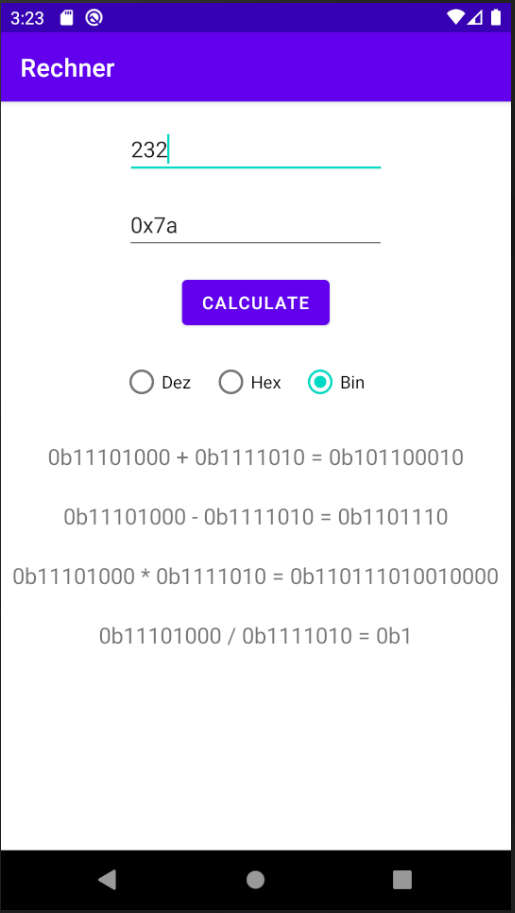

---

**Übung (Zwei-Operanden Rechner)**

Erstelle eine Android App mit 2 Eingebefeldern – in diesen können Zahlen (`int`) eingegeben werden. Weiters gibt es einen Button `RECHNE`. Nach drücken des Buttons wird in 4 Textviews das Ergebnis aller Grundrechenarten mit diesen beiden Operanden angezeigt.

Die Anzeige soll inhaltlich so aussehen:

```
42+3=45
42-3=39
42*3=126
42/3=14
```

- `LinearLayout` oder  `ConstraintLayout` selber wählen
- Ein Absturz des Programms bei einer Fehleingabe (Buchstabe statt Zahl, Division durch null, ...) muss vermieden werden. Bei Eingabefehlern wird in einem zusätzlichen `TextView` eine Fehlermeldung ausgeben. Bei Division durch 0 wird die Ausgabe der Division durch einen entsprechenden Text ersetzt.


---

**Übung (Zwei-Operanden Rechner – Erweiterung I: Zahlensystem sensitiv)**

Zahlen können (zusätzlich zum Dezimalen) Hexadezimal oder Binär eingegeben werden. Dies geschieht durch Vorsatz von `0x` bzw. `0b` vor der Zahl. In den beiden Eingabfeldern können unterschiedliche Zahlensystem verwendet werden. Die Ausgabe erfolgt immer im Dezimalsystem.


---

**Übung (Zwei-Operanden Rechner – Erweiterung II:  konfigurierbare Ausgabe)**

Verwende 3x `RadioButton` um zwischen 3 Ausgabeformate `Bin`, `Hex` und `Dez` wählen zu können.

---

Screenshot der App im Endausbau:

