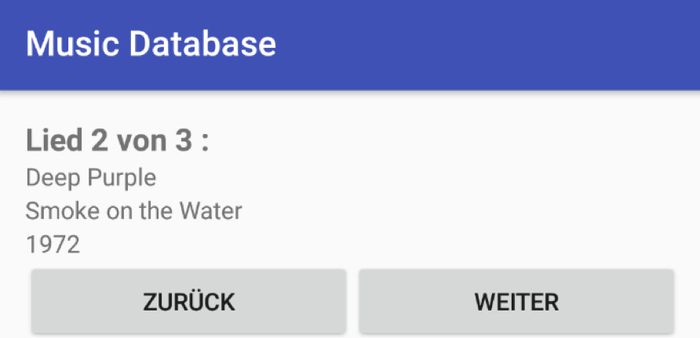
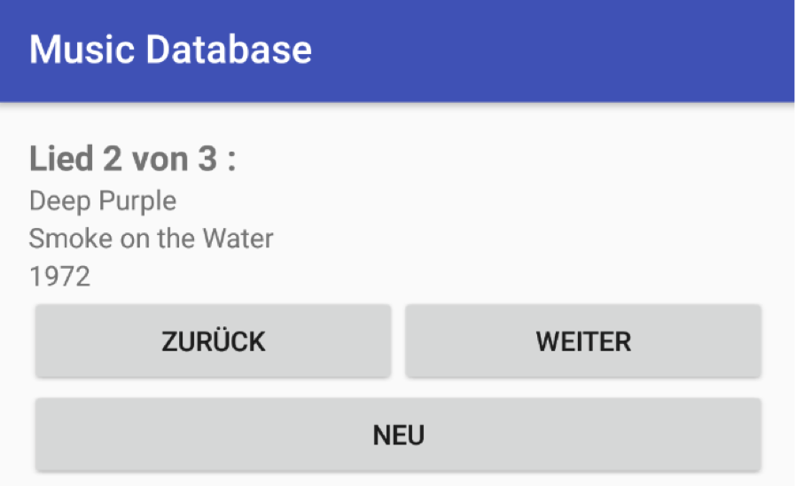
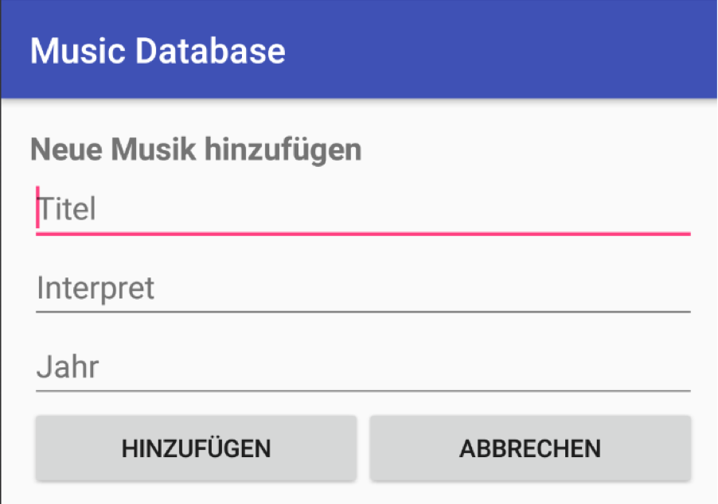

---

**Übung (Musikdatenbank)**

Es sollen Songs verwaltet werden. Für jeden Song: Liedname, Interpret und Erscheinungsjahr.

In der MainActivity wird immer nur ein Titel angezeigt. Man kann mit 2 Buttons in den Songs vor- und zurückblättern.

Beim starten der App sind bereits einige Songs in der Datenbank enthalten. Am Beginn der Liste ist der ZURÜCK Button deaktiviert, am Ende der Liste der WEITER Button.

---

**Übung (Neu)**

Durch einen Button "NEU" kommt man auf eine neue Activity in der das Hinzufügen eines neuen Titels möglich ist. 

Diese Eingabe-Activity hat wiederrum 2 Buttons einen OK Button und einen Cancel Button.

---

**Übung (Löschen)**

Bestehende Titel können gelöscht werden.

---

**Übung (Editieren)**

Bestehende Titel können geändert werden.

---

**Übung (Sortieren)**

Sortieren nach Titel, Interpret oder Jahr auswählbar. Weiters soll auch eine Shuffle Reihenfolge angeboten werden.

