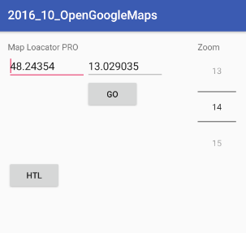

# Google Maps


Öffnen für die Position der HTL Braunau:

```java
val uri: Uri = Uri.parse("geo:48.243540,13.029035?z=17") // latitude, longitude, zoom
val intent = Intent(Intent.ACTION_VIEW)
intent.data = uri
startActivity(intent)
```

+Breite: Nordhalbkugel, -Breite: Südhalbkugel.

+Länge: östlich vom Nullmeridian, -Länge: westlich vom Nullmeridian.


# Übungsaufgabe

- **Basis Funktion**: Button `HTL` öffnet Google Maps mit der Position der HTL Braunau.
- **Erweiterung 1**: Längen- und Breitengrad kann eingegeben werden. Drücken des GO Buttons öffnet Google Maps auf der eingegebenen Position. Zoom Faktor ist 17
- **Erweiterung 2**: Auswahl des Zoom Faktors über `NumberPicker` im Bereich 1–20.




    


