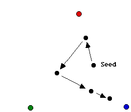

Eines der interessantesten Fraktale entsteht durch ein von Michael Barnsley als "The Chaos Game" bezeichnetes, einfaches Spiel.

Man nimmt die drei Eckpunkte eines, idealerweise gleichseitigen, Dreiecks. Ein Startpunkt (seed) im Inneren des Dreiecks wird beliebig gewählt.

Die Eckpunkte erhalten die Nummern 0, 1 und 2. Es wird eine Ecke **zufällig ausgewählt** und der Startpunkt dann um die Hälfte des Abstands in Richtung dieser Ecke bewegt. Mit dem neuen Punkt macht man dasselbe noch einmal, mit dem nächsten Punkt wieder, und so weiter.

Nach 10 Mal bewegen zeichnet man jeden sich neu ergebenden Punkt am Bildschirm – zeichne 50000 Punkte.

Überlege welches Bild sich ergeben wird. Schreibe ein Programm, das Ergebnis wird dich sehr überraschen!  In der Mathematik nennt man das sich ergebende Bild das Sierpinski Dreieck.

[[Quelle](http://math.bu.edu/DYSYS/chaos-game/node1.html)]

**Erweiterungen:**

siehe: [hier](http://math.bu.edu/DYSYS/chaos-game/node7.html) und [hier](http://www.shiftingmind.com/chaosgame/)

- Starte mit einem regelmäßigen Sechseck, in jedem Schritt 2/3 der Entfernung zu einem zufällig gewählten Eckpunkt zurücklegen. 
Ergibt Sierpinski Hexagon. Die innere Grenze des sich ergebenden Bildes ist ein weiteres Fraktal, nämlich die Koch'sche Schneeflocke.
- Start mit einem regelmäßigen Fünfeck, in jedem Schritt 5/8 der Entfernung zu einem zufällig gewählten Eckpunkt zurücklegen.
- Prüfe ob sich auch bei einem Quadrat ein interessantes Verhalten ergibt.
