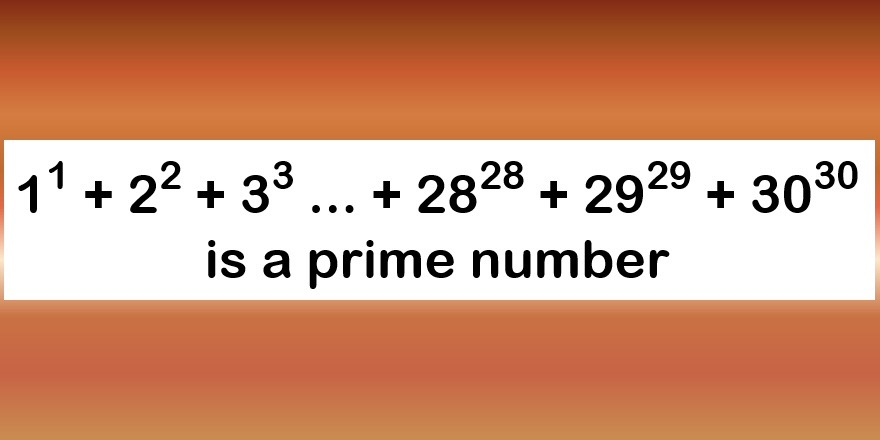

Prüfe ob diese Zahl (siehe Screenshot) tatsächlich eine Primzahl ist.

Beachte, dass die Zahl weder in einem 32 Bit Wert noch einem 64 Bit Wert Platz findet. Am einfachsten sollte die Lösung in **Python** fallen weil int Werte in Python 3 beliebig groß werden können.

