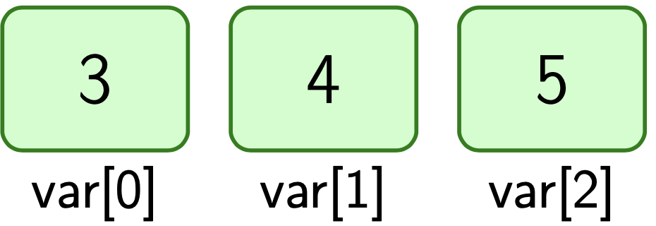

# Arrays – Grundlagen

Arrays dienen zum Speichern einer größeren Anzahl von Variablen.

**Beispiel:**
Ein Radrennen mit 30 Teilnehmern, deren Zeit in Sekunden gemessen wird.


```c
int zeit_01;
int zeit_02;
...
int zeit_30;
```

**Nachteile:**

- Tippaufwand.
- Mühsam zu Bearbeiten (keine Schleifen möglich).


Als **Array**:

```c
int zeit[30];
```

= 30 `int` Variablen

Jedes Element im Array bekommt eine Nummer, diese beginnt bei 0 und wird **Index** genannt.

**Beispiel:**

```c
int var[3];
var[0]=3;
var[1]=4;
var[2]=5;
```




Der Index kann eine Variable sein ⟶ ermöglicht Schleifen.

**Übung:** Welche Werte stehen im Array `var` am Ende des folgenden Programms?

```c
int a[4];
int i;
int n=3
for( i=0; i<4; i++)
{
	var[i]=n;
	n++;
}
```

Arrays können für alle Datentypen angelegt werden.

**Beispiele:**

```c
char zeichen[6];
int xkoo[10];
double laenge[22];
```


Ein Array kann beim Anlegen bereits mit Werten gefüllt werden. Beispiel:
```c
int a[]={5,7,3,1};
```
Die Länge muss dabei nicht angegeben werden.


