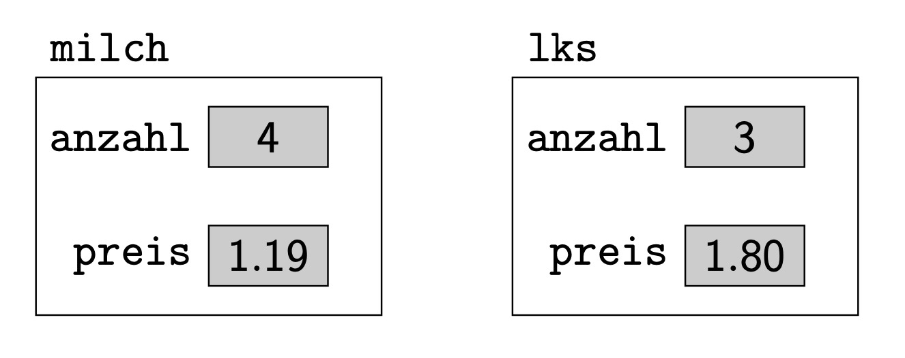
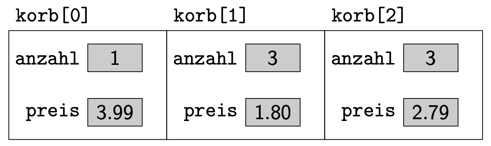

# Strukturen

Eine Struktur ist eine Zusammenfassung mehrerer Variablen.

**Beispiel:**
Menge und Einzelpreis einer gekauften Ware.

```c
struct Einkauf {
    int anzahl; // menge
    double preis; // Einzelpreis
};
```


```c
int main()
{
    Einkauf milch;

    milch.anzahl = 4;
    milch.preis = 1.19;
    
    double gesamt;
    gesamt = milch.anzahl * milch.preis;
}
```

- `struct`: Neuer **Datentyp** (noch kein Speicher!). Dies ist eine Beschreibung wie die Struktur aussieht.
- Davon werden **Variablen** angelegt (Speicher!).
- Diese Struktur-Variablen bestehen aus weiteren Variablen (**Komponenten**).


Durch das Anlegen einer Strukturvariable werden gleichzeitig alle in dieser enthaltenen (Komponenten-) Variablen angelegt.


## Speicher
**Beispiel:** Eingekauft werden 4 Packungen Milch zu je 1,19 und 3 Leberkässemmeln zu je 1,80.
```c
Einkauf milch;
Einkauf lks;

milch.anzahl = 4;
milch.preis = 1.19;

lks.anzahl = 3;
lks.preis = 1.80;
```

Wie dies im Speicher aussieht kann man sich so vorstellen:




---

**Übung (Ein- und Ausgabe):**
Schreibe ein Programm mit dem 2 Einkäufe eingegeben werden können.
Das Programm soll beide Einkäufe ausgeben (Anzahl und Preis) sowie den Gesamtpreis ausrechnen und ausgeben.


---

**Übung (Funktion für Ausgabe):**

Schreibe eine Funktion `printEinkauf` die Preis, Anzahl und Gesamtpreis ausgibt. Es wird eine Strukturvariable übergeben.

```c
void printEinkauf(Einkauf e)
{
	// TODO   
}
```


---

**Übung (Warenbezeichnung):**
Neu: auch die Produktbezeichnung berücksichtigen (Siehe Code). Eingabe für e1,e2,e3 im Hauptprogramm. Ausgabe mittels printEinkauf.

```c
struct Einkauf 
{
  int anzahl;
  double preis;
  char bezeichnung[50]; // <-- !!! neu
};

void printEinkauf(Einkauf e)
{

}

void main()
{
  Einkauf e1;
  Einkauf e2;
  Einkauf e3;
}
```


---


## Arrays von Strukturvariablen

```c
Einkauf korb[3];
```
```c
korb[0].anzahl = 1;
korb[0].preis = 3.99;
...
korb[2].preis = 2.79;
```




---
**Übung (Einkaufskorb):**
Schreibe ein Programm zur Verwaltung eines Einkaufkorbs. Der Korb enthält genau 7 Waren. Schreibe eine Eingabe für alle 7 Waren

Am Ende des Programms soll der gesamte Inhalte des Einkaufkorbs in übersichtlicher Weise dargestellt werden. Denke dabei an einen Kassenbon:


---

**Übung (Einkaufskorb II):**
Ergänze:

- Man soll auch weniger als 7 Stück in den Einkaufskorb legen können.

- 
Ermittle die teuerste Ware (Anzahl * Preis).
- Ergänze eine Strukturvariable (`int`) für die Warengruppe. Es gibt folgende Gruppen:
	
	- 1 – Obst
	- 2 – Getränke
	- 3 – Nahrungsmittel
	- 4 – Süßwaren
	
	Berücksichtige die Warengruppe bei der Ein- und Ausgabe. 
	
- Gib am Ende die Preis-Summe pro Warengruppe aus.

---


## Strukturen und Zeiger

Es können Zeiger auf Strukturvariablen definiert werden.

```c
struct Datum {
  int tag;
  int monat;
  int jahr;
};
```


```c
Datum dat = {22,9,2013};

Datum* p;
p = &dat;

p->tag = 10;
```

"Pfeilschreibweise" bei **Zeiger auf** Strukturen – Sonst müsste `(*p).tag` geschrieben werden, weil `.` eine höhere Priorität als `*` hat.

Im Speicher kann man sich das folgendermaßen vorstellen:


```c
Datum dat = {22,9,2013};
Datum* p;
p = &dat;
p->tag = 10;
```


### Anwendung – Zeiger
Für die Parameterübergaben an Funktionen.

- Bei der Parameterübergabe an Funktionen wird kopiert (call-by-value).
- Strukturen sind meist etwas umfangreicher.
- Kopieren braucht Zeit.
- Ein Zeiger alleine ist schneller kopiert als die ganze Struktur.


**Beispiel:**

```c
struct Datum
{
  int tag;
  int monat;
  int jahr;
};
```


```c
void heute(Datum* d)
{
  d->tag = 11;
  d->monat = 11;
  d->jahr = 2011;
}
```


```c
main()
{
  Datum h;
  heute(&h);
  printf("%02d.%02d.%d\n",h.tag,h.monat,h.jahr);
}
```


---

**Übung (Ein- und Ausgabe):**

Schreibe eine Funktion `inputDatum` zur Eingabe und eine Funktion `outputDatum` zur Ausgabe eines Datums. Verwende die Struktur `Datum` und übergib die Struktur immer als Zeiger.


---

**Übung (Kalendereintrag):**

In einem Test/Schularbeitenkalender sollen Datum und Bezeichnung des Fachs erfasst werden. Verwende dazu die Struktur:

```c++
struct KalenderEintrag
{
  Datum am;
	char bezeichnung[50];  
};
```

Schreibe eine Funktion `inputKalenderEintrag` zur Eingabe und eine Funktion `outputKalenderEintrag` zur Ausgabe eines Kalendereintrags. Übergib die Struktur in beiden Fällen als Zeiger.

Hinweis:

```c++
void foo(KalenderEintrag* pKalender) 
{
  int tag;
	// beachte die Anwendung von `->` und `.`
  tag = pKalender->am.tag;
}
```


---

**Übung (Kalender):**

Ermögliche die Eingabe für ein Array aus 5 Kalendereinträgen. Nachdem alle eingegeben wurden sollen alle Kalendereinträge wieder ausgegeben werden, markiere dabei alle Einträge die im Februar sind mit einem vorgesetzten  `*`.


---

**Übung (Datum vergleichen):**

Schreibe eine Funktion die 2 als Zeiger übergebene Datums-Strukturen vergleicht.
Ist das erste Datum früher soll die Funktion 1, bei Gleichheit 0 und falls das erste Datum später als das zweite ist –1 zurückgeben.


---

**Übung (Sortieren)**

Sortiere den Kalender nach aufsteigendem Datum. Verwende Bubble Sort und die vorher implementierte Funktion zum Vergleiche von 2 Datums-Strukturen.


 
