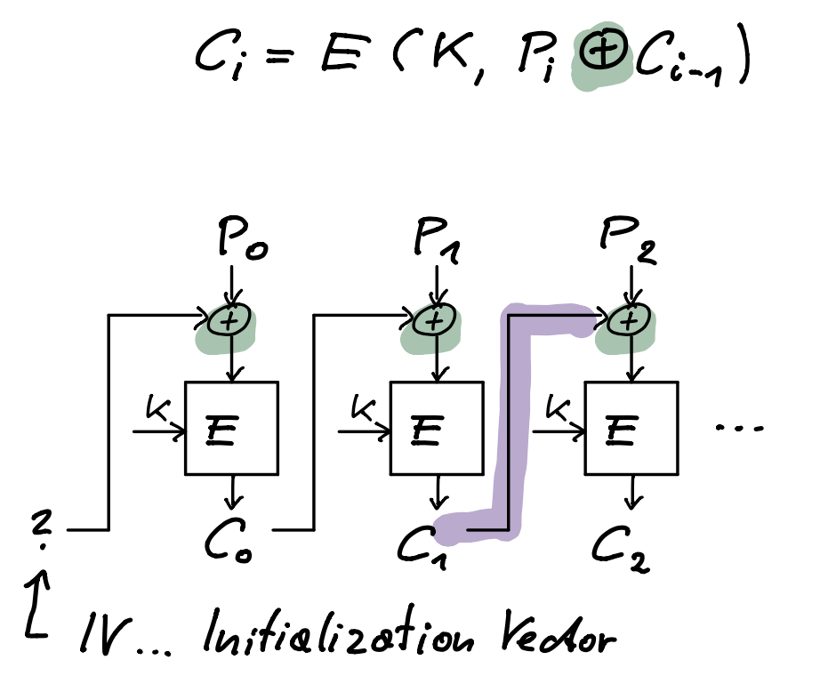

* TOC
{:toc}
Einteilung:

- Symmetrisch (Sender und Empfänger haben gleichen key – shared secret key)
  - stream-cipher
  - block-cipher
- Asymmetrisch (Sender und Empfänger haben unterschiedliche keys)
  - public key cryptography

Eigenschaften:

- plaintext, key, ciphertext: Sind Binär, d.h. Strings aus Bits (0/1)

- ciphertext gleiche Anzahl Bits wie plaintext

# One-Time-Pad

 symetrischer key: zufällig gewählter Bit-String so lang wie plaintext
$$
c=p \oplus pad
$$
Beim Empfänger:
$$
p = c \oplus pad
$$
XOR 2x angewendet hebt sich auf!
$$
p=c \oplus pad = (p \oplus pad) \oplus pad = p \oplus (pad \oplus pad) = p \oplus 0 = p
$$
One-Time-Pad ist absolut sicher aber nicht praktikabel.

# Stream-Cipher

**Stream-Cipher**: Annäherung an One-Time-Pad

- Wähle eine Start-Bitfolge $K_0$ (128 bzw. 256 Bits) als seed
- $K_0$ ist der symmetrische Schlüssel (shared secret key)
- R (*random*) ist ein besonders guter (Pseudo-) Zufallszahlengenerator
- $K_1=\text{R}(K_0)$
- $K_2=\text{R}(K_1)$, usw
- Schlüssel werden aneinandergefügt $K_0 \mathbin\Vert K_1 \mathbin\Vert K_2 \mathbin\Vert K_3 \mathbin\Vert \ldots$ dann XOR mit plaintext

# Block-Cipher

Häufigst verwendet.

- Älter: DES, Triple-DES, Data Encryption Standard
- Aktuell: **AES**, Advanced Encryption Standard

plaintext wird in 128 Bit lange Blöcke zerteilt, aus diesen plus dem key (128 oder 256 Bits) entstehen 128 Bit ciphertext.
$$
C_i = \text{E}(K,P_i)
$$

- $P_i$ ... $i$-ter 128 Bit Plaintextblock

- $\text{E}$ ... Encrypt, Verschlüsselungsfunktion

- $K$ ... Key (128 oder 256 Bit)

- $C_i$ ...  $i$-ter 128 Bit Ciphertextblock

Entschlüsseln
$$
P_i = \text{D}(K,C_i)
$$

Dieses Verfahren wird **ECB** (electronic code book) Mode genannt.

## CBC

Mit **CBC** (Cipher Block Chaining) Mode, werden die Daten noch besser unkenntlich gemacht.

XOR des i-ten plaintext Blocks mit dem vorhergehenden ciphertext Block
$$
C_i = \text{E}(K,P_i \oplus C_{i-1}) \\
C_0 = \text{IV}
$$

- IV ... initialization vector – Zufällige Zahl

## CTR

[Counter Mode](https://en.wikipedia.org/wiki/Block_cipher_mode_of_operation#Counter_(CTR))

## OFB

Output Feedback Mode. Folge von Schlüsseln $K_0, K_1, K_2, \ldots$ wird mit Plaintext XORed. Wie **Stream Cipher**.
$$
K_i = \text{E}(K,K_{i-1}) \\
K_0 = \text{IV}
$$
Es wird jeweils der Vorgänger-Key verschlüsselt.

$K_1, K_2, \ldots$ verhalten sich wie Zufallszahlen ⇒ Block-Cipher ist auch ein Zufallszahlengenerator.

