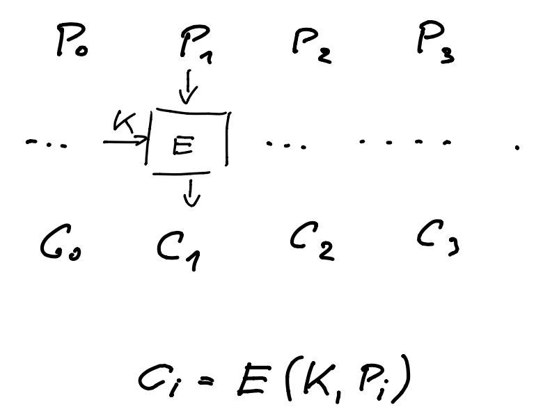
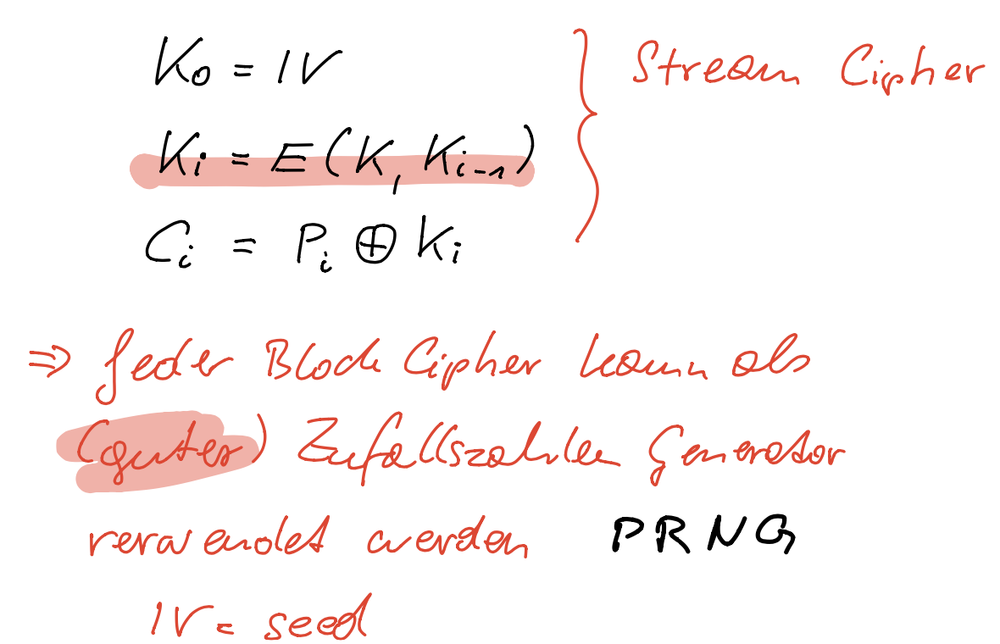

# Block cipher

Sind **shared secret key** Verfahren und werden aktuell am häufigsten eingesetzt.

Die Block (und Schlüssel) Größe ist zum Beispiel **16 Byte** (128 Bits).
Ein block cipher macht aus einem Block plaintext mit Hilfe des Schlüssels einen gleich langen Block ciphertext.

Die Verfahren sind sehr symetrisch – d.h. Die Mechanismen für die Verschlüsselung unterscheiden sich meist nur wenig von der Entschlüsselung. Weiters lassen sich diese Verfahrung gut in HW (FPGA) implementieren.

Um längere Nachrichten (> 16 Bytes) zu Verschlüsseln werden die Daten in Blöcke aufgeteilt und einzeln per block cipher verschlüsselt. Um dabei die Angriffsmöglichkeiten gering zu halten existieren unterschiedliche Verfahren die als **block cipher modes** bezeichnet werden.

# Ideale block cipher

Mathematisch gesehen ist ein block cipher eine **Permutation**. Dabei wird jeder Zahl des plaintexts **genau eine** Zahl im ciphertext zugeordnet. Dies kann als Tabelle dargestellt werden.  Wie die Permutation aussieht bestimmt der Schlüssel.

Ideal ist die Permutation dann, wenn diese von einem Angreifer nicht von einer völlig zufälligen Permutation unterschieden werden kann. 

In der Praxis werden sogenannte **Pseudo Random Permutation** (PRP) verwendet, die diesem Ziel möglichst nahe kommen.

# Block Cipher Praxis

Gängige Block Größe ist 16 Bytes (128 Bits).

Problem: Die Permutation kann dafür, aus Platzgründen, nicht als Tabelle definiert werden (bräuchte $2^{128}$ Einträge).

In der Praxis werden kleinere (und damit kryptografisch schwächere) Permutationen verwendet. Diese werden in sogenannten **rounds** mehrfach hintereinander ausgeführt (z.B. 16 Mal). Dadurch entsteht eine starke Verschlüsselung. In jeder round wird ein anderer Schlüssel verwendet, dazu werden durch **key expansion** aus dem ursprünglichen key einzelne **round keys** berechnet.

Für block cipher ist ebenso ein wichtige Anforderung dass diese **effizient** in **Soft-** und auch **Hardware** implementiert werden können.

2 Beispiele für Verfahren:

- DES / 3DES
- AES

## DES

Data Encryption Standard (1977),
[wikipedia](https://en.wikipedia.org/wiki/Data_Encryption_Standard)

- Keys: 56 Bits
- Block size: 64 Bits

16 rounds mit 16 round keys

56 Bit key ist zu klein, nicht mehr sicher. Aufwand für das Durchsuchen des kompletten key space: ca. 1 Tag.

Lösung: 3DES (Triple DES, 1998), 3 mal mit DES (mit unterschiedlichen keys => 168 Bit key) verschlüsseln.

## AES

Advanced Encryption Standard (2001), [wikipedia](https://en.wikipedia.org/wiki/Advanced_Encryption_Standard). Gilt als der **aktuell sicherste** block cipher. Nachfolger von DES.

- Keys: 128, 192, 256 Bits
- Block size: 128 Bits

10 rounds mit 11 round keys 

Spezielle Erweiterungen ([AES instruction set](https://en.wikipedia.org/wiki/AES_instruction_set)) in Prozessoren (Intel seit Westmere 2009, AMD Bulldozer 2011)

Details: [The AES encryption algorithm](http://www.samiam.org/rijndael.html), [Video: AES Explained (Advanced Encryption Standard) - Computerphile [14:13]](https://youtu.be/O4xNJsjtN6E)

# Block cipher mode

Nachrichten haben normalerweise ein Vielfaches der typischen 128 Bit Blocklänge. Zur Verschlüsselung wird die lange Nachricht aufgeteilt und falls notwendig am Ende mit einem Padding versehen.
Jeder Block wird einzeln verschlüsselt und das Ergebnis zum ciphertext zusammengesetzt.
Die Mechanismen nach denen dies passiert nennt man *block cipher mode*.
[wikipedia: Block cipher mode of operation](https://en.wikipedia.org/wiki/Block_cipher_mode_of_operation)

## Electronic Code Book Mode

Mit dem ECB (Electronic Code Book) mode wird jeder entstandene Block mit dem gleichen Schlüssel verschlüsselt. 

Dies ergibt jedoch ein **unsicheres** Verfahren, da dadurch die Struktur der verschlüsselten Daten nicht verschleiert wird. Selber plaintext ergibt gleichen ciphertext, ein Angreifer lernt dadurch etwas über den Inhalt. 

Beispiel, Bild (a) wurde mit ECB verschlüsselt, siehe (b) :

Gute block modes, haben dieses Problem nicht. Beispiele:

- [CBC](https://en.wikipedia.org/wiki/Block_cipher_mode_of_operation#Cipher_Block_Chaining_.28CBC.29) (Cipher Block Chaining)
- [CTR](https://en.wikipedia.org/wiki/Block_cipher_mode_of_operation#Counter_.28CTR.29) (Counter), siehe Bild (c)

## Cipher Block Chaining Mode (CBC)

Wahl des IV (Initialisation Vector)?  Wichtige Eigenschaft: IV Wert darf sich nicht wiederholen und soll für einen Angreifer unvorhersagbar sein.:

- **random** IV. Wird in der Nachricht unverschlüsselt mitgeschickt.
- **nonce** based IV (number used once). nonce ermittelt aus message number und anderen Werten. Die nonce wird verschlüsselt und das Ergebnis als IV verwendet. 

## Output Feedback Mode (OFB)

## Counter Mode (CTR)

Mittels nonce und einem counter wird ein **key stream** für eine stream cipher gebildet.

Hintergrund: jede block cipher ist ein PRNG (pseudo random number generator).

## Welcher Mode

Literatur:

- CBC+Random IV
- CTR ist auch gut aber man kann bei der Implementierung mehr falsch machen

# Test auf Sicherheit

- CPA - choosen plaintext attack
- CCA - chosen ciphertext attack

Der Angreifer hat die Möglichkeit, beliebige ciphertext zu entschlüsseln. Der Angriff ist erfolgreich wenn dadurch der Schlüssel ermittelt werden kann.

# Padding

Die Art und Weise des Paddings hat keine Auswirkung auf die Sicherheit des Verfahrens.

Siehe [Padding schemes for block ciphers](https://www.cryptosys.net/pki/manpki/pki_paddingschemes.html).

