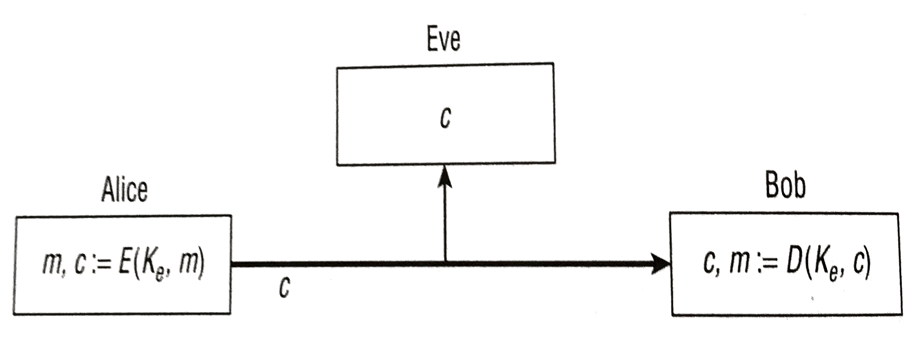
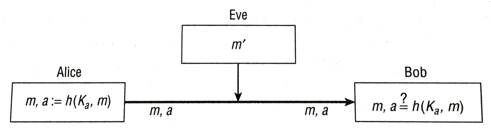
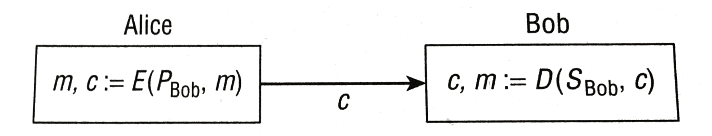

# Https

Der Anteil der durch https verschlüsselten Webseiten liegt aktuell bei 83%–August 2020 (66%–November 2017). ([Quelle](https://letsencrypt.org/stats/)).

Die Grundlage von https ist das **kryptographische Protokoll** TLS (*transport layer security*).
TLS verbindet 2 Kommunikationspartner (meist Browser/Client und Web/Server) und sorgt dafür, dass Daten im Netzwerk:

- **unentzifferbar**,
- **unverfälschbar**,
- **authentifizierbar**, und
- **nicht abstreitbar** sind.

Das Ziel des Themas "Kryptographie" ist die Arbeitsweise von TLS zu verstehen.

# Kryptographie

Begriffe: Alice, Bob, Eve, plaintext, key, ciphertext

Modell: **Alice** schickt eine Nachricht an **Bob**.

Wenn Bob diese empfängt soll

- niemand anderem der Inhalt bekannt sein (*confidentiality*)
- eine Manipulation des Inhalts von Bob erkannt werden (*integrity*)
- sich Bob sicher sein dass Alice der Absender ist (*authenticity*)

Diese Bedinungen sollen auch dann eingehalten werden, wenn
zwischen Alice und Bob ein Angreifer **Eve** sitzt der vollen Zugriff auf den Kommunikationskanal hat. 
D.h. Eve kann:

- Nachrichten lesen
- Sich als Alice ausgeben und an Bob schreiben
- Nachrichten verändern
- Nachrichten löschen
- Reihenfolge der Nachrichten ändern
- Nachricht speichern und nochmals senden (*replay attack*)

Konkrete Systeme:

- Bluetooth
- WLAN (WPA2, WPA3)
- TLS (=https)

Weitere Anwendungen:

- Files verschlüsseln
- Anonyme Kommunikation (VPN proxies, "Darknet", Tor)
- Digitale Währung (Bitcoin)
- E-Voting

# Übersicht

- shared secret key cipher (encryption, confidentiality)
- secure hash function
- Message Authentication Code, MAC (integrity, authenticity)
- secure channel: encrypt+MAC
- public key encryption
- digital signatures
- PKI (*public key infrastructure*), =Zertifikate

## Shared secret key encryption
Alice und Bob haben den gleichen Schlüssel (*symetric key*) $K_e$ und halten diesen geheim (*secret key*).

**[Kerckhoff Prinzip](https://de.wikipedia.org/wiki/Kerckhoffs'_Prinzip):** Angreifer weiß **alles** über das Verschlüsselungsverfahren, **nur** der Schlüssel ist geheim. (Gegenteil von *Security through obscurity*). Grundprinzip moderner Verschlüsselungsverfahren.

## Message Athentication Code (MAC)

Alice berechnet einen **unfälschbaren digitalen Fingerabdruck** der Daten (mit Hilfe einer Hash Funktion 
und eines *shared secret key*: $K_a$).
Verändert Eve die Nachricht kann dies durch Bob erkannt werden.

## Public key encryption

Problem bei *shared secret key*: Sicherer Austausch der Schlüssel. **Public key** systeme lösen dieses Problem sehr elegant.

Prinzip:

- Bob hat 2 Schlüssel: einen *public key* ($P_{Bob}$) und einen *private key* ($S_{Bob}$).
- Den *public key* kann Alice (und jeder andere) zum verschlüsseln verwenden.
- Nur Bob kann den entstehenden ciphertext mit dem *private key* entschlüsseln.

## Digital signature

Um eine Nachricht m digital zu unterschreiben, verschlüsselt Alice m mit ihrem **private key** und erhält die Signatur s.
Alice schickt m und s zu Bob.
Bob entschlüsselt s mit Alice' *public key*, und vergleicht das Ergebnis mit m.
Bei Übereinstimmung kann Bob sich sicher sein, dass m von Alice stammt.

# XOR

XOR ist eine **umkehrbare boolsche Funktion** und daher für die  Ver- und Entschlüsselung eine geeignete und intensiv verwendete Basis. Dabei ist die Umkehrfunktion von XOR wiederum XOR:

Beispiel - Bitfolge A wird mit G verschlüsselt. 
$B=A \oplus G$
$B \oplus G=(A \oplus G) \oplus G=A \oplus (G \oplus G)=A \oplus 0=A$

# One time pad

Gilt als absolut sicher. Schlüssel k ist so lang wie der plaintext p. 

Verschlüsselung durch bitweises XOR:
$c=p \oplus k$

Entschlüsseln:
$p=c \oplus k$

Anforderung an den Schlüssel: nicht von einer zufälligen Bitfolge unterscheidbar.

## Was ist sicher?    

Mehrere Definitionen, z.B. CPA (chosen plaintext attack). 

- Angreifer generiert 2 plaintexts. 
- Diese werden verschlüsselt, eines davon wird zufällig dem Angreifer zurückgeschickt. 
- Die Wahrscheinlichkeit, dass der Angreifer plaintext richtig zuordnen kann soll nicht wesentlich besser sein als 0,5 ($Vorteil <2^{-90}$). D.h. nicht viel besser als eine zufällige Wahl.

# Stream cipher

Ein one time pad ist aufgrund der langen Schlüssel in der Praxis nicht anwendbar. Beim *stream cipher* Verfahren wird daher aus einem Schlüssel (der z.B. 128 Bits groß ist) eine beliebig lange Bitfolge erzeugt die dann wie ein one time pad verwendet wird.

Prinzip:

- Schlüssel k wird als seed für einen **PRNG** (pseudo random number generator) verwendet. 
- Dadurch entsteht ein **key stream** der genau so lang ist wie der plaintext.
- Der Plaintext wird durch XOR mit dem keystream verschlüsselt.
- Entschlüsselt wird durch XOR des ciphertext mit dem gleichen keystream.

Achtung: Möglicher **Angriff** wenn ein Schlüssel wiederverwendet wird:
$(m_1 \oplus k) \oplus (m_2 \oplus k)$ - Schlüssel fällt weg!

# Integrity attack

Verschlüsseln löst nicht das Problem, dass ein Angreifer die Nachricht **verändert**.

Alice verschickt zum Beispiel die Nachricht:
"pay Bob 1000 EUR"

Wenn nun der Angreifer weiß, dass "Bob" in der Nachricht an einer bekannten Position steht, kann dieser den Text beliebig ändern und aus aus "Bob" wird z.B. "Eve". Beispiel für den Buchstaben B:

- Verschlüsselt: $c=(\text{'B'} \oplus k)$ 
- Angreifer ändert: $c \oplus (\text{'E'} \oplus \text{'B'})$
- Entschlüsseln: $(\text{'B'} \oplus k) \oplus (\text{'E'} \oplus \text{'B'}) \oplus k = \text{'E'}$

# Exhaustive search

Angriff mittels durchprobieren aller möglichen Schlüssel für 2-3 bekannte plaintext/ciphertext Paare.

Ein Verfahren **gilt als sicher** wenn **nur** exhaustive search als Angriff bekannt ist und mindestens $2^{90}$ Versuche notwendig sind um den richtigen Schlüssel zu finden.

Beispiel: 

- keyspace 128 bits, d.h. $2^{128}$ mögliche keys, 
- Annahme: $2^{32}$ Tests pro Sekunde (sehr sehr schneller Rechner!)
- $2^{128}/2^{32} = 2^{96} = 7.9\ 10^{28}$ Sekunden (ca. $2\ 10^{11}$ mal Alter des Universums)
- Alter Universum: 13.8 Milliarden Jahre ($4.4\ 10^{17}$ Sekunden)
- Bei $2^{90}$ Suchschritten ergibt sich ca. die Lebensdauer der Sonne.

Ein Angriff ist also immer möglich aber **sehr unpraktikabel** wenn der keyspace groß genug ist.

