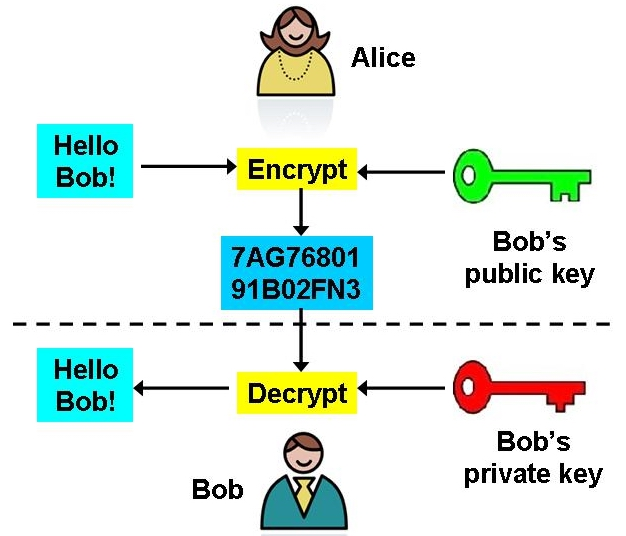

*shared secret key* Verschlüsselungssysteme haben zur Voraussetzung, dass beide Kommunikationspartner über den gleichen Schlüssel verfügen (*shared symetric key*) und diesen geheim halten. Die große Problematik ist Angriffe im Moment des Schlüsselaustauschs zu verhindern.

**Public-key cryptography** ist eine innovative Idee aus den 1970er Jahren die einen solchen Angriff unmöglich macht. 

Dabei gibt es 2 Schlüssel:

- einen geheimen **private key** der nicht weitergegeben wird und
- einen öffentlichen **public key** der ohne Einschränkung verbreitet werden kann.

Anwendung:

- *encryption* (selten da sehr rechenaufwändig)

- *symmetric key* transport (*key exchange*)

- *digital signature (in Verbindung mit Hash Funktion)*

  

# RSA Verfahren

Bekanntestes public-key Verfahren. Rivest-Shamir-Adleman / public key cryptosystem. Turing Preis 2002. [wikipedia](https://en.wikipedia.org/wiki/RSA_(cryptosystem))

# Encryption

Ablauf: Alice will an Bob eine verschlüsselte Nachricht schicken.

- Bob berechnet aus großen Primzahlen 2 Schlüssel (**public key** und **private key**). Der public key wird öffentlich zugänglich gemacht der private key geheim gehalten.
- Alice holt sich **Bobs public key**, **verschlüsselt** die Nachricht damit und schickt sie an Bob.
- Bob verwendet seinen **private key** um die Nachricht zu **entschlüsseln**.
- **Eve** die die Nachricht abhört kann die Nachricht ohne den private key nicht entschlüsseln. Eve hat Zugang zum public key, aber mit diesem kann nicht entschlüsselt werden.
- Für Kommunikation in **umgekehrter Richtung** (Bob an Alice) muss Alice ein weiteres public/private Schlüsselpaar erzeugen.

Aufgrund des **extremen Rechenaufwands** (rechnen mit Zahlen die tausende Stellen haben können) wird RSA nicht zum verschlüsseln der gesamten Kommunikation verwendet.

Stattdessen generiert Alice einen **shared secret key** (für stream- oder block-cipher) und schickt diesen mit dem public key verschlüsselt an Bob.  Bob und Alice verwenden dann weiters eine stream- oder block-cipher für die weitere Kommunikation.

# Key exchange

Der Kommunikationspartner mit dem public key ermittelt einen zufälligen shared secred key und schickt diesen per RSA verschlüsselt an die andere Seite wo dieser mit dem private key entschlüsselt wird. Dieser ausgetauschte Schlüssel wird nur kurzzeitig verwendet.

# Digitale Signatur

Mit dem RSA Verfahren kann auch der **private key zum verschlüsseln** verwendet werden. Eine solche Nachricht kann durch den **public key entschlüsselt** werden. Da der public key jedem zur Verfügung steht ist diese Nachricht **nicht geheim**.

Allerdings ergibt die Entschlüsselung nur dann sinnvolle Daten wenn ver- und entschlüsselung mit einem zusammenpassenden private/public Schlüsselpaar erfolgte.

Das bedeutet eine **Fälschung der Nachricht** ohne den private key ist nicht möglich.

Für die digitale Unterschrift wird die Nachricht doppelt und zwar einmal unverschlüsselt und ein andermal mit dem private key verschlüsselt von Alice an Bob gesendet. 

Stimmen bei Bob nach dem entschlüsseln beide Teile der Nachricht überein, dann weiß Bob:

- die Nachricht ist sicher von Alice (der private key ist nicht fälschbar)
- die Nachricht wurde von niemanden verändert

Aufgrund des **Rechenaufwands** sieht die Praxis wieder etwas anders aus. Die zu unterschreibenden Daten werden **zuerst gehasht** (z.B. SHA256) und dann mit dem private key verschlüsselt. Diese digitale Signatur wird den Daten angefügt.

## Beispiel für Größenordnungen

- private/public key: 4096 bits
- Hashwert: 256 bits
- Digitale Signatur: 4096 bits (wie key) 

## Andere Signatur Verfahren

Ein weiteres gängiges Verfahren für die Digitale Signatur ist **DSA** (Digital Signature Algorithm) dies kann nur für digitale Signatur aber **nicht zum Verschlüsseln** verwendet werden.

# Mathe

RSA verwendet wie DH Modulo Multiplikationen.

Im ersten Schritt werden 2 große **Primzahlen** $p$ und $q$ zufällig gewählt.  $p$  und $q$ sollten ungefähr gleich groß sein.

- $n=p*q$ ist der **Modulus** der Multiplikationen ($n$ ist keine Primzahl).

- Eine Zahl $e$, der **Exponenent**, wird gewählt. Häufig 65537, 17, 5 oder 3.

- Das Paar $(n,e)$ ist der **public key**.

Nun wird das kleinste gemeinsame Vielfache $t$ von $p-1$ und $q-1$ bestimmt.

$t=\text{kgV}(p-1,q-1)$

Dieses $t$ hat die Eigenschaft: $x^t=1\ (\text{mod}\ n)$, für beliebiges $x$. [1]

Eine Zahl $d$ wird ermittelt, so dass gilt:

$e*d=1\ (\text{mod}\ t)$

Bedeutet: $d$ ist das inverse zu $e$ modulo $t$. 

Anders: $e*d=k*t+1$ für ein bestimmtes $k$. [2]

$d$ ist der **private key** (wird gemeinsam mit $p$, $q$ und $t$ geheim gehalten).

Verschlüsselung:
Die Nachricht $m$ wird als Zahl dargestellt (z.B. 128/256 bits).

Ciphertext: $c=m^e\  (\text{mod}\ n)$

Entschlüsselung: $c^d\  (\text{mod}\ n)$ ergibt $m$

Beweis (alles $\text{mod}\ n$):

$c^d=(m^e)^d=m^{ed}$

Durch [2] ist $e*d=k*t+1$.

$m^{ed}=m^{kt+1}=(m^t)^k*m$

Wegen [1] ist $m^t=1$

$(m^t)^k*m=(1)^k*m=m\  (\text{mod}\ n)$

- Geheimhaltung: Ist einem Angreifer nur eine Zahl $d$, $p$, $q$ oder $t$ bekannt so wäre ein entschlüsseln möglich.
- Gängige Größe für $n$: 4096 Bits.

# Kryptografische Stärke

Ergibt sich aus der Tatsache, dass es sehr **leicht** ist 2 Zahlen zu **multiplizieren** $n=p*q$, es aber ungleich **schwieriger** ist aus dem $n$ die beiden **Faktoren** wieder herauszurechnen (siehe [Integer factorization](https://en.wikipedia.org/wiki/Integer_factorization)). $n$ ist ein wesentlicher Teil des public key, gelänge es einem Angreifer $p$ oder $q$ zu ermitteln wäre die Verschlüsselung gebrochen. Die Sicherheit des RSA Verfahrens ergibt sich aus der Tatsache dass diese Faktorisierung nur unter riesigem Rechenaufwand möglich ist.

Beispiel: [RSA-768](https://en.wikipedia.org/wiki/RSA_numbers#RSA-768) (Zahl mit 232 Stellen faktorisieren). CPU-Zeit: 2000 Jahre

D.h. wählt man $n$ groß genug und gibt dieses öffentlich bekannt, hält $p$ und $q$ aber geheim, so ist es einem Angreifer praktisch unmöglich $p$ und $q$ herauszufinden.

Da es theoretisch mit genug Rechenpower und Zeit möglich sein könnte, dass eine Faktorisierung gelingt sind **RSA Keys** in der Praxis mit einem **Ablaufdatum** versehen (einige Jahre).

