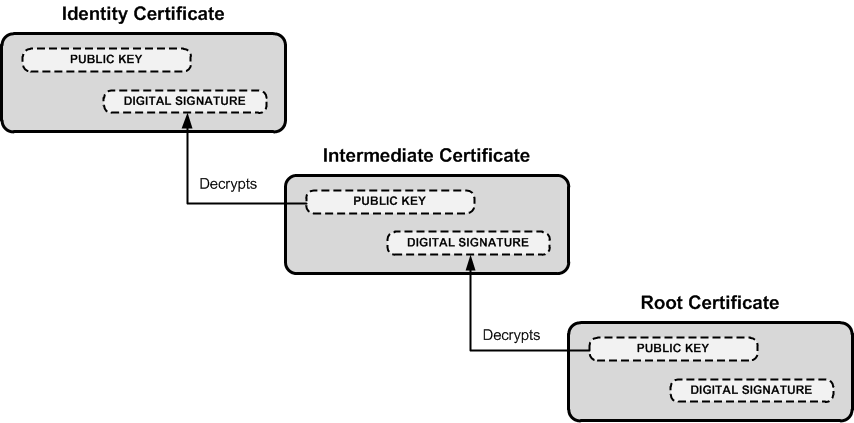

Fragen bei public key crypto:

- Wie kommt man zum public key? und
- wie weiß man dass dieser nicht gefälscht ist?

Lösung:

- **Zertifikate**, und
- **Public key infrastructure** (PKI)

# Zertifikat

Ein Zertifikat ist ein elektronisches Dokument dass den public key des sogenannten **subject** enthält. Der **issuer** (certification authority = CA) bestätigt durch digitale Unterschrift (mit private key verschlüsselter Hash) die Identität des subject. 

Der CA wird von allen vertraut.

Der **private key des CA** ist für die Sicherheit von zentraler Bedeutung und muss offline gelagert werden. Um das Erstellen von Zertifikaten zu vereinfachen gibt es daher ein **Intermediate CA**.
Es entsteht eine **certificate chain**, das End-User Zertifikat verweist auf das Intermediate und dieses auf das root Zertifikat.

Das root Zertifikat ist *self signed* mit dem private key des CA.




Zur Authentifizierung schickt der Server die certificate chain an den client. Die root Zertifikate werden nicht mitgeschickt sondern sind im Betriebssystem (oder Browser) im **root trust store** verwaltet. Der client prüft das **identity certificate** durch den im **intermediate certificate** enthaltenen public key. Ebenso wird das **intermediate certificate** durch den public key im **root certificate** validiert.

Dem root certificate wird immer vertraut, der Sicherheit des root trust store kommt daher eine zentrale Bedeutung zu (z.B. Cyberangriff mittels Trojaner).


# X.509

Das Format eines Zertifikats ist im **Standard X.509** definiert.

Felder:

- Version, aktuell V3
- Serial Number, identifiziert das Zertifikat eindeutig
- Issuer Distinguished Name (DN)
- Subject Distinguished Name
- Validity Period (ein Zertifikat läuft ab)
- public key
- Signature und Signature Algorithm (z.B. `sha256WithRSAEncryption`)


# Beispiel Zertifikat

für `www.example.org`

```
echo | \
    openssl s_client -servername www.example.com -connect www.example.com:443 2>/dev/null | \
    openssl x509 -text
```


```
Certificate:
    Data:
        Version: 3 (0x2)
        Serial Number:
            0e:64:c5:fb:c2:36:ad:e1:4b:17:2a:eb:41:c7:8c:b0
        Signature Algorithm: sha256WithRSAEncryption
        Issuer: C=US, O=DigiCert Inc, OU=www.digicert.com, CN=DigiCert SHA2 High Assurance Server CA
        Validity
            Not Before: Nov  3 00:00:00 2015 GMT
            Not After : Nov 28 12:00:00 2018 GMT
        Subject: C=US, ST=California, L=Los Angeles, O=Internet Corporation for Assigned Names and Numbers, OU=Technology, CN=www.example.org
        Subject Public Key Info:
            Public Key Algorithm: rsaEncryption
            RSA Public Key: (2048 bit)
                Modulus (2048 bit):
                    00:b3:40:96:2f:61:63:3e:25:c1:97:ad:65:45:fb:
                    ef:13:42:b3:2c:99:86:f4:b5:80:0b:76:dc:06:38:
                    2c:1f:a3:62:55:5a:36:76:de:ae:5d:fc:e2:e5:b4:
                    e6:ec:5d:ca:ee:ca:df:50:16:24:2c:ee:fc:9a:b6:
                    8c:f6:a8:b3:ac:7a:08:7b:2a:1f:ad:5f:e7:fa:96:
                    59:25:ab:90:b0:f8:c2:3f:13:04:26:74:68:0f:c6:
                    78:2a:95:8a:5f:42:f2:0e:ed:52:a6:eb:68:23:89:
                    e5:43:f8:6d:12:1b:62:42:7b:a8:05:f3:59:c4:5e:
                    d6:c5:cc:46:c0:4b:19:b9:2d:4a:71:72:24:1e:5e:
                    55:44:93:ab:78:a1:47:4d:a5:dc:07:5a:9c:67:f4:
                    11:68:12:2f:d3:28:71:bc:ad:72:05:3c:16:75:d4:
                    f8:72:58:ba:19:f1:dc:09:ed:f1:18:c6:92:2f:7d:
                    bc:16:0b:37:8d:8a:ef:1b:6f:4f:b9:e0:7a:54:98:
                    bf:b5:b6:cf:bb:aa:93:7f:0a:7f:1f:56:eb:a9:d8:
                    e1:db:d5:39:d8:18:5b:d1:f2:64:33:d0:d6:c4:23:
                    ff:09:ab:6d:71:ce:da:cf:c1:17:9c:23:be:2c:af:
                    2f:92:1c:3f:90:08:89:58:f2:b1:e1:10:6f:83:2e:
                    f7:9f
                Exponent: 65537 (0x10001)
        X509v3 extensions:
            X509v3 Authority Key Identifier: 
                keyid:51:68:FF:90:AF:02:07:75:3C:CC:D9:65:64:62:A2:12:B8:59:72:3B

            X509v3 Subject Key Identifier: 
                A6:4F:60:1E:1F:2D:D1:E7:F1:23:A0:2A:95:16:E4:E8:9A:EA:6E:48
            X509v3 Subject Alternative Name: 
                DNS:www.example.org, DNS:example.com, DNS:example.edu, DNS:example.net, DNS:example.org, DNS:www.example.com, DNS:www.example.edu, DNS:www.example.net
            X509v3 Key Usage: critical
                Digital Signature, Key Encipherment
            X509v3 Extended Key Usage: 
                TLS Web Server Authentication, TLS Web Client Authentication
            X509v3 CRL Distribution Points: 
                URI:http://crl3.digicert.com/sha2-ha-server-g4.crl
                URI:http://crl4.digicert.com/sha2-ha-server-g4.crl

            X509v3 Certificate Policies: 
                Policy: 2.16.840.1.114412.1.1
                  CPS: https://www.digicert.com/CPS
                Policy: 2.23.140.1.2.2

            Authority Information Access: 
                OCSP - URI:http://ocsp.digicert.com
                CA Issuers - URI:http://cacerts.digicert.com/DigiCertSHA2HighAssuranceServerCA.crt

            X509v3 Basic Constraints: critical
                CA:FALSE
    Signature Algorithm: sha256WithRSAEncryption
        84:a8:9a:11:a7:d8:bd:0b:26:7e:52:24:7b:b2:55:9d:ea:30:
        89:51:08:87:6f:a9:ed:10:ea:5b:3e:0b:c7:2d:47:04:4e:dd:
        45:37:c7:ca:bc:38:7f:b6:6a:1c:65:42:6a:73:74:2e:5a:97:
        85:d0:cc:92:e2:2e:38:89:d9:0d:69:fa:1b:9b:f0:c1:62:32:
        65:4f:3d:98:db:da:d6:66:da:2a:56:56:e3:11:33:ec:e0:a5:
        15:4c:ea:75:49:f4:5d:ef:15:f5:12:1c:e6:f8:fc:9b:04:21:
        4b:cf:63:e7:7c:fc:aa:dc:fa:43:d0:c0:bb:f2:89:ea:91:6d:
        cb:85:8e:6a:9f:c8:f9:94:bf:55:3d:42:82:38:4d:08:a4:a7:
        0e:d3:65:4d:33:61:90:0d:3f:80:bf:82:3e:11:cb:8f:3f:ce:
        79:94:69:1b:f2:da:4b:c8:97:b8:11:43:6d:6a:25:32:b9:b2:
        ea:22:62:86:0d:a3:72:7d:4f:ea:57:3c:65:3b:2f:27:73:fc:
        7c:16:fb:0d:03:a4:0a:ed:01:ab:a4:23:c6:8d:5f:8a:21:15:
        42:92:c0:34:a2:20:85:88:58:98:89:19:b1:1e:20:ed:13:20:
        5c:04:55:64:ce:9d:b3:65:fd:f6:8f:5e:99:39:21:15:e2:71:
        aa:6a:88:82
-----BEGIN CERTIFICATE-----
MIIF8jCCBNqgAwIBAgIQDmTF+8I2reFLFyrrQceMsDANBgkqhkiG9w0BAQsFADBw
MQswCQYDVQQGEwJVUzEVMBMGA1UEChMMRGlnaUNlcnQgSW5jMRkwFwYDVQQLExB3
...
l7gRQ21qJTK5suoiYoYNo3J9T+pXPGU7Lydz/HwW+w0DpArtAaukI8aNX4ohFUKS
wDSiIIWIWJiJGbEeIO0TIFwEVWTOnbNl/faPXpk5IRXicapqiII=
-----END CERTIFICATE-----
```


# Revocation

Noch gültige Zertifikate können für ungültig erklärt (**revoked**) werden. Dafür ist eine online Kommunikation notwendig.

- Die CA führt dazu eine Liste mit den Seriennummern - *certificate revocation list* (CRL)
- Mit dem *online certificate status protocol* (OCSP) kann die Gültigkeit eines einzelnen Zertifikats abgefragt werden.


# Ablauf Zertifikaterstellung

Wie kommt man zu einem eigenen Zertifikat?

Um zu einem Zertifikat zu kommen muss erst ein **certificate signing request (CSR)** erstellt werden. Das CSR enthält den public key und wurde mit dem dazupassenden private key unterschrieben (self signed). Daher kann überprüft werden ob der Urheber des CSR tatsächlich in Besitz des private key ist.

Eine registration authority (RA) bestätigt die Identität des Zertifikat-Urhebers woraufhin der (Intermediate) CA das Zertifikat ausstellt und mit dem private key unterschreibt.

Der Vorgang kann z.B. mit Hilfe des Tools `openssh` durchgeführt werden. Für Testzwecke kann auch eine eigene certificate chain mit eigenem root cert erstellt werden.


# Zertifikat mit eigenem root CA

Mit dem Tool `openssl`

Certification Authority (CA) Konfiguration `ca.cnf`

```
[ ca ]
default_ca      = CA_default

[ CA_default ]
default_md = sha256
name_opt   = ca_default
cert_opt   = ca_default

[ req ]
# used when processing certificate signing requests 
default_bits           = 4096
default_md             = sha256
distinguished_name     = req_distinguished_name
attributes             = req_attributes
prompt                 = no
output_password        = password

[ req_distinguished_name ]
countryName            = AT
stateOrProvinceName    = OOe
localityName           = Braunau
organizationName       = HTL Braunau
organizationalUnitName = Elektronik
commonName             = HTL Braunau Certificate Authority
emailAddress           = cert@htl-braunau.at

[ req_attributes ]
challengePassword      = test
```

Erzeugen eines CA private key und root certificate:

```bash
openssl req -new -x509 -days 9999 -sha256 -config ca.cnf -keyout ca-key.pem -out ca-crt.pem
```

- `ca-key.pem`: private key
- `ca-crt.pem`: root Zertifikat mit public key, unterschrieben mit private key. Muss im *trusted root store* des Systems abgelegt werden.

`pem` (*privacy-enhanced mail*) ist ein Standard Datei Format für X.501 Zertifikate.

Einen private key für Server generieren:

```bash
openssl genrsa -out server-key.pem 4096
```

Konfiguaration für Server Zertifikat, `server.cnf`

```
[ req ]
default_bits           = 4096
distinguished_name     = req_distinguished_name
prompt                 = no
attributes             = req_attributes
req_extensions         = v3_req
x509_extensions        = v3_req

[ req_distinguished_name ]
commonName       = localhost
emailAddress     = server@example.com
organizationName = HTL Braunau
localityName     = Braunau
countryName      = AT

[ req_attributes ]
challengePassword = password

[ v3_req ]
subjectAltName      = DNS:localhost
```

In einem echten Zertifikat müsste `localhost` gegen den tatsächlichen Servernamen `www.htl-braunau.at` ersetzt werden.

certificate signing request (CSR) generieren:

```bash
openssl req -new -config server.cnf -key server-key.pem -out server-csr.pem
```

Zertifikat unterschreiben:

```bash
openssl x509 -req -extfile server.cnf -extensions v3_req -days 999 -sha256 -passin "pass:password" -in server-csr.pem -CA ca-crt.pem -CAkey ca-key.pem -CAcreateserial -out server-crt.pem
```

Inhalt eines Zertifikats anzeigen:
```bash
openssl x509 -in ca-crt.pem -text -noout
```

[`openssl` Befehlsübersicht](https://www.sslshopper.com/article-most-common-openssl-commands.html)
