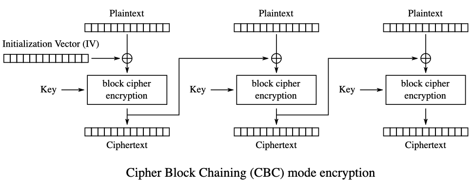

Ver- und Entschlüsselung eines Texts mit AES-256, Block-cipher, 128 Bit Block Size, 256 Bit Key

Mode: CBC (Cipher Block Chaining)

Bei CBC notwendig: IV (Initialization Vector)

- Zufällig
- Seed für den ersten Block
- Ist nicht geheim
- Niemals wiederverwenden (innerhalb einer Session)



```csharp
using System;
using System.Linq;
using System.Security.Cryptography;

namespace crypt03sym
{
    class Program
    {
        static void Main(string[] args)
        {
            //
            // get the key
            //
            var key_str_base16 = "5DD2A132ADCF681280F163EB5B1454BEB22808B0D623FF9783FAA74C1BCC7C0D";
            byte[] key = new byte[32]; // 256 Bits
            /* code to get a random key once:
            using (RNGCryptoServiceProvider rngCsp = new RNGCryptoServiceProvider()){
              rngCsp.GetBytes(key);
            }
            Console.WriteLine(BitConverter.ToString(key).Replace("-",""));
            */

            // convert from hex string to byte Array using LINQ
            // [Quelle](https://stackoverflow.com/questions/321370/how-can-i-convert-a-hex-string-to-a-byte-array)
            
            key = 
            Enumerable.Range(0, key_str_base16.Length / 2)
            .Select(x => Convert.ToByte(key_str_base16.Substring(x * 2, 2), 16))
            .ToArray();

            Console.WriteLine("key: "+BitConverter.ToString(key).Replace("-",""));

            //
            // create and configure the cipher
            //
            Aes cipher = Aes.Create();

            // show defaults
            System.Console.WriteLine(cipher.Mode); // CBC
            System.Console.WriteLine(cipher.Padding); // PKCS7
            System.Console.WriteLine(cipher.KeySize); // 256 Bits

            // set cipher key
            cipher.Key = key;

            // show randomly generated IV
            System.Console.WriteLine("IV: "+Convert.ToBase64String(cipher.IV));

            // the IV must be stored with the encrypted data, as the key it is necessary for encryption
            // same IV value must not be used again
            
            //
            // create encryptor
            //
            ICryptoTransform encryptor = cipher.CreateEncryptor();

            // encrypt a message
            string plaintext_str = "Secret Message";
            byte[] plaintext_data = System.Text.Encoding.UTF8.GetBytes(plaintext_str);
            byte[] ciphertext_data = encryptor.TransformFinalBlock(plaintext_data, 0, plaintext_data.Length);
            System.Console.WriteLine("Ciphertext: "+Convert.ToBase64String(ciphertext_data));
      
            //
            // decrypt message
            //
            Decrypt(ciphertext_data, key, cipher.IV);
        }

        public static void Decrypt(byte[] ciphertext_data, byte[] key, byte[] IV) 
        {
            Aes cipher = Aes.Create();
            cipher.Key = key;
            cipher.IV = IV; // to decrypt IV must be known
            ICryptoTransform decryptor = cipher.CreateDecryptor();
            byte[] plaintext_data = decryptor.TransformFinalBlock(ciphertext_data, 0, ciphertext_data.Length);
            string plaintext_str = System.Text.Encoding.UTF8.GetString(plaintext_data);
            System.Console.WriteLine("Plaintext: "+plaintext_str);
        }
    }
}
```

