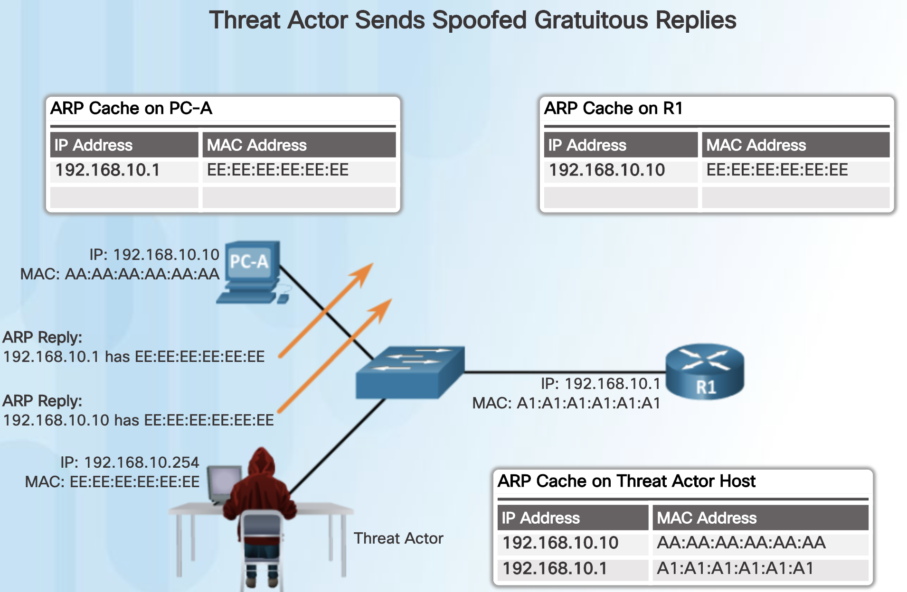

[ARP Grundlagen](/Doc/Networking/arp)

# ARP Cache Poisoning

Ein Angreifer schickt einen gefälschten (**spoofed**) gratuitous ARP Reply um sich in die Kommunikation zwischen einem Host und dem Default Gateway hineinzuschwindeln (MITM = man in the middle attack). Damit kann der Angreifer den gesamten Datentransfer mithören (passiver Angriff) und auch manipulieren (aktiver Angriff).

Beispiel PC-A schickt ARP Request an das Default Gateway (R1)

R1 lernt die MAC Adresse von PC-A und schickt einen ARP Reply an PC-A zurück, dieser lernt dadurch die MAC Adresse von R1.

Ein Angreifer schickt nun **2 spoofed gratuitous ARP Replies** mit gefälschten IP Adressen (von PC-A und R1) aber der eigenen MAC Adresse. Das überschreibt die ARP cache Einträge in PC-A und R1.

Will nun PC-A über R1 kommunizieren so geht die Kommunikation an den Computer des Angreifers. Dasselbe passiert mit der Kommunikation von R1 zu PC-A. Der Angreifer kann daher alle Daten lesen und unter Umständen auch manipulieren. Man nennt diese einen **man in the middle attack**.

Verteidigung: In der Netwerkinfrastruktur (Switch) werden verdächtige ARP requests gemeldet bzw. geblockt.

 