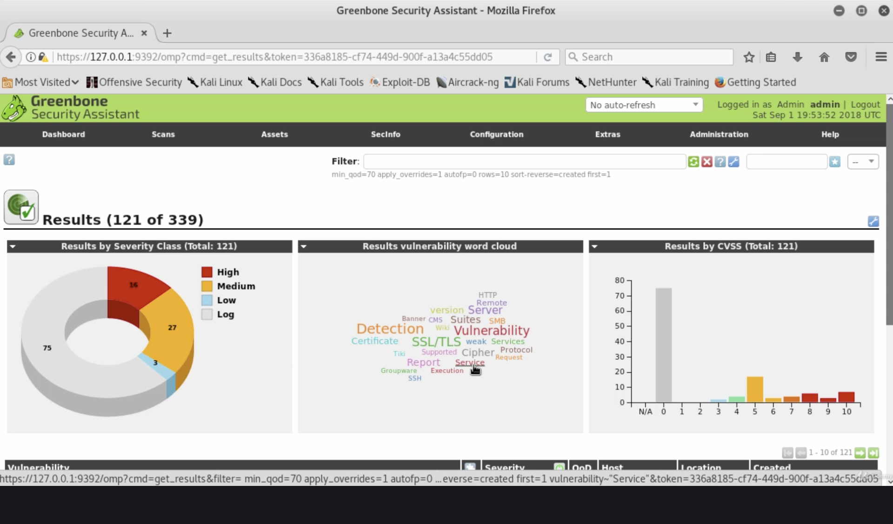

Greenbone Vulnerability Management (GVM), Open Vulnerability Assessment Scanner (OpenVAS)

[OpenVAS - Open Vulnerability Assessment Scanner](https://www.openvas.org)

[wikipedia](https://en.wikipedia.org/wiki/OpenVAS)

Mehr als 50000 NVTs – Network Vulnerability Tests!


## Setup

Achtung neuer Name (früher `openvas`, jetzt `gvm)` [[Quelle](https://dannyda.com/2020/08/07/how-to-fix-openvas-command-not-found-in-kali-linux-2020-2a/)]

Installieren unter Kali:

```bash
$ apt-get update && apt-get install gvm -y
```

Setup Prozess (Kann eine Weile dauern):

```bash
$ gvm-setup
...
[+] Done
[*] Please note the password for the admin user
[*] User created with password '37fbfd4f-d6df-4a9a-9d5a-ede8b14976e4'.
```

Es wird ein Passwort für den User admin generiert.

Passwort ändern:

```bash
$ gvmd --user=admin --new-password=admin
# wird akzeptiert, aber passwort wird nicht geändert ???
```


Update-Feeds laden

```bash
$ gvm-feed-update
```


Starten:

```bash
$ gvm-start
```

Web-Browser: `https://127.0.0.1:9392`


## Bedienung

- Scans >> Tasks
- Task Wizard (nur IP Adresse) / Advanced Task Wizard (Task bekommt einen Namen)
- Task starten, mit `top` kann man sehen dass die CPU 100% ausgelastet ist
- Dauert lange (ca. 15 min)
- Report, Severity High, QoD=Quality of Detection
  - z.B. "PostgrSQL weak password"


Scan >> Results




Assets >> Dashboard

Assets >> Hosts

Assets >> Operating System


SecInfo >> NVTs / [CVEs](https://cve.mitre.org) / [CPEs](https://nmap.org/book/output-formats-cpe.html)


Scans >> Reports

- Abspeichern in verschiedenen Formaten 
- Diese Reports können in Metasploit importiert werden


Credential Scan (im Gegensatz zu Remote Scan)

arbeitet mit bekannten Anmeldedaten, d.h. welchen Schaden könnte ein "normaler" Nutzer anrichten.

Configuration>>Credentials