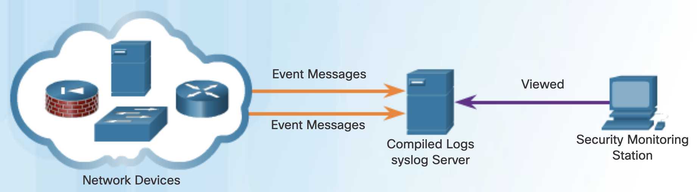
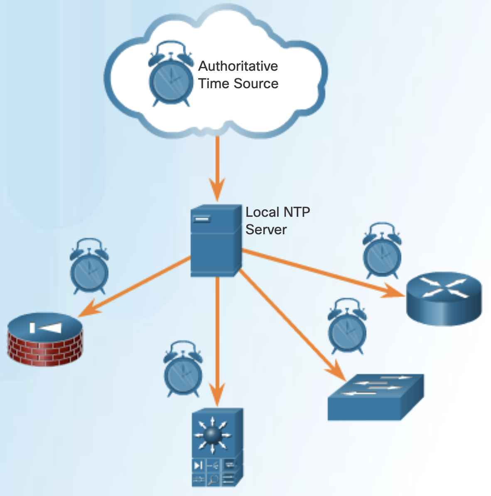
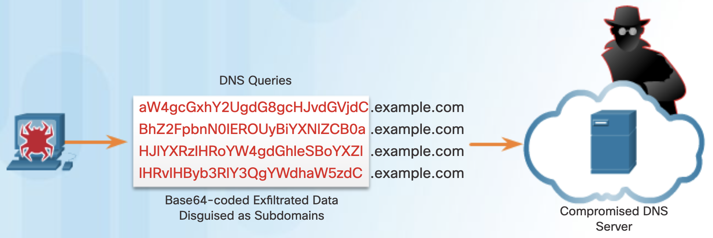
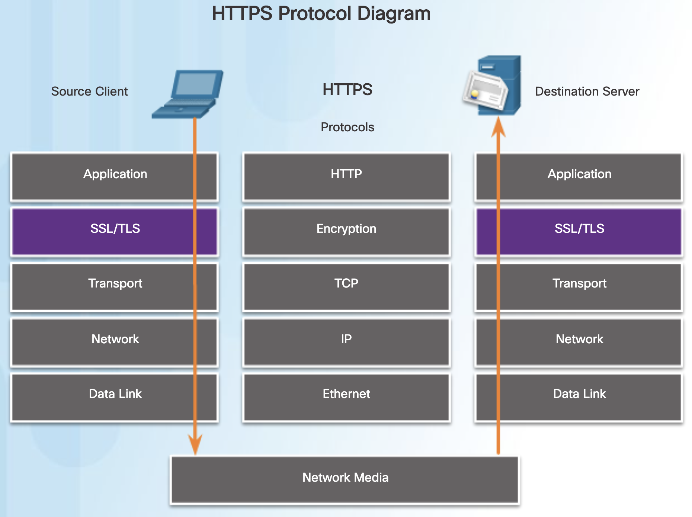
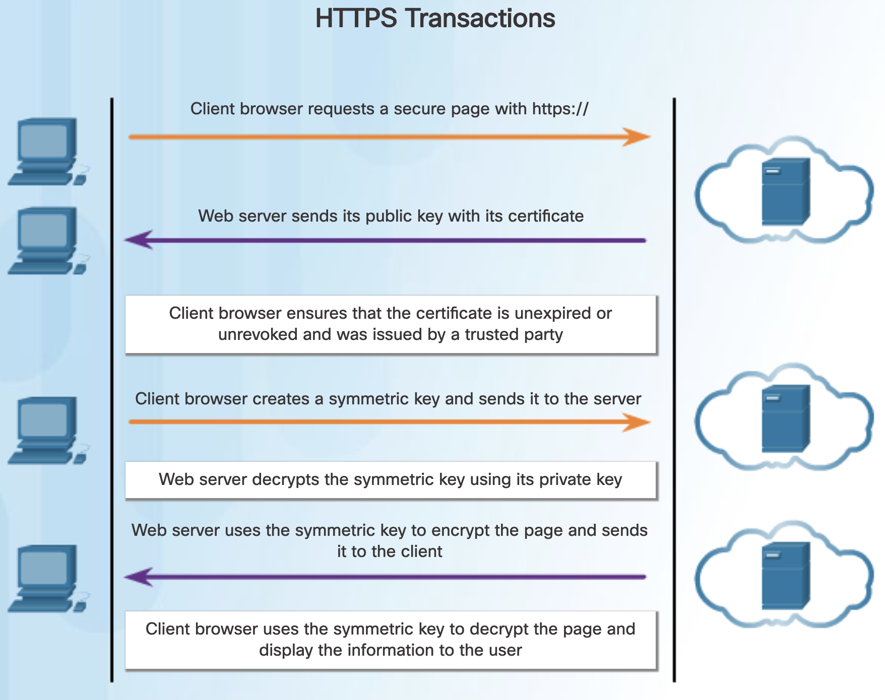
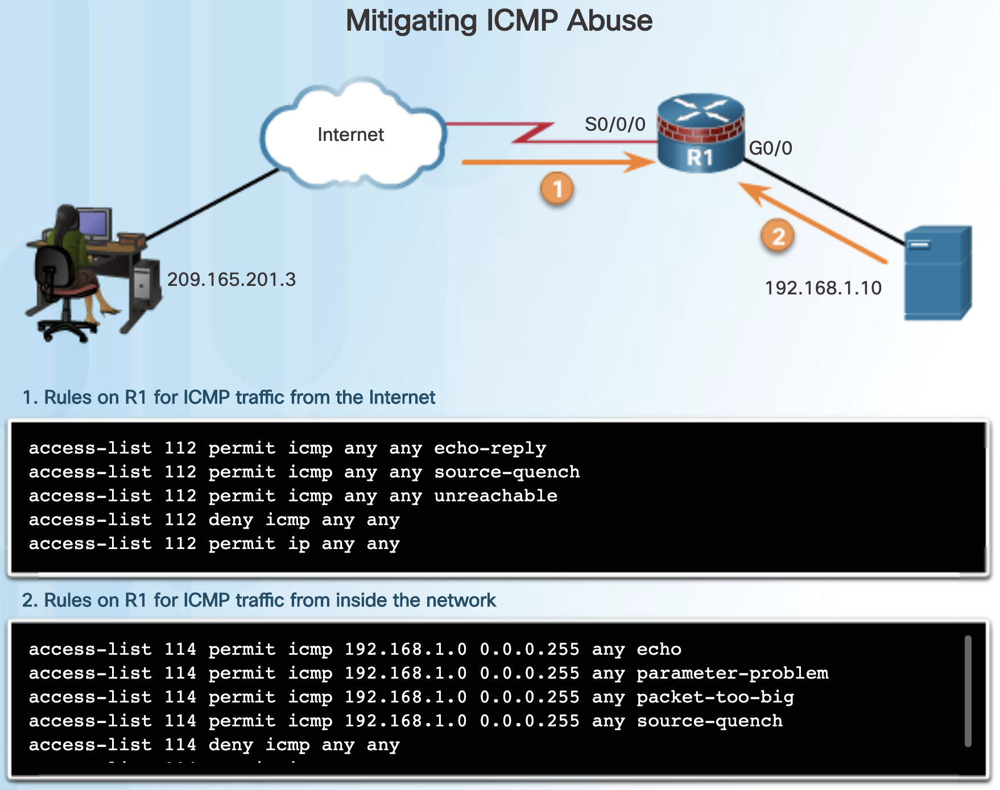
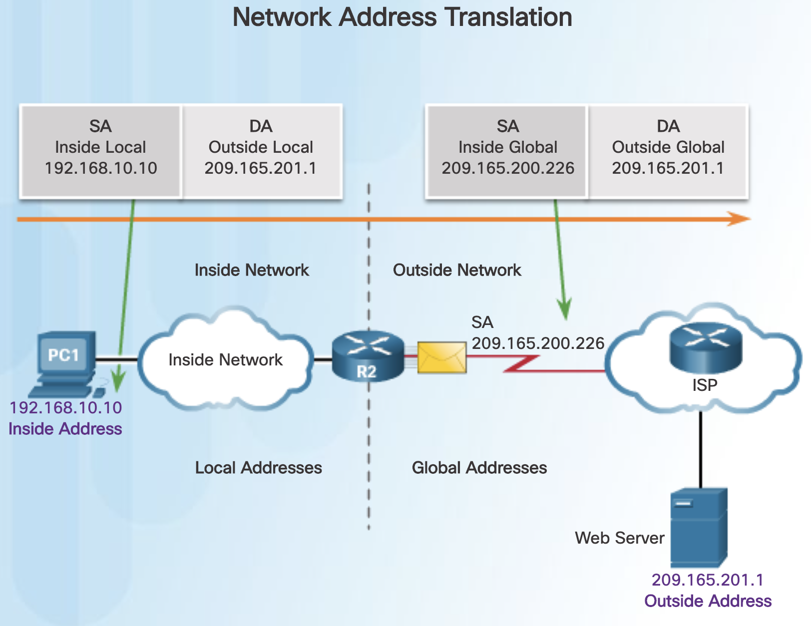
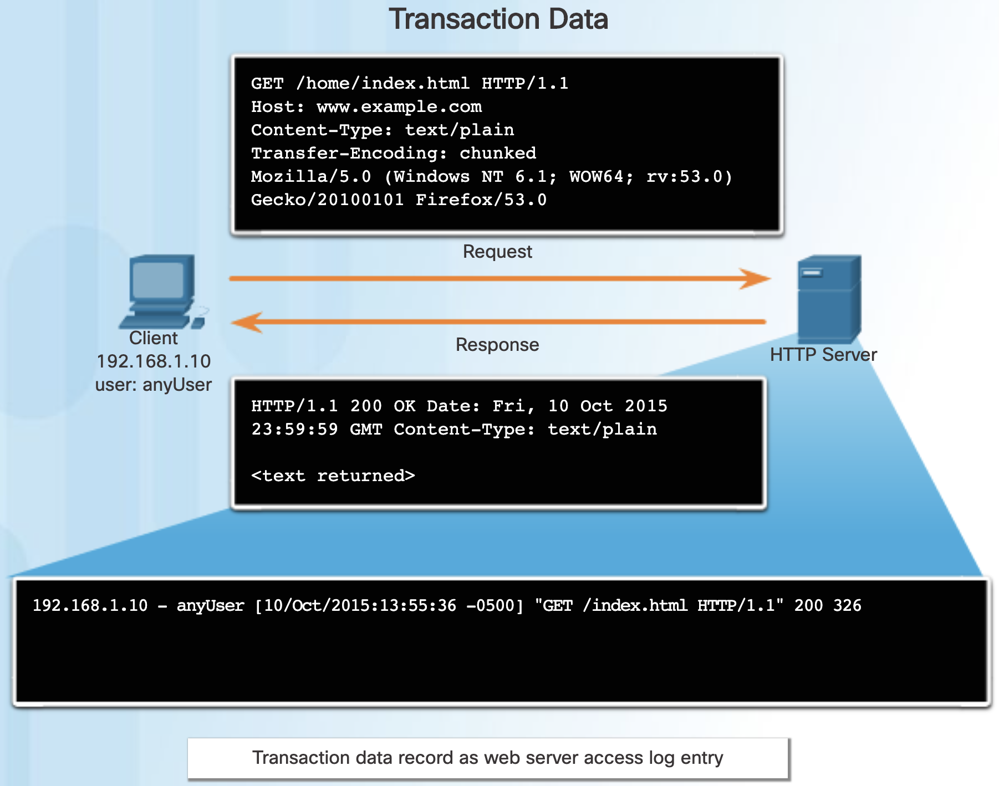

# Chapter 11 Security Monitoring

## 11.0 Introduction

### 11.0.1. Welcome

#### 11.0.1.1 Chapter 11: Security Monitoring

# Chapter 11: Security Monitoring

Network security monitoring (NSM) uses various types of data to detect, verify, and contain exploits. The primary task of the cybersecurity analyst is to verify successful or attempted exploits using NSM data and tools.

In this chapter, you will learn about the security technologies and log files used in security monitoring.

<iframe id="media" title="interactive graphic" aria-label="interactive graphic" aria-describedby="media-description" src="https://static-course-assets.s3.amazonaws.com/CyberOps11/en/course/module11/11.0.1.1/media/index.html" style="border: none; display: block; width: 680px; height: 490px;"></iframe>

The figure shows a collage with the title of the chapter.

## 11.1 Technologies and Protocols

### 11.1.1 Monitoring Common Protocols

#### 11.1.1.1 Syslog and NTP

Various protocols that commonly appear on networks have features that make them of special interest in security monitoring. For example, syslog and Network Time Protocol (NTP) are essential to the work of the cybersecurity analyst.

The syslog standard is used for logging event messages from network devices and endpoints, as shown in the figure. The standard allows for a system-neutral means of transmitting, storing, and analyzing messages. Many types of devices from many different vendors can use syslog to send log entries to central servers that run a syslog daemon. This centralization of log collection helps to make security monitoring practical. Servers that run syslog typically listen on UDP port 514.

Because syslog is so important to security monitoring, syslog servers may be a target for threat actors. Some exploits, such as those involving data exfiltration, can take a long time to complete due to the very slow ways in which data is secretly stolen from the network. Some attackers may try to hide the fact that exfiltration is occurring. They attack syslog servers that contain the information that could lead to detection of the exploit. Hackers may attempt to block the transfer of data from syslog clients to servers, tamper with or destroy log data, or tamper with software that creates and transmits log messages. The next generation (ng) syslog implementation, known as syslog-ng, offers enhancements that can help prevent some of the exploits that target syslog.

The figure shows a topology. On the left side is a firewall, a server, a switch and a router within a cloud. Arrows labeled event messages leave the cloud and point to a server labeled compiled logs syslog server. On the side is a computer labeled security monitoring station. An arrow with the label viewed points to the compiled logs syslog server.

#### 11.1.1.2 NTP

Syslog messages are usually timestamped. This allows messages from different sources to be organized by time to provide a view of network communication processes. Because the messages can come from many devices, it is important that the devices share a consistent timeclock. One way that this can be achieved is for the devices to use Network Time Protocol (NTP). NTP uses a hierarchy of authoritative time sources to share time information between devices on the network, as shown in the figure. In this way, device messages that share consistent time information can be submitted to the syslog server. NTP operates on UDP port 123.

Because events that are connected to an exploit can leave traces across every network device on their path to the target system, timestamps are essential for detection. Threat actors may attempt to attack the NTP infrastructure in order to corrupt time information used to correlate logged network events. This can serve to obfuscate traces of ongoing exploits. In addition, threat actors have been known to use NTP systems to direct DDoS attacks through vulnerabilities in client or server software. While these attacks do not necessarily result in corrupted security monitoring data, they can disrupt network availability.

The figure titled NTP is a topology. At the top is a cloud with an image of a clock inside and the label authoritative time source. An arrow from the cloud points to a server labeled local NTP server. Several arrows from this server point to various networking devices.

#### 11.1.1.3 DNS

Domain Name Service (DNS) is used by millions of people daily. Because of this, many organizations have less stringent policies in place to protect against DNS-based threats than they have to protect against other types of exploits. Attackers have recognized this and commonly encapsulate different network protocols within DNS to evade security devices. DNS is now used by many types of malware. Some varieties of malware use DNS to communicate with command-and-control (CnC) servers and to exfiltrate data in traffic disguised as normal DNS queries. Various types of encoding, such as Base64, 8-bit binary, and Hex can be used to camouflage the data and evade basic data loss prevention (DLP) measures.

For example, malware could encode stolen data as the subdomain portion of a DNS lookup for a domain where the nameserver is under control of an attacker. A DNS lookup for ‘long-string-of-exfiltrated-data.example.com’ would be forwarded to the nameserver of example.com, which would record ‘long-string-of-exfiltrated-data’ and reply back to the malware with a coded response. This use of the DNS subdomain is shown in the figure. The exfiltrated data is the encoded text shown in the box. The threat actor collects this encoded data, decodes and combines it, and now has access to an entire data file, such as a username/password database.

It is likely that the subdomain part of such requests would be much longer than usual requests. Cyber analysts can use the distribution of the lengths of subdomains within DNS requests to construct a mathematical model that describes normality. They can then use this to compare their observations and identify an abuse of the DNS query process. For example, it would not be normal to see a host on your network sending a query to aW4gcGxhY2UgdG8gcHJvdGVjdC.example.com.

DNS queries for randomly generated domain names, or extremely long random-appearing subdomains, should be considered suspicious, especially if their occurrence spikes dramatically on the network. DNS proxy logs can be analyzed to detect these conditions. Alternatively, services such as the Cisco Umbrella passive DNS service can be used to block requests to suspected CnC and exploit domains.

DNS Exfiltration

#### 11.1.1.4 HTTP and HTTPS

Hypertext Transfer Protocol (HTTP) is the backbone protocol of the World Wide Web. However, all information carried in HTTP is transmitted in plaintext from the source computer to the destination on the Internet. HTTP does not protect data from alteration or interception by malicious parties, which is a serious threat to privacy, identity, and information security. All browsing activity should be considered to be at risk.

A common exploit of HTTP is called iFrame (inline frame) injection. Most web-based threats consist of malware scripts that have been planted on webservers. These webservers then direct browsers to infected servers by loading iframes. In iFrame injection, a threat actor compromises a webserver and plants malicious code which creates an invisible iFrame on a commonly visited webpage. When the iFrame loads, malware is downloaded, frequently from a different URL than the webpage that contains the iFrame code. Network security services, such as Cisco Web Reputation filtering, can detect when a website attempts to send content from an untrusted website to the host, even when sent from an iFrame, as shown in Figure 1.

To address the alteration or interception of confidential data, many commercial organizations have adopted HTTPS or implemented HTTPS-only policies to protect visitors to their websites and services.

HTTPS adds a layer of encryption to the HTTP protocol by using secure socket layer (SSL), as shown in Figure 2. This makes the HTTP data unreadable as it leaves the source computer until it reaches the server. Note that HTTPS is not a mechanism for web server security. It only secures HTTP protocol traffic while it is in transit.

Unfortunately, the encrypted HTTPS traffic complicates network security monitoring. Some security devices include SSL decryption and inspection; however, this can present processing and privacy issues. In addition, HTTPS adds complexity to packet captures due to the additional messaging involved in establishing the encrypted connection. This process is summarized in Figure 3 and represents additional overhead on top of HTTP.

Figures 1 and 2 are explained in the text. Figure 3 illustrates an HTTPS transaction. A client browser requests a secure page with https://. The web server sends its public key with its certificate. The client browser ensures that the certificate is unexpired or unrevoked and was issued by a trusted party. The client browser then creates a symmetric key and sends it to the web server. The web server decrypts the symmetric key using its private key. The web server then uses the symmetric key to encrypt the page and send it on to the client. The client browser uses the symmetric key to decrypt the page and display the information to the user.

#### 11.1.1.5 Email Protocols

Email protocols such as SMTP, POP3, and IMAP can be used by threat actors to spread malware, exfiltrate data, or provide channels to malware CnC servers, as shown in the figure.

SMTP sends data from a host to a mail server and between mail servers. Like DNS and HTTP, it is a common protocol to see leaving the network. Because there is so much SMTP traffic, it is not always monitored. However, SMTP has been used in the past by malware to exfiltrate data from the network. In the 2014 hack of Sony Pictures, one of the exploits used SMTP to exfiltrate user details from compromised hosts to CnC servers. This information may have been used to help develop exploits of secured resources within the Sony Pictures network. Security monitoring could reveal this type of traffic based on features of the email message.

IMAP and POP3 are used to download email messages from a mail server to the host computer. For this reason, they are the application protocols that are responsible for bringing malware to the host. Security monitoring can identify when a malware attachment entered the network and which host it first infected. Retrospective analysis can then track the behavior of the malware from that point forward. In this way, the malware behavior can better be understood and the threat identified. Security monitoring tools may also allow recovery of infected file attachments for submission to malware sandboxes for analysis.

<iframe id="media" title="interactive graphic" aria-label="interactive graphic" aria-describedby="media-description" src="https://static-course-assets.s3.amazonaws.com/CyberOps11/en/course/module11/11.1.1.5/media/index.html" style="border: none; display: block; width: 680px; height: 490px;"></iframe>

The figure is explained in the text.

#### 11.1.1.6 ICMP

ICMP has many legitimate uses, however the ICMP functionality has been used to craft a number of types of exploits. ICMP can be used to identify hosts on a network, the structure of a network, and determine the operating systems at use on the network. It can also be used as a vehicle for various types of DoS attacks.

ICMP can also be used for data exfiltration. Because of the concern that ICMP can be used to surveil or deny service from outside of the network, ICMP traffic from inside the network is sometimes overlooked. However, some varieties of malware use crafted ICMP packets to transfer files from infected hosts to threat actors using this method, which is known as ICMP tunneling.

Click [here](http://phrack.org/issues/49/6.html) for a detailed explanation of the well-known LOKI exploit.

**Note**: This site might be blocked by your institution’s firewall.

A number of tools exist for crafting tunnels such as [Ping Tunnel](http://www.mit.edu/afs.new/sipb/user/golem/tmp/ptunnel-0.61.orig/web/).

<iframe id="media" title="interactive graphic" aria-label="interactive graphic" aria-describedby="media-description" src="https://static-course-assets.s3.amazonaws.com/CyberOps11/en/course/module11/11.1.1.6/media/index.html" style="border: none; display: block; width: 680px; height: 490px;"></iframe>

The figure shows a digital ones and zeros making a tunnel.

### 11.1.2 Security Technologies

11.1.2.1 ACLs

Many technologies and protocols can have impacts on security monitoring. Access Control Lists (ACLs) are among these technologies. ACLs can give a false sense of security if they are overly relied upon. ACLs, and packet filtering in general, are technologies that contribute to an evolving set of network security protections.

The figure illustrates the use of ACLs to permit only specific types of Internet Control Message Protocol (ICMP) traffic. The server at 192.168.1.10 is part of the inside network and is allowed to send ping requests to the outside host at 209.165.201.3. The outside host’s return ICMP traffic is allowed if it is an ICMP reply, source quench (tells the source to reduce the pace of traffic), or any ICMP unreachable message. All other ICMP traffic types are denied. For example, the outside host cannot initiate a ping request to the inside host. The outbound ACL is allowing ICMP messages that report various problems. This will allow ICMP tunneling and data exfiltration.

Attackers can determine which IP addresses, protocols, and ports are allowed by ACLs. This can be done either by port scanning or penetration testing, or through other forms of reconnaissance. Attackers can craft packets that use spoofed source IP addresses. Applications can establish connections on arbitrary ports. Other features of protocol traffic can also be manipulated, such as the established flag in TCP segments. Rules cannot be anticipated and configured for all emerging packet manipulation techniques.

In order to detect and react to packet manipulation, more sophisticated behavior and context-based measures need to be taken. Cisco Next Generation firewalls, Advanced Malware Protection (AMP), and email and web content appliances are able to address the shortcomings of rule-based security measures.

The figure is explained in the text.

#### 11.1.2.2 NAT and PAT

Network Address Translation (NAT) and Port Address Translation (PAT) can complicate security monitoring. Multiple IP addresses are mapped to one or more public addresses that are visible on the Internet, hiding the individual IP addresses that are inside the network (inside addresses).

The figure illustrates the relationship between internal and external addresses that are used as source addresses (SA) and destination addresses (DA). These internal and external addresses are in a network that is using NAT to communicate with a destination on the Internet. If PAT is in effect, and all IP addresses leaving the network use the 209.165.200.226 inside global address for traffic to the Internet, it could be difficult to log the specific inside device that is requesting and receiving the traffic when it enters the network.

This problem can be especially relevant with NetFlow data. NetFlow flows are unidirectional and are defined by the addresses and ports that they share. NAT will essentially break a flow that passes a NAT gateway, making flow information beyond that point unavailable. Cisco offers security products that will “stitch” flows together even if the IP addresses have been replaced by NAT.

NetFlow is discussed in more detail later in the chapter.

The figure is explained in the text.

#### 11.1.2.3 Encryption, Encapsulation, and Tunneling

As mentioned with HTTPS, encryption can present challenges to security monitoring by making packet details unreadable. Encryption is part of VPN technologies. In VPNs, a commonplace protocol like IP, is used to carry encrypted traffic. The encrypted traffic essentially establishes a virtual point-to-point connection between networks over public facilities. Encryption makes the traffic unreadable to any other devices but the VPN endpoints.

A similar technology can be used to create a virtual point-to-point connection between an internal host and threat actor devices. Malware can establish an encrypted tunnel that rides on a common and trusted protocol, and use it to exfiltrate data from the network. A similar method of data exfiltration was discussed previously for DNS.

<iframe id="media" title="interactive graphic" aria-label="interactive graphic" aria-describedby="media-description" src="https://static-course-assets.s3.amazonaws.com/CyberOps11/en/course/module11/11.1.2.3/media/index.html" style="border: none; display: block; width: 680px; height: 490px;"></iframe>

The figure shows a person magnifying a screen filled with zeros and ones with the word encrypt in the middle. The figure is titled encryption, encapsulation, and tunnelling.

#### 11.1.2.4 Peer-to-Peer Networking and Tor

In peer-to-peer (P2P) networking, shown in Figure 1, hosts can operate in both client and server roles. Three types of P2P applications exist: file sharing, processor sharing, and instant messaging. In file sharing P2P, files on a participating machine are shared with members of the P2P network. Examples of this are the once popular Napster and Gnutella. Bitcoin is a P2P operation that involves the sharing of a distributed database, or ledger, that records Bitcoin balances and transactions. BitTorrent is a P2P file sharing network.

Any time that unknown users are provided access to network resources, security is a concern. File-sharing P2P applications should not be allowed on corporate networks. P2P network activity can circumvent firewall protections and is a common vector for the spread of malware. P2P is inherently dynamic. It can operate by connecting to numerous destination IP addresses, and it can also use dynamic port numbering. Shared files are often infected with malware, and threat actors can position their malware on P2P clients for distribution to other users.

Processor sharing P2P networks donate processor cycles to distributed computational tasks. Cancer research, searching for extraterrestrials, and scientific research use donated processor cycles to distribute computational tasks.

Instant messaging (IM) is also considered to be a P2P application. IM has legitimate value within organizations that have geographically distributed project teams. In this case, specialized IM applications are available, such as the [Cisco Jabber](http://www.cisco.com/c/en/us/products/unified-communications/jabber/index.html) platform, which are more secure than IM that uses public servers.

Tor, shown in Figure 2, is a software platform and network of P2P hosts that function as Internet routers on the Tor network. The Tor network allows users to browse the Internet anonymously. Users access the Tor network by using a special browser. When a browsing session is begun, the browser constructs a layered end-to-end path across the Tor server network that is encrypted, as shown in Figure 3. Each encrypted layer is “peeled away” like the layers of an onion (hence “onion routing”) as the traffic traverses a Tor relay. The layers contain encrypted next-hop information that can only be read by the router that needs to read the information. In this way, no single device knows the entire path to the destination, and routing information is readable only by the device that requires it. Finally, at the end of the Tor path, the traffic reaches its Internet destination. When traffic is returned to the source, an encrypted layered path is again constructed.

Tor presents a number of challenges to cybersecurity analysts. First, Tor is widely used by criminal organizations on the “dark net.” In addition, Tor has been used as a communications channel for malware CnC. Because the destination IP address of Tor traffic is obfuscated by encryption, with only the next-hop Tor node known, Tor traffic avoids blacklists that have been configured on security devices.

<iframe id="media" title="interactive graphic" aria-label="interactive graphic" aria-describedby="media-description" src="https://static-course-assets.s3.amazonaws.com/CyberOps11/en/course/module11/11.1.2.4/media/index.html" style="border: none; display: block; width: 680px; height: 490px;"></iframe>

Figure 1 is a topology showing unstructured peer to peer logical connections through which file sharing and other services may occur. Figure 2 is a screenshot of the web site Tor. Figure 3 illustrates Tor operation. A user’s tor software constructs a random path through the network of tor relays with which to send encrypted packets. These packets are unencrypted from the tor exit node.

#### 11.1.2.5 Load Balancing

Load balancing involves the distribution of traffic between devices or network paths to prevent overwhelming network resources with too much traffic. If redundant resources exist, a load balancing algorithm or device will work to distribute traffic between those resources, as shown in the figure.

One way this is done on the Internet is through various techniques that use DNS to send traffic to resources that have the same domain name but multiple IP addresses. In some cases, the distribution may be to servers that are distributed geographically. This can result in a single Internet transaction being represented by multiple IP addresses on the incoming packets. This may cause suspicious features to appear in packet captures. In addition, some load balancing manager (LBM) devices use probes to test for the performance of different paths and the health of different devices. For example, an LBM may send probes to the different servers that it is load balancing traffic to in order to detect that the servers are operating. This is done to avoid sending traffic to a resource that is not available. These probes can appear to be suspicious traffic if the cybersecurity analyst is not aware that this traffic is part of the operation of the LBM.

<iframe id="media" title="interactive graphic" aria-label="interactive graphic" aria-describedby="media-description" src="https://static-course-assets.s3.amazonaws.com/CyberOps11/en/course/module11/11.1.2.5/media/index.html" style="border: none; display: block; width: 680px; height: 490px;"></iframe>

The figure illustrates load balancing with DNS delegation. In step 1, a user wants to visit a website so a DNS query is sent to the ns.locallsp.com server. In step 2, the local DNS server does not have a record for the requested website, so it queries other servers. In stpe 3, the request reaches authoritative DNS server for that domain. NS record delegates the request to load balancer at that website. In step 4, the load balancer at loadbalance.example.com returns the IP address for a server in the server pool depending on load.

## 11.2. Log Files

### 11.2.1 Types of Security Data

#### 11.2.1.1 Alert Data

Alert data consists of messages generated by intrusion prevention systems (IPSs) or intrusion detection systems (IDSs) in response to traffic that violates a rule or matches the signature of a known exploit. A network IDS (NIDS), such as Snort, comes configured with rules for known exploits. Alerts are generated by Snort and are made readable and searchable by applications such as Snorby and Sguil, which are part of the Security Onion suite of NSM tools.

A testing site that is used to determine if Snort is operating is [www.testmyids.com](http://www.testmyids.com/). It consists of a webpage that displays only the text **uid=0(root) gid=0(root) groups=0(root)**. If Snort is operating correctly and a host visits this site, a signature will be matched and an alert will be triggered. This is an easy and harmless way to verify that the NIDS is running.

The Snort rule that is triggered is:

alert ip any any -> any any (msg:"GPL ATTACK_RESPONSE id check returned root"; content:"uid=0|28|root|29|"; fast_pattern:only; classtype:bad-unknown; sid:2100498; rev:8;)

This rule generates an alert if any IP address in the network receives data from an external source that contains the text matching the pattern of **uid=0(root)**. The alert contains the message **GPL ATTACK_RESPONSE id check returned root**. The ID of the Snort rule that was triggered is **2100498**.

The figure illustrates a series of alerts that have been accessed and displayed on the Security Onion console application Sguil.

<iframe id="media" title="interactive graphic" aria-label="interactive graphic" aria-describedby="media-description" src="https://static-course-assets.s3.amazonaws.com/CyberOps11/en/course/module11/11.2.1.1/media/index.html" style="border: none; display: block; width: 680px; height: 490px;"></iframe>

The figure is a screenshot of the Sguil console showing alert event data.

#### 11.2.1.2 Session and Transaction Data

Session data is a record of a conversation between two network endpoints, often a client and a server. The server could be inside the enterprise network or at a location accessed over the Internet. Session data is data about the session, not the data retrieved and used by the client. Session data will include identifying information such as the five tuples of source and destination IP addresses, source and destination port numbers, and the IP code for the protocol in use. Data about the session typically includes a session ID, the amount of data transferred by source and destination, and information related to the duration of the session.

Bro is a network security monitoring tool you will use in labs later in the course. Figure 1 shows a partial output for three HTTP sessions from a Bro connection log. Click the plus signs (+) in the figure for an explanation of each field.

Transaction data consists of the messages that are exchanged during network sessions. These transactions can be viewed in packet capture transcripts. Device logs kept by servers also contain information about the transactions that occur between clients and servers. For example, a session might include the downloading of content from a webserver, as shown in Figure 2. The transactions representing the requests and replies would be logged in an access log on the server or by a NIDS like Bro. The session is all traffic involved in making up the request, the transaction is the request itself.

<iframe id="media" title="interactive graphic" aria-label="interactive graphic" aria-describedby="media-description" src="https://static-course-assets.s3.amazonaws.com/CyberOps11/en/course/module11/11.2.1.2/media/index.html" style="border: none; display: block; width: 680px; height: 490px;"></iframe>

Figure 1 is titled Bro session data, partial display. There are several plus signs for more detail. From left to right as follows. Ts is the session start timestamp in Unix epoch format. Uid is the unique session ID. Id.orig_h is the IP address of host originating the session. It is the source address. Id.orig_p is the protocol port for the originating host. It is the source port. Id.resp_h is the IP address of host responding to originating host. It is the destination address. Id.resp_p is the protocol port for the responding host. It is the destination port. Proto is the transport layer protocol for session. Service is the application layer protocol. Duration is the duration of the session. Orig_bytes are the bytes from the originating host. Resp_bytes are the bytes from the responding host. Orig_pkts are the packets from the originating host. Resp_pkts are the packets from the responding host. Figure 2 illustrates the transaction data record as a web server access log entry.

#### 11.2.1.3 Full Packet Captures

Full packet captures are the most detailed network data that is generally collected. Because of the amount of detail, they are also the most storage and retrieval intensive types of data used in NSM. Full packet captures contain not only data about network conversations, like session data. Full packet captures contain the actual contents of the conversations themselves. Full packet captures contain the text of email messages, the HTML in webpages, and the files that enter or leave the network. Extracted content can be recovered from full packet captures and analyzed for malware or user behavior that violates business and security policies. The familiar tool Wireshark is very popular for viewing full packet captures and accessing the data associated with network conversations.

The figure illustrates the interface for the Network Analysis Monitor component of Cisco Prime Infrastructure system, which, like Wireshark, can display full packet captures.

<iframe id="media" title="interactive graphic" aria-label="interactive graphic" aria-describedby="media-description" src="https://static-course-assets.s3.amazonaws.com/CyberOps11/en/course/module11/11.2.1.3/media/index.html" style="border: none; display: block; width: 680px; height: 490px;"></iframe>

The figure is a screenshot of the cisco prime network analysis module with a full packet capture.

#### 11.2.1.4 Statistical Data

Like session data, statistical data is about network traffic. Statistical data is created through the analysis of other forms of network data. From these analysis, conclusions can be made that describe or predict network behavior. Statistical characteristics of normal network behavior can be compared to current network traffic in an effort to detect anomalies. Statistics can be used to characterize normal amounts of variation in network traffic patterns in order to identify network conditions that are significantly outside of those ranges. Statistically significant differences should raise alarms and prompt investigation.

Network Behavior Analysis (NBA) and Network Behavior Anomaly Detection (NBAD) are approaches to network security monitoring that use advanced analytical techniques to analyze NetFlow or Internet Protocol Flow Information Export (IPFIX) network telemetry data. Techniques such as predictive analytics and artificial intelligence perform advanced analyses of detailed session data to detect potential security incidents.

**Note**: IPFIX is the open standard version of Cisco’s NetFlow.

An example of a NSM tool that utilizes statistical analysis is Cisco Cognitive Threat Analytics. It is able to find malicious activity that has bypassed security controls, or entered through unmonitored channels (including removable media), and is operating inside an organization’s environment. Cognitive Threat Analytics is a cloud-based product that uses machine learning and statistical modeling of networks. It creates a baseline of the traffic in a network and identifies anomalies. It analyzes user and device behavior, and web traffic, to discover command-and-control communications, data exfiltration, and potentially unwanted applications operating in the infrastructure. The figure illustrates an architecture for Cisco Cognitive Threat Analytics.

The figure is titled cisco cognitive threat analytics. Internal user computers are analyzed by behavioral analysis. Anomaly detection leads to machine learning which is added to the behavioral analysis. Potential threats trigger alerts.

### 11.2.2 End Device Logs

#### 11.2.2.1 Host Logs

As previously discussed, host-based intrusion protection (HIDS) runs on individual hosts. HIDS not only detects intrusions, but in the form of host-based firewalls, can also prevent intrusion. This software creates logs and stores them on the host. This can make it difficult to get a view of what is happening on hosts in the enterprise, so many host-based protections have a way to submit logs to centralized log management servers. In this way, the logs can be searched from a central location using NSM tools..

HIDS systems can use agents to submit logs to management servers. [OSSEC](https://ossec.github.io/index.html), a popular open-source HIDS, includes a robust log collection and analysis functionality. Microsoft Windows includes several methods for automated host log collection and analysis. Tripwire, a HIDS for Linux, includes similar functionality. All can scale to larger enterprises.

Microsoft Windows host logs are visible locally through Event Viewer. Event Viewer keeps four types of logs:

-   **Application logs** – These contain events logged by various applications.

-   **System logs** – These include events regarding the operation of drivers, processes, and hardware.

-   **Setup logs** – These record information about the installation of software, including Windows updates.

-   **Security logs** – These record events related to security, such as logon attempts and operations related to file or object management and access.

Various logs can have different event types. The figure lists the Windows host log event types. Security logs consist only of audit success or failure messages. On Windows computers, security logging is carried out by the Local Security Authority Subsystem Service (LSASS), which is also responsible for enforcing security policies on a Windows host. LSASS runs as lsass.exe. It is frequently faked by malware. It should be running from the Windows System32 directory. If a file with this name, or a camouflaged name, such as 1sass.exe, is running or running from another directory, it could be malware.

Windows Events are identified by ID numbers and brief descriptions. Click [here](https://www.ultimatewindowssecurity.com/securitylog/encyclopedia/default.aspx) for an encyclopedia of security event IDs, some with additional details.

<iframe id="media" title="interactive graphic" aria-label="interactive graphic" aria-describedby="media-description" src="https://static-course-assets.s3.amazonaws.com/CyberOps11/en/course/module11/11.2.2.1/media/index.html" style="border: none; display: block; width: 680px; height: 490px;"></iframe>

The figure is a table titled Windows host log event types and is sourced from Microsoft. It contains 2 columns. Left column is titled event type. Right column is titled description. An error is an event that indicates a significant problem such as loss of data or loss of functionality. For example, if a service fails to load during startup, an error event is logged. A Warning is an event that is not necessarily significant, but may indicate a possible future problem. For example, when disk space is low, a warning event is logged. If an application can recover from an event without loss of functionality or data, it can generally classify the event as a warning event. Information is an event that describes the successful operation of an application, driver, or service. For example, when a network driver loads successfully, it may be appropriate to log an information event. Note that it is generally inappropriate for a desktop application to log an event each time it starts. A success audit is an event that records an audited security access attempt that is successful. For example, a user’s successful attempt to log on to the system is logged as a success audit event. A failure audit is an event that records an audited security access attempt that fails. For example, if a user tries to access a network drive and fails, the attempt is logged as a failure audit event.

#### 11.2.2.2 Syslog

Syslog incudes specifications for message formats, a client-server application structure, and network protocol. Many different types of network devices can be configured to use the syslog standard to log events to centralized syslog servers.

Syslog is a client/server protocol. Syslog was defined within the Syslog working group of the IETF (RFC 5424) and is supported by a wide variety of devices and receivers across multiple platforms.

The Syslog sender sends a small (less than 1KB) text message to the Syslog receiver. The Syslog receiver is commonly called "syslogd," "Syslog daemon," or "Syslog server." Syslog messages can be sent via UDP (port 514) and/or TCP (typically, port 5000). While there are some exceptions, such as SSL wrappers, this data is typically sent in plaintext over the network.

The full format of a Syslog message seen on the wire has three distinct parts, as shown in Figure 1.

- PRI (priority)

- HEADER
- MSG (message text)

The PRI consists of two elements, the Facility and Severity of the message, which are both integer values, as shown in Figure 2. The Facility consists of broad categories of sources that generated the message, such as the system, process, or application. The Facility value can be used by logging servers to direct the message to the appropriate log file. The Severity is a value from 0-7 that defines the severity of the message. The Priority (PRI) value is calculated by multiplying the Facility value by 8, and then adding it to the Severity value, as shown below.

**Priority = (Facility \* 8) + Severity**

The Priority value is the first value in a packet and occurs between angled brackets (<>).

The HEADER section of the message contains the timestamp in **MMM DD HH:MM:SS** format. If the timestamp is preceded by the period (.) or asterisk (*) symbols, a problem is indicated with NTP. The HEADER section also includes the hostname or IP address of the device that is the source of the message.

The MSG portion contains the meaning of the syslog message. This can vary between device manufacturers and can be customized. Therefore, this portion of the message is the most meaningful and useful to the cybersecurity analyst.

Figure 1 is explained in the text. Figure 2 is titled syslog severity and facility. The severity table has 2 columns. Left column is integer. Right column is Severity. 0 equals emergency: system is unusable. 1 equals alert: action must be taken immediately. 2 equals critical: critical conditions. 3 equals error: error conditions. 4 equals warning: warning conditions. 5 equals notice: normal but significant condition. 6 equals informational: informational messages. And 7 equals debug: debug-level messages. The facility table also has 2 columns. Left column is integer. Right column is facility. 0 equals kern: kernel messages. 1 equals user: user-level messages. 2 equals mail: mail system. 3 equals daemon: system daemons. 4 equals auth: security/authorization messages. 5 equals syslog: messages generated internally by syslogd. 6 equals ipr: line printer subsystem. 7 equals news: network news subsystem. 8 equals uucp: unix-to-unix copy subsystem. 9 equals the clock daemon. 10 equals authpriv: security/authorization messages. 11 equals ftp: ftp daemon. 12 equals the NTP subsystem. 13 equals log audit. 14 equals log alert. 15 equals cron: clock daemon. Priority equals the facility integer times 8 plus the severity integer. For example, facility integer of 3 for system daemons times 8 equals 24. 24 plus a severity level of 3 equals an overall priority of 27. There is a note on this figure which says that facility codes between 15 and 23 (local0-local7) are not assigned a keyword or name. They can be assigned to different meanings depending on the use context. Also, various operating systems have been found to utilize both facilities 9 and 15 for clock messages.

#### 11.2.2.3 Server Logs

Server logs are an essential source of data for network security monitoring. Network application servers such as email and web servers keep access and error logs. Especially important are DNS proxy server logs which document all the DNS queries and responses that occur on the network. DNS proxy logs are useful for identifying hosts that may have visited dangerous websites and for identifying DNS data exfiltration and connections to malware command-and-control servers. Many UNIX and Linux servers use syslog. Others may use proprietary logging. The contents of log file events depend on the type of server.

Two important log files to be familiar with are the Apache webserver access logs and Microsoft Internet Information Server (IIS) access logs. Examples of each are shown in the figure.

#### 11.2.2.4 Apache Webserver Access Logs

Apache webserver access logs record the requests for resources from clients to the server. The logs can be in two formats. The first is common log format (CLF), and second is combined log format, which is CLF with the addition of the referrer and user agent fields, as shown in the figure.

The fields in the Apache access log in CLF are as follows:

- **IP address of requesting host**

- **Identity of client** - This is unreliable, and is frequently replaced by the hyphen (-) placeholder which is used to represent missing or unavailable data.

- **User ID** - If the user is authenticated to the webserver, this is the username for the account. Much access to webservers is anonymous, so this value will frequently be replaced by a hyphen.

- **Timestamp** - The time the request was received in **DD/MMM/YYYY:HH:MM:SS (+|-)** zone format.

- **Request** - The request method, the requested resource, and the request protocol.

- **Status code** - Three-digit numeric code representing the status of request. Codes beginning with 2 represent success, such as the 200 in the figure. Codes that begin with a 3 represent redirection. Codes that begin with a 4 represent client errors. Codes that begin with a 5 represent server errors. Click [here](http://www.restapitutorial.com/httpstatuscodes.html) for a list of HTTP status codes, with detailed explanations.

- **Size of the response** - Size, in bytes, of data returned to the client.

The combined log format adds the following two fields:

- **Referrer** - The URL of the resource from which the request was made. If the request is made directly by the user typing the URL into the browser, from a bookmark, or from a URL in a document, the value will be normally be a hyphen.

- **User agent** - The identifier for the browser that made the request. Click [here](https://developer.mozilla.org/en-US/docs/Web/HTTP/Headers/User-Agent) for an explanation of the user agent field, with examples for common browsers.

**Note**: The terms Uniform Resource Identifier (URI) and Uniform Resource Locator (URL) are not the same. A URI is a compact method of referring to a source such as example.com. A URL specifies the method for accessing the resource, such as https://www.example.com or ftp://www.example.com. Click [here](https://danielmiessler.com/study/url-uri/) for more information of the difference between URI and URL.

The figure is titled apache access log format. It shows an apache access log file. Below that is a table with 4 columns. Left to right the columns are titled field, name, description, and example. 1 is the client IP address. It is the IP address of the requesting client. An example is 203.0.113.127. 2 is the client identity. It is the client user id and is frequently omitted from the log. It is preceded by a space then a hyphen and then another space. 3 is the user ID. It is the user name of an authenticated user, if there is one. An example is dsmith. 4 is the timestamp. It is the date and time of the request. An example is [10/Oct/2016:10:26:57 -500]. 5 is request. It is the request method and requested resource. An example is GET /logo_sm.gif HTTP/1.0” 6 is the status code. It is the HTTP status code. The example is 200. 7 is the size of response. This is in bytes returned to the client. The example is 2254. 8 is the referrer. This is the location, if any, from which the client reached the resource. http://www.example.com/links.html. And finally 9 is the user agent. This is the browser used by the client. The example is Mozilla/5.0 (Windows NT 6.1; Win64;x64;rv47.0) Gecko/20100101 Firefox/47.0

#### 11.2.2.5 IIS Access Logs

Microsoft IIS creates access logs that can be viewed from the server with Event Viewer. Event viewer makes viewing the native IIS log format much easier. An ASCII text example of a raw log file entry, with an explanation of the fields, is shown in the figure. The native IIS log format is not customizable. However, IIS can log in more standard formats such as W3C Extended format, which does allow customization.

<iframe id="media" title="interactive graphic" aria-label="interactive graphic" aria-describedby="media-description" src="https://static-course-assets.s3.amazonaws.com/CyberOps11/en/course/module11/11.2.2.5/media/index.html" style="border: none; display: block; width: 680px; height: 490.4px;"></iframe>

This figure is titled IIS access log format. It shows an IIS access log file. Below that is a table with 4 columns. Left to right the columns are titled item, field, explanation, and example. The item date is in the date field. It is the date on which the activity occurred. Example is 6/14/2016. The item time is the time field. It is the UTC time at which the activity occurred. Example is 16:22:22. The item client IP address is in the c-ip field. It is the IP address of the client that made the request. Example is 203.0.113.24. The item user name is in the cs-username field. It is the authenticated username. The example is a space followed by a hyphen, followed by another space. The item service name and instance number is in the s-sitename field. It is the Internet service name and instance number. The example is W3SVC2. The item server name is in the s-computername field. It is the name of the server that generated the log entry. The example is WEB3. The item server IP address is in the s-ip field. It is the IP address of the server. The example is 198.51.100.10. The item server port is in the s-port field. It is the server port for the service. The example is 80. The item method is in the cs-method field. It is the requested action, HTTP method in parenthesis. The example is GET. The item URI stem is in the cs-uri-stem field. It si the target of the action. The example is /home.htm. The item URI query is in the cs-uri-query field. It is the query the client was trying to perform. The example is a space followed by a hyphen. The item HTTP status is in the sc-status field. It is the HTTP status code. The example is 200. The item WIN32 status is in the sc-win32-status field. It is the windows status code. The example is 0. The item bytes sent is in the sc-bytes field. It is the bytes that the server sent. The example is 15321. The item bytes received is in the cs-bytes field. It is the bytes that the server received. The example is 159. The itme time taken is in the time-taken field. It is the length of time that that action took in milliseconds. The example is 15. The item protocol version is in the cs-version field. It is the protocol version. The example is HTTP/1.1. The item user agent is in the cs(User-Agent) field. It is the browser type that the client used. The example is Mozilla/5.0 (compatible; MSIE 9.0; Windows Phone OS 7.5; Trident/5.0; IEMobile/9.0) The item Cookie is in the cs(Cookie) field. It is the content of the cookie sent or received, if any. The example is a space followed by a hyphen. Lastly, the item referrer is in the cs(Referrer) field. It is the site that provided a link to the current site. The example is http://www.example.com.

#### 11.2.2.6 SIEM and Log Collection

Security Information and Event Management (SIEM) technology is used in many organizations to provide real-time reporting and long-term analysis of security events, as shown in Figure 1.

SIEM combines the essential functions of security event management (SEM) and security information management (SIM) tools to provide a comprehensive view of the enterprise network using the following functions:

- **Log collection** – These event records from sources throughout the organization provide important forensic information and help to address compliance reporting requirements.

- **Normalization** – This maps log messages from different systems into a common data model, enabling the organization to connect and analyze related events, even if they are initially logged in different source formats.

- **Correlation** – This links logs and events from disparate systems or applications, speeding detection of and reaction to security threats.

- **Aggregation** – This reduces the volume of event data by consolidating duplicate event records.

- **Reporting** – This presents the correlated, aggregated event data in real-time monitoring and long-term summaries, including graphical interactive dashboards.

- **Compliance** – This is reporting to satisfy the requirements of various compliance regulations.

A popular SIEM is [Splunk](https://www.splunk.com/), which is made by a Cisco partner. Figure 2 shows the Splunk Botnet Dashboard. Splunk is widely used in SOCs. Another popular and open source SIEM solution is ELK, which consists of the integrated Elasticsearch, Logstash, and Kibana applications.

<iframe id="media" title="interactive graphic" aria-label="interactive graphic" aria-describedby="media-description" src="https://static-course-assets.s3.amazonaws.com/CyberOps11/en/course/module11/11.2.2.6/media/index.html" style="border: none; display: block; width: 680px; height: 490.4px;"></iframe>

Figure 1 is titled SIEM components. They are IDS and IPS, firewalls, HIDS, server logs and syslog, incident management system, alerts and automation, dashboards and reports, compliance reporting, threat intelligence, asset management, log storage, Netflow telemetry, full packet captures, and antimalware devices. Figure 2 is a screenshot of the Splunk botnet dashboard.

### 11.2.3 Network Logs

#### 11.2.3.1 Tcpdump

The tcpdump command line tool is a very popular packet analyzer. It can display packet captures in real time or write packet captures to a file. It captures detailed packet protocol and content data. Wireshark is a GUI built on tcpdump functionality.

The structure of tcpdump captures varies depending on the protocol captured and the fields requested.

#### 11.2.3.2 NetFlow

NetFlow is a protocol that was developed by Cisco as a tool for network troubleshooting and session-based accounting. NetFlow efficiently provides an important set of services for IP applications, including network traffic accounting, usage-based network billing, network planning, security, Denial of Service monitoring capabilities, and network monitoring. NetFlow provides valuable information about network users and applications, peak usage times, and traffic routing.

NetFlow does not capture the entire contents of a packet as does full packet capture. Instead, NetFlow records information about the packet flow. For example, a full packet capture is viewed in Wireshark or tcpdump. NetFlow collects metadata, or data about the flow, not the flow data itself.

Cisco invented NetFlow and then allowed it to be used as a basis for an IETF standard called IPFIX. IPFIX is based on Cisco NetFlow Version 9.

NetFlow information can be viewed with tools such as the nfdump tool. Similar to tcpdump, nfdump provides a command line utility for viewing NetFlow data from the nfcapd capture daemon, or collector. Tools exist that add GUI functionality to viewing flows. Figure 1 shows a screen from the open source [FlowViewer tool](https://sourceforge.net/p/flowviewer/wiki/Home/). The [Cisco/Lancope Stealthwatch](https://www.cisco.com/c/dam/en/us/td/docs/security/stealthwatch/management_console/smc_users_guide/SW_6_9_0_SMC_Users_Guide_DV_1_2.pdf) technology enhances the use of NetFlow data for NSM.

Traditionally, an IP Flow is based on a set of 5 and up to 7 IP packet attributes flowing in a single direction. A flow consists of all packets transmitted until the TCP conversation terminates. IP Packet attributes used by NetFlow are:

- IP source address

- IP destination address

- Source port

- Destination port

- Layer 3 protocol type

- Class of Service

- Router or switch interface

All packets with the same source/destination IP address, source/destination ports, protocol interface and class of service are grouped into a flow, and then packets and bytes are tallied. This methodology of fingerprinting or determining a flow is scalable because a large amount of network information is condensed into a database of NetFlow information called the NetFlow cache.

All NetFlow flow records will contain the first five items in the list above, and flow start and end timestamps. The additional information that may appear is highly variable and can be configured on the NetFlow Exporter device. Exporters are devices that can be configured to create flow records and transmit those flow records for storage on a NetFlow collector device. An example of a basic NetFlow flow record, in two different presentations, is shown in Figure 2.

A large number of attributes for a flow are available. The IANA registry of IPFIX entities lists several hundred, with the first 128 being the most common.

Although NetFlow was not initially conceived as tool for network security monitoring, it is seen as a useful tool in the analysis of network security incidents. It can be used to construct a timeline of compromise, understand individual host behavior, or to track the movement of an attacker or exploit from host to host within a network.

<iframe id="media" title="interactive graphic" aria-label="interactive graphic" aria-describedby="media-description" src="https://static-course-assets.s3.amazonaws.com/CyberOps11/en/course/module11/11.2.3.2/media/index.html" style="border: none; display: block; width: 680px; height: 490.4px;"></iframe>

Figure 1 is a screenshot of the netflow session data dashboard known as flowviewer. Figure 2 shows simple netflow version 5 flow records.

#### 11.2.3.3. Application Visibility and Control

The Cisco Application Visibility and Control (AVC) system, depicted in Figure 1, combines multiple technologies to recognize, analyze, and control over 1000 applications. These include voice and video, email, file sharing, gaming, peer-to-peer (P2P), and cloud-based applications. AVC uses Cisco Next-generation network-based application recognition (NBAR2) to discover and classify the applications in use on the network. The NBAR2 application recognition engine supports over 1000 network applications.

To truly understand the importance of this technology, consider Figure 2. Identification of network applications by port provides very little granularity and visibility into user behavior. However, application visibility through the identification of application signatures identifies what users are doing, whether it be teleconferencing or downloading movies to their phones.

A management and reporting system, such as Cisco Prime, analyzes and presents the application analysis data into dashboard reports for use by network monitoring personnel. Application usage can also be controlled through quality of service classification and policies based on the AVC information.

Click [here](https://www.youtube.com/watch?v=N4nqei6itbU) for a video overview of Cisco Application Visibility and Control.

<iframe id="media" title="interactive graphic" aria-label="interactive graphic" aria-describedby="media-description" src="https://static-course-assets.s3.amazonaws.com/CyberOps11/en/course/module11/11.2.3.3/media/index.html" style="border: none; display: block; width: 680px; height: 490.4px;"></iframe>

Figure 1 explain cisco application visibility and control. Application and recognition identifies applications using Layer 3 to layer 7 data. There a more than 100 applications including cloud services, cisco webex, youtube, skype and peer-to-peer. An example is NBAR2. Metrics collection collects metrics for export to the management tool. This includes bandwidth usage, response time, latency, packet loss, jitter and peer-to-peer. Examples are NetFlow9, Flexible NetFlow, and IPFIX. Management and reporting provisions the network, collects data, and reports on applications performance including report generation and policy management. Examples are cisco Prime and other 3rd part software. Control is used to control application use and maximize network performance. This includ application prioritization, for example, VoIP is high, browsing is medium, streaming is low and peer-to-peer is blocked. It also includes application bandwidth enforcement. Example is Quality of Service. Figure 2 is a screenshot of cisco application visibility and control.

#### 11.2.3.4 Content Filter Logs

Devices that provide content filtering, such as the Cisco Email Security Appliance (ESA) and the Cisco Web Security Appliance (WSA), provide a wide range of functionalities for security monitoring. Logging is available for many of these functionalities.

The ESA, for example, has more than 30 logs that can be used to monitor most aspects of email delivery, system functioning, antivirus, antispam operations, and blacklist and whitelist decisions. Most of the logs are stored in text files and can be collected on syslog servers, or can be pushed to FTP or SCP servers. In addition, alerts regarding the functioning of the appliance itself and its subsystems can be monitored by email to administrators who are responsible for monitoring and operating the device.

WSA devices offer a similar depth of functioning. WSA effectively acts as a web proxy, meaning that it logs all inbound and outbound transaction information for HTTP traffic. These logs can be quite detailed and are customizable. They can be configured in a W3C compatibility format. The WSA can be configured to submit the logs to a server in various ways, including syslog, FTP, and SCP.

Other logs that are available to the WSA include ACL decision logs, malware scan logs, and web reputation filtering logs.

The figure illustrates the “drill-down” dashboards available from Cisco content filtering devices.

<iframe id="media" title="interactive graphic" aria-label="interactive graphic" aria-describedby="media-description" src="https://static-course-assets.s3.amazonaws.com/CyberOps11/en/course/module11/11.2.3.4/media/index.html" style="border: none; display: block; width: 680px; height: 490.4px;"></iframe>

The figure shows large overview reports, smaller detail reports and even smaller targeted searches.

#### 11.2.3.5 Logging from Cisco Devices

Cisco security devices can be configured to submit events and alerts to security management platforms using SNMP or syslog. The figure illustrates a syslog message generated by a Cisco ASA device and a syslog message generated by a Cisco IOS device.

Note that there are two meanings used for the term facility in Cisco syslog messages. The first is the standard set of Facility values that were established by the syslog standards. These values are used in the PRI message part of the syslog packet to calculate the message priority. Cisco uses some of the values between 15 and 23 to identify Cisco log Facilities, depending on the platform. For example, Cisco ASA devices use syslog Facility 20 by default, which corresponds to local4. The other Facility value is assigned by Cisco, and occurs in the MSG part of the syslog message.

Cisco devices may use slightly different syslog message formats, and may use mnemonics instead of message IDs, as shown in the figure. A dictionary of Cisco ASA syslog messages can be found [here](http://www.cisco.com/c/en/us/td/docs/security/asa/syslog-guide/syslogs.html).

<iframe id="media" title="interactive graphic" aria-label="interactive graphic" aria-describedby="media-description" src="https://static-course-assets.s3.amazonaws.com/CyberOps11/en/course/module11/11.2.3.5/media/index.html" style="border: none; display: block; width: 680px; height: 490.4px;"></iframe>

The figure is explained in the text.

#### 11.2.3.6 Proxy Logs

Proxy servers, such as those used for web and DNS requests, contain valuable logs that are a primary source of data for network security monitoring.

Proxy servers are devices that act as intermediaries for network clients. For example, an enterprise may configure a web proxy to handle web requests on the behalf of clients. Instead of requests for web resources being sent directly to the server from the client, the request is sent to a proxy server first. The proxy server requests the resources and returns them to the client. The proxy server generates logs of all requests and responses. These logs can then be analyzed to determine which hosts are making the requests, whether the destinations are safe or potentially malicious, and to also gain insights into the kind of resources that have been downloaded.

**Web Proxies**

Web proxies provide data that helps determine whether responses from the web were generated in response to legitimate requests, or have been manipulated to appear to be responses but are in fact exploits. It is also possible to use web proxies to inspect outgoing traffic as means of data loss prevention (DLP). DLP involves scanning outgoing traffic to detect whether the data that is leaving the web contains sensitive, confidential, or secret information. Examples of popular web proxies are Squid, CCProxy, Apache Traffic Server, and WinGate.

Figure 1 illustrates an example of a Squid web proxy log in the Squid-native format. Explanations of the field values appear below the log entry.

**Note**: Open web proxies, which are proxies that are available to any Internet user, can be used to obfuscate threat actor IP addresses. Open proxy addresses may be used in blacklisting Internet traffic.

**OpenDNS**

OpenDNS, a Cisco company, offers a hosted DNS service that extends the capability of DNS to include security enhancements. Rather than organizations hosting and maintaining blacklisting, phishing protection, and other DNS-related security, OpenDNS provides these protections on their own DNS service. OpenDNS is able to apply many more resources to managing DNS than most organizations can afford. OpenDNS functions in part as a DNS super proxy in this regard. The OpenDNS suite of security products apply real-time threat intelligence to managing DNS access and the security of DNS records. DNS access logs are available from OpenDNS for the subscribed enterprise. Figure 2 shows an example of an OpenDNS proxy log. Instead of using local or ISP DNS servers, an organization can choose to subscribe to OpenDNS for DNS services.

<iframe id="media" title="interactive graphic" aria-label="interactive graphic" aria-describedby="media-description" src="https://static-course-assets.s3.amazonaws.com/CyberOps11/en/course/module11/11.2.3.6/media/index.html" style="border: none; display: block; width: 680px; height: 490.4px;"></iframe>

Figure 1 is titled Squid web proxy log – native format. It contains a table with two columns. The columns have no titles. 1265939281.764 is the time in unix epoch timestamp with milliseconds. 19478 is the duration which is the elapsed time received, request and response from squid. 172.16.167.228 is the client IP address. TCP_MISS/200 is the squid result code and HTTP status code separated by a slash. 864 is the size in bytes of data delivered to the client. GET is the request method made by the client. http://www.example.com//images/home.png is the URI/URL address of the requested resource. Space, hyphen, space is client identify. RFC 1413 value of the client that made the request. This is not used by default. NONE slash hyphen is the peering code or peer host. It is the neighbor cache server that was consulted. Image slash png is the type. The mime content type from the content-type value in the response HTTP header. Figure 2 is a table titled OpenDNS web proxy log. It is a table with 3 columns. Left column is titled Field. Center column is the example. Right column is the explanation. Timestamp example is @40000000573b4e1a11876764. It is the logfile entry timestamp in TAI64N format. Version example is 9.2. It is the version of the log format. RemoteIP example is 192.168.1.11. It is the address of the original requestor, same as the client address of no proxy is involved. Client example is 192.168.1.11. it is the client address. Server example is 203.0.113.200. it is the DNS server IP address. Handling example is normal. It is normal operation or other action such as redirection, blocking, etc. origin_id example is 0. It is the device ID that applied policy. Other origin ID example is a space, hyphen, space. It would be a list of additional origin devices if there were any. Qname example iswww.example.com. it is the resource queried. Qtype example is 1. It is the type of query. Rcode example is 0. It is the response code. Dlink example is 18e7e3b69b. it is the device ID. Blocked categories example is 0. It is the associated category that resulted in blocking of the request. Categories example is 8000000. It is the category or request resource. Flags example is 0. It is the transaction-specific flags for the stats system. Publix suffix example is com. It is the top level domain suffix. Host example is m6.dfw. it is the first two components of hostname that generated the log entry.

#### 11.2.3.7 NextGen IPS

As we know, NextGen IPS devices extend network security beyond IP addresses and Layer 4 port numbers to the application layer and beyond. NexGen IPS are advanced devices that provided much more functionality than previous generations of network security devices. One of those functionalities is reporting dashboards with interactive features that allow quick point-and-click reports on very specific information without the need for SIEM or other event correlators.

Cisco’s line of next generation IPS devices (NGIPS) use FirePOWER Services to consolidate multiple security layers into a single platform. This helps to contain costs and simplify management. FirePOWER services include application visibility and control, FirePOWER NGIPS, reputation and category-based URL filtering, and Advanced Malware Protection (AMP). FirePOWER devices allow monitoring network security through a web-enabled GUI called Event Viewer.

Common NGIPS events include:

- **Connection Event** - Connection logs contain data about sessions that are detected directly by the NGIPS. Connection events include basic connection properties such as timestamps, source and destination IP addresses, and metadata about why the connection was logged, such as which access control rule logged the event.

- **Intrusion Event** - The system examines the packets that traverse the network for malicious activity that could affect the availability, integrity, and confidentiality of a host and its data. When the system identifies a possible intrusion, it generates an intrusion event, which is a record of the date, time, type of exploit, and contextual information about the source of the attack and its target.

- **Host or Endpoint Event** - When a host appears on the network it can be detected by the system and details of the device hardware, IP addressing, and the last known presence on the network can be logged.

- **Network Discovery Event** - Network discovery events represent changes that have been detected in the monitored network. These changes are logged in response to network discovery policies that specify the kinds of data to be collected, the network segments to be monitored, and the hardware interfaces of the device that should be used for event collection.

- **Netflow Event** -Network discovery can use a number of mechanisms, one of which is to use exported NetFlow flow records to generate new events for hosts and servers.

<iframe id="media" title="interactive graphic" aria-label="interactive graphic" aria-describedby="media-description" src="https://static-course-assets.s3.amazonaws.com/CyberOps11/en/course/module11/11.2.3.7/media/index.html" style="border: none; display: block; width: 680px; height: 490.4px;"></iframe>

The figure is titled cisco next generation IPS major functionalities. It includes intrusion prevention by subscription, application visibility and control, firepower analytics and automation, advanced malware protection and sandboxing by subscription, built-in network profiling, URL filtering by subscription and identity-policy control and vpn.

#### 11.2.3.10 Packet Tracer - Explore a NetFlow Implementation

#### 11.2.3.11 Packet Tracer - Logging from Multiple Sources

## 11.3 Summary

### 11.3.1 Conclusion

#### 11.3.1.1 Lab - Setup a Multi-VM Environment

#### 11.3.1.2 Chapter 11: Security Monitoring

In this chapter, you learned how cybersecurity analysts use various tools and techniques to identify network security alerts. Syslog is a common monitoring protocol that can log a variety of events. NTP is used to timestamp these events. Protocols that are particularly vulnerable, such as DNS, HTTP, email protocols, and ICMP, should be actively monitored by the cybersecurity analyst.

Security technologies used to protect the privacy of our data also make it more difficult for security monitoring. ACLs can give a false sense of security if they are overly relied upon. NAT and PAT can complicate security monitoring, hiding the individual IP addresses that are inside the network. Encrypted traffic is difficult to monitor because the data is unreadable to any other devices but the VPN endpoints. P2P network activity can circumvent firewall protections, is difficult to monitor, and is a common vector for the spread of malware.

Log files are the data used by cybersecurity analysts to monitor the security of the network. Security data includes:

-   Alert data

-   Session and transaction data

-   Full packet captures

-   Statistical data

The sources for these security data include a variety of logs:

-   Host logs

-   Syslog

-   Server logs

-   Web logs

-   Network logs

The figure shows a collage with the words Summary chapter 11.