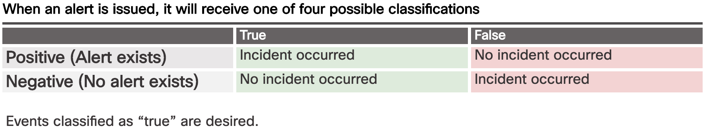
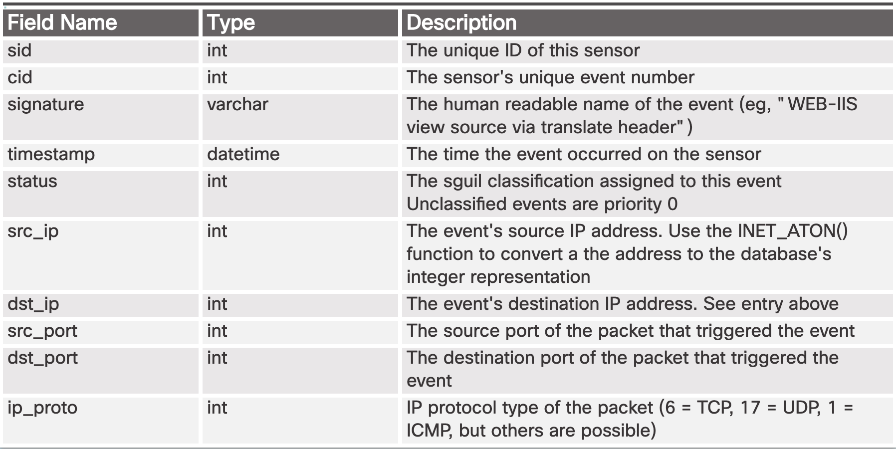
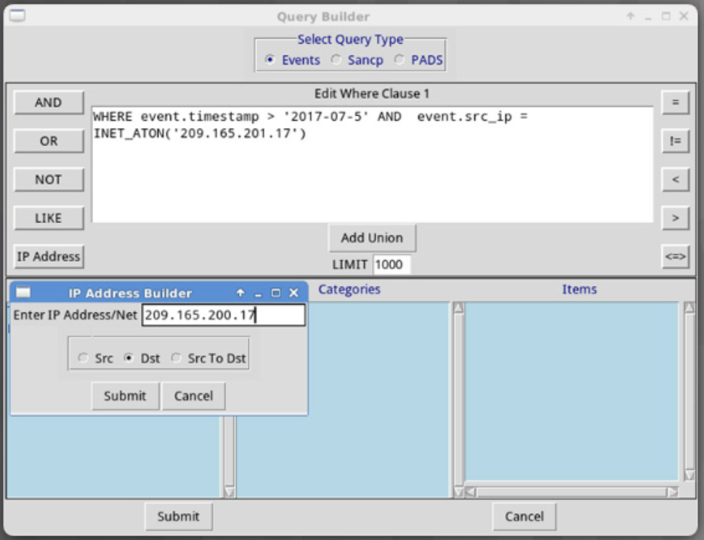

# Chapter 12: Intrusion Data Analysis

Now that you have spent some time learning about security monitoring and the types of data cybersecurity analysts work with on a daily basis, it is time to turn your attention to data analysis.

This chapter discusses how network security alerts are reported, evaluated, escalated, and preserved as evidence.

**Note**: At the end of the last chapter, you had the opportunity to install the multi-VM environment that will be used in this chapter. While reading this chapter, you may find it useful to have the Security Onion VM running so that you can become more familiar with the interface.

## 12.1 Evaluating Alerts

### 12.1.1 Sources of Alerts

#### 12.1.1.1 Security Onion

Security Onion is an open-source suite of Network Security Monitoring (NSM) tools that run on an Ubuntu Linux distribution. Security Onion can be installed as a standalone installation or as a sensor and server platform. Some components of Security Onion are owned and maintained by corporations, such as Cisco and Riverbend Technologies, but are made available as open source. For more information, and to obtain Security Onion, click [here](https://securityonion.net/).

**Note**: In some resources, you may see Security Onion abbreviated as SO. In this course, we will use Security Onion.

The figure shows the Security Onion logo and contains the following text. Security Onion is a suite of Network Security Monitoring (NSM) tools for evaluating alerts, providing three core functions to the cybersecurity analyst: Full packet capture and data types, Network-based and host-based intrusion detection systems, Alert analysis tools

#### 12.1.1.2 Detection Tools for Collecting Alert Data

Security Onion contains many components. It is an integrated environment which is designed to simplify the deployment of a comprehensive NSM solution. The figure illustrates a simplified view of the way in which some of the components of the Security Onion work together.

Previously in the course we have learned about the diverse types of data that are available for NSM. These data types, shown in the bottom of the figure, are collected by detection tools, which are shown in the middle of the figure:

-   **CapME** – This is a web application that allows viewing of pcap transcripts rendered with the tcpflow or Bro tools. CapME can be accessed from the Enterprise Log Search and Archive (ELSA) tool. CapME provides the cybersecurity analyst with an easy-to-read means of viewing an entire Layer 4 session. CapME acts as a plugin to ELSA and provides access to relevant pcap files that can be opened in Wireshark.

-   **Snort** – This is a Network Intrusion Detection System (NIDS). It is an important source of the alert data that is indexed in the Sguil analysis tool. Snort uses rules and signatures to generate alerts. Snort can automatically download new rules using the PulledPork component of Security Onion. Snort and PulledPork are open source tools that are sponsored by Cisco.

-   **Bro** – This is a NIDS that uses more of a behavior-based approach to intrusion detection. Rather than using signatures or rules, Bro uses policies, in the form of scripts that determine what data to log and when to issue alert notifications. Bro can also submit file attachments for malware analysis, block access to malicious locations, and shut down a computer that appears to be violating security policies.

-   **OSSEC** – This is a host-based intrusion detection system (HIDS) that is integrated into Security Onion. It actively monitors host system operations, including conducting file integrity monitoring, local log monitoring, system process monitoring, and rootkit detection. OSSEC alerts and log data are available to Sguil and ELSA. OSSEC requires an agent to be running on the Windows computers in the enterprise.

-   **Suricata** – This is a NIDS that uses a signature-based approach. It can also be used for inline intrusion prevention. It is similar to Bro; however, Suricata uses native multithreading, which allows the distribution of packet stream processing across multiple processor cores. It also includes some additional features such as reputation-based blocking and support for Graphics Processing Unit (GPU) multithreading for performance improvement.

<iframe id="media" title="interactive graphic" aria-label="interactive graphic" aria-describedby="media-description" src="https://static-course-assets.s3.amazonaws.com/CyberOps11/en/course/module12/12.1.1.2/media/index.html" style="border: none; display: block; width: 680px; height: 490px;"></iframe>

The graphic displays a three-level architecture for Security Onion. The bottom level is labelled data. It includes the following elements; pcaps, content data transaction data, session data, host logs, alert data, syslog data, and metadata. The middle layer is labelled detection. It includes the following elements; CapME, Snort, Bro, OSSEC, and Suricata. The top level is labelled Analysis. It includes Sguil with Wireshark and ELSA supporting Sguil.

#### 12.1.1.3 Analysis Tools

Security Onion integrates these various types of data and Intrusion Detection System (IDS) logs into a single platform through the following tools:

-   **Sguil** – This provides a high-level cybersecurity analysts’ console for investigating security alerts from a wide variety of sources. Sguil serves as a starting point in the investigation of security alerts. A wide variety of data sources are available to the cybersecurity analyst through pivoting directly from Sguil to other tools.

-   **ELSA** – This provides an interface to a wide variety of NSM data logs. Logging sources such as HIDS, NIDS, firewalls, syslog clients and servers, domain services, and others can be configured to make their logs available to ELSA databases. ELSA is configured to normalize logs from diverse sources so that the logs can be represented, stored, and accessed by following a common schema. ELSA search functionality is directly linked to Sguil alert records. ELSA right-click menus allow the cybersecurity analyst to easily search NSM data for details of an alert.

-   **Wireshark** – This is a packet capture application that is integrated into the Security Onion suite. It can be opened directly from other tools and will display full-packet captures relevant to an analysis.

**Note**: Other Security Onion tools not shown in the figure are beyond the scope of this course. A full description of Security Onion and its components can be found [here](https://github.com/Security-Onion-Solutions/security-onion/wiki/IntroductionToSecurityOnion).

<iframe id="media" title="interactive graphic" aria-label="interactive graphic" aria-describedby="media-description" src="https://static-course-assets.s3.amazonaws.com/CyberOps11/en/course/module12/12.1.1.3/media/index.html" style="border: none; display: block; width: 680px; height: 490px;"></iframe>

The graphic displays a three-level architecture for Security Onion. The bottom level is labelled data. It includes the following elements; pcaps, content data transaction data, session data, host logs, alert data, syslog data, and metadata. The middle layer is labelled detection. It includes the following elements; CapME, Snort, Bro, OSSEC, and Suricata. The top level is labelled Analysis. It includes Sguil with Wireshark and ELSA supporting Sguil.

#### 12.1.1.4 Alert Generation

Security alerts are notification messages that are generated by NSM tools, systems, and security devices. Alerts can come in many forms depending on the source. For example, syslog provides support for severity ratings which can be used to alert cybersecurity analysts regarding events that require attention.

In Security Onion, Sguil provides a console that integrates alerts from multiple sources into a timestamped queue. A cybersecurity analyst can work through the security queue investigating, classifying, escalating, or retiring alerts. In lieu of a dedicated workflow management system such as [Request Tracker for Incident Response](https://bestpractical.com/rtir/) (RTIR), a cybersecurity analyst would use the output of an application like Sguil to orchestrate an NSM investigation.

Alerts will generally include five-tuples information when available, as well as timestamps and information identifying which device or system generated the alert. Recall that the five-tuples includes the following information for tracking a conversation between a source and destination application:

-   **SrcIP** - the source IP address for the event.

-   **SPort** - the source (local) Layer 4 port for the event.

-   **DstIP** - the destination IP for the event.

-   **DPort** - the destination Layer 4 port for the event.

-   **Pr** - the IP protocol number for the event.

Additional information could be whether a permit or deny decision was applied to the traffic, some captured data from the packet payload, or a hash value for a downloaded file, or any of a variety of data.

The figure shows the Sguil application window with the queue of alerts in the top portion that are waiting to be investigated. The fields available for the real-time events are as follows:

-   **ST** – This is the status of the event. RT means real time. The event is color-coded by priority. The priorities are based on the category of the alert. There are four priority levels; very low, low, medium, and high. The colors range from light yellow to red as the priority increases.

-   **CNT** – This is the count for the number of times this event has been detected for the same source and destination IP address. The system has determined that this set of events is correlated. Rather than reporting each in a potentially long series of correlated events in this window, the event is listed once with the number of times it has been detected in this column. High numbers here can represent a security problem or the need for tuning of the event signatures to limit the number of potentially spurious events that are being reported.

-   **Sensor** – This is the agent reporting the event. The available sensors and their identifying numbers can be found in the Agent Status tab of the pane which appears below the events window on the left. These numbers are also used in the Alert ID column. From the Agent Status pane we can see that OSSEC, pcap, and Snort sensors are reporting to Sguil. In addition, we can see the default hostnames for these sensors, which includes the monitoring interface. Note that each monitoring interface has both pcap and Snort data associated with it.

-   **Alert ID** - This two-part number represents the sensor reporting the problem and the event number for that sensor. We can see from the figure that the largest number of events displayed are from the OSSEC sensor (1). The OSSEC sensor has reported eight sets of correlated events. Of these events, 232 have been reported with event ID 1.24.

-   **Date/Time** – This is the timestamp for the first event in a correlated series of events.

-   **Event Message** – This is the identifying text for the event. This is configured in the rule that triggered the alert. The associated rule can be viewed in the right-hand pane, just above the packet data. To do so, click the Show Rule checkbox.

Depending on the security technology, alerts can be generated based on rules, signatures, anomalies, or behaviors. No matter how they are generated, the conditions that trigger an alert must be predefined in some manner.

<iframe id="media" title="interactive graphic" aria-label="interactive graphic" aria-describedby="media-description" src="https://static-course-assets.s3.amazonaws.com/CyberOps11/en/course/module12/12.1.1.4/media/index.html" style="border: none; display: block; width: 680px; height: 490px;"></iframe>

The figure shows the Sguil application window. A security event is selected, and the associated rule is displayed.

#### 12.1.1.5 Rules and Alerts

Alerts can come from a number of sources:

-   **NIDS** - Snort, Bro and Suricata

-   **HIDS** - OSSEC

-   **Asset management and monitoring** - Passive Asset Detection System (PADS)

-   **HTTP, DNS, and TCP transactions** - Recorded by Bro and pcap

-   **Syslog messages** - Multiple sources

The information found in the alerts displayed in Sguil will differ in message format because they come from different sources.

The Sguil alert in the figure was triggered by a rule that was configured in Snort. It is important for the cybersecurity analyst to be able to interpret what triggered the alert so that the alert can be investigated. For this reason, the cybersecurity analyst should understand the components of Snort rules, which are a major source of alerts in Security Onion.

<iframe id="media" title="interactive graphic" aria-label="interactive graphic" aria-describedby="media-description" src="https://static-course-assets.s3.amazonaws.com/CyberOps11/en/course/module12/12.1.1.5/media/index.html" style="border: none; display: block; width: 680px; height: 490px;"></iframe>

The figure displays a rule as displayed in Sguil. An arrow points to the Sguil event that is generated by the rule.

#### 12.1.1.6 Snort Rule Structure

Snort rules consist of two sections, as shown in Figure 1: the rule header and the rule options. The rule header contains the action, protocol, source and destination IP addresses and netmasks, and the source and destination port information. The rule options section contains alert messages and information on which parts of the packet should be inspected to determine if the rule action should be taken. Rule Location is sometimes added by Sguil. Rule Location is the path to the file that contains the rule and the line number at which the rule appears so that it can be found and modified, or eliminated, if required.

**The Rule Header**

As shown in Figure 2, the rule header contains the action, protocol, addressing, and port information. In addition, the direction of flow that triggered the alert is indicated. The structure of the header portion is consistent between Snort alert rules.

Snort can be configured to use variables to represent internal and external IP addresses. These variables, **$HOME_NET** and **$EXTERNAL_NET**, appear in the Snort rules. They simplify the creation of rules by eliminating the need to specify specific addresses and masks for every rule. The values for these variables are configured in the **snort.conf** file. Snort also allows individual IP addresses, blocks of addresses, or lists of either to be specified in rules. Ranges of ports can be specified by separating the upper and lower values of the range with a colon. Other operators are also available.

**The Rule Options**

The structure of the options section of the rule is variable. It is the portion of the rule that is enclosed in parenthesis, as shown in Figure 3. It contains the text message that identifies the alert. It also contains metadata about the alert, such as a URL that provides reference information for the alert. Other information can be included, such as the type of rule and a unique numeric identifier for the rule and the rule revision. In addition, features of the packet payload can be specified in the options. Click [here](http://manual-snort-org.s3-website-us-east-1.amazonaws.com/node31.html) for a detailed explanation of all the rule options.

Snort rule messages may include the source of the rule. Three common sources for Snort rules are:

-   **GPL** - Older Snort rules that were created by Sourcefire and distributed under a GPLv2. The GPL ruleset is not [Cisco Talos](http://www.cisco.com/c/en/us/products/security/talos.html) certified. It includes Snort SIDs 3464 and below. The GPL ruleset is available [here](https://www.snort.org/downloads/), and it is included in Security Onion.

-   **ET** - Snort rules from Emerging Threats. Emerging Threats is a collection point for Snort rules from multiple sources. ET rules are open source under a BSD license. The ET ruleset contains rules from multiple [categories](http://docs.emergingthreats.net/bin/view/Main/EmergingFAQ). A set of ET rules is included with Security Onion.

-   **VRT** - These rules are immediately available to subscribers and are released to registered users 30 days after they were created, with some limitations. They are now created and maintained by Cisco Talos.

Rules can be downloaded automatically from Snort.org using the PulledPork rule management utility that is included with Security Onion.

Alerts not generated by Snort rules are identified by the OSSEC or PADS tags, among others. In addition, custom local rules can be created.

<iframe id="media" title="interactive graphic" aria-label="interactive graphic" aria-describedby="media-description" src="https://static-course-assets.s3.amazonaws.com/CyberOps11/en/course/module12/12.1.1.6/media/index.html" style="border: none; display: block; width: 680px; height: 490px;"></iframe>

Figure one is explained in the text. Figure two shows a Snort rule with the rule header highlighted and the elements are described as follows. Alert is the action to be taken. Other possible actions are log and pass. I.P. is the protocol. Any any indicates that any source I.P. address and any source Layer 4 port should be matched. The arrow indicates which direction of traffic flow, from source to destination or destination to source, should be matched. The second any any specifies the destination I.P. address and Layer4 port. Figure 3 describes elements of the options portion of the rule. M.s.g. contains text that describes the alert. Content refers to the contents of the packet. Classtype indicates the category of the attack. Snort includes a set of default categories that have one of four priority values. S.i.d. is a unique identifier for the rule, and rev is the revision of the rule.

#### 12.1.1.7 Lab - Snort and Firewall Rules

Different security appliances and software perform different functions and record different events. As a consequence, the alerts that are generated by different appliances and software will also vary.

In this lab, to get familiar with firewall rules and IDS signatures you will:

-   Perform live-monitoring of IDS and events.

-   Configure your own customized firewall rule to stop internal hosts from contacting a malware-hosting server.

-   Craft a malicious packet and launch it against an internal target.

-   Create a customized IDS rule to detect the customized attack and issue an alert based on it.

[Lab - Snort and Firewall Rules](https://static-course-assets.s3.amazonaws.com/CyberOps11/en/course/files/12.1.1.7 Lab - Snort and Firewall Rules.pdf)

<iframe id="media" src="https://static-course-assets.s3.amazonaws.com/CyberOps11/en/course/module12/12.1.1.7/media/index.html" title="interactive graphic" aria-label="interactive graphic" aria-describedby="media-description" style="border: none; display: block; width: 680px; height: 490px;"></iframe>

This page contains a lab activity titled snort and firewall rules.

### 12.1.2 Overview of Alert Evaluation

#### 12.1.2.1 The Need for Alert Evaluation

The threat landscape is constantly changing as new vulnerabilities are discovered and new threats evolve. As user and organizational needs change, so also does the attack surface. Threat actors have learned how to quickly vary features of their exploits in order to evade detection.

It is impossible to design measures to prevent all exploits. Exploits will inevitably evade protection measures, no matter how sophisticated they may be. Sometimes, the best that can be done is to detect exploits during or after they have occurred. Detection rules should be overly conservative. In other words, it is better to have alerts that are sometimes generated by innocent traffic, than it is to have rules that miss malicious traffic. For this reason, it is necessary to have skilled cybersecurity analysts investigate alerts to determine if an exploit has actually occurred.

Tier 1 cybersecurity analysts will typically work through queues of alerts in a tool like Sguil, pivoting to tools like Bro, Wireshark, and ELSA to verify that an alert represents an actual exploit.

<iframe id="media" title="interactive graphic" aria-label="interactive graphic" aria-describedby="media-description" src="https://static-course-assets.s3.amazonaws.com/CyberOps11/en/course/module12/12.1.2.1/media/index.html" style="border: none; display: block; width: 680px; height: 490px;"></iframe>

The figure shows a box labelled Sguil with three arrows pointing down to boxes labelled ELSA, Bro, and Wireshark.

#### 12.1.2.2 Evaluating Alerts

Security incidents are classified using a scheme borrowed from medical diagnostics. This classification scheme is used to guide actions and to evaluate diagnostic procedures. For example, when a patient visits a doctor for a routine examination, one of the doctor’s tasks is to determine whether the patient is sick. One of the outcomes can be a correct determination that disease is present and the patient is sick. Another outcome can be that there is no disease and the patient is healthy.

The concern is that either diagnosis can be accurate, or true, or inaccurate, or false. For example, the doctor could miss the signs of disease and make the incorrect determination that the patient is well when they are in fact sick. Another possible error is to rule that a patient is sick when that patient is in fact healthy. False diagnoses are either costly or dangerous.

In network security analysis, the cybersecurity analyst is presented with an alert. This is similar to a patient going to the doctor and saying, “I am sick.” The cybersecurity analyst, like the doctor, needs to determine if this diagnosis is true. The cybersecurity analyst asks, “The system says that an exploit has occurred. Is this true?”

Alerts can be classified as follows, as shown in the figure:

-   **True Positive**: The alert has been verified to be an actual security incident.

-   **False Positive**: The alert does not indicate an actual security incident.

An alternative situation is that an alert was not generated. The absence of an alert can be classified as:

-   **True Negative**: No security incident has occurred.

-   **False Negative**: An undetected incident has occurred.

**True positives** are the desired type of alert. They mean that the rules that generate alerts have worked.

**False positives** are not desirable. Although they do not indicate that an undetected exploit has occurred, they are costly because cybersecurity analysts musts investigate false alarms; therefore, time is taken away from investigation of alerts that indicate true exploits.

**True negatives** are also desirable. They indicate that normal traffic is correctly ignored and erroneous alerts are not being issued.

**False negatives** are dangerous. They indicate that exploits are not being detected by the security systems that are in place. These incidents could go undetected for a long time, and ongoing data loss and damage could result.

When true positives are suspected, a Tier 1 cybersecurity analyst is sometimes required to escalate the alert to a cybersecurity investigator who is working at Tier 2. The Tier 2 cybersecurity analyst will move forward with the investigation in order to confirm the incident and identify any potential damage that may have been caused. This information will be used by more senior security personnel who will work to isolate the damage, address vulnerabilities, mitigate the threat, and deal with reporting requirements.

A cybersecurity analyst may also be responsible for informing security personnel that false positives are occurring to the extent that the cybersecurity analyst’s time is seriously impacted. This situation indicates that security systems need to be tuned to become more efficient. Legitimate changes in the network configuration or newly downloaded detection rules could result in a sudden spike in false positives.

False negatives may be discovered well after an exploit has occurred. This can happen through retrospective security analysis (RSA). RSA can occur when newly obtained rules or other threat intelligence is applied to archived network security data. For this reason, it is important to monitor threat intelligence to learn of new vulnerabilities and exploits and to evaluate the likelihood that the network was vulnerable. In addition, the exploit needs to be evaluated regarding the potential damage that the enterprise could suffer. It may be determined that adding new mitigation techniques is sufficient, or that a more detailed analysis should be conducted.

#### 12.1.2.3 Deterministic Analysis and Probabilistic Analysis

Statistical techniques can be used to evaluate the risk that exploits will be successful in a given network. This type of analysis can help decision makers to better evaluate the cost of mitigating a threat with the damage that an exploit could cause.

Two general approaches used to do this are deterministic and probabilistic analysis, as shown in the figure. Deterministic analysis evaluates risk based on what is known about a vulnerability. It assumes that for an exploit to be successful all prior steps in the exploit process must also be successful. This type of risk analysis can only describe the worst case. However, many threat actors, although aware of the process to carry out an exploit, may lack the knowledge or expertise to successfully complete each step on the path to a successful exploit. This can give the cybersecurity analyst an opportunity to detect the exploit and stop it before it proceeds any further.

Probabilistic analysis estimates the potential success of an exploit by estimating the likelihood that if one step in an exploit has successfully been completed that the next step will also be successful. Probabilistic analysis is especially useful in real time network security analysis in which numerous variables are at play and a given threat actor can make unknown decisions as an exploit is pursued.

Probabilistic analysis relies on statistical techniques that are designed to estimate the probability that an event will occur based on the likelihood that prior events will occur. Using this type of analysis, the most likely paths that an exploit will take can be estimated and the attention of security personnel can be focused on preventing or detecting the most likely exploit.

In a deterministic analysis, all of the information to accomplish an exploit is assumed to be known. The characteristics of the exploit, such as the use of specific port numbers, are known either from other instances of the exploit, or because standardized ports are in use. In probabilistic analysis, it is assumed that the port numbers that will be used can only be predicted with some degree of confidence. In this situation, an exploit that uses dynamic port numbers, for example, cannot be analyzed deterministically. Such exploits have been optimized to avoid detection by firewalls that use static rules.

<iframe id="media" title="interactive graphic" aria-label="interactive graphic" aria-describedby="media-description" src="https://static-course-assets.s3.amazonaws.com/CyberOps11/en/course/module12/12.1.2.3/media/index.html" style="border: none; display: block; width: 680px; height: 490px;"></iframe>

The figure is explained in the text.

#### 12.1.2.4 Activity - Identify Deterministic and Probabilistic Scenarios

## 12.2 Working with Network Security Data

### 12.2.1 A Common Data Platform

#### 12.2.1.1 ELSA

ELSA stands for Enterprise Log Search and Archive. As the name implies, ELSA is an enterprise-level tool for allowing searching and archiving of NSM data that originates from multiple sources. ELSA is able to normalize log file entries into a common schema that can then be displayed in the ELSA web interface. Search follows a simple syntax and also more complex regular expression-based patterns for searching and filtering, if required. ELSA is capable of indexing, archiving, and searching large amounts of NSM data.

ELSA receives logs over Syslog-NG, stores logs in MySQL databases, and indexes using Sphinx Search. The data is served by a web server process and accessed by users through a browser. ELSA is designed to handle a high volume of data and is fast and scalable.

Searches can be executed by “pivoting” from Sguil to ELSA, or ELSA may be opened on its own. A large set of premade queries is available when ELSA is opened on its own, and searches can be constructed as well. The figure shows the ELSA interface with example query results. The blue frame on the left side of the browser window contains a list of the types of premade queries available. Each type of search can be expanded to reveal a variety of queries that can suit the general needs of a cybersecurity analyst.

<iframe id="media" title="interactive graphic" aria-label="interactive graphic" aria-describedby="media-description" src="https://static-course-assets.s3.amazonaws.com/CyberOps11/en/course/module12/12.2.1.1/media/index.html" style="border: none; display: block; width: 680px; height: 490px;"></iframe>

The figure shows a view of the ELSA interface.

#### 12.2.1.2 Data Reduction

The amount of network traffic that is collected by packet captures and the number of log file entries and alerts that are generated by network and security devices can be enormous. Even with recent advances in Big Data, processing, storing, accessing, and archiving NSM-related data is a daunting task. For this reason, it is important to identify the network data that should be gathered. Not every log file entry, packet, and alert needs to be gathered. By limiting the volume of data, tools like ELSA will be far more useful, as shown in the figure.

Some network traffic has little value to NSM. Encrypted data, such as IPsec or SSL traffic, is largely unreadable. Some traffic, such as that generated by routing protocols or STP is routine and can be excluded. Other broadcast and multicast protocols can usually be eliminated from packet captures, as can traffic from other protocols that generate a lot of routine traffic.

In addition, alerts that are generated by a HIDS, such as Windows security auditing or OSSEC, should be evaluated for relevance. Some are informational or of low potential security impact. These messages can be filtered from NSM data. Similarly, syslog may store messages of very low severity that should be disregarded to diminish the quantity of NSM data to be handled.

<iframe id="media" title="interactive graphic" aria-label="interactive graphic" aria-describedby="media-description" src="https://static-course-assets.s3.amazonaws.com/CyberOps11/en/course/module12/12.2.1.2/media/index.html" style="border: none; display: block; width: 680px; height: 490px;"></iframe>

The figure shows three N.S.M data types, pcaps, syslog, and alerts. The three data types are shown entering a funnel that is labelled ELSA. The output of the funnel is labelled relevant network data.

#### 12.2.1.3 Data Normalization

Data normalization is the process of combining data from a number of data sources into a common format. ELSA provides a series of plugins that process security data and transform it before it is added to ELSA databases. Additional plugins can be created to suit the needs of the organization.

A common schema will specify the names and formats for the required data fields. Formatting of the data fields can vary widely between sources. However, if searching is to be effective, the data fields must be consistent. For example, as shown in Figure 1, IPv6 addresses, MAC addresses, and date and time information can be represented in varying formats. Similarly, subnet masks, DNS records, and so on can vary in format between data sources.

Data normalization is required to simplify searching for correlated events. If differently formatted values exist in the NSM data for IPv6 addresses, for example, a separate query term would need to be created for every variation in order for correlated events to be returned by the query.

When ELSA displays a log file entry, the original entry is shown in bold, and the normalized entry appears below it with the ELSA field identifiers and their values, as shown in Figure 2.

<iframe id="media" title="interactive graphic" aria-label="interactive graphic" aria-describedby="media-description" src="https://static-course-assets.s3.amazonaws.com/CyberOps11/en/course/module12/12.2.1.3/media/index.html" style="border: none; display: block; width: 680px; height: 490px;"></iframe>

Figure one shows several different ways that the same I.P.v.6 and MAC addresses can be formatted. It also shows several different formats for the same date timestamp. Figure 2 shows a sample ELSA log entry and compares the formatting of fields in the original log to the normalized formats used by ELSA.

#### 12.2.1.4 Data Archiving

Everyone would love the security of collecting and saving everything, just in case. However, retaining NSM data indefinitely is not feasible due to storage and access issues. It should be noted that the retention period for certain types of network security information may be specified by compliance frameworks. For example, the Payment Card Industry Security Standards Council (PCI DSS) requires and that an audit trail of user activities related to protected information be retained for one year.

Security Onion has different data retention periods for different types of NSM data. For pcaps and raw Bro logs, a value assigned in the **securityonion.conf** file controls the percentage of disk space that can be used by log files. By default, this value is set to 90%. For ELSA, retention of archived logs is dependent on values set in the **elsa_node.conf** file. These values are related to the amount of storage space that is available. By default, Security Onion is configured with a log size limit of 3GB. The guideline is that this value should be 90-95% of the total disk space that ELSA is using. By default, ELSA will use 33% of the configured log size limit for archived logs. ELSA can optionally be configured to retain data for a period of time. The provided value for this in the configuration file is 90 days.

Sguil alert data is retained for 30 days by default. This value is set in the **securityonion.conf** file.

Security Onion is known to require a lot of storage and RAM to run properly. Depending on the size of the network, multiple terabytes of storage may be required. Of course, Security Onion data can always be archived to external storage by a data archive system, depending on the needs and capabilities of the organization.

**Note**: The storage locations for the different types of Security Onion data will vary based on the Security Onion implementation.

<iframe id="media" title="interactive graphic" aria-label="interactive graphic" aria-describedby="media-description" src="https://static-course-assets.s3.amazonaws.com/CyberOps11/en/course/module12/12.2.1.4/media/index.html" style="border: none; display: block; width: 680px; height: 490px;"></iframe>

The figure shows a digital representation of servers with a shield in front of them.

#### 12.2.1.5 Lab – Convert Data into a Universal Format

Log entries are generated by network devices, operating systems, applications, and various types of programmable devices. A file containing a time-sequenced stream of log entries is called a log file.

By nature, log files record events that are relevant to the source. The syntax and format of data within log messages are often defined by the application developer.

Therefore, the terminology used in the log entries often varies from source to source. For example, depending on the source, the terms login, logon, authentication event, and user connection, may all appear in log entries to describe a successful user authentication to a server.

It is often desirable to have a consistent and uniform terminology in logs generated by different sources. This is especially true when all log files are being collected by a centralized point.

The term normalization refers to the process of converting parts of a message, in this case a log entry, to a common format.

In this lab, you will use command line tools to manually normalize log entries. In Part 2, the timestamp field must be normalized. In Part 3, the IPv6 field is the one that requires normalization.

[Lab - Convert Data into a Universal Format](https://static-course-assets.s3.amazonaws.com/CyberOps11/en/course/files/12.2.1.5 Lab - Convert Data into a Universal Format.pdf)

<iframe id="media" src="https://static-course-assets.s3.amazonaws.com/CyberOps11/en/course/module12/12.2.1.5/media/index.html" title="interactive graphic" aria-label="interactive graphic" aria-describedby="media-description" style="border: none; display: block; width: 680px; height: 490px;"></iframe>

This page contains a lab activity titled convert data into universal format.

### 12.2.2 Investigating Network Data

#### 12.2.2.1 Working in Sguil

The primary duty of a cybersecurity analyst is the verification of security alerts. Depending on the organization, the tools used to do this will vary. For example, a ticketing system may be used to manage task assignment and documentation. In Security Onion, the first place that a cybersecurity analyst will go to verify alerts is Sguil.

Sguil automatically correlates similar alerts into a single line and provides a way to view correlated events represented by that line. In order to get a sense of what has been happening in the network, it may be useful to sort on the **CNT** column to display the alerts with the highest frequency.

**Note**: In the figure, the title of the **CNT** column is hidden. The **CNT** column is column two between the **ST** and **Sensor** columns.

Right-clicking the **CNT** value and selecting **View Correlated Events** opens a tab displaying all the correlated events. This can help the cybersecurity analyst understand the time frame during which the correlated events were received by Sguil. Note that each event receives a unique event ID. Only the first event ID in the series of correlated events is displayed in the RealTime tab. The figure shows Sguil alerts sorted on **CNT** with the **View Correlated Events** menu open.

<iframe id="media" title="interactive graphic" aria-label="interactive graphic" aria-describedby="media-description" src="https://static-course-assets.s3.amazonaws.com/CyberOps11/en/course/module12/12.2.2.1/media/index.html" style="border: none; display: block; width: 680px; height: 490px;"></iframe>

The figure provides a view of the Sguil window.

#### 12.2.2.2 Sguil Queries

Queries can be constructed in Sguil using the Query Builder. It simplifies constructing queries to a certain degree, but the cybersecurity analyst must know the field names and some issues with field values. For example, Sguil stores IP addresses in an integer representation. In order to query on an IP address in dotted decimal notation, the IP address value must be placed within the **INET_ATON()** function. Query Builder is opened from the Sguil **Query** menu. Select **Query Event Table** to search active events.

Figure 1 shows the names of the event table fields that can be queried directly. Selecting **Show DataBase Tables** from the **Query** menu displays a reference to the field names and types for each of the tables that can be queried. 

Figure 2 shows a simple timestamp and IP address query made in the Query Builder window. Note the use of the **INET_ATON()** function to simplify entering an IP address.

In Figure 3, the cybersecurity analyst is investigating a source port 40754 that is associated with an Emerging Threats alert. Towards the end of the query, the **WHERE event.src_port = ‘40754’** portion was created by the user in Query Builder. The remainder of the Query is supplied automatically by Sguil and concerns how the data that is associated with the events is to be retrieved, displayed, and presented.

#### 12.2.2.3 Pivoting from Sguil

Sguil provides the ability for the cybersecurity analyst to pivot to other information sources and tools. Log files are available in ELSA, relevant packet captures can be displayed in Wireshark, and transcripts of TCP sessions and Bro information are also available. The menu shown in the figure was opened by right-clicking on an Alert ID. Selecting from this menu will open information about the alert in other tools, which provides rich, contextualized information to the cybersecurity analyst.

Additionally, Sguil can provide pivots to Passive Real-time Asset Detection System (PRADS) and Security Analyst Network Connection Profiler (SANCP) information.

PRADS gathers network profiling data, including information about the behavior of assets on the network. PRADS is an event source, like Snort and OSSEC. It can also be queried through Sguil when an alert indicates that an internal host may have been compromised. Executing a PRADS query out of Sguil can provide information about the services, applications, and payloads that may be relevant to the alert. In addition, PRADS detects when new assets appear on the network.

**Note**: The Sguil interface refers to PADS instead of PRADS. PADS was the predecessor to PRADS. PRADS is the tool that is actually used in Security Onion. PRADS is also used to populate SANCP tables. In Security Onion, the functionalities of SANCP have been replaced by PRADS, however the term SANCP is still used in the Sguil interface. PRADS collects the data, and a SANCP agent records the data in a SANCP data table.

The SANCP functionalities concern collecting and recording statistical information about network traffic and behavior. SANCP provides a means of verifying that network connections are valid. This is done through the application of rules that indicate which traffic should be recorded and the information with which the traffic should be tagged.

<iframe id="media" title="interactive graphic" aria-label="interactive graphic" aria-describedby="media-description" src="https://static-course-assets.s3.amazonaws.com/CyberOps11/en/course/module12/12.2.2.3/media/index.html" style="border: none; display: block; width: 680px; height: 490px;"></iframe>

The figure shows the Sguil window. The menu that results from right-clicking an alert I.D. is shown. The choices in the menu are Event History, Transcript, Transcript (force new), Wireshark, Wireshark (force new), NetworkMiner, NetworkMiner (force new), Bro, Bro (force new).

#### 12.2.2.4 Event Handling in Sguil

Finally, Sguil is not only a console that facilitates investigation of alerts. It is also a tool for addressing alerts. Three tasks can be completed in Sguil to manage alerts. First, alerts that have been found to be false positives can be expired. This can be done by using the right-click menu or by pressing the F8 key. An expired event disappears from the queue. Second, if the cybersecurity analyst is uncertain how to handle an event, it can be escalated by pressing the F9 key. The alert will be moved to the Sguil Escalated Events tab. Finally, an event can be categorized. Categorization is for events that have been identified as true positives.

Sguil includes seven pre-built categories that can be assigned by using the menu, which is shown in the figure, or by pressing the corresponding function key. For example, an event would be categorized as Cat I by pressing the F1 key. In addition, criteria can be created that will automatically categorize an event. Categorized events are assumed to have been handled by the cybersecurity analyst. When an event is categorized, it is removed from the list of **RealTime Events**. The event remains in the database however, and it can be accessed by queries that are issued by category.

This course covers Sguil at a basic level. Click [here](http://nsmwiki.org/Sguil_FAQ) for additional information about using Sguil.

<iframe id="media" title="interactive graphic" aria-label="interactive graphic" aria-describedby="media-description" src="https://static-course-assets.s3.amazonaws.com/CyberOps11/en/course/module12/12.2.2.4/media/index.html" style="border: none; display: block; width: 680px; height: 490px;"></iframe>

The figure shows the menu that results from right-clicking an entry in the ST column in Sguil. The menu has the following entries: Create AutoCat from Event, Expire Event as N.A. (F.8), Expire Event as N.A. with Comment, Quick Query, and Update Event Status. Update Event Status has been selected and the following choices are displayed in the open menu: Escalate (F.9), Cat 1: Unauthorized Root Access (F.1), Cat 1: Add Comment, Cat 2: Unauthorized User Access (F.2), Cat 2: Add Comment, Cat 3: Attempted Unauthorized Access (F.3), Cat 3: Add Comment, Cat 4, Successful Denial of Service Attack (F.4), Cat 4: Add Comment, Cat 5: Poor Security Practice or Policy Violation (F.5), Cat 5: Add Comment, Cat 6: Reconnaissance/Probes/Scans (F.6), Cat 6: Add Comment, Cat 7: Virus Infection (F.7), Cat 7: Add Comment.

#### 12.2.2.5 Working in ELSA

ELSA provides access to a large number of log file entries. Because the number of logs that could be displayed in ELSA is so large, several default values have been set to minimize the number of records that ELSA displays when it is launched. It is important to know that ELSA will only retrieve the first 100 records for the previous 48 hours. If no records have been generated for that period (unlikely in a production network) the ELSA window will be empty. To increase the number of records displayed, the directive **limit:1000** can be added to the query. This specifies the limit for the number of records to be returned by the query, in this case 1000.

In order to see log file records for a different period of time, the **From** and **To** dates in the ELSA query can be changed by clicking on **From** or **To** and using the calendar pop-up menus, or by entering dates and times manually. The figure shows the calendar pop-up menu. In addition, ELSA must have a query submitted in order to display records. Changing the dates is not enough to refresh the list of log file entries.

The easiest way to see information in ELSA is to issue the built-in queries that appear to the left of the ELSA window and then adjust the dates and resubmit the query using the Submit Query button. There are many useful searches available. When clicked, the queries appear in the query field and can be edited there if necessary.

<iframe id="media" title="interactive graphic" aria-label="interactive graphic" aria-describedby="media-description" src="https://static-course-assets.s3.amazonaws.com/CyberOps11/en/course/module12/12.2.2.5/media/index.html" style="border: none; display: block; width: 680px; height: 490px;"></iframe>

The figure is explained in the text.

#### 12.2.2.6 Queries in ELSA

Constructing queries is very simple in ELSA. There are many shortcuts available for refining queries without doing any typing. ELSA uses a very natural syntax roughly based on Google search syntax. A query consisting of just an IP address will work. However, because of the large numbers of records that are potentially returned, a number of operators and directives exist for narrowing searches and stipulating which records should be displayed.

**Note**: Advanced ELSA queries are beyond the scope of this course. In the labs, you will be provided with the complex query statements, if necessary.

Figure 1 shows a query executed on an IP address. This will result in all records that contain the IP address for the given time and date range being returned. This is not very useful. However, it is easy to narrow the query by clicking on an entry in the **Field Summary** list that summarizes the search results.

Clicking an entry will display a summary screen with bar graphs that depict all of the unique values and their frequencies that appear for the results of the query, as shown in Figure 2. Clicking an entry in the Value column will display the query with the value added to the previous query. This process can be repeated to narrow down search results easily. In this way, queries can be constructed for the five tuples and a wide range of other values.

ELSA provides field summary and value information for every field that is indexed in the query results. This permits refining queries based on a wide range of values. In addition, queries can be created by simply clicking on a value or attribute in the ELSA-normalized portion of a log file entry.

ELSA queries can also use regular expressions to create advanced patterns for matching specific packet contents. Regular expressions are executed in ELSA using the grep function. Grep serves as a transform in ELSA queries. This means it is used to process the results from a query. The grep transform serves as a text-based filter that tells ELSA which records should be displayed. The grep function is passed the field name to match, and a regular expression pattern to apply, as in **grep(*****field,pattern\*****).** Unix-like pipes, using the | symbol, can be used to direct the output of ELSA queries through ELSA plugins and transforms.

ELSA queries may be saved as named macros. These queries can then be called in the query box by entering the name of the query preceded by the dollar sign symbol (**$**). Query macros can also be combined with other query elements.

<iframe id="media" title="interactive graphic" aria-label="interactive graphic" aria-describedby="media-description" src="https://static-course-assets.s3.amazonaws.com/CyberOps11/en/course/module12/12.2.2.6/media/index.html" style="border: none; display: block; width: 680px; height: 490px;"></iframe>

The figure shows the ELSA window. An I.P. address has been entered in the Query box and the query results are shown. The list of Field Summary links that are available for the query results is also shown. Each field that is present in the results and the number of log file entries for each field is shown in the list. Figure 2 shows the result of clicking the program field entry in the Field Summary list. A new page is displayed in which the I.P. address query results are now grouped by the program field. A bar chart shows the number of log file records for each program. The programs that are present are bro_conn, httpd, ossec_archive, and snort. In addition, a table is shown that contains the count for each program and a hyperlink that will create a new query for only entries for the .IP. address query and that program value.

#### 12.2.2.7 Investigating Process or API Calls

Application programs interact with an operating system (OS) through system calls to the OS application programming interface (API), as shown in the figure. These system calls allow access to many aspects of system operation such as:

-   Software process control

-   File management

-   Device management

-   Information management

-   Communication

Malware can also make system calls. If malware can fool an OS kernel into allowing it to make system calls, many exploits are possible.

HIDS software tracks the operation of a host OS. OSSEC rules detect changes in host-based parameters like the execution of software processes, changes in user privileges, and registry modifications, among many others. OSSEC rules will trigger an alert in Sguil. Pivoting to ELSA on the host IP address allows you to choose the type of alert based on the program that created it. Choosing OSSEC as the source program in ELSA results in a view of the OSSEC events that occurred on the host, including indicators that malware may have interacted with the OS kernel.

<iframe id="media" title="interactive graphic" aria-label="interactive graphic" aria-describedby="media-description" src="https://static-course-assets.s3.amazonaws.com/CyberOps11/en/course/module12/12.2.2.7/media/index.html" style="border: none; display: block; width: 680px; height: 490px;"></iframe>

The figure shows an icon that represents a user with an arrow that points to a rectangle that is labelled applications. Another arrow points to two tall overlapping rectangles that indicate that an A.P.I. overlays an operating system kernel. The arrow is labelled system calls, indicating that applications send system calls to an A.P.I. that interacts with the operating system kernel. Finally the operating system kernel has individual arrows that point to rectangles that are labelled files, processes, network, I/O, and devices. This indicates that software system calls can control these functionalities through the A.P.I. and O/S kernel.

#### 12.2.2.8 Investigating File Details

When ELSA is opened directly, a query short cut exists for **Files**. By opening the **Files** queries and selecting **Mime Types** in the menu, a list of the types of files that have been downloaded, and their frequencies, is displayed, as shown in Figure 1. If the cybersecurity analyst is interested in the executable files, clicking **application/XML** will display records for all logged instances in which executable files were downloaded during the time scope of the query.

Figure 2 shows details of a record returned by this query. File details, such as the file size, sending and receiving hosts, and protocol used to download the file are displayed. In addition, the MD5 and SHA-1 hashes for the file have been calculated. If the cybersecurity analyst is suspicious of the file, the hash value can be submitted to an online site, such as [VirusTotal](https://www.virustotal.com/en/), to determine if the file is known malware. The hash value can be submitted from the Search tab on the VirusTotal page.

<iframe id="media" title="interactive graphic" aria-label="interactive graphic" aria-describedby="media-description" src="https://static-course-assets.s3.amazonaws.com/CyberOps11/en/course/module12/12.2.2.8/media/index.html" style="border: none; display: block; width: 680px; height: 490px;"></iframe>

Figure 1 is explained in the text. Figure 2 is explained in the text.

#### 12.2.2.9 Lab – Regular Expression Tutorial

A regular expression (regex) is a pattern of symbols that describes data to be matched in a query or other operation. Regular expressions are constructed similarly to arithmetic expressions, by using various operators to combine smaller expressions. There are two major standards of regular expression, POSIX and Perl.

In this lab, you will use an online tutorial to explore regular expressions. You will also describe the information that matches given regular expressions.

[Lab - Regular Expression Tutorial](https://static-course-assets.s3.amazonaws.com/CyberOps11/en/course/files/12.2.2.9 Lab - Regular Expression Tutorial.pdf)

[RegexOne](https://regexone.com/)

#### 12.2.2.10 Lab - Extract an Executable from a PCAP

Looking at logs is very important but it is also important to understand how network transactions happen at the packet level.

In this lab, you will analyze the traffic in a previously captured pcap file and extract an executable from the file.

[Lab - Extract an Executable from a PCAP](https://static-course-assets.s3.amazonaws.com/CyberOps11/en/course/files/12.2.2.10 Lab - Extract an Executable from a PCAP.pdf)

### 12.2.3 Enhancing the Work of the Cybersecurity Analyst

#### 12.2.3.1 Dashboards and Visualizations

Dashboards provide a combination of data and visualizations designed to improve the access of individuals to large amounts of information. Dashboards are usually interactive. They allow cybersecurity analysts to focus on specific details and information by clicking on elements of the dashboard. For example, clicking on a bar in a bar chart could provide a breakdown of the information for the data represented by that bar. ELSA includes the capability of designing custom dashboards. In addition, other tools that are included in Security Onion, such as Squert, provide a visual interface to NSM data.

[Cisco Talos](https://www.talosintelligence.com/) provides an interactive dashboard that allows investigation of the threat landscape, as shown in the figure.

<iframe id="media" title="interactive graphic" aria-label="interactive graphic" aria-describedby="media-description" src="https://static-course-assets.s3.amazonaws.com/CyberOps11/en/course/module12/12.2.3.1/media/index.html" style="border: none; display: block; width: 680px; height: 490px;"></iframe>

The figure is explained in the text.

#### 12.2.3.2 Workflow Management

Because of the critical nature of network security monitoring, it is essential that workflows are managed. This enhances efficiency of the cyberoperations team, increases the accountability of staff, and ensures that all potential alerts are treated properly. In large security organizations, it is conceivable that thousands of alerts will be received daily. Each alert should be systematically assigned, processed, and documented by cyberoperations staff.

Runbook automation, or workflow management systems, provide the tools necessary to streamline and control processes in a cybersecurity operations center. Sguil provides basic workflow management. However, it is not a good choice for large operations with many employees. Instead, third party workflow management systems are available that can be customized to suit the needs of cybersecurity operations.

In addition, automated queries are useful for adding efficiency to the cyberoperations workflow. These queries, sometimes known as plays, or playbooks, automatically search for complex security incidents that may evade other tools. For example, an ELSA query can be configured as an alert rule that can be run regularly. ELSA can notify cybersecurity analysts by email, or other means, that a suspected exploit has been detected by the query. Playbooks can also be created in a scripting language such as Python and integrated into workflow management systems to ensure that the alerts are processed, documented, and reported along with other alerts.

<iframe id="media" title="interactive graphic" aria-label="interactive graphic" aria-describedby="media-description" src="https://static-course-assets.s3.amazonaws.com/CyberOps11/en/course/module12/12.2.3.2/media/index.html" style="border: none; display: block; width: 680px; height: 490px;"></iframe>

The figure shows a generic flow chart with the title of workflow management.

## 12.3 Digital Forensics

### 12.3.1 Evidence Handling and Attack Attribution

#### 12.3.1.1 Digital Forensics

Now that you have investigated and identified valid alerts, what do you do with the evidence? The cybersecurity analyst will inevitably uncover evidence of criminal activity. In order to protect the organization and to prevent cybercrime, it is necessary to identify threat actors, report them to the appropriate authorities, and provide evidence to support prosecution. Tier 1 cybersecurity analysts are usually the first to uncover wrong doing. Cybersecurity analysts must know how to properly handle evidence and attribute it to threat actors.

Digital forensics is the recovery and investigation of information found on digital devices as it relates to criminal activity. This information could be data on storage devices, in volatile computer memory, or the traces of cybercrime that are preserved in network data, such as pcaps and logs.

Cybercriminal activity can be broadly characterized as originating from inside of or outside of the organization. Private investigations are concerned with individuals inside the organization. These individuals could simply be behaving in ways that violate user agreements or other non-criminal conduct. When individuals are suspected of involvement in criminal activity involving the theft or destruction of intellectual property, an organization may choose to involve law enforcement authorities, in which case the investigation becomes public. Internal users could also have used the organization’s network to conduct other criminal activities that are unrelated to the organizational mission but are in violation of various legal statutes. In this case, public officials will carry out the investigation.

When an external attacker has exploited a network and stolen or altered data, evidence needs to be gathered to document the scope of the exploit. Various regulatory bodies specify a range of actions that an organization must take when various types of data have been compromised. The results of forensic investigation can help to identify the actions that need to be taken.

For example, under HIPAA, if a data breach has occurred that involves patient information, notification of the breach must be made to the affected individuals. If the breach involves more than 500 individuals in a state or jurisdiction, the media, as well as the affected individuals, must be notified. Digital forensic investigation must be used to determine which individuals were affected, and to certify the number of affected individuals so that appropriate notification can be made in compliance with HIPAA regulations.

It is possible that the organization itself could be the subject of an investigation. Cybersecurity analysts may find themselves in direct contact with digital forensic evidence that details the conduct of members of the organization. Analysts must know the requirements regarding the preservation and handling of such evidence. Failure to do so could result in criminal penalties for the organization and even the cybersecurity analyst if the intention to destroy evidence is established.

<iframe id="media" title="interactive graphic" aria-label="interactive graphic" aria-describedby="media-description" src="https://static-course-assets.s3.amazonaws.com/CyberOps11/en/course/module12/12.3.1.1/media/index.html" style="border: none; display: block; width: 680px; height: 490px;"></iframe>

The figure shows a laptop with crime scene tape across it.

#### 12.3.1.2 The Digital Forensics Process

It is important that an organization develop well-documented processes and procedures for digital forensic analysis. Regulatory compliance may require this documentation, and this documentation may be inspected by authorities in the event of a public investigation.

[NIST Special Publication 800-86](http://nvlpubs.nist.gov/nistpubs/Legacy/SP/nistspecialpublication800-86.pdf) *Guide to Integrating Forensic Techniques into Incident Response* is a valuable resource for organizations that require guidance in developing digital forensics plans.

NIST describes the digital forensics process as involving four steps, as shown in the figure.

**Step 1.** **Collection** – This is the identification of potential sources of forensic data and acquisition, handling, and storage of that data. This stage is critical because special care must be taken not to damage, lose, or omit important data.

**Step 2.** **Examination** – This entails assessing and extracting relevant information from the collected data. This may involve decompression or decryption of the data. Information that is irrelevant to the investigation may need to be removed. Identifying actual evidence in large collections of data can be very difficult and time-consuming.

**Step 3. Analysis** – This entails drawing conclusions from the data. Salient features, such as people, places, times, events, and so on should be documented. This step may also involve the correlation of data from multiple sources.

**Step 4.** **Reporting** – This entails preparing and presenting information that resulted from the analysis. Reporting should be impartial and alternative explanations should be offered if appropriate. Limitations of the analysis and problems encountered should be included. Suggestions for further investigation and next steps should also be made.

In the figure, note the transition from media, to data, to information, to evidence that occurs during the forensics process.

<iframe id="media" title="interactive graphic" aria-label="interactive graphic" aria-describedby="media-description" src="https://static-course-assets.s3.amazonaws.com/CyberOps11/en/course/module12/12.3.1.2/media/index.html" style="border: none; display: block; width: 680px; height: 490px;"></iframe>

The figure shows the four steps in the digital forensics starting with step 1, Collection. The next steps are examination, analysis, and reporting. An arrow loops back from reporting to step 1. Above step 1 is the word media, subsequent steps have the words data, information, and evidence above them in sequence as shown by arrows.

#### 12.3.1.3 Types of Evidence

In legal proceedings, evidence is broadly classified as either direct or indirect. Direct evidence is evidence that was indisputably in the possession of the accused, or is eyewitness evidence from someone who observed criminal behavior.

Evidence is further classified as:

-   **Best evidence** – This is evidence that is in its original state. This evidence could be storage devices used by an accused, or archives of files that can be proven to be unaltered.

-   **Corroborating evidence** – This is evidence that supports an assertion that is developed from best evidence.

-   **Indirect evidence** – This is evidence that, in combination with other facts, establishes a hypothesis. This is also known as circumstantial evidence. For example, evidence that an individual has committed similar crimes can support the assertion that the person committed the crime of which they are accused.

<iframe id="media" title="interactive graphic" aria-label="interactive graphic" aria-describedby="media-description" src="https://static-course-assets.s3.amazonaws.com/CyberOps11/en/course/module12/12.3.1.3/media/index.html" style="border: none; display: block; width: 680px; height: 490px;"></iframe>

The figure is explained in the text.

#### 12.3.1.4 Evidence Collection Order

IETF [RFC 3227](https://www.ietf.org/rfc/rfc3227.txt) provides guidelines for the collection of digital evidence. It describes an order for the collection of digital evidence based on the volatility of the data. Data stored in RAM is the most volatile, and it will be lost when the device is turned off. In addition, important data in volatile memory could be overwritten by routine machine processes. Therefore, the collection of digital evidence should begin with the most volatile evidence and proceed to the least volatile. An example of most volatile to least volatile evidence collection order is as follows:

1.  Memory registers, caches

2.  Routing table, ARP cache, process table, kernel statistics, RAM

3.  Temporary file systems

4.  Non-volatile media, fixed and removable

5.  Remote logging and monitoring data

6.  Physical interconnections and topologies

7.  Archival media, tape or other backups

Details of the systems from which the evidence was collected, including who has access to those systems and at what level of permissions should be recorded. Such details should include hardware and software configurations for the systems from which the data was obtained.

<iframe id="media" title="interactive graphic" aria-label="interactive graphic" aria-describedby="media-description" src="https://static-course-assets.s3.amazonaws.com/CyberOps11/en/course/module12/12.3.1.4/media/index.html" style="border: none; display: block; width: 680px; height: 490px;"></iframe>

The figure is explained in the text.

#### 12.3.1.5 Chain of Custody

Although evidence may have been gathered from sources that support attribution to an accused individual, it can be argued that the evidence could have been altered or fabricated after it was collected. In order to counter this argument, a rigorous chain of custody must be defined and followed.

Chain of custody involves the collection, handling, and secure storage of evidence. Detailed records should be kept of the following:

-   Who discovered and collected the evidence.

-   All details about the handling of evidence including times, places, and personnel involved.

-   Who has primary responsibility for the evidence, when responsibility was assigned, and when custody changed.

-   Who has physical access to the evidence while it was stored? Access should be restricted to only the most essential personnel.

<iframe id="media" title="interactive graphic" aria-label="interactive graphic" aria-describedby="media-description" src="https://static-course-assets.s3.amazonaws.com/CyberOps11/en/course/module12/12.3.1.5/media/index.html" style="border: none; display: block; width: 680px; height: 490px;"></iframe>

The figure shows a magnifying glass on an evidence tag.

#### 12.3.1.6 Data Integrity and Preservation

When collecting data, it is important that it is preserved in its original condition. Timestamping of files should be preserved. For this reason, the original evidence should be copied, and analysis should only be conducted on copies of the original. This is to avoid accidental loss or alteration of the evidence. Because timestamps may be part of the evidence, opening files from the original media should be avoided.

The process used to create copies of the evidence that is used in the investigation should be recorded. Whenever possible, the copies should be direct bit-level copies of the original storage volumes. Volatile memory could contain forensic evidence, so special tools should be used to preserve that evidence before the device is shut down and evidence is lost. Users should not disconnect, unplug, or turn off infected machines unless explicitly told to do so by security personnel.

<iframe id="media" title="interactive graphic" aria-label="interactive graphic" aria-describedby="media-description" src="https://static-course-assets.s3.amazonaws.com/CyberOps11/en/course/module12/12.3.1.6/media/index.html" style="border: none; display: block; width: 680px; height: 490px;"></iframe>

The figure shows platters of a hard drive being looked at through a magnifying glass.

#### 12.3.1.7 Attack Attribution

After the extent of the cyberattack has been assessed and evidence collected and preserved, incident response can move to identifying the source of the attack. As we know, a wide range of threat actors exist, ranging from disgruntled individuals, hackers, cybercriminals and criminal gangs, or nation states. Some criminals act from inside the network, while others can be on the other side of world. Sophistication of cybercrime varies as well. Nation states may employ large groups of highly-trained individuals to carry out an attack and hide their tracks, while other threat actors may openly brag about their criminal activities.

Threat attribution refers to the act of determining the individual, organization, or nation responsible for a successful intrusion or attack incident.

Identifying responsible threat actors should occur through the principled and systematic investigation of the evidence. While it may be useful to also speculate as to the identity of threat actors by identifying potential motivations for an incident, it is important not to let this bias the investigation. For example, attributing an attack to a commercial competitor may lead the investigation away from the possibility that a criminal gang or nation state was responsible.

In an evidence-based investigation, the incident response team correlates Tactics, Techniques, and Procedures (TTP) that were used in the incident with other known exploits. Cybercriminals, much like other criminals, have specific traits that are common to most of their crimes. Threat intelligence sources can help to map the TTP identified by an investigation to known sources of similar attacks. However, this highlights a problem with threat attribution. Evidence of cybercrime is seldom direct evidence. Identifying commonalities between TTPs for known and unknown threat actors is circumstantial evidence.

Some aspects of a threat that can aid in attribution are the location of originating hosts or domains, features of the code used in malware, the tools used, and other techniques. Sometimes, at the national security level, threats cannot be openly attributed because doing so would expose methods and capabilities that need to be protected.

For internal threats, asset management plays a major role. Uncovering the devices from which an attack was launched can lead directly to the threat actor. IP addresses, MAC addresses, and DHCP logs can help track the addresses used in the attack back to a specific device. AAA logs are very useful in this regard, as they track who accessed what network resources at what time.

<iframe id="media" title="interactive graphic" aria-label="interactive graphic" aria-describedby="media-description" src="https://static-course-assets.s3.amazonaws.com/CyberOps11/en/course/module12/12.3.1.7/media/index.html" style="border: none; display: block; width: 680px; height: 490px;"></iframe>

The figure shows a man pointing to a digital representation of a hacker in a lineup with other people.

## 12.4 Summary

### 12.4.1 Conclusion

#### 12.4.1.1 Lab - Interpret HTTP and DNS Data to Isolate Threat Actor

MySQL is a popular database used by numerous web applications. Unfortunately, SQL injection is a common web hacking technique. It is a code injection technique where an attacker executes malicious SQL statements to control a web application's database server.

Domain name service (DNS) traffic can be used to exfiltrate data.

In this lab, you will perform an SQL injection to access the SQL database on the server. You will also use the DNS service to facilitate data exfiltration.

[Lab - Interpret HTTP and DNS Data to Isolate Threat Actor](https://static-course-assets.s3.amazonaws.com/CyberOps11/en/course/files/12.4.1.1 Lab - Interpret HTTP and DNS Data to Isolate Threat Actor.pdf)

Click Play to view a demonstration of how to complete this lab.

Click [here](https://static-course-assets.s3.amazonaws.com/CyberOps11/en/course/files/12.4.1.1 Video - Interpret HTTP and DNS Data to Isolate Threat Actor.pdf) to read the transcript for this video.

Click [here](https://static-course-assets.s3.amazonaws.com/CyberOps11/en/course/files/12.4.1.1 Notes - SQLi.pdf) to read the notes used in this video.

An alternative version of this lab is available if your computer is limited to 4 GB of RAM and you choose to use the one VM option.

[Alternative Lab - Interpret HTTP and DNS Data to Isolate Threat Actor](https://static-course-assets.s3.amazonaws.com/CyberOps11/en/course/files/12.4.1.1 Alt Lab - Interpret HTTP and DNS Data to Isolate Threat Actor.pdf)

<iframe id="media" src="https://static-course-assets.s3.amazonaws.com/CyberOps11/en/course/module12/12.4.1.1/media/index.html" title="interactive graphic" aria-label="interactive graphic" aria-describedby="media-description" style="border: none; display: block; width: 680px; height: 490px;"></iframe>

This page contains a lab activity titled interpret HTTP and DNS data to isolate threat actor.

#### 12.4.1.2 Lab - Isolate Compromised Host using 5-Tuple

In this lab, you will exploit a vulnerable server using known exploits. You will also review the logs to determine the compromised hosts and file using the 5-tuples.

[Lab - Isolate Compromised Host Using 5-Tuple](https://static-course-assets.s3.amazonaws.com/CyberOps11/en/course/files/12.4.1.2 Lab - Isolate Compromised Host Using 5-Tuple.pdf)

Click Play to view a demonstration of how to complete this lab.

Click [here](https://static-course-assets.s3.amazonaws.com/CyberOps11/en/course/files/12.4.1.2 Video - Isolate Compromised Host Using 5-Tuple.pdf) to read the transcript for this video.

An alternative version of this lab is available if your computer is limited to 4 GB of RAM and you choose to use the one VM option.

[Alternative Lab - Interpret HTTP and DNS Data to Isolate Threat Actor](https://static-course-assets.s3.amazonaws.com/CyberOps11/en/course/files/12.4.1.2 Alt Lab - Isolate Compromised Host Using 5-Tuple.pdf)

<iframe id="media" src="https://static-course-assets.s3.amazonaws.com/CyberOps11/en/course/module12/12.4.1.2/media/index.html" title="interactive graphic" aria-label="interactive graphic" aria-describedby="media-description" style="border: none; display: block; width: 680px; height: 490px;"></iframe>

This page contains a lab activity titled isolate compromised host using 5-tuple.

#### 12.4.1.3 Chapter 12: Intrusion Data Analysis

In this chapter, you learned how to work with the Security Onion suite of applications and analyze intrusion data. You also learned about the proper handling of evidence in a digital forensics investigation.

Security Onion contains a variety of detection and analysis tools including:

-   CapME

-   Snort

-   Bro

-   OSSEC

-   Suricata

-   Wireshark

-   Elsa

-   Sguil

After completing all the labs in this chapter and working with your multi-VM environment, you should now be familiar with these tools, their uses, and importance to the cybersecurity analyst. Some organizations use a variety of other tools and supplement Security Onion with additional tools. However, basic understanding of Security Onion should transfer easily during your training period in your new job.

<iframe id="media" title="interactive graphic" aria-label="interactive graphic" aria-describedby="media-description" src="https://static-course-assets.s3.amazonaws.com/CyberOps11/en/course/module12/12.4.1.3/media/index.html" style="border: none; display: block; width: 680px; height: 490px;"></iframe>

The figure shows a collage with the words Summary chapter 12.

