# Chapter 13 Incident Response and Handling

## 13.0 Introduction

### 13.0.1 Welcome

#### 13.0.1.1 Chapter 13: Incident Response and Handling

In cybersecurity, threat actors are always developing new techniques. New threats constantly emerge that must be detected and contained so that assets and communication are restored as quickly as possible. Many attackers use extortion, fraud, and identity theft for financial gain. The need to consistently defend against these attacks led to the creation of several incident response models.

This chapter covers incident response and handling models and procedures. These include the Cyber Kill Chain, the Diamond Model, the VERIS schema, and NIST guidelines for the structure of Computer Security Incident Response Teams (CSIRTs) and processes for handling an incident.

<iframe id="media" title="interactive graphic" aria-label="interactive graphic" aria-describedby="media-description" src="https://static-course-assets.s3.amazonaws.com/CyberOps11/en/course/module13/13.0.1.1/media/index.html" style="border: none; display: block; width: 680px; height: 490px;"></iframe>

The figure shows a collage with the title of the chapter.

## 13.1 Incident Response Models

### 13.1.1 The Cyber Kill Chain

#### 13.1.1.1 Steps of the Cyber Kill Chain

The Cyber Kill Chain was developed by Lockheed Martin to identify and prevent cyber intrusions. As the figure shows, there are seven steps to the Cyber Kill Chain, which help analysts understand the techniques, tools, and procedures of threat actors. When responding to an incident, the objective is to detect and stop the attack as early as possible in the kill chain progression. The earlier the attack is stopped; the less damage is done and the less the attacker learns about the target network.

The Cyber Kill Chain specifies what an attacker must complete to accomplish their goal. The steps in the Cyber Kill Chain are as follows:

\1. Reconnaissance

\2. Weaponization

\3. Delivery

\4. Exploitation

\5. Installation

\6. Command & Control (CnC)

\7. Action on Objectives

If the attacker is stopped at any stage, the chain of attack is broken. Breaking the chain means the defender successfully thwarted the threat actor’s intrusion. Threat actors are successful only if they reach Step 7.

**Note**: Threat actor is the term used throughout this course to refer to the party instigating the attack. However, Lockheed Martin uses the term “adversary” in its description of the Cyber Kill Chain. The two terms, adversary and threat actor, are used interchangeably in this topic.

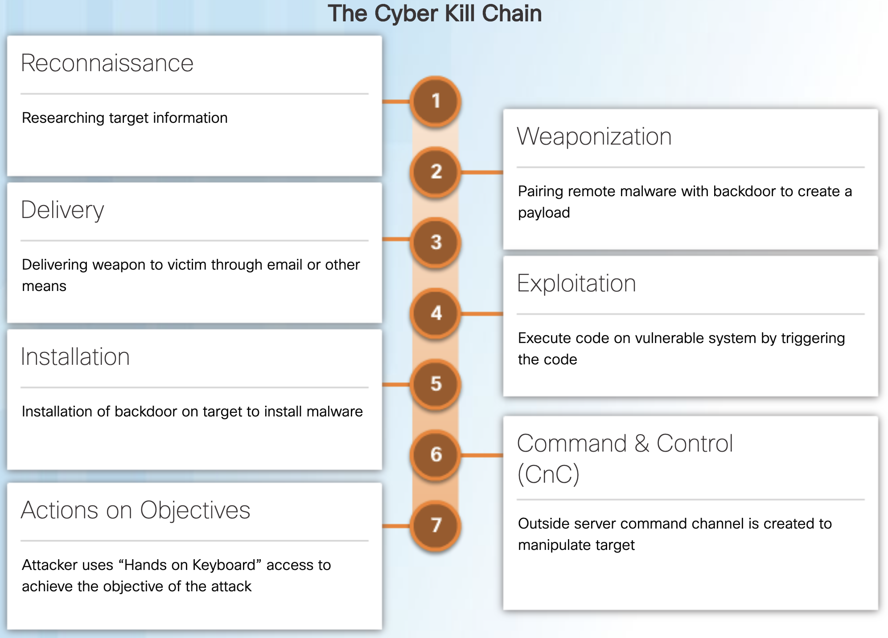

Figure shows the Cyber Kill Chain. The first step is reconnaissance researching target information. The second is weaponization pairing remote malware with backdoor to create a payload. The third step is delivery or delivering weapon to victim through email or other means. The fourth is exploitation or execute code on vulnerable system by triggering the code. The fifth step in installation or installation of backdoor on target to install malware. The 6th is command and control where outside server command channel is created to manipulate target. The last step is actions on objectives where attacker uses hands on keyboard access to achieve the objective of the attack.

#### 13.1.1.2 Reconnaissance

Reconnaissance is when the threat actor performs research, gathers intelligence, and selects targets. This will inform the threat actor if the attack is worth performing. Any public information may help to determine the what, where, and how the attack could be performed. There is a lot of publicly available information, especially for larger organizations including news articles, websites, conference proceedings, and public-facing network devices. Increasing amounts of information surrounding employees is available through social media outlets.

The threat actor will choose targets that have been neglected or unprotected because they will have a higher likelihood of becoming penetrated and compromised. All information obtained by the threat actor is reviewed to determine its importance and if it reveals possible additional avenues of attack.

The figure summarizes some of the tactics and defenses used during this step.

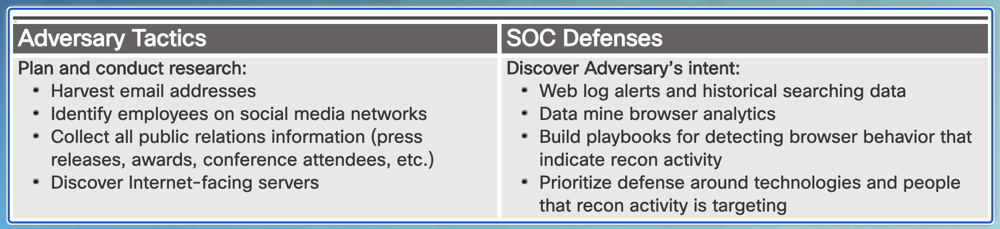

Figure title is examples of reconnaissance tactics and defenses. Figure shows a 2 column table. The two columns are adversary tactics and S O C defenses. Adversary tactics is to plan and conduct research including harvest email addresses, identify employees on social media networks, collect all public relations information such as press releases, awards, conference attendees, etc., and discover internet facing servers. The S O C defenses are to discover the adversary’s intent using web log alerts and historical searching data, data mine browser analytics, build playbooks for detecting browser behavior that indicate recon activity, and prioritize defense around technologies and people that recon activity is targeting.

#### 13.1.1.3 Weaponization

The goal of this step is to use the information from the earlier reconnaissance to develop a weapon against specific targeted systems in the organization. To develop this weapon, the designer will use the vulnerabilities of the assets that were discovered and build them into a tool that can be deployed. After the tool has been used, it is expected that the threat actor has achieved their goal of gaining access into the target system or network, degrading the health of a target, or the entire network. The threat actor will further examine network and asset security to expose additional weaknesses, gain control over other assets, or deploy additional attacks.

It is not difficult to choose a weapon for the attack. The threat actor needs to look at what attacks are available for the vulnerabilities they have discovered. There are many attacks that have already been created and tested at large. One problem is that because these attacks are so well known, they are most likely also known by the defenders. It is often more effective to use a zero-day attack to avoid detection methods. The threat actor may wish to develop their own weapon that is specifically designed to avoid detection, using the information about the network and systems that they have learned.

The figure summarizes some of the tactics and defenses used during this step.

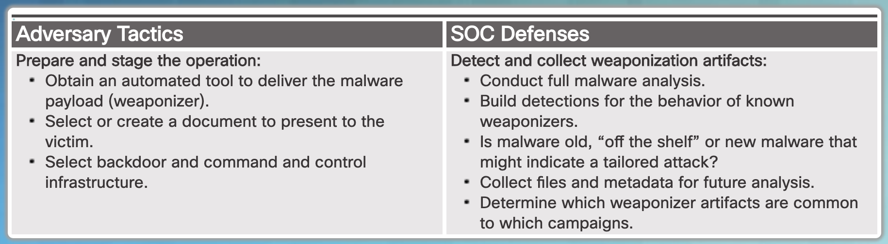

Figure title is examples of weaponization tactics and defenses. The figure is a 2 column table. The left table is adversary tactics which is to prepare and stage the operation by obtaining an automated tool to deliver the malware payload or weaponizer, selecting or creating a document to present to the victim, and selecting backdoor and command and control infrastructure. The S O C defenses are to detect and collect weaponization artifacts by conducting a full malware analysis, building detections for the behavior of known weaponizers, determining if the malware is old off the shelf or new malware that might indicate a tailored attack, collecting files and metadata for future analysis, and determining which weaponizer artifacts are common to which campaigns.

#### 13.1.1.4 Delivery

During this step, the weapon is transmitted to the target using a delivery vector. This may be through the use of a website, removable USB media, or an email attachment. If the weapon is not delivered, the attack will be unsuccessful. The threat actor will use many different methods to increase the odds of delivering the payload such as encrypting communications, making the code look legitimate, or obfuscating the code. Security sensors are so advanced that they will detect the code as malicious unless it is altered to avoid detection. The code may be altered to seem innocent, yet still perform the necessary actions, even though it may take longer to execute.

The figure summarizes some of the tactics and defenses used during this step.

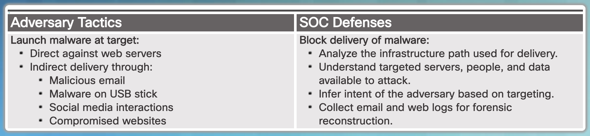

Figure title is examples of delivery tactics and defenses. Figure is a two column table. The left column is adversary tactics which is to launch malware at the target directly against web servers or indirectly by delivery through malicious email, malware on a USB stick, social media interactions, or compromised web sites. The right column of s o c defenses is to block delivery of malware by analyzing the infrastructure path used for delivery, understanding targeted servers, people, and data available to attack. Inferring intent of the adversary based on targeting, and collecting email and web logs for forensic reconstruction.

#### 13.1.1.5 Exploitation

After the weapon has been delivered, the threat actor uses it to break the vulnerability and gain control of the target. The most common exploit targets are applications, operating system vulnerabilities, and users. The attacker must use an exploit that gains the effect they desire. This is very important because if the wrong exploit is conducted, obviously the attack will not work, but unintended side effects such as a DoS or multiple system reboots will cause undue attention that could easily inform cybersecurity analysts of the attack and the threat actor’s intentions.

The figure summarizes some of the tactics and defenses used during this step.

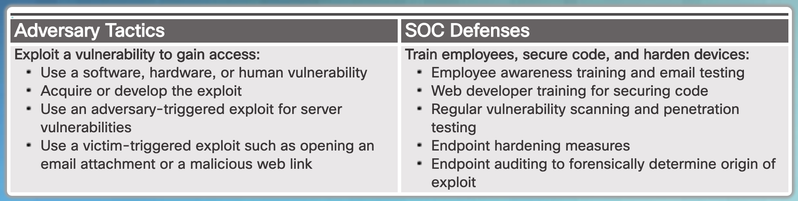

The figure shows examples of exploitation tactics and defenses. The figure is a two column table with the left column being adversary tactics which are to exploit a vulnerability to gain access: use a software, hardware, or human vulnerability; acquire of develop the exploit; use and adversary trigger exploit for server vulnerabilities; use a victim triggered exploit such as opening an email attachment or a malicious web link. The right column contains the S O C defenses which are to train employees, secure code, and harden devices using the following: employee awareness training and email testing, web developer training for securing code, regular vulnerability scanning and penetration testing, endpoint hardening measures, endpoint auditing to forensically determine origin of exploit.

#### 13.1.1.6 Installation

This step is where the threat actor establishes a back door into the system to allow for continued access to the target. To preserve this backdoor, it is important that remote access does not alert cybersecurity analysts or users. The access method must survive through antimalware scans and rebooting of the computer to be effective. This persistent access can also allow for automated communications, especially effective when multiple channels of communication are necessary when commanding a botnet.

The figure summarizes some of the tactics and defenses used during this step.

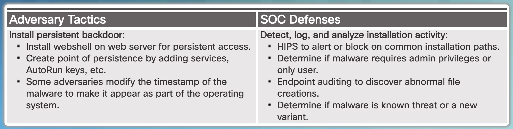

Figure title is examples of installation tactics and defenses. The figure is a 2 column table with the left column be adversary tactics used to install a persistent backdoor using the following techniques: install web shell on web server for persistent access, create point of persistence by adding services, autorun keys, etc., and some adversaries modify the timestamp of the malware to make it appear as part of the operating system. The right column is the s o c defenses to detect, log, and analyze installation activity using the following techniques: H I P S to alert or block on common installation paths, determine if malware requires admin privileges or only user, endpoint auditing to discover abnormal file creations, and determine if malware is known threat or a new variant.

#### 13.1.1.7 Command and Control

In this step, the goal is to establish command and control (CnC or C2) with the target system. Compromised hosts usually beacon out of the network to a controller on the Internet. This is because most malware requires manual interaction in order to exfiltrate data from the network. CnC channels are used by the threat actor to issue commands to the software that they installed on the target. The cybersecurity analyst must be able to detect CnC communications in order to discover the compromised host. This may be in the form of unauthorized Internet Relay Chat (IRC) traffic or excessive traffic to suspect domains.

The figure summarizes some of the tactics and defenses used during this step.

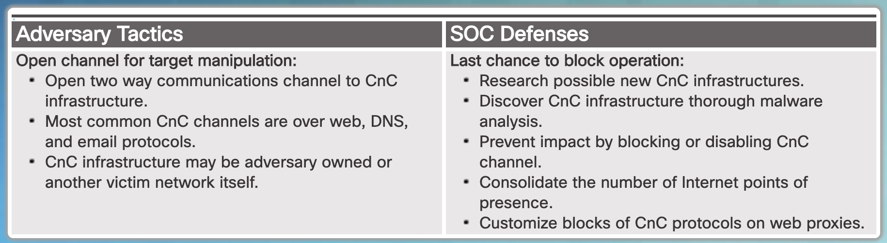

Figure title is examples of installation tactics and defenses. The figure is a 2 column table with the left column being the adversary tactics used to create an open channel for target manipulation using the following techniques: open two way communications channel to command and control infrastructure. Most common command and control channels are over web, D N S, and e mail protocols. Command and control infrastructure may be adversary owned or another victim network itself. The right column are the S O C defenses to have a last chance to block operation using the following techniques research possible new command and control infrastructures, discover command and control infrastructure through malware analysis, prevent impact by blocking or disabling command and control channel, consolidate the number of internet points of presence, and customize blocks of command and control protocols on web proxies.

#### 13.1.1.8 Actions on Objectives

The final step of the Cyber Kill Chain describes the threat actor achieving their original objective. This may be data theft, performing a DDoS attack, or using the compromised network to create and send spam. At this point the threat actor is deeply rooted in the systems of the organization, hiding their moves and covering their tracks. It is extremely difficult to remove the threat actor from the network.

The figure summarizes some of the tactics and defenses used during this step.

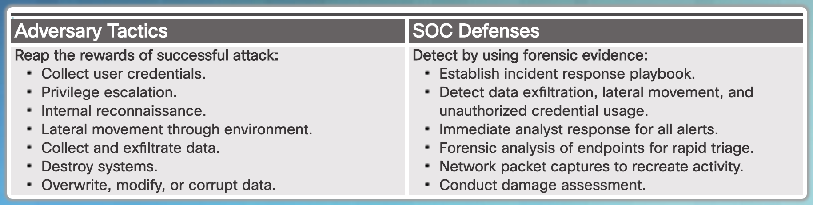

The figure title is examples of actions on objectives tactics and defenses. The figure is a 2 column table with the left column being adversary tactics in order to reap the rewards of a successful attacking using the following methods: collect user credentials, privilege escalation, internal reconnaissance, lateral movement through environment, collect and exfiltrate data, destroy systems, and overwrite, modify, or corrupt data. The S O C defenses are used to detect by using forensic evidence using the following methods: establish incident response playbook, detect data exfiltration, lateral movement, and unauthorized credential usage, immediate analyst response of all alerts, forensic analysis of endpoints for rapid triage, network packet captures to recreate activity, and conduct damage assessment.

### 13.1.2 The Diamond Model of Intrusion

#### 13.1.2.1 Diamond Model Overview

The Diamond Model of intrusion is made up of four parts and represents a security incident or event, as shown in the figure. In the Diamond Model, an event is a time-bound activity restricted to a specific step where an adversary uses a capability over some infrastructure against a victim to achieve a specific result.

The four core features of an intrusion event are adversary, capability, infrastructure, and victim:

-   **Adversary** – These are the parties responsible for the intrusion.

-   **Capability** – This is a tool or technique that the adversary uses to attack the victim.

-   **Infrastructure** – This is the network path or paths that the adversaries ue to establish and maintain command and control over their capabilities.

-   **Victim** – This is the target of the attack. However, a victim might be the target initially and then used as part of the infrastructure to launch other attacks.

The adversary uses capabilities over infrastructure to attack the victim. Each line in the model shows how each part reached the other. For example, a capability like malware might be used over email by an adversary to attack a victim.

Meta-features expand the model slightly to include the following important elements:

-   **Timestamp** – This indicates the start and stop time of an event and is an integral part of grouping malicious activity.

-   **Phase** – This is analogous to steps in the Cyber Kill Chain; malicious activity includes two or more steps executed in succession to achieve the desired result.

-   **Result** – This delineates what the adversary gained from the event. Results can be documented as one or more of the following: confidentiality compromised, integrity compromised, and availability compromised.

-   **Direction** – This indicates the direction of the event across the Diamond Model. These include Adversary-to-Infrastructure, Infrastructure-to-Victim, Victim-to-Infrastructure, and Infrastructure-to-Adversary.

-   **Methodology** – This is used to classify the general type of event, such as port scan, phishing, content delivery attack, syn flood, etc.

-   **Resources** – These are one or more external resources used by the adversary for the intrusion event, such as software, adversary’s knowledge, information (e.g., username/passwords), and assets to carry out the attack (hardware, funds, facilities, network access).

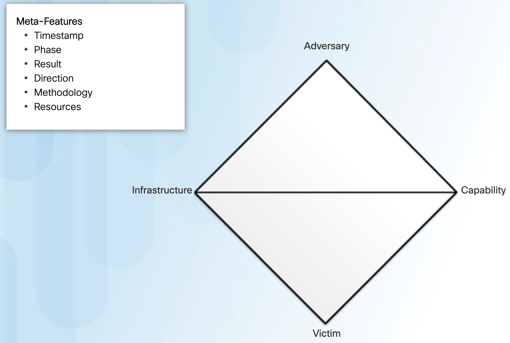

The figure is a box with one of the corners pointing toward the top. A line extends across the center. The title is the diamond model. The top corner of the box is labeled adversary, the corner to the right is labeled capability, the bottom corner is labeled victim and the left corner is labeled infrastructure. A textbox lists the meta features of timestamp, phase, result, direction, methodology, and resources.

#### 13.1.2.2 Pivoting Across the Diamond Model

As a cybersecurity analyst, you may be called on to use the Diamond Model to diagram a series of intrusion events. The Diamond Model is ideal for illustrating how the adversary pivots from one event to the next.

For example, in the figure an employee reports that his computer is acting abnormally. A host scan by the security technician indicates that the computer is infected with malware. An analysis of the malware reveals that the malware contains a list of CnC domain names. These domain names resolve to a list of IP addresses. These IP addresses are then used to identify the adversary, as well as investigate logs to determine if other victims in the organization are using the CnC channel.

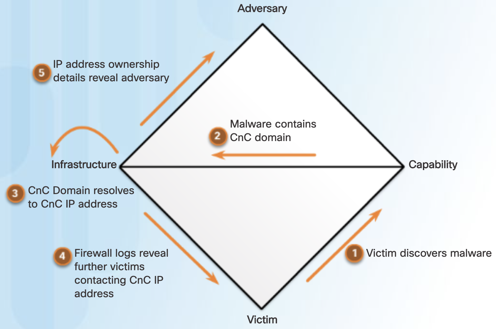

The same box and four corners labeled is shown in the figure. A number 1 has an arrow going from the victim to the capability and labeled victim discovers malware. A number 2 has an arrow pointing away from capability and toward infrastructure with the comment that malware contains command and control domain. A curved arrow is outside the box on the left and points to the word infrastructure. Item 3 states that the command and control domain resolves to command and control I P address. Number 4 is firewall logs reveal further victims contacting Command and Control IP address. This # 4 arrow goes from infrastructure and is pointing toward the corner word victim. Number 5 has an arrow pointing away from the word infrastructure and toward adversary and the text of I P address ownership details reveal adversary

#### 13.1.2.3 The Diamond Model and the Cyber Kill Chain

Adversaries do not operate in just a single event. Instead, events are threaded together in a chain in which each event must be successfully completed before the next event. This thread of events can be mapped to the Cyber Kill Chain previously discussed in the chapter.

The following example, shown in the figure, illustrates the end-to-end process of an adversary as they vertically traverse the Cyber Kill Chain, use a compromised host to horizontally pivot to another victim, and then begin another activity thread:

\1. Adversary conducts a web search for victim company Gadgets, Inc. receiving as part of the results their domain gadgets.com.

\2. Adversary uses the newly discovered domain gadets.com for a new search “network administrator gadget.com” and discovers forum postings from users claiming to be network administrators of gadget.com. The user profiles reveal their email addresses.

\3. Adversary sends phishing emails with a Trojan horse attached to the network administrators of gadget.com.

\4. One network administrator (NA1) of gadget.com opens the malicious attachment. This executes the enclosed exploit allowing for further code execution.

\5. NA1’s compromised host sends an HTTP Post message to an IP address, registering it with a CnC controller. NA1’s compromised host receives an HTTP Response in return.

\6. It is revealed from reverse engineering that the malware has additional IP addresses configured which act as a back-up if the first controller does not respond.

\7. Through a CnC HTTP response message sent to NA1’s host, the malware begins to act as a proxy for new TCP connections.

\8. Through the proxy established on NA1’s host, Adversary does a web search for “most important research ever” and finds Victim 2, Interesting Research Inc.

\9. Adversary checks NA1’s email contact list for any contacts from Interesting Research Inc. and discovers the contact for the Interesting Research Inc. Chief Research Officer.

\10. Chief Research Officer of Interesting Research Inc. receives a spear-phish email from Gadget Inc.’s NA1’s email address sent from NA1’s host with the same payload as observed in Event 3.

The adversary now has two compromised victims from which additional attacks can be launched. For example, the adversary could mine the Chief Research Officer’s email contacts for the additional potential victims. The adversary might also setup another proxy to exfiltrate all of the Chief Research Officer’s files.

**Note**: This example is a modification of the U.S. Department of Defense’s example in the publication “The Diamond Model of Intrusion Analysis”. Click [here](http://www.dtic.mil/docs/citations/ADA586960) to download the publication.

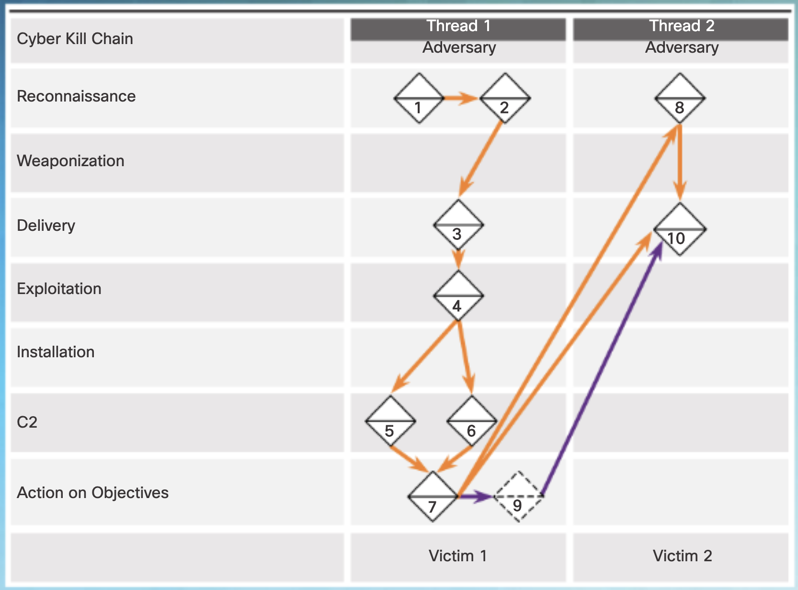

The figure is activity thread examples and is a 3 column table. The left most column has the following in each row, cyber kill chain, reconnaissance, weaponization, delivery, exploitation, installation, C2, and action on objectives. The second column is Thread 1 with adversary below it. Within some of the rows are one or more numbered boxes with arrows connecting them. In thread 1 there are two boxes labeled 1 and 2 and and arrow going from the number 1 box to the number to box in the reconnaissance row. An arrow goes from the number 2 box pointing toward the number 3 box located in the delivery row. There is an arrow going from the number 3 box pointing toward the number 4 box located in the exploitation row. There are two arrows coming out of the number 4 box. One arrow points to the number 5 box and one arrow to the number six box. Both number 5 and 6 boxes are in the C2 row. Both boxes labeled number 5 and number 6 have a single arrow coming out of each one of them pointing toward the number 7 box located on the action on objectives row. At the bottom of the middle column is the words victim 1. The third column to the far right is labeled Thread 2 with the word adversary under it. An arrow points from the number 7 box toward the box in the last column in the reconnaissance row labeled number 8. An arrow also points from the number 7 box in a different color to a box labeled number 9 in the action on objectives row, but the box has dashed lines around it. An arrow from box 9 and from box number 8 point toward a box in the delivery row labeled number 10. At the bottom of the third column on the far right are the words victim 2.

### 13.1.3 The VERIS Schema

####13.1.3.1 What is the VERIS Schema?

The Vocabulary for Event Recording and Incident Sharing (VERIS) is a set of metrics designed to create a way to describe security incidents in a structured and repeatable way. VERIS was created to share quality information about security events to the community, anonymously. The VERIS Community Database (VCDB) is an open and free collection of publicly-reported security incidents in VERIS format. You can use unformatted, raw data or the dashboard to find VERIS entries. The VCDB is a central location for the security community to learn from experience and help with decision making, before, during, and after a security incident.

To learn more about the VCDB, click [here](http://veriscommunity.net/index.html).

In the VERIS schema, risk is defined as the intersection of four landscapes of Threat, Asset, Impact, and Control, as shown in the figure. Information from each landscape helps to understand the level of risk to the organization. VERIS helps to determine these landscapes using real security incidents to help risk management assessment.

<iframe id="media" title="interactive graphic" aria-label="interactive graphic" aria-describedby="media-description" src="https://static-course-assets.s3.amazonaws.com/CyberOps11/en/course/module13/13.1.3.1/media/index.html" style="border: none; display: block; width: 680px; height: 490px;"></iframe>

The graphic shows four circles that overlap one another in the middle. The top circle is labeled asset landscape, the right circle is labeled impact landscape, the bottom circle is labeled control landscape, and the left circle is labeled threat landscape. The arrow where all 4 circles intersect is labeled risk.

#### 13.1.3.2 Create a VERIS Record

When creating records to add to the database, start with the basic facts about the incident. It is helpful to use the VERIS elements outlined by the community. Figure 1 shows the most basic record that can exist. The framework does not need to be complicated. The only required fields in the record are those where the attribute is present. As more is known about the incident, data can be added.

When an incident is recorded, it is most likely that you will have more specific information than just the year when the incident occurred. For example, the month and day can be documented by adding VERIS labels to the existing record, as shown in Figure 2. The way the incident was discovered, a summary of what happened, and any other notes about the type of incident should also be recorded using VERIS labels. Any variable, data, or text can be recorded as part of the VERIS record using VERIS labels. For example, in Figure 2 variables were added to document that Debbie in Sales reported that her computer was infected with malware. It was determined, through an interview with Debbie and a scan of her computer, that a rootkit was installed via an infected USB drive.

After the initial records are created, additional details should be added to aid in data analysis. The only two required in the VERIS schema are whether the incident was a real security incident, and how the incident was discovered. Most ticketing systems will allow new fields to be added to forms. To add more details to the record, just add a new field and designate a VERIS enumeration for it. A Word document, Excel spreadsheet, or other software can be used to create these records as well. You could also create a dedicated reporting tool for incident recording.

Click [here](https://incident.veriscommunity.net/s3/example) for an example of a VERIS incident recording tool.

After the major details have been recorded, even more detail can be added as you continue to document the incident. Every bit of information that can be entered into the record may be helpful to your organization and others who respond to the incident and prevent and detect future incidents of this type. The more data available to the community, the better chance there is of preventing future incidents.

VERIS can record the details of the organization that was affected such as industry, number of employees, or the country of the organization. This information can be useful in the overall picture when multiple organizations have a record of a similar incident. This demographic information can be shared without revealing specific, private information about the affected organization.

<iframe id="media" title="interactive graphic" aria-label="interactive graphic" aria-describedby="media-description" src="https://static-course-assets.s3.amazonaws.com/CyberOps11/en/course/module13/13.1.3.2/media/index.html" style="border: none; display: block; width: 680px; height: 490px;"></iframe>

Figure 1 shows a basic VERIS record in a table with 2 columns. The left column is labeled variable and the right column is labeled value. The first variable is timeline dot incident dot year with a value of 2017. The schema underscore version is 1.3. The incident I D is 1. The security incident variable has a value of confirmed. The remaining variables of discovery method, action, asset, actor, and attribute all have a value of unknown. Figure 2 shows adding information to the VERIS record with three tables, each having 2 columns the left column being the variable and the right column being the value. The timeline dot incident dot year variable has a value of 2017. The timeline incident month is 06. The timeline incident day is 20. In the next table the summary variable has a value of computer was infected with malware. In the last table the discovery dot notes variable has a value of reported by Debbie in sales. The malware notes has a value that a rootkit was found on Debbie’s computer. The social notes variable is that Debbie brought in an infected U S B drive and used it on her company laptop..

#### 13.1.3.3 Top-Level and Second-Level Elements

There are five top-level elements of the VERIS schema, each of which provides a different aspect of the incident. Each top-level element contains several second-level elements, as shown in Figure 1. These elements are useful for classifying data that has been collected about an incident.

**Impact Assessment**

For any incident, there is impact, whether it is minor or widespread. It is often very difficult to determine the scope of the impact until well after an incident has occurred, or even after it has been remediated. The second-level elements used for impact assessment are as follows:

-   **Loss Categorization** – Identifies the types of losses that occurred due to the incident.

-   **Loss Estimation** – This is an estimate of the total losses that were incurred because of the incident.

-   **Estimation Currency** – Uses the same currency when multiple types are involved.

-   **Impact Rating** – This is a rating that indicates the overall impact of the incident. It could be a number between 1 and 100, or another scale such as a grading scale.

-   **Notes** – Additional details that may be of use are recorded here.

**Discovery and Response**

This section is for recording the timeline of events, the method of incident discovery, and what the response was to the incident, including how it was remediated. The second-level elements used for discovery and response are as follows:

-   **Incident Timeline** – The timeline of all events from the discovery of the incident to the time the incident has been contained or restored to a fully functional state. This section is very important for gathering metrics such as readiness, the actions of the threat actors, and the response of the affected organization, along with many others.

-   **Discovery Method** – Identifies the way in which the incident was discovered. This may be accidental, or by design.

-   **Root Causes** – Identifies any weakness or failure in security allowing the incident to take place.

-   **Corrective Actions** – This variable is for recording what will be done to detect or prevent this type of incident in the future.

-   **Targeted vs. Opportunistic** – Identifies if the incident was a deliberate, targeted attack, or if it was a random incident, based on a found opportunity by an attacker.

**Incident Description**

To describe an incident completely, VERIS uses the A4 threat model that was developed by the RISK team at Verizon. The second-level elements used for incident description, also known as the 4 As, are as follows:

-   **Actors** - Whose actions affected the asset?

-   **Actions** - What actions affected the asset?

-   **Assets** - Which assets were affected?

-   **Attributes** - How the asset was affected?

Each of these elements should be further refined through the use of their associated sub-elements by answering the questions in Figure 2 and Figure 3.

**Victim Demographics**

This section is for describing the organization that has experienced the incident. The characteristics of the organization can be compared to other organizations to determine if there are aspects of an incident that are common. The second-level elements used for victim demographics are as follows:

-   **Victim ID** – Identifies incidents with the organization that experienced them.

-   **Primary Industry** – Identifies the industry in which the affected organization conducts business. The six-digit North American Industry Classification System (NAICS) code is entered here. Click [here](http://www.census.gov/cgi-bin/sssd/naics/naicsrch?chart=2012) for the NAICS codes.

-   **Country of Operation** – Used to record the country where the primary location of the organization operates.

-   **State** – Only used when the organization operates in the United States.

-   **Number of Employees** – This is for recording the size of the entire organization, not a department or branch.

-   **Annual Revenue** – This variable can be rounded for privacy.

-   **Locations Affected** – Identifies any additional regions or branches that were affected by the incident.

-   **Notes** – Additional details that may be of use are recorded here.

**Incident Tracking**

This is for recording general information about the incident so organizations can identify, store, and retrieve incidents over time. The second-level elements used for incident tracking are as follows:

-   **Incident ID** – This is a unique identifier for storage and tracking.

-   **Source ID** – Identifies the incident in the context of who reported it.

-   **Incident Confirmation** – Differentiates the incident from those that are known or suspected as being non-incidents.

-   **Incident Summary** – Provides a short description of the incident.

-   **Related Incidents** – Allows the incident to be associated with similar incidents.

-   **Confidence Rating** – Provides a rating as to how accurate the reported incident information is.

-   **Incident Notes** – Allows recording of any information not captured in other VERIS fields.

<iframe id="media" title="interactive graphic" aria-label="interactive graphic" aria-describedby="media-description" src="https://static-course-assets.s3.amazonaws.com/CyberOps11/en/course/module13/13.1.3.3/media/index.html" style="border: none; display: block; width: 680px; height: 490px;"></iframe>

Figure 1 shows the VERIS Scheme elements with a textbox labeled VERIS at the top. A line connects from this box to the top-level elements boxes which are as follows: impact assessment, discovery and response, incident description, victim demographics, and incident tracking. The impact assessment box connects to a second level element box with the following bullets: loss categorization, loss estimation, estimation currency, impact rating, and notes. The discovery and response top level element connects to a second level elements textbox with the following bullets: incident timeline, discovery method, root causes, corrective actions, targeted versus opportunistic. The incident description top level element connects to a second level element textbox with the following bullets: actors, actions, assets, and attributes. The victim demographics top level element text box connects to a second level element textbox of the following: victim I D, primary industry, country of operation, state, number of employees, annual revenue, locations affected, and notes. The incident tracking top level element box has a second level elements textbox with the following bullets: incident I D, source I D, incident confirmation, incident summary, related incidents, confidence rating, and incident notes. Figure 2 shows two incident description sub elements tables. The top table is for actors and the table has two columns. The left column is the variable and the right is question. The first variable is actor dot external and the question is was there an external threat actor? The actor dot internal question is was there an internal threat actor. The actor dot partner variable asks the question was there a partner threat actor? The actor dot unknown variable has the question was there a threat actor but you don’t know what kind? The second table is actions. The hacking variable asks the question was there evidence of hacking. The malware variable is was there evidence of malware? The social variable question asks was there evidence of social engineering? The misuse action asks if there was evidence of misuse of privileges. The error variable asks the question if there was an error that lead to the incident. The physical action variable asks if there was evidence of a physical attack. The environmental action variable question is was there an act of god that lead to the incident. The unknown variable question is are we unsure what happened? Figure 3 are more sub elements with an attributes table regarding confidentiality question of is it possible that confidential information was exposed. The integrity attribute asks the question was the integrity of any system affected? The availability attribute asks was there an availability loss and the unknown attribute asks are we unsure what was affected? The second table are asset variables. The server asset dot assets dot server variable asks the question was a server affected by the incident. The network assets variable asks if a network device was affected. The user asset variable asks if any end user devices were affected. The terminal asset variable asks if any terminal devices such as A T M or kiosk affected. The media assets variable asks did the incident affect any paper documents or storage media. The people assets question is were any people compromised such as social engineering. The unknown assets variable question is are we unsure what was affected.

#### 13.1.3.4 The VERIS Community Database

There are some organizations that collect data for security incidents, but either the data is not available to the public for free, or it is not in a format that allows for manipulation or transformation that may be required to make it useful. This makes it difficult for researchers who study security incident trends and organizations to make reliable risk management calculations.

This is where the VERIS Community Database (VCDB) is useful. Through the proper use of the VERIS schema and a willingness to participate, organizations can submit security incident details to the VCDB for the community to use. The larger and more robust the VCDB becomes, the more useful it will be in prevention, detection, and remediation of security incidents. It will also become a very useful tool for risk management, saving organizations data, time, effort, and money.

Click [here](https://github.com/vz-risk/VCDB) for the VCDB.

Like any database, it can be used to determine answers to questions. It can also be used to find out how one organization compares to another when it is of the same approximate size and operating in the same kind of industry.

<iframe id="media" title="interactive graphic" aria-label="interactive graphic" aria-describedby="media-description" src="https://static-course-assets.s3.amazonaws.com/CyberOps11/en/course/module13/13.1.3.4/media/index.html" style="border: none; display: block; width: 680px; height: 490px;"></iframe>

The figure shows the VERIS community database code tab from the web site.

## 13.2 Incident Handling

### 13.2.1 CSIRTs

#### 13.2.1.1 CSIRT Overview

A computer security incident can be defined differently across organizations. Generally, a computer security incident is any malicious or suspicious act which violates a security policy or any event that threatens the security, confidentiality, integrity, or availability of an organization’s assets, information systems, or data network. Although this definition may be considered vague, these are some common computer security incidents:

-   Malicious code

-   Denial of service

-   Unauthorized entry

-   Device theft

-   Malicious scans or probes

-   Security breach

-   Violation of any security policy item

When a security incident takes place, an organization needs a way to respond. A Computer Security Incident Response Team (CSIRT) is an internal group commonly found within an organization that provides services and functions to secure the assets of that organization. A CSIRT does not necessarily only respond to incidents that have already happened. A CSIRT may also provide proactive services and functions such as penetration testing, intrusion detection, or even security awareness training. These types of services can help to prevent incidents, but also increase response time, and mitigate damage. In the case where a security incident needs to be contained and mitigated, the CSIRT coordinates and oversees these efforts.

<iframe id="media" title="interactive graphic" aria-label="interactive graphic" aria-describedby="media-description" src="https://static-course-assets.s3.amazonaws.com/CyberOps11/en/course/module13/13.2.1.1/media/index.html" style="border: none; display: block; width: 680px; height: 490px;"></iframe>

The figure shows a call center where people are working. One screen says cyber security.

#### 13.2.1.2 Types of CSIRTs

In larger organizations, the CSIRT will focus on investigating computer security incidents. Information security teams (InfoSec) will focus on implementing security policies and monitoring for security incidents. Many times in smaller organizations, the CSIRT will handle the tasks of the InfoSec team. Every organization is different. The goals of the CSIRT must be in alignment with the goals of the organization. There are many different types of CSIRTs and related organizations:

-   **Internal CSIRT** – Provides incident handling for the organization in which they reside. Any organization such as a hospital, bank, university, or a construction company, can have an internal CSIRT.

-   **National CSIRT** – Provides incident handling for a country.

-   **Coordination Centers** – Coordinates incident handling across multiple CSIRTs. One example is US-CERT. US-CERT responds to major incidents, analyzes threats and exchanges information with other cybersecurity experts and partners around the world.

-   **Analysis Centers** – Use data from many sources to determine incident activity trends. Trends help to predict future incidents and provide early warning to prevent and mitigate damages as quickly as possible. The VERIS community is an example of an analysis center.

-   **Vendor Teams** – Provide remediation for vulnerabilities in an organization’s software or hardware. These teams often handle customer reports concerning security vulnerabilities. This team may also act as the internal CSIRT for an organization. For example, click [here](https://developer.cisco.com/site/PSIRT/) to learn more about Cisco’s Product Security Incident Response Team (PSIRT).

-   **Managed Security Service Providers (MSSP)** – Provide incident handling to other organizations as a fee-based service. Cisco, Symantec, Verizon, and IBM are all examples of managed security service providers.

<iframe id="media" title="interactive graphic" aria-label="interactive graphic" aria-describedby="media-description" src="https://static-course-assets.s3.amazonaws.com/CyberOps11/en/course/module13/13.2.1.2/media/index.html" style="border: none; display: block; width: 680px; height: 490px;"></iframe>

Figure shows six boxes that are internal C S I R t, national C S I R T, coordination centers, analysis centers, vendor teams, and managed security service providers.

#### 13.2.1.3 CERT

Computer Emergency Response Teams (CERTs) are similar to CSIRTs, but are not the same. CERT is a trademarked acronym owned by Carnegie Mellon University. A CSIRT is an organization responsible for receiving, reviewing, and responding to security incidents. A CERT provides security awareness, best practices, and security vulnerability information to their populations. CERTs do not directly respond to security incidents.

Many countries have asked for permission to use the CERT acronym. These are some of the more prominent CERTs:

-   US-CERT: [https://www.us-cert.gov](https://www.us-cert.gov/)

-   Japan CERT Coordination Center: http://www.jpcert.or.jp/english/index.html

-   Indian Computer Emergency Response Team: http://meity.gov.in/content/icert

-   Singapore Computer Emergency Response Team: https://www.csa.gov.sg/singcert

-   CERT Australia: https://www.cert.gov.au/

<iframe id="media" title="interactive graphic" aria-label="interactive graphic" aria-describedby="media-description" src="https://static-course-assets.s3.amazonaws.com/CyberOps11/en/course/module13/13.2.1.3/media/index.html" style="border: none; display: block; width: 680px; height: 490px;"></iframe>

Figure shows the U S – CERT web site..The home page states U S – CERT strives for a safer, stronger Internet for all Americans by responding to major incidents, analyzing threats, and exchanging critical cybersecurity information with trusted partners around the world. In the current activity section, the title is multiple Petya ransomware infections reported. U S – CERT has received multiple reports of Petya ransomware infections recurring in networks in many countries around the world. Ransomware is a type of malicious software that infects a computer and restricts users access to the infected machine until a ransom is paid to unlock it. Individuals and organizations are discouraged from paying the ransom as this does not guarantee that access will be restored.

### 13.2.2 NIST 800-61r2

#### 13.2.2.1 Establishing an Incident Response Capability

The NIST recommendations for incident response are detailed in their Special Publication 800-61, revision 2 entitled “Computer Security Incident Handling Guide” (Figure 1).

Click [here](http://nvlpubs.nist.gov/nistpubs/SpecialPublications/NIST.SP.800-61r2.pdf) to download the publication.

**Note**: Although this chapter summarizes much of the content in the NIST 800-61r2 standard, you should also read the entire publication as it covers six major exam topics for the Cybersecurity CCNA SECOPS exam.

The NIST 800-61r2 standard provides guidelines for incident handling, particularly for analyzing incident-related data and determining the appropriate response to each incident. The guidelines can be followed independently of particular hardware platforms, operating systems, protocols, or applications.

The first step for an organization is to establish a computer security incident response capability (CSIRC). NIST recommends creating policies, plans, and procedures for establishing and maintaining a CSIRC.

**Policy**

An incident response policy details how incidents should be handled based on the organization’s mission, size, and function. The policy should be reviewed regularly to adjust it to meet the goals of the roadmap that has been laid out. Policy elements are listed in Figure 2.

**Plan Elements**

A good incident response plan helps to minimize damage caused by an incident. It also helps to make the overall incident response program better by adjusting it according to lessons learned. It will ensure that each party involved in the incident response has a clear understanding of not only what they will be doing, but what others will be doing as well. Plan elements are listed in Figure 3.

**Procedure Elements**

The procedures that are followed during an incident response should follow the incident response plan. Procedures such as following technical processes, using techniques, filling out forms and following checklists are standard operating procedures (SOPs). These SOPs should be detailed so that the mission and goals of the organization are in mind when these procedures are followed. SOPs minimize errors that may be caused by personnel that are under stress while participating in incident handling. It is important to share and practice these procedures, making sure that they are useful, accurate, and appropriate.

#### 13.2.2.2 Incident Response Stakeholders

Other groups and individuals within the organization may also be involved with incident handling. It is important to ensure that they will cooperate before an incident is underway. Their expertise and abilities can help the CSIRT to handle the incident quickly and correctly. These are some of the stakeholders that may be involved in handing a security incident:

**Management** – Managers create the policies that everyone must follow. They also design the budget and are in charge of staffing all of the departments. Management must coordinate the incident response with other stakeholders and minimize the damage of an incident.

**Information Assurance** – This group may need to be called in to change things such as firewall rules during some stages of incident management such as containment or recovery.

**IT Support** – This is the group that works with the technology in the organization and understands it the most. Because IT support has a deeper understanding, it is more likely that they will perform the correct action to minimize the effectiveness of the attack or preserve evidence properly.

**Legal Department** – It is a best practice to have the legal department review the incident policies, plans, and procedures to make sure that they do not violate any local or federal guidelines. Also, if any incident has legal implications, a legal expert will need to become involved. This might include prosecution, evidence collection, or lawsuits.

**Public Affairs and Media Relations** – There are times when the media and the public might need to be informed of an incident, such as when their personal information has been compromised during an incident.

**Human Resources** – The human resources department might need to perform disciplinary measures if an incident caused by an employee occurs.

**Business Continuity Planning** – Security incidents may alter an organization’s business continuity. It is important that those in charge of business continuity planning are aware of security incidents and the impact they have had on the organization as a whole. This will allow them to make any changes in plans and risk assessments.

**Physical Security and Facilities Management** – When a security incident happens because of a physical attack, such as tailgating or shoulder surfing, these teams might need to be informed and involved. It is also their responsibility to secure facilities that contain evidence from an investigation.

#### 13.2.2.3 NIST Incident Response Life Cycle

NIST defines four steps in the incident response process life cycle, as shown in the figure.

-   **Preparation** – The members of the CSIRT are trained in how to respond to an incident.

-   **Detection and Analysis** - Through continuous monitoring, the CSIRT quickly identifies, analyzes, and validates an incident.

-   **Containment, Eradication, and Recovery** - The CSIRT implements procedures to contain the threat, eradicate the impact on organizational assets, and use backups to restore data and software. This phase may cycle back to detection and analysis to gather more information, or to expand the scope of the investigation.

-   **Post-Incident Activities** - The CSIRT then documents how the incident was handled, recommends changes for future response, and specifies how to avoid a reoccurrence.

The incident response life cycle is meant to be a self-reinforcing learning process whereby each incident informs the process for handling future incidents. Each of these phases are discussed in more detail in this topic.

<iframe id="media" title="interactive graphic" aria-label="interactive graphic" aria-describedby="media-description" src="https://static-course-assets.s3.amazonaws.com/CyberOps11/en/course/module13/13.2.2.3/media/index.html" style="border: none; display: block; width: 680px; height: 490px;"></iframe>

Figure shows the incident response life cycle with 4 text boxes. From left to right they are preparation, detection and analysis, containment, eradication, and recovery, and post incident activity. An arrow points from each box toward the next box to the right. Also, the containment, eradication, and recovery box has an arrow that also points back to the previous box of detection and analysis. The last box has an arrow that points back to the preparation box.

#### 13.2.2.4 Preparation

The preparation phase is when the CSIRT is created and trained. This phase is also when the tools and assets that will be needed by the team to investigate incidents are acquired and deployed. The following list has examples of actions that also take place during the preparation phase:

-   Organizational processes are created to address communication between people on the response team. This includes such things as contact information for stakeholders, other CSIRTs, and law enforcement, an issue tracking system, smartphones, encryption software, etc.

-   Facilities to host the response team and the SOC are created.

-   Necessary hardware and software for incident analysis and mitigation is acquired. This may include forensic software, spare computers, servers and network devices, backup devices, packet sniffers, and protocol analyzers.

-   Risk assessments are used to implement controls that will limit the number of incidents.

-   Validation of security hardware and software deployment is performed on end-user devices, servers, and network devices.

-   User security awareness training materials are developed.

Additional incident analysis resources might be required. Examples of these resources are a list of critical assets, network diagrams, port lists, hashes of critical files, and baseline readings of system and network activity. Mitigation software is also an important item when preparing to handle a security incident. An image of a clean OS and application installation files may be needed to recover a computer from an incident.

Often, the CSIRT may have a jump kit prepared. This is a portable box with many of the items listed above to help in establishing a swift response. Some of these items may be a laptop with appropriate software installed, backup media, and any other hardware, software, or information to help in the investigation. It is important to inspect the jump kit on a regular basis to install updates and make sure that all the necessary elements are available and ready for use. It is helpful to practice deploying the jump kit with the CSIRT to ensure that the team members know how to use its contents properly.

<iframe id="media" title="interactive graphic" aria-label="interactive graphic" aria-describedby="media-description" src="https://static-course-assets.s3.amazonaws.com/CyberOps11/en/course/module13/13.2.2.4/media/index.html" style="border: none; display: block; width: 680px; height: 490px;"></iframe>

The same boxes as the previous section are shown with the preparation box highlighted.

#### 13.2.2.5 Detection and Analysis

Because there are so many different ways in which a security incident can occur, it is impossible to create instructions that completely cover each step to follow to handle them. Different types of incidents will require different responses.

**Attack Vectors**

An organization should be prepared to handle any incident, but should focus on the most common types of incidents so that they can be dealt with swiftly. These are some of the more common types of attack vectors:

-   **Web** – Any attack that is initiated from a website or application hosted by a website.

-   **Email** – Any attack that is initiated from an email or email attachment.

-   **Loss or Theft** – Any equipment that is used by the organization such as a laptop, desktop, or smartphone can provide the required information for someone to initiate an attack.

-   **Impersonation** – When something or someone is replaced for the purpose of malicious intent.

-   **Attrition** – Any attack that uses brute force to attack devices, networks, or services.

-   **Media** – Any attack that is initiated from external storage or removable media.

**Detection**

Some incidents are easy to detect while others may go undetected for months. The detection of security incidents might be the most difficult phase in the incident response process. Incidents are detected in many different ways and not all of these ways are very detailed or provide detailed clarity. There are automated ways of detection such as antivirus software or an IDS. There are also manual detections through user reports.

It is important to accurately determine the type of incident and the extent of the effects. There are two categories for the signs of an incident:

-   **Precursor** – This is a sign that an incident might occur in the future. When precursors are detected, an attack might be avoided by altering security measures to specifically address the type of attack detected. Examples of precursors are log entries that show a response to a port scan, or a newly-discovered vulnerability to an organization’s web server.

-   **Indicator** – This is a sign that an incident might already have occurred or is currently occurring. Some examples of indicators are a host that has been infected with malware, multiple failed logins from an unknown source, or an IDS alert.

**Analysis**

Incident analysis is difficult because not all of the indicators are accurate. In a perfect world, each indicator should be analyzed to find out if it is accurate. This is nearly impossible due to the number and variety of logged and reported incidents. The use of complex algorithms and machine learning often help to determine the validity of security incidents. This is more prevalent in large organizations that have thousands or even millions of incidents daily. One method that can be used is network and system profiling. Profiling is measuring the characteristics of expected activity in networking devices and systems so that changes to it can be more easily identified.

When an indicator is found to be accurate, it does not necessarily mean that a security incident has occurred. Some indicators happen for other reasons besides security. A server that continually crashes, for example, may have bad RAM instead of a buffer overflow attack occurring. To be safe, even ambiguous or contradictory symptoms must be analyzed to determine if a legitimate security incident has taken place. The CSIRT must react quickly to validate and analyze incidents. This is performed by following a predefined process and documenting each step.

**Scoping**

When the CSIRT believes that an incident has occurred, it should immediately perform an initial analysis to determine the incident’s scope, such as which networks, systems, or applications are affected, who or what originated the incident, and how the incident is occurring. This scoping activity should provide enough information for the team to prioritize subsequent activities, such as containment of the incident and deeper analysis of the effects of the incident.

**Incident Notification**

When an incident is analyzed and prioritized, the incident response team needs to notify the appropriate individuals so that all who need to be involved will play their roles. Examples of parties that are typically notified include:

-   Chief Information Officer (CIO)

-   Head of information security

-   Local information security officer

-   Other incident response teams within the organization

-   External incident response teams (if appropriate)

-   System owner

-   Human resources (for cases involving employees, such as harassment through email)

-   Public affairs (for incidents that may generate publicity)

-   Legal department (for incidents with potential legal ramifications)

-   US-CERT (required for Federal agencies and systems operated on behalf of the Federal government)

-   Law enforcement (if appropriate)

<iframe id="media" title="interactive graphic" aria-label="interactive graphic" aria-describedby="media-description" src="https://static-course-assets.s3.amazonaws.com/CyberOps11/en/course/module13/13.2.2.5/media/index.html" style="border: none; display: block; width: 680px; height: 490px;"></iframe>

The same boxes as the previous section are shown with the detection and analysis box highlighted.

#### 13.2.2.6 Containment, Eradication, and Recovery

After a security incident has been detected and sufficient analysis has been performed to determine that the incident is valid, it must be contained in order to determine what to do about it. Strategies and procedures for incident containment need to be in place before an incident occurs and implemented before there is widespread damage.

**Containment Strategy**

For every type of incident, a containment strategy should be created and enforced. These are some conditions to determine the type of strategy to create for each incident type.

-   How long it will take to implement and complete a solution?

-   How much time and how many resources will be needed to implement the strategy?

-   What is the process to preserve evidence?

-   Can an attacker be redirected to a sandbox so that the CSIRT can safely document the attacker’s methodology?

-   What will be the impact to the availability of services?

-   What is the extent of damage to resources or assets?

-   How effective is the strategy?

During containment, additional damage may be incurred. For example, it is not always advisable to unplug the compromised host from the network. The malicious process could notice this disconnection to the CnC controller and trigger a data wipe or encryption on the target. This is where experience and expertise can help to contain an incident beyond the scope of the containment strategy.

**Evidence**

During an incident, evidence must be gathered to resolve it. Evidence is also important for subsequent investigation by authorities. Clear and concise documentation surrounding the preservation of evidence is critical. For evidence to be admissible in court, evidence collection must conform to specific regulations. After evidence collection, it must be accounted for properly. This is known as the chain of custody. These are some of the most important items to log when documenting evidence used in the chain of custody:

-   Location of the recovery and storage of all evidence

-   Any identifying criteria for all evidence such as serial number, MAC address, hostname, or IP address

-   Identification information for all of the people that participated in collecting or handling the evidence

-   Time and date that the evidence was collected and each instance it was handled

It is vital to educate anyone involved in evidence handling on how to preserve evidence properly.

**Attacker Identification**

Identifying attackers is secondary to containing, eradicating, and recovering hosts and services. However, identifying attackers will minimize the impact to critical business assets and services. These are some of the most important actions to perform to attempt to identify an attacking host during a security incident:

-   Use incident databases to research related activity. This database may be in-house or located at organizations that collect data from other organizations and consolidate it into incident databases such as the VERIS community database.

-   Validate the attacker’s IP address to determine if it is a viable one. The host may or may not respond to a request for connectivity. This may be because it has been configured to ignore the requests, or the address has already been reassigned to another host.

-   Use an Internet search engine to gain additional information about the attack. There may have been another organization or individual that has released information about an attack from the identified source IP address.

-   Monitor the communication channels that some attackers use, such as IRC. Because users can be disguised or anonymized in IRC channels, they may talk about their exploits in these channels. Often, the information gathered from this type of monitoring is misleading, and should be treated as leads and not facts.

**Eradication, Recovery, and Remediation**

After containment, the first step to eradication is identifying all of the hosts that need remediation. All of the effects of the security incident must be eliminated. This includes malware infections and user accounts that have been compromised. All of the vulnerabilities that were exploited by the attacker must also be corrected or patched so that the incident does not occur again.

To recover hosts, use clean and recent backups, or rebuild them with installation media if no backups are available or they have been compromised. Also, fully update and patch the operating systems and installed software of all hosts. Change all host passwords and passwords for critical systems in accordance with the password security policy. This may be a good time to validate and upgrade network security, backup strategies, and security policies. Attackers often attack the systems again, or use a similar attack to target additional resources, so be sure to prevent this as best as possible. Focus on what can be fixed quickly while prioritizing critical systems and operations.

<iframe id="media" title="interactive graphic" aria-label="interactive graphic" aria-describedby="media-description" src="https://static-course-assets.s3.amazonaws.com/CyberOps11/en/course/module13/13.2.2.6/media/index.html" style="border: none; display: block; width: 680px; height: 490px;"></iframe>

The same boxes as the previous section are shown with the containment, eradication, and recovery box highlighted.

#### 13.2.2.7 Post-Incident Activities

After incident response activities have eradicated the threats and the organization has begun to recover from the effects of the attack, it is important to take a step back and periodically meet with all of the parties involved to discuss the events that took place and the actions of all of the individuals while handling the incident. This will provide a platform to learn what was done right, what was done wrong, what could be changed, and what should be improved upon.

**Lessons-based hardening**

After a major incident has been handled, the organization should hold a “lessons learned” meeting to review the effectiveness of the incident handling process and identify necessary hardening needed for existing security controls and practices. Examples of good questions to answer during the meeting include the following:

-   Exactly what happened, and at what times?

-   How well did the staff and management perform while dealing with the incident?

-   Were the documented procedures followed? Were they adequate?

-   What information was needed sooner?

-   Were any steps or actions taken that might have inhibited the recovery?

-   What would the staff and management do differently the next time a similar incident occurs?

-   How could information sharing with other organizations be improved?

-   What corrective actions can prevent similar incidents in the future?

-   What precursors or indicators should be watched for in the future to detect similar incidents?

-   What additional tools or resources are needed to detect, analyze, and mitigate future incidents?

<iframe id="media" title="interactive graphic" aria-label="interactive graphic" aria-describedby="media-description" src="https://static-course-assets.s3.amazonaws.com/CyberOps11/en/course/module13/13.2.2.7/media/index.html" style="border: none; display: block; width: 680px; height: 490px;"></iframe>

The same boxes as the previous section are shown with the post incident activity box highlighted.

#### 13.2.2.8 Incident Data Collection and Retention

By having ‘lessons learned’ meetings, the collected data can be used to determine the cost of an incident for budgeting reasons, as well as to determine the effectiveness of the CSIRT, and identify possible security weaknesses throughout the system. The collected data needs to be actionable. Only collect data that can be used to define and refine the incident handling process.

A higher number of incidents handled can show that something in the incidence response methodology is not working properly and needs to be refined. It could also show incompetence in the CSIRT. A lower number of incidents might show that network and host security has been improved. It could also show a lack of incident detection. Separate incident counts for each type of incident may be more effective at showing strengths and weakness of the CSIRT and implemented security measures. These subcategories can help to target where a weakness resides, rather than whether there is a weakness at all.

The time of each incident provides insight into the total amount of labor used and the total time of each phase of the incident response process. The time until the first response is also important, as well as how long it took to report the incident and escalate it beyond the organization, if necessary.

It is important to perform an objective assessment of each Incident. The response to an incident that has been resolved can be analyzed to determine how effective it was. NIST Special Publication 800-61 provides the following examples of performing an objective assessment of an incident:

-   Reviewing logs, forms, reports, and other incident documentation for adherence to established incident response policies and procedures.

-   Identifying which precursors and indicators of the incident were recorded to determine how effectively the incident was logged and identified.
-   Determining if the incident caused damage before it was detected.

-   Determining if the actual cause of the incident was identified, and identifying the vector of attack, the vulnerabilities exploited, and the characteristics of the targeted or victimized systems, networks, and applications.

-   Determining if the incident is a recurrence of a previous incident.

-   Calculating the estimated monetary damage from the incident (e.g., information and critical business processes negatively affected by the incident).

-   Measuring the difference between the initial impact assessment and the final impact assessment.

-   Identifying which measures, if any, could have prevented the incident.

-   Subjective assessment of each incident requires that incident response team members assess their own performance, as well as that of other team members and of the entire team. Another valuable source of input is the owner of a resource that was attacked, in order to determine if the owner thinks the incident was handled efficiently and if the outcome was satisfactory.

There should be a policy in place in each organization that outlines how long evidence of an incident should be retained. Evidence is often retained for many months or many years after an incident has taken place. These are some of the determining factors for evidence retention:

-   **Prosecution** – When an attacker will be prosecuted because of a security incident, the evidence should be retained until after all legal actions have been completed. This may be several months or many years. In legal actions, no evidence is should be overlooked or considered insignificant. An organization’s policy may state that any evidence surrounding an incident that has been involved with legal actions must never be deleted or destroyed.

-   **Data Type** – An organization may specify that specific types of data should be kept for a specific period of time. Items such as email or text may only need to be kept for 90 days. More important data such as that used in an incident response (that has not had legal action), may need to be kept for three years or more.

-   **Cost** – If there is a lot of hardware and storage media that needs to be stored for a long time, it can become costly. Remember also that as technology changes, functional devices that can use outdated hardware and storage media must be stored as well.

<iframe id="media" title="interactive graphic" aria-label="interactive graphic" aria-describedby="media-description" src="https://static-course-assets.s3.amazonaws.com/CyberOps11/en/course/module13/13.2.2.8/media/index.html" style="border: none; display: block; width: 680px; height: 490px;"></iframe>

The figure shows people around a table communicating. There are books, laptops, and papers on the table.

#### 13.2.2.9 Reporting Requirements and Information Sharing

Governmental regulations should be consulted by the legal team to determine precisely the organization’s responsibility for reporting the incident. In addition, management will need to determine what additional communication is necessary with other stakeholders, such as customers, vendors, partners, etc.

Beyond the legal requirements and stakeholder considerations, NIST recommends that an organization coordinate with organizations to share details for the incident. For example, the organization could log the incident in the VERIS community database.

The critical recommendations from NIST for sharing information are as follows:

-   Plan incident coordination with external parties before incidents occur.

-   Consult with the legal department before initiating any coordination efforts.

-   Perform incident information sharing throughout the incident response life cycle.

-   Attempt to automate as much of the information sharing process as possible.

-   Balance the benefits of information sharing with the drawbacks of sharing sensitive information.

-   Share as much of the appropriate incident information as possible with other organizations.

<iframe id="media" title="interactive graphic" aria-label="interactive graphic" aria-describedby="media-description" src="https://static-course-assets.s3.amazonaws.com/CyberOps11/en/course/module13/13.2.2.9/media/index.html" style="border: none; display: block; width: 680px; height: 490px;"></iframe>

The figure shows a person working on a laptop.

#### 13.2.2.13 Lab - Incident Handling

In this lab, you will apply your knowledge of security incident handling procedures to formulate questions about given incident scenarios.

[Lab - Incident Handling](https://static-course-assets.s3.amazonaws.com/CyberOps11/en/course/files/13.2.2.13 Lab - Incident Handling.pdf)

## 13.3 Summary

### 13.3.1 Conclusion

#### 13.3.1.2 Chapter 13: Incident Response and Handling

In this chapter, you learned about incident response models commonly used by cybersecurity analysts to manage network security incidents.

The Cyber Kill Chain specifies the steps that an attacker must complete to accomplish their goal. The steps in the Cyber Kill Chain are as follows:

\1. Reconnaissance

\2. Weaponization

\3. Delivery

\4. Exploitation

\5. Installation

\6. Command & Control

\7. Action on Objectives

If the attacker is stopped at any stage, the chain of attack is broken.

The Diamond Model of intrusion is made up of four parts and represents a security incident or event: adversary, capability, infrastructure, and victim. As a cybersecurity analyst, you may be called on to use the Diamond Model to diagram a series of intrusion events. The Diamond Model is ideal for illustrating how the adversary pivots from one event to the next.

In the VERIS schema, risk is defined as the intersection of four landscapes of Threat, Asset, Impact, and Control. Through the proper use of the VERIS schema and a willingness to participate, organizations can submit security incident details to the VCDB for the community to use.

Generally, a computer security incident is any malicious or suspicious act which violates a security policy, or any event that threatens the security, confidentiality, integrity, or availability of an organization’s assets, information systems, or data network.

A CSIRT is an internal group commonly found within an organization that provides services and functions to respond to security incidents.

The types of CSIRTs are:

-   Internal CSIRT

-   National CSIRT
-   Coordination Centers

-   Analysis Centers

-   Vendor Teams

-   Managed Security Service Providers

Unlike CSIRTs, CERTs provide security awareness, best practices, and security vulnerability information to their populations. CERTs do not directly respond to security incidents.

NIST 800-61r2 defines four phases in the incident response process life cycle:

-   Preparation

-   Detection and Analysis

-   Containment, Eradication, and Recovery

-   Post-Incident Activities

