# Chapter 4 Network Protocols and Services

## 4.0 Introduction

### 4.0.1 Welcome

#### 4.0.1.1 Chapter 4: Network Protocols and Services

Cybersecurity analysts work to identify and analyze the traces of network security incidents. These traces consist of records of network events. These events, recorded in log files from various devices, are primarily composed of details of network protocol operations. Addresses identify which hosts connected to each other, within an organization, or to distant hosts on the Internet. Addresses held in log files also identify which hosts connected with, or attempted to connect with, hosts within an organization. Other traces, in the form of protocol addresses, identify what the network connections attempted to do, and whether this behavior was normal, suspicious, or damaging. Finally, network traces are recorded for the applications that enable us to receive and use information from the network. From all of these traces, cybersecurity analysts detect threats to the security of organizations and their data.

Cybersecurity analysts must understand the network on which normal data travels so that they can detect the abnormal behavior that is created by hackers, malevolent software, and dishonest users of the network. Protocols are at the heart of network communications and network services support the tasks that we perform using the network. This chapter provides an overview of how networks normally behave through a discussion of the protocols in the TCP/IP suite of protocols, and associated services that enable us to accomplish tasks on computer networks.

## 4.1 Network Protocols

### 4.1.1 Network Communications Process

#### 4.1.1.1 Views of the Network

Networks come in all sizes. They can range from simple networks consisting of two computers to networks connecting millions of devices. Click the plus signs (+) in the figure to read about networks of different sizes.

Home office networks and small office networks are often set up by individuals that work from a home or a remote office and need to connect to a corporate network or other centralized resources. Additionally, many self-employed entrepreneurs use home office and small office networks to advertise and sell products, order supplies and communicate with customers.

In businesses and large organizations, networks can be used on an even broader scale to provide consolidation, storage, and access to information on network servers. Networks also allow for rapid communication such as email, instant messaging, and collaboration among employees. In addition to internal benefits, many organizations use their networks to provide products and services to customers through their connection to the Internet.

The Internet is the largest network in existence. In fact, the term Internet means a ‘network of networks’. The Internet is literally a collection of interconnected private and public networks.

#### 4.1.1.2 Client-Server Communications

All computers that are connected to a network and that participate directly in network communication are classified as hosts. Hosts are also called end devices, endpoints, or nodes. Much of the interaction between end devices is client-server traffic. For example, when you access a web page on the Internet, your web browser (the client) is accessing a server. When you send an email message, your email client will connect to an email server.

Servers are simply computers with specialized software. This software enables servers to provide information to other end devices on the network. A server can be single-purpose, providing only one service, such as web pages. A server can be multipurpose, providing a variety of services such as web pages, email, and file transfers.

Client computers have software installed, such as web browsers, email, and file transfers. This software enables them to request and display the information obtained from the server. A single computer can also run multiple types of client software. For example, a user can check email and view a web page while listening to Internet radio. Click the plus signs (+) in the figure to read about different clients in a client-server networks.

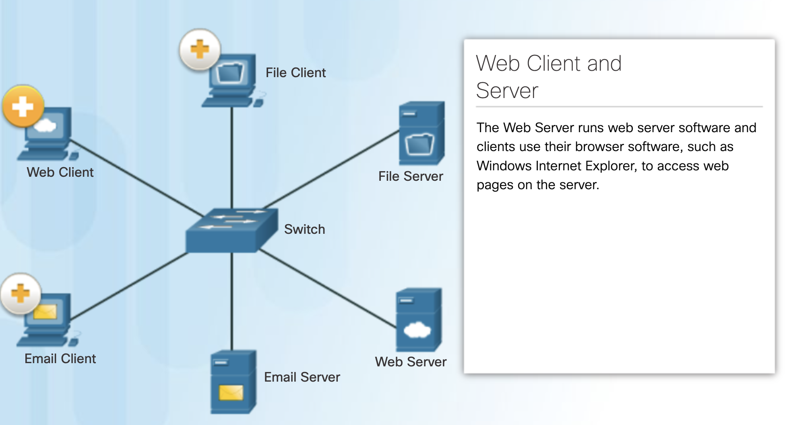

#### A Typical Session: Student

A typical network user at school, at home, or in the office, will normally use some type of computing device to establish many connections with network servers. Those servers could be located in the same room or around the world. Let’s look at a few typical network communication sessions.

Terry is a high school student whose school has recently started a “bring your own device” (BYOD) program. Students are encouraged to use their cell phones or other devices such as tablets or laptops to access learning resources. Terry has just been given an assignment in language arts class to research the effects of World War I on the literature and art of the time. She enters the search terms she has chosen into a search engine app that she has opened on her cell phone.

Terry has connected her phone to the school Wi-Fi network. Her search is submitted from her phone to the school network wirelessly. Before her search can be sent, the data must be addressed so that it can find its way back to Terry. Her search terms are then represented as a string of binary data that has been encoded into radio waves. Her search string is then converted to electrical signals that travel on the school’s wired network until they reach the place at which the school’s network connects to the Internet Service Provider’s (ISP) network. A combination of technologies take Terry’s search to the search engine website.

For example, Terry’s data flows with the data of thousands of other users along a fiber-optic network that connects Terry’s ISP with the several other ISPs, including the ISP that is used by the search engine company. Eventually, Terry’s search string enters the search engine company’s website and is processed by its powerful servers. The results are then encoded and addressed to Terry’s school and her device.

All of these transitions and connections happen in a fraction of a second, and Terry has started on her path to learning about her subject.

#### A Typical Session: Gamer

Michelle loves computer games. She has a powerful gaming console that she uses to play games against other players, watch movies, and play music. Michelle connects her game console directly to her network with a copper network cable.

Michelle’s network, like many home networks, connects to an ISP using a router and a cable modem. These devices allow Michelle’s home network to connect to a cable TV network that belongs to Michelle’s ISP. The cable wires for Michelle’s neighborhood all connect to a central point on a telephone pole and then connect to a fiber-optic network. This fiber-optic network connects many neighborhoods that are served by Michelle’s ISP.

All those fiber-optic cables connect to telecommunications services that provide access to the high-capacity connections. These connections allow thousands of users in homes, government offices, and businesses to connect Internet destinations around the world.

Michelle has connected her game console to a company that hosts a very popular online game. Michelle is registered with the company, and its servers keep track of Michelle’s scores, experiences, and game assets. Michelle’s actions in her game become data that is sent to the gamer network. Michelle’s moves are broken up to groups of binary data that each consist of a string of zeros and ones. Information that identifies Michelle, the game she is playing, and Michelle’s network location are added to the game data. The pieces of data that represent Michelle’s game play are sent at high speed to the game provider’s network. The results are returned to Michelle in the form of graphics and sounds.

All of this happens so quickly that Michelle can compete with hundreds of other gamers in real-time.

#### A Typical Session: Surgeon

Dr. Ismael Awad is an oncologist who performs surgery on cancer patients. He frequently needs to consult with radiologists and other specialists on patient cases. The hospital that Dr. Awad works for subscribes to a special service called a cloud. The cloud allows medical data, including patient x-rays and MRIs to be stored in a central location that is accessed over the Internet. In this way, the hospital does not need to manage paper patient records and X-ray films.

When a patient has an X-ray taken, the image is digitized as computer data. The X-ray is then prepared by hospital computers to be sent to the medical cloud service. Because security is very important when working with medical data, the hospital uses network services that encrypt the image data and patient information. This encrypted data cannot be intercepted and read as it travels across the Internet to the cloud service provider’s data centers. The data is addressed so that it can be routed to the cloud provider’s data center to reach the correct services that provide storage and retrieval of high-resolution digital images.

Dr. Awad and the patient’s care team can connect to this special service, meet with other doctors in audio conferences and discuss patient records to decide on the best treatment that can be provided to the patient. Dr. Awad can work with specialists from diverse locations to view the medical images and other patient data and discuss the case.

All of this interaction is digital and takes place using networked services that are provided by the medical cloud service.

#### Tracing the Path

We tend to think about the data networks we use in our daily lives as we think about driving a car. We do not really care what happens in the engine as long as the car takes us where we want to go. However, just like a car’s mechanic knows the details of how a car operates, cybersecurity analysts need to have a deep understanding of how networks operate.

When we connect to a website to read social media or shop, we seldom care about how our data gets to the website and how data from the website gets to us. We are not aware of the many technologies that enable us to use the Internet. A combination of copper and fiber-optic cables that go over land and under the ocean carry data traffic. High-speed wireless and satellite technologies are also used. These connections connect telecommunications facilities and ISPs that are distributed throughout the world, as shown in the figure. These global Tier 1 and Tier 2 ISPs connect portions of the Internet together, usually through an Internet Exchange Point (IXP). Larger networks will connect to Tier 2 networks through a Point of Presence (PoP), which is usually a location in the building where physical connections to the ISP are made. The Tier 3 ISPs connect homes and businesses to the Internet.

Because of different relationships between ISPs and telecommunications companies, traffic from a computer to an Internet server can take many paths. The traffic of a user in one country can take a very indirect path to reach its destination. The traffic might first travel from the local ISP to a facility that has connections to many other ISPs. A user’s Internet traffic can go many hundreds of miles in one direction only to be routed in a completely different direction to reach its destination. Some of the traffic can take certain routes to reach the destination, and then take completely different routes to return.

Cybersecurity analysts must be able to determine the origin of traffic that enters the network, and the destination of traffic that leaves it. Understanding the path that network traffic takes is essential to this.

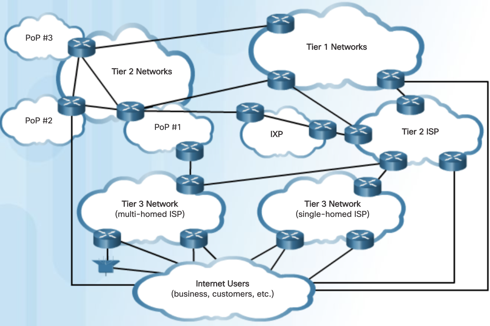

#### 4.1.1.7 Lab - Tracing a Route

In this lab, you will use two route tracing utilities to examine the Internet pathway to destination networks. First, you will verify connectivity to a website. Second, you will use the traceroute utility on the Linux command line. Third, you will use a web-based traceroute tool.

[Lab – Tracing a Route](https://static-course-assets.s3.amazonaws.com/CyberOps11/en/course/files/4.1.1.7 Lab - Tracing a Route.pdf)

### 4.1.2 Communications Protocols

#### 4.1.2.1 What are Protocols?

Simply having a wired or wireless physical connection between end devices is not enough to enable communication. For communication to occur, devices must know “how” to communicate. Communication, whether by face-to-face or over a network, is governed by rules called protocols. These protocols are specific to the type of communication method occurring.

For example, consider two people communicating face-to-face. Prior to communicating, they must agree on how to communicate. If the communication is using voice, they must first agree on the language. Next, when they have a message to share, they must be able to format that message in a way that is understandable. For example, if someone uses the English language, but poor sentence structure, the message can easily be misunderstood. Figure 1 shows an example of communication not adhering to protocols for grammar and language.

Network protocol communication is the same way. Network protocols provide the means for computers to communicate on networks. Network protocols dictate the message encoding, formatting, encapsulation, size, timing, and delivery options, as shown in Figure 2. As a cybersecurity analyst, you must be very familiar with structure of protocols and how they are used in network communications.

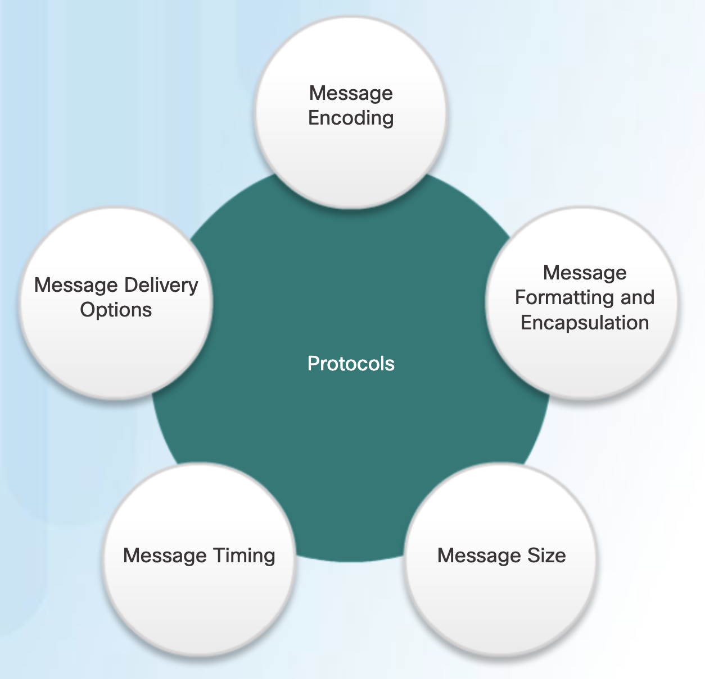

#### Network Protocol Suites

A protocol suite is a set of protocols that work together to provide comprehensive network communication services. A protocol suite may be specified by a standards organization or developed by a vendor.

For devices to successfully communicate, a network protocol suite must describe precise requirements and interactions. Networking protocols define a common format and set of rules for exchanging messages between devices. Some common networking protocols are Hypertext Transfer Protocol (HTTP), Transmission Control Protocol (TCP), and Internet Protocol (IP).

Note: IP in this course refers to both the IPv4 and IPv6 protocols. IPv6 is the most recent version of IP and will eventually replace the more common IPv4.

Figures 1 through 4 illustrate the role of networking protocols:

- How the message is formatted or structured, as shown in Figure 1.
- The process by which networking devices share information about pathways with other networks, as shown in Figure 2.
- How and when error and system messages are passed between devices, as shown in Figure 3.
- The setup and termination of data transfer sessions, as shown in Figure 4.

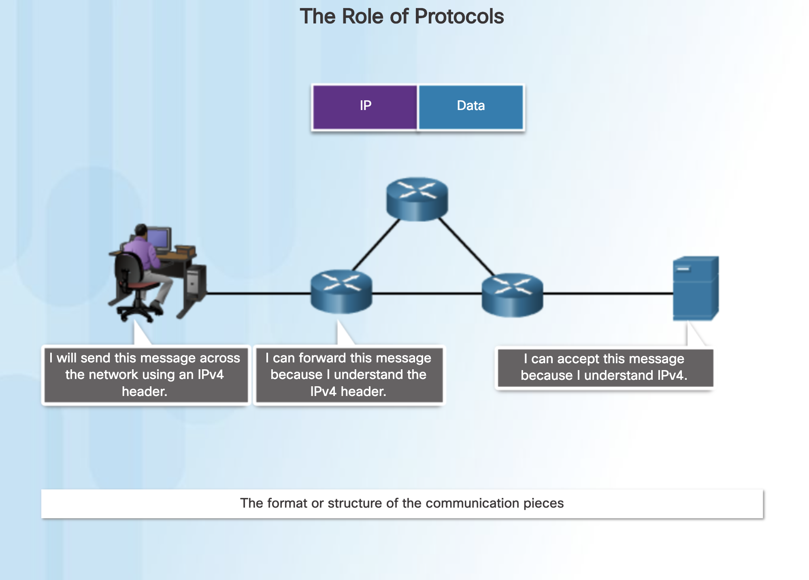

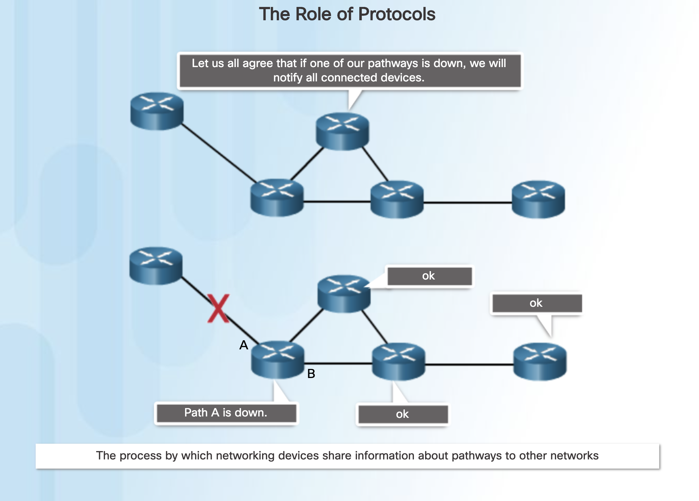

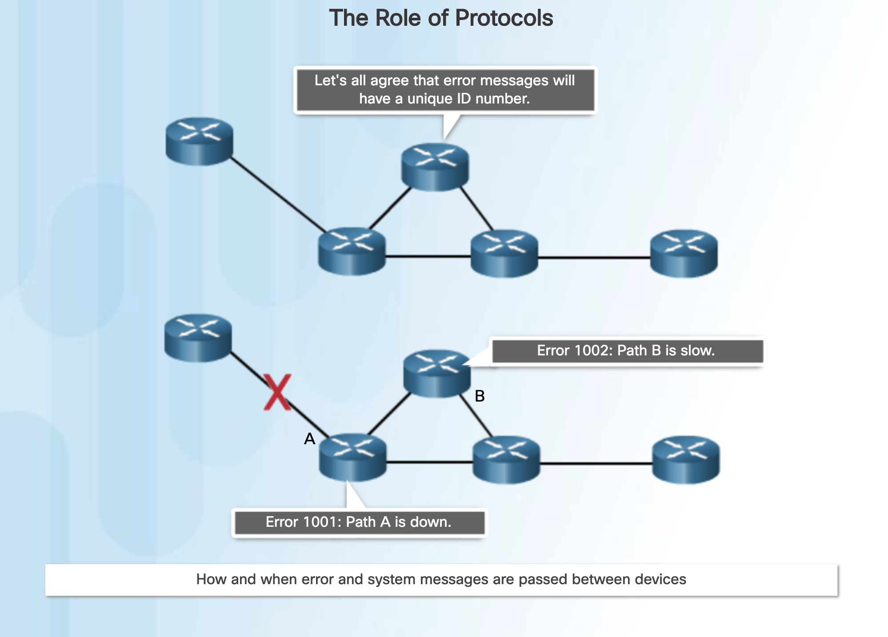

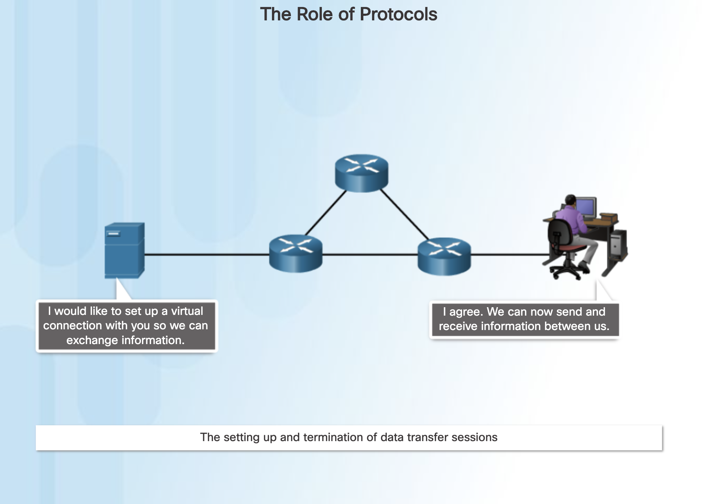

#### The TCP/IP Protocol Suite

Networks today use the TCP/IP protocol suite. Click each protocol acronym in the figure to view the acronym’s translation and description. The individual protocols are organized in layers using the TCP/IP protocol model: Application, Transport, Internet, and Network Access Layers. TCP/IP protocols are specific to the Application, Transport, and Internet layers. The network access layer protocols are responsible for delivering the IP packet over the physical medium, such as through a network cable or wireless signal.

The TCP/IP protocol suite is implemented on both the sending and receiving hosts to provide end-to-end delivery of messages over a network. TCP/IP has standardized the way the computers communicate, which has enabled the Internet as we know it today. Unfortunately, this widespread usage has attracted the attention of people who want to misuse networks. Much of the work of the cybersecurity analyst concerns analysis of the behavior of the TCP/IP suite of protocols.

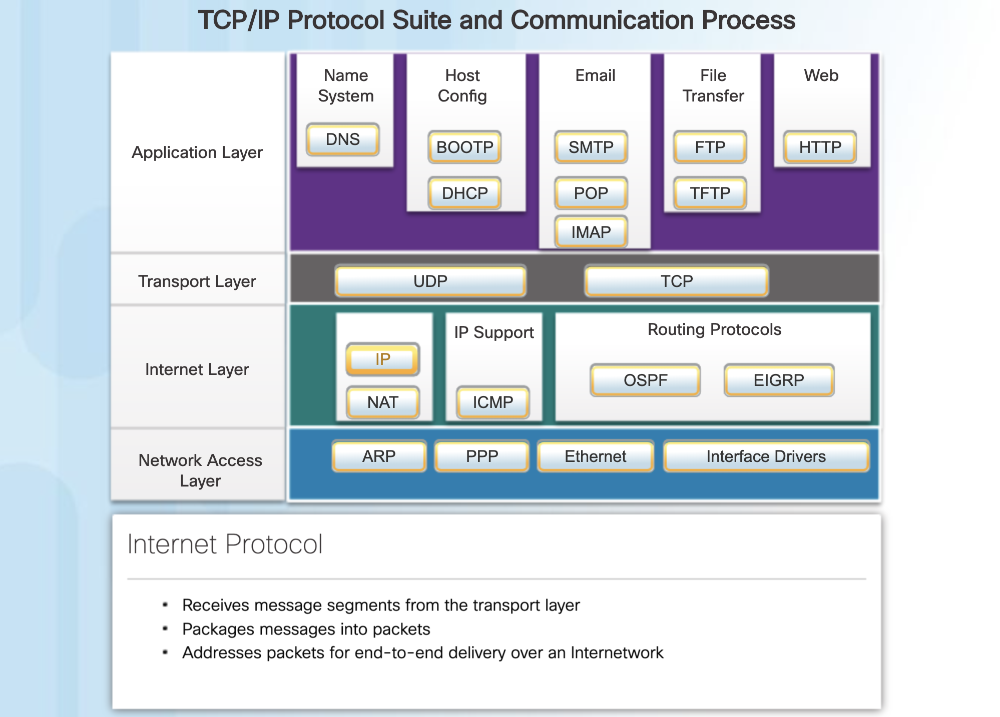

[Quelle](https://static-course-assets.s3.amazonaws.com/CyberOps11/en/index.html#4.1.2.3)

#### Format, Size, and Timing

Protocols define the format, size, and timing of different forms of messages.

Format

When you send an email, protocols of the TCP/IP protocol suite are used by your device to format your message for sending on the network. This is similar to you sending a letter in the mail. You place your letter in an envelope. The envelope has the address of the sender and receiver, each located at the proper place on the envelope, as shown in Figure 1. If the destination address and formatting are not correct, the letter is not delivered. The process of placing one message format (the letter) inside another message format (the envelope) is called encapsulation. De-encapsulation occurs when the process is reversed by the recipient and the letter is removed from the envelope.

Just as a letter is encapsulated in an envelope for delivery, so too are computer messages. Each computer message is encapsulated in a specific format, called a frame, before it is sent over the network. The frame structure is discussed later in the chapter.

Size

Another rule of communication is size. When people communicate in person or over the phone, a conversation is usually made up of many smaller sentences to ensure that each part of the message is received and understood.

Likewise, when a long message is sent from one host to another over a network, it is necessary to break the message into many frames, as shown in Figure 2. Each frame will have its own addressing information. At the receiving host, the individual frames are reconstructed into the original message.

Timing

Timing includes the access method (when can a host send), flow control (how much information can a host send at one time), and response timeout (how long to wait for a response). This chapter will explore how network protocols manage these timing issues.

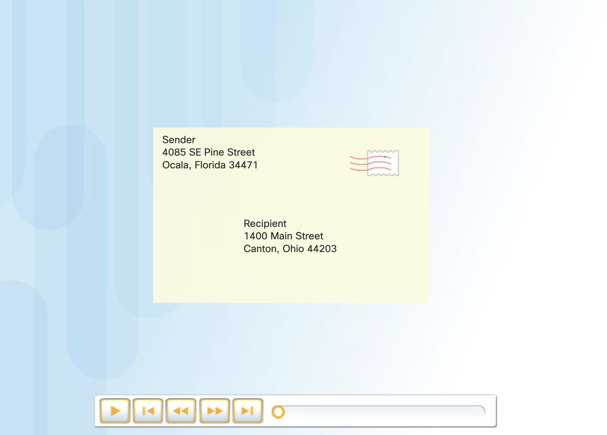

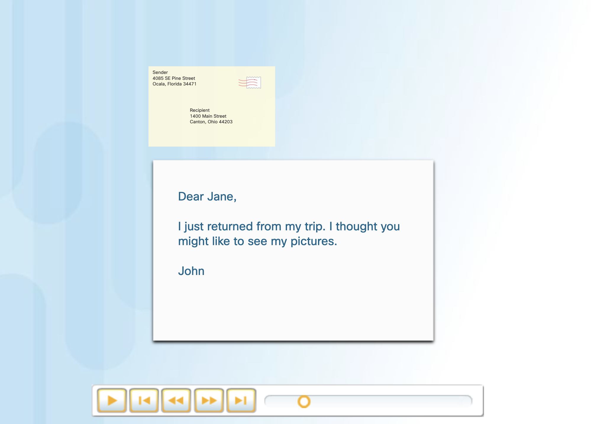

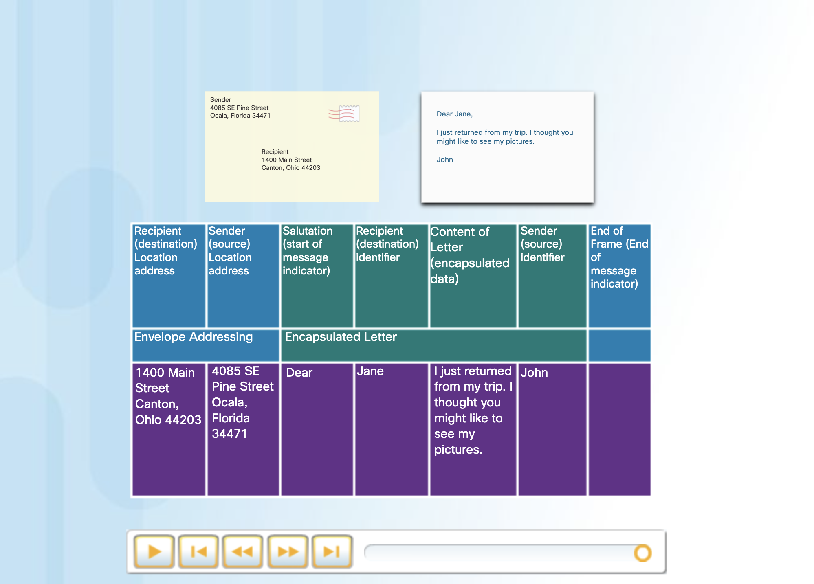

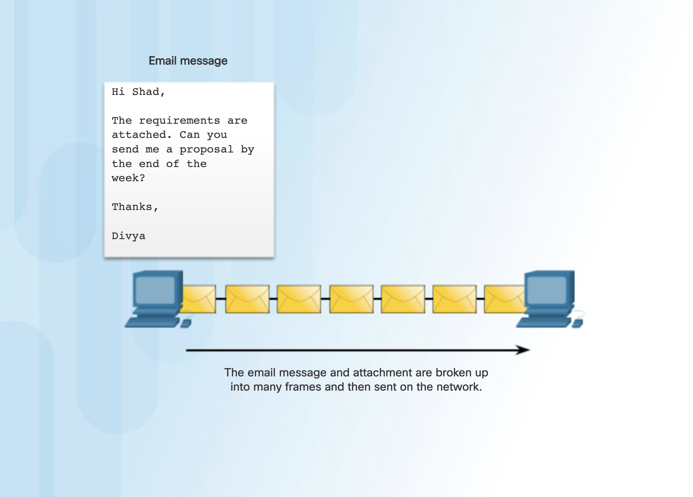

#### Unicast, Multicast, and Broadcast

A message can be delivered in different ways. Sometimes, a person wants to communicate information to a single individual. At other times, the person may need to send information to a group of people at the same time, or even to all people in the same area.

Hosts on a network use similar delivery options to communicate, as shown in the figure.

A one-to-one delivery option is referred to as a unicast, meaning there is only a single destination for the message.

When a host needs to send messages using a one-to-many delivery option, it is referred to as a multicast.

If all hosts on the network need to receive the message at the same time, a broadcast may be used. Broadcasting represents a one-to-all message delivery option.

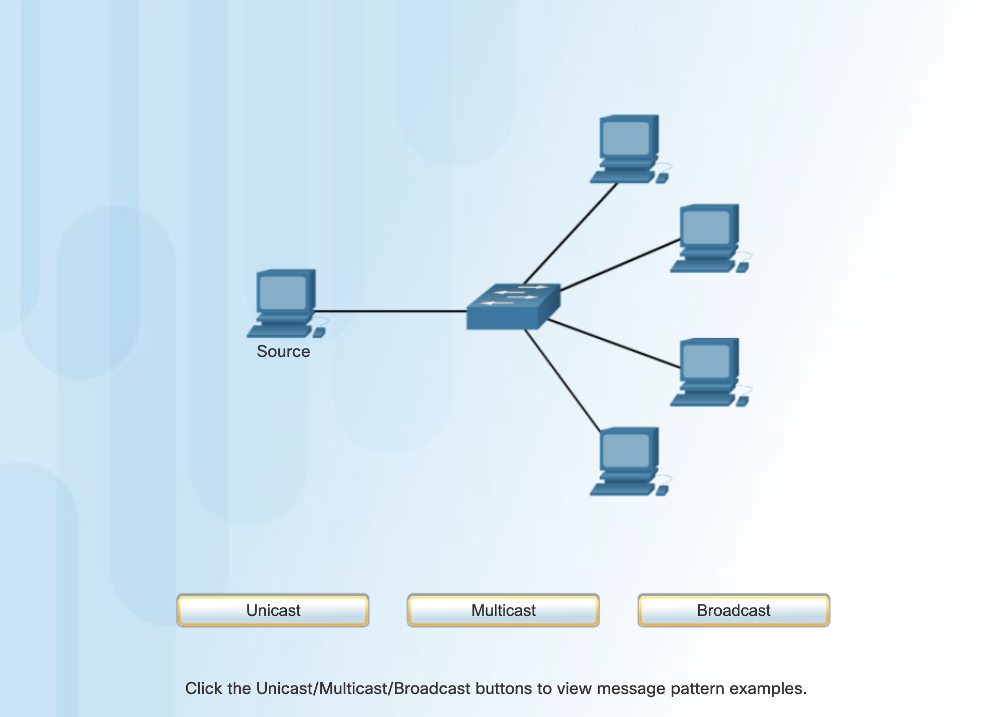

#### Reference Models

As you learned earlier, the TCP/IP protocol suite is represented by four-layer model: Application, Transport, Internet, and Network Access. Another popular reference model is the Open Systems Interconnection (OSI) model, which uses a seven-layer model, as shown in the figure. In networking literature, when a layer is referred to by a number, such as Layer 4, then the reference is using the OSI model. Reference to layers in the TCP/IP model use the name of the layer, such as the transport layer.

The OSI Reference Model

The OSI model provides an extensive list of functions and services that can occur at each layer. It also describes the interaction of each layer with the layers directly above and below. Click each layer of the OSI model in Figure 2 to view the details.

The TCP/IP Protocol Model

The TCP/IP protocol model for internetwork communications was created in the early 1970s. As shown in Figure 3, it defines four categories of functions that must occur for communications to be successful.

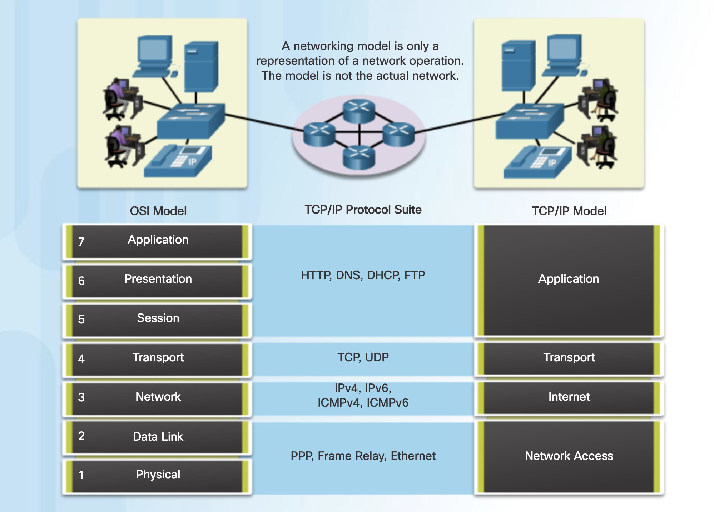

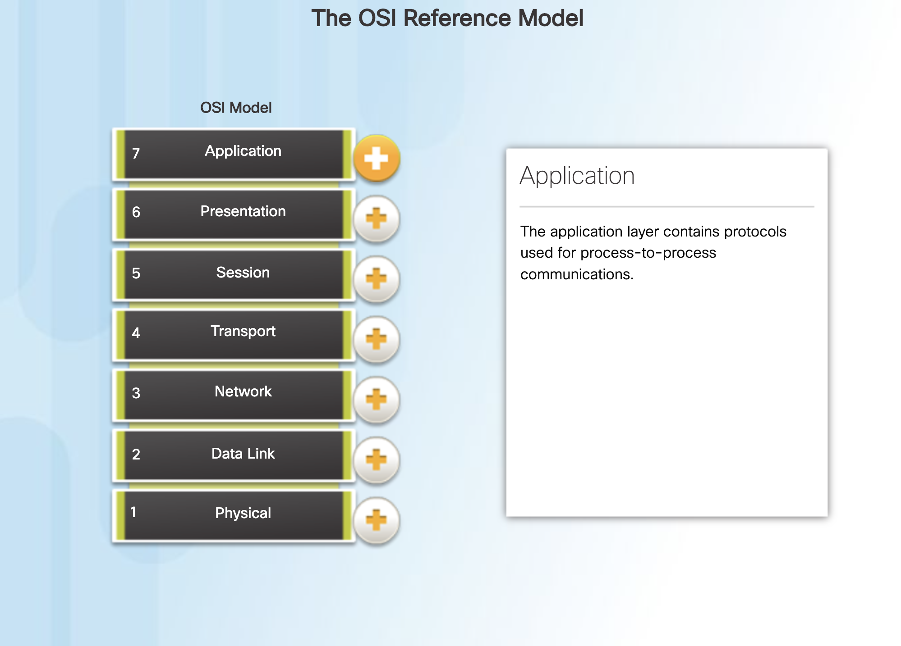

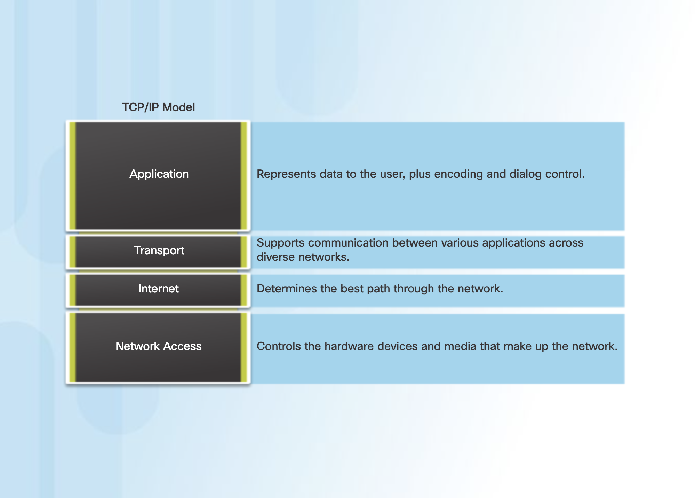

#### Three Addresses

Network protocols require that addresses be used for network communication. Addressing is used by the client to send requests and other data to a server. The server uses the client’s address to return the requested data to the client that requested it.

Protocols operate at layers. The OSI transport, network, and data link layers all use addressing in some form. The transport layer uses protocol addresses in the form of port numbers to identify network applications that should handle client and server data. The network layer specifies addresses that identify the networks that clients and servers are attached to and the clients and servers themselves. Finally, the data link layer specifies the devices on the local LAN that should handle data frames. All three addresses are required for client-server communication, as shown in the figure.

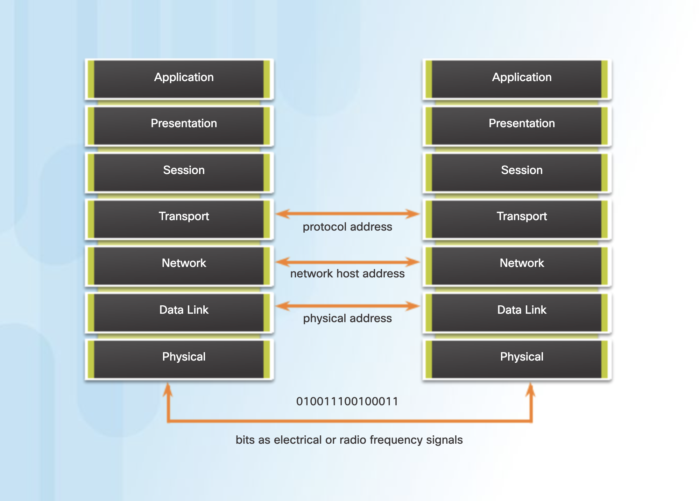

#### Encapsulation

As you have seen, data is divided into smaller, more manageable pieces to send over the network. This division of data into smaller pieces is called segmentation. Segmenting messages has two primary benefits:

Segmentation – This process increases the efficiency of network communications. If part of the message fails to make it to the destination, due to failure in the network or network congestion, only the missing parts need to be retransmitted.
Multiplexing - By sending smaller individual pieces from source to destination, many different conversations can be interleaved on the network. This is called multiplexing.
Click each button in Figure 1, and then click the Play button to view the animations of segmentation and multiplexing.

In network communications, each segment of the message must be properly labeled to ensure that it gets to the correct destination and can be reassembled into the content of the original message, as shown in Figure 2.

As application data is passed down the protocol stack on its way to be transmitted across the network media, it is encapsulated with various protocol information at each level.

The form that an encapsulated piece of data takes at any layer is called a protocol data unit (PDU). Each succeeding layer encapsulates the PDU that it receives from the layer above in accordance with the protocol being used. At each stage of the process, a PDU has a different name to reflect its new functions. Although there is no universal naming convention for PDUs, in this course, the PDUs are named according to the protocols of the TCP/IP suite, as shown in the Figure 3. Click the plus sign (+) at each PDU in Figure 3 for more information.

When sending messages on a network, the encapsulation process works from top to bottom. At each layer, the upper layer information is considered data within the encapsulated protocol. For example, the TCP segment is considered data within the IP packet. Click Play in Figure 4 to see the encapsulation process as a web server sends a web page to a web client.

Messages sent across the network are first converted into bits by the sending host. Each bit is encoded into a pattern of sounds, light waves, or electrical impulses depending on the network media over which the bits are transmitted. The destination host receives and decodes the signals in order to interpret the message.

This process is reversed at the receiving host, and is known as de-encapsulation. The data is de-encapsulated as it moves up the stack toward the end-user application. Click Play in Figure 5 to see the de-encapsulation process.

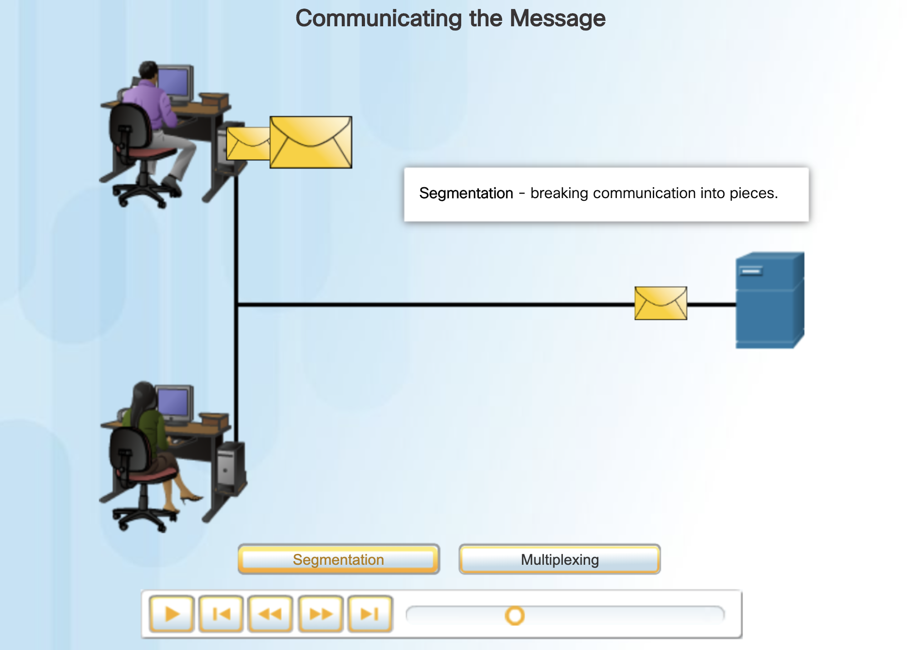

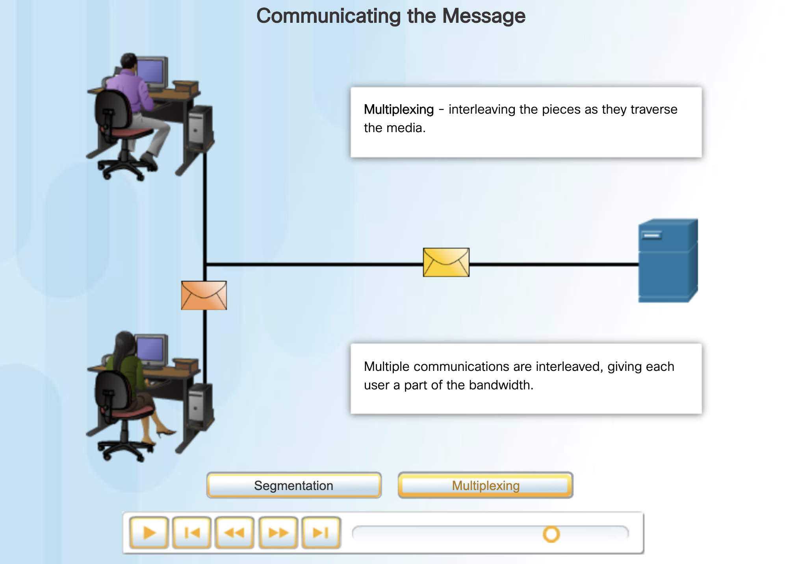

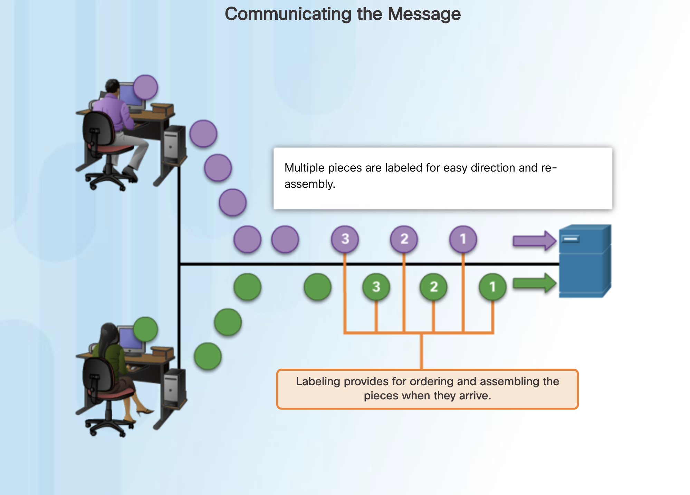

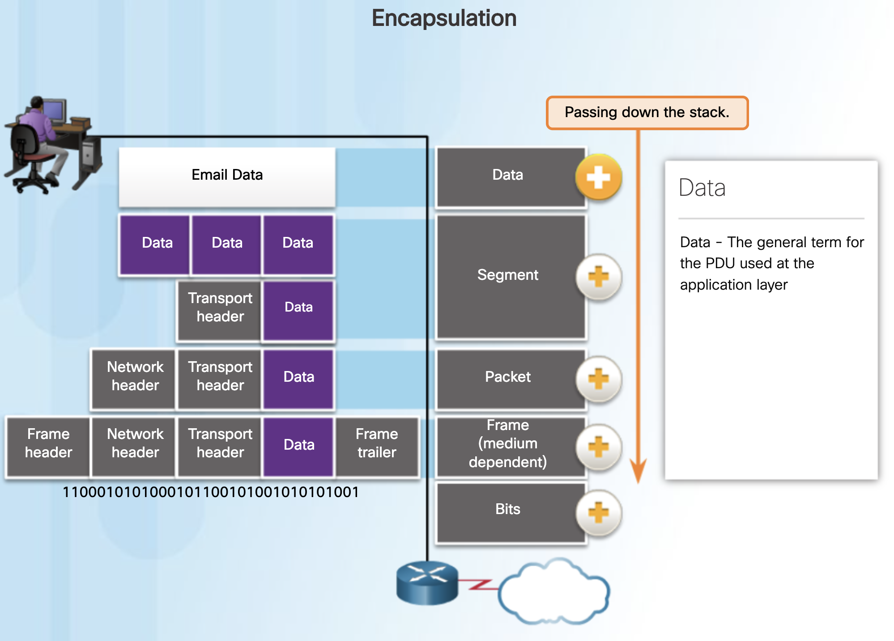

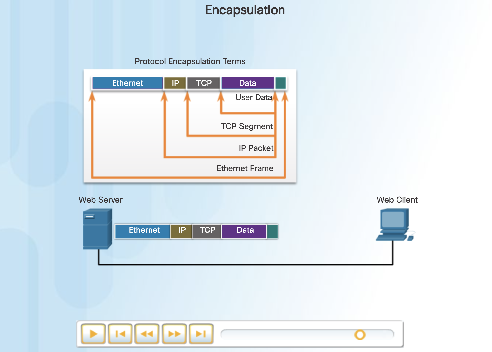

Obige Animation zeigt wie ein Header nach dem Anderen angefügt werden. Siehe `Chapter 4 Network Protocols and Services/vid/4_1_2_8_Encapsulation.m4v`

Video für den Prozess beim Empfangen: `Chapter 4 Network Protocols and Services/vid/4_1_2_8_Receiving.m4v`

#### Scenario: Sending and Receiving a Web Page

To summarize network communication processes and protocols, consider the scenario of sending and receiving a web page. Figure 1 lists some of the protocols used between a web server and a web client:

HTTP – This application protocol governs the way a web server and a web client interact.
TCP – This transport protocol manages individual conversations. TCP divides the HTTP messages into smaller pieces, called segments. TCP is also responsible for controlling the size and rate at which messages are exchanged between the server and the client.
IP – This is responsible for taking the formatted segments from TCP, encapsulating them into packets, assigning them the appropriate addresses, and delivering them to the destination host.
Ethernet – This network access protocol is responsible for taking the packets from IP and formatting them to be transmitted over the media.
Figures 2 and 3 demonstrate the complete communication process using an example of a web server transmitting data to a client (Figure 2) and the client receiving the data (Figure 3). Click the Play button to view the animated demonstrations. This process and these protocols will be covered in more detail in later chapters.

1. In Figure 2, the animation begins with the web server preparing the Hypertext Markup Language (HTML) page as data to be sent.

2. The application protocol HTTP header is added to the front of the HTML data. The header contains various information, including the HTTP version that the server is using and a status code indicating it has information for the web client.

3. The HTTP application layer protocol delivers the HTML-formatted web page data to the transport layer. TCP segments the data adding source and destination port numbers.

4. Next, the IP information is added to the front of the TCP information. IP assigns the appropriate source and destination IP addresses. The TCP segment has now been encapsulated in an IP packet.

5. The Ethernet protocol adds information to both ends of the IP packet to create a frame. This frame is delivered through the network towards the web client.

6. In Figure 3, the animation begins with the client receiving the data link frames that contain the data. Each protocol header is processed and then removed in the opposite order it was added. The Ethernet information is processed and removed, followed by the IP protocol information, the TCP information, and finally the HTTP information.

7. The web page information is then passed on to the client’s web browser software.

Cybersecurity analysts are adept at using tools to view the behavior of network protocols. For example, Wireshark captures all the details of the protocols encapsulated in packets and data that travels through the network. This course will focus on the use of Wireshark and the interpretation of Wireshark data.

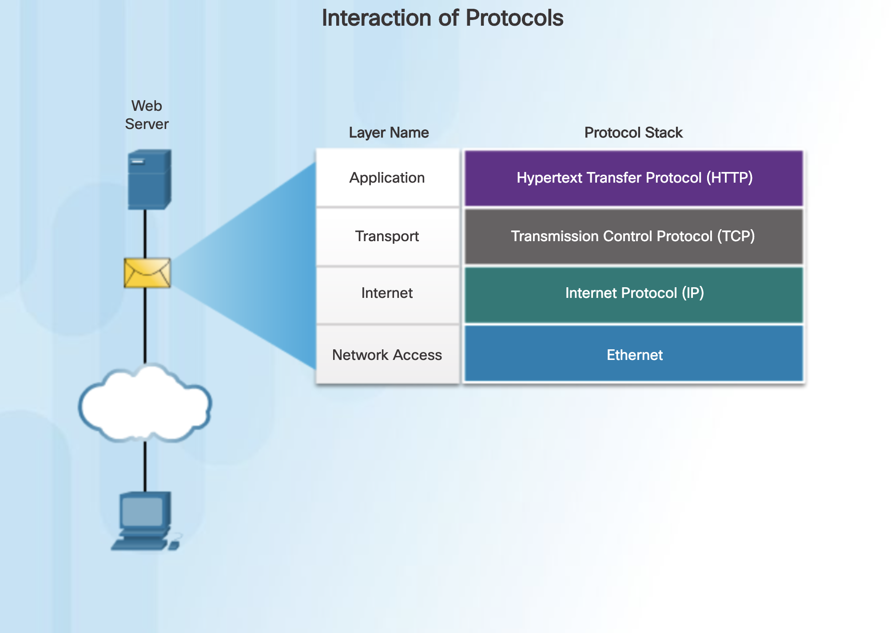

#### Lab - Introduction to Wireshark

Wireshark is a software protocol analyzer, or "packet sniffer" application, used for network troubleshooting, analysis, software and protocol development, and education. Wireshark is used throughout the course to demonstrate network concepts. In this lab, you will use Wireshark to capture and analyze network traffic.

[Lab - Introduction to Wireshark](https://static-course-assets.s3.amazonaws.com/CyberOps11/en/course/files/4.1.2.10 Lab - Introduction to Wireshark.pdf)

## 4.2 Ethernet and Internet Protocol (IP)

### 4.2.1 Ethernet

#### 4.2.1.1 The Ethernet Protocol

The Ethernet Protocol
Ethernet operates in the data link layer and the physical layer, as shown in the figure. It is a family of networking technologies that are defined in the IEEE 802.2 and 802.3 standards. Ethernet relies on the two separate sublayers of the data link layer to operate, the Logical Link Control (LLC) and the Media Access Control (MAC) sublayers.

LLC is responsible for communication with the network layer. MAC is implemented by the computer’s network interface card (NIC). The MAC sublayer has two primary responsibilities:

Data encapsulation - Ethernet encapsulates the IP packet into a frame, adding timing information, destination and source MAC addresses, and error checking feature.
Media access control - Ethernet manages the process of converting the frame into bits and sending the frame out onto the network. In older wired networks, devices could not send and receive data at the same time. This is still the case for wireless networks. In such situations, Ethernet use a process to determine when a device can send and what to do if the data sent by two devices collides on the network. This process is discussed later in the chapter.

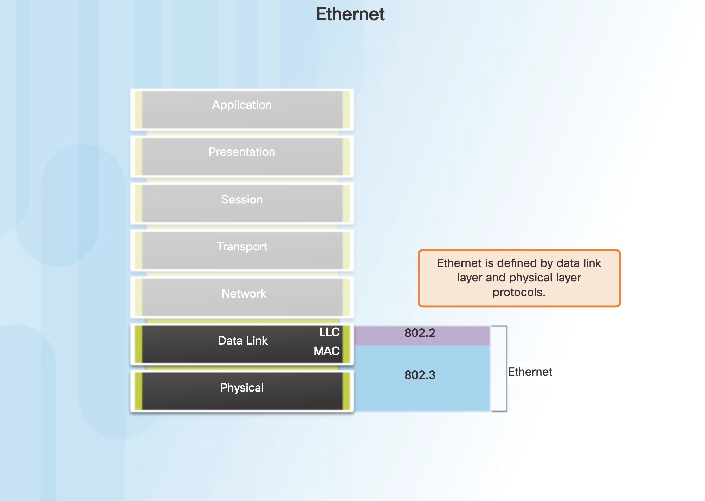

#### The Ethernet Frame

The minimum Ethernet frame size is 64 bytes and the maximum is 1518 bytes. This includes all bytes from the Destination MAC Address field through the Frame Check Sequence (FCS) field. The Preamble field is not included when describing the size of a frame.

Any frame less than 64 bytes in length is considered a “collision fragment” or “runt frame”. Frames with more than 1518 bytes are considered “jumbo” or “baby giant frames”.

If the size of a transmitted frame is less than the minimum or greater than the maximum, the receiving device drops the frame. Dropped frames are likely to be the result of collisions or other unwanted signals and are therefore considered invalid.

In the figure, click each field in the Ethernet frame to read more about its function.

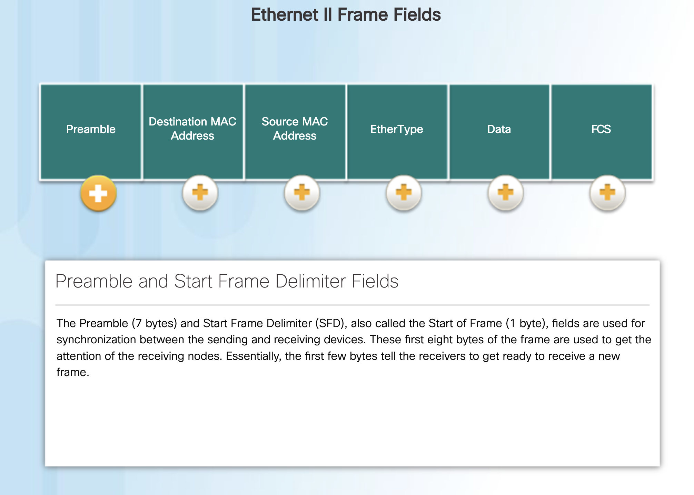

#### MAC Address Format

An Ethernet MAC address is a 48-bit binary value expressed as 12 hexadecimal digits (4 bits per hexadecimal digit). Hexadecimal digits uses the numbers 0 to 9 and the letters A to F. Figure 1 shows the equivalent decimal and hexadecimal values for binary 0000 to 1111. Hexadecimal is commonly used to represent binary data. IPv6 addresses are another example of hexadecimal addressing.

Depending on the device and the operating system, you will see various representations of MAC addresses, as displayed in Figure 2.

All data that travels on the network is encapsulated in Ethernet frames. A cybersecurity analyst should be able to interpret the Ethernet data that is captured by protocol analyzers and other tools.

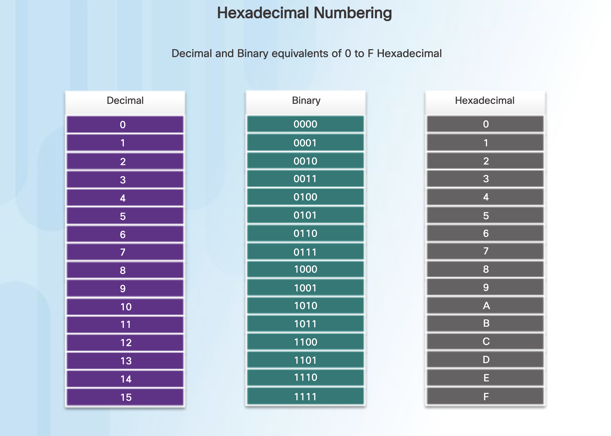

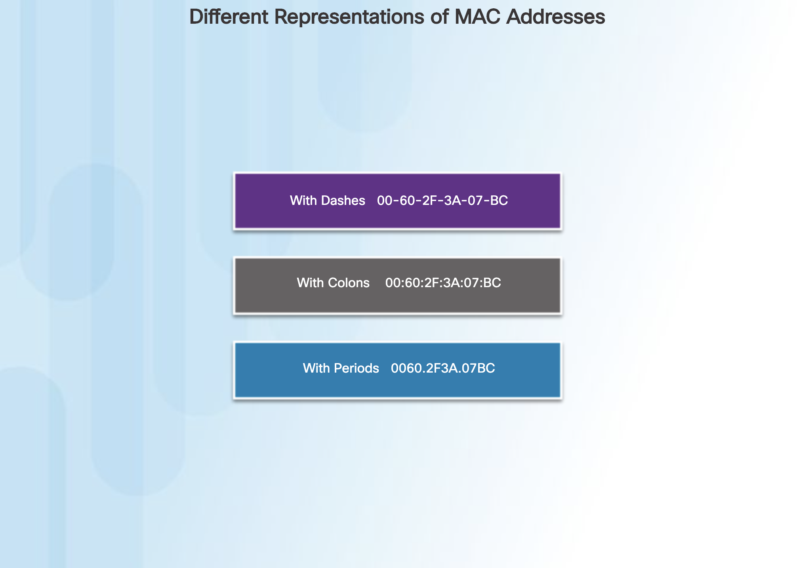

### 4.2.2 IPv4

#### 4.2.2.1 IPv4 Encapsulation

As we know, Ethernet operates at the data link and physical layers of the OSI model. We will now focus on the network layer. Just as the data link layer encapsulates IP packets as frames, the network layer encapsulates segments from the transport layer into IP packets, as shown in Figure 1.

IP encapsulates the transport layer segment by adding an IP header. This header includes information that is necessary to deliver the packet to the destination host.

Figure 2 illustrates how the transport layer PDU is then encapsulated by the network layer PDU to create an IP packet.

Animation für Durchlauf durch den OSI Stack, siehe `Chapter 4 Network Protocols and Services/vid/4_2_2_1_OSI_stack.m4v`

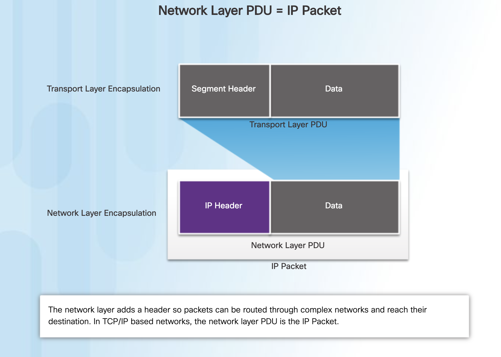

#### IPv4 Characteristics

The basic characteristics of IP are described in Figure 1.

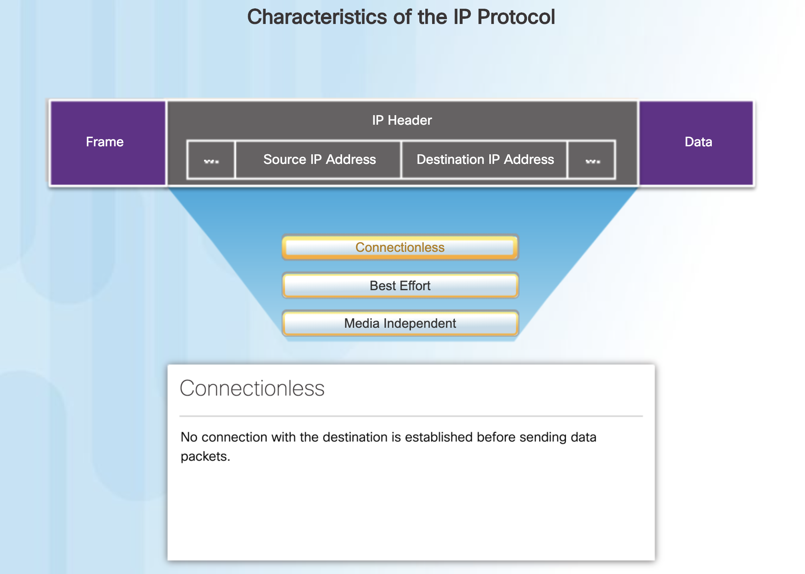

Connectionless

IP is connectionless, meaning that no dedicated end-to-end connection is created before data is sent. As shown in Figure 2, connectionless communication is conceptually similar to sending a letter to someone without notifying the recipient in advance.

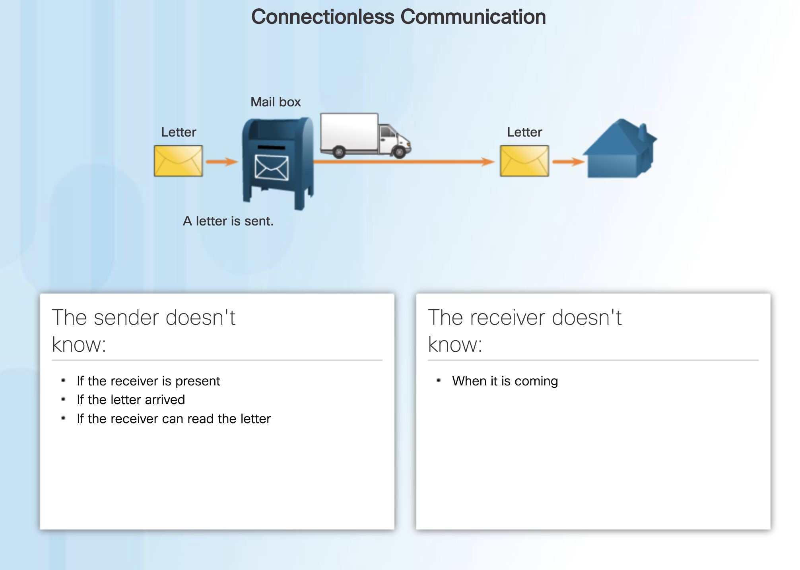

Connectionless data communications work on the same principle. As shown in Figure 3, IP requires no initial exchange of control information to establish an end-to-end connection before packets are forwarded. 

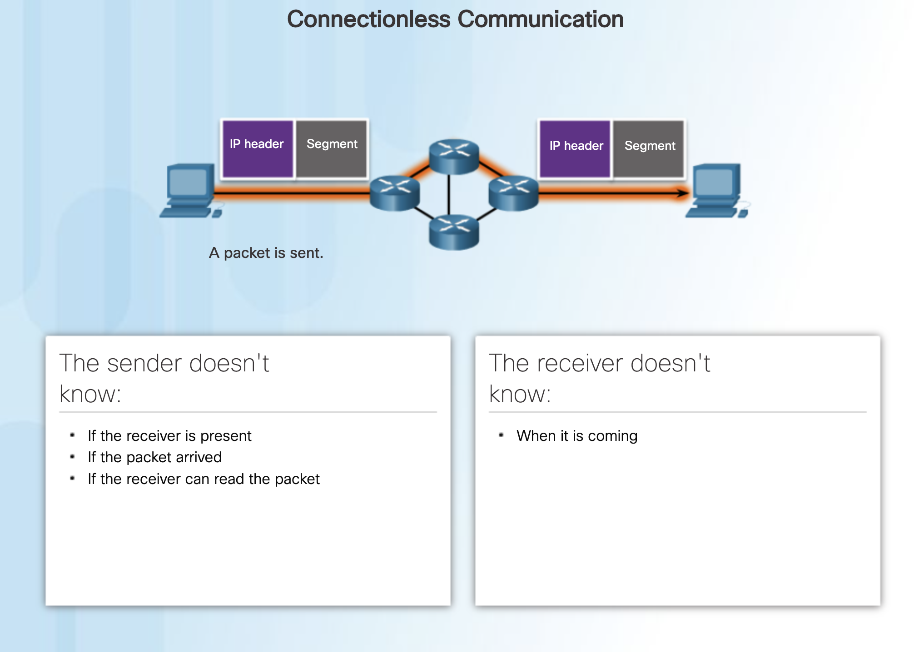

IP also does not require additional fields in the header to maintain an established connection. This process greatly reduces the overhead of IP. However, with no pre-established end-to-end connection, senders are unaware whether destination devices are present and functional when sending packets, nor are they aware if the destination receives the packet, or if they are able to access and read the packet.

Unreliable

Figure 4 illustrates the unreliable, or best-effort, delivery characteristic of the IP protocol. The IP protocol does not guarantee that all packets that are delivered are, in fact, received.

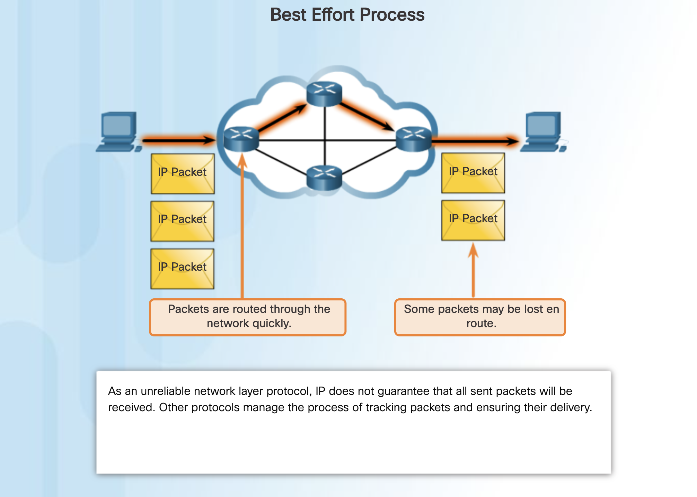

Unreliable means that IP does not have the capability to manage and recover from undelivered or corrupt packets. This is because while IP packets are sent with information about the location of delivery, they contain no information that can be processed to inform the sender whether delivery was successful. Packets may arrive at the destination corrupted, out of sequence, or not at all. IP provides no capability for packet retransmissions if errors occur.

If out-of-order packets are delivered, or packets are missing, then upper layer services must resolve these issues. This allows IP to function very efficiently. In the TCP/IP protocol suite, reliability is the role of the transport layer, as we will discuss later in the chapter.

Media Independent

IP operates independently of the media that carry the data at lower layers of the protocol stack. As shown in Figure 5, IP packets can be sent as electronic signals over copper cable, as optical signals over fiber, or wirelessly as radio signals.

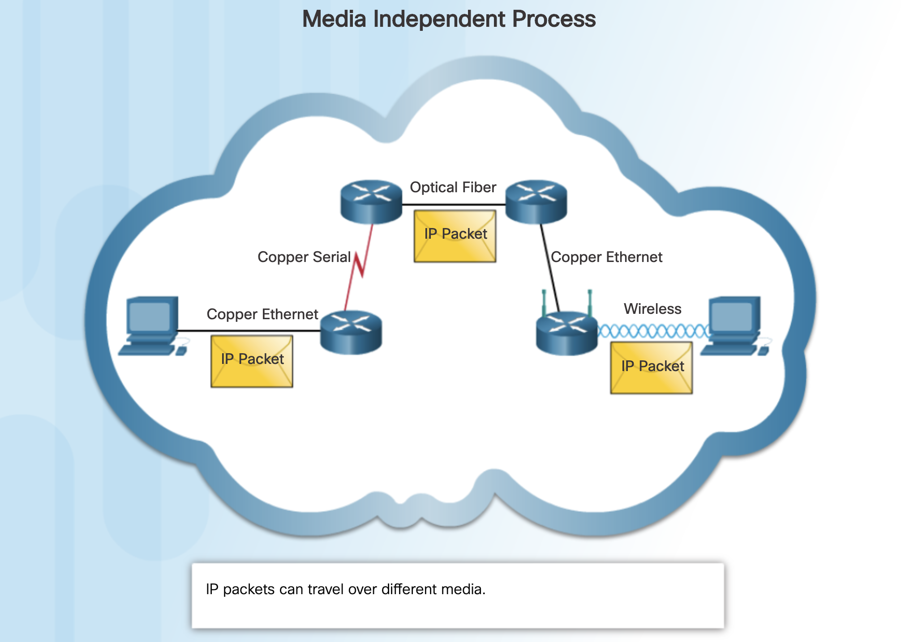

It is the responsibility of the data link layer to take an IP packet and prepare it for transmission over the communications medium. This means that the transport of IP packets is not limited to any particular medium.

There is, however, one major characteristic of the media that the network layer considers: the maximum size of the PDU that each medium can transport. This characteristic is referred to as the maximum transmission unit (MTU). Part of the control communication between the data link layer and the network layer is the establishment of a maximum size for the packet. The data link layer passes the MTU value up to the network layer. The network layer then determines how large packets can be.

In some cases, an intermediate device, usually a router, must split up a packet when forwarding it from one medium to another medium with a smaller MTU. This process is called fragmenting the packet, or fragmentation.

#### The IPv4 Packet

An IPv4 packet header consists of fields containing important information about the packet. These fields contain binary numbers which are examined by the Layer 3 process. The binary values of each field identify various settings of the IP packet. Protocol header diagrams, which are read left to right, and top down, provide a visual to refer to when discussing protocol fields. The IP protocol header diagram in the figure identifies the fields of an IPv4 packet.

The fields in the IPv4 packet header are discussed in more detail later in the course.

The two most commonly referenced fields are the source and destination IP addresses. These fields identify where the packet is coming from and where it is going.

Cybersecurity analysts must have a firm grasp of the operation of IP and the meaning of IP data that is captured by protocol analyzers and other network devices. This data is mostly in the form of the information contained in IP packet headers.

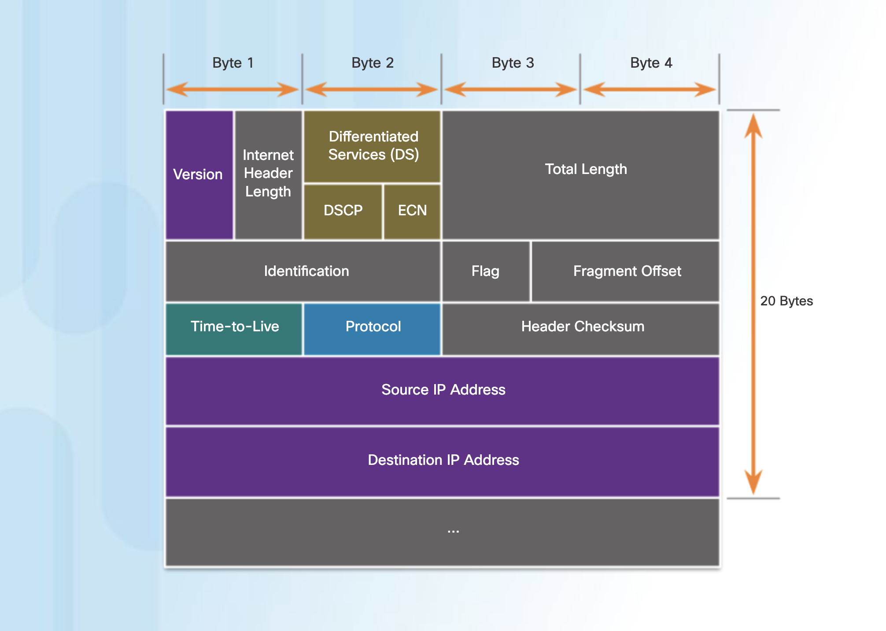

#### Video Demonstration - Sample IPv4 Headers in Wireshark

Click Play in the figure to view a demonstration of examining IPv4 headers in a Wireshark capture.

Click [here](https://static-course-assets.s3.amazonaws.com/CyberOps11/en/course/files/4.2.2.5 Video Slides - IPv4 Wireshark Captures.pdf) to download a PDF file of the Wireshark captures and notes used during the demonstration.

Click [here](https://static-course-assets.s3.amazonaws.com/CyberOps11/en/course/files/4.2.2.5 Video - Sample IPv4 Headers in Wireshark.pdf) to read the transcript of this video.

### 4.2.3 IPv4 Addressing Basics

#### 4.2.3.1 IPv4 Address Notation

An IPv4 address is simply a series of 32 binary bits (ones and zeros). It is very difficult for humans to read a binary IPv4 address. For this reason, the 32 bits are grouped into four 8-bit bytes called octets. Each octet is represented as its decimal value, separated by a decimal point or period. This is referred to as dotted-decimal notation.

When a host is configured with an IPv4 address, it is entered as a dotted decimal number such as 192.168.10.10. The equivalent address in binary is 1100000.10101000.00001010.00001010. The conversion to dotted-decimal is shown in the figure.

Note: If you are new to binary to decimal conversion, search the Internet for tutorials. Some proficiency in binary will be helpful in your job as a cybersecurity analyst. Click [here](https://learningnetwork.cisco.com/s/binary-game) to play Cisco’s Binary Game and test your binary conversion skills.

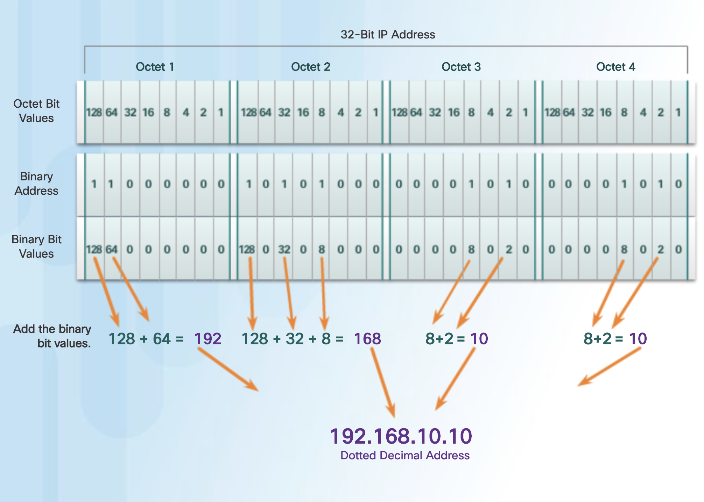

#### IPv4 Host Address Structure

An IPv4 address is a hierarchical address that is made up of a network portion and a host portion. When determining the network portion versus the host portion, it is necessary to look at the 32-bit stream. Within the 32-bit stream, a portion of the bits identify the network, and a portion of the bits identify the host, as shown in Figure 1.

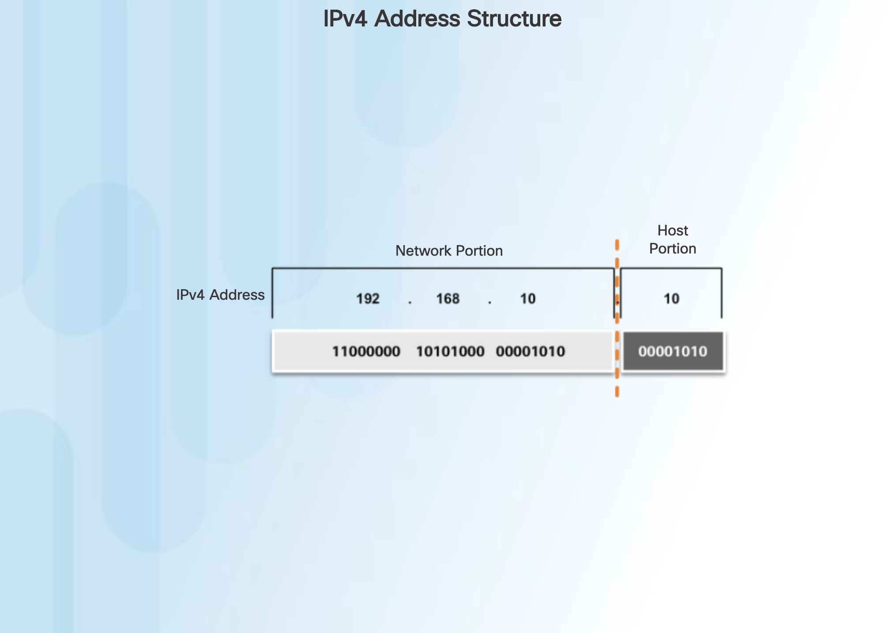

The bits within the network portion of the address must be identical for all devices that reside in the same network. The bits within the host portion of the address must be unique to identify a specific host within a network. For example, if you looked at the IPv4 addresses for various devices in your home network, you will most likely see the same network portion. Figure 2 shows the IPv4 configuration for a Windows computer. 

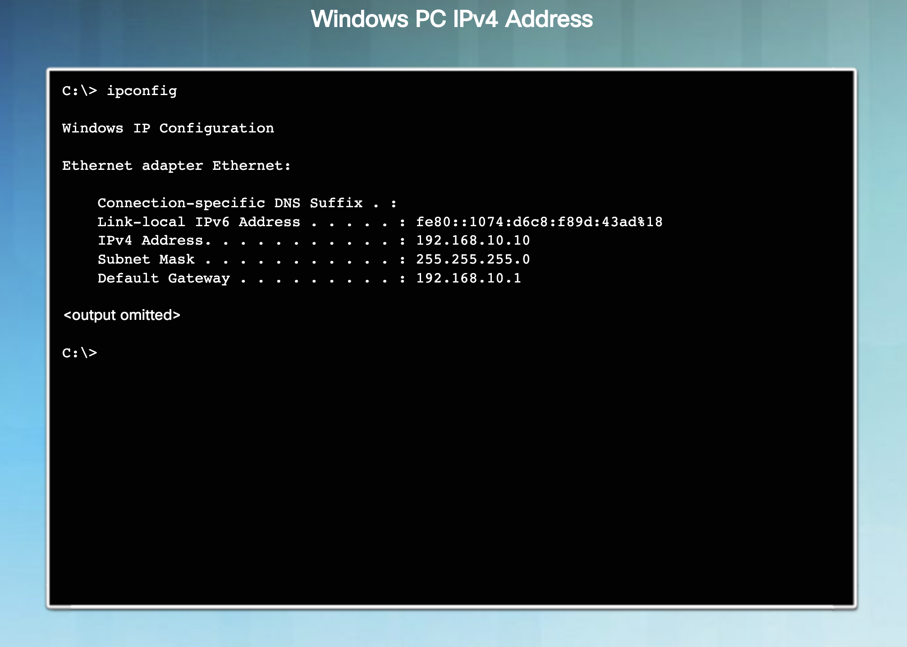

Figure 3 shows the IPv4 address for an iPhone. 

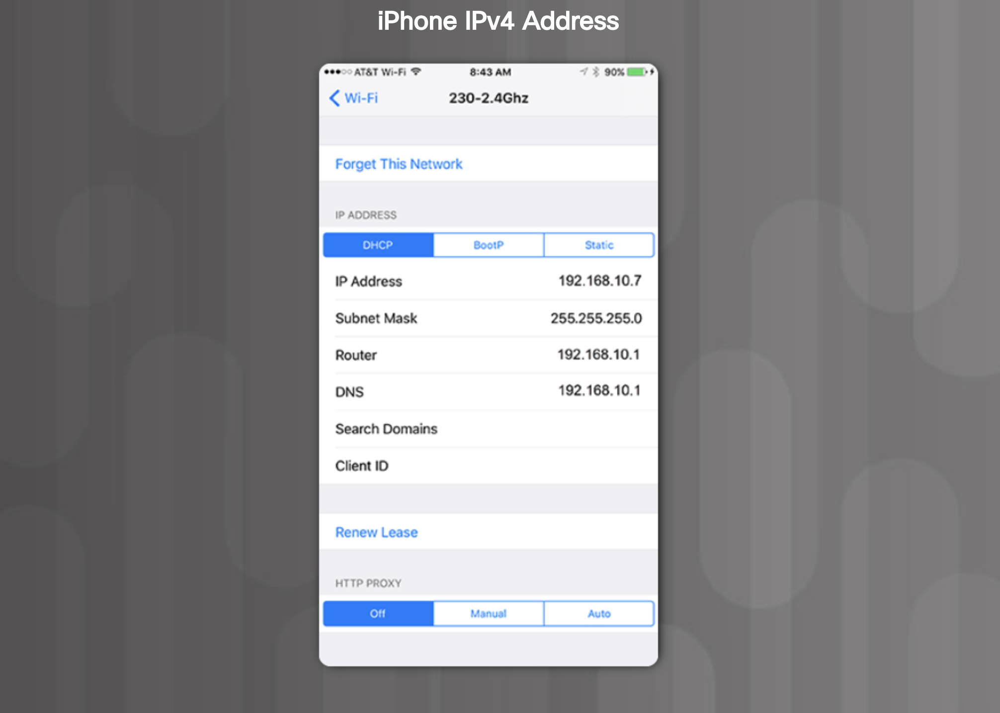

Figure 4 shows the IPv4 configuration for an Xbox One gaming console. 

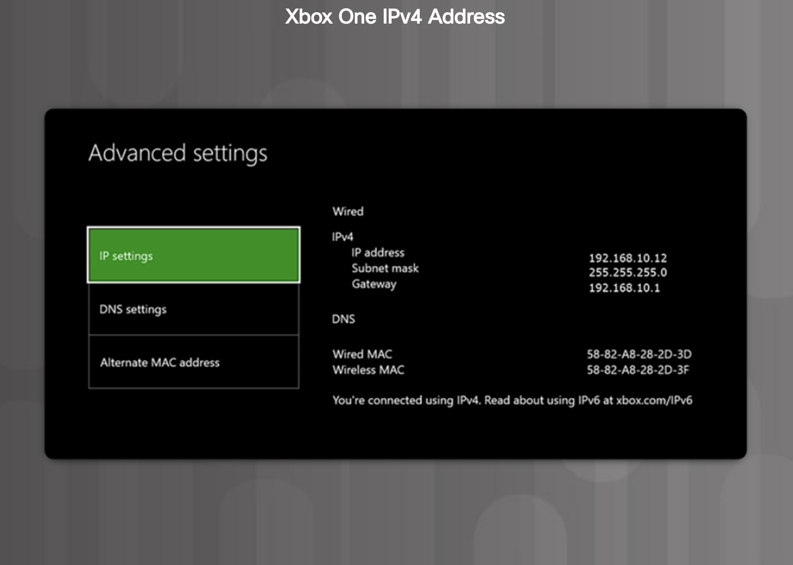

Notice that all three devices share the same network address portion, 192.168.10 and that each device has a unique host portion, .10, .7, and .12, respectively.

But how do hosts know which portion of the 32-bits identifies the network and which identifies the host? That is the job of the subnet mask.

Figure 1 shows the dotted decimal IPv4 address 192.168.10.10 and the binary values for the octets below it. The I P addresses is divided into the network portion and the host portion with the first three octets in the network portion and the fourth octet in the host portion. Figure 2 shows a CLI with the output of the ipconfig command. Figure 3 shows the I P v 4 address on an I phone. Figure 4 shows the Advanced I P Settings for an X box 1.

#### IPv4 Subnet Mask and Network Address

The subnet mask is logically ANDed with the host address to determine the network address. Logical AND is the comparison of two bits that produce the results shown in Figure 1. Note how only a 1 AND 1 produces a 1.

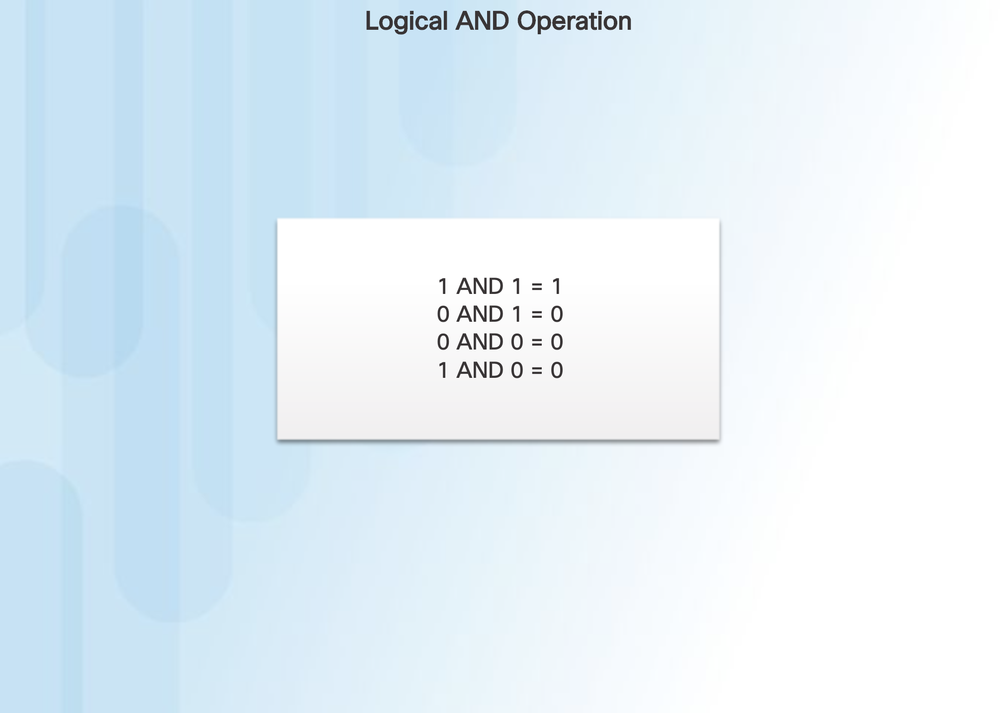

To identify the network address of an IPv4 host, the IPv4 address is logically ANDed, bit by bit, with the subnet mask. ANDing between the address and the subnet mask yields the network address.

To illustrate how AND is used to discover a network address, consider a host with IPv4 address 192.168.10.10 and subnet mask of 255.255.255.0. Figure 2 displays the host IPv4 address and converted binary address. 

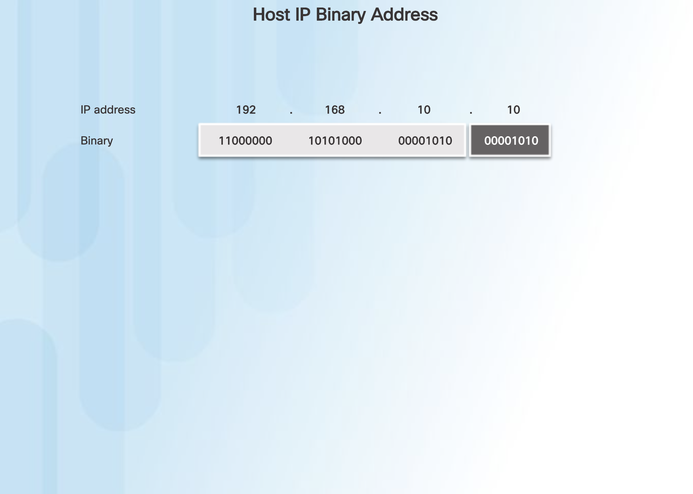

The host subnet mask binary address is added in Figure 3.

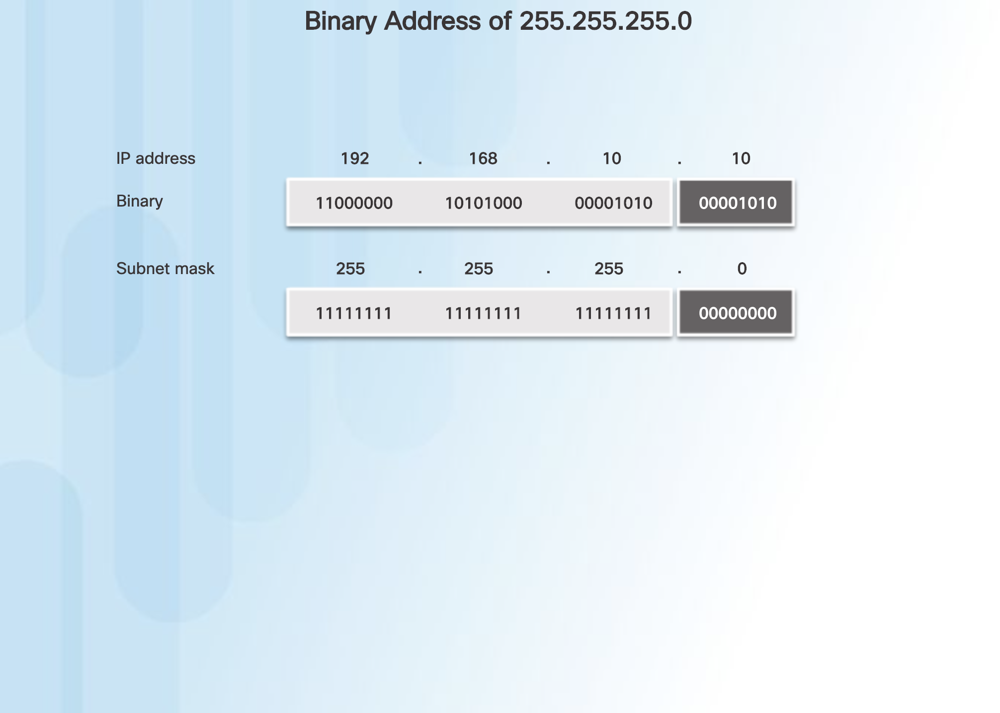

The yellow highlighted sections in Figure 4 identify the AND bits that produced a binary 1 in the AND Results row. All other bit comparisons produced binary 0s. Notice how the last octet no longer has any binary 1 bits.

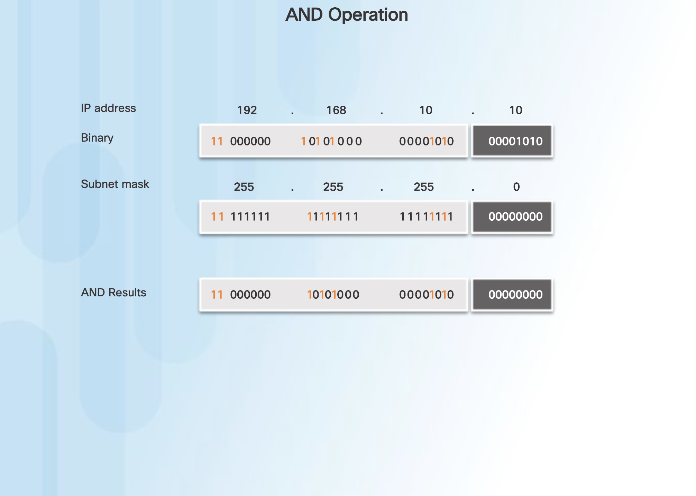

Finally, Figure 5 displays the resulting network address 192.168.10.0 255.255.255.0. Therefore, host 192.168.10.10 is on network 192.168.10.0 255.255.255.0.

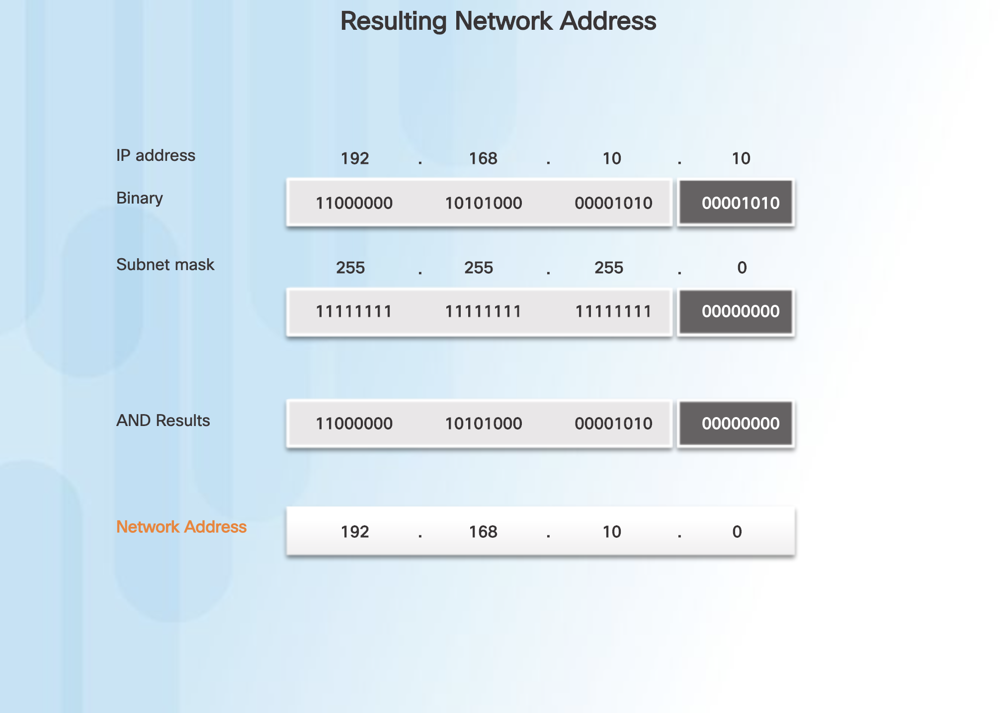

#### Subnetting Broadcast Domains

The 192.168.10.0/24 network can support 254 hosts. Larger networks, such as 172.16.0.0/16, can support many more host addresses (over 65,000). However, this can potentially create a larger broadcast domain. A problem with a large broadcast domain is that these hosts can generate excessive broadcasts and negatively affect the network. In Figure 1, LAN 1 connects 400 users that could each generate broadcast traffic. That much broadcast traffic can slow down network operations. It can also slow device operations because each device must accept and process each broadcast packet.

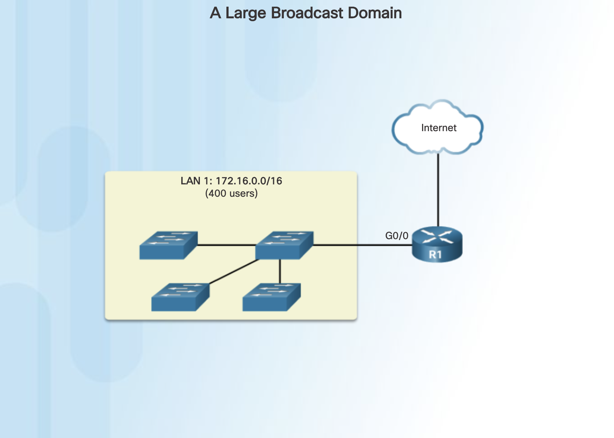

The solution is to reduce the size of the network to create smaller broadcast domains in a process called subnetting. These smaller network spaces are called subnets.

In Figure 2 for example, the 400 users in LAN 1 with network address 172.16.0.0 /16 have been divided into two subnets of 200 users each; 172.16.0.0 /24 and 172.16.1.0 /24. Broadcasts are only propagated within the smaller broadcast domains. Therefore a broadcast in LAN 1 would not propagate to LAN 2.

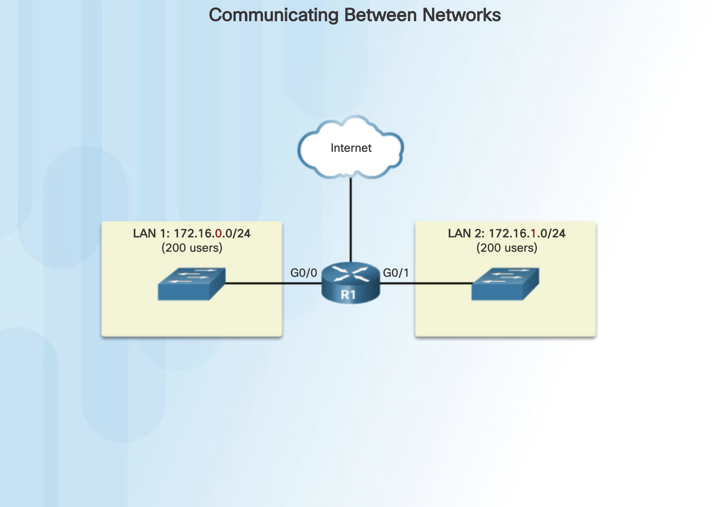

Notice how the prefix length has changed from a /16 to a /24. This is the basis of subnetting; using host bits to create additional subnets.

Note: The terms subnet and network are often used interchangeably. Most networks are a subnet of some larger address block.

Subnetting reduces overall network traffic and improves network performance. It also enables an administrator to implement security policies such as which subnets are allowed or not allowed to communicate together.

There are various ways of using subnets to help manage network devices. Network administrators can group devices and services into subnets that may be determined by a variety of factors:

- Location, such as floors in a building (Figure 3)

- Organizational unit (Figure 4)

- Device type (Figure 5)

- Any other division that makes sense for the network

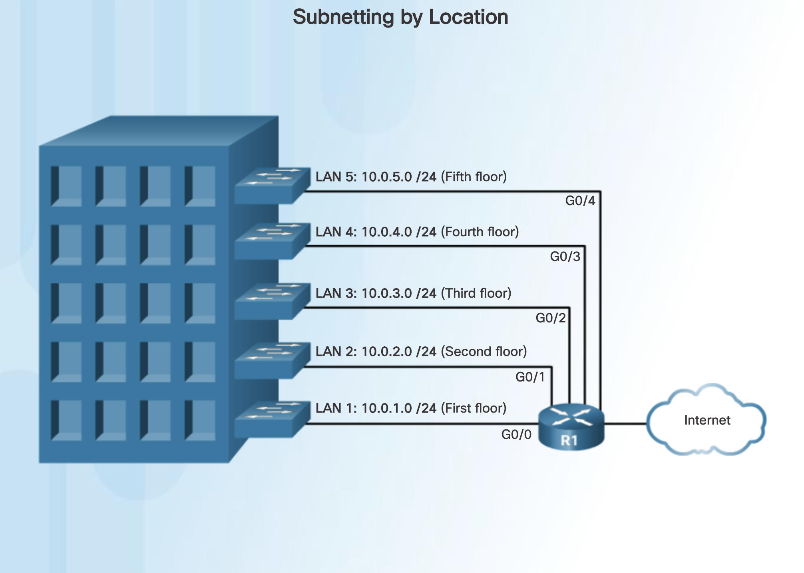

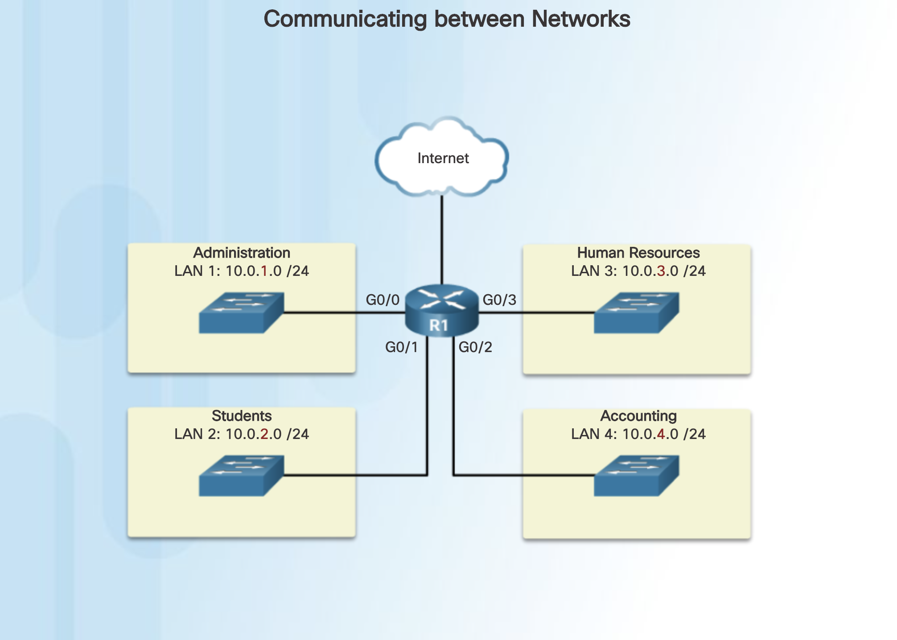

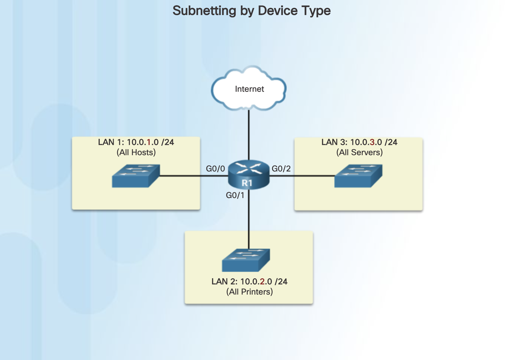

A cybersecurity analyst does not need to know how to subnet. However, it is important to know the meaning of the subnet mask and that hosts with addresses on different subnets come from different places in a network.

#### 4.2.3.5 Video Demonstration - Network, Host, and Broadcast Addresses

Siehe `Chapter 4 Network Protocols and Services/vid/4_2_3_5 Addresses CCNA Cybersecurity Operations.m4v`

### 4.2.4 Types of IPv4 Addresses

#### 4.2.4.1 IPv4 Address Classes and Default Subnet Masks

There are various types and classes of IPv4 addresses. While address classes are becoming less important in networking, they are still used and referred to commonly in network documentation.

**Address Classes**

In 1981, IPv4 addresses were assigned using classful addressing as defined in RFC 790. Customers were allocated a network address based on one of three classes, A, B, or C. The RFC divided the unicast ranges into specific classes:

- **Class A** (0.0.0.0/8 to 127.0.0.0/8) – Designed to support extremely large networks with more than 16 million host addresses. It used a fixed /8 prefix with the first octet to indicate the network address and the remaining three octets for host addresses.

- **Class B** (128.0.0.0 /16 – 191.255.0.0 /16) – Designed to support the needs of moderate to large size networks with up to approximately 65,000 host addresses. It used a fixed /16 prefix with the two high-order octets to indicate the network address and the remaining two octets for host addresses.

- **Class C** (192.0.0.0 /24 – 223.255.255.0 /24) – Designed to support small networks with a maximum of 254 hosts. It used a fixed /24 prefix with the first three octets to indicate the network and the remaining octet for the host addresses.

**Note:** There is also a Class D multicast block consisting of 224.0.0.0 to 239.0.0.0 and a Class E experimental address block consisting of 240.0.0.0 – 255.0.0.0.

As shown in the figure, the classful system allocated 50% of the available IPv4 addresses to 128 Class A networks, 25% of the addresses to Class B and then Class C shared the remaining 25% with Class D and E. Although appropriate at the time, as the Internet grew it was obvious that this method was wasting addresses and depleting the number of available IPv4 network addresses.

Classful addressing was abandoned in the late 1990s for the newer and current classless addressing system. However, as we will see later in this section, classless addressing was only a temporary solution to the depletion of IPv4 addresses.

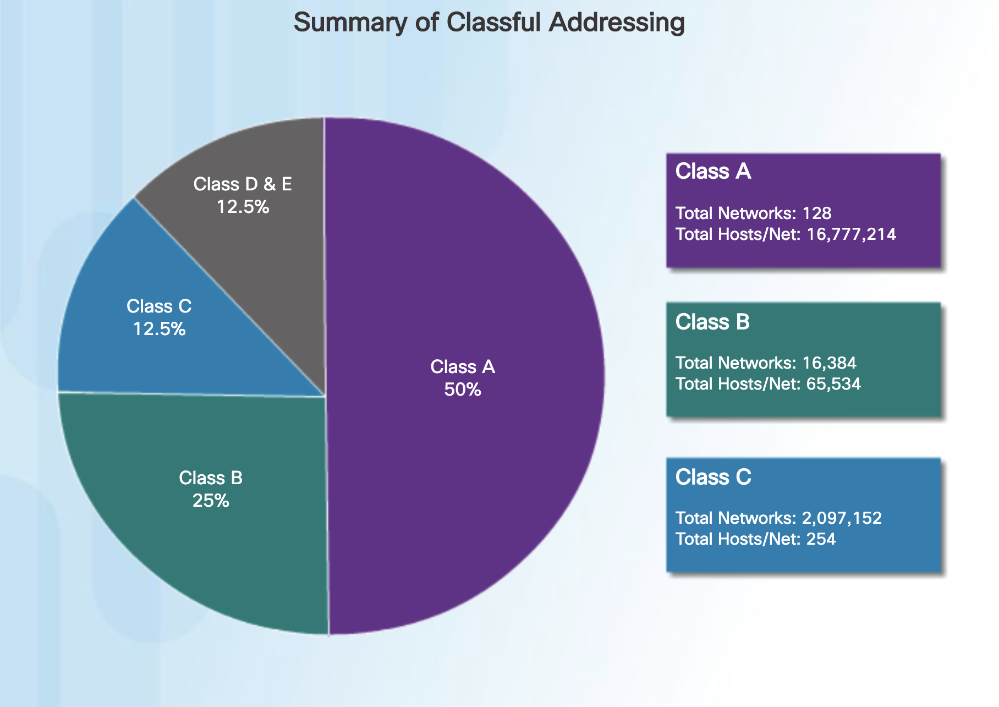

#### 4.2.4.2 Reserved Private Addresses

Public IPv4 addresses are addresses which are globally routed between ISP routers. However, not all available IPv4 addresses can be used on the Internet. There are blocks of addresses called private addresses that are used by most organizations to assign IPv4 addresses to internal hosts.

In the mid-1990s, private IPv4 addresses were introduced because of the depletion of IPv4 address space. Private IPv4 addresses are not unique and can be used by any internal network.

These are the private address blocks:

- 10.0.0.0 /8 or 10.0.0.0 to 10.255.255.255

- 172.16.0.0 /12 or 172.16.0.0 to 172.31.255.255

- 192.168.0.0 /16 or 192.168.0.0 to 192.168.255.255

It is important to know that addresses within these address blocks are not allowed on the Internet and must be filtered (discarded) by Internet routers. For example, as shown in the figure, users in networks 1, 2, or 3 are sending packets to remote destinations. The ISP routers would see that the source IPv4 addresses in the packets are from private addresses and would, therefore, discard the packets.

Most organizations use private IPv4 addresses for their internal hosts. However, these RFC 1918 addresses are not routable on the Internet and must be translated to a public IPv4 addresses. Network Address Translation (NAT) is used to translate between private IPv4 and public IPv4 addresses. This is usually done on the router that connects the internal network to the ISP's network.

Home routers provide the same capability. For instance, most home routers assign IPv4 addresses to their wired and wireless hosts from the private address of 192.168.1.0 /24. The home router interface that connects to the Internet service provider (ISP) network is often assigned a public IPv4 address to use on the Internet.

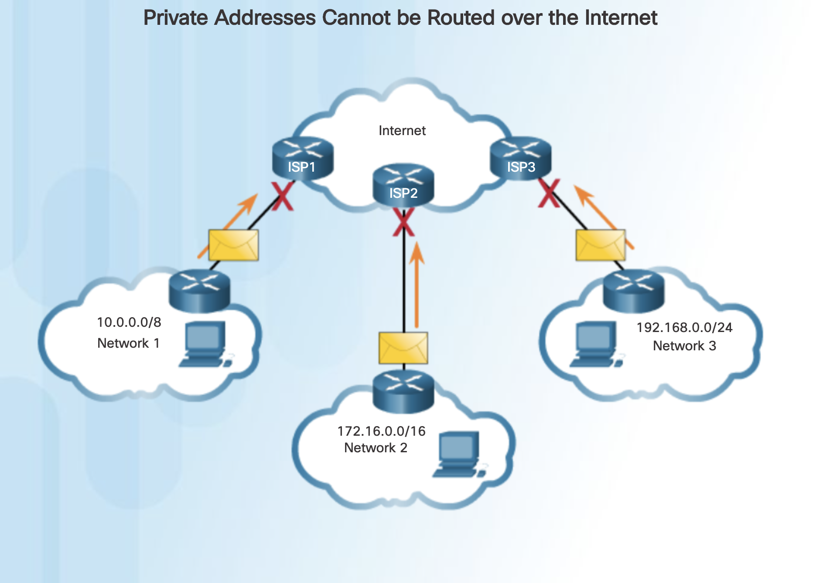

### 4.2.5 The Default Gateway

#### 4.2.5.1 Host Forwarding Decision

A host can send a packet to three types of destinations:

- **Itself** - A host can ping itself by sending a packet to a special IPv4 address of 127.0.0.1, which is referred to as the loopback interface. Pinging the loopback interface tests the TCP/IP protocol stack on the host.

- **Local host** - This is a host on the same local network as the sending host (from PC1 to PC2 in the figure). The hosts share the same network address.

- **Remote host** - This is a host on a remote network. The hosts do not share the same network address. Notice that R1, a router, is in between PC1 and the remote host. R1 is the default gateway for PC1 and PC2. R1’s job is to route any traffic destined for remote networks.

As we have seen, the subnet mask is used to determine to which network an IPv4 host address belongs. Whether a packet is destined for a local host or a remote host is determined by the IP address and subnet mask combination of the source device compared to the IP address and subnet mask combination of the destination device. In the figure, PC 1 knows it is on the 192 . 168 . 10 . 0 / 24 network. Therefore it knows that PC 2 is also on the same network and that the server, Remote Host, is not on the same network. When a source device sends a packet to a remote host, then the help of routers and routing is needed. Routing is the process of identifying the best path to a destination. The router connected to the local network segment is referred to as the default gateway.

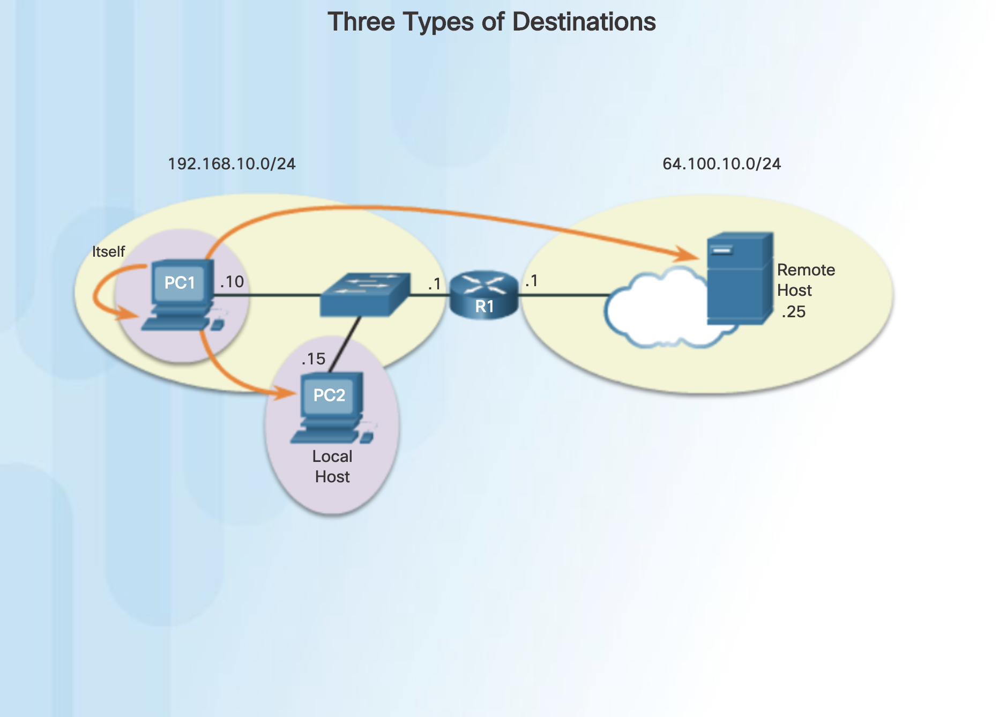

#### 4.2.5.2 Default Gateway

As shown in the figure, three dotted decimal IPv4 addresses must be configured when assigning an IPv4 configuration to host:

- **IPv4 address** – Unique IPv4 address of the host

- **Subnet mask** - Used to identify the network/host portion of the IPv4 address

- **Default gateway** – Identifies the local gateway (i.e. local router interface IPv4 address) to reach remote networks

The default gateway is the network device that can route traffic to other networks. It is the router that can route traffic out of the local network.

If you use the analogy that a network is like a room, then the default gateway is like a doorway. If you want to get to another room or network you need to find the doorway.

Alternatively, a PC or computer that does not know the IP address of the default gateway is like a person, in a room, that does not know where the doorway is. They can talk to other people in the room or network, but if they do not know the default gateway address, or there is no default gateway, then there is no way out.

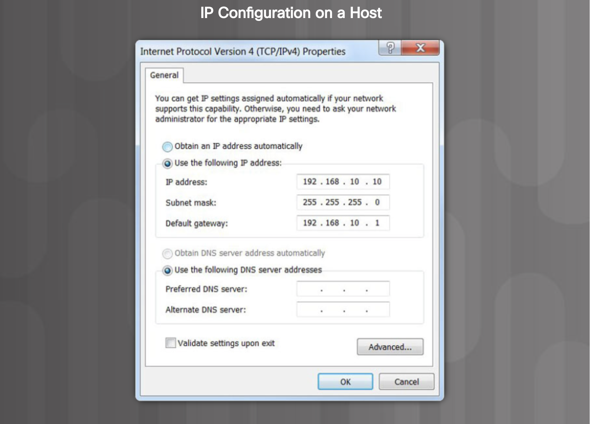

#### 4.2.5.3 Using the Default Gateway

A host's routing table will typically include a default gateway. The host receives the IPv4 address of the default gateway either dynamically from Dynamic Host Configuration Protocol (DHCP) or configured manually. In Figure 1, PC1 and PC2 are configured with the default gateway’s IPv4 address of 192.168.10.1. Having a default gateway configured creates a default route in the routing table of the PC. A default route is the route or pathway your computer will take when it tries to contact a remote network.

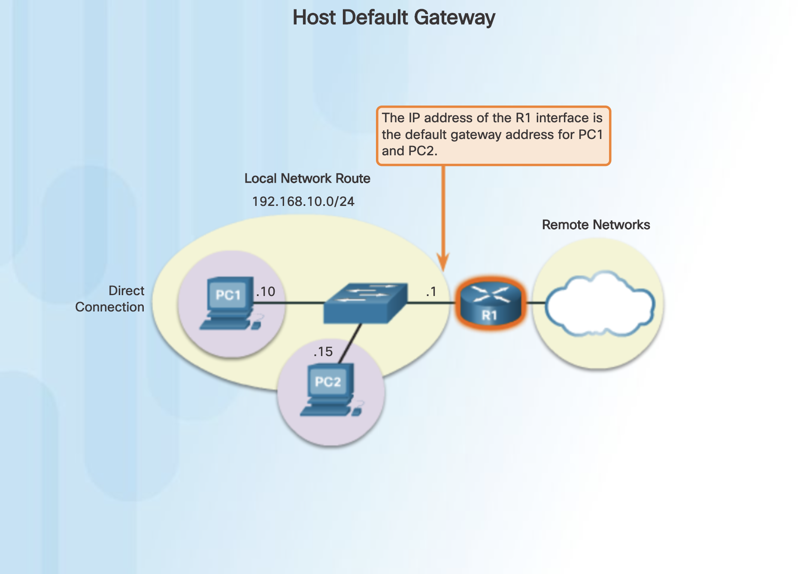

The default route is derived from the default gateway configuration and is placed in the host computer’s routing table. Both PC1 and PC2 will have a default route for sending all traffic destined to remote networks to R1.

You can view the routing table for a Windows host using either the **netstat -r** or **route print** command, as shown in Figure 2.

### 4.2.6 IPv6

#### 4.2.6.1 Need for IPv6

The depletion of IPv4 address space has been the motivating factor for moving to IPv6. As Africa, Asia and other areas of the world become more connected to the Internet, there are not enough IPv4 addresses to accommodate this growth. As shown in the figure, four out of the five Regional Internet Registries (RIRs) have run out of IPv4 addresses.

IPv4 has a theoretical maximum of 4.3 billion addresses. Private addresses in combination with Network Address Translation (NAT) have been instrumental in slowing the depletion of IPv4 address space. However, NAT breaks many applications and has limitations that severely impede peer-to-peer communications.

**Note**: NAT is discussed in more detail later in the chapter.

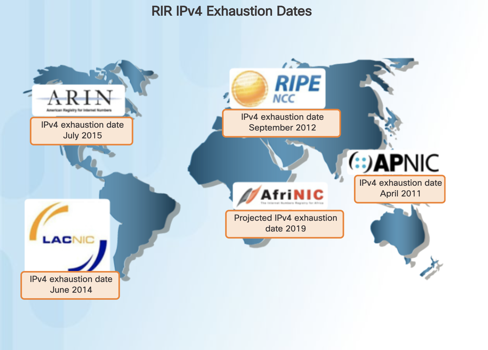

#### 4.2.6.2 IPv6 Size and Representation

IPv6 is designed to be the successor to IPv4. IPv6 has a 128-bit address space, providing for 340 undecillion addresses. (That is the number 340, followed by 36 zeroes.) However, IPv6 is more than just a bigger pool of addresses. When the Internet Engineering Task Force (IETF) began its development of a successor to IPv4, it used this opportunity to fix the limitations of IPv4 and include additional enhancements. One example is Internet Control Message Protocol version 6 (ICMPv6), which includes address resolution and address auto-configuration not found in ICMP for IPv4 (ICMPv4).

IPv6 addresses are written as a string of hexadecimal values. Every 4 bits is represented by a single hexadecimal digit; for a total of 32 hexadecimal values. IPv6 addresses are not case-sensitive and can be written in either lowercase or uppercase. 

As shown in the figure, the format for writing an IPv6 address is `x:x:x:x:x:x:x:x`, with each “x” consisting of four hexadecimal values. When referring to 8 bits of an IPv4 address we use the term octet. In IPv6, a hextet is the unofficial term used to refer to a segment of 16 bits or four hexadecimal values. Each “x” is a single hextet, 16 bits or four hexadecimal digits.

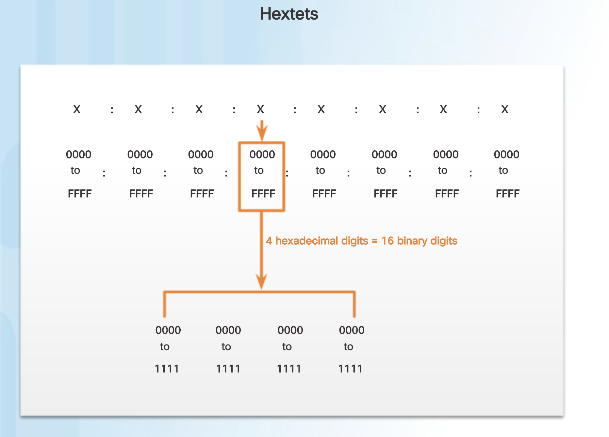

#### 4.2.6.3 IPv6 Address Formatting

It is no problem for computers to read the new 128-bit IPv6 addressing. IPv6 just adds more ones and zeros to the source and destination addresses in the packet. For humans, though, the change from a 32-bit address written in dotted decimal notation to an IPv6 address written as a series of 32 hexadecimal digits can be quite an adjustment. Techniques have been developed to compress the written IPv6 address into a more manageable format.

**Compressing IPv6 Addresses**

IPv6 addresses are written as a string of hexadecimal values. Every 4 bits is represented by a single hexadecimal digit for a total of 32 hexadecimal values. The figure shows a fully expanded IPv6 address and two methods of making it more easily readable. There are two rules that help reduce the number of digits needed to represent an IPv6 address.

**Rule 1 - Omit Leading Zeros**

The first rule to help reduce the notation of IPv6 addresses is to omit any leading 0s (zeros) in any 16-bit section. For example:

- 0DB8 can be represented as DB8

- 0000 can be represented as 0

- 0200 can be represented as 200

**Rule 2 – Omit One “all zeros” Segment**

The second rule to help reduce the notation of IPv6 addresses is that a double colon (::) can replace any group of consecutive segments that contain only zeros. The double colon (::) can only be used once within an address, otherwise there would be more than one possible resulting address.

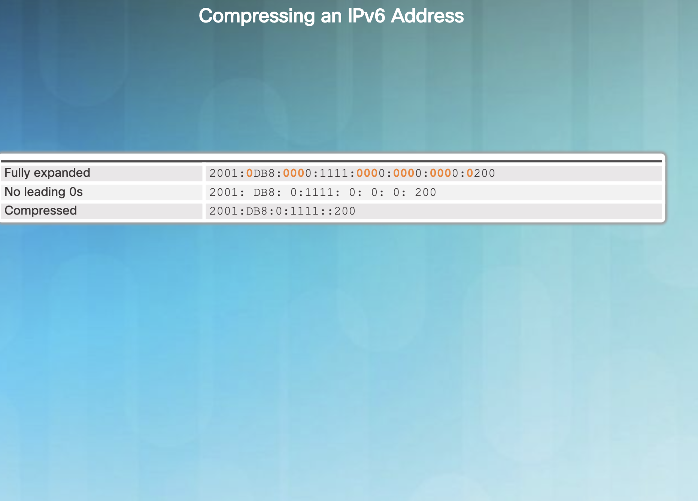

#### 4.2.6.4 IPv6 Prefix Length

Recall that the prefix, or network portion, of an IPv4 address, can be identified by a dotted-decimal subnet mask or prefix length (slash notation). For example, an IPv4 address of 192.168.1.10 with dotted-decimal subnet mask 255.255.255.0 is equivalent to 192.168.1.10/24.

IPv6 uses the prefix length to represent the prefix portion of the address. IPv6 does not use the dotted-decimal subnet mask notation. The prefix length is used to indicate the network portion of an IPv6 address using the IPv6 address/prefix length.

The prefix length can range from 0 to 128. A typical IPv6 prefix length for LANs and most other types of networks is /64, as shown in the figure. This means the prefix or network portion of the address is 64 bits in length, leaving another 64 bits for the interface ID (host portion) of the address.

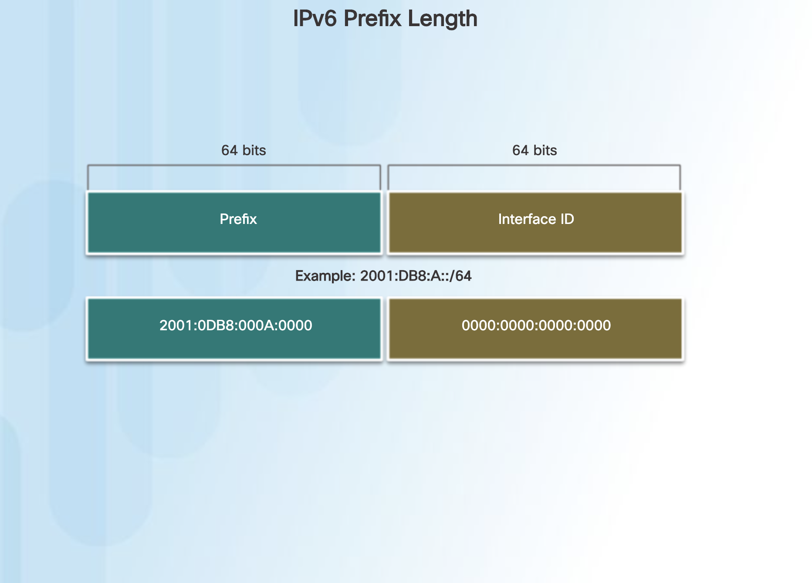

#### 4.2.6.5 Activity - IPv6 Address Notation

#### 4.2.6.6 Video Tutorial - Layer 2 and Layer 3 Addressing

Siehe `/Chapter 4 Network Protocols and Services/vid/4_2_6_6 Layer 2 and Layer 3 Addressing CCNA Cybersecurity Operations.mp4`

## 4.3 Connectivity Verification

### 4.3.1 ICMP

#### 4.3.1.1 ICMPv4 Messages

Although IP is only a best-effort protocol, the TCP/IP suite does provide for messages to be sent in the event of certain errors. These messages are sent using the services of ICMP. The purpose of these messages is to provide feedback about issues related to the processing of IP packets under certain conditions, not to make IP reliable. ICMP messages are not required and are often not allowed within a network for security reasons.

ICMP is available for both IPv4 and IPv6. ICMPv4 is the messaging protocol for IPv4. ICMPv6 provides these same services for IPv6 but includes additional functionality. In this course, the term ICMP will be used when referring to both ICMPv4 and ICMPv6.

The types of ICMP messages and the reasons why they are sent, are extensive. We will discuss some of the more common messages.

ICMP messages common to both ICMPv4 and ICMPv6 include:

- Host confirmation

- Destination or Service Unreachable

- Time exceeded

- Route redirection

**Host Confirmation**

An ICMP Echo Message can be used to determine if a host is operational. The local host sends an ICMP Echo Request to a host. If the host is available, the destination host responds with an Echo Reply. Click Play in the figure to see an animation of the ICMP Echo Request/Echo Reply. This use of the ICMP Echo messages is the basis of the ping utility.

**Destination or Service Unreachable**

When a host or gateway receives a packet that it cannot deliver, it can use an ICMP Destination Unreachable message to notify the source that the destination or service is unreachable. The message will include a code that indicates why the packet could not be delivered.

These are some of the Destination Unreachable codes for ICMPv4:

- **0** - Net unreachable

- **1** - Host unreachable

- **2** - Protocol unreachable

- **3** - Port unreachable

**Note**: ICMPv6 has similar but slightly different codes for Destination Unreachable messages.

**Time Exceeded**

An ICMPv4 Time Exceeded message is used by a router to indicate that a packet cannot be forwarded because the Time to Live (TTL) field of the packet was decremented to 0. If a router receives a packet and decrements the TTL field in the IPv4 packet to zero, it discards the packet and sends a Time Exceeded message to the source host.

ICMPv6 also sends a Time Exceeded message if the router cannot forward an IPv6 packet because the packet has expired. IPv6 does not have a TTL field; it uses the hop limit field to determine if the packet has expired.

#### 4.3.1.2 ICMPv6 RS and RA Messages

The informational and error messages found in ICMPv6 are very similar to the control and error messages implemented by ICMPv4. However, ICMPv6 has new features and improved functionality not found in ICMPv4. ICMPv6 messages are encapsulated in IPv6.

ICMPv6 includes four new protocols as part of the Neighbor Discovery Protocol (ND or NDP).

Messaging between an IPv6 router and an IPv6 device:

- Router Solicitation (RS) message

- Router Advertisement (RA) message

Messaging between IPv6 devices:

- Neighbor Solicitation (NS) message

- Neighbor Advertisement (NA) message

**Note**: ICMPv6 ND also includes the redirect message, which has a similar function to the redirect message used in ICMPv4.

Figure 1 shows an example of a PC and router exchanging Solicitation and Router Advertisement messages. Click each message for more information.

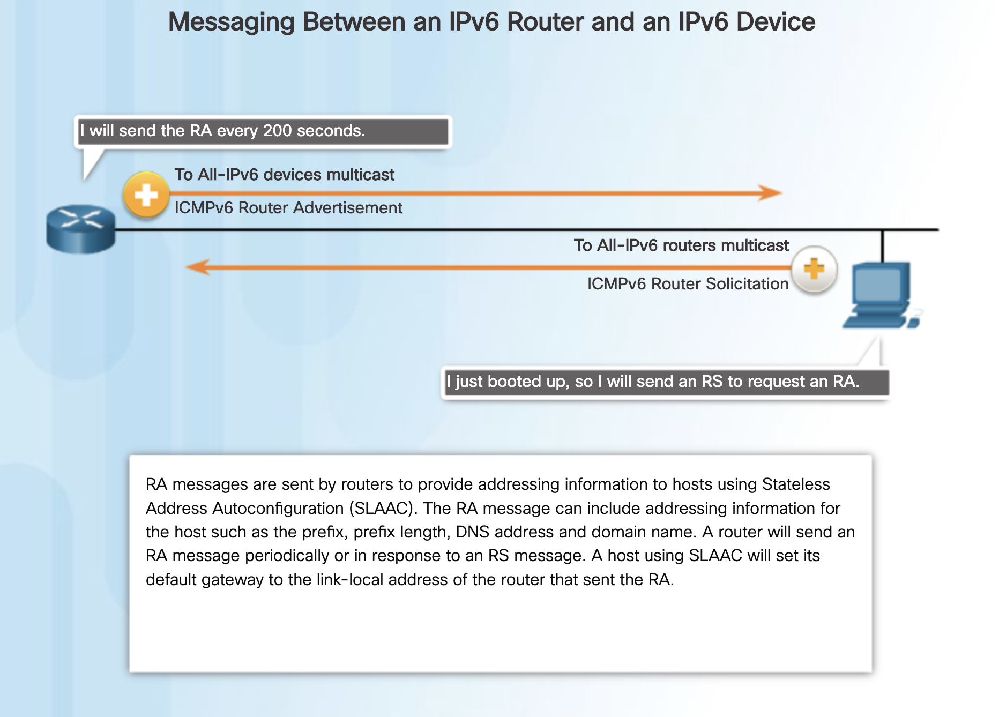

Neighbor Solicitation and Neighbor Advertisement messages are used for Address resolution and Duplicate Address Detection (DAD).

**Address Resolution**

Address resolution is used when a device on the LAN knows the IPv6 unicast address of a destination but does not know its Ethernet MAC address. To determine the MAC address for the destination, the device will send an NS message to the solicited node address. The message will include the known (targeted) IPv6 address. The device that has the targeted IPv6 address will respond with an NA message containing its Ethernet MAC address. Figure 2 shows two PCs exchanging NS and NA messages. Click each message for more information.

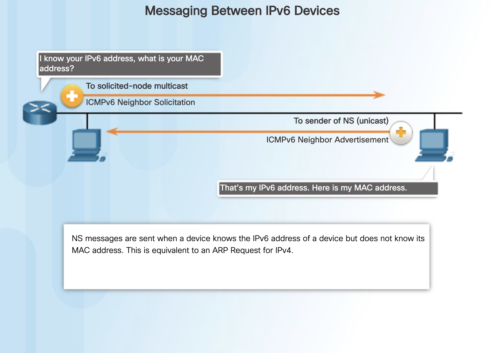

**Duplicate Address Detection**

When a device is assigned a global unicast or link-local unicast address, it is recommended that DAD is performed on the address to ensure that it is unique. To check the uniqueness of an address, the device will send an NS message with its own IPv6 address as the targeted IPv6 address, shown in Figure 3. If another device on the network has this address, it will respond with an NA message. This NA message will notify the sending device that the address is in use. If a corresponding NA message is not returned within a certain period of time, the unicast address is unique and acceptable for use.

**Note**: DAD is not required, but RFC 4861 recommends that DAD is performed on unicast addresses.

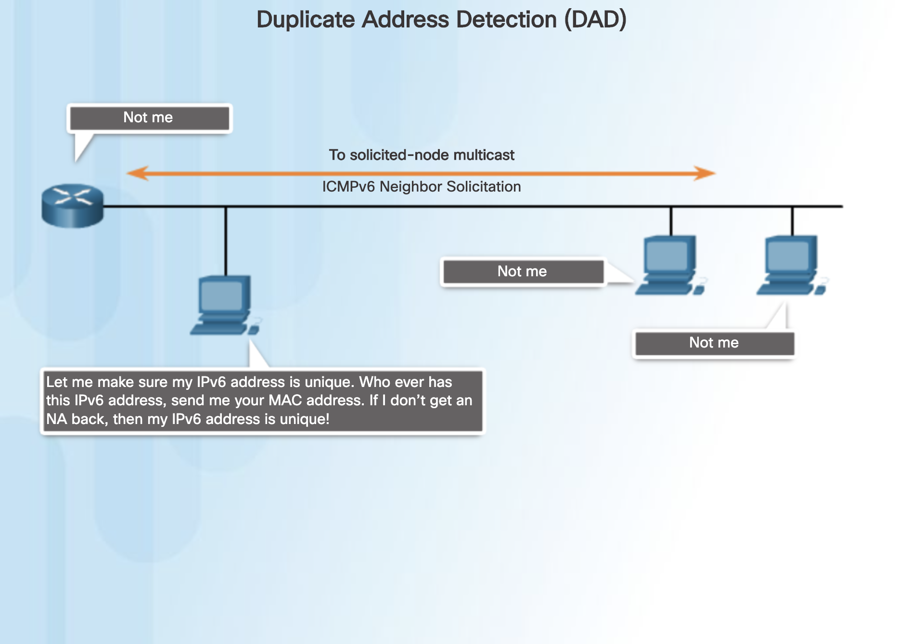

### 4.3.2 Ping and Traceroute Utilities

#### 4.3.2.1 Ping - Testing the Local Stack

Ping is a testing utility that uses ICMP echo request and echo reply messages to test connectivity between hosts. Ping works with both IPv4 and IPv6 hosts.

To test connectivity to another host on a network, an echo request is sent to the host address using the ping command. If the host at the specified address receives the echo request, it responds with an echo reply. As each echo reply is received, ping provides feedback on the time between when the request was sent and when the reply was received. This can be a measure of network performance.

Ping has a timeout value for the reply. If a reply is not received within the timeout, ping provides a message indicating that a response was not received. This usually indicates that there is a problem, but could also indicate that security features blocking ping messages have been enabled on the network.

After all the requests are sent, the ping utility provides a summary that includes the success rate and average round-trip time to the destination.

**Pinging the Local Loopback**

There are some special testing and verification cases for which we can use ping. One case is for testing the internal configuration of IPv4 or IPv6 on the local host. To perform this test, we ping the local loopback address of 127.0.0.1 for IPv4 (::1 for IPv6). Testing the IPv4 loopback is shown in the figure.

A response from 127.0.0.1 for IPv4, or ::1 for IPv6, indicates that IP is properly installed on the host. This response comes from the network layer. This response is not, however, an indication that the addresses, masks, or gateways are properly configured. Nor does it indicate anything about the status of the lower layer of the network stack. This simply tests IP down through the network layer of IP. An error message indicates that TCP/IP is not operational on the host.

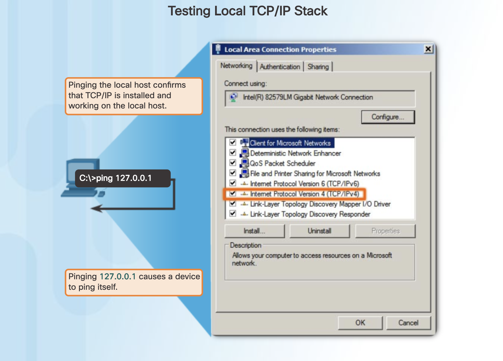

#### 4.3.2.2 Ping - Testing Connectivity to the Local LAN

You can also use ping to test the ability of a host to communicate on the local network. This is generally done by pinging the IP address of the gateway of the host. A ping to the gateway indicates that the host and the router interface serving as the gateway are both operational on the local network.

For this test, the gateway address is most often used because the router is normally always operational. If the gateway address does not respond, a ping can be sent to the IP address of another host on the local network that is known to be operational.

If either the gateway or another host responds, then the local host can successfully communicate over the local network. If the gateway does not respond but another host does, this could indicate a problem with the router interface serving as the gateway.

One possibility is that the wrong gateway address has been configured on the host. Another possibility is that the router interface may be fully operational but have security applied to it that prevents it from processing or responding to ping requests.

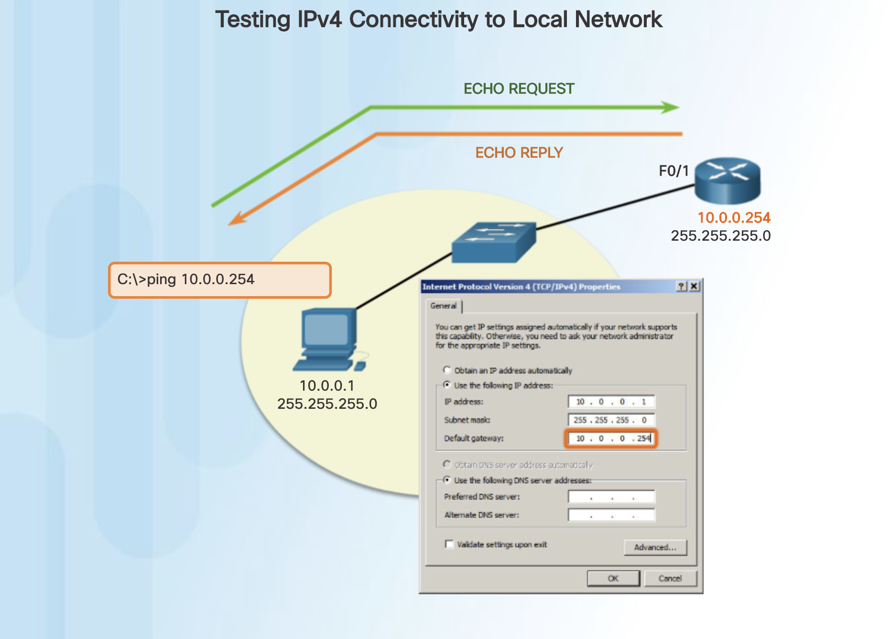

#### 4.3.2.3 Ping - Testing Connectivity to Remote Host

Ping can also be used to test the ability of a local host to communicate across an internetwork. The local host can ping an operational IPv4 host of a remote network, as shown in the figure.

If this ping is successful, the operation of a large piece of the internetwork can be verified. A successful ping across the internetwork confirms communication on the local network. It also confirms the operation of the router serving as the gateway, and the operation of all other routers that might be in the path between the local network and the network of the remote host.

Additionally, the functionality of the remote host can be verified. If the remote host could not communicate outside of its local network, it would not have responded.

**Note**: For security reasons, many network administrators limit or prohibit the entry of ICMP messages into the corporate network; therefore, the lack of a ping response could be due to security restrictions.

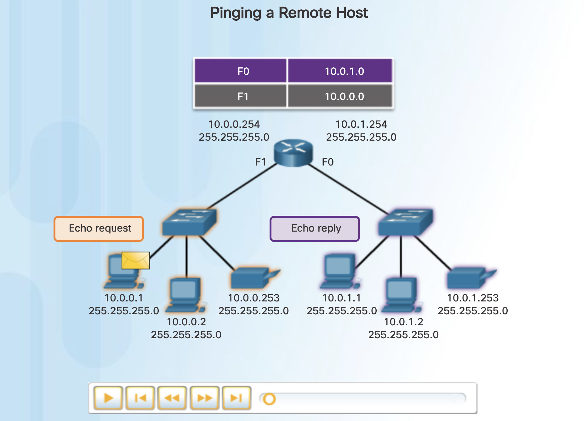

#### 4.3.2.4 Traceroute - Testing the Path

Ping is used to test connectivity between two hosts but does not provide information about the details of devices between the hosts. Traceroute (tracert) is a utility that generates a list of hops that were successfully reached along the path. This list can provide important verification and troubleshooting information. If the data reaches the destination, then the trace lists the interface of every router in the path between the hosts. If the data fails at some hop along the way, the address of the last router that responded to the trace can provide an indication of where the problem is, or where security restrictions are found.

**Round Trip Time (RTT)**

Using traceroute provides round trip time for each hop along the path and indicates if a hop fails to respond. The round trip time is the time a packet takes to reach the remote host and for the response from the host to return. An asterisk (*) is used to indicate a lost or unacknowledged packet.

This information can be used to locate a problematic router in the path. If the display shows high response times or data losses from a particular hop, this is an indication that the resources of the router or its connections may be overloaded.

**IPv4 TTL and IPv6 Hop Limit**

Traceroute makes use of a function of the TTL field in IPv4 and the Hop Limit field in IPv6 in the Layer 3 headers, along with the ICMP time exceeded message.

Click Play in the figure to see an animation of how Traceroute takes advantage of TTL.

The first sequence of messages sent from traceroute will have a TTL field value of 1. This causes the TTL to time out the IPv4 packet at the first router. This router then responds with an ICMPv4 message. Traceroute now has the address of the first hop.

Traceroute then progressively increments the TTL field (2, 3, 4...) for each sequence of messages. This provides the trace with the address of each hop as the packets timeout further down the path. The TTL field continues to be increased until the destination is reached, or it is incremented to a predefined maximum.

After the final destination is reached, the host responds with either an ICMP port unreachable message or an ICMP echo reply message instead of the ICMP time exceeded message.

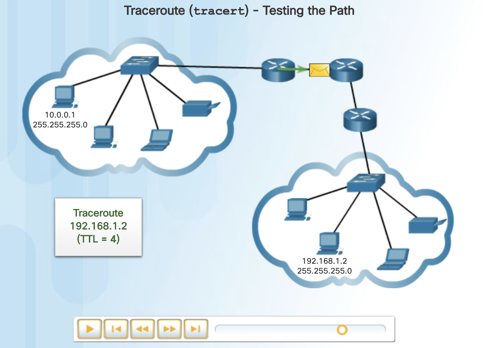

#### 4.3.2.5 ICMP Packet Format

ICMP is encapsulated directly into IP packets. In this sense, it is almost like a transport layer protocol, because it is encapsulated into a packet, however it is considered to be a Layer 3 protocol. ICMP acts as a data payload within the IP packet. It has a special header data field, as shown in the figure.

ICMP uses message codes to differentiate between different types of ICMP messages. These are some common message codes:

- **0** – Echo reply (response to a ping)

- **3** – Destination Unreachable

- **5** – Redirect (use another route to your destination)

- **8** – Echo request (for ping)

- **11** – Time Exceeded (TTL became 0)

As you will see later in the course, a cybersecurity analyst knows that the optional ICMP payload field can be used in an attack vector to exfiltrate data.

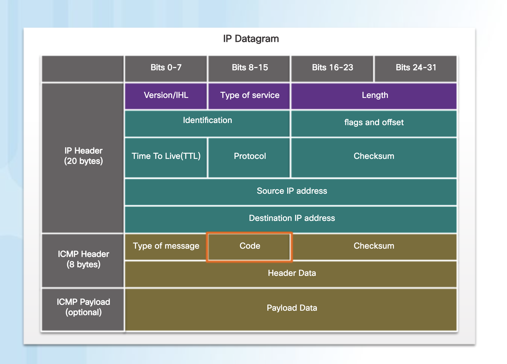

## 4.4 Address Resolution Protocol

### 4.4.1 MAC and IP

#### 4.4.1.1 Destination on Same Network

There are two primary addresses assigned to a device on an Ethernet LAN:

- **Physical address (the MAC address)** – This is used for Ethernet NIC to Ethernet NIC communications on the same network.

- **Logical address (the IP address)** – This is used to send the packet from the original source to the final destination.

IP addresses are used to identify the address of the original source device and the final destination device. The destination IP address may be on the same IP network as the source or may be on a remote network.

**Note**: Most applications use DNS (Domain Name System) to determine the IP address when given a domain name such as www.cisco.com. DNS is discussed in a later chapter.

Layer 2 or physical addresses, like Ethernet MAC addresses, have a different purpose. These addresses are used to deliver the data link frame with the encapsulated IP packet from one NIC to another NIC on the same network. If the destination IP address is on the same network, the destination MAC address will be that of the destination device.

The figure shows the Ethernet MAC addresses and IP address for PC-A sending an IP packet to the file server on the same network.

The Layer 2 Ethernet frame contains:

- **Destination MAC address** – This is the MAC address of the file server’s Ethernet NIC.

- **Source MAC address** – This is the MAC address of PC-A’s Ethernet NIC.

The Layer 3 IP packet contains:

- **Source IP address** – This is the IP address of the original source, PC-A.

- **Destination IP address** – This is the IP address of the final destination, the file server.

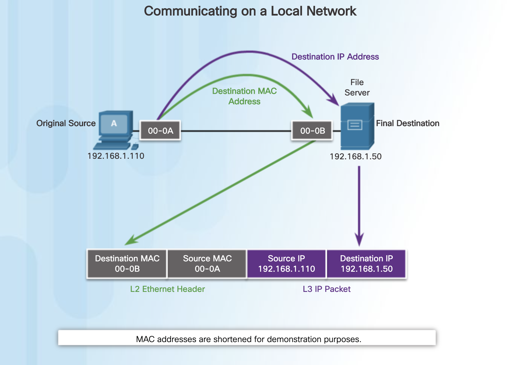

#### 4.4.1.2 Destination on Remote Network

When the destination IP address is on a remote network, the destination MAC address will be the address of the host’s default gateway, which is the router’s NIC, as shown in the figure. Using a postal analogy, this would be similar to a person taking a letter to their local post office. All they need to do is take the letter to the post office and then it becomes the responsibility of the post office to forward the letter on towards its final destination.

The figure shows the Ethernet MAC addresses and IPv4 addresses for PC-A sending an IP packet to a file server on a remote network. Routers examine the destination IPv4 address to determine the best path to forward the IPv4 packet. This is similar to how the postal service forwards mail based on the address of the recipient.

When the router receives the Ethernet frame, it de-encapsulates the Layer 2 information. Using the destination IP address, it determines the next-hop device, and then encapsulates the IP packet in a new data link frame for the outgoing interface. Along each link in a path, an IP packet is encapsulated in a frame specific to the particular data link technology associated with that link, such as Ethernet. If the next-hop device is the final destination, the destination MAC address will be that of the device’s Ethernet NIC.

How are the IPv4 addresses of the IPv4 packets in a data flow associated with the MAC addresses on each link along the path to the destination? This is done through a process called Address Resolution Protocol (ARP).

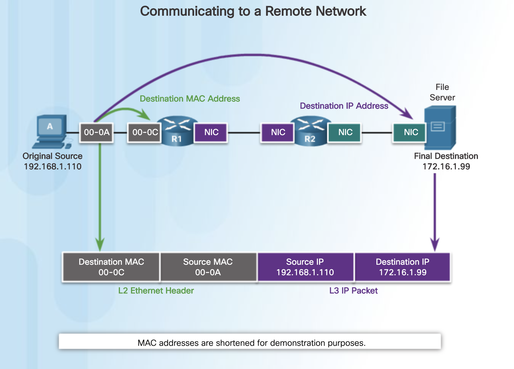

### 4.4.2 ARP

#### 4.4.2.1 Introduction to ARP

Recall that every device with an IP address on an Ethernet network also has an Ethernet MAC address. When a device sends an Ethernet frame, it contains these two addresses:

- **Destination MAC address** - The MAC address of the Ethernet NIC, which will be either the MAC address of the final destination device or the router.

- **Source MAC address** - The MAC address of the sender’s Ethernet NIC.

To determine the destination MAC address, the device uses ARP. ARP resolves IPv4 addresses to MAC addresses, and maintains a table of mappings.

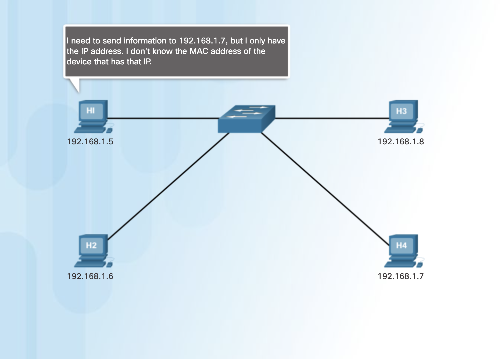

#### 4.4.2.2 ARP Functions

When a packet is sent to the data link layer to be encapsulated into an Ethernet frame, the device refers to a table in its memory to find the MAC address that is mapped to the IPv4 address. This table is called the ARP table or the ARP cache. The ARP table is stored in the RAM of the device.

The sending device will search its ARP table for a destination IPv4 address and a corresponding MAC address. If the packet’s destination IPv4 address is on the same network as the source IPv4 address, the device will search the ARP table for the destination IPv4 address. If the destination IPv4 address is on a different network than the source IPv4 address, the device will search the ARP table for the IPv4 address of the default gateway.

In both cases, the search is for an IPv4 address and a corresponding MAC address for the device.

Each entry, or row, of the ARP table binds an IPv4 address with a MAC address. We call the relationship between the two values a map. It simply means that you can locate an IPv4 address in the table and discover the corresponding MAC address. The ARP table temporarily saves (caches) the mapping for the devices on the LAN.

If the device locates the IPv4 address, its corresponding MAC address is used as the destination MAC address in the frame. If no entry is found, then the device sends an ARP request. Click Play in the figure to view an animation of the ARP request process.

Siehe `/Chapter 4 Network Protocols and Services/vid/4_2_6_6 Layer 2 and Layer 3 Addressing CCNA Cybersecurity Operations.mp4`

#### 4.4.2.3 Video - ARP Operation - ARP Request

An ARP request is sent when a device needs a MAC address associated with an IPv4 address, and it does not have an entry for the IPv4 address in its ARP table.

ARP messages are encapsulated directly within an Ethernet frame. There is no IPv4 header. The ARP request message includes:

- **Target IPv4 address** – This is the IPv4 address that requires a corresponding MAC address.

- **Target MAC address** - This is the unknown MAC address and will be empty in the ARP request message.

The ARP request is encapsulated in an Ethernet frame using the following header information:

- **Destination MAC address** – This is a broadcast address requiring all Ethernet NICs on the LAN to accept and process the ARP request.

- **Source MAC address** – This is the sender of the ARP request’s MAC address.

- **Type** - ARP messages have a type field of 0x806. This informs the receiving NIC that the data portion of the frame needs to be passed to the ARP process.

Because ARP requests are broadcasts, they are flooded out all ports by the switch except the receiving port. All Ethernet NICs on the LAN process broadcasts. Every device must process the ARP request to see if the target IPv4 address matches its own. A router will not forward broadcasts out other interfaces.

Only one device on the LAN will have an IPv4 address that matches the target IPv4 address in the ARP request. All other devices will not reply.

Click Play in the figure to view a demonstration of an ARP request for a destination IPv4 address that is on the local network.

Click [here](https://static-course-assets.s3.amazonaws.com/CyberOps11/en/course/files/4.4.2.3 Video Slides - ARP Operation - ARP Request.pdf) to download video slides from the demonstration.

Click [here](https://static-course-assets.s3.amazonaws.com/CyberOps11/en/course/files/4.4.2.3 Video - ARP Operation - ARP Request.pdf) to read the transcript of this video.

Siehe `/Chapter 4 Network Protocols and Services/vid/4_4_2_3 ARP Request CCNA Cybersecurity Operations.mp4`

#### 4.4.2.4 Video - ARP Operation - ARP Reply

Only the device with an IPv4 address associated with the target IPv4 address in the ARP request will respond with an ARP reply. The ARP reply message includes:

- **Sender’s IPv4 address** – This is the IPv4 address of the sender, the device whose MAC address was requested.

- **Sender’s MAC address** – This is the MAC address of the sender. It is the MAC address that was asked for in the original ARP request message.

The ARP reply is encapsulated in an Ethernet frame using the following header information:

- **Destination MAC address** – This is the MAC address of the original sender of the ARP request.

- **Source MAC address** – This is the ARP reply’s MAC address.

- **Type** - ARP messages have a type field of 0x806. This informs the receiving NIC that the data portion of the frame needs to be passed to the ARP process.

Only the device that originally sent the ARP request will receive the unicast ARP reply. After the ARP reply is received, the device will add the IPv4 address and the corresponding MAC address to its ARP table. Packets destined for that IPv4 address can now be encapsulated in frames using its corresponding MAC address.

Click Play in the figure to view a demonstration of an ARP reply.

Click [here](https://static-course-assets.s3.amazonaws.com/CyberOps11/en/course/files/4.4.2.4 Video Slides - ARP Operation - ARP Reply.pdf) to download video slides from the demonstration.

If no device responds to the ARP request, the packet is dropped because a frame cannot be created.

Entries in the ARP table are time stamped. If a device does not receive a frame from a particular device by the time the timestamp expires, the entry for this device is removed from the ARP table.

Additionally, static map entries can be entered in an ARP table, but this is rarely done. Static ARP table entries do not expire over time and must be manually removed.

**Note**: IPv6 uses a similar process to ARP. It is called ICMPv6 neighbor discovery. ICMPv6 uses neighbor solicitation and neighbor advertisement messages, similar to IPv4 ARP requests and ARP replies.

Click [here](https://static-course-assets.s3.amazonaws.com/CyberOps11/en/course/files/4.4.2.4 Video - ARP Operation - ARP Reply.pdf) to read the transcript of this video.

Siehe `/Chapter 4 Network Protocols and Services/vid/4_4_2_4 ARP Reply CCNA Cybersecurity Operations.mp4`

#### 4.4.2.5 Video - ARP Role in Remote Communication

When the destination IPv4 address is not on the same network as the source IPv4 address, the source device needs to send the frame to its default gateway. This is the interface of the local router. Whenever a source device has a packet with an IPv4 address on another network, it will encapsulate that packet in a frame using the destination MAC address of the router.

The IPv4 address of the default gateway address is stored in the IPv4 configuration of the hosts. When a host creates a packet for a destination, it compares the destination IPv4 address and its own IPv4 address to determine if the two IPv4 addresses are located on the same Layer 3 network. If the destination host is not on its same network, the source checks its ARP table for an entry with the IPv4 address of the default gateway. If there is not an entry, it uses the ARP process to determine a MAC address of the default gateway.

Click Play to view a demonstration of an ARP request and ARP reply associated with the default gateway.

Click [here](https://static-course-assets.s3.amazonaws.com/CyberOps11/en/course/files/4.4.2.5 Video Slides - ARP Role in Remote Communication.pdf) to download video slides from the demonstration.

Click [here](https://static-course-assets.s3.amazonaws.com/CyberOps11/en/course/files/4.4.2.5 Video - ARP Role in Remote Communication.pdf) to read the transcript of this video.

Siehe `/Chapter 4 Network Protocols and Services/vid/44_4_2_5 ARP Role CCNA Cybersecurity Operations.mp4`

#### 4.4.2.6 Removing Entries from an ARP Table

For each device, an ARP cache timer removes ARP entries that have not been used for a specified period of time. The times differ depending on the device’s operating system. For example, some Windows operating systems store ARP cache entries for 2 minutes, as shown in the figure.

Commands may also be used to manually remove all or some of the entries in the ARP table. After an entry has been removed, the process for sending an ARP request and receiving an ARP reply must occur again to enter the map in the ARP table.

For each device, an ARP cache timer removes ARP entries that have not been used for a specified period of time. The times differ depending on the device’s operating system. For example, some Windows operating systems store ARP cache entries for 2 minutes, as shown in the figure.

Commands may also be used to manually remove all or some of the entries in the ARP table. After an entry has been removed, the process for sending an ARP request and receiving an ARP reply must occur again to enter the map in the ARP table.

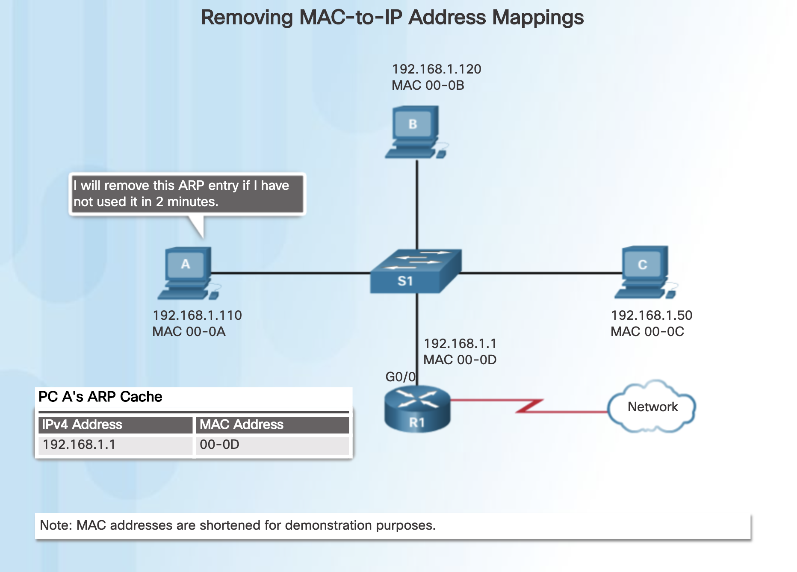

#### 4.4.2.7 ARP Tables on Networking Devices

Network hosts and routers keep ARP tables. ARP information is held in memory on these devices in what is commonly called the ARP cache. The table entries are held for a period of time until they “age out” and are automatically removed from the ARP cache. This ensures the accuracy of the mappings. Holding ARP tables in memory helps to improve network efficiency by decreasing ARP traffic.

The ARP table on a Windows PC can be displayed using the arp -a command, as shown in the figure.

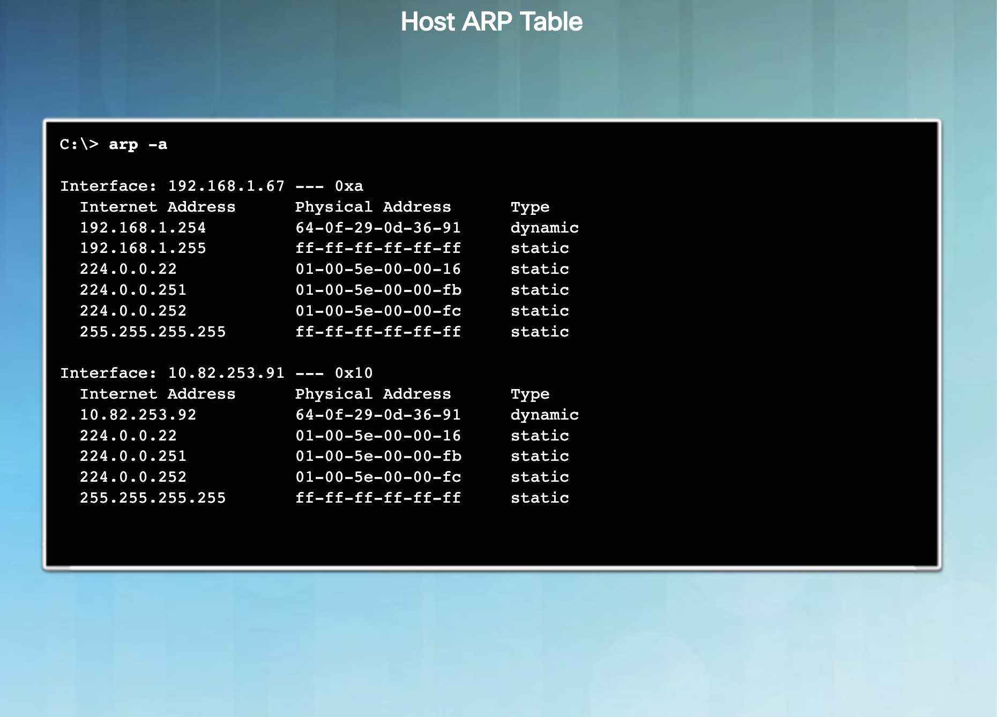

#### 4.4.2.8 Lab - Using Wireshark to Examine Ethernet Frames

In this lab, you will complete the following objectives:

- Part 1: Examine the Header Fields in an Ethernet II Frame

- Part 2: Use Wireshark to Capture and Analyze Ethernet Frames

[Lab - Using Wireshark to Examine Ethernet Frames](https://static-course-assets.s3.amazonaws.com/CyberOps11/en/course/files/4.4.2.8 Lab - Using Wireshark to Examine Ethernet Frames.pdf)

### 4.4.3 ARP Issues

#### 4.4.3.1 ARP Broadcasts

As a broadcast frame, an ARP request is received and processed by every device on the local network. On a typical business network, these broadcasts would probably have minimal impact on network performance. However, if a large number of devices were to be powered up and all start accessing network services at the same time, there could briefly be some reduction in performance, as shown in the figure. After the devices send out the initial ARP broadcasts and have learned the necessary MAC addresses, any impact on the network will be minimized.

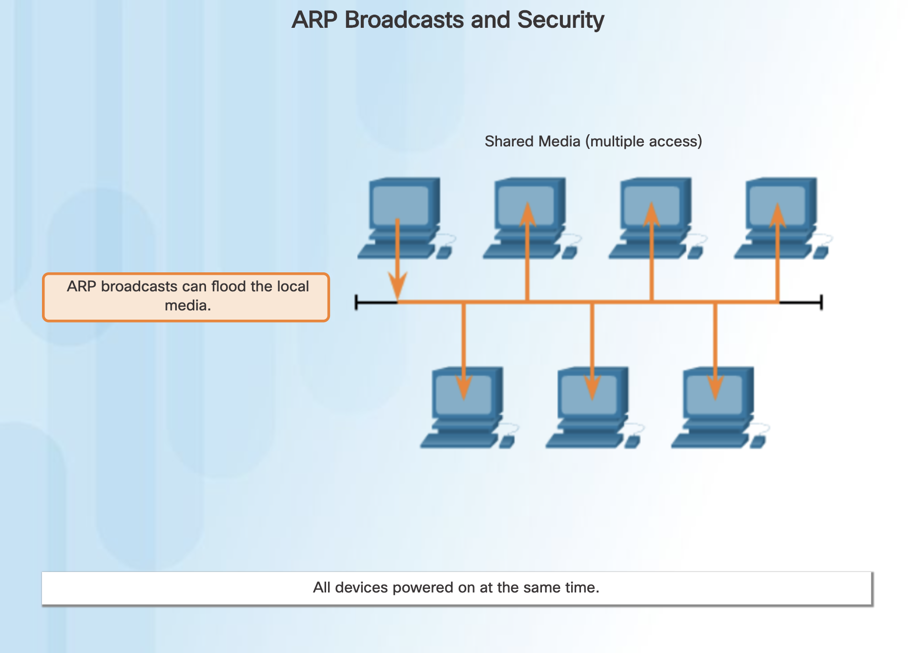

#### 4.4.3.2 ARP Spoofing

In some cases, the use of ARP can lead to a potential security risk known as ARP spoofing or ARP poisoning. This is a technique used by an attacker to reply to an ARP request for an IPv4 address belonging to another device, such as the default gateway, as shown in the figure. The attacker sends an ARP reply with its own MAC address. The receiver of the ARP reply will add the wrong MAC address to its ARP table and send these packets to the attacker.

ARP vulnerabilities will be discussed in more detail later in the course.

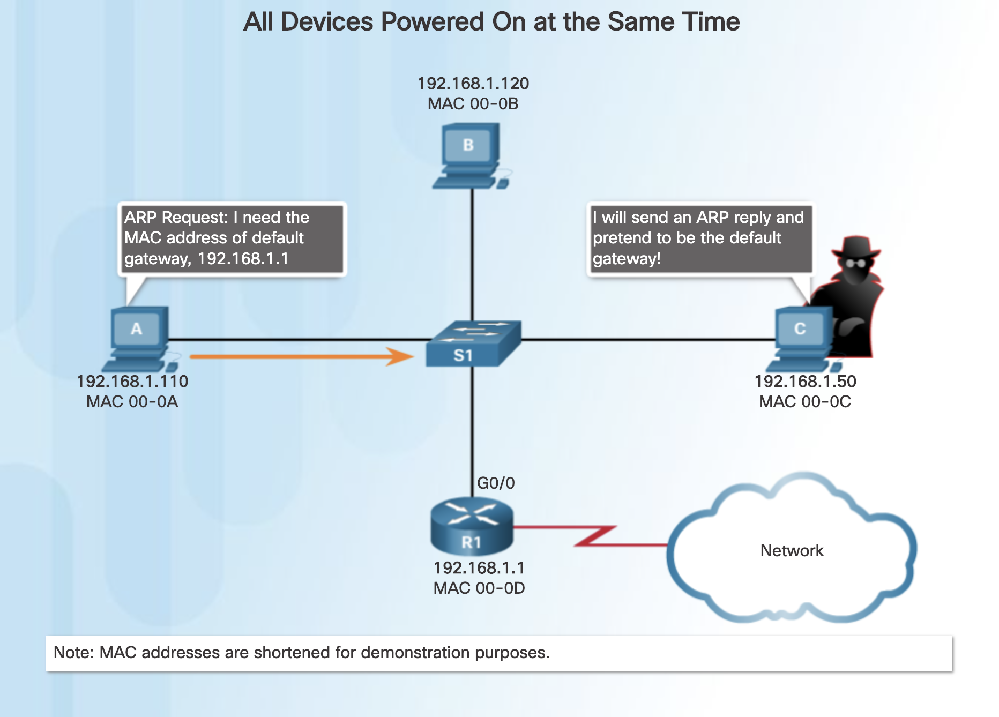

## 4.5 The Transport Layer

### 4.5.1 Transport Layer Characteristics

#### 4.5.1.1 Transport Layer Protocol Role in Network Communication

The transport layer is responsible for establishing a temporary communication session between two applications and delivering data between them. An application generates data that is sent from an application on a source host to an application on a destination host. This is without regard to the destination host type, the type of media over which the data must travel, the path taken by the data, the congestion on a link, or the size of the network. As shown in Figure 1, the transport layer is the link between the application layer and the lower layers that are responsible for network transmission.

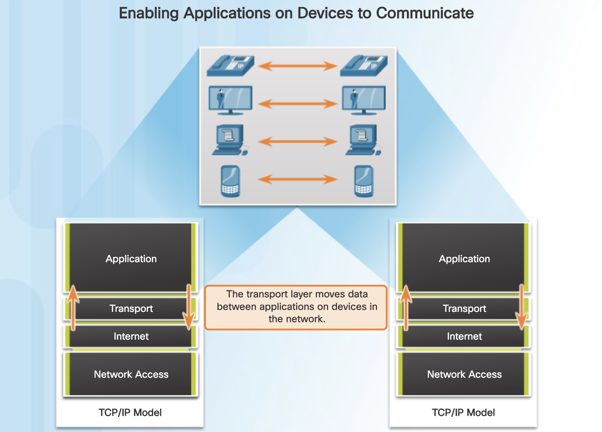

**Tracking Individual Conversations**

At the transport layer, each set of data flowing between a source application and a destination application is known as a conversation (Figure 2). A host may have multiple applications that are communicating across the network simultaneously. Each of these applications communicates with one or more applications on one or more remote hosts. It is the responsibility of the transport layer to maintain and track these multiple conversations.

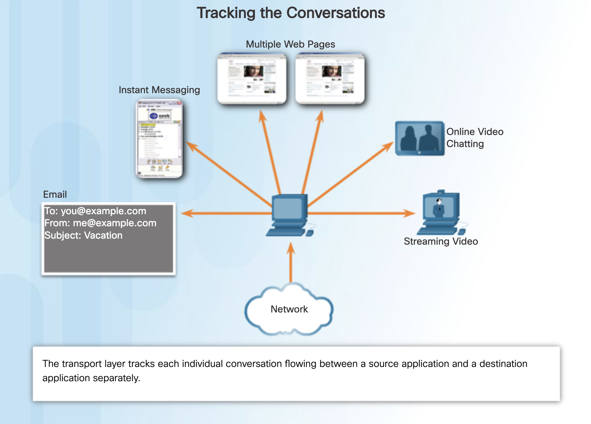

**Segmenting Data and Reassembling Segments**

Data must be prepared to be sent across the media in manageable pieces. Most networks have a limitation on the amount of data that can be included in a single packet. Transport layer protocols have services that segment the application data into blocks that are an appropriate size, as shown in Figure 3. This service includes the encapsulation required on each piece of data. A header, used for reassembly, is added to each block of data. This header is used to track the data stream.

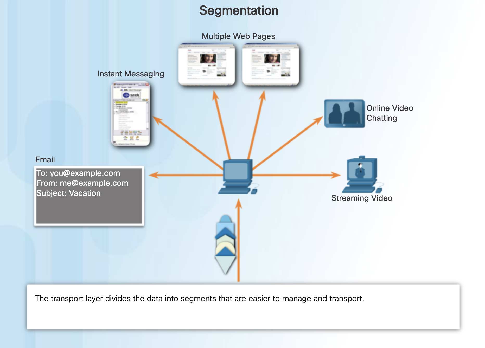

At the destination, the transport layer must be able to reconstruct the pieces of data into a complete data stream that is useful to the application layer. The protocols at the transport layer describe how the transport layer header information is used to reassemble the data pieces into streams to be passed to the application layer.

**Identifying the Applications**

To pass data streams to the proper applications, the transport layer must identify the target application (Figure 4). To accomplish this, the transport layer assigns each application an identifier called a port number. Each software process that needs to access the network is assigned a port number unique to that host.

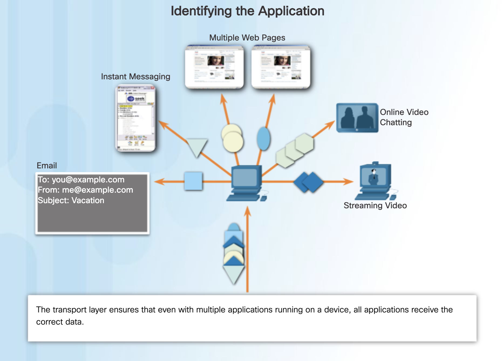

#### 4.5.1.2 Transport Layer Mechanisms

Sending some types of data (for example, a streaming video) across a network, as one complete communication stream, can consume all of the available bandwidth. This will then prevent other communications from occurring at the same time. It would also make error recovery and retransmission of damaged data difficult.

Figure 1 shows that segmenting the data into smaller chunks enables many different communications, from many different users, to be interleaved (multiplexed) on the same network.

To identify each segment of data, the transport layer adds a header containing binary data organized into several fields. It is the values in these fields that enable various transport layer protocols to perform different functions in managing data communication.

The transport layer is also responsible for managing reliability requirements of a conversation. Different applications have different transport reliability requirements.

IP is concerned only with the structure, addressing, and routing of packets. IP does not specify how the delivery or transportation of the packets takes place. Transport protocols specify how to transfer messages between hosts. TCP/IP provides two transport layer protocols, Transmission Control Protocol (TCP) and User Datagram Protocol (UDP), as shown in Figure 2. IP uses these transport protocols to enable hosts to communicate and transfer data.

TCP is considered a reliable, full-featured transport layer protocol, which ensures that all of the data arrives at the destination. However, this requires additional fields in the TCP header which increases the size of the packet and also increases delay. In contrast, UDP is a simpler transport layer protocol that does not provide for reliability. It therefore has fewer fields and is faster than TCP.

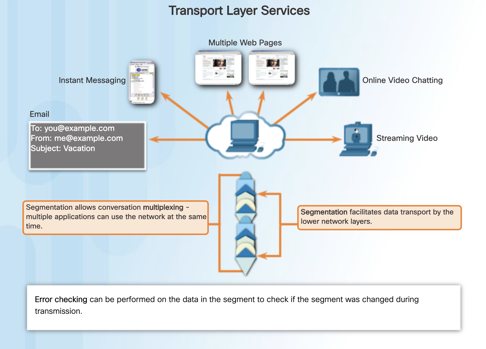

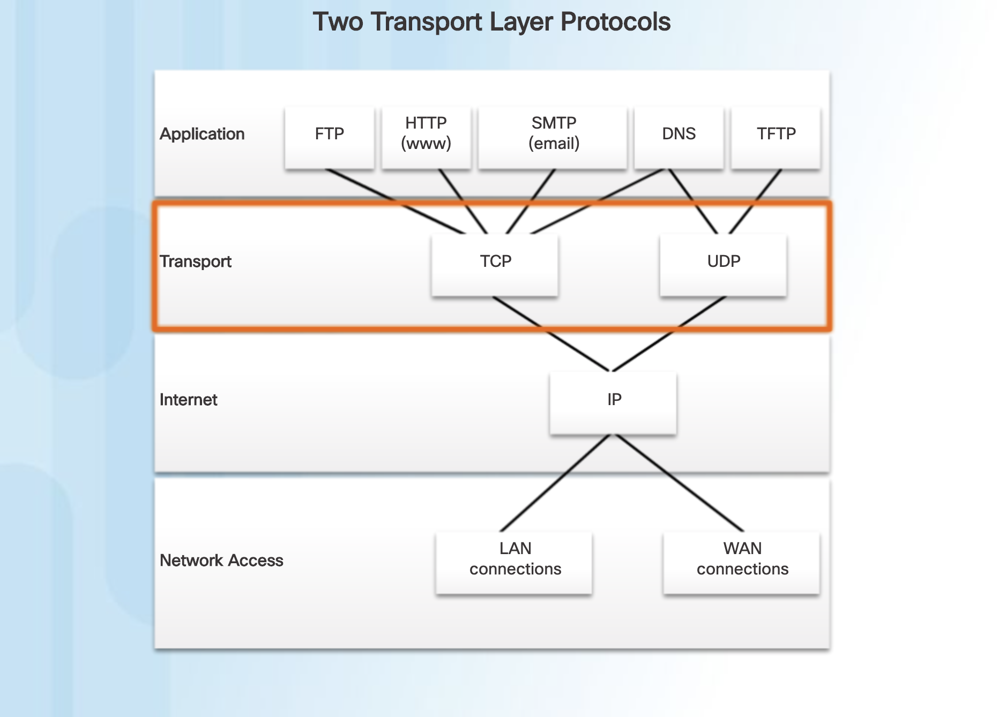

#### 4.5.1.3 TCP Local and Remote Ports

The transport layer must be able to separate and manage multiple communications with different transport requirement needs. Users expect to be able to simultaneously receive and send email and instant messages, view websites, and conduct a VoIP phone call. Each of these applications is sending and receiving data over the network at the same time, despite different reliability requirements. Additionally, data from the phone call is not directed to the web browser, and text from an instant message does not appear in an email.

TCP and UDP manage these multiple simultaneous conversations by using header fields that can uniquely identify these applications. These unique identifiers are the port numbers.

The source port number is associated with the originating application on the local host. The destination port number is associated with the destination application on the remote host, as shown in Figure 1.

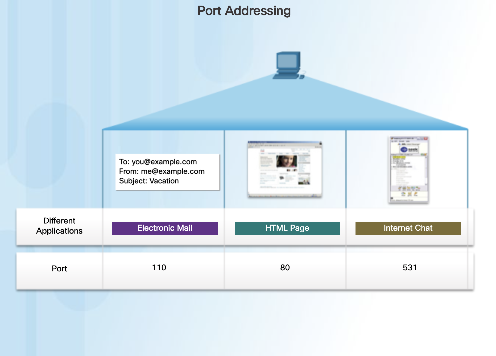

**Source Port**

The source port number is dynamically generated by the sending device to identify a conversation between two devices. This process allows multiple conversations to occur simultaneously. It is common for a device to send multiple HTTP service requests to a web server at the same time. Each separate HTTP conversation is tracked based on the source ports.

**Destination Port**

The client places a destination port number in the segment to tell the destination server what service is being requested, as shown in Figure 2. 

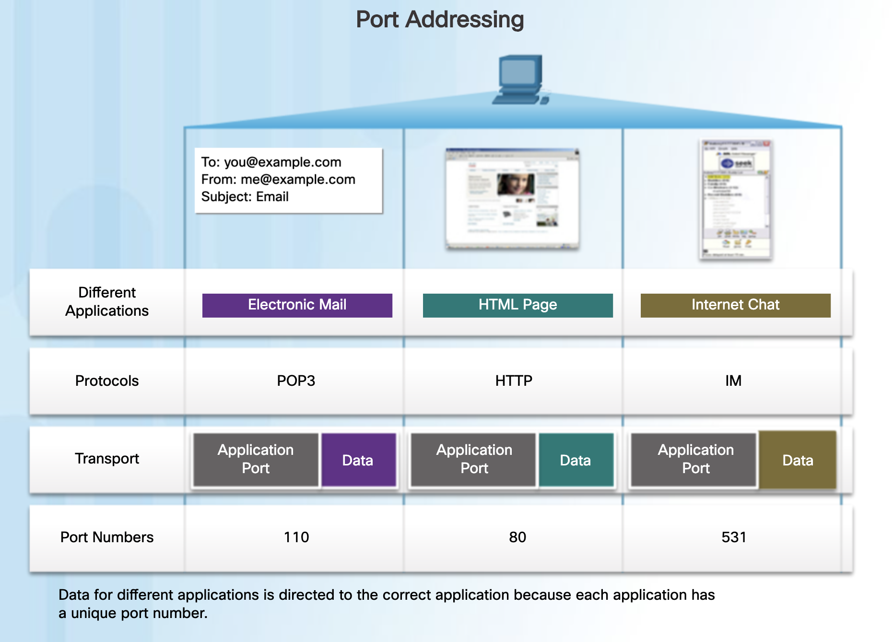

For example, when a client specifies port 80 in the destination port, the server that receives the message knows that web services are being requested. A server can offer more than one service simultaneously such as web services on port 80 at the same time that it offers File Transfer Protocol (FTP) connection establishment on port 21.

#### 4.5.1.4 Socket Pairs

The source and destination ports are placed within the segment. The segments are then encapsulated within an IP packet. The IP packet contains the IP address of the source and destination. The combination of the source IP address and source port number, or the destination IP address and destination port number is known as a socket. The socket is used to identify the server and service being requested by the client. A client socket might look like this, with 1099 representing the source port number: 192.168.1.5:1099

The socket on a web server might be: 192.168.1.7:80

Together, these two sockets combine to form a socket pair: 192.168.1.5:1099, 192.168.1.7:80

Sockets enable multiple processes, running on a client, to distinguish themselves from each other, and multiple connections to a server process to be distinguished from each other.

The source port number acts as a return address for the requesting application. The transport layer keeps track of this port and the application that initiated the request so that when a response is returned, it can be forwarded to the correct application.

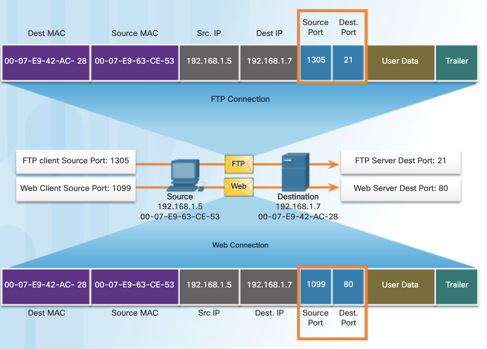

#### 4.5.1.5 TCP vs UDP

For some applications, segments must arrive in a very specific sequence to be processed successfully. With other applications, all data must be fully received before any is considered useful. In both of these instances, TCP is used as the transport protocol. Application developers must choose which transport protocol type is appropriate based on the requirements of the applications.

For example, applications such as databases, web browsers, and email clients, require that all data that is sent arrives at the destination in its original condition. Any missing data could cause a corrupt communication that is either incomplete or unreadable. These applications are designed to use TCP.

TCP transport is analogous to sending packages that are tracked from source to destination. If a shipping order is broken up into several packages, a customer can check online to see the order of the delivery.

With TCP, there are three basic operations of reliability:

- Numbering and tracking data segments transmitted to a specific host from a specific application

- Acknowledging received data

- Retransmitting any unacknowledged data after a certain period of time

Click Play in Figure 1 to see how TCP segments and acknowledgments are transmitted between sender and receiver.

In other cases, an application can tolerate some data loss during transmission over the network, but delays in transmission are unacceptable. UDP is the better choice for these applications because less network overhead is required. There is a trade-off between the value of reliability and the burden it places on network resources. Adding overhead to ensure reliability for some applications could reduce the usefulness of the application and can even be detrimental. In such cases, UDP is a better transport protocol. UDP is preferable for applications such as streaming live audio, live video, and Voice over IP (VoIP). Acknowledgments and retransmission would slow down delivery.

For example, if one or two segments of a live video stream fail to arrive, it creates a momentary disruption in the stream. This may appear as distortion in the image or sound, but may not be noticeable to the user. If the destination device had to account for lost data, the stream could be delayed while waiting for retransmissions, therefore causing the image or sound to be greatly degraded. In this case, it is better to render the best media possible with the segments received, and forego reliability.

UDP provides the basic functions for delivering data segments between the appropriate applications, with very little overhead and data checking. UDP is known as a best-effort delivery protocol. In the context of networking, best-effort delivery is referred to as unreliable because there is no acknowledgment that the data is received at the destination. With UDP, there are no transport layer processes that inform the sender of a successful delivery.

UDP is similar to placing a regular, non-registered, letter in the mail. The sender of the letter is not aware of the availability of the receiver to receive the letter. Nor is the post office responsible for tracking the letter or informing the sender if the letter does not arrive at the final destination.

Click Play in Figure 2 to see an animation of UDP segments being transmitted from sender to receiver.

Figure 3 provides an overview and comparison of the features of TCP and UDP.

**Note**: Applications that stream stored audio and video use TCP. For example, if your network suddenly cannot support the bandwidth needed to watch an on-demand movie, the application pauses the playback. During the pause, you might see a “buffering...” message while TCP works to re-establish the stream. When all the segments are in order and a minimum level of bandwidth is restored, your TCP session resumes and the movie continues to play.

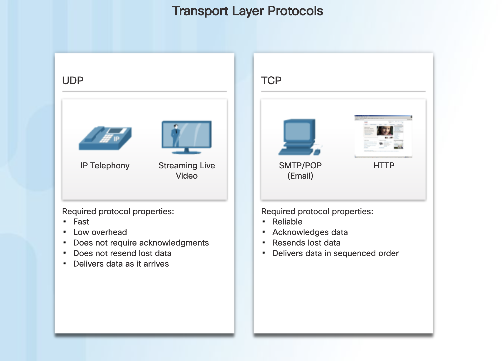

#### 4.5.1.6 TCP and UDP Headers

TCP is a stateful protocol. A stateful protocol is a protocol that keeps track of the state of the communication session. To track the state of a session, TCP records which information it has sent and which information has been acknowledged. The stateful session begins with the session establishment and ends when closed with the session termination.

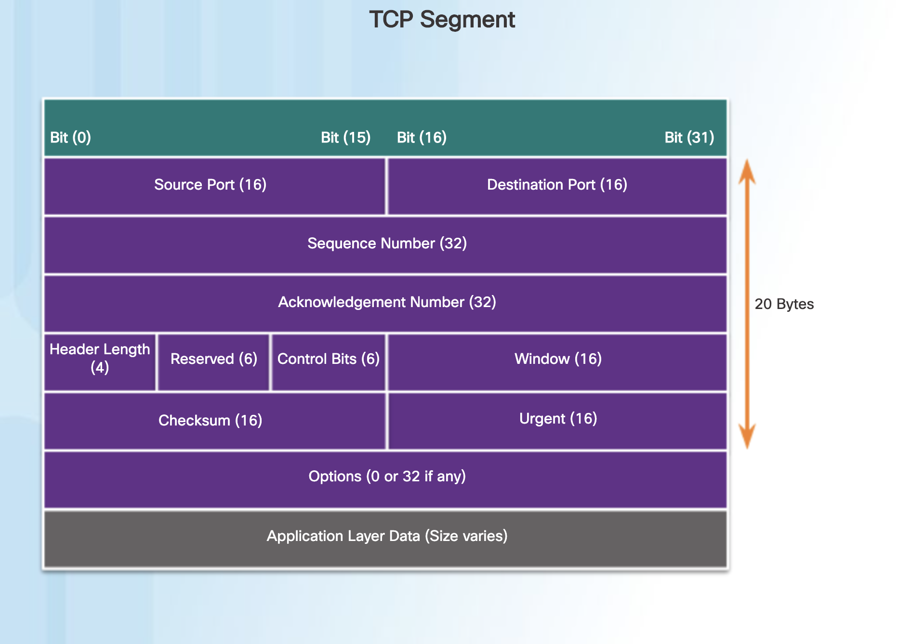

As shown in Figure 1, each TCP segment has 20 bytes of overhead in the header encapsulating the application layer data:

- **Source Port (16 bits) and Destination Port (16 bits)** – This is used to identify the application.
- **Sequence number (32 bits)** – This is used for data reassembly purposes.
- **Acknowledgment number (32 bits)** – This indicates the data that has been received.
- **Header length (4 bits)** – This is known as "data offset". It indicates the length of the TCP segment header.
- **Reserved (6 bits)** - This field is reserved for the future.
- **Control bits (6 bits)** – This includes bit codes, or flags, which indicate the purpose and function of the TCP segment.
- **Window size (16 bits)** – This indicates the number of bytes that can be accepted at one time.
- **Checksum (16 bits)** – This is used for error checking of the segment header and data.
- **Urgent (16 bits)** – This indicates if data is urgent.

There are six control bits:

- **URG** – This indicates that the segment should be classified as urgent.
- **ACK** – This indicates that the acknowledgment number field is significant. All segments in an established connection will have this bit set.
- **PSH** – This is the push function. It indicates that the segment should not be buffered but should be sent immediately to the receiving application.
- **RST** – This indicates that an unexpected condition has occurred and that the connection should be reset.
- **SYN** – This is used to initiate a connection. This should only be set in the initial segments in the connection establishment phase of data communication.
- **FIN** – This signals that no more data will be transferred and that the connection should be terminated.

UDP is a stateless protocol, meaning neither the client, nor the server, is obligated to keep track of the state of the communication session. If reliability is required when using UDP as the transport protocol, it must be handled by the application.

One of the most important requirements for delivering live video and voice over the network is that the data continues to flow quickly. Live video and voice applications can tolerate some data loss with minimal or no noticeable effect, and are perfectly suited to UDP.

The pieces of communication in UDP are called datagrams, as shown in Figure 2. These datagrams are sent as best-effort by the transport layer protocol. UDP has a low overhead of 8 bytes.

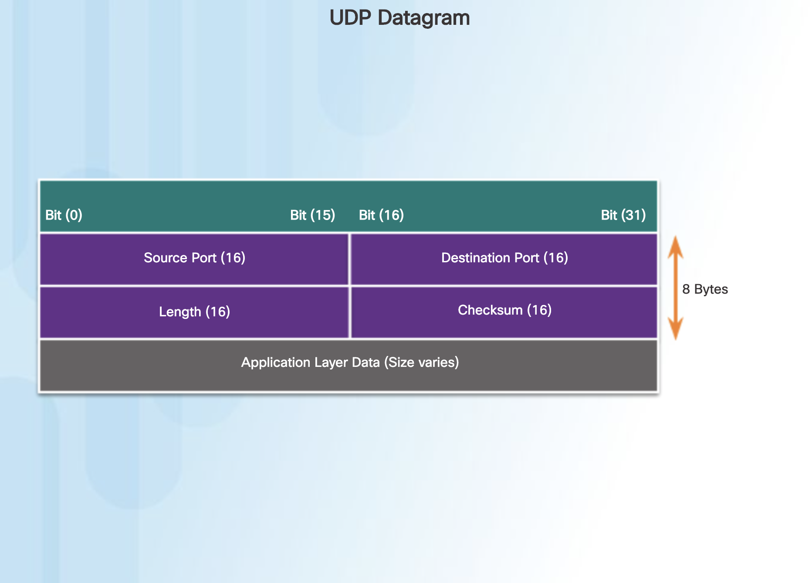

#### 4.5.1.7 Activity - Compare TCP and UDP Characteristics

### 4.5.2 Transport Layer Operation

#### 4.5.2.1 TCP Port Allocation

Each application process running on a server is configured to use a port number, either by default or manually, by a system administrator. An individual server cannot have two services assigned to the same port number within the same transport layer services.

For example, a server running a web server application and a file transfer application cannot have both configured to use the same port (for example, TCP port 80). An active server application assigned to a specific port is considered to be open. This means that the transport layer running on the server accepts and processes segments addressed to that port. Any incoming client request addressed to the correct socket is accepted, and the data is passed to the server application. There can be many ports open simultaneously on a server, one for each active server application.

When establishing a connection with a server, the transport layer on the client establishes a source port to keep track of data sent from the server. Just as a server can have many ports open for server processes, clients can have many ports open for connections to multiple sockets. Local source ports are randomly allocated from a range of numbers that is usually from 49152 to 65535. Segments sent to the client from a server will use the client port number as the destination port for data from the socket.

Refer to Figures 1 through 5 to see the typical allocation of source and destination ports in TCP client/server operations.

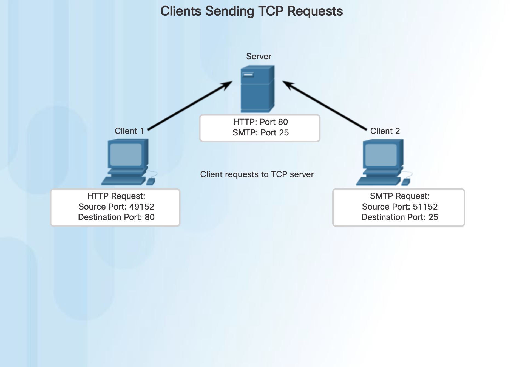

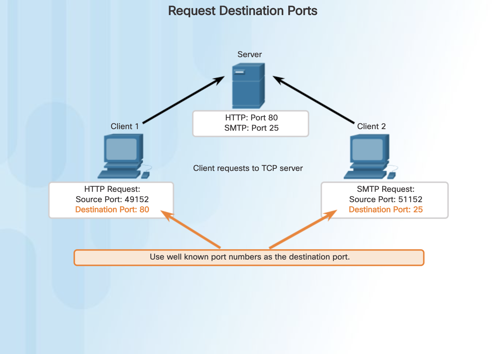

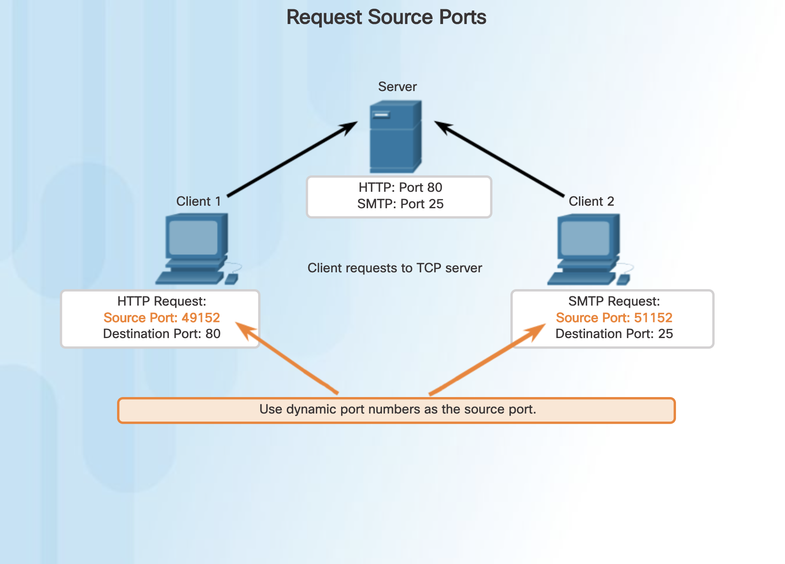

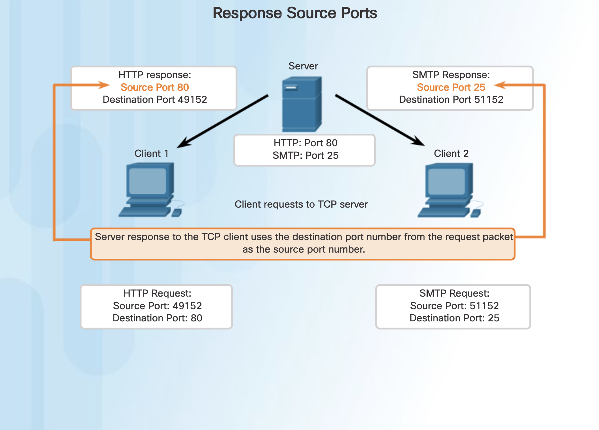

#### 4.5.2.2 A TCP Session Part I: Connection Establishment and Termination

In some cultures, when two persons meet, they often greet each other by shaking hands. The act of shaking hands is understood by both parties as a signal for a friendly greeting. Connections on the network are similar. In TCP connections, the host client establishes the connection with the server.

**Connection Establishment**

Hosts track each data segment within a session and exchange information about what data is received using the information in the TCP header. TCP is a full-duplex protocol, where each connection represents two one-way communication streams or sessions. To establish the connection, the hosts perform a three-way handshake. Control bits in the TCP header indicate the progress and status of the connection.

The three-way handshake accomplishes three things:

- It establishes that the destination device is present on the network.

- It verifies that the destination device has an active service and is accepting requests on the destination port number that the initiating client intends to use.

- It informs the destination device that the source client intends to establish a communication session on that port number.

A TCP connection is established in three steps:

1. The initiating client requests a client-to-server communication session with the server.

2. The server acknowledges the client-to-server communication session and requests a server-to-client communication session.

3. The initiating client acknowledges the server-to-client communication session.

In Figure 1, click buttons 1 through 3 to see the TCP connection establishment.

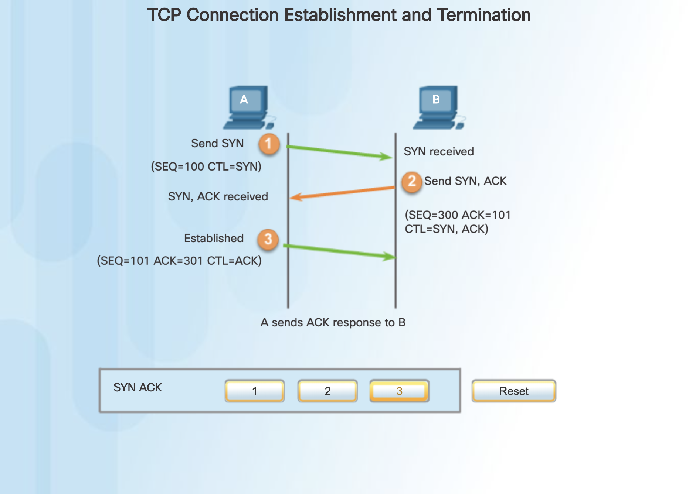

**Connection Termination**

After the communication is completed, the sessions are closed, and the connection is terminated. The connection and session mechanisms enable TCP’s reliability function.

To close a connection, the Finish (FIN) control flag must be set in the segment header. To end each one-way TCP session, a two-way handshake, consisting of a FIN segment and an Acknowledgment (ACK) segment, is used. Therefore, to terminate a single conversation supported by TCP, four exchanges are needed to end both sessions.

In Figure 2, click buttons 1 through 4 to see the TCP connection termination.

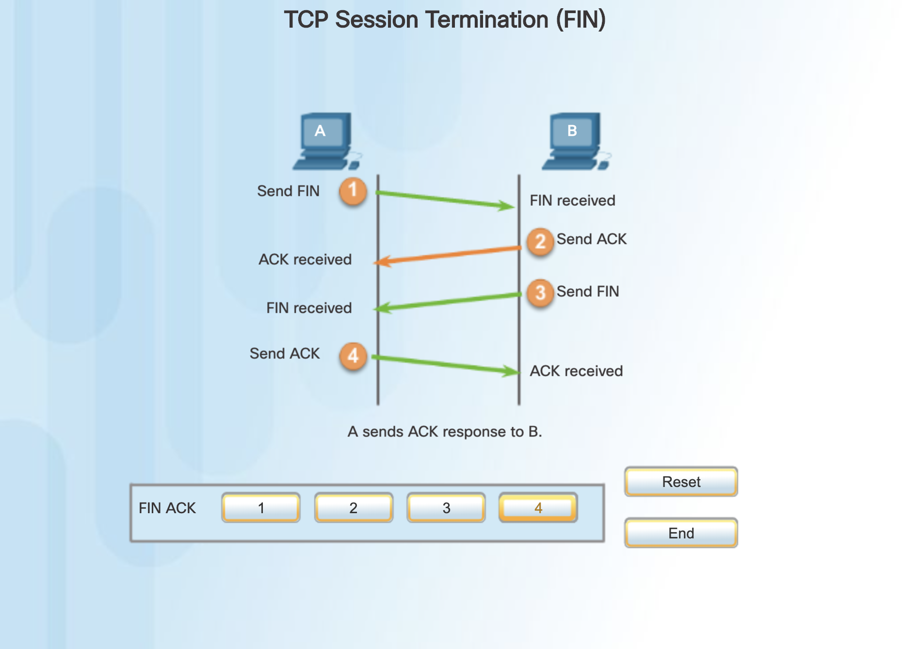

**Note**: In this explanation, the terms client and server are used as a reference for simplicity, but the termination process can be initiated by any two hosts that have an open session:

1. When the client has no more data to send in the stream, it sends a segment with the FIN flag set.

2. The server sends an ACK to acknowledge the receipt of the FIN to terminate the session from client to server.

3. The server sends a FIN to the client to terminate the server-to-client session.

4. The client responds with an ACK to acknowledge the FIN from the server.

When all segments have been acknowledged, the session is closed.

The six bits in the Control Bits field of the TCP segment header are also known as flags. A flag is a bit that is set to ‘on’ or ‘off’. Click the plus sign (+) next to the Control Bits field in Figure 3 to see all six flags. We have discussed SYN, ACK, and FIN. The RST flag is used to reset a connection when an error or timeout occurs. Click [here](http://packetlife.net/blog/2011/mar/2/tcp-flags-psh-and-urg/) to learn more about the PSH and URG flags.

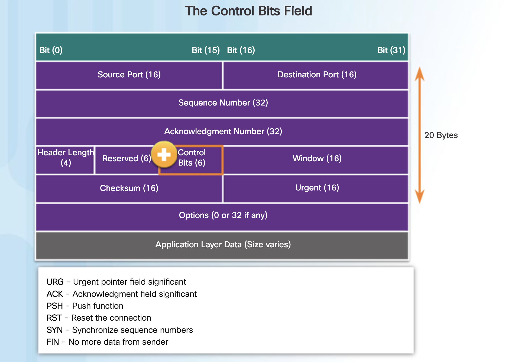

#### 4.5.2.3 Video Demonstration - TCP 3-Way Handshake

Siehe `/Chapter 4 Network Protocols and Services/vid/4_5_2_3 TCP 3-Way Handshake CCNA Cybersecurity Operations.mp4`

#### 4.5.2.4 Lab - Using Wireshark to Observe the TCP 3-Way Handshake

In this lab, you will complete the following objectives:

- Part 1: Prepare the Hosts to Capture the Traffic

- Part 2: Analyze the Packets using Wireshark

- Part 3: View the Packets using tcpdump

[Lab - Using Wireshark to Observe the TCP 3-Way Handshake](https://static-course-assets.s3.amazonaws.com/CyberOps11/en/course/files/4.5.2.4 Lab - Using Wireshark to Observe the TCP 3-Way Handshake.pdf)

#### 4.5.2.5 Activity - TCP Connection Process

#### 4.5.2.6 A TCP Session Part II: Data Transfer

**TCP Ordered Delivery**

TCP segments may arrive at their destination out of order. For the original message to be understood by the recipient, the data in these segments is reassembled into the original order. Sequence numbers are assigned in the header of each packet to achieve this goal. The sequence number represents the first data byte of the TCP segment.

During session setup, an initial sequence number (ISN) is set. This ISN represents the starting value of the bytes for this session that is transmitted to the receiving application. As data is transmitted during the session, the sequence number is incremented by the number of bytes that have been transmitted. This data byte tracking enables each segment to be uniquely identified and acknowledged. Missing segments can then be identified.

**Note**: The ISN does not begin at one but is instead, a random number. This is to prevent certain types of malicious attacks. For simplicity, we will use an ISN of 1 for the examples in this chapter.

Segment sequence numbers indicate how to reassemble and reorder received segments, as shown in Figure 1.

The receiving TCP process places the data from a segment into a receiving buffer. Segments are placed in the proper sequence order and passed to the application layer when reassembled. Any segments that arrive with sequence numbers that are out of order are held for later processing. Then, when the segments with the missing bytes arrive, these segments are processed in order.

**Flow Control**

TCP also provides mechanisms for flow control, which is the amount of data that the destination can receive and process reliably. Flow control helps maintain the reliability of TCP transmission by adjusting the rate of data flow between source and destination for a given session. To accomplish this, the TCP header includes a 16-bit field called the window size.

Figure 2 shows an example of window size and acknowledgments. The window size is the number of bytes that the destination device of a TCP session can accept and process at one time. In this example, PC B’s initial window size for the TCP session is 10,000 bytes. Starting with the first byte, byte number 1, the last byte PC A can send without receiving an acknowledgment is byte 10,000. This is known as PC A’s send window. The window size is included in every TCP segment so the destination can modify the window size at any time depending on buffer availability.

**Note**: In the figure, the source is transmitting 1,460 bytes of data within each TCP segment. This is known as the MSS (Maximum Segment Size).

The initial window size is agreed upon when the TCP session is established during the three-way handshake. The source device must limit the number of bytes sent to the destination device based on the destination’s window size. Only after the source device receives an acknowledgment that the bytes have been received, can it continue sending more data for the session. Typically, the destination will not wait for all the bytes for its window size to be received before replying with an acknowledgment. As the bytes are received and processed, the destination will send acknowledgments to inform the source that it can continue to send additional bytes.

The process of the destination sending acknowledgments as it processes bytes received and the continual adjustment of the source’s send window is known as sliding windows.

If the availability of the destination’s buffer space decreases, it may reduce its window size and inform the source to reduce the number of bytes it should send without receiving an acknowledgment.

A useful discussion of TCP sequence and acknowledgment numbers can be found [here](http://packetlife.net/blog/2010/jun/7/understanding-tcp-sequence-acknowledgment-numbers/).

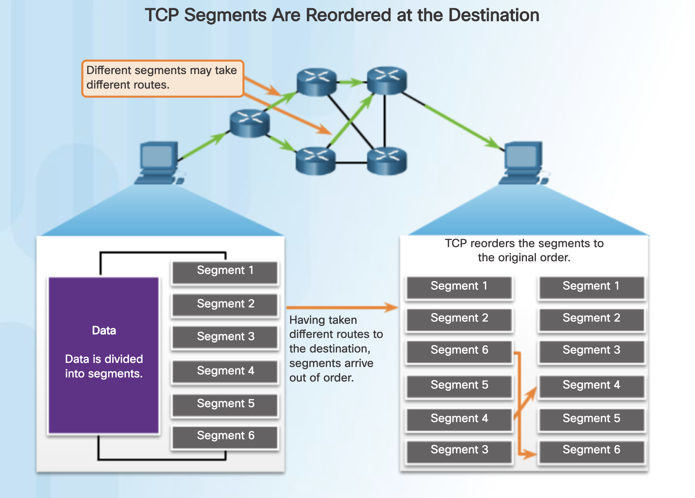

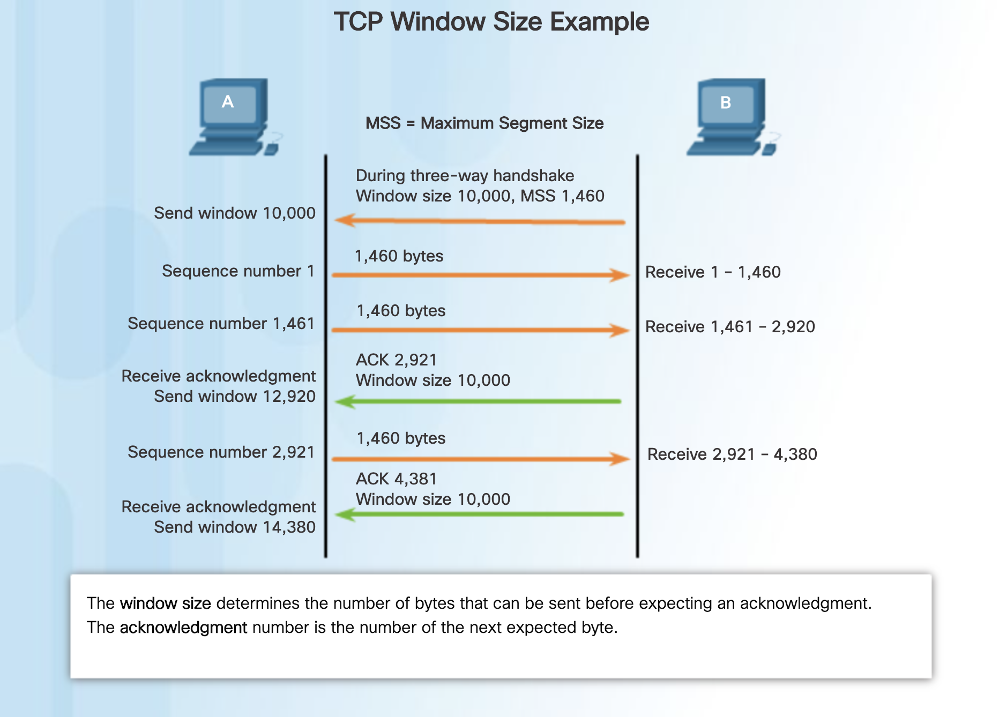

#### 4.5.2.7 Video Demonstration - Sequence Numbers and Acknowledgments

Siehe `/Chapter 4 Network Protocols and Services/vid/4_5_2_7 Sequence Numbers and Acknowledgments CCNA Cybersecurity Operations.mp4`

#### 4.5.2.8 Video Demonstration - Data Loss and Retransmission

Siehe `/Chapter 4 Network Protocols and Services/vid/4_5_2_8 Data Loss and Retransmission CCNA Cybersecurity Operations.mp4`

#### 4.5.2.9 A UDP Session

Like segments with TCP, when UDP datagrams are sent to a destination, they often take different paths and arrive in the wrong order. UDP does not track sequence numbers the way TCP does. UDP has no way to reorder the datagrams into their transmission order.

Therefore, UDP simply reassembles the data in the order that it was received and forwards it to the application, as shown in Figure 1. If the data sequence is important to the application, the application must identify the proper sequence and determine how the data should be processed.

Like TCP-based applications, UDP-based server applications are assigned well-known or registered port numbers, as shown in Figure 2. When these applications or processes are running on a server, they accept the data matched with the assigned port number. When UDP receives a datagram destined for one of these ports, it forwards the application data to the appropriate application based on its port number.

**Note**: The Remote Authentication Dial-in User Service (RADIUS) server shown in the figure provides authentication, authorization, and accounting services to manage user access.

As with TCP, client-server communication is initiated by a client application that requests data from a server process. The UDP client process dynamically selects a port number from the range of port numbers and uses this as the source port for the conversation. The destination port is usually the well-known or registered port number assigned to the server process.

After a client has selected the source and destination ports, the same pair of ports is used in the header of all datagrams used in the transaction. For the data returning to the client from the server, the source and destination port numbers in the datagram header are reversed.

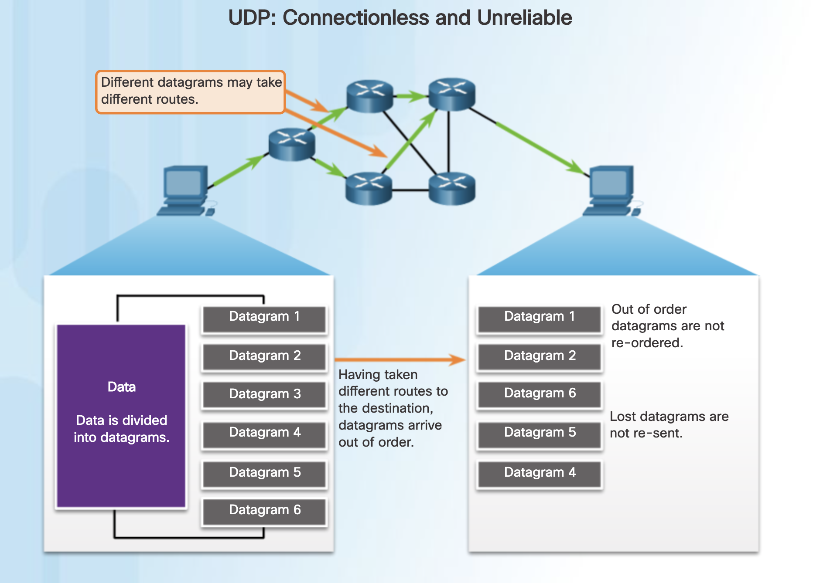

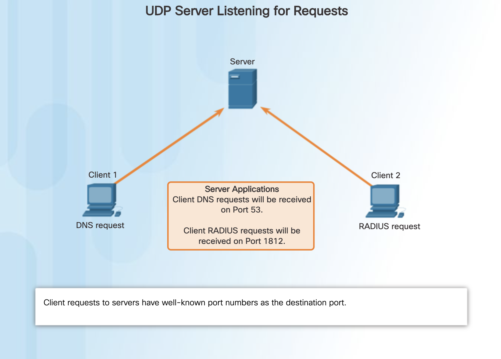

#### 4.5.2.10 Lab - Exploring Nmap

Port scanning is usually part of a reconnaissance attack. There are a variety of port scanning methods that can be used. We will explore how to use the Nmap utility. Nmap is a powerful network utility that is used for network discovery and security auditing.

## 4.6 Network Services

### 4.6.1 DHCP

#### 4.6.1.1 DHCP Overview

The Dynamic Host Configuration Protocol (DHCP) for IPv4 service automates the assignment of IPv4 addresses, subnet masks, gateways, and other IPv4 networking parameters. This is referred to as dynamic addressing. The alternative to dynamic addressing is static addressing. When using static addressing, the network administrator manually enters IP address information on hosts. DHCPv6 (DHCP for IPv6) provides similar services for IPv6 clients.

When an IPv4, DHCP-configured device boots up or connects to the network, the client broadcasts a DHCP discover (DHCPDISCOVER) message to identify any available DHCP servers on the network. A DHCP server replies with a DHCP offer (DHCPOFFER) message, which offers a lease to the client, as shown in Figure 1. The offer message contains the IPv4 address and subnet mask to be assigned, the IPv4 address of the DNS server, and the IPv4 address of the default gateway. The lease offer also includes the duration of the lease.

The client may receive multiple DHCPOFFER messages if there is more than one DHCP server on the local network. Therefore, it must choose between them, and sends a DHCP request (DHCPREQUEST) message that identifies the explicit server and lease offer that the client is accepting. A client may also choose to request an address that it had previously been allocated by the server.

Assuming that the IPv4 address requested by the client, or offered by the server, is still available, the server returns a DHCP acknowledgment (DHCPACK) message that acknowledges to the client that the lease has been finalized. If the offer is no longer valid, then the selected server responds with a DHCP negative acknowledgment (DHCPNAK) message. If a DHCPNAK message is returned, then the selection process must begin again with a new DHCPDISCOVER message being transmitted. After the client has the lease, it must be renewed prior to the lease expiration through another DHCPREQUEST message. Figures 2 through 8 illustrate the steps in DHCPv4 operation.

The DHCP server ensures that all IP addresses are unique (the same IP address cannot be assigned to two different network devices simultaneously). Most Internet providers use DHCP to allocate addresses to their customers.

DHCPv6 has similar set of messages to those shown in the figure for DHCP for IPv4. The DHCPv6 messages are SOLICIT, ADVERTISE, INFORMATION REQUEST, and REPLY.

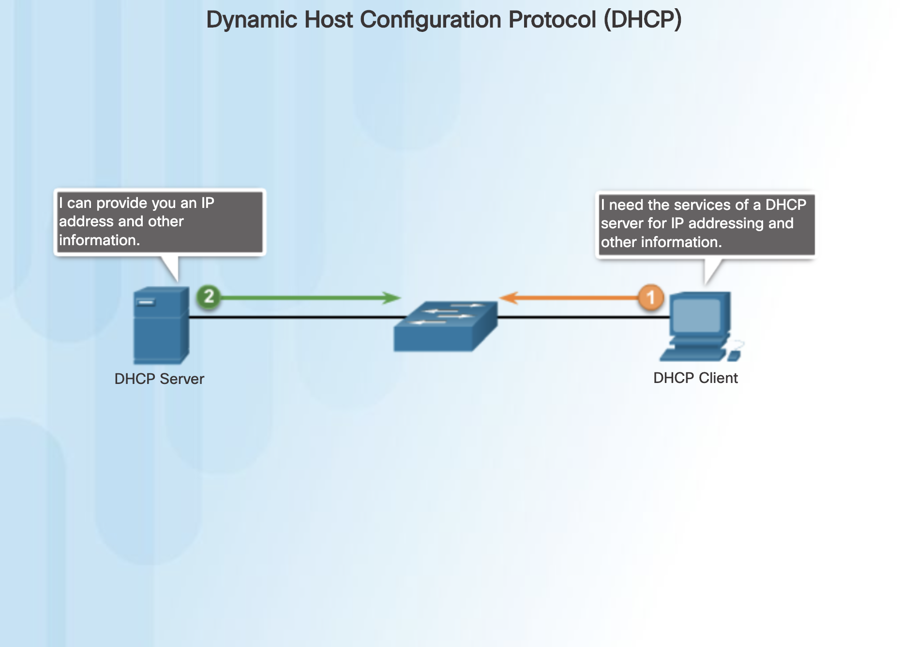

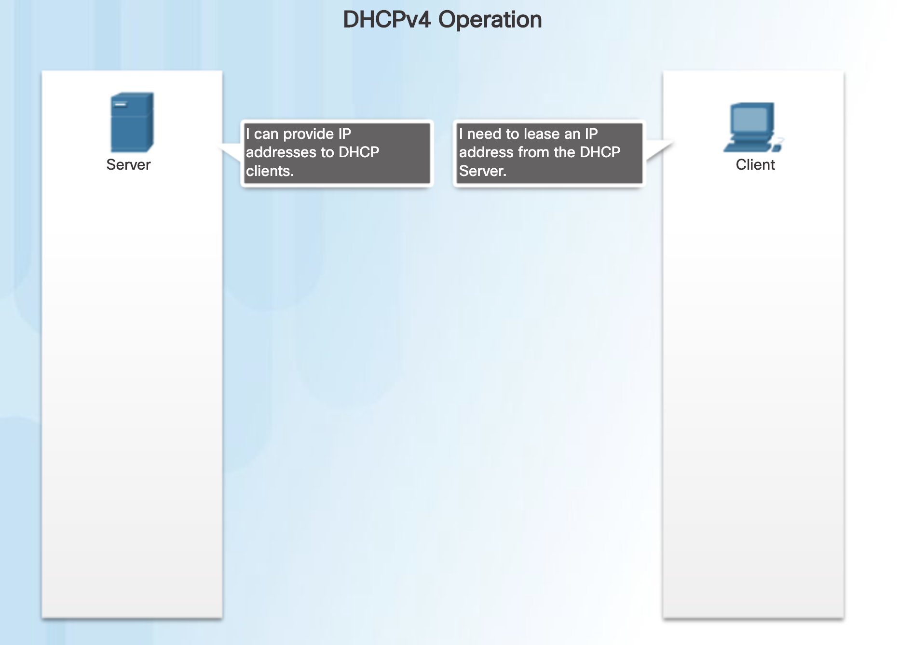

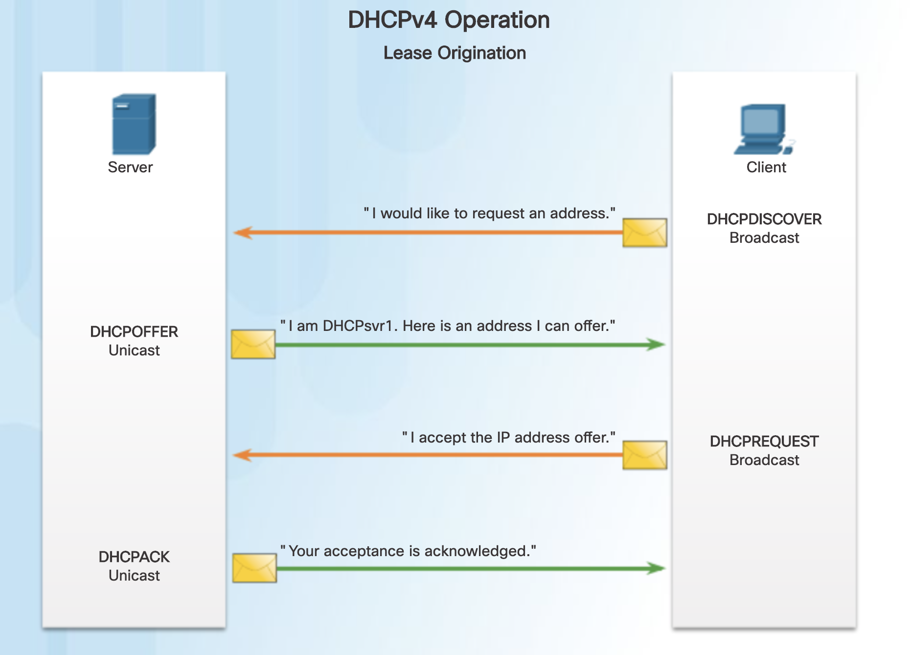

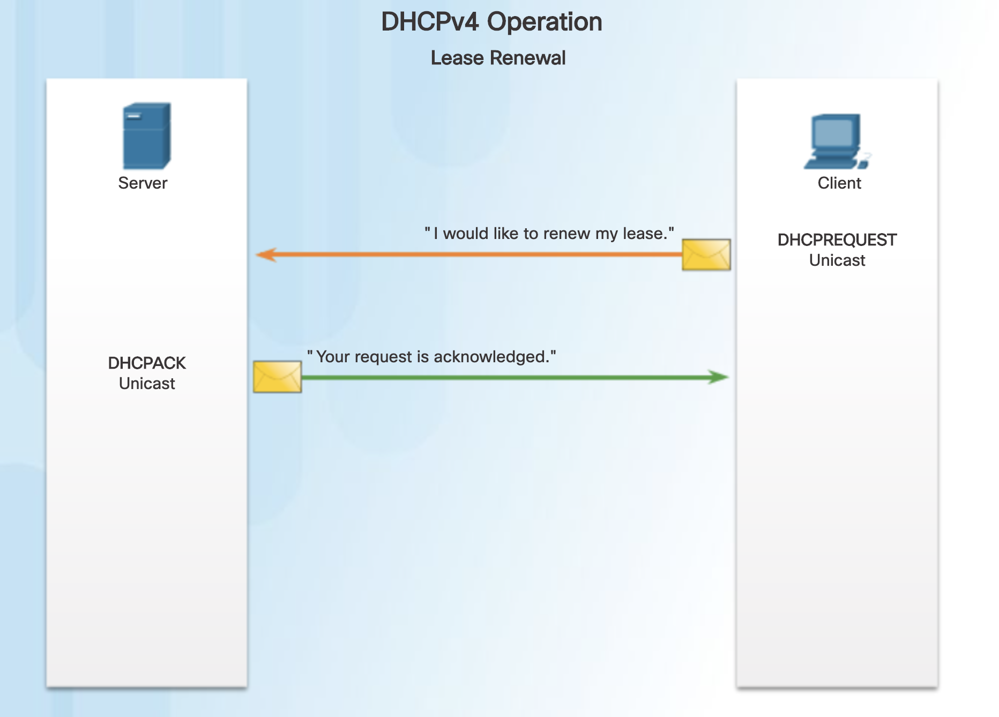

#### 4.6.1.2 DHCPv4 Message Format

The DHCPv4 message format is used for all DHCPv4 transactions. DHCPv4 messages are encapsulated within the UDP transport protocol. DHCPv4 messages sent from the client use UDP source port 68 and destination port 67. DHCPv4 messages sent from the server to the client use UDP source port 67 and destination port 68.

The figure shows the format of a DHCPv4 message with the following fields:

- **Operation (OP) Code** - Specifies the general type of message. A value of 1 indicates a request message; a value of 2 is a reply message.

- **Hardware Type** - Identifies the type of hardware used in the network. For example, 1 is Ethernet, 15 is Frame Relay, and 20 is a serial line. These are the same codes used in ARP messages.

- **Hardware Address Length** - Specifies the length of the address.

- **Hops** - Controls the forwarding of messages. Set to 0 by a client before transmitting a request.

- **Transaction Identifier** - Used by the client to match the request with replies received from DHCPv4 servers.

- **Seconds** - Identifies the number of seconds elapsed since a client began attempting to acquire or renew a lease. Used by DHCPv4 servers to prioritize replies when multiple client requests are outstanding.

- **Flags** - Used by a client that does not know its IPv4 address when it sends a request. Only one of the 16 bits is used, which is the broadcast flag. A value of 1 in this field tells the DHCPv4 server or relay agent receiving the request that the reply should be sent as a broadcast.

- **Client IP Address** - Used by a client during lease renewal when the address of the client is valid and usable, not during the process of acquiring an address. The client puts its own IPv4 address in this field if and only if it has a valid IPv4 address while in the bound state; otherwise, it sets the field to 0.

- **Your IP Address** - Used by the server to assign an IPv4 address to the client.

- **Server IP Address** - Used by the server to identify the address of the server that the client should use for the next step in the bootstrap process, which may or may not be the server sending this reply. The sending server always includes its own IPv4 address in a special field called the Server Identifier DHCPv4 option.

- **Gateway IP Address** - Routes DHCPv4 messages when DHCPv4 relay agents are involved. The gateway address facilitates communications of DHCPv4 requests and replies between the client and a server that are on different subnets or networks.

- **Client Hardware Address** - Specifies the physical layer of the client.

- **Server Name** - Used by the server sending a DHCPOFFER or DHCPACK message. The server may optionally put its name in this field. This can be a simple text nickname or a DNS domain name, such as dhcpserver.netacad.net.

- **Boot Filename** - Optionally used by a client to request a particular type of boot file in a DHCPDISCOVER message. Used by a server in a DHCPOFFER to fully specify a boot file directory and filename.

- **DHCP Options** - Holds DHCP options, including several parameters required for basic DHCP operation. This field is variable in length. Both client and server may use this field.

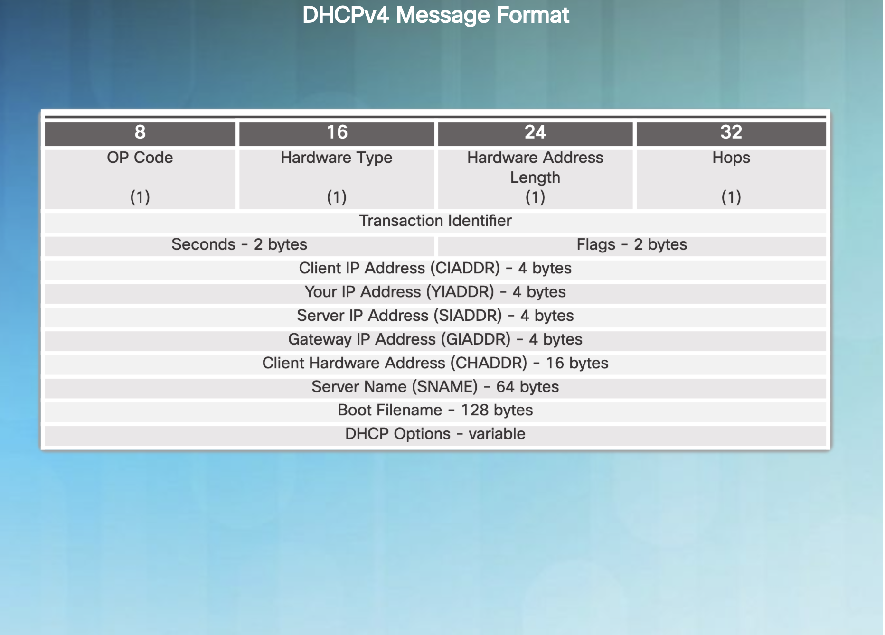

### 4.6.2 DNS

#### 4.6.2.1 DNS Overview

The webservers that we so often connect to using names like www.cisco.com, are actually reached by assigning IP addresses to packets. On the Internet, these domain names are much easier for people to remember than 198.133.219.25, which is the actual numeric IP address for this server. If Cisco decides to change the numeric address of www.cisco.com, it is transparent to the user because the domain name remains the same. The new address is simply linked to the existing domain name and connectivity is maintained.

The Domain Name System (DNS) was developed to provide a reliable means of managing and providing domain names and their associated IP addresses. The DNS system consists of a global hierarchy of distributed servers that contain databases of name to IP address mappings. The client computer in the figure will send a request to the DNS server to get the IP address for www.cisco.com.

A recent analysis of network security threats discovered that over 90% of the malicious software that is used to attack networks uses the DNS system to carry out attack campaigns. A cybersecurity analyst should have a thorough understanding of the DNS system and the ways in which malicious DNS traffic can be detected through protocol analysis and the inspection of DNS monitoring information.

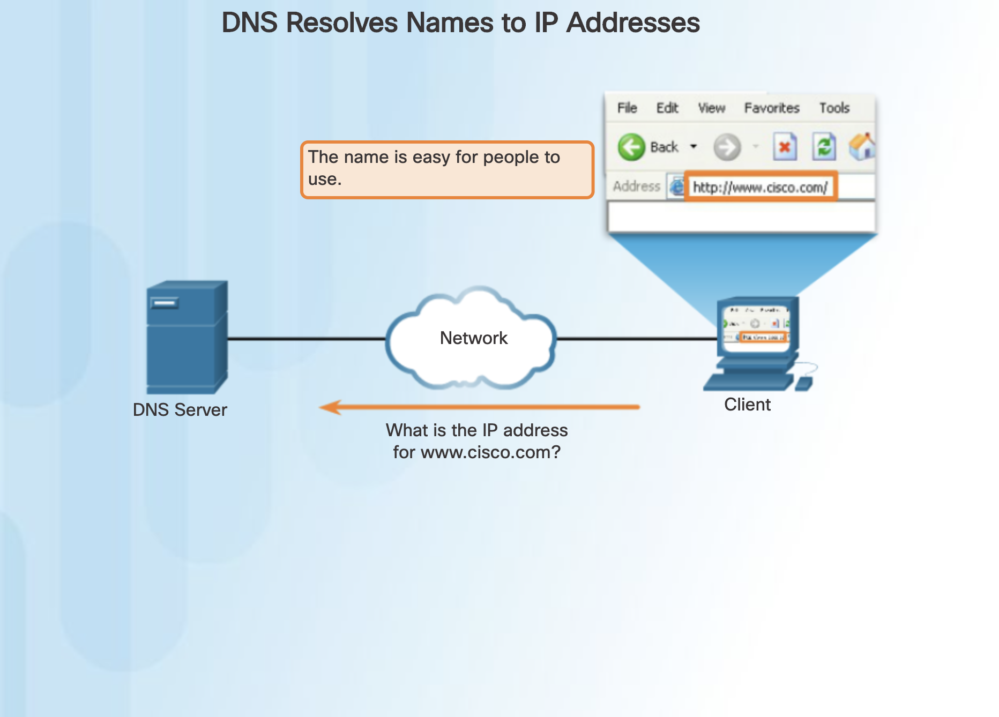

#### 4.6.2.2 The DNS Domain Hierarchy

The DNS consists of a hierarchy of generic top level domains (gTLD) which consist of .com, .net, .org, .gov, .edu, and numerous country-level domains, such as .br (Brazil), .es (Spain), .uk (United Kingdom), etc. At the next level of the DNS hierarchy are second-level domains. These are represented by a domain name that is followed by a top-level domain. Subdomains are found at the next level of the DNS hierarchy and represent some division of the second-level domain. Finally, a fourth level can represent a host in a subdomain. Each element of a domain specification is sometimes called a label. The labels move from the top of the hierarchy downward from right to left. A dot (“.“) at the end of a domain name represents the root server at the top of the hierarchy. The figure illustrates this DNS domain hierarchy.

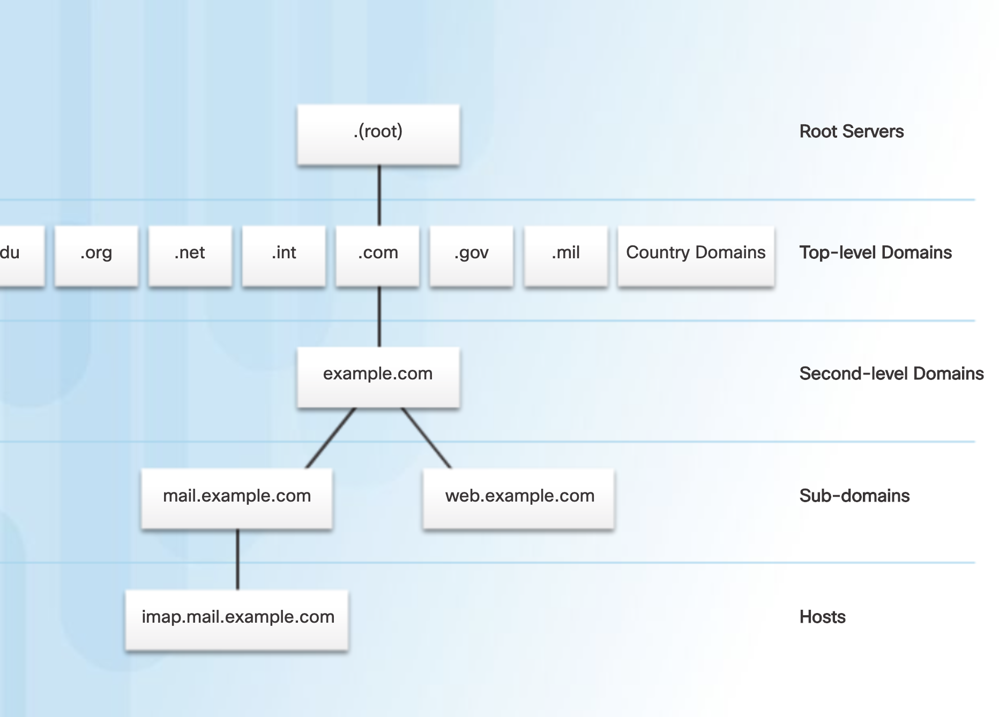

#### 4.6.2.3 The DNS Lookup Process

To understand DNS, cybersecurity analysts should be familiar with the following terms:

- **Resolver** - A DNS client that sends DNS messages to obtain information about the requested domain name space.

- **Recursion** - The action taken when a DNS server is asked to query on behalf of a DNS resolver.

- **Authoritative Server** - A DNS server that responds to query messages with information stored in Resource Records (RRs) for a domain name space stored on the server.

- **Recursive Resolver** - A DNS server that recursively queries for the information asked in the DNS query.

- **FQDN** - A Fully Qualified Domain Name is the absolute name of a device within the distributed DNS database.

- **RR** - A Resource Record is a format used in DNS messages that is composed of the following fields: NAME, TYPE, CLASS, TTL, RDLENGTH, and RDATA.

- **Zone** - A database that contains information about the domain name space stored on an authoritative server.

When attempting to resolve a name to an IP address, a user host, known in the system as a resolver, will first check its local DNS cache. As shown in the figure, if the mapping is not found there, a query will be issued to the DNS server or servers that are configured in the network addressing properties for the resolver. These servers may be present at an enterprise or ISP. If the mapping is not found there, the DNS server will query other higher-level DNS servers that are authoritative for the top-level domain in order to find the mapping. These are known as recursive queries.

Because of the potential burden on authoritative top-level domain servers, some DNS servers in the hierarchy maintain caches of all DNS records that they have resolved for a period of time. These caching DNS servers can resolve recursive queries without forwarding the queries to higher level servers. If a server requires data for a zone, it will request a transfer of that data from an authoritative server for that zone. The process of transferring blocks of DNS data between servers is known as a zone transfer.

Figures 2 through 6 display the steps involved in DNS resolution.

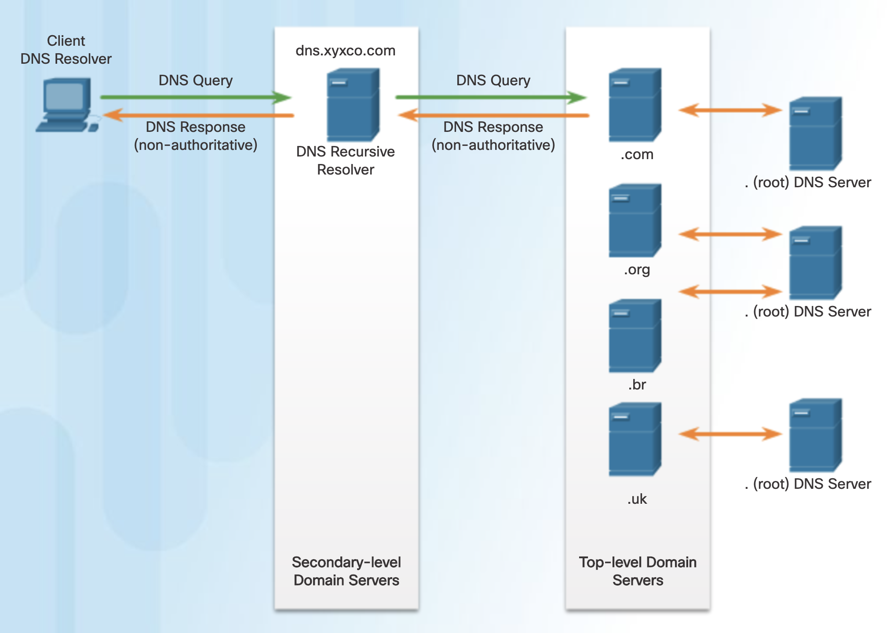

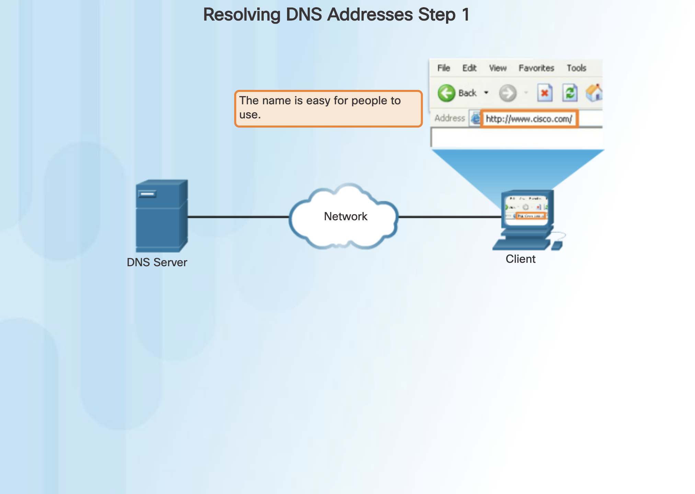

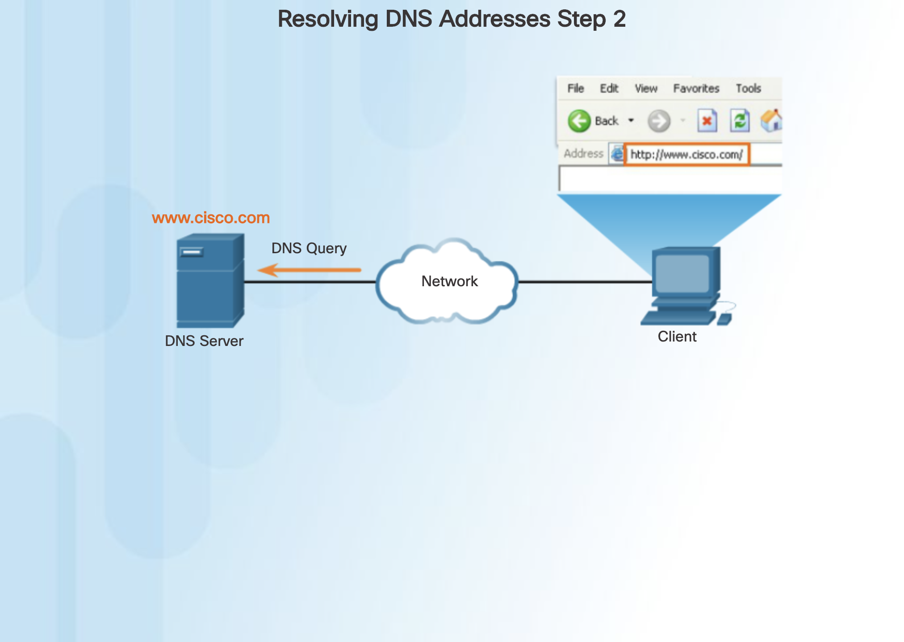

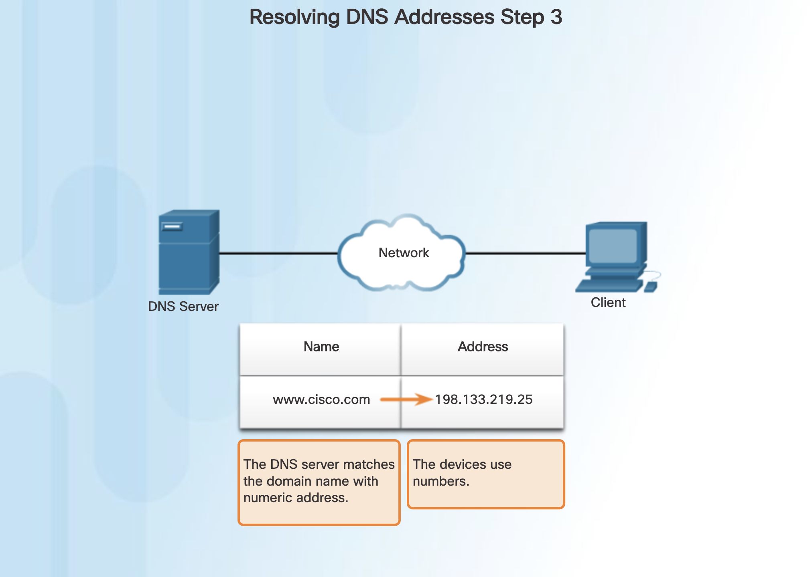

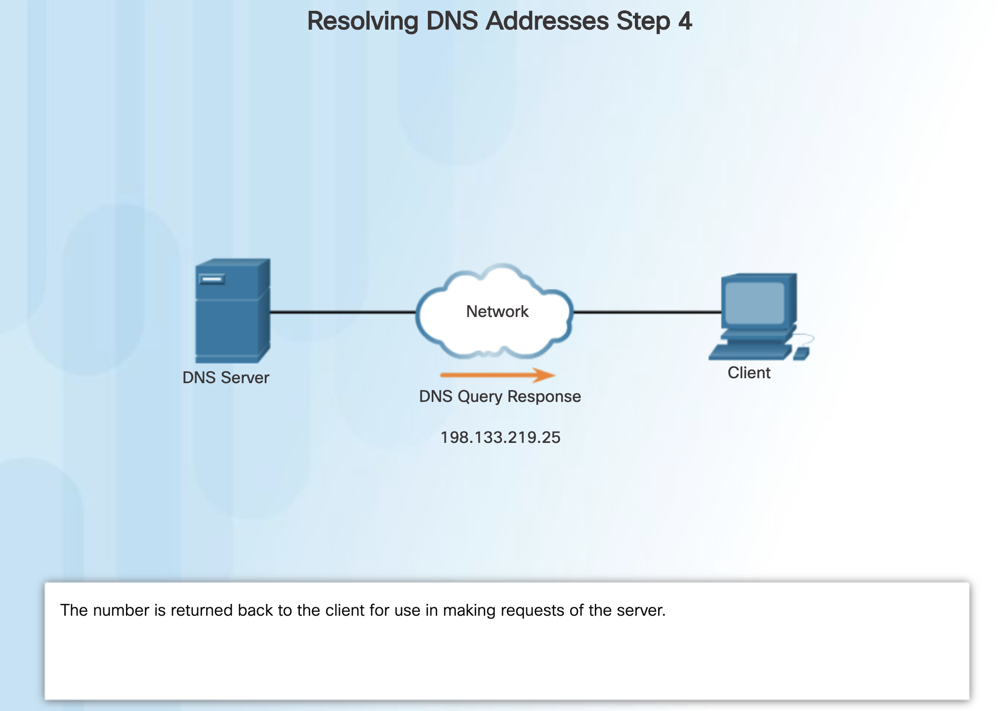

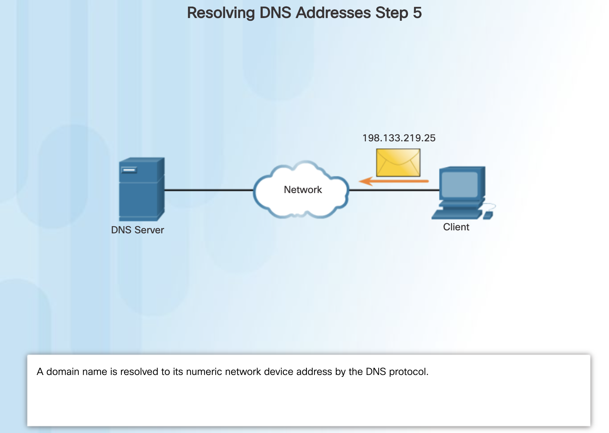

#### 4.6.2.4 DNS Message Format

DNS uses UDP port 53 for DNS queries and responses. DNS queries originate at a client and responses are issued from DNS servers. If a DNS response exceeds 512 bytes such as when Dynamic DNS (DDNS) is used, TCP port 53 is used to handle the message. It includes the format for queries, responses, and data. The DNS protocol communications use a single format called a message. This message format shown in the figure is used for all types of client queries and server responses, error messages, and the transfer of resource record information between servers.

The DNS server stores different types of RRs used to resolve names. These records contain the name, address, and type of record. Here is a list of some of these record types:

- **A** - An end device IPv4 address

- **NS** - An authoritative name server

- **AAAA** - An end device IPv6 address (pronounced quad-A)

- **MX** - A mail exchange record

When a client makes a query, the server’s DNS process first looks at its own records to resolve the name. If it is unable to resolve the name using its stored records, it contacts other servers to resolve the name. After a match is found and returned to the original requesting server, the server temporarily stores the numbered address in the event that the same name is requested again.

The DNS Client service on Windows PCs also stores previously resolved names in memory. The **ipconfig /displaydns** command displays all of the cached DNS entries.

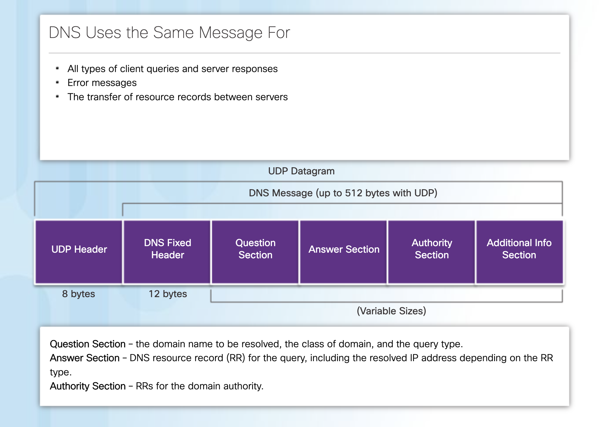

#### 4.6.2.5 Dynamic DNS

DNS requires registrars to accept and distribute DNS mappings from organizations that wish to register domain name and IP address mappings. After the initial mapping has been created, a process which can take 24 hours or more, changes to the IP address that is mapped to the domain name can be made by contacting the registrar or using an online form to the make the change. However, because of the time it takes for this process to occur and the new mapping to be distributed in domain name system, the change can take hours before the new mapping is available to resolvers. In situations in which an ISP is using DHCP to provide addresses to a domain, it is possible that the address that is mapped to the domain could expire and a new address be granted by the ISP. This would result in a disruption of connectivity to the domain through DNS. A new approach was necessary to allow organizations to make fast changes to the IP address that is mapped to a domain.

Dynamic DNS (DDNS) allows a user or organization to register an IP address with a domain name as in DNS. However, when the IP address of the mapping changes, the new mapping can be propagated through the DNS almost instantaneously. For this to occur, a user obtains a subdomain from a DDNS provider. That subdomain is mapped to the IP address of the user’s server, or home router connection to the Internet. Client software runs on either the router or a host PC that detects a change in the Internet IP address of the user. When a change is detected, the DDNS provider is immediately informed of the change and the mapping between the user’s subdomain and the Internet IP address is immediately updated, as shown in the figure. DDNS does not use a true DNS entry for a user’s IP address. Instead, it acts as an intermediary. The DDNS provider’s domain is registered with the DNS, but the subdomain is mapped to a totally different IP address. The DDNS provider service supplies that IP address to the resolver’s second level DNS server. That DNS server, either at the organization or ISP, provides the DDNS IP address to the resolver.

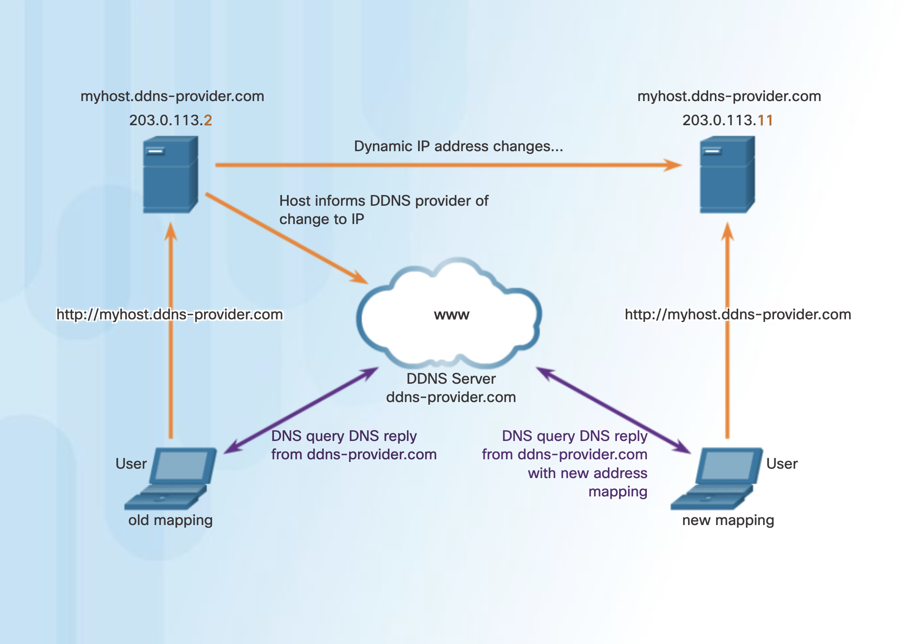

#### 4.6.2.6 The WHOIS Protocol

WHOIS is a TCP-based protocol that is used to identify the owners of Internet domains through the DNS system. When an Internet domain is registered and mapped to an IP address for the DNS system, the registrant must supply information regarding who is registering the domain. The WHOIS application uses a query, in the form of a FQDN. The query is issued through a WHOIS service or application. The official ownership registration record is returned to the user by the WHOIS service. This can be useful for identifying the destinations that have been accessed by hosts on a network. WHOIS has limitations, and hackers have ways of hiding their identities. However, WHOIS is a starting point for identifying potentially dangerous Internet locations that may have been reached through the network. An Internet-based WHOIS service is maintained by ICANN and can be reached at https://whois.icann.org/. Other WHOIS services are maintained by regional Internet registries such as RIPE and APNIC.

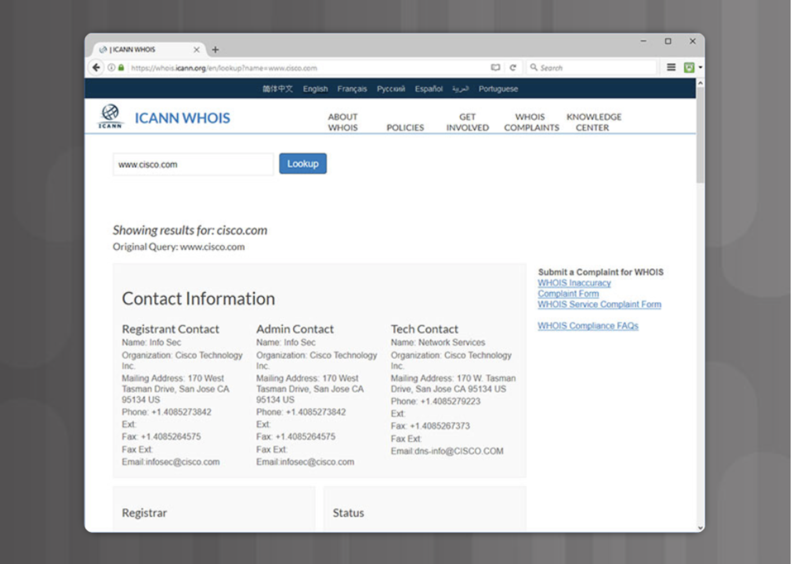

#### 4.6.2.7 Lab - Using Wireshark to Examine a UDP DNS Capture

In this lab, you will communicate with a DNS server by sending a DNS query using the UDP transport protocol. You will use Wireshark to examine the DNS query and response exchanges with the same server.

[Lab - Using Wireshark to Examine a UDP DNS Capture](https://static-course-assets.s3.amazonaws.com/CyberOps11/en/course/files/4.6.2.7 Lab - Using Wireshark to Examine a UDP DNS Capture.pdf)

### 4.6.3 NAT

#### 4.6.3.1 NAT Overview

There are not enough public IPv4 addresses to assign a unique address to each device connected to the Internet. Networks are commonly implemented using private IPv4 addresses, as defined in RFC 1918. Figure 1 shows the range of addresses included in RFC 1918. It is very likely that the computer that you use to view this course is assigned a private address.

These private addresses are used within an organization or site to allow devices to communicate locally. However, because these addresses do not identify any single company or organization, private IPv4 addresses cannot be routed over the Internet. To allow a device with a private IPv4 address to access devices and resources outside of the local network, the private address must first be translated to a public address, as shown in Figure 2.

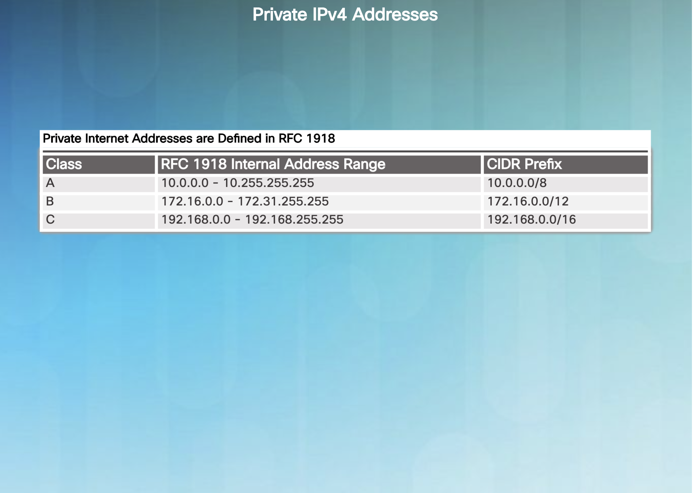

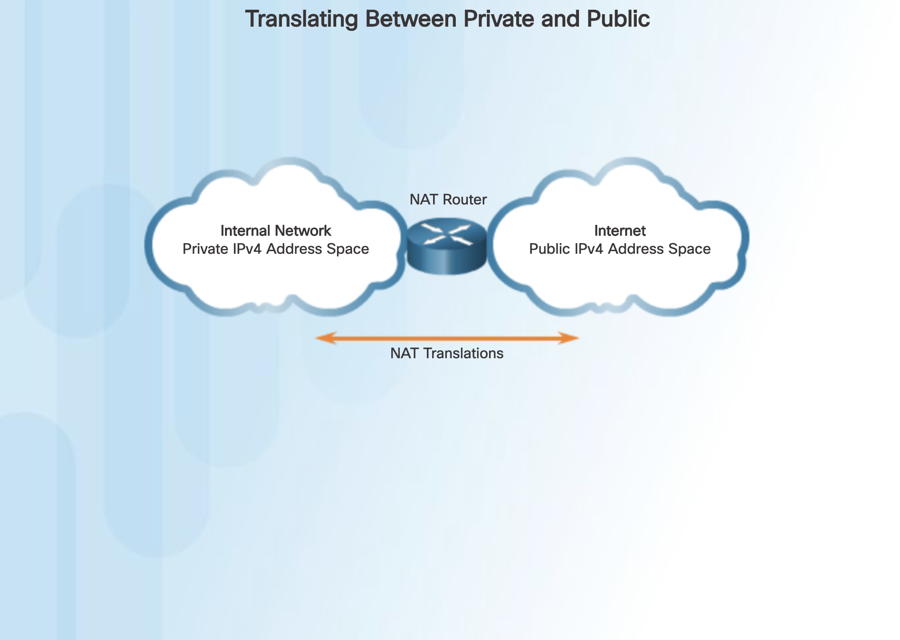

#### 4.6.3.2 NAT-Enabled Routers

NAT-enabled routers can be configured with one or more valid public IPv4 addresses. These public addresses are known as the NAT pool. When an internal device sends traffic out of the network, the NAT-enabled router translates the internal IPv4 address of the device to a public address from the NAT pool. To outside devices, all traffic entering and exiting the network appears to have a public IPv4 address from the provided pool of addresses.

A NAT router typically operates at the border of a stub network. A stub network is a network that has a single connection to its neighboring network, one way in and one way out of the network. In the example in the figure, R2 is a border router. As seen from the ISP, R2 forms a stub network.

When a device inside the stub network wants to communicate with a device outside of its network, the packet is forwarded to the border router. The border router performs the NAT process, translating the internal private address of the device to a public, outside, routable address.

**Note**: The connection to the ISP may use a private address or a public address that is shared among customers. For the purposes of this chapter, a public address is shown.

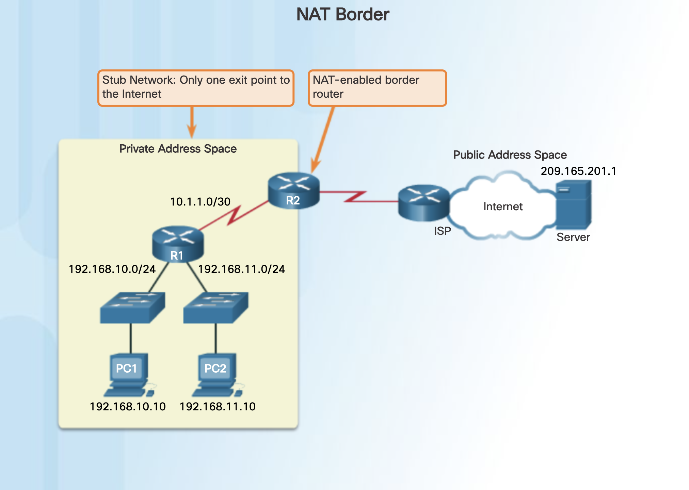

#### 4.6.3.3 Port Address Translation

NAT can be implemented as one-to-one static mappings of private addresses to public addresses, or many internal addresses can be mapped to a single public address. This is known as Port Address Translation (PAT). PAT is quite commonly used in home networks when an ISP provides a single public IP address to the home router. In most homes, multiple devices will require Internet access. PAT allows all of the network devices within the home network to share the single IP address that is provided by the ISP. In larger networks, PAT can be used to map many internal addresses to several public addresses as well.

With PAT, multiple addresses can be mapped to one or to a few addresses, because each private address is also tracked by a port number. When a device initiates a TCP/IP session, it generates a TCP or UDP source port value or a specially assigned query ID for ICMP, to uniquely identify the session. When the NAT router receives a packet from the client, it uses its source port number to uniquely identify the specific NAT translation. The PAT process also validates that the incoming packets were requested, thus adding a degree of security to the session.

Click the Play and Pause buttons in the figure to control the animation. The animation illustrates the PAT process. PAT adds unique source port numbers to the inside global address to distinguish between translations.

As R2 processes each packet, it uses a port number (1331 and 1555, in this example) to identify the device from which the packet originated. The source address (SA) is the inside local address with the TCP/IP assigned port number added. The destination address (DA) is the outside local address with the service port number added. In this example, the service port is 80, which is HTTP.

For the source address, R2 translates the private address (known as an inside local address) to an outside global public address with the port number added. The destination address is not changed, but is now referred to as the outside global IPv4 address. When the web server replies, the path is reversed.

NAT/PAT can complicate cyber-operations because it can hide addressing information in the log files created by network security and monitoring devices.

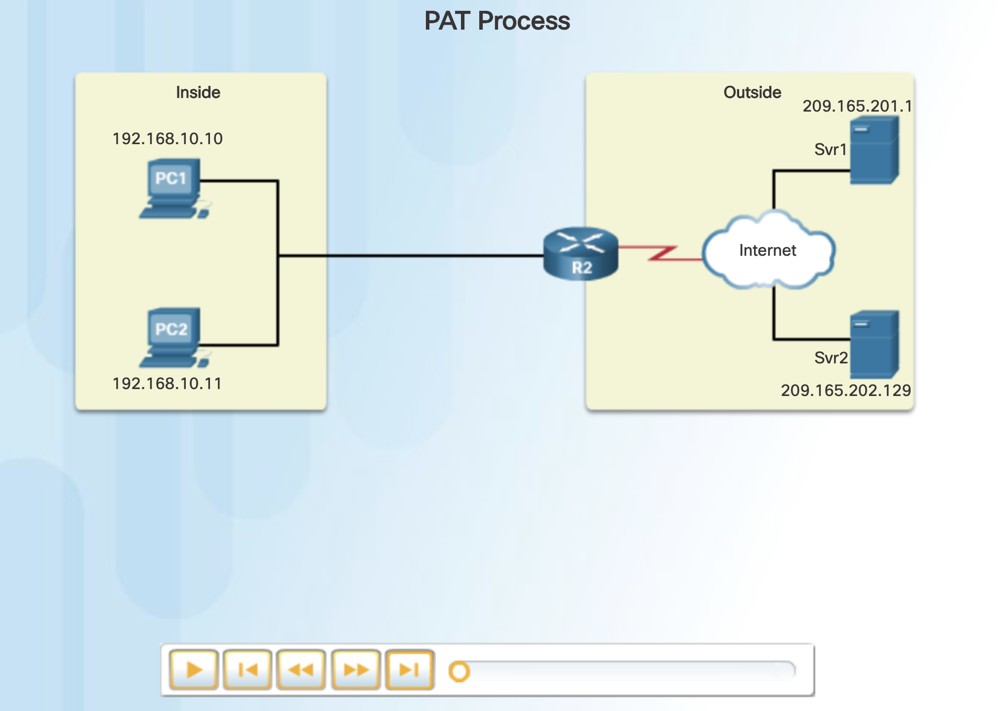

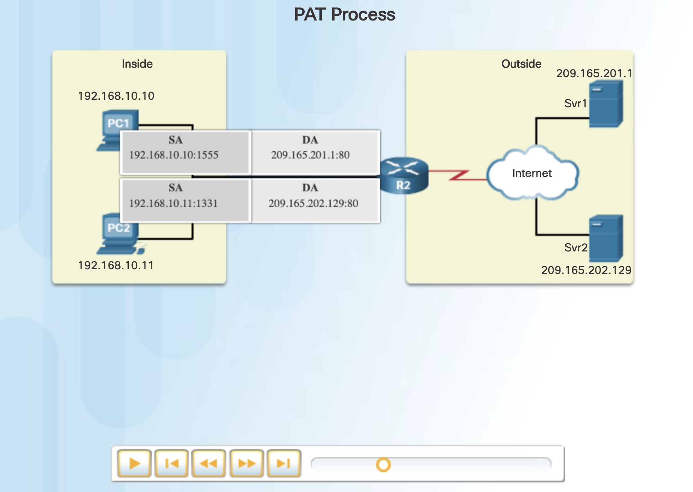

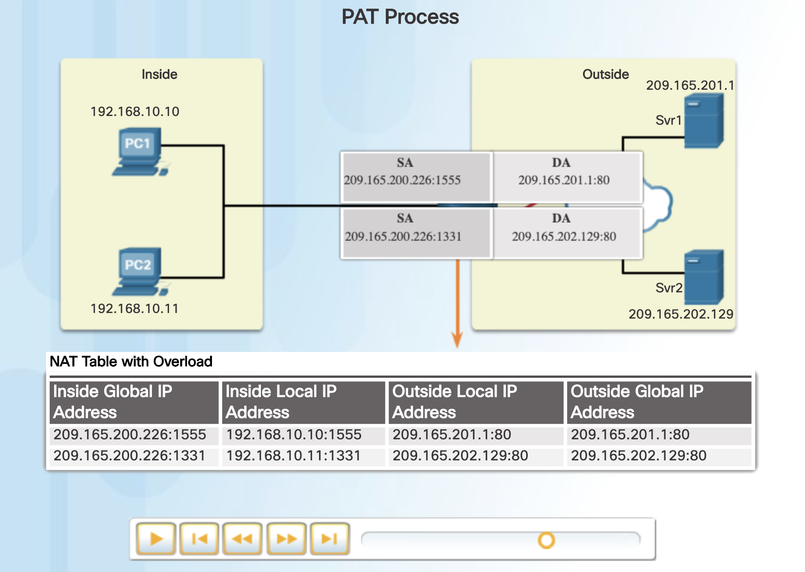

### 4.6.4 File Transfer and Sharing Services

#### 4.6.4.1 FTP and TFTP

**File Transfer Protocol (FTP)**

FTP is another commonly used application layer protocol. FTP was developed to allow for data transfers between a client and a server. An FTP client is an application that runs on a computer that is used to push and pull data from an FTP server.

As Figure 1 illustrates, to successfully transfer data, FTP requires two connections between the client and the server, one for commands and replies, the other for the actual file transfer:

\1. The client establishes the first connection to the server for control traffic using TCP port 21, consisting of client commands and server replies.

\2. The client establishes the second connection to the server for the actual data transfer using TCP port 20. This connection is created every time there is data to be transferred.

The data transfer can happen in either direction. The client can download (pull) data from the server, or the client can upload (push) data to the server.

FTP was not designed to be a secure application layer protocol. For this reason, SSH File Transfer Protocol, which is a secure form of FTP that uses Secure Shell protocol to provide a secure channel, is the preferred file transfer implementation.

**Trivial File Transfer Protocol (TFTP)**

TFTP is a simplified file transfer protocol that uses well-known UDP port number 69. It lacks many of the features of FTP, such as the file management operations of listing, deleting, or renaming files. Because of its simplicity, TFTP has a very low network overhead and is popular for non-critical file transfer applications. It is fundamentally insecure however, because it has no login or access control features. For this reason, TFTP needs to implemented carefully, and only when absolutely necessary.

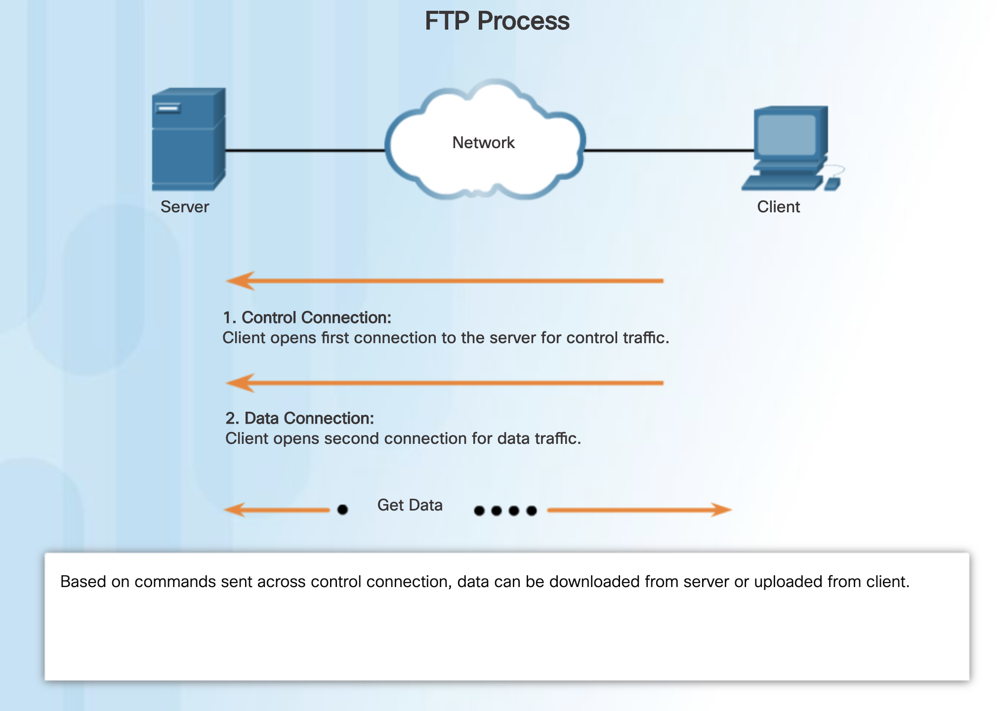

#### 4.6.4.2 SMB

The Server Message Block (SMB) is a client/server file sharing protocol that describes the structure of shared network resources, such as directories, files, printers, and serial ports, as shown in Figure 1. It is a request-response protocol. All SMB messages share a common format. This format uses a fixed-sized header, followed by a variable-sized parameter and data component.

SMB messages can start, authenticate, and terminate sessions, control file and printer access, and allow an application to send or receive messages to or from another device.

SMB file sharing and print services have become the mainstay of Microsoft networking, as shown in Figure 2.

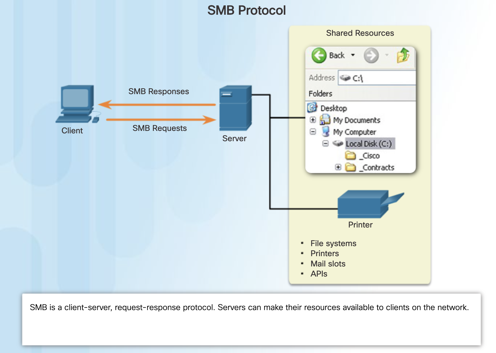

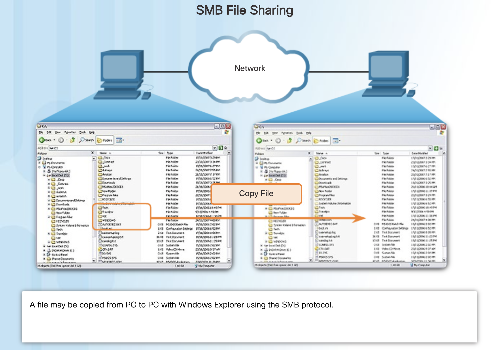

#### 4.6.4.3 Lab - Using Wireshark to Examine TCP and UDP Captures

In this lab, you will complete the following objectives:

- Identify TCP Header Fields and Operation Using a Wireshark FTP Session Capture

- Identify UDP Header Fields and Operation Using a Wireshark TFTP Session Capture

[Lab - Using Wireshark to Examine TCP and UDP Captures](https://static-course-assets.s3.amazonaws.com/CyberOps11/en/course/files/4.6.4.3 Lab - Using Wireshark to Examine TCP and UDP Captures.pdf)

### 4.6.5 Email

#### 4.6.5.1 Email Overview

Email is an essential network application. To run on a computer or other end device, it requires several applications and services, as shown in the figure. Email is a store-and-forward method of sending, storing, and retrieving electronic messages across a network. Email messages are stored in databases on mail servers.

Email clients communicate with mail servers to send and receive email. Mail servers communicate with other mail servers to transport messages from one domain to another. An email client does not communicate directly with another email client when sending email. Instead, both clients rely on the mail server to transport messages.

Email supports three separate protocols for operation: Simple Mail Transfer Protocol (SMTP), Post Office Protocol version 3 (POP3), and IMAP. The application layer process that sends mail uses SMTP. A client retrieves email, however, using one of the two application layer protocols: POP3 or IMAP.

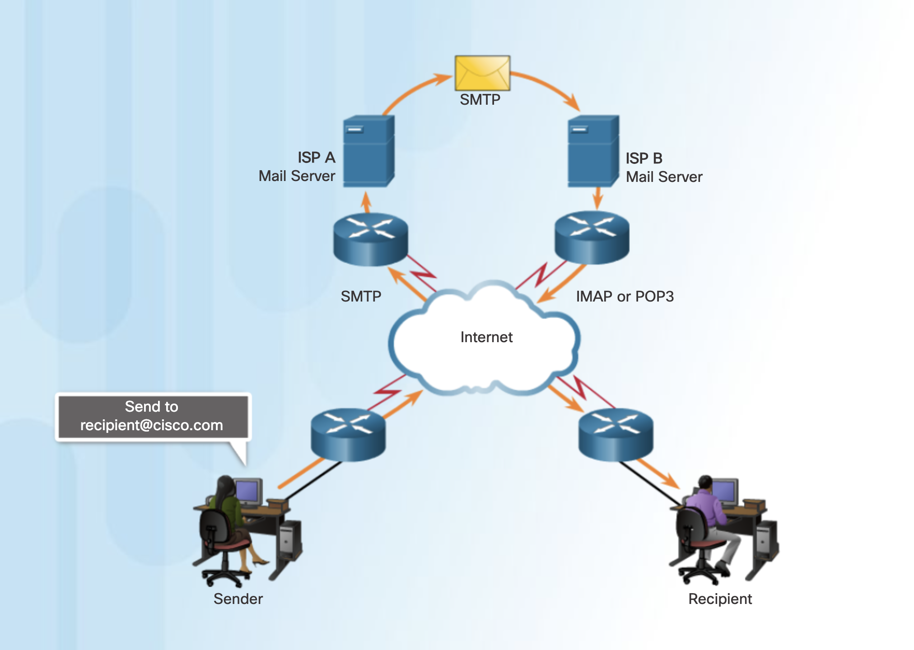

#### 4.6.5.2 SMTP

SMTP message formats require a message header and a message body. While the message body can contain any amount of text, the message header must have a properly formatted recipient email address and a sender address.

When a client sends email, the client SMTP process connects with a server SMTP process on well-known port 25. After the connection is made, the client attempts to send the email to the server across the connection. When the server receives the message, it either places the message in a local account, if the recipient is local, or forwards the message to another mail server for delivery, as shown in the figure.

The destination email server may not be online or may be busy when email messages are sent. Therefore, SMTP spools messages to be sent at a later time. Periodically, the server checks the queue for messages and attempts to send them again. If the message is still not delivered after a predetermined expiration time, it is returned to the sender as undeliverable.

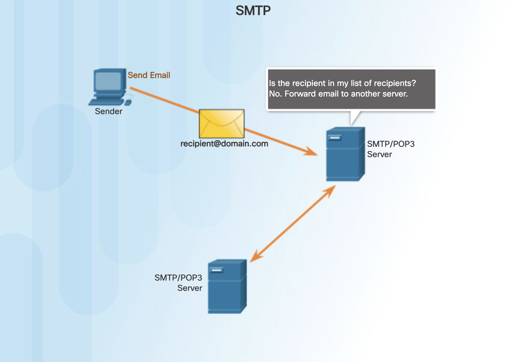

#### 4.6.5.3 POP3

POP3 is used by an application to retrieve mail from a mail server. With POP3, mail is downloaded from the server to the client and then deleted on the server, as shown in the figure.

The server starts the POP3 service by passively listening on TCP port 110 for client connection requests. When a client wants to make use of the service, it sends a request to establish a TCP connection with the server. When the connection is established, the POP3 server sends a greeting. The client and POP3 server then exchange commands and responses until the connection is closed or aborted.

With POP3, email messages are downloaded to the client and removed from the server, so there is no centralized location where email messages are kept. Because POP3 does not store messages, it is undesirable for a small business that needs a centralized backup solution.

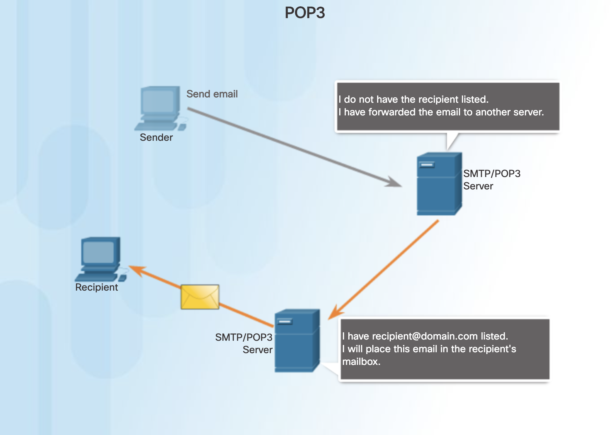

#### 4.6.5.4 IMAP

IMAP is another protocol that describes a method to retrieve email messages, as shown in the figure. Unlike POP3, when the user connects to an IMAP-capable server, copies of the messages are downloaded to the client application. The original messages are kept on the server until manually deleted. Users view copies of the messages in their email client software.

Users can create a file hierarchy on the server to organize and store mail. That file structure is duplicated on the email client as well. When a user decides to delete a message, the server synchronizes that action and deletes the message from the server.

Click [here](http://www.cisco.com/web/about/ac123/ac147/ac174/ac196/about_cisco_ipj_archive_article09186a00800c84ea.html) to learn more about email protocols.

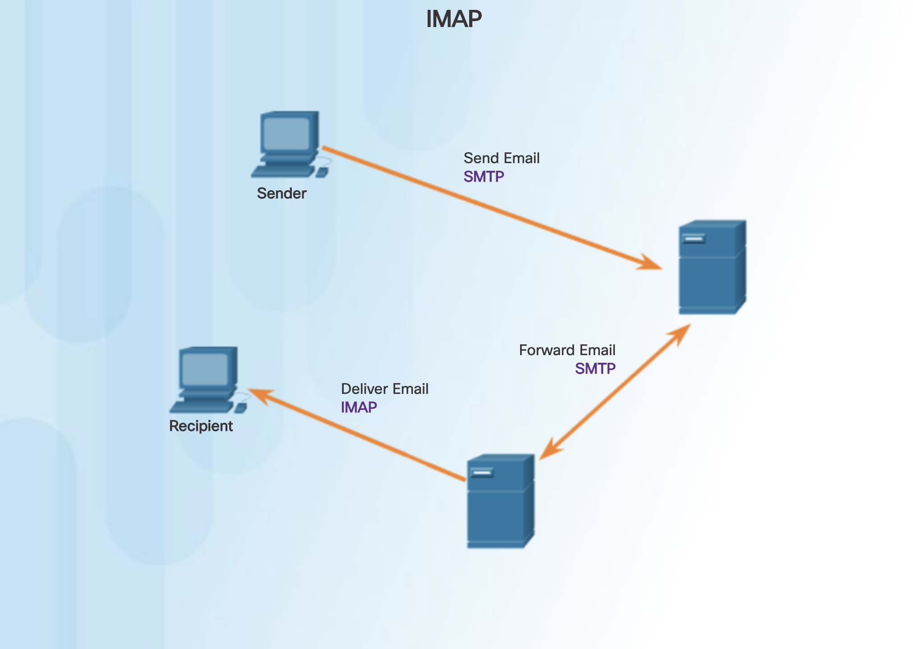

### 4.6.6 HTTP

#### 4.6.6.1 HTTP Overview

To better understand how the web browser and web server interact, we can examine how a web page is opened in a browser. For this example, use the URL http://www.cisco.com, as shown in Figure 1.

First, the browser interprets the three parts of the URL:

- **http** (the protocol or scheme)
- **www.cisco.com** (the server name)
- **index.html** (the default home page is requested)

**Note**: Web servers typically display the home page, index.html, as the default page if no other page is specified. You do not need to enter the full path including the /index.html. In fact, you can simply enter cisco.com. Regardless of whether you enter cisco.com, www.cisco.com, or www.cisco.com/index.html, the web server will display the same home page, index.html.

As shown in Figure 2, the browser then checks with a name server to convert www.cisco.com into a numeric IP address, which it uses to connect to the server. Using HTTP requirements, the browser sends a GET request to the server and asks for the index.html file. The server, as shown in Figure 3, sends the HTML code for this web page to the browser. Finally, as shown in Figure 4, the browser deciphers the HTML code and formats the page for the browser window.

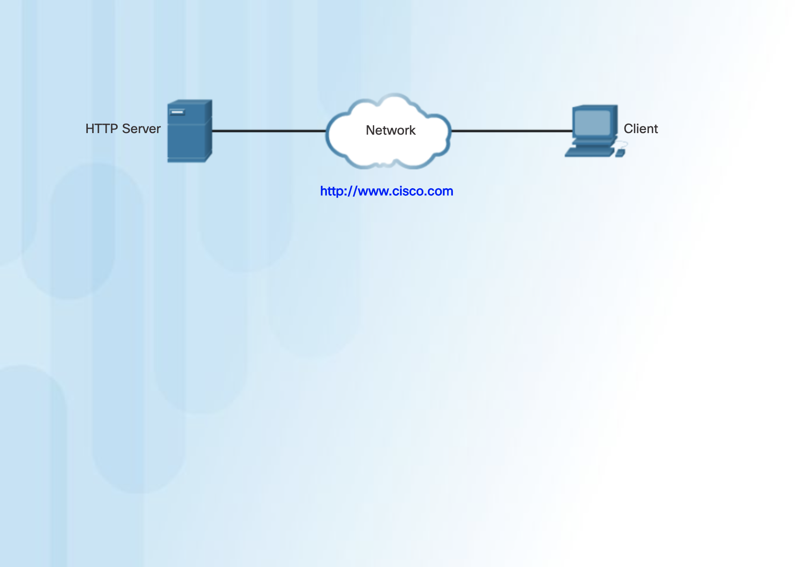

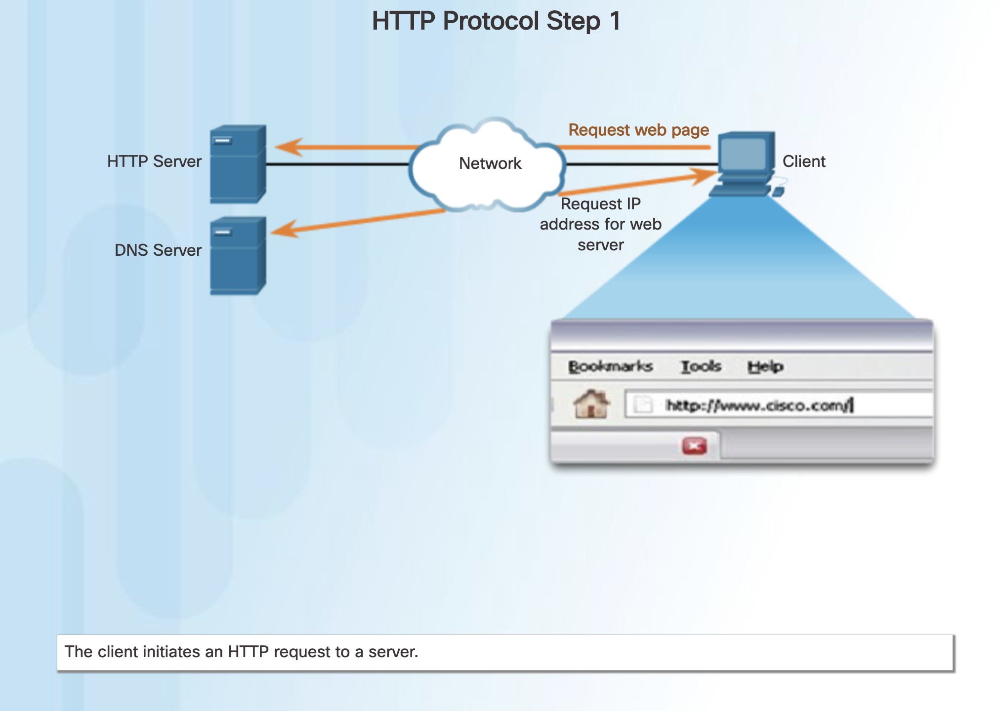

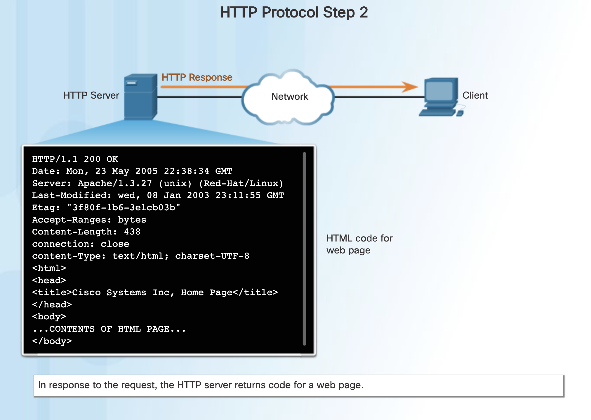

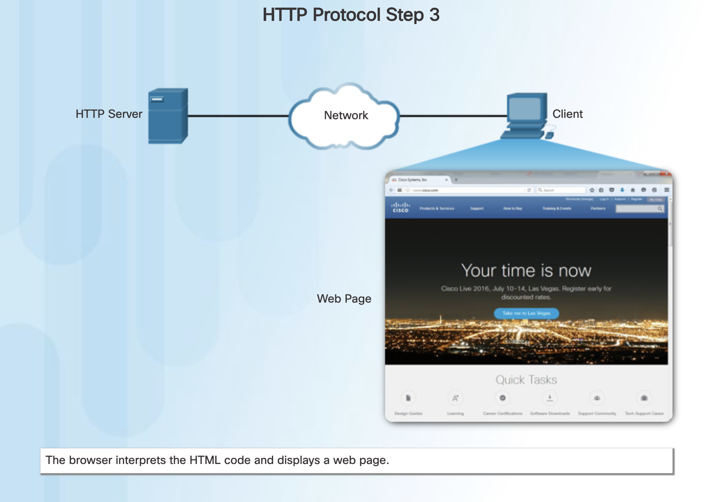

#### 4.6.6.2 The HTTP URL

HTTP URLs can also specify the port on the server that should handle the HTTP methods. In addition, it can specify a query string and fragment. The query string typically contains information that is not handled by the HTTP server process itself, but is instead handled by another process that is running on the server. Query strings are preceded by a “?” character and typically consist of a series of name and value pairs. A fragment is preceded by a “#” character. It refers to a subordinate part of the resource that is requested in the URL. For example, a fragment could refer to a named anchor in an HTML document. The URL will access the document and then move to the part of the document specified by the fragment if a matching named anchor link exists in the document. An HTTP URL that includes these parts is shown in the figure.

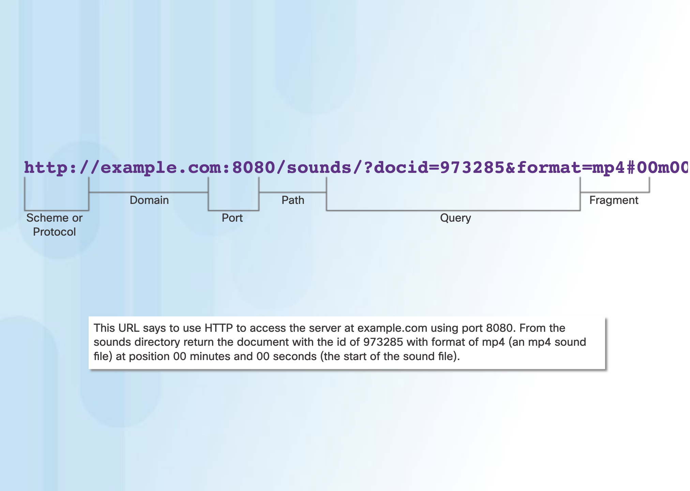

#### 4.6.6.3 The HTTP Protocol

HTTP is a request/response protocol that uses TCP port 80, although other ports can be used. When a client, typically a web browser, sends a request to a web server, it will use one of six methods that are specified by the HTTP protocol.

- **GET** - A client request for data. A client (web browser) sends the GET message to the web server to request HTML pages, as shown in the figure.

- **POST** - Submits data to be processed by a resource.

- **PUT** - Uploads resources or content to the web server such as an image.

- **DELETE** - Deletes the resource specified.

- **OPTIONS** - Returns the HTTP methods that the server supports.

- **CONNECT** - Requests that an HTTP proxy server forwards the HTTP TCP session to the desired destination.

Although HTTP is remarkably flexible, it is not a secure protocol. The request messages send information to the server in plaintext that can be intercepted and read. The server responses, typically HTML pages, are also unencrypted.

**Securing HTTP**

For secure communication across the Internet, the HTTP Secure (HTTPS) protocol is used. HTTPS uses TCP port 443. HTTPS uses authentication and encryption to secure data as it travels between the client and server. HTTPS uses the same client request-server response process as HTTP, but the data stream is encrypted with Secure Socket Layer (SSL), or Transport Layer Security (TLS), before being transported across the network. Although SSL is the predecessor to TLS, both protocols are often referred to as SSL.

Much confidential information, such as passwords, credit card information, and medical information are transmitted over the Internet using HTTPS.

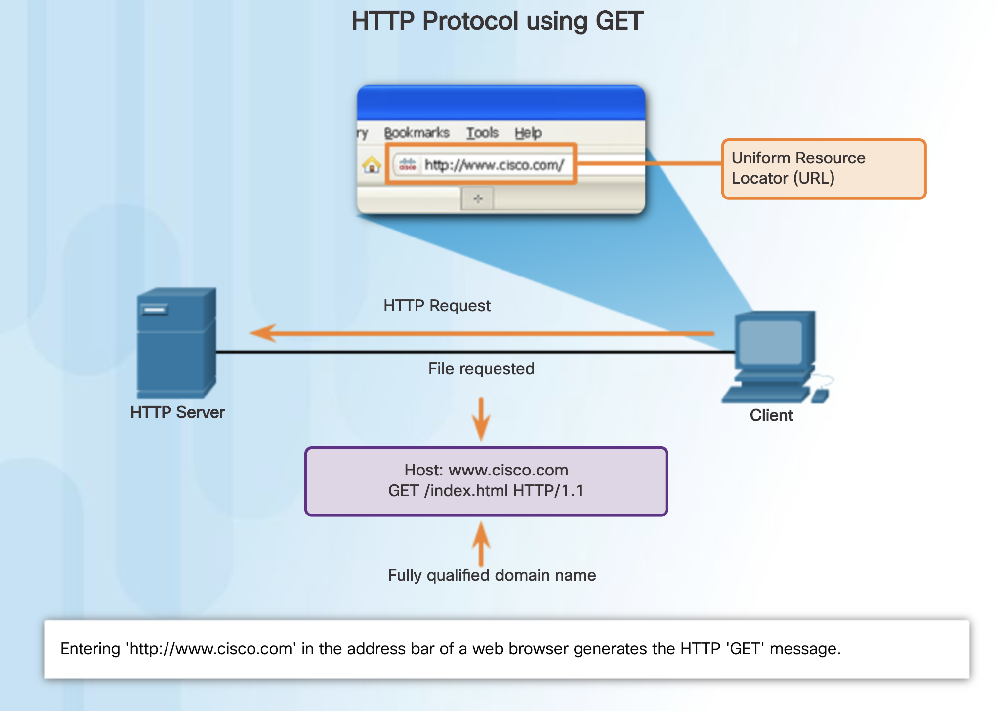

#### 4.6.6.4 HTTP Status Codes

The HTTP server responses are identified with various status codes that inform the host application of the outcome of client requests to the server. The codes are organized into five groups. The codes are numeric, with the first number in the code indicating the type of message. The five status code groups are:

- **1xx** - Informational
- **2xx** - Success
- **3xx** - Redirection
- **4xx** - Client Error
- **5xx** - Server Error

An explanation of some common status codes is shown in the figure. Click [here](http://www.restapitutorial.com/httpstatuscodes.html) for a detailed list of all status codes with explanations.

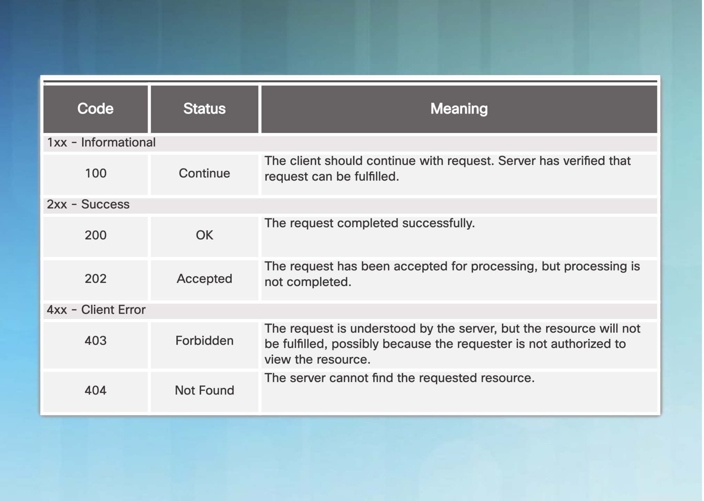

#### 4.6.6.5 Lab - Using Wireshark to Examine HTTP and HTTPS Traffic

In this lab, you will complete the following objectives:

- Capture and view HTTP traffic
- Capture and view HTTPS traffic

[Lab - Using Wireshark to Examine HTTP and HTTPS Traffic](https://static-course-assets.s3.amazonaws.com/CyberOps11/en/course/files/4.6.6.5 Lab - Using Wireshark to Examine HTTP and HTTPS Traffic.pdf)

## 4.7 Summary

### 4.7.1 Conclusion

#### 4.7.1.1 Chapter 4: Network Protocols and Services

In this chapter, you learned the basic operation of network protocols and services. Networks come in all sizes, from small, home office networks to the Internet. Protocols are the rules for how traffic is sent across networks. Networking engineers use two models to understand and communicate the operation of protocols: the OSI model and the TCP/IP model. Regardless of the model used, the process of encapsulation describes how data is formatted for transmission across the network so that the destination can receive and de-encapsulate the data.

Ethernet operates at Layer 2 of the OSI model. Ethernet is responsible for encapsulating the upper layer data in a frame, which includes source and destination MAC addresses. MAC addresses are used on the LAN to locate either the destination or the default gateway.

IP operates at Layer 3 of the OSI model. IP comes in two versions: IPv4 and IPv6. Although IPv4 is being replaced by IPv6, IPv4 is still prevalent on today's networks. IPv4 uses a 32-bit address space represented in dotted decimal format, such as 192.168.1.1. IPv6 uses a 128-bit address space represented in hexadecimal format. In IPv6, you can omit leading zeros in each hextet and omit one "all zeros" segment, such as 2001:0DB8:0000:1111:0000:0000:0000:0200 represented as 2001:DB8:0:1111::200.

ICMP is used primarily for testing end-to-end connectivity from source to destination. ICMP for IPv4 is different than ICMP for IPv6. ICMP for IPv6 includes router solicitation, router advertisements, and duplicate address detection. The ping and traceroute utilities both use a feature of ICMP. Ping is used to test connectivity between two hosts but does not provide information about the details of devices between the hosts. Traceroute (tracert) is a utility that generates a list of hops that were successfully reached along the path.

ARP operates between Layer 2 and Layer 3, mapping MAC addresses to IP addresses. Before a host can send traffic to a remote network, it must know the MAC address for the default gateway. The host already knows the IP address for the default gateway. For example, a host with an IP address 192.168.1.10 might have a default gateway configured of 192.168.1.1. The host uses an ARP request to ask "Who is 192.168.1.1?" The default gateway will reply with its own MAC address. At that point, the host has mapped the IP address to the default gateway's MAC address and can now construct the frame to send data to a remote network.

The transport layer is responsible for separating the data from the application layer into segments that can be sent down to the network layer. TCP is the transport layer protocol used when all the data must arrive at the destination in the correct order. UDP is the transport layer protocol used when the application can tolerate some data loss during transmission.

At the application, there are several important network services that the cybersecurity analysts should be aware of:

- **DHCP** – This automates the assignment of IPv4 addresses, subnet masks, gateways, and other IPv4 networking parameters.
- **DNS** – This provides a reliable means of managing and providing domain names and their associated IP addresses.
- **NAT** - This translates between private and public IPv4 addresses.
- **File Transfer** - Applications such as FTP, TFTP, and SMB can be used to transfer files from one host to another.
- **Email** – This requires several applications and services including POP3, IMAP, and SMTP.
- **HTTP** – This protocol is used to send and receive web pages.

