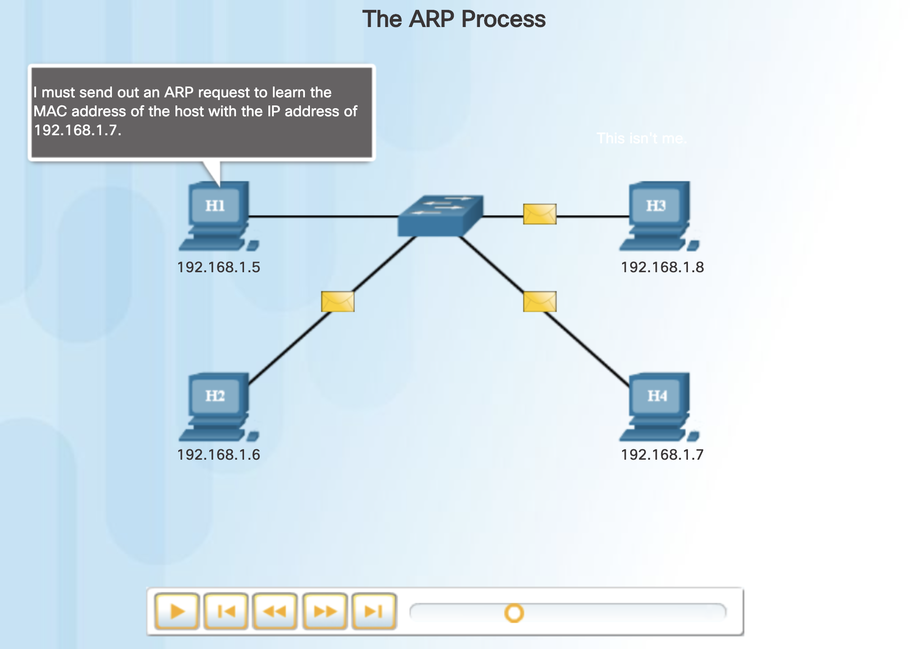
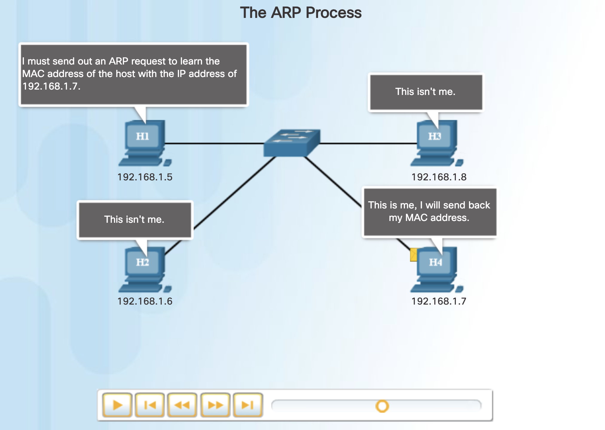
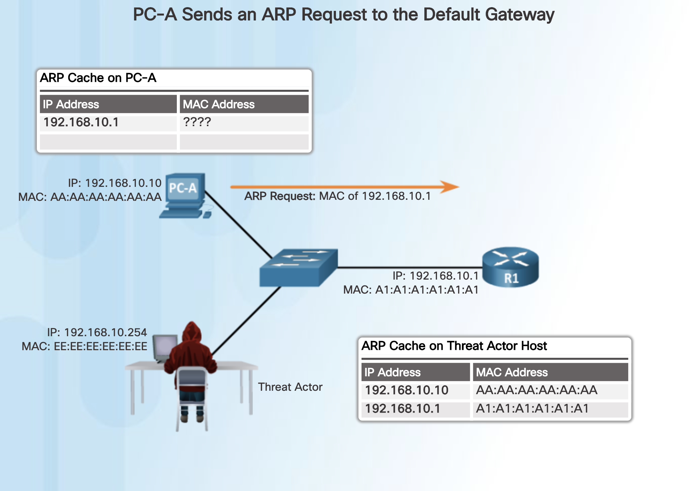
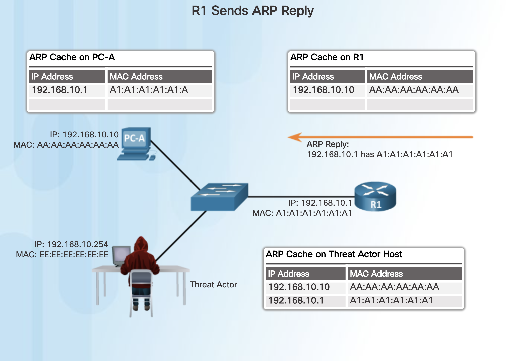
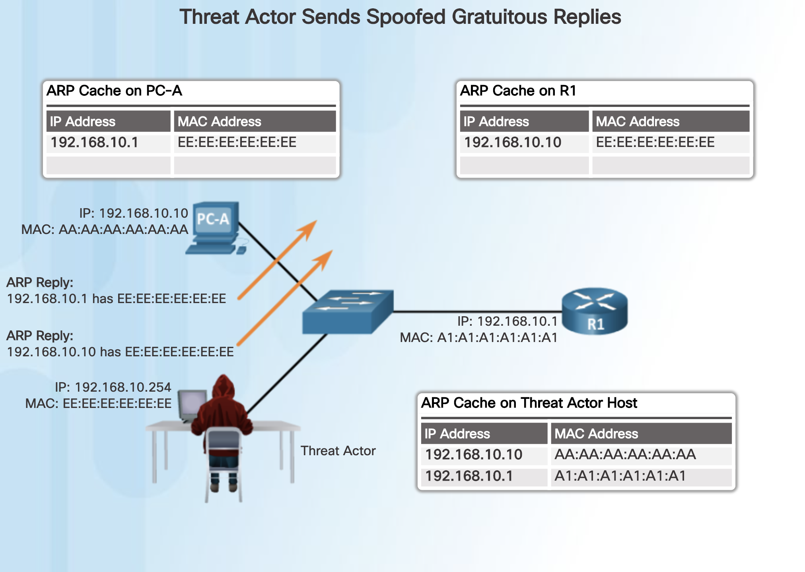

Chapter 7
Network Attacks: A Deeper Look
7.0 Introduction
7.0.1 Welcome
7.0.1.1 Chapter 7: Network Attacks: A Deeper Look
7.0.1.2 Class Activity – What’s Going On?
7.1 Network Monitoring and Tools
7.1.1 Introduction to Network Monitoring
7.1.1.1 Network Security Topology
7.1.1.2 Network Monitoring Methods
7.1.1.3 Network Taps
7.1.1.4 Traffic Mirroring and SPAN
7.1.2 Introduction to Network Monitoring Tools
7.1.2.1 Network Security Monitoring Tools
7.1.2.2 Network Protocol Analyzers
7.1.2.3 NetFlow
7.1.2.4 SIEM
7.1.2.5 SIEM Systems
7.1.2.6 Activity - Identify the Network Monitoring Tool
7.1.2.7 Packet Tracer - Logging Network Activity
7.2 Attacking the Foundation
7.2.1 IP Vulnerabilities and Threats
7.2.1.1 IPv4 and IPv6
7.2.1.2 The IPv4 Packet Header
7.2.1.3 The IPv6 Packet Header
7.2.1.4 IP Vulnerabilities
7.2.1.5 ICMP Attacks
7.2.1.6 DoS Attacks
7.2.1.7 Amplification and Reflection Attacks
7.2.1.8 DDoS Attacks
7.2.1.9 Address Spoofing Attacks
7.2.1.10 Activity - Identify the IP Vulnerability
7.2.2 TCP and UDP Vulnerabilities
7.2.2.1 TCP
7.2.2.2 TCP Attacks
7.2.2.3 UDP and UDP Attacks
7.3 Attacking What We Do

### 7.3.1 IP Services

#### 7.3.1.1 ARP Vulnerabilities

Hosts broadcast an ARP Request to other hosts on the segment to determine the MAC address of a host with a particular IP address. All hosts on the subnet receive and process the ARP Request. The host with the matching IP address in the ARP Request sends an ARP Reply.

Any client can send an unsolicited ARP Reply called a “gratuitous ARP.” This is often done when a device first boots up to inform all other devices on the local network of the new device’s MAC address. When a host sends a gratuitous ARP, other hosts on the subnet store the MAC address and IP address contained in the gratuitous ARP in their ARP tables.

However, this feature of ARP also means that any host can claim to be the owner of any IP/MAC they choose. A threat actor can poison the ARP cache of devices on the local network, creating an MITM attack to redirect traffic. The goal is to target a victim host and have it change its default gateway to the threat actor’s device. This positions the threat actor in between the victim and all other systems outside of the local subnet.

#### 7.3.1.2 ARP Cache Poisoning

To see how ARP cache poisoning works, consider the following example. In Figure 1, PC-A requires the MAC address of its default gateway (R1) and therefore, it sends an ARP Request for the MAC address of 192.168.10.1.

In Figure 2, R1 updates its ARP cache with the IP and MAC addresses of PC-A and sends an ARP Reply to PC-A, which then updates its ARP cache with the IP and MAC addresses of R1.

In Figure 3, the threat actor sends **two spoofed gratuitous ARP Replies** using its own MAC address for the indicated destination IP addresses. PC-A updates its ARP cache with its default gateway now pointing to the threat actor’s host MAC. R1 also updates its ARP cache with the IP address of PC-A pointing to the threat actor’s MAC address.

The threat actor’s host is now doing an ARP poisoning attack.

**Note**: There are many tools available on the Internet to create ARP MITM attacks including dsniff, Cain & Abel, ettercap, Yersinia, and others.

The ARP poisoning attack can be:

- **Passive** - Threat actors steal confidential information.

- **Active** - Threat actors modify data in transit or inject malicious data.

#### 7.3.1.3 DNS Attacks

#### 7.3.1.4 DNS Tunneling

#### 7.3.1.5 DHCP

#### 7.3.1.6 Lab - Exploring DNS Traffic

7.3.2 Enterprise Services
7.3.2.1 HTTP and HTTPS
7.3.2.2 Email
7.3.2.3 Web-Exposed Databases
7.3.2.4 Lab - Attacking a MySQL Database
7.3.2.5 Lab - Reading Server Logs
7.4 Summary
7.4.1 Conclusion
7.4.1.1 Chapter 7: Network Attack: A Deeper Look