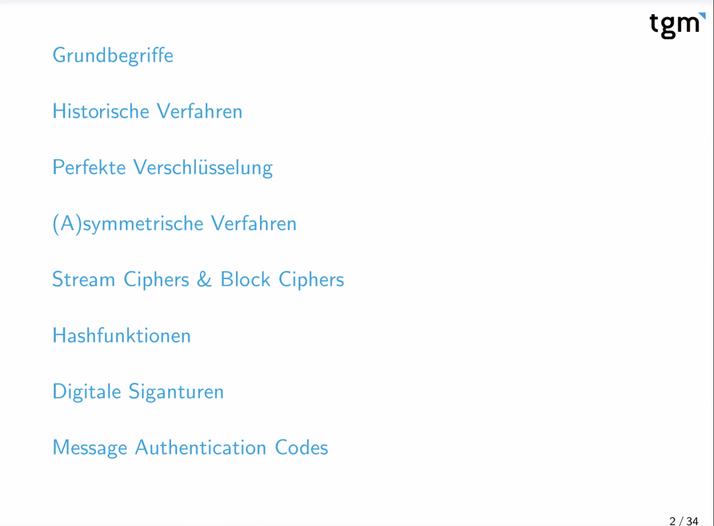
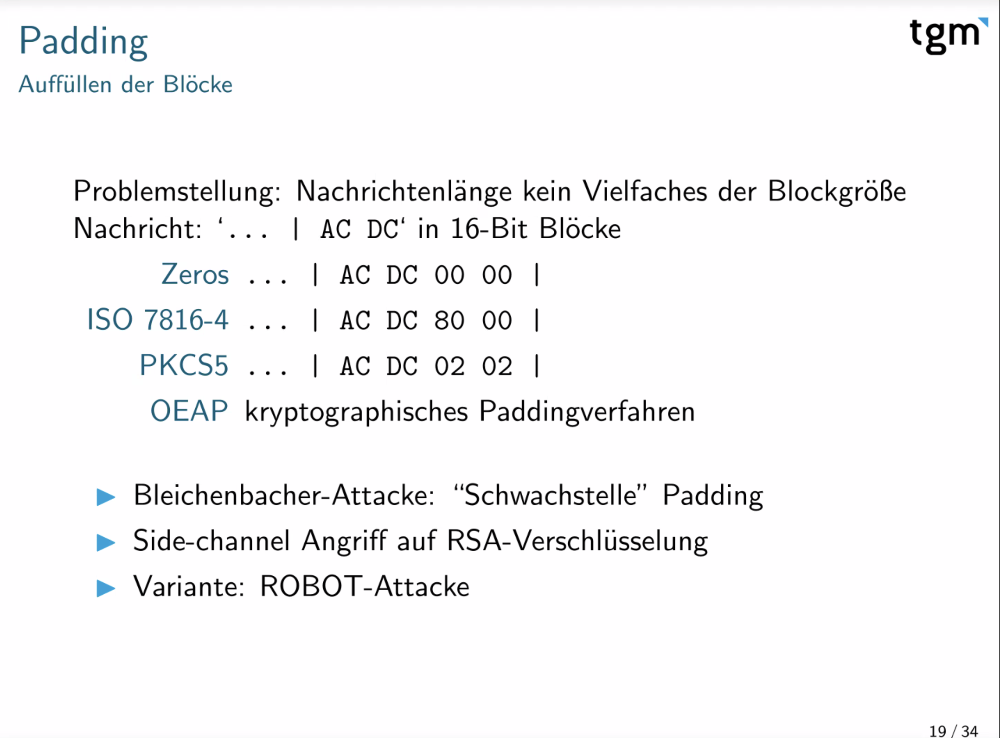

# Angewandte Kryptographie

Christoph Roschger

TGM Wien

Technische Richtlinie des BSI zu Kryptoverfahren:

[BSI TR-02102 Kryptographische Verfahren: Empfehlungen und Schlüssellängen](https://www.bsi.bund.de/DE/Themen/Unternehmen-und-Organisationen/Standards-und-Zertifizierung/Technische-Richtlinien/TR-nach-Thema-sortiert/tr02102/tr-02102.html)

First Rule: Don't implement yourself

RSA: Bleichenbacher Attacke

Online-Tools

[[CyberChef - The Cyber Swiss Army Knife](https://gchq.github.io/CyberChef/)](https://gchq.github.io/CyberChef/) !!!

oder auch [CrypTool](https://www.cryptool.org/en/)

Angriff auf verschlüsselte Email: [EFAIL](https://efail.de) – Hinweis Grafik hat Fehler, Empfehlung Grafik aus dem Paper nehmen.

[Google Tink](https://developers.google.com/tink)

