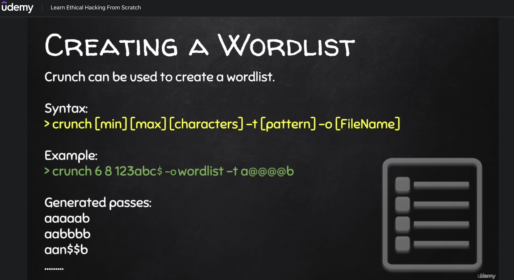

Video 28 – Creating a Wordlist

`crunch`



Aber crunch kann noch viel mehr!

Einige Links zu Wortlisten

```
ftp://ftp.openwall.com/pub/wordlists/
http://www.openwall.com/mirrors/
https://github.com/danielmiessler/SecLists
http://www.outpost9.com/files/WordLists.html
http://www.vulnerabilityassessment.co.uk/passwords.htm
http://packetstormsecurity.org/Crackers/wordlists/
http://www.ai.uga.edu/ftplib/natural-language/moby/
http://www.cotse.com/tools/wordlists1.htm
http://www.cotse.com/tools/wordlists2.htm
http://wordlist.sourceforge.net/
```


---

#### Übung (Passwort Cracking)

Du konntest jemand beim eingeben seines Passworts beobachten, das Passwort beginnt mit einem a und endet mit einer Zahl. Die shift Taste scheint nie gedrückt worden zu sein. Außerdem wurden die Buchstaben nur mit der linken Hand getippt, von asdf ausgehen wurde nur diese und die darunterliegende Zeile, sowie die beiden Buchstaben rechts davon verwendet. Es kann weiters angenommen werden dass kein Buchstabe doppelt vorkommt.

Du bist außerdem in den Besitz des password Files gekommen, der User heißt.

Knacke das Passwort in dem du mit `crunch` eine passende Wortliste generierst.

---

