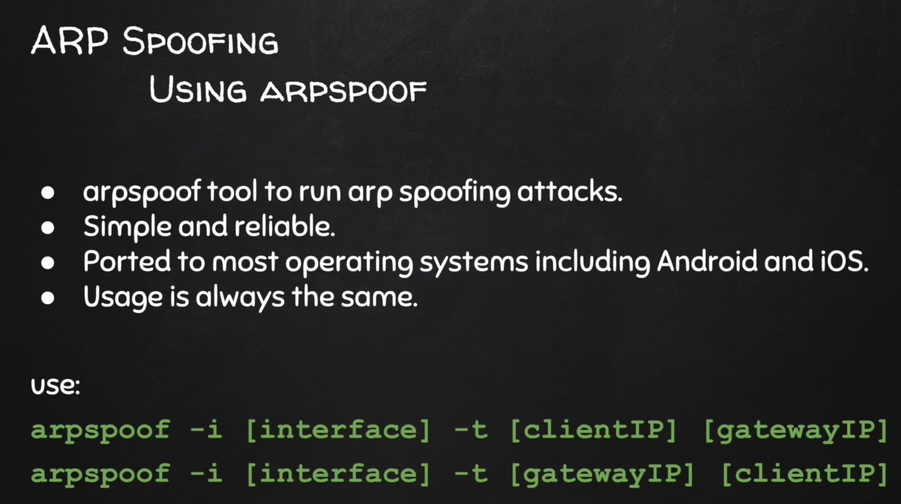
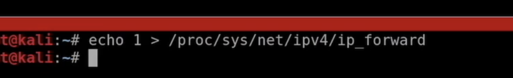
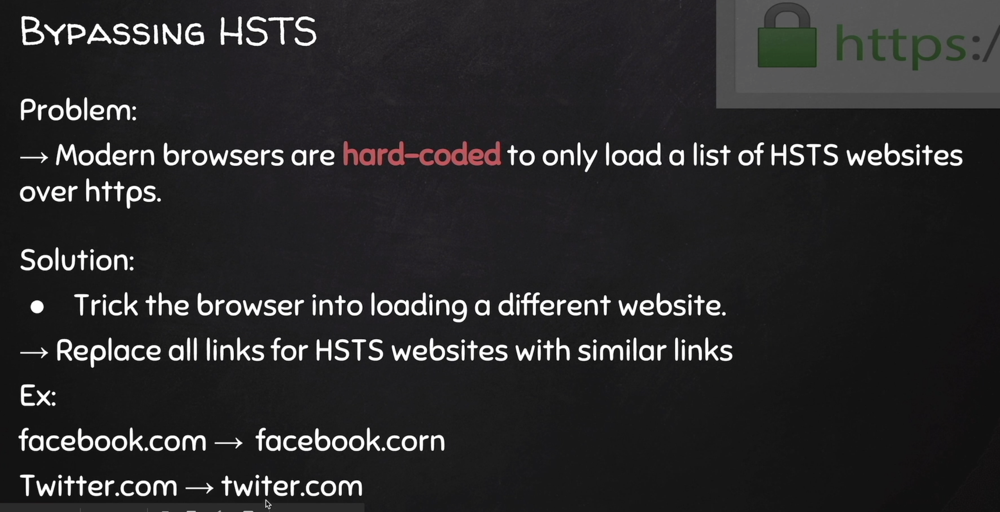

ARP Spoofing




```sh
$ arpspoof -i eth0 -t <>  <>
```

IP forwarding unter Linux muss aktiviert werden




# Bettercap

[Siehe hier](./bettercap)


# https

Downgrade HTTPS to HTTP

SSLstrip bzw. auch mit Bettercap.


# HSTS

HTTP Strict Transport Security

Browser sind hard-coded (Liste im Browser) diese Seiten nur über HTTPS zu laden – kein Downgrade auf HTTP möglich.

Solution: trick the browser to load a different web-site




# DNS Spoofing

[Siehe Bettercap](./bettercap)


# Injecting Java Script Code

Video 46. Mit Bettercap. 


# Wireshark

Video 48-51

Speichern der Netzwerkkommunikation in Bettercap:

```
set net.sniff.output capturefile.cap
```

Kann später in Wireshark ausgewertet werden.

