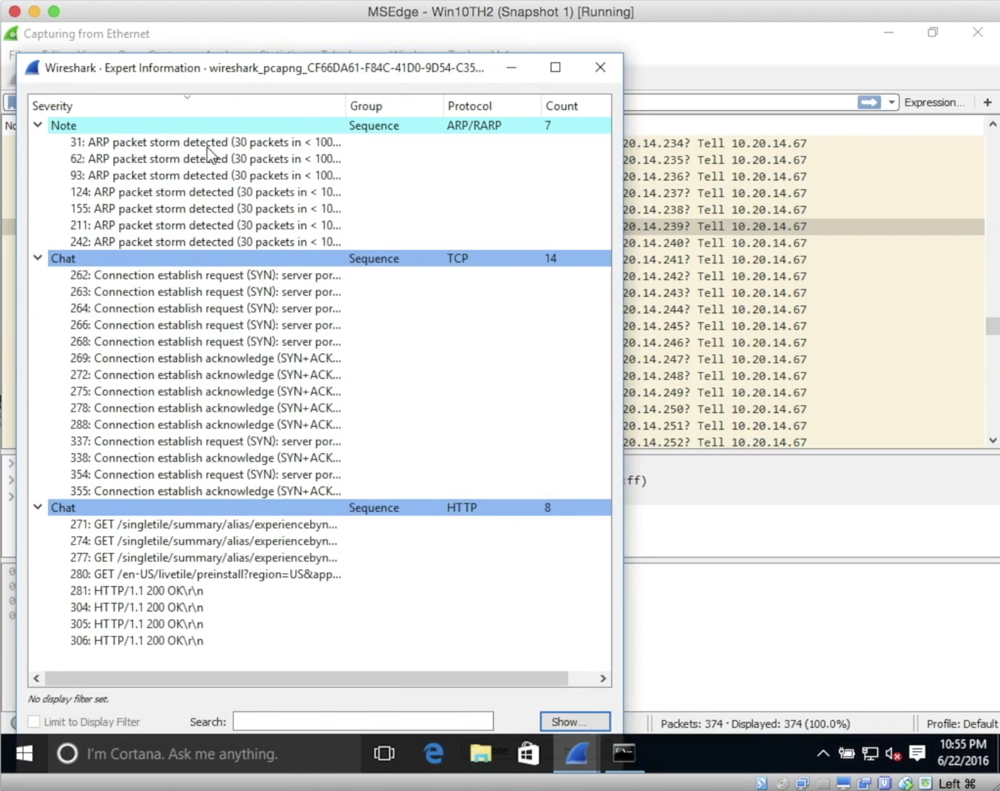
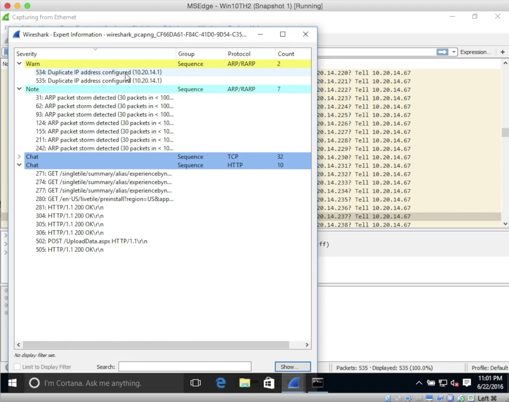

# Xarp

ARP cache poisoning erkennen. Tool xarp ([homepage](http://www.xarp.net/))

# Wireshark

Verdächtige Netzwerkaktivitäten feststellen mit Wireshark

Edit > Preferences... > Protocols > ARP > Detect ARP request Storms

... Aufzeichnung ... z.B. ARP Scan

Dann

Analyze > Expert Information

Bei ARP cache poisoning:

Verhindern von ARP poisoning:

- Einträge in der ARP Tabelle auf static ändern (statt dynamisch) – jede MAC Adresse muss manuell konfiguriert werden. Mühsam aber sehr sicher.

# MITM Detection & Prevention

- Video 56: HTTPS encryption (z.B. Firefox Plugin HTTPS everywhere, quasi HSTS für alle Websites)
  - Kein Schutz gegen DNS Spoofing
- Video 57: VPN

