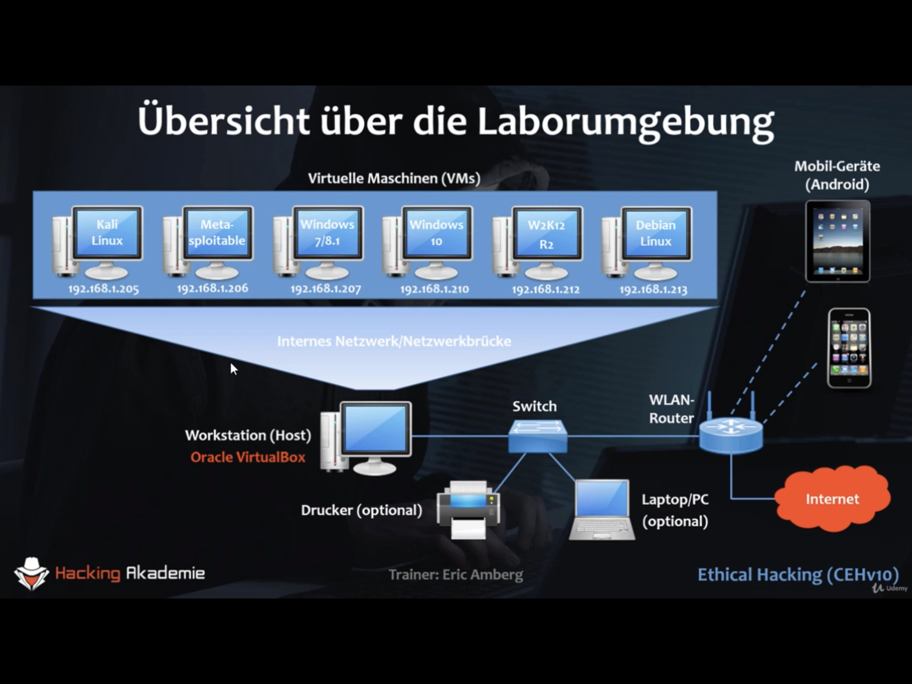
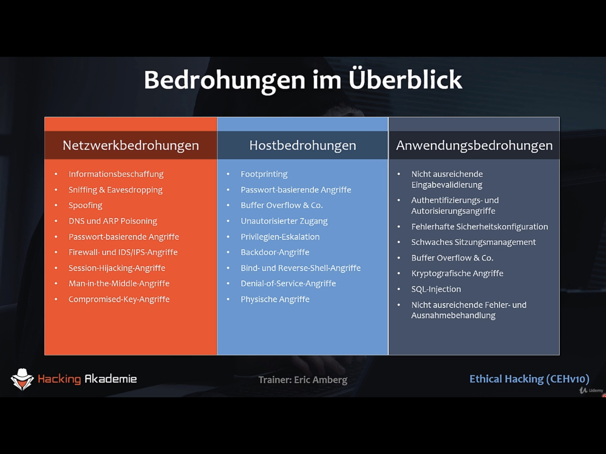
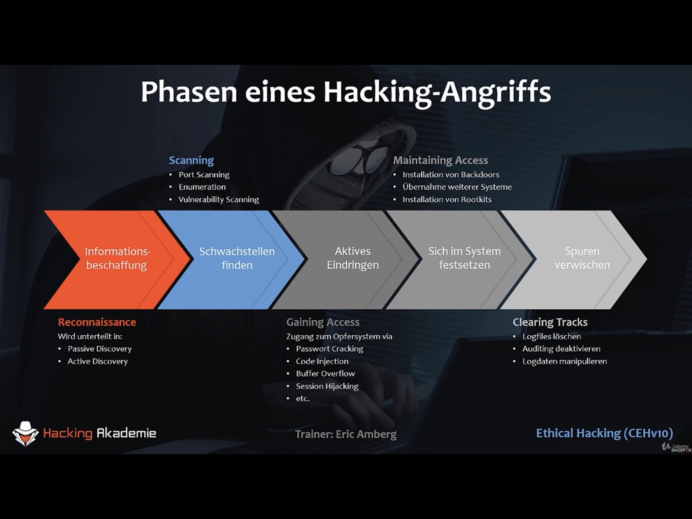
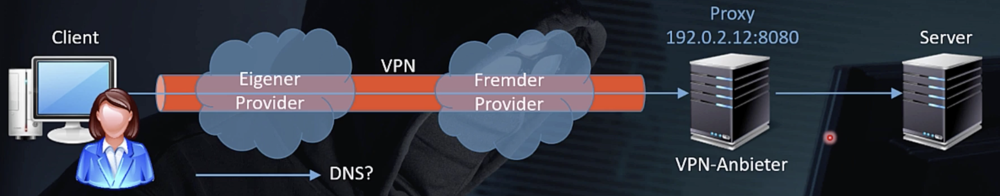
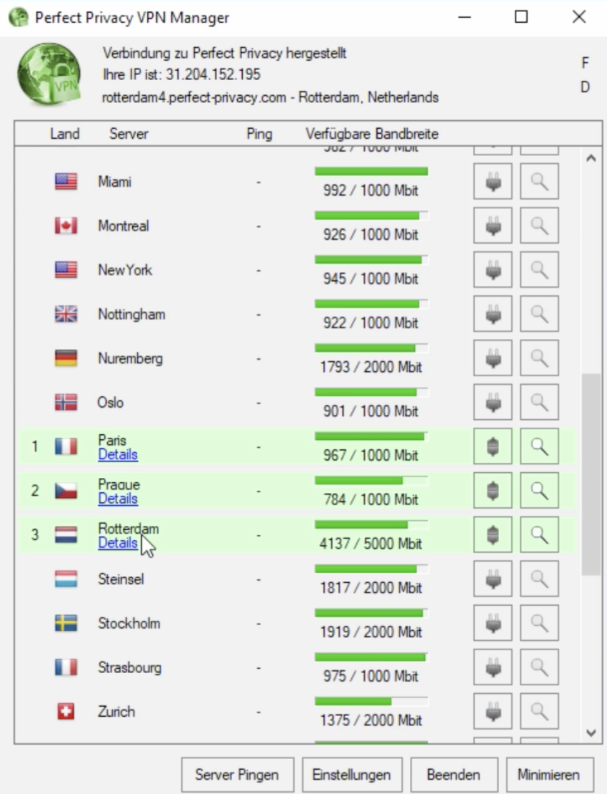
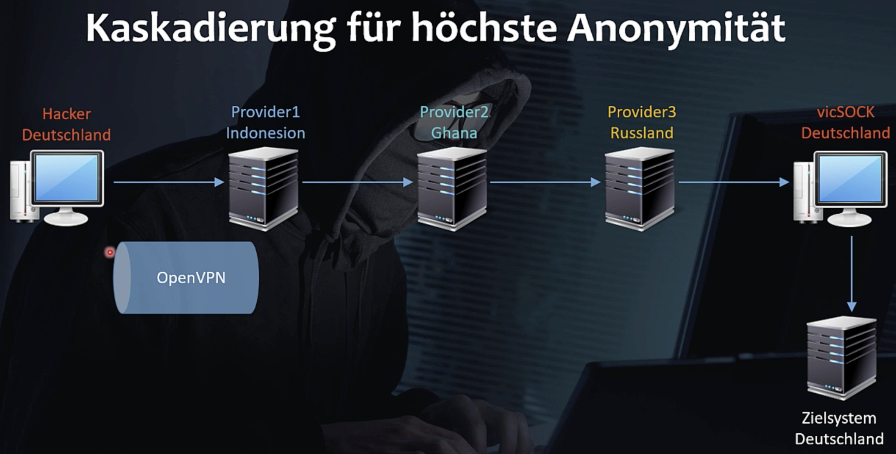
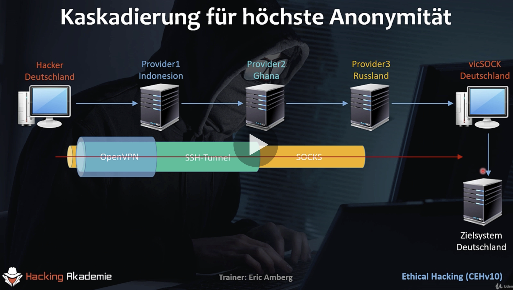

Ethical Hacking CEHv10 (Udemi-Kurs), Eric Amberg


# Laborumgebung

- Host mit VirtualBox
- Weitere VMs mit Internem Netzwerk
  - Netzwerkbrücke zur Verbindung mit realem Netzwerk
- KALI Linux
- Metasploitable (Virtueller Sandsack!)
- Windows Client mit älteren Varianten (7/8.1)
- Windows Server 2012: W2K12 R2 für Netzwerkumgebung, Active Directory, ...
- Debian Linux


# Installieren

- **Virtual Box**

- Download
  
  - Installieren
  
- **Kali Linux**
  - [](https://www.kali.org)
  - Kali Linux 64-bit VirtualBox, OVA Datei – Vorteil ist Vorkonfiguriert
  - ca. 4 GB!
  - These images have a default login/password of “kali/kali” and may have pre-generated SSH host keys.
  - `kali-linux-2020.4-vbox-amd64.ova`, In Virtual Box importieren, 1024 MB Arbeitsspeicher reichen (2048 voreingestellt). USB Controller und Sound Card deaktivieren, >Import<, ca. 2min, Legt eine Kopie der ova Datei an, die ova Datei kann man dann löschen.
  - Starten in vbox
  - root/toor – stimmt nicht mehr, das neue Login ist kali/kali
  - Darstellung kann sehr klein sein auf Retina Displays, >View>Virtual Screen 1>Scale to 200%
  
- **Metasploitable 2** installieren – auf Ubuntu basierend, mit vielen Sicherheitslücken

  - Download: https://sourceforge.net/projects/metasploitable/files/Metasploitable2/, ca. 900MB
  - zip File, Enthält einen Ordner mit einer vmware VM, diesen Ordner in den vbox Ordner verschieben
  - `Metasploitable.vmdk` ist die virtuelle Festplatte, diese ist in einer neuen vbox VM einzubinden
  - vbox

  - neue VM erstellen
  - Name: Metasploitable
  - Type: Linux
  - Version: Ubuntu 32 Bit
  - Continue
  - 512 MB ausreichend
  - Use an existing virtual hard drive file/Vorhandene Festplatte verwenden, Add, `Metasploitable.vmdk` auswählen
  - Starten der VM und anmelden mit msfadmin/msfadmin
  - Start in der Kommandozeile
  - `ifconfig` zeigt aktuelle IP Konfiguration, IP Adresse von eth0 interessant, IP Adresse passt nicht (kommt vom DHCP?)
  - `sudo shutdown -h now`, Hinweis: englische Tastatur eingestellt `-` ist bei `ß`
    - VirtualBox hat einen internen DHCP Server der aus 10.0.2.0/24 eine IP Adresse zuweist (wenn auf NAT gestellt), dadurch können die VMs nicht untereinander kommunizieren. VMs sollen Teilnehme im "echten" Netzwerk sein. Einstellen auf "Netzwerkbrücke"/"Bridged Adapter". (Bridge = ein in Software implementierter Switch)
    - Auch Kali Linux umstellen
    - Beide VMs nehmen nun am normalen Netzwerk teil
    - Starten von Kali Linux Fehler: `VERR_SUPDRV_COMPONENT_NOT_FOUND` (macOS), Reinstall von vbox hilft (Fehlermeldung beim ersten Installieren?)
    - Mit `ifconfig` in Kali und Metasploitable prüfen

- **Windows7**
  - gekauft am 08.12.2020
  - vbox, neue VM erstellen
  - 1024 GB Arbeitsspeicher
  - Festplatte erzeugen, VDI, dynamisch, 32GB
  - Einstellungen – Storage – DVD Laufwerk – choose a disk file...
  - Einstellungen - Netzwerk auf Bridged
  - VM starten
  - Benutzerdefiniert:  (virtuelle) Festplatte als Ziel auswählen
  - Benutzername: wintest, Computername: Win7, PW: wintest
  - Keinen Product-Key eingeben und nicht automatisch aktivieren
  - Nur wichtige Updates installieren
  - Arbeitsplatznetzwerk auswählen
  - Kommandozeile: ipconfig, IP Adresse erhalten, Test: andere VM anpingen (Kali), Windows scheint man nicht anpingen zu können
  - IP Einstellungen unter Windows 7 ändern:
    - In der Taskleiste rechts, Rechtsklick auf das Netzwerksymbol
    - Netzwerk- und Freigabecenter öffnen
    - Adaptereinstellungen ändern
    - Doppelklick auf Icon LAN-Verbindung
    - Button Eigenschaften
    - IPv4 auswählen, Button Eigenschaften
  
- Aktuelles Windows 10
  - Direkt herunterladen: [](https://www.microsoft.com/de-de/software-download/windows10ISO)
    - Oder: **Media Creation Tool**: Unter Windows installieren. Damit kann eine ISO Datei für das aktuell installierte Windows erstellt werden.
  - 1024 MB, 50 GB
  - Keinen Produkt-Key, Windows 10 Pro, 
  - Benutzerdefiniert, ...
  - Sprachassistent ausschalten, Offline Konto erstellen, Eingeschränkte Erfahrung
  - Benutzername: win10test/win10test
  - vbox Fenstergröße ändern hat keine Auswirkung auf das Windows Fenster, >Devices>Guest Additions ...
    - Aus dem Datei Explorer starten
    - Den gleichen Schritt kann man auch unter Windows7 machen
  
- Windows Server
  - Windows Server 2012R2
  - Google: "evaluate windows server 2012 r2", Läuft 180 Tage, 
  - ISO Format auswählen, Als Daten kann man irgendwas eingeben
  - 4,6 GB Download
  - vbox neue VM "W2K12R2", Windows 2012
  - 2048MB Empfehlenswert
  - ... Datacenter ... mit grafischer ...
  - Benutzerdefiniert ...
  - Administrator / Win2ktest (Kennwortkomplexität!)
  - Installieren:  >Devices>Guest Additions ...
  - Konfig: Server-Manager > Lokaler Server > Computername, "W2K12R2"
  - Konfig: Server-Manager > Lokaler Server > IPv4 Adresse, 192.168.1.212/24
  
- Debian Linux
  - www.debian. org, stable release, DVD / amd64
  
  - [](https://cdimage.debian.org/debian-cd/current/amd64/iso-dvd/)
  
  - Download `debian-10.7.0-amd64-DVD-1.iso`, 3,7GB
  
  - vbox neue VM, "Linux-Server", Debian (64-bit)
  
  - 1024MB
  
  - 20,0 GB Festplatte
  
  - Rechner Name "Linux-Server"
  
  - Domain-Name: "linux.local"
  
  - Root password: "toor"
  
  - Name/Benutzername/pw: **Eric/eric/debiantest**
  
  - Partitionierungsmethode: Geführt, vollständige Festplatte
  
  - Alles auf eins schreiben
  
  - Weitere CD: Nein
  
  - Netzwerkspiegel (network mirror) verwenden: Ja
  
  - Softwareauswahl:
  
    - Kein Druckserver
    - Mit TAB kommt man auf Weiter
    - GRUB Bootloader ... : "Ja"
  
  - ```bash
    $ su - # substitute user
    toor # root pwd
    # ifconfig
    ... nicht gefunden
    $ ip addr show # neuerer und besserer Befehl
    
    
    ```
    Kontrollieren ob IP Adresse passt
  
- Virtuelles Netzwerk konfigurieren (isoliert)

  - kein DHCP Server vorhanden, ein Server muss dies übernehmen
  - VirtualBox, Netzwerk verbunden mit "Internal Network"

- Snapshots/Sicherungspunkte

  - Geht auch bei einer laufenden Maschine, sichert dann auch den Arbeitsspeicher


# shell

- `cd -` wechselt ins vorhergehende Verzeichnis
- `/usr`  unix system resources
- `#` = Admin, `$` = normaler user


# Fixe IP Adresse

192.168.1.0/24




- Kali, rechts oben, Kabelgebunden, LAN Einstellungen

- Metasploitable

  - ```bash
    cd /etc/network
    ls
    sudo nano interfaces
    # iface eth0 inet static
    # address 192.168.1.206
    # netmask 255.255.255.0
    # gateway 192.168.1.254 (auskommentieren damit Metsploitable nicht raus kann)
    sudo ifdown eth0
    sudo ifup eth0
    ifconfig
    
    ```


# Software installieren

- `apt-get update` 

- `apt-get install <package name>`
- `apt-get remove <package name>`
  - Konfiguration (in `/etc`) bleibt erhalten
- `apt-get purge <package name>`
  - Alles wird deinistalliert
- `apt-search search`


# Wichtige Angriffsvektoren

- Cloud-Computing
  - Fehlende Daten-Trennung (Zugriff auf Daten anderer User)
  - Unsicher APIs
  - Session-Hijacking
  - Betreiber sichert schlecht ab
- Advanced Persistent Threats
  - Fortgeschritten
  - Ziel: möglichst lange handlungsfähig bleiben
  - Sehr zielgerichtet, lange Vorbereitungszeit (Monate, Jahre)
  - Gut getarnt
  - Social Engineering als Einfallstor
- Viren, Würmer, Trojaner
  - Drive-by-Download (Besuch einer Website)
- Angriffe auf Mobile Systeme
  - Spyware (Hersteller, Verkäufer, ...)
- Botnets
  - Viele kleine Programme
  - Computer und IoT
  - C&C Server
  - flexibel einsetzbar
- Insider Angriffe
  - Durch Mitarbeiter!
- Angriffe auf Webanwendungen
  - Serverseite / Browser
  - Schwachstelle Mensch (Klick-Verhalten)
- IoT
  - Fernseher, Kühlschränke, Haus Steuerung, Heizung, Temperaturfühler
  - meist nicht sorgfälltig abgesichert
  - Schwache Authentisierung, Verschlüsselung
  - Remote Control problematisch bei kritischer Infrastruktur (Energieversorgung)


# Bedrohungen


Angriffe: OS, Anwendung, fehlerhafte Konfiguration, ausnutzen schwacher Default Settings

Shrink-Wrap Code Attack (*only be seen in a product immediately after its initial installation - "fresh out of the shrink wrap" you might say.*)





Informationsbeschaffung = Recon, Reconnaissance

Footprinting: Welches OS, Welche Dienste, offene Ports. Geht automatisch mit Exploit Empfehlungen.


# Phasen eines Angriffs

- Reconaissance (Footprinting, Informationsbeschaffung)

  - passive/active discovery (z.B. Telefonanruf, falscher Handwerker, soziale Netzwerke)
  - wichtigste und am längsten dauernde Phase

- Schwachstellen finden

  - Port scanning
  - Enumeration
  - Vulnerability Scanning

- Gaining access

  - Schwachstelle nutzen

- Maintaining access (sich festsetzen)

  - Backdoors installieren
  - Weitere Systeme anvisieren
  - Rootkits (versteckt installierte Software)

- Clearing Tracks (Spuren verwischen)

  - Log Files löschen/manipulieren

  




# Anonym im Internet

- Proxy
  - Anonymität sicherstellen
  - Client vor Angriffen abschirmen
  - Vor Malware schützen (Scanner im Proxy)
  - Logging (Protokollieren der Kommunikation, z.B. für Firmen, jedoch dann nicht anonym)
  
- Proxy-Client ⟷ Proxy-Server ⟷ Web-Server

- Proxy wie man-in-the-middle

- NT: Proxy sieht die ganze Kommunikation, daher End-zu-End Verschlüsselung wichtig.

- Freien Proxy nutzen
  - [](http://www.proxy-listen.de)
  - Header Informationen werden von Web-Proxies durchgereicht (Experiment, 28.12.2020)
  
- Proxy-Chaining
  - Mehrere Proxy hintereinander
  - fest konfiguriert (Firmen, nicht anonym)
  - HTTP Tunnel (vom Client initiiert)
  - erhöhte anonymität, unter gewissen Umständen
    - Level 1 Proxies
    - Kein Logging in den Proxies
    - Proxies wissen voneinander nicht
    - Proxies in unterschiedliche Ländern
    - End-zu-End Verschlüsselung
  
- foxyproxy
  - Verwaltungstool
  - Browser Plugin
  - Umschalten zwischen Proxies
  - Patterns: Gewisse Websiten – bestimmte Proxies
  
- VPN
  
  - Problem Proxy: Netzwerk auf dem Weg zum Proxy angreifbar (Provider)
  - VPN Tunnel zum Proxy
  - Provider können nicht mitlesen, sehen nur einen (verschlüsselten) VPN Tunnel
  - 
  - Zusätzlicher [DNS Leak](https://en.wikipedia.org/wiki/DNS_leak) Schutz: Anonymizer. DNS Anfragen sollten auch durch den VPN Tunnel gehen, das ist nicht immer automatisch sichergestellt.
  
- IPsec

  - Netzwerk-Schicht
  - Komplex Konfigurierbar

- OpenVPN

  - auf TLS
  - TCP/UDP
  - Benutzerfreundlich

- SSH

  - kann auch als Tunnelprotokoll eingesetzt werden

- VPN Anbieter

  - Kostenlos: langsam
    - Keine Garantie der Vertrauenswürdigkeit bzw. Protokollierung
  - Kostenpflichtig (5-15 pro Monat)
  - Meist ein VPN Client zu installieren

- VPN Kaskadierung

  - 
  - Mögliche Verschleierung:
    
  - VPNs in Ländern die wenig Informationen ausliefern.
  - SOCK = Proxy Protocol
  - vicSOCK, Victim SOCK, SOCK Proxy, per Malware installiert, kann man mieten
  - 
  - Zielsystem sieht nur die Anfrage einer vertrauenswürdigen (deutschen) IP Adresse (viele Server sperren ganze geogr. Regionen bzw. IP Adressen)

  

  

- Surface Web / Deep Web / Darknet

  - Tor, the onion router, peer-to-peer network, jeder Knoten verschlüsselt gesendete bzw. weitergeleitete Daten, jede Kommunikation läuft über 3 zufällige Knoten (Tor circuit) verschlüsselt (übereinander=Zwiebel), alle 10 Minuten wird gewechselt, 
- Tor Browser
    - [](https://thehiddenwiki.org/), ..., uncensored hidden wiki
    - .onion Adressen

- Tails: Anonymizer Linux Distro, Life System (z.b. vom USB Stick)
  
  - Jede Kommunikation über Tor
  - Läuft nur im RAM
  - von Edward Snowden verwendet
  
  
  
# Kryptografie


- [CrypTool](https://www.cryptool.org/en/), for .NET Framework, für Windows

- SSH, public key krypto als Alternative zur Passwort Eingabe, Beispiel mit, Windows puTTY zugriff auf Kali Linux, Server (Kali) schickt eine Challenge an den Client, dieser verschlüsselt mit PrivK und schickt zurück.
  - Sicherer als Passwort Eingabe, Komforabler
  - Dem Gerät in dem der PrivK gespeichert wird muss aber zu 100% vertraut werden.
  - Video Download auf Ventress
  
- Angriffsmethoden

  - Wörterbuch
- Brute-Force
  - Side-Channel
    - Timing Attack
    - Speicherverbrauch
    - EM Abstrahlung
  - Man-in-the-middle
  
- Angriffsszenarien der kryptoanalyse

  - Known Ciphertext
  - Probable Plaintext
  - Frequency Analysis
  - Known Plaintext (z.B. Teile bekannt)
  - Chosen Plaintext
  - Chosen Ciphertext

- Anderes

  - Trickery and Deceit (Social Engineering)
  - Rubberhose Attack (Gewaltandrohung)
  - Meet in the Middle (3DES)

- Heartbleed (openSSL) erklärt, Poodle

- 

  

  

  

  


