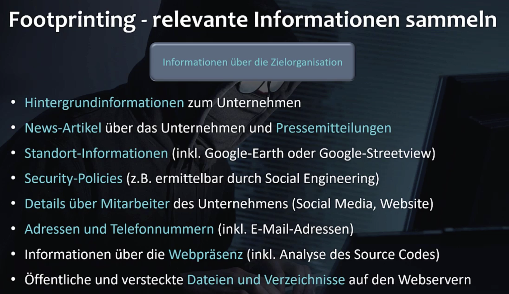
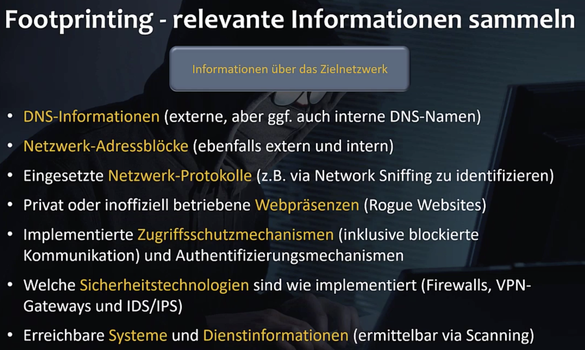
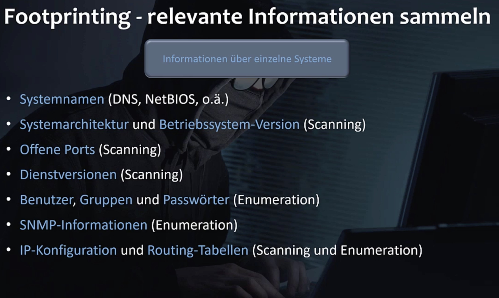
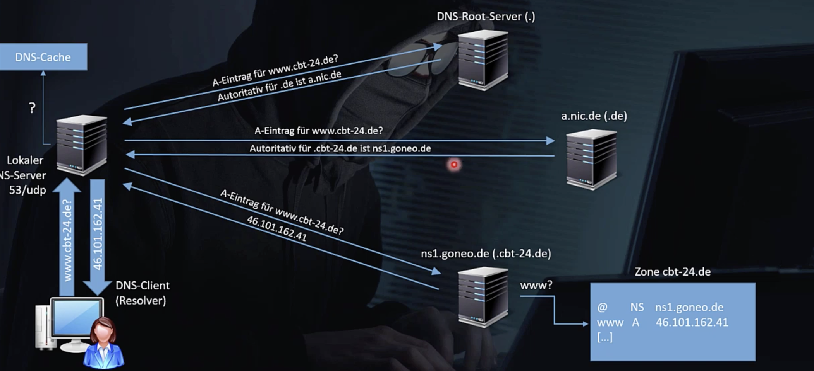

# Section 7: Informationsbeschaffung: Footprinting und Reconnaissance

Phase die am längsten dauert. Ziel ist systematisch Schwachstellen für einen Angriff zu finden.

- **Reconnaissance**: Oberbegriff, information gathering
- **Footprinting**:  Sammlung öffentlich zugänglicher Daten, OSINT – Open Source Intelligence, Passiv: keine Kommunikation mit dem Ziel.
- **Scanning**: Aktive Phase, Port Scan, Vulnerability Scan, [Banner Grabbing](https://en.wikipedia.org/wiki/Banner_grabbing), direkte Kommunikation mit dem Ziel – Gefahr der Entdeckung
- **Enumeration**: Systematisches abfragen von Diensten und Systemen, Ziel Übersicht über das Ziel-System, 

Begriffe sind nicht so scharf definiert!











**Suchmaschinen** (Google, ...) liefern viele Informationen über das Ziel. Es gibt spezialisierte Suchmaschinen.


Mehrere Suchmaschinen verwenden (Google, Bing, Yahoo, DuckDuckGo, Baidu, Yandex, ...). Teilweise sehr unterschiedliche Ergebnisse.

**Netcraft**: [](https://searchdns.netcraft.com), Sucht subdomains und liefert genauere Informationen

Internet-**Archive** (WayBack Machin), speichern alte Web-Site informationen.

**Shodan** [](https://www.shodan.io), sammelt Banner Daten von z.B. IoT Geräte, Router, ... . Registrierung notwendig, Filter möglich, 

Google Earth, **Google Maps**, **Streetview**, ..., Vorbereitung für Social Engineering, Angreifer verschafft sich Zugang zum Gebäude um z.B. HW Keylogger zu installieren, 

Personen Suchmaschinen, www.webmii.com, www.yasni.de, www.identcheck.net,  Social Media Aktivitäten, usw., Teilweise kein großer Vorteil zu normalen Suchmaschinen.

Job Suchmaschinen, Stellenangebote liefern Informationen über die im Unternehmen eingestzten Technologien

Arbeitgeberbewertungsportale (www.kununu.com), gibt es unzufriedene IT Mitarbeiter – Anruf und man gibt sich als Head Hunter aus.


## Google Hacking

Nutzen von besonderen Google Features. Genaue Suche mit Operatoren

z.B. Passwörter oder Dokumente mit privatem Inhalte (Juicy Information), versteckte Dateien, die ungewollt öffentlich im Netz stehen


```
site:htl-braunau.at matejka
allintext: ssl attack
related: www.heise.de
```


[GHDB – Google Hacking Database](https://www.exploit-db.com/google-hacking-database), Sammlung von Abfragen die sensible Informationen preisgeben, wenn Administratoren unachtsam waren. Zeigt auch interessante Anwendung der Suchoperatoren.

## Social Media Footprinting

Jeder Gemütszustand wird preisgegeben. Vorbereitung für social engineering Angriffe

Wo suchen?

Facebook, Xing, LinkedIn, Instagram, Twitter, Pinterest, Youtube

User auf mehreren Plattformen.

Was suchen?

Namen, Kontakte, Interessen, Beruflicher Werdegang, weniger offizielle Informationen zum Unternehmen

Social Engineering Angriff mittels fake-profil, Kontakt aufbauen, Vertrauen gewinnen, ...


## Whois Datenbanken

Port 43/tcp, für Abfrage der rgistrierten Internet Domains und IP Adressbereiche, 

`whois` Kommandozeilentool

Gibt auch Web basierte Frontends

Wegen der DSGVO sind die whois Informationen nun sehr eingeschränkt worden.


## Domain Name System

DNS, Namen statt IP Adressen

`nslookup google.at`

zuerst File `/etc/hosts` dann (1987) DNS

Hierarchisches System,

Root (`.`)

TLD Top Level Domains

Domain

Subdomains

Hostnames

FQDN – Fully Qualified Domain Name, enden genau genommen mit einem Punkt


Lokaler DSN Server 53/udp, DNS Cache, DNS-Root-Server, Weiterleitung an Autoritativen Server




## DNS Clients

= resolver

[](http://www.dnsstuff.com)

Linux und Windows: `nslookup`

Linux: `dig`, `nslookup`, `host`

nslookup ohne argumente startet eine eigene "shell"

`dig` liefert mehr Informationen


## DNS Footprinting

Liefert IP Adressen die Angriffziele sein könnten. DNS Namen liefern weitere Informationen über die Aufgaben der Server z.B. (mail.htl-braunau.at).

Welche Systeme sind überhaupt öffentlich erreichbar? Durch Konfigurationsfehler können Systeme die eigentlich nur intern sichtbar sein sollen, auch extern verfügbar sein. 


## E-Mail Footprinting

Anzeigen des Email Headers (bzw. Raw Source) über Optionen des Email Clients.

z.B. Authentication-Results: `sender IP is ...`


## Website Footprinting

[netcraft sitereport](https://sitereport.netcraft.com)

Versteckte Pfade und Dateien,  

Welches CMS, Skriptsprache, was wird in Cookies gespeichert?

Begriffe zum Erstellen einer Passwortliste (Kali-Tool: `cewl`)

Gesamten Quellcode einer Website lokal speichern, (Crawler, Website scanner, Website mirroring, Tool: `HTTrack`)

URL Fuzzer - Discover hidden files and directories


## Metagoofill

Kali

```bash
apt-get install metagoofil
```

Durchsucht online Dateien nach Metadaten (PDF, DOC, ...)


## Recon-ng

Framework für Reconnaissance

Kali

```bash
$ recon-ng
```

Braucht API Keys (z.B. von Twitter)

Großer Funktionsumfang!

Video gegrabt. 


## Maltego

www.paterva.com

Gibt auch kostenlose Community Edition. Auf Kali vorinstalliert.

Grafische Darstellung von Zusammenhängen.


## Footprinting – Gegenmaßnahmen

- Keine unwichtigen Informationen preisgeben
- Unternehmensweite Sicherheitsrichtlinie (Security Policy): Do's and Don'ts
- Abteilung/Person muss Sicherheitsverantwortung tragen
- Webserver härten (keine Verzeichnislistings)
- Häufig
  - Unwissenheit
  - Leichtgläubigkeit
  - Ignoranz
- Mitarbeiterschulung!
- Sensitive Bereiche: Zugangsbeschränkung (Passwörter, ...)
- Daten verschlüsseln


