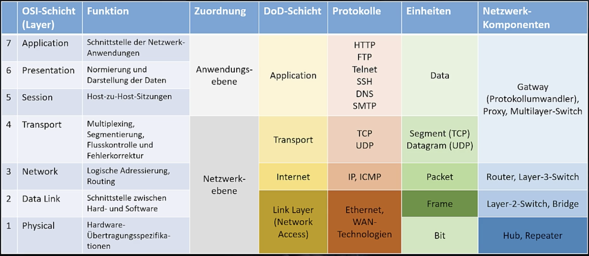
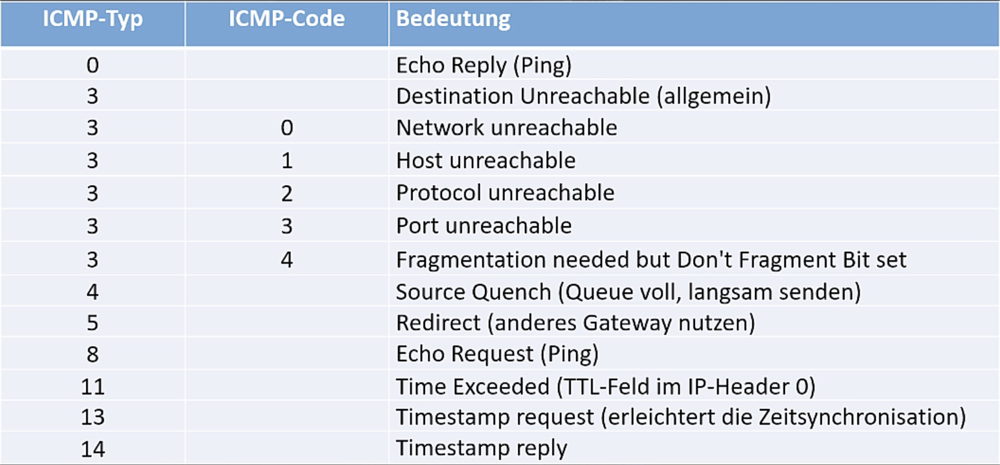

# Section 8: Scanning - Das Netzwerk unter der Lupe

Schritt 2 der Reconnaissance. Active Information Gathering.

- Aktive Knoten im Netz
- Offene Ports
- Dienste
- Vulnerabilities


Methoden

- Host Discovery, Ping Scan
- Port Scan (offene TCP/UDP Scans)
- Dienst und OS Erkennung – inkl. Versionen (durch "probes")
- Vulnerability-Scanning (durch Zugriff auf Datenbank mit bekannt Schwachstellen)


Zu beachten:

- Firewalls (IDS/IPS) umgehen
- Banner Grabbing (Dienste melden sich mit diversen Informationen bei erster Kontaktaufnahme)
- Proxy und Anonymizer verwenden


## TCP/IP Essentials

DoD = TCP/IP




ARP, Switch, IP, ICMP, UDP, TCP, 

ICMP




## Nmap

[Nmap](https://www.nmap.org/), Portscanner, Network Mapper

Auch für Windows verfügbar.

Zenmap: GUI

NMAP Scripts (Lua)

Achtung: Mit Scans kann man sich schnell verdächtig machen


### Host Discovery

```bash
$ nmap -v 192.168.178.0/24
# -v, --verbose: Status und Fortschritt

$ nmap 192.168.178.0/24

Starting Nmap 7.91 ( https://nmap.org ) at 2021-02-08 10:41 EST
Nmap scan report for fritz.box (192.168.178.1)
Host is up (0.042s latency).
Not shown: 992 closed ports
PORT     STATE SERVICE
21/tcp   open  ftp
53/tcp   open  domain
80/tcp   open  http
139/tcp  open  netbios-ssn
443/tcp  open  https
445/tcp  open  microsoft-ds
5060/tcp open  sip
8089/tcp open  unknown

Nmap scan report for Ventress.fritz.box (192.168.178.21)
Host is up (0.045s latency).
Not shown: 989 closed ports
PORT      STATE SERVICE
22/tcp    open  ssh
80/tcp    open  http
139/tcp   open  netbios-ssn
443/tcp   open  https
445/tcp   open  microsoft-ds
873/tcp   open  rsync
3261/tcp  open  winshadow
5000/tcp  open  upnp
5001/tcp  open  commplex-link
50001/tcp open  unknown
50002/tcp open  iiimsf

Nmap scan report for Beoplay-M3-28720449.fritz.box (192.168.178.22)
Host is up (0.022s latency).
Not shown: 991 closed ports
PORT      STATE SERVICE
80/tcp    open  http
1234/tcp  open  hotline
5222/tcp  open  xmpp-client
8008/tcp  open  http
8009/tcp  open  ajp13
8080/tcp  open  http-proxy
8443/tcp  open  https-alt
9000/tcp  open  cslistener
10001/tcp open  scp-config

Nmap scan report for Franzs-iMac.fritz.box (192.168.178.27)
Host is up (0.00022s latency).
All 1000 scanned ports on Franzs-iMac.fritz.box (192.168.178.27) are closed

Nmap scan report for Elis-iPad.fritz.box (192.168.178.28)
Host is up (0.0047s latency).
Not shown: 999 closed ports
PORT      STATE SERVICE
62078/tcp open  iphone-sync

Nmap scan report for fritz.repeater (192.168.178.40)
Host is up (0.044s latency).
Not shown: 997 closed ports
PORT    STATE SERVICE
53/tcp  open  domain
80/tcp  open  http
443/tcp open  https

Nmap scan report for kali.fritz.box (192.168.178.64)
Host is up (0.000034s latency).
All 1000 scanned ports on kali.fritz.box (192.168.178.64) are closed

Nmap done: 256 IP addresses (7 hosts up) scanned in 49.94 seconds
```


Ping Scan, Ping = Jede Kommunikation die einen Response verursacht:

- ARP Request wenn Scan im lokalen Subnet
- ICMP Type 0 und 8 (wird jedoch oft von Firewalls gefiltert)
- ICMP Timestamp Request
- TCP SYN auf Port 443
- TCP ACP auf Port 80


```bash
$ nmap -sn 192.168.178.0/24
# -sn: nur Ping Scan/Host Discovery - kein port scan
# geht sehr schnell
```


DNS Reverse Lookup, List Scan, 

```bash
$ nmap -sL 192.168.178.0/24
Starting Nmap 7.91 ( https://nmap.org ) at 2021-02-08 10:55 EST
Nmap scan report for 192.168.178.0
Nmap scan report for fritz.box (192.168.178.1)
Nmap scan report for 192.168.178.2
Nmap scan report for 192.168.178.3
Nmap scan report for 192.168.178.4
...
Nmap scan report for 192.168.178.19
Nmap scan report for Franzs-MBP.fritz.box (192.168.178.20)
Nmap scan report for Ventress.fritz.box (192.168.178.21)
Nmap scan report for Beoplay-M3-28720449.fritz.box (192.168.178.22)
Nmap scan report for Beoplay-M5-28186652.fritz.box (192.168.178.23)
Nmap scan report for ElfiPhone.fritz.box (192.168.178.24)
Nmap scan report for ChronoFranz.fritz.box (192.168.178.25)
Nmap scan report for 192.168.178.26
Nmap scan report for Franzs-iMac.fritz.box (192.168.178.27)
Nmap scan report for Elis-iPad.fritz.box (192.168.178.28)
Nmap scan report for 192.168.178.29
Nmap scan report for 192.168.178.30
Nmap scan report for Kindle.fritz.box (192.168.178.31)
Nmap scan report for 192.168.178.32
Nmap scan report for 192.168.178.33
Nmap scan report for 192.168.178.34
Nmap scan report for 192.168.178.35
Nmap scan report for 192.168.178.36
Nmap scan report for 192.168.178.37
Nmap scan report for 192.168.178.38
Nmap scan report for 192.168.178.39
Nmap scan report for fritz.repeater (192.168.178.40)
Nmap scan report for 192.168.178.41
Nmap scan report for 192.168.178.42
Nmap scan report for 192.168.178.43
Nmap scan report for 192.168.178.44
Nmap scan report for 192.168.178.45
Nmap scan report for 192.168.178.46
Nmap scan report for 192.168.178.47
Nmap scan report for 192.168.178.48
Nmap scan report for Felix-Laptop.fritz.box (192.168.178.49)
Nmap scan report for 192.168.178.50
Nmap scan report for 192.168.178.51
Nmap scan report for 192.168.178.52
Nmap scan report for 192.168.178.53
Nmap scan report for 192.168.178.54
Nmap scan report for 192.168.178.55
Nmap scan report for 192.168.178.56
Nmap scan report for 192.168.178.57
Nmap scan report for iPad-von-Elfi.fritz.box (192.168.178.58)
Nmap scan report for ElfiPhone.fritz.box (192.168.178.59)
Nmap scan report for Maxi.fritz.box (192.168.178.60)
Nmap scan report for iPad-6.fritz.box (192.168.178.61)
Nmap scan report for FranziPhone.fritz.box (192.168.178.62)
Nmap scan report for AppleWahvonElfi.fritz.box (192.168.178.63)
Nmap scan report for kali.fritz.box (192.168.178.64)
Nmap scan report for 192.168.178.65
Nmap scan report for 192.168.178.66
Nmap scan report for 192.168.178.67
Nmap scan report for 192.168.178.68
...
Nmap scan report for 192.168.178.255
Nmap done: 256 IP addresses (0 hosts up) scanned in 2.68 seconds
```


nmap kann auch payloads auf andere Dienst Ports schicken um Antworten zu provozieren. Siehe auch `/usr/share/nmap/nmap-payloads`.

Videos zu diesem Kapitel geladen!


