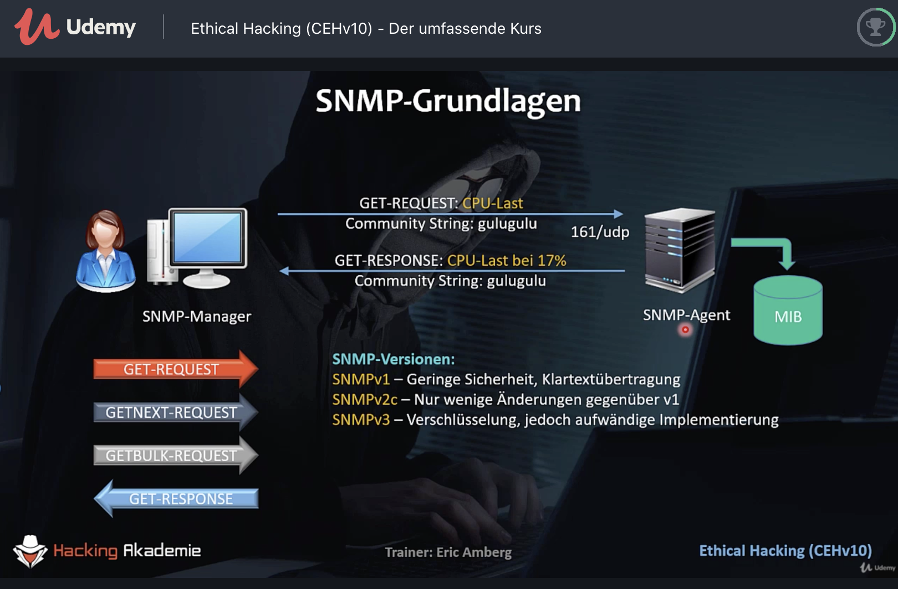
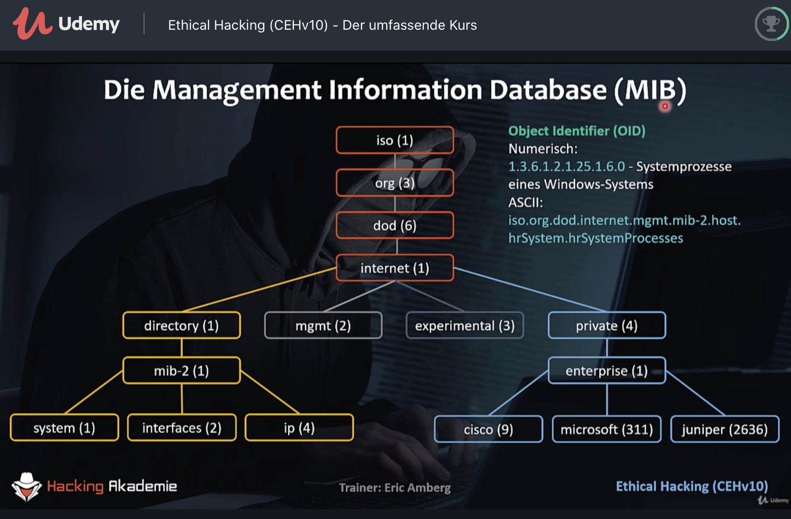

# Section 9: Enumeration

## NetBIOS und SMB

## SNMP – Simple Network Management Protocol

Enumeration

Community Strings (=Passwörter) haben häufig verwendete Default Werte (bspw. "public" und "private") bzw. werden im Klartext im Netzwerk übertragen.

