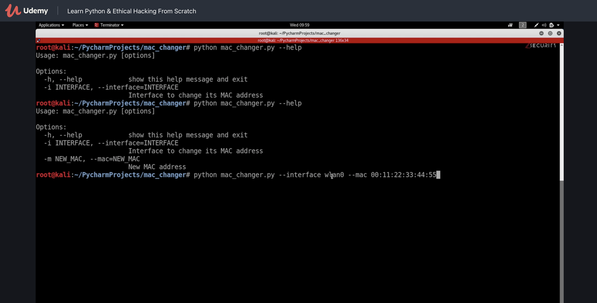
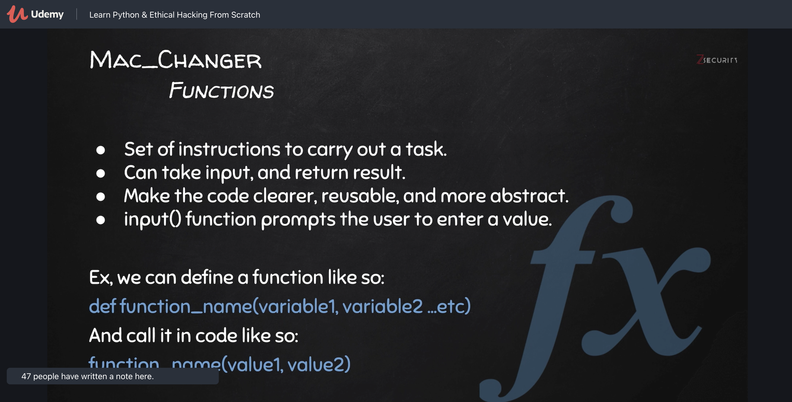
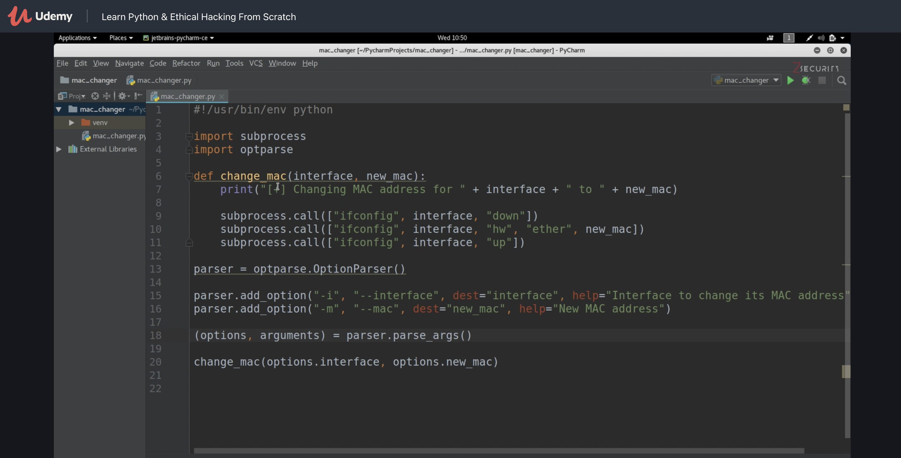
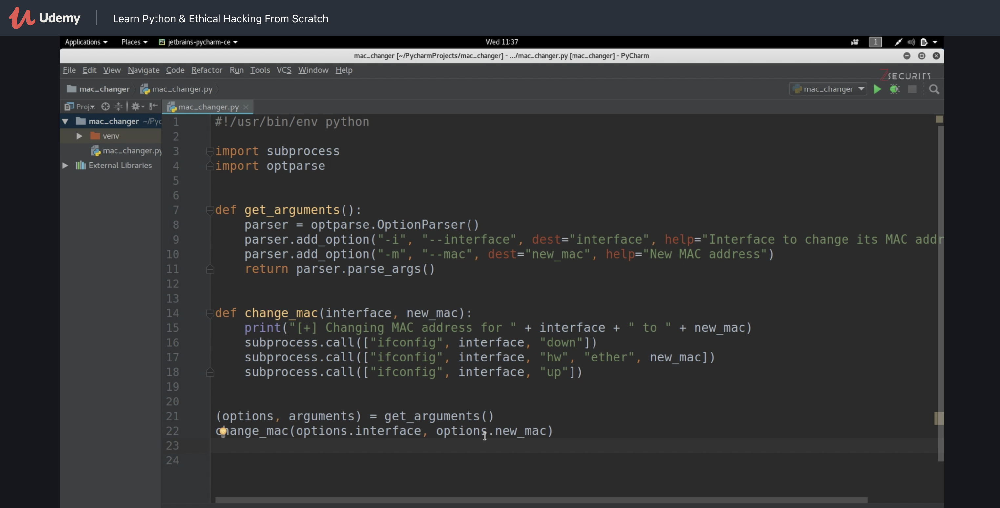
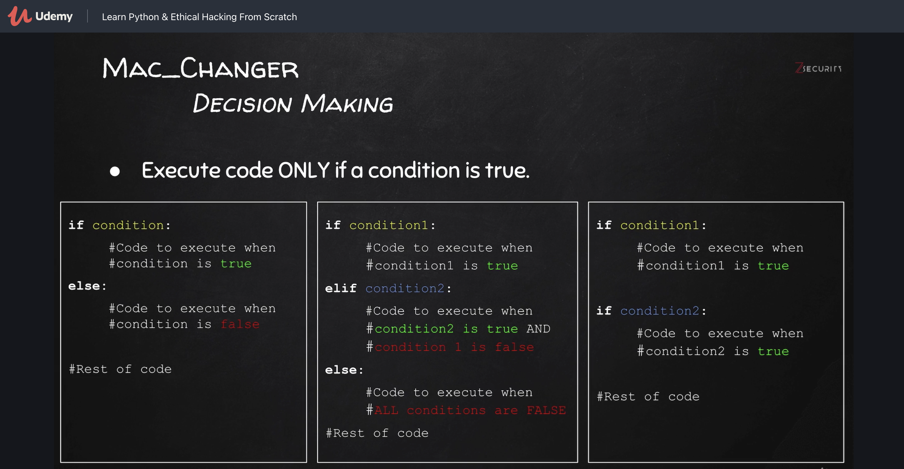
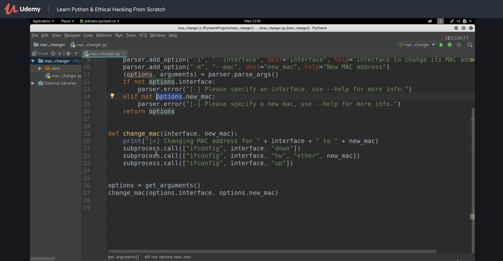

# Section 2: Writing a MAC Address Changer - Python Basics

Ändern der MAC Adresse:

```bash
# disable interface
$ ifconfig eth0 down
# change mac address
$ ifconfig eth0 hw ether 11:22:33:44:55:66
# enable interface
$ ifconfig eth0 up
```


```bash
import subprocess
subprocess.run("ifconfig eth0",shell=True)
# Ausgabe auf stdout
```

Anmerkung: Ohne `shell=True` wird keine Kommandozeile geparst:

```bash
subprocess.run(["ifconfig","eth0"])
```

Und somit:

```python
import subprocess
subprocess.run("ifconfig eth0 down",shell=True)
subprocess.run("ifconfig eth0 hw ether 00:22:33:44:55:66",shell=True)
subprocess.run("ifconfig eth0 up",shell=True)
```


## Mit Variablen

```python
import subprocess

interface = "eth0"
new_mac = "00:22:33:44:55:66"

print("[+] changing MAC address for " + interface + " to " + new_mac )

# und gleich mit sring interpolation
print(f"[+] changing MAC address for {interface} to {new_mac}" )

subprocess.run(f"ifconfig {interface} down",shell=True)
subprocess.run(f"ifconfig {interface} hw ether {new_mac}",shell=True)
subprocess.run(f"ifconfig {interface} up",shell=True)
```

Das Programm muss mit `sudo` gestartet werden. Das erste Byte der MAC Adresse muss gerade sein (sonst ist es eine Multicast-Adresse).


## Benutzereingabe

Im Video wird `input` verwendet um `interface` und `new_mac` einzugeben.


## Hijacking

Schwachstelle in diesem Programm: user can **hijack** the programm.

Wenn die Daten die der User eingibt nicht geprüft werden, dann könnte dieser Linux Commands eingeben. 

```python
interface = input("interface > ")
new_mac = input("MAC > ")
```

Eingabe:

```
interface > eth0;ls;
```

Also eine Art "injection" Attack

Der Benutzer mach Dinge die ihm nicht erlaubt sind! Hacking!

Stopfen der Sicherheitslücke indem eine andere Variante von `subprocess.run` verwendet wird, ohne `shell=True`. 

z.B.:

```python
subprocess.run(["ifconfig", interface, "hw", "ether", new_mac])
```

Trennung überall wo ein Leerzeichen war. Dies wird als ein Kommando interpretiert. Command injection wird dadurch viel schwieriger weil nicht mehr mit `;` ein neues Kommando begonnen werden kann.


## Argumente

Erweiterung: Keine Eingabe sondern Argumente über die Kommandozeile.

```python
import optparse
parser = optparse.OptionParser()
# naming convention = everything starting with a capital letter ist a class
```

> *Deprecated since version 3.2:* The [`optparse`](https://docs.python.org/3/library/optparse.html#module-optparse) module is deprecated and will not be developed further; development will continue with the [`argparse`](https://docs.python.org/3/library/argparse.html#module-argparse) module.





## Funktionen







Return Werte:




## Decision Making in Python





