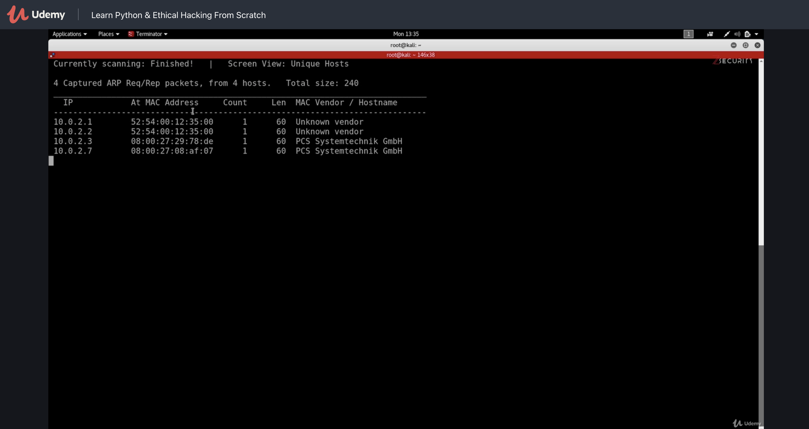
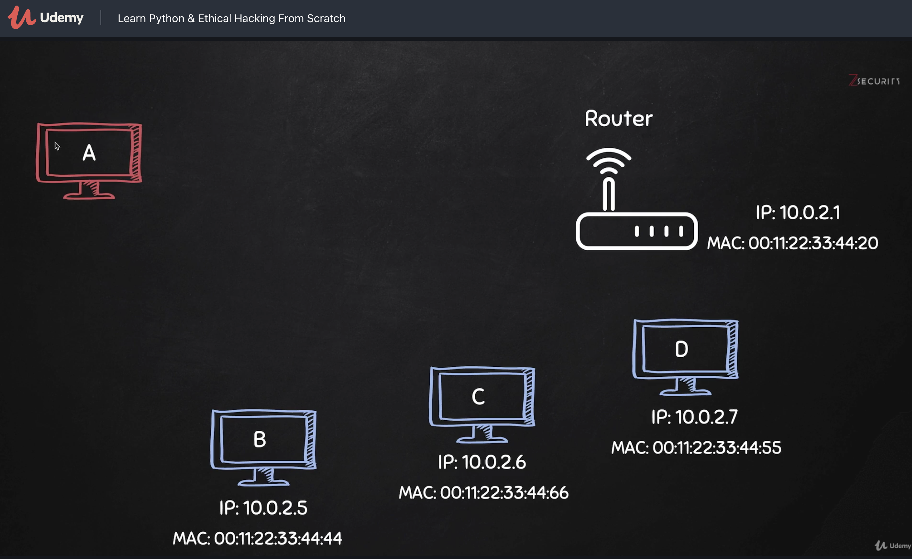
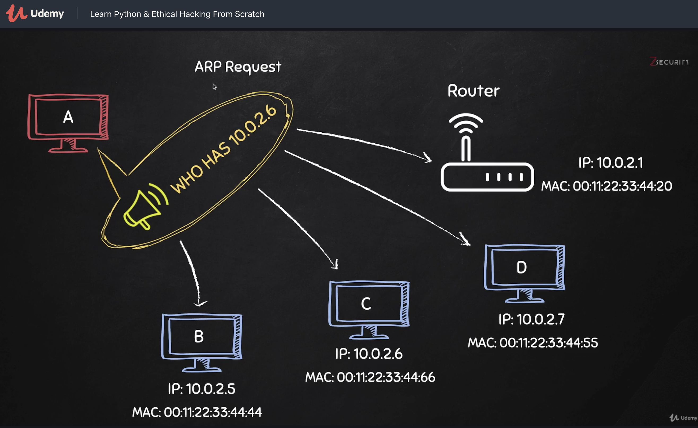
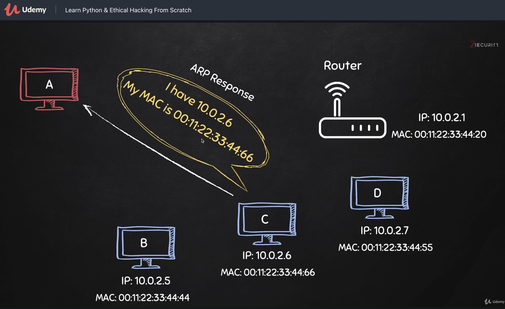
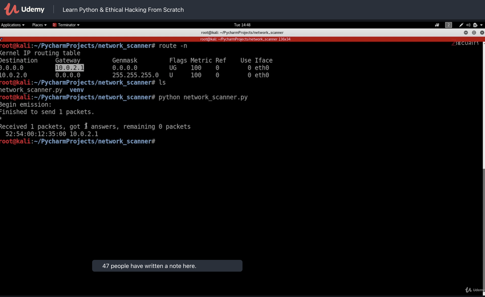
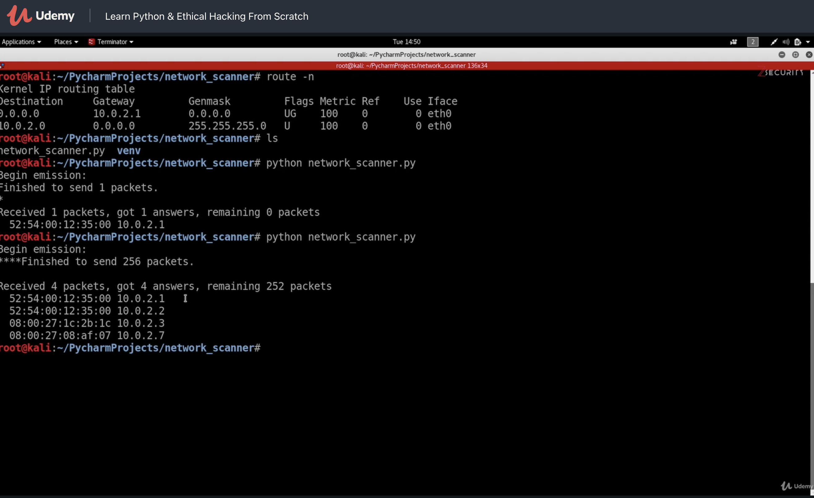

# Section 4: Programming a Network Scanner

Für information gathering

Info: es gibt ein nmap Modul für Python

Scan mit [netdiscover](https://manpages.debian.org/unstable/netdiscover/netdiscover.8.en.html) (simpler ARP Scanner)

```bash
$ netdiscover -r 10.0.2.1/24 
```



`netdiscover` hat unter Kali 2021.1 nicht funktioniert (es werden keine Hosts angezeigt). Mit nmap kann das gleiche erreicht werden:

```bash
$ nmap -sn -PR 192.168.178.75/24
# -sn  ... nur PING scan (kein PORT scan)
# -PR  ... ARP Scan
```


Offizielle VM von Windows installieren [[*](https://developer.microsoft.com/en-us/microsoft-edge/tools/vms/)]. 


## ARP










## Scapy

Python modul.

> Scapy is a powerful interactive packet manipulation program. It is able to forge or decode packets of a wide number of protocols, send them on the wire, capture them, match requests and replies, and much more. [[*](https://scapy.net)]

```python
import scapy.all as scapy
scapy.arping("10.0.0.2")
scapy.arping("10.0.0.1/24") # complete subnet
```







Summary:

```python
arp_request = scapy.ARP()
print(arp_request.summary())
```

```
ARP who has 0.0.0.0 says 192.168.178.81
```

Alle Felder auflisten:

```python
scapy.ls(arp_request)
```


```
hwtype     : XShortField                         = 1               (1)
ptype      : XShortEnumField                     = 2048            (2048)
hwlen      : FieldLenField                       = None            (None)
plen       : FieldLenField                       = None            (None)
op         : ShortEnumField                      = 1               (1)
hwsrc      : MultipleTypeField                   = '00:0c:29:97:77:0a' (None)
psrc       : MultipleTypeField                   = '192.168.178.81' (None)
hwdst      : MultipleTypeField                   = '00:00:00:00:00:00' (None)
pdst       : MultipleTypeField                   = '0.0.0.0'       (None)
```

Gibt eine Idee welche Felder zu setzen sind.

2 Möglichkeiten:

```python
arp_request.pdst = ip
```

oder:

```python
arp_request = scapy.ARP(pdst=ip)
```


Ethernet Frame [[*](https://scapy.readthedocs.io/en/latest/api/scapy.layers.l2.html#scapy.layers.l2.Ether)]:

```python
broadcast = scapy.Ether(dst="ff:ff:ff:ff:ff:ff")
scapy.ls(broadcast)
```

```
dst        : DestMACField                        = 'ff:ff:ff:ff:ff:ff' (None)
src        : SourceMACField                      = '00:0c:29:97:77:0a' (None)
type       : XShortEnumField                     = 36864           (36864)
```

Obwohl `dst`  default bereits auf die Broadcast Adresse gesetzt zu sein scheint, ist es trotzdem notwendig diesen zu setzen (sonst program freeeze).


BTW: Anzeige eines Werts in hex – weil der Ethertype üblicherweise in hex angegeben wird:

```python
print(hex(broadcast.type))
```

```
0x9000
```

Pakete mit `/` kombinieren

> In Python the behavior of all operators can be customized per class. Many libraries and framework make use of this to offer convenient ways to combine objects. [[*](https://stackoverflow.com/a/34832591)]

```python
# create combined packet using scapy "/"
arp_request_ether = broadcast/arp_request
print(arp_request_ether.summary())
```

```
00:0c:29:97:77:0a > ff:ff:ff:ff:ff:ff (0x9000)
Ether / ARP who has Net('192.168.178.81/24') says 192.168.178.81
```

`show()` zeigt mehr Info als `summary()`:

```python
arp_request_ether.show()
```

```
###[ Ethernet ]### 
  dst       = ff:ff:ff:ff:ff:ff
  src       = 00:0c:29:97:77:0a
  type      = ARP
###[ ARP ]### 
     hwtype    = 0x1
     ptype     = IPv4
     hwlen     = None
     plen      = None
     op        = who-has
     hwsrc     = 00:0c:29:97:77:0a
     psrc      = 192.168.178.81
     hwdst     = 00:00:00:00:00:00
     pdst      = Net('192.168.178.81/24')
```

`show()` und `summary()` können für alle Netzwerk-Pakete aufgerufen werden (Scapy: layers [[*](https://scapy.readthedocs.io/en/latest/api/scapy.layers.l2.html)]).


Senden und Empfangen [[*](https://scapy.readthedocs.io/en/latest/usage.html#send-and-receive-packets-sr)]:

```python
import scapy.all as scapy

def scan(ip):
    arp_request = scapy.ARP(pdst=ip)
    broadcast = scapy.Ether(dst="ff:ff:ff:ff:ff:ff")
    arp_request_ether = broadcast/arp_request
    # srp = send and receive packets
    # 1 sec timeout
    answered, unanswered = scapy.srp(arp_request_ether, timeout=1) 
    # return list w 2 elements
    # 1. answered packets
    # 2. unanswered packets
    print(answered.summary())

scan("192.168.178.81/24")
```

> For the record, the "without-`p`" functions like `send()` are for sending layer 3 packets (`send(IP())`) while the "with-`p`" variants are for sending layer 2 packets (`sendp(Ether() / IP())`).
>
> 

```
Begin emission:
Finished sending 256 packets.
*********...
Received 12 packets, got 9 answers, remaining 247 packets
Ether / ARP who has 192.168.178.1 says 192.168.178.81 ==> Ether / ARP is at e0:28:6d:7b:fa:91 says 192.168.178.1 / Padding
Ether / ARP who has 192.168.178.21 says 192.168.178.81 ==> Ether / ARP is at 00:11:32:65:91:7f says 192.168.178.21 / Padding
Ether / ARP who has 192.168.178.27 says 192.168.178.81 ==> Ether / ARP is at 28:f0:76:0c:00:d2 says 192.168.178.27 / Padding
Ether / ARP who has 192.168.178.40 says 192.168.178.81 ==> Ether / ARP is at 62:ff:4d:df:c2:a5 says 192.168.178.40 / Padding
Ether / ARP who has 192.168.178.22 says 192.168.178.81 ==> Ether / ARP is at 50:1e:2d:04:dd:86 says 192.168.178.22 / Padding
Ether / ARP who has 192.168.178.23 says 192.168.178.81 ==> Ether / ARP is at ac:89:95:f5:aa:91 says 192.168.178.23 / Padding
Ether / ARP who has 192.168.178.58 says 192.168.178.81 ==> Ether / ARP is at 16:92:c5:2c:00:e1 says 192.168.178.58 / Padding
Ether / ARP who has 192.168.178.59 says 192.168.178.81 ==> Ether / ARP is at 9a:e0:c6:7b:af:cc says 192.168.178.59 / Padding
Ether / ARP who has 192.168.178.62 says 192.168.178.81 ==> Ether / ARP is at 8a:42:87:22:f5:8a says 192.168.178.62 / Padding
None
```

```python
print("[+] unanswered packets")
print(unanswered.summary())
```

```
[+] unanswered packets
Ether / ARP who has 192.168.178.0 says 192.168.178.81
Ether / ARP who has 192.168.178.2 says 192.168.178.81
Ether / ARP who has 192.168.178.3 says 192.168.178.81
Ether / ARP who has 192.168.178.4 says 192.168.178.81
Ether / ARP who has 192.168.178.5 says 192.168.178.81
Ether / ARP who has 192.168.178.6 says 192.168.178.81
Ether / ARP who has 192.168.178.7 says 192.168.178.81
Ether / ARP who has 192.168.178.8 says 192.168.178.81
Ether / ARP who has 192.168.178.9 says 192.168.178.81
Ether / ARP who has 192.168.178.10 says 192.168.178.81
Ether / ARP who has 192.168.178.11 says 192.168.178.81
Ether / ARP who has 192.168.178.12 says 192.168.178.81
Ether / ARP who has 192.168.178.13 says 192.168.178.81
Ether / ARP who has 192.168.178.14 says 192.168.178.81
Ether / ARP who has 192.168.178.15 says 192.168.178.81
Ether / ARP who has 192.168.178.16 says 192.168.178.81
Ether / ARP who has 192.168.178.17 says 192.168.178.81
Ether / ARP who has 192.168.178.18 says 192.168.178.81
Ether / ARP who has 192.168.178.19 says 192.168.178.81
Ether / ARP who has 192.168.178.20 says 192.168.178.81
Ether / ARP who has 192.168.178.24 says 192.168.178.81
Ether / ARP who has 192.168.178.25 says 192.168.178.81
Ether / ARP who has 192.168.178.26 says 192.168.178.81
Ether / ARP who has 192.168.178.28 says 192.168.178.81
Ether / ARP who has 192.168.178.29 says 192.168.178.81
Ether / ARP who has 192.168.178.30 says 192.168.178.81
Ether / ARP who has 192.168.178.31 says 192.168.178.81
Ether / ARP who has 192.168.178.32 says 192.168.178.81
Ether / ARP who has 192.168.178.33 says 192.168.178.81
Ether / ARP who has 192.168.178.34 says 192.168.178.81
Ether / ARP who has 192.168.178.35 says 192.168.178.81
Ether / ARP who has 192.168.178.36 says 192.168.178.81
Ether / ARP who has 192.168.178.37 says 192.168.178.81
Ether / ARP who has 192.168.178.38 says 192.168.178.81
Ether / ARP who has 192.168.178.39 says 192.168.178.81
Ether / ARP who has 192.168.178.41 says 192.168.178.81
Ether / ARP who has 192.168.178.42 says 192.168.178.81
Ether / ARP who has 192.168.178.43 says 192.168.178.81
Ether / ARP who has 192.168.178.44 says 192.168.178.81
Ether / ARP who has 192.168.178.45 says 192.168.178.81
Ether / ARP who has 192.168.178.46 says 192.168.178.81
Ether / ARP who has 192.168.178.47 says 192.168.178.81
Ether / ARP who has 192.168.178.48 says 192.168.178.81
Ether / ARP who has 192.168.178.49 says 192.168.178.81
Ether / ARP who has 192.168.178.50 says 192.168.178.81
Ether / ARP who has 192.168.178.51 says 192.168.178.81
Ether / ARP who has 192.168.178.52 says 192.168.178.81
Ether / ARP who has 192.168.178.53 says 192.168.178.81
Ether / ARP who has 192.168.178.54 says 192.168.178.81
Ether / ARP who has 192.168.178.55 says 192.168.178.81
Ether / ARP who has 192.168.178.56 says 192.168.178.81
Ether / ARP who has 192.168.178.57 says 192.168.178.81
Ether / ARP who has 192.168.178.60 says 192.168.178.81
Ether / ARP who has 192.168.178.61 says 192.168.178.81
Ether / ARP who has 192.168.178.62 says 192.168.178.81
Ether / ARP who has 192.168.178.63 says 192.168.178.81
Ether / ARP who has 192.168.178.64 says 192.168.178.81
Ether / ARP who has 192.168.178.65 says 192.168.178.81
Ether / ARP who has 192.168.178.66 says 192.168.178.81
Ether / ARP who has 192.168.178.67 says 192.168.178.81
Ether / ARP who has 192.168.178.68 says 192.168.178.81
Ether / ARP who has 192.168.178.69 says 192.168.178.81
Ether / ARP who has 192.168.178.70 says 192.168.178.81
Ether / ARP who has 192.168.178.71 says 192.168.178.81
Ether / ARP who has 192.168.178.72 says 192.168.178.81
Ether / ARP who has 192.168.178.73 says 192.168.178.81
Ether / ARP who has 192.168.178.74 says 192.168.178.81
Ether / ARP who has 192.168.178.75 says 192.168.178.81
Ether / ARP who has 192.168.178.76 says 192.168.178.81
Ether / ARP who has 192.168.178.77 says 192.168.178.81
Ether / ARP who has 192.168.178.78 says 192.168.178.81
Ether / ARP who has 192.168.178.79 says 192.168.178.81
Ether / ARP who has 192.168.178.80 says 192.168.178.81
Ether / ARP who has 192.168.178.81 says 192.168.178.81
Ether / ARP who has 192.168.178.82 says 192.168.178.81
Ether / ARP who has 192.168.178.83 says 192.168.178.81
Ether / ARP who has 192.168.178.84 says 192.168.178.81
Ether / ARP who has 192.168.178.85 says 192.168.178.81
Ether / ARP who has 192.168.178.86 says 192.168.178.81
Ether / ARP who has 192.168.178.87 says 192.168.178.81
Ether / ARP who has 192.168.178.88 says 192.168.178.81
Ether / ARP who has 192.168.178.89 says 192.168.178.81
Ether / ARP who has 192.168.178.90 says 192.168.178.81
Ether / ARP who has 192.168.178.91 says 192.168.178.81
Ether / ARP who has 192.168.178.92 says 192.168.178.81
Ether / ARP who has 192.168.178.93 says 192.168.178.81
Ether / ARP who has 192.168.178.94 says 192.168.178.81
Ether / ARP who has 192.168.178.95 says 192.168.178.81
Ether / ARP who has 192.168.178.96 says 192.168.178.81
Ether / ARP who has 192.168.178.97 says 192.168.178.81
Ether / ARP who has 192.168.178.98 says 192.168.178.81
Ether / ARP who has 192.168.178.99 says 192.168.178.81
Ether / ARP who has 192.168.178.100 says 192.168.178.81
Ether / ARP who has 192.168.178.101 says 192.168.178.81
Ether / ARP who has 192.168.178.102 says 192.168.178.81
Ether / ARP who has 192.168.178.103 says 192.168.178.81
Ether / ARP who has 192.168.178.104 says 192.168.178.81
Ether / ARP who has 192.168.178.105 says 192.168.178.81
Ether / ARP who has 192.168.178.106 says 192.168.178.81
Ether / ARP who has 192.168.178.107 says 192.168.178.81
Ether / ARP who has 192.168.178.108 says 192.168.178.81
Ether / ARP who has 192.168.178.109 says 192.168.178.81
Ether / ARP who has 192.168.178.110 says 192.168.178.81
Ether / ARP who has 192.168.178.111 says 192.168.178.81
Ether / ARP who has 192.168.178.112 says 192.168.178.81
Ether / ARP who has 192.168.178.113 says 192.168.178.81
Ether / ARP who has 192.168.178.114 says 192.168.178.81
Ether / ARP who has 192.168.178.115 says 192.168.178.81
Ether / ARP who has 192.168.178.116 says 192.168.178.81
Ether / ARP who has 192.168.178.117 says 192.168.178.81
Ether / ARP who has 192.168.178.118 says 192.168.178.81
Ether / ARP who has 192.168.178.119 says 192.168.178.81
Ether / ARP who has 192.168.178.120 says 192.168.178.81
Ether / ARP who has 192.168.178.121 says 192.168.178.81
Ether / ARP who has 192.168.178.122 says 192.168.178.81
Ether / ARP who has 192.168.178.123 says 192.168.178.81
Ether / ARP who has 192.168.178.124 says 192.168.178.81
Ether / ARP who has 192.168.178.125 says 192.168.178.81
Ether / ARP who has 192.168.178.126 says 192.168.178.81
Ether / ARP who has 192.168.178.127 says 192.168.178.81
Ether / ARP who has 192.168.178.128 says 192.168.178.81
Ether / ARP who has 192.168.178.129 says 192.168.178.81
Ether / ARP who has 192.168.178.130 says 192.168.178.81
Ether / ARP who has 192.168.178.131 says 192.168.178.81
Ether / ARP who has 192.168.178.132 says 192.168.178.81
Ether / ARP who has 192.168.178.133 says 192.168.178.81
Ether / ARP who has 192.168.178.134 says 192.168.178.81
Ether / ARP who has 192.168.178.135 says 192.168.178.81
Ether / ARP who has 192.168.178.136 says 192.168.178.81
Ether / ARP who has 192.168.178.137 says 192.168.178.81
Ether / ARP who has 192.168.178.138 says 192.168.178.81
Ether / ARP who has 192.168.178.139 says 192.168.178.81
Ether / ARP who has 192.168.178.140 says 192.168.178.81
Ether / ARP who has 192.168.178.141 says 192.168.178.81
Ether / ARP who has 192.168.178.142 says 192.168.178.81
Ether / ARP who has 192.168.178.143 says 192.168.178.81
Ether / ARP who has 192.168.178.144 says 192.168.178.81
Ether / ARP who has 192.168.178.145 says 192.168.178.81
Ether / ARP who has 192.168.178.146 says 192.168.178.81
Ether / ARP who has 192.168.178.147 says 192.168.178.81
Ether / ARP who has 192.168.178.148 says 192.168.178.81
Ether / ARP who has 192.168.178.149 says 192.168.178.81
Ether / ARP who has 192.168.178.150 says 192.168.178.81
Ether / ARP who has 192.168.178.151 says 192.168.178.81
Ether / ARP who has 192.168.178.152 says 192.168.178.81
Ether / ARP who has 192.168.178.153 says 192.168.178.81
Ether / ARP who has 192.168.178.154 says 192.168.178.81
Ether / ARP who has 192.168.178.155 says 192.168.178.81
Ether / ARP who has 192.168.178.156 says 192.168.178.81
Ether / ARP who has 192.168.178.157 says 192.168.178.81
Ether / ARP who has 192.168.178.158 says 192.168.178.81
Ether / ARP who has 192.168.178.159 says 192.168.178.81
Ether / ARP who has 192.168.178.160 says 192.168.178.81
Ether / ARP who has 192.168.178.161 says 192.168.178.81
Ether / ARP who has 192.168.178.162 says 192.168.178.81
Ether / ARP who has 192.168.178.163 says 192.168.178.81
Ether / ARP who has 192.168.178.164 says 192.168.178.81
Ether / ARP who has 192.168.178.165 says 192.168.178.81
Ether / ARP who has 192.168.178.166 says 192.168.178.81
Ether / ARP who has 192.168.178.167 says 192.168.178.81
Ether / ARP who has 192.168.178.168 says 192.168.178.81
Ether / ARP who has 192.168.178.169 says 192.168.178.81
Ether / ARP who has 192.168.178.170 says 192.168.178.81
Ether / ARP who has 192.168.178.171 says 192.168.178.81
Ether / ARP who has 192.168.178.172 says 192.168.178.81
Ether / ARP who has 192.168.178.173 says 192.168.178.81
Ether / ARP who has 192.168.178.174 says 192.168.178.81
Ether / ARP who has 192.168.178.175 says 192.168.178.81
Ether / ARP who has 192.168.178.176 says 192.168.178.81
Ether / ARP who has 192.168.178.177 says 192.168.178.81
Ether / ARP who has 192.168.178.178 says 192.168.178.81
Ether / ARP who has 192.168.178.179 says 192.168.178.81
Ether / ARP who has 192.168.178.180 says 192.168.178.81
Ether / ARP who has 192.168.178.181 says 192.168.178.81
Ether / ARP who has 192.168.178.182 says 192.168.178.81
Ether / ARP who has 192.168.178.183 says 192.168.178.81
Ether / ARP who has 192.168.178.184 says 192.168.178.81
Ether / ARP who has 192.168.178.185 says 192.168.178.81
Ether / ARP who has 192.168.178.186 says 192.168.178.81
Ether / ARP who has 192.168.178.187 says 192.168.178.81
Ether / ARP who has 192.168.178.188 says 192.168.178.81
Ether / ARP who has 192.168.178.189 says 192.168.178.81
Ether / ARP who has 192.168.178.190 says 192.168.178.81
Ether / ARP who has 192.168.178.191 says 192.168.178.81
Ether / ARP who has 192.168.178.192 says 192.168.178.81
Ether / ARP who has 192.168.178.193 says 192.168.178.81
Ether / ARP who has 192.168.178.194 says 192.168.178.81
Ether / ARP who has 192.168.178.195 says 192.168.178.81
Ether / ARP who has 192.168.178.196 says 192.168.178.81
Ether / ARP who has 192.168.178.197 says 192.168.178.81
Ether / ARP who has 192.168.178.198 says 192.168.178.81
Ether / ARP who has 192.168.178.199 says 192.168.178.81
Ether / ARP who has 192.168.178.200 says 192.168.178.81
Ether / ARP who has 192.168.178.201 says 192.168.178.81
Ether / ARP who has 192.168.178.202 says 192.168.178.81
Ether / ARP who has 192.168.178.203 says 192.168.178.81
Ether / ARP who has 192.168.178.204 says 192.168.178.81
Ether / ARP who has 192.168.178.205 says 192.168.178.81
Ether / ARP who has 192.168.178.206 says 192.168.178.81
Ether / ARP who has 192.168.178.207 says 192.168.178.81
Ether / ARP who has 192.168.178.208 says 192.168.178.81
Ether / ARP who has 192.168.178.209 says 192.168.178.81
Ether / ARP who has 192.168.178.210 says 192.168.178.81
Ether / ARP who has 192.168.178.211 says 192.168.178.81
Ether / ARP who has 192.168.178.212 says 192.168.178.81
Ether / ARP who has 192.168.178.213 says 192.168.178.81
Ether / ARP who has 192.168.178.214 says 192.168.178.81
Ether / ARP who has 192.168.178.215 says 192.168.178.81
Ether / ARP who has 192.168.178.216 says 192.168.178.81
Ether / ARP who has 192.168.178.217 says 192.168.178.81
Ether / ARP who has 192.168.178.218 says 192.168.178.81
Ether / ARP who has 192.168.178.219 says 192.168.178.81
Ether / ARP who has 192.168.178.220 says 192.168.178.81
Ether / ARP who has 192.168.178.221 says 192.168.178.81
Ether / ARP who has 192.168.178.222 says 192.168.178.81
Ether / ARP who has 192.168.178.223 says 192.168.178.81
Ether / ARP who has 192.168.178.224 says 192.168.178.81
Ether / ARP who has 192.168.178.225 says 192.168.178.81
Ether / ARP who has 192.168.178.226 says 192.168.178.81
Ether / ARP who has 192.168.178.227 says 192.168.178.81
Ether / ARP who has 192.168.178.228 says 192.168.178.81
Ether / ARP who has 192.168.178.229 says 192.168.178.81
Ether / ARP who has 192.168.178.230 says 192.168.178.81
Ether / ARP who has 192.168.178.231 says 192.168.178.81
Ether / ARP who has 192.168.178.232 says 192.168.178.81
Ether / ARP who has 192.168.178.233 says 192.168.178.81
Ether / ARP who has 192.168.178.234 says 192.168.178.81
Ether / ARP who has 192.168.178.235 says 192.168.178.81
Ether / ARP who has 192.168.178.236 says 192.168.178.81
Ether / ARP who has 192.168.178.237 says 192.168.178.81
Ether / ARP who has 192.168.178.238 says 192.168.178.81
Ether / ARP who has 192.168.178.239 says 192.168.178.81
Ether / ARP who has 192.168.178.240 says 192.168.178.81
Ether / ARP who has 192.168.178.241 says 192.168.178.81
Ether / ARP who has 192.168.178.242 says 192.168.178.81
Ether / ARP who has 192.168.178.243 says 192.168.178.81
Ether / ARP who has 192.168.178.244 says 192.168.178.81
Ether / ARP who has 192.168.178.245 says 192.168.178.81
Ether / ARP who has 192.168.178.246 says 192.168.178.81
Ether / ARP who has 192.168.178.247 says 192.168.178.81
Ether / ARP who has 192.168.178.248 says 192.168.178.81
Ether / ARP who has 192.168.178.249 says 192.168.178.81
Ether / ARP who has 192.168.178.250 says 192.168.178.81
Ether / ARP who has 192.168.178.251 says 192.168.178.81
Ether / ARP who has 192.168.178.252 says 192.168.178.81
Ether / ARP who has 192.168.178.253 says 192.168.178.81
Ether / ARP who has 192.168.178.254 says 192.168.178.81
Ether / ARP who has 192.168.178.255 says 192.168.178.81
None
```

## Lists in Python

[...]

```python
    answered_list, _ = scapy.srp(arp_request_ether, timeout=1) 
    for answer in answered_list:
        print("[+] ARP Request")
        answer[0].show()
        print("[+] ARP Response")
        answer[1].show()
        print("---------------------------------------------------------------")
```


```
[+] ARP Request
###[ Ethernet ]### 
  dst       = ff:ff:ff:ff:ff:ff
  src       = 00:0c:29:97:77:0a
  type      = ARP
###[ ARP ]### 
     hwtype    = 0x1
     ptype     = IPv4
     hwlen     = None
     plen      = None
     op        = who-has
     hwsrc     = 00:0c:29:97:77:0a
     psrc      = 192.168.178.81
     hwdst     = 00:00:00:00:00:00
     pdst      = 192.168.178.60

[+] ARP Response
###[ Ethernet ]### 
  dst       = 00:0c:29:97:77:0a
  src       = 2e:e2:79:4f:bb:90
  type      = ARP
###[ ARP ]### 
     hwtype    = 0x1
     ptype     = IPv4
     hwlen     = 6
     plen      = 4
     op        = is-at
     hwsrc     = 2e:e2:79:4f:bb:90
     psrc      = 192.168.178.60
     hwdst     = 00:0c:29:97:77:0a
     pdst      = 192.168.178.81
###[ Padding ]### 
        load      = '\x00\x00\x00\x00\x00\x00\x00\x00\x00\x00\x00\x00\x00\x00\x00\x00\x00\x00'
```


Auf die Felder der Netzwerk-Pakete zugreifen:

```python
answered_list, _ = scapy.srp(arp_request_ether, timeout=1) 
    for answer in answered_list:
        arp_request,arp_response=answer[0],answer[1]
        print("IP:"+arp_response.psrc)
        print("MAC:"+arp_response.hwsrc)
        print("---------------------------------------------------------------")
```

```
IP:192.168.178.1
MAC:e0:28:6d:7b:fa:91
---------------------------------------------------------------
IP:192.168.178.21
MAC:00:11:32:65:91:7f
---------------------------------------------------------------
IP:192.168.178.27
MAC:28:f0:76:0c:00:d2
---------------------------------------------------------------
IP:192.168.178.40
MAC:62:ff:4d:df:c2:a5
---------------------------------------------------------------
IP:192.168.178.23
MAC:ac:89:95:f5:aa:91
---------------------------------------------------------------
IP:192.168.178.60
MAC:2e:e2:79:4f:bb:90
---------------------------------------------------------------
IP:192.168.178.22
MAC:50:1e:2d:04:dd:86
---------------------------------------------------------------
IP:192.168.178.65
MAC:1c:91:80:bd:8d:9d
---------------------------------------------------------------
IP:192.168.178.62
MAC:8a:42:87:22:f5:8a
---------------------------------------------------------------
```


Debug Ausgaben von scapy srp deaktivieren (`verbose=False`):

```python
answered_list, _ = scapy.srp(arp_request_ether, timeout=1, verbose=False) 
```


Ergebnis des Scans in eine Datenstruktur schreiben und Programm in mehrere kleinere Funktionen aufteilen. Jede Funktion erfüllt nur eine einzige Aufgabe.


## tcpdump

Damit kann die tatsächliche Netzwerkkommunikation in einer eigenen shell mitgelesen werden.

[Dokument zu tcpdump](Doc/Networking/tcpdump)

Paket capture with pcap. 

```sh
$ ifconfig eth0
eth0: flags=4163<UP,BROADCAST,RUNNING,MULTICAST>  mtu 1500
        inet 192.168.178.81  netmask 255.255.255.0  broadcast 192.168.178.255
        inet6 2001:871:235:d5dd:36d:b0d0:4386:b64a  prefixlen 64  scopeid 0x0<global>
        inet6 fe80::20c:29ff:fe97:770a  prefixlen 64  scopeid 0x20<link>
        inet6 2001:871:235:d5dd:20c:29ff:fe97:770a  prefixlen 64  scopeid 0x0<global>
        ether 00:0c:29:97:77:0a  txqueuelen 1000  (Ethernet)
```

[[tcpdump manpage](http://manpages.ubuntu.com/manpages/precise/en/man8/tcpdump.8.html)] [[pcap-filter](http://manpages.ubuntu.com/manpages/precise/en/man7/pcap-filter.7.html)]

```sh
$ tcpdump -eni eth0 ether host 00:0c:29:97:77:0a
#   -e Print the link-level header on each dump line.
#   -n Don't convert addresses (i.e., host addresses, port numbers, etc.) to names.
#   -i <interface> Listen on interface.
#   rest: "expression"
# For the expression syntax, see pcap-filter(7).
# http://manpages.ubuntu.com/manpages/precise/en/man7/pcap-filter.7.html
#   ether host 00:0c:29:97:77:0a
#   ether host ehost
#              True if either the Ethernet source or destination address is ehost.
```

Obiges zeigt alle Ethernet Frames von oder zu einer MAC Adresse.

Nur ARP Pakete:

```sh
$ tcpdump -eni eth0 arp
```

oder noch zusätzlich eingeschränkt auf eine MAC Adresse:

```sh
$ tcpdump -eni eth0 arp and ether host 00:0c:29:97:77:0a
```

Ausgabe von `tcpdump`:

```
tcpdump: verbose output suppressed, use -v[v]... for full protocol decode
listening on eth0, link-type EN10MB (Ethernet), snapshot length 262144 bytes
06:16:52.245546 00:0c:29:97:77:0a > ff:ff:ff:ff:ff:ff, ethertype ARP (0x0806), length 42: Request who-has 192.168.178.0 tell 192.168.178.81, length 28
06:16:52.246113 00:0c:29:97:77:0a > ff:ff:ff:ff:ff:ff, ethertype ARP (0x0806), length 42: Request who-has 192.168.178.1 tell 192.168.178.81, length 28
06:16:52.246539 00:0c:29:97:77:0a > ff:ff:ff:ff:ff:ff, ethertype ARP (0x0806), length 42: Request who-has 192.168.178.2 tell 192.168.178.81, length 28
06:16:52.246942 00:0c:29:97:77:0a > ff:ff:ff:ff:ff:ff, ethertype ARP (0x0806), length 42: 
[...]
06:16:52.250804 00:0c:29:97:77:0a > ff:ff:ff:ff:ff:ff, ethertype ARP (0x0806), length 42: 

Request who-has 192.168.178.11 tell 192.168.178.81, length 28
06:16:52.250805 e0:28:6d:7b:fa:91 > 00:0c:29:97:77:0a, ethertype ARP (0x0806), length 60: Reply 192.168.178.1 is-at e0:28:6d:7b:fa:91, length 46
06:16:52.251207 00:0c:29:97:77:0a > ff:ff:ff:ff:ff:ff, ethertype ARP (0x0806), length 42: 

Request who-has 192.168.178.12 tell 192.168.178.81, length 28
06:16:52.251579 00:0c:29:97:77:0a > ff:ff:ff:ff:ff:ff, ethertype ARP (0x0806), length 42: [...]

Request who-has 192.168.178.27 tell 192.168.178.81, length 28
06:16:52.258135 28:f0:76:0c:00:d2 > 00:0c:29:97:77:0a, ethertype ARP (0x0806), length 60: Reply 192.168.178.27 is-at 28:f0:76:0c:00:d2, length 46
06:16:52.258350 00:0c:29:97:77:0a > ff:ff:ff:ff:ff:ff, ethertype ARP (0x0806), length 42: 

Request who-has 192.168.178.28 tell 192.168.178.81, length 28
06:16:52.258716 00:0c:29:97:77:0a > ff:ff:ff:ff:ff:ff, ethertype ARP (0x0806), length 42: 
[...]
```


