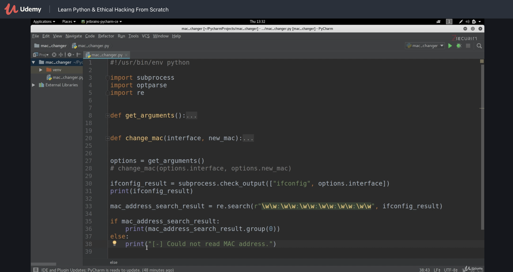
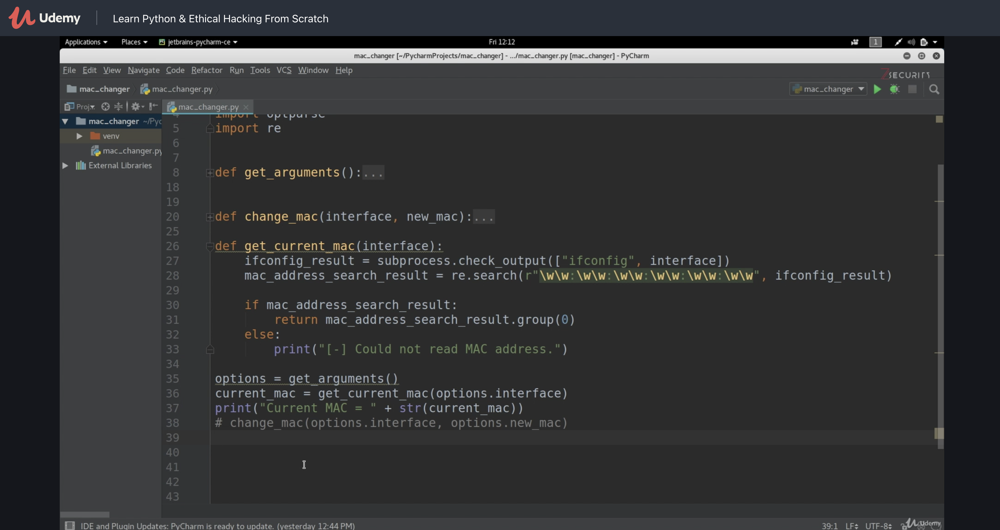
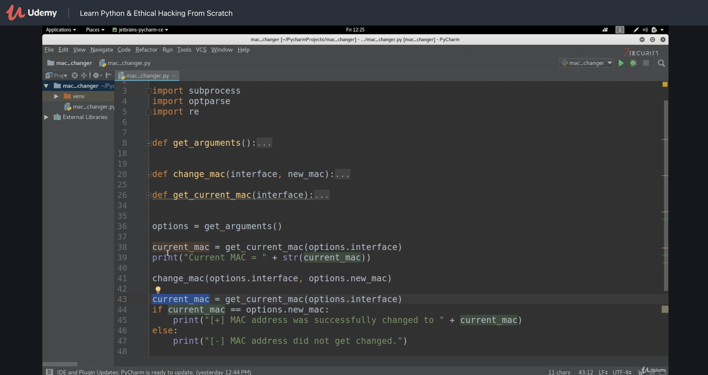

# Section 3: MAC Changer - Algorithm Design

Stdout eines mit `subprocess.run` gestarteten Programms – siehe [*](https://docs.python.org/3/library/subprocess.html#subprocess.CompletedProcess). 

```python
import subprocess
run_ret = subprocess.run("ls -l", shell=True, capture_output=True)
print(run_ret.stdout)
```

```
b'total 4\n-rw-r--r-- 1 runner runner 107 Jun 17 12:13 main.py\n'
```


`capture_output=True` muss angegeben werden damit `.stdout` einen Wert enthält

Mit `encoding` bzw. `subprocess.check_output`:

```python
import subprocess
run_ret = subprocess.run("ls -l", shell=True, capture_output=True, encoding="utf8")
print(run_ret.stdout)

result = subprocess.check_output(["ls","-l"],encoding="utf8")
print(result)
```

```
total 4
-rw-r--r-- 1 runner runner 200 Jun 17 12:23 main.py

total 4
-rw-r--r-- 1 runner runner 200 Jun 17 12:23 main.py
```


## Regex

Regular expression

[pythex](https://pythex.org/)

Suchen nach Mustern in großen Mengen Text




## Cleanup

Ermitteln der MAC Adresse in einer Funktion




## Validation




## Python3

`subprocess.check_output` liefert einen Bytestring. Lösung im Video:

```
str(ifconfig_result)
```

