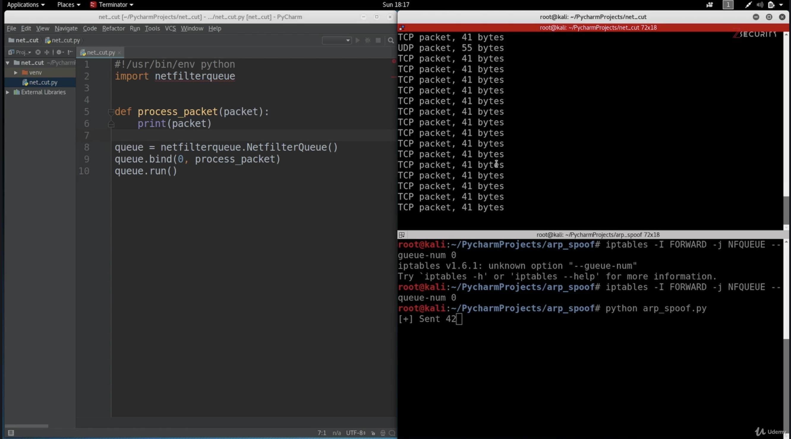
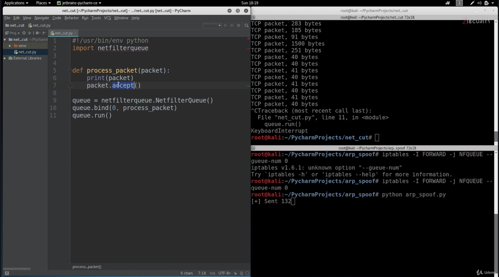
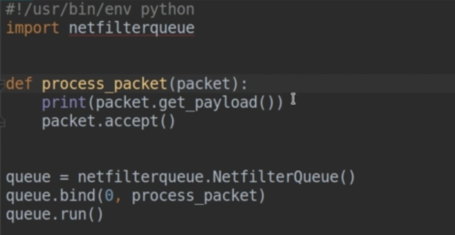
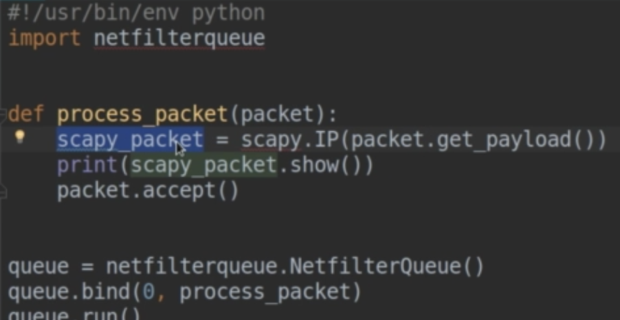
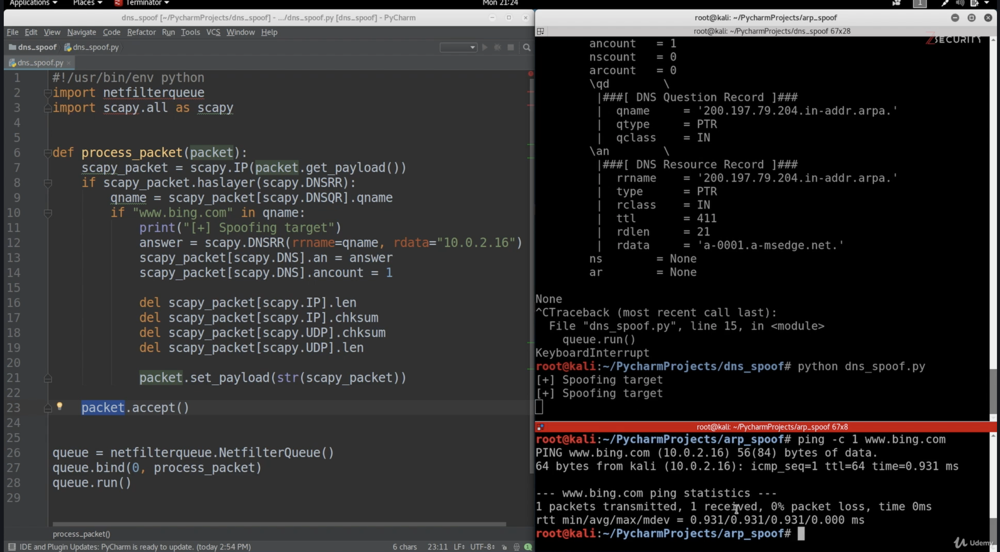

intercepting and modifying packets


Auf der Hacker Maschine eine eigene "router" Queue anlegen

use `iptables` to trap packets in a queue:

```sh
$ iptables -I FORWARD -j NFQUEUE --queue-num 0
# -I <chain> ... specify chain to modify
# -j <target> ... target of the rule
# NFQUEUE Netfilter Queue
# --queue-num <nr> queue number to access the queue
```

[explainshell.com](https://www.explainshell.com/explain?cmd=iptables+-I+FORWARD+-j+NFQUEUE+--queue-num+0)

 Python Modul `netfilterqueue` installieren:

```python
$ python3 -m pip install netfilterqueue
```





Die Pakete werde nicht weitergeleitet.



Statt `packet.accept()` kann auch `packet.drop()` verwendet werden.

Rücksetzten der Routing Regeln mit `iptables --flush`

Aus den Paketen Scapy Pakete machen:

Zum Testen des Programms auf dem lokalen Computer:

Pakete gehen nur in die FORWARD chain wenn sie von einem anderen Computer kommen. Daher müssen die Packete in der OUTPUT chain abgefangen werden (alle Pakete die den Computer verlassen). Und genau das gleich mit der INPUT chain

```sh
$ iptables -I OUTPUT -j NFQUEUE --queue-num 0
$ iptables -I INPUT -j NFQUEUE --queue-num 0
```


Ausgabe des Inhalts der Pakete:



In eine scapy Paket wandeln:




DNS Spoofing (Video 68-72)




