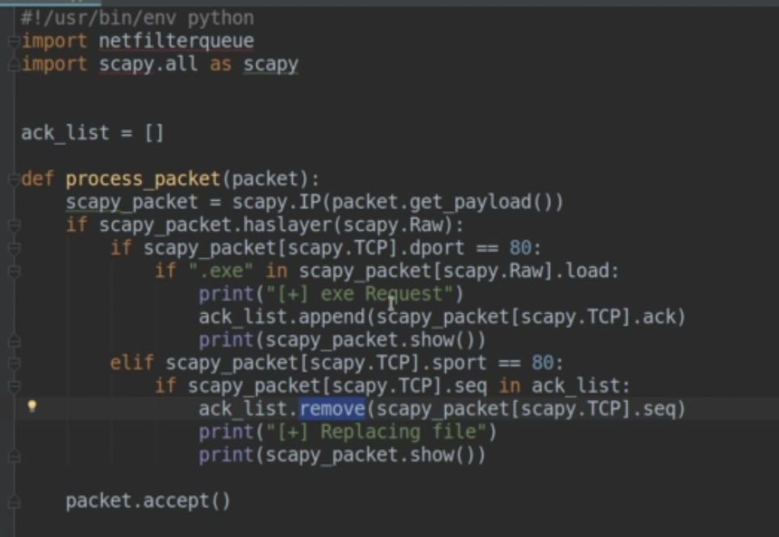
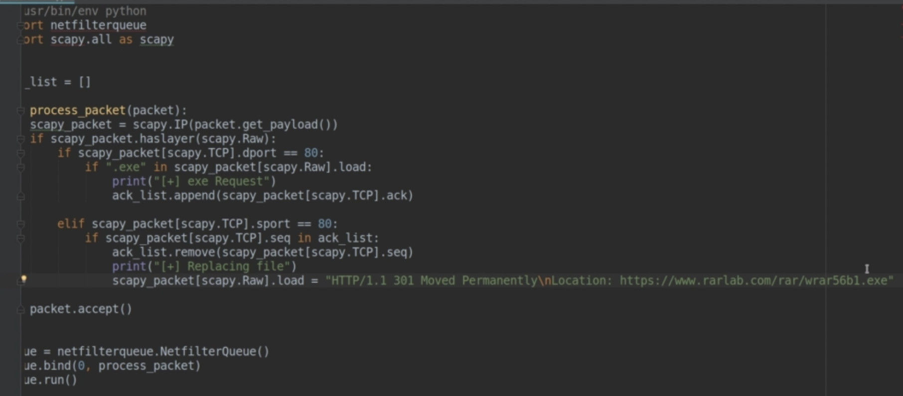
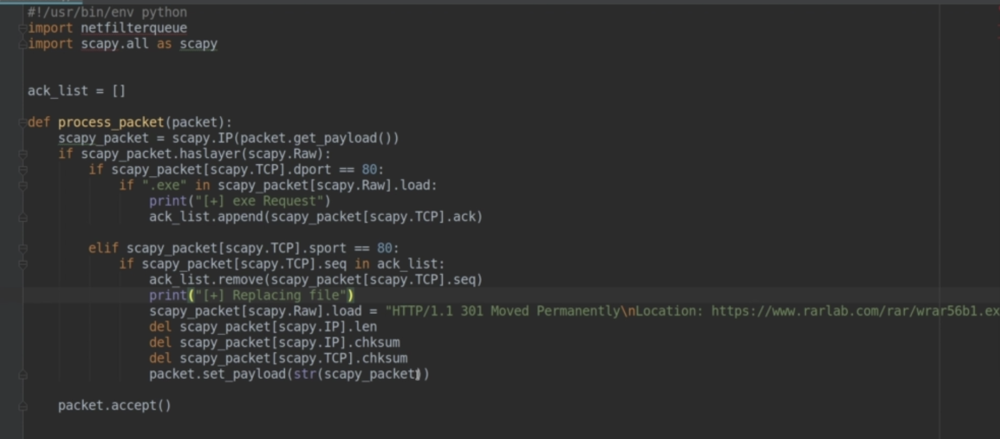

Daten im http Layer verändern.

Download des avg Virus Checker wird ausgetauscht (`evil.exe`).

Raw Layer sind die im TCP Paket übertragenen Nutzdaten (http) 


Response zum Request finden in dem ack und seq analysiert werden. Das ack von Request ist das seq von Response.




HTTP status codes, Redirection, `301 Moved Permanently`

```http
HTTP/1.1 301 Moved Permanently
Location: https://www.example.org/index.asp
```



Felder löschen damit Scapy diese automatisch neue berechnet.



`\n\n` noch am Ende des Redirection Strings anfügen

Austausch mit einem credential harvester (LaZagne).

