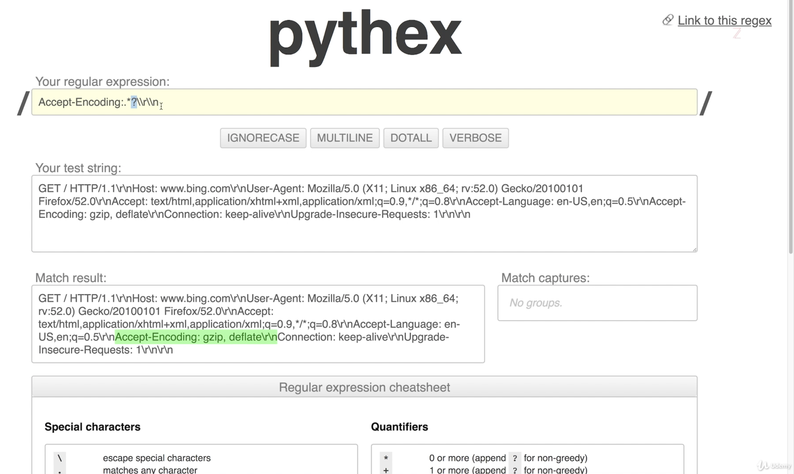
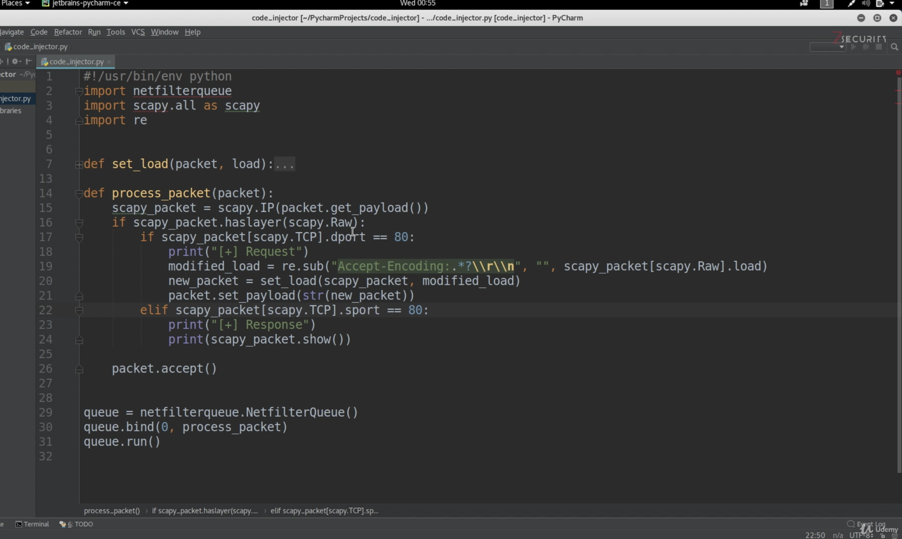
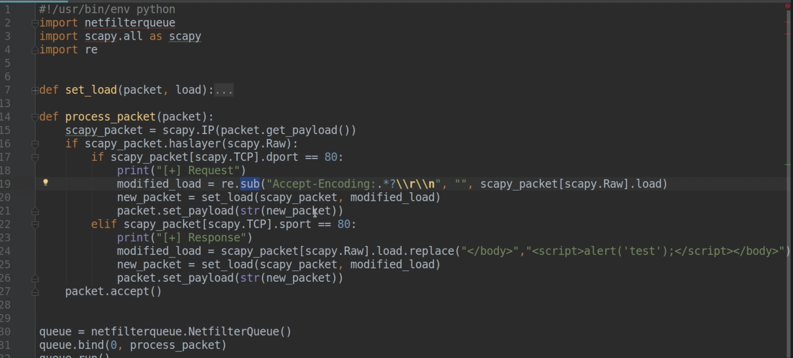
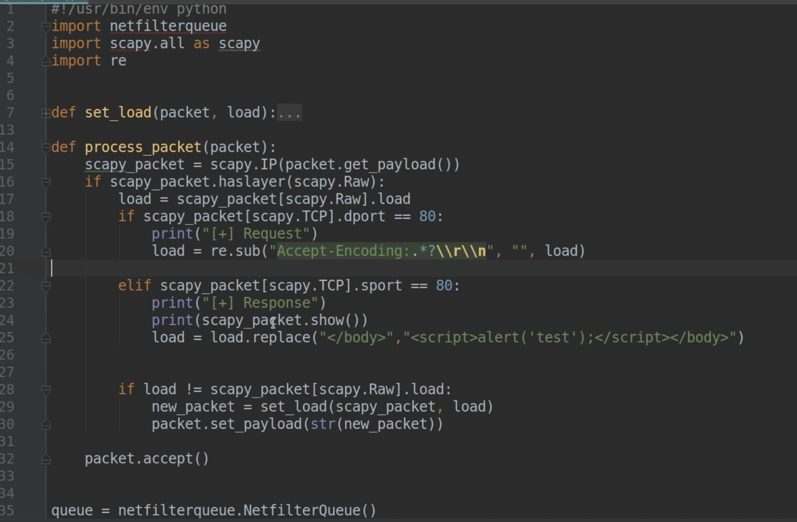
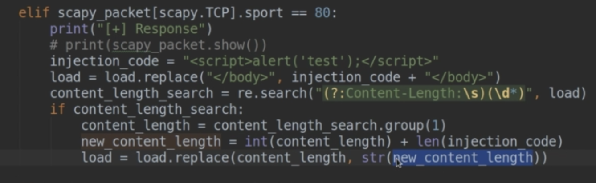
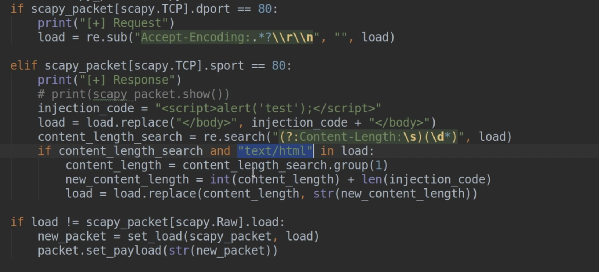

gzip encoding umgehen damit die website in plaintext übertragen wird.

Durch Löschen von `Accept-Encoding` im http Request







## Inject JS Code




## Housekeeping





## Issue

Nicht alle Websites laden korrekt. Grund: `Content-Length` im http Header.

Zahl mit regex extrahieren.

Regex "Groups and None-capturing Regex"



None-capturing ist eigentlich nicht notwendig (IMHO)

Noch ein Bugfix:




## BeEF Framework

Browser exploitation Framework. Video 88

```sh
$ apt update
$ apt install beef-xss
```

Beispiele für Kommandos:

- Create Alert Dialog
- Raw JavaScript – irgendein Skript starten
- Spyder Eye – Screenshot
- Redirect Browser


Delivering Malware:

BeEF>Social Engineering>Clippy
