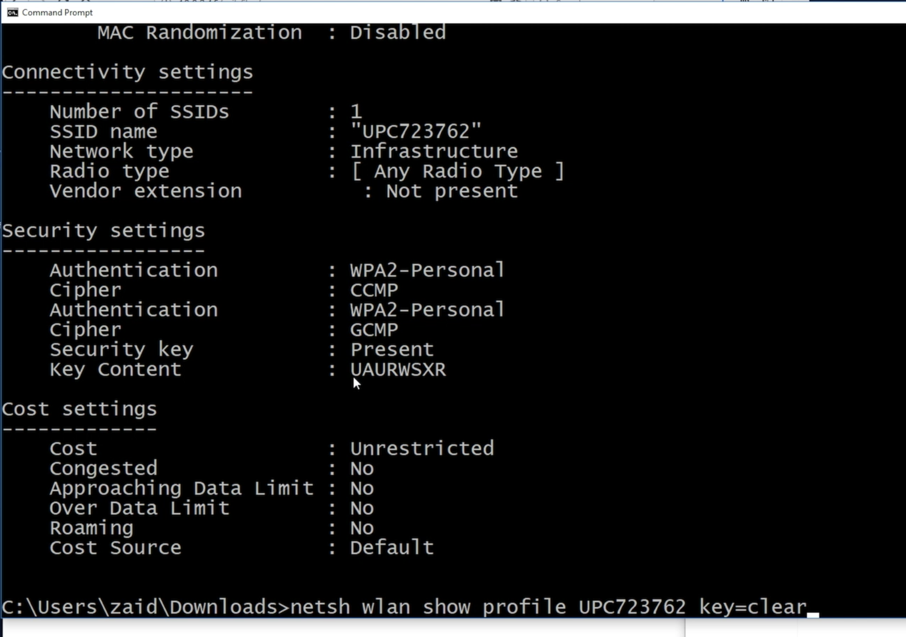

Listen aller WLAN mit denen ein Windows Rechner jemals verbunden war:

```
C:> netsh wlan show profile
```

Hängt man den WLAN Namen an erhält man mehr Informationen

```
C:> netsh wlan show profile WLNAME
```

Anzeige eines WLAN Passworts unter Windows mittels `key=clear`:




# Email schicken

Siehe [Email in Python](/Doc/Python/email)

