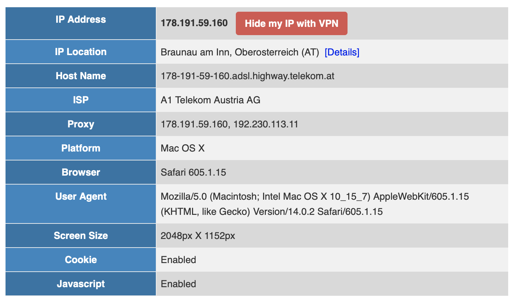
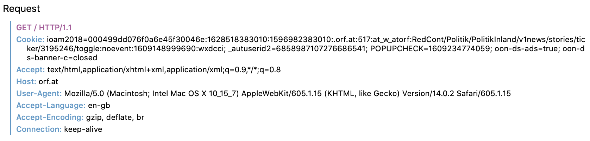

# web privacy

Was weiß ein Server alles über mich? Was wenn ich einen Proxy Server verwende?

STW: web privacy

# IP Adresse

Ein Server kennt die IP Adresse mit der er verbunden ist. Damit kann man die Position ermitteln:

[IP Location](https://www.iplocation.net)



Und Informationen über den Internet Provider:

```bash
$ whois 178.191.59.160
% IANA WHOIS server
...
inetnum:      178.0.0.0 - 178.255.255.255
organisation: RIPE NCC
status:       ALLOCATED
...
inetnum:        178.191.0.0 - 178.191.255.255
netname:        A1TA-HSI
descr:          High Speed Internet Customers
descr:          A1 Telekom Austria AG
country:        AT
...
```

Oder auch [](https://www.wieistmeineip.de), bzw. [](https://www.dein-ip-check.de)


# HTTP Request Header

HTTP Request (Zugriff auf ORF Seite, Safari)



Header Informationen werden von Web-Proxies durchgereicht (Experiment, 28.12.2020)


# Cookies

Wird durch den Server gesetzt und vom Client in jeder weiteren Anfrage mitgeschickt.

von developer.mozilla.org

> This shows the server sending headers to tell the client to store a pair of cookies:

```http
HTTP/2.0 200 OK
Content-Type: text/html
Set-Cookie: yummy_cookie=choco
Set-Cookie: tasty_cookie=strawberry

[page content]
```

>  Then, with every subsequent request to the server, the browser sends back all previously stored cookies to the server using the [`Cookie`](https://developer.mozilla.org/en-US/docs/Web/HTTP/Headers/Cookie) header.

```http
GET /sample_page.html HTTP/2.0
Host: www.example.org
Cookie: yummy_cookie=choco; tasty_cookie=strawberry
```

[Using HTTP cookies](https://developer.mozilla.org/en-US/docs/Web/HTTP/Cookies)

[http reques header Cookie](https://developer.mozilla.org/de/docs/Web/HTTP/Headers/Cookie)

[http response header Set-Cookie](https://developer.mozilla.org/de/docs/Web/HTTP/Headers/Set-Cookie)


# Browser Privacy

[What every Browser knows about you](https://webkay.robinlinus.com), da gehts mehr um den Browser und weniger um den Server, aber auch ganz interessant.


# Sammlung

User tracking: browser fingerprinting, cookies