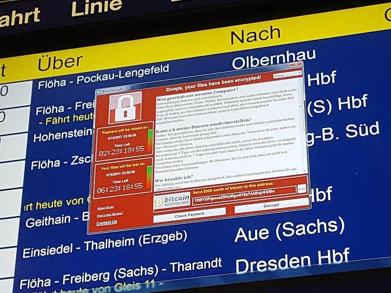

# Malware

Schadprogramme

Sind Programme die unerwünschte und meist schädliche Aktionen ausführen und beispielsweise dazu dienen 

- Daten zu stehlen, 
- fremde Rechner zu kontrollieren oder 
- Funktionen zu unterbinden.

Schadprogramme sind eine Bedrohung für Endgeräte (PC, Laptop, Handy, Tablet, Server) und teilweise auch für Infrastrukturkomponenten (Router, Switch).

Beispiele für Malware:

-   Adware
-   Virus
-   Trojaner
-   Ransomware
-   Würmer
-   Rootkit

Die Verbreitung von Schadsoftware kann passieren:

- Öffnen von Email Anhängen
- Anstecken von präparierten/infizierten USB Sticks
- Besuchen einer Internetseite (Drive-by-Download)
- Normaler Download (Malware ist als legitime Software getarnt = Trojaner)

Es gibt Baukastensysteme für Malware, sogenannte Exploit-Kits (auch Crimeware-Kits).

# Adware

Es wird unerwünschte Werbung angezeigt. Beliebt sind zum Beispiel erweiterte Werkzeugleisten für Internet Browser. Es können auch Suchergebnisse verfälscht werden. Sind nicht so gefährlich, können aber sehr störend und schwierig zu entfernen sein.

# Virus

Braucht einen Wirt, kann sich selbst vervielfältigen.

Computer-Virus: Hängt sich an ein anderes Programm oder Dokument an. Bei verwenden der infizierten Datei (z.B. Programm starten) wird auch der Virus aktiv und dieser versucht dann andere Dateien zu infizieren (Virus=Programm das sich selbst kopieren kann). Es gibt auch Viren die eine zeitlang untätig sind (dormant) und erst ab einem gewissen Datum/Uhrzeit aktiv werden.

Computerviren waren ein großes Problem am Anfang des 21 Jahrhunderts. Mittlerweile gibt es sehr gute Anti-Viren Software (Windows Defender bspw. schon im Standardumfang von Windows), die Systeme selbst sind robuster gegen Virenangriffe und die Angreifer haben andere und lukrativere Formen der Malware gefunden.

# Trojaner

Ist ein schädlicher Teil in einem ansonst legitim wirkenden Programm. Oft in gratis Spielen enthalten. Bei starten dieses Programms installiert sich der Trojaner unbemerkt und bleibt auch nach beenden des Programms aktiv. 

Trojaner können:

-   sofortige Schaden verursachen (z.B. Daten verschlüsseln, siehe Ransomware)
-   über Netzwerk fernsteuerbar sein (**backdoor**) – Einfallstor für weitere Schadsoftware
-   Informationen sammeln und versenden (**spyware**). Z.B. mitschneiden (keylogger) von Login Daten (Username/Passwort).
-   **Emotet** ist einer der gefährlichsten Trojaner aktuell

Einen Trojaner bauen: Eine **Payload** (z.B. backdoor shell) wird mittels **Wrapper** in einer **Carrier Application** versteckt. (Siehe Amberg Video 179)

# Würmer (Worm)

Gegensatz zu Virus: ein Wurm braucht keine Wirtsdatei.

Sind Programme deren Ziel es ist sich selbständig und möglichst schnell im Netz zu verbreiten. Nutzen Schwachstellen in Netzwerken. Die Verbreitung findet oftmals explosionsartig statt. 

In 2001 infiziert der Wurm "Code Red" innerhalb von 19 Stunden 300.000 Server.

1988 erster Wurm, Robert T. Morris. Ziel war nur die Verbreitung übers Netzwerk. Geriet außer Kontrolle. Zahlreiche Systeme lahmgelegt ohne es zu wollen – 3 Jährige Bewährungsstrafe, 400 Stunden Sozialdienst, hohe Geldstrafe. Heute Professor am MIT.

2010 [Stuxnet](https://en.wikipedia.org/wiki/Stuxnet): Gemeinsam von Israel und USA entwickelt um das iranische Atomprogramm lahmzulegen. 1000 Zentrifugen wurden mechanisch beschädigt – durch eine zu hohe Drehzahl.

Die Sandworm-Truppe (wird dem russischen Geheimdienst zugeordnet) hat 2017 die „NotPetya“-Malware mit Ziel Ukraine eingeschleust. Der Wurm hat sich allerdings unkontrolliert verbreitete, es wurden quer durch Europa Schäden von geschätzten zehn Milliarden Euro angerichtet. Quelle: fm4

 

# Ransomware

Verschlüsselungserpresser – Sehr populär und profitabel. Bekannt seit 1989. Häufig Angriffe auf Firmen und Organisationen.

Die Daten werden verschlüsselt und ein Arbeiten mit dem System ist nicht mehr möglich. Der Schlüssel um die Daten wieder zu entschlüsseln muss gekauft werden (Millionen-Beträge bei größeren Firmen). Die finanzielle Transaktion erfolgt über Bitcoins.

> Organisationen haben 2020 im Schnitt mehr als 300.000 Dollar pro Angriff bezahlt. [DIE ZEIT No 21 20. Mai 2021]

Bitcoins:

- Kryptowährung
- anonym
- nicht nachverfolgbar
- Anarchistische Wurzeln, kein Vertrauen in Staat bzw. Zentralbanken
- 2017: 72 Mrd. USD – 44% aller Transaktionen (25% der user)  stehen mit illegalen Aktivitäten in Verbindung

> Australian researchers have estimated that 25% of all bitcoin users and 44% of all bitcoin transactions are associated with illegal activity as of April 2017. There were an estimated 24 million bitcoin users primarily using bitcoin for illegal activity. They held USD8 billion worth of bitcoin, and made 36 million transactions valued at  USD​72 billion.[[261\]](https://en.wikipedia.org/wiki/Bitcoin#cite_note-SDB1-275)[[262\]](https://en.wikipedia.org/wiki/Bitcoin#cite_note-SDB2-276)

Neuer Trend: Zusätzlich Datendiebstahl und die Androhung dies im Internet zu veröffentlichen.

Bekannte Ransomware: 

- **Wannacry** – Bisher 230.000 Systeme in 150 Ländern, größter Cybercrime Angriff bisher. Verbreitet sich als Wurm von Rechner zu Rechner im Windows Netz.
- **Petya** – Als Bewerbungsschreiben in Email getarnt. Manipuliert Master Boot Record – Rechner startet nicht mehr.
- **Locky** – Verschlüsselten Dateien bekommen die Endung `.locky`

Ransomware wird per Virus, Trojaner oder Wurm eingeschleust. Häufigst (⅔ aller Fälle) erfolgt die Verbreitung per Spam E-Mail (Info: 55% Anteil Spam am weltweiten Email Verkehr in 2019). Manchmal auch durch social engineering (IT Support ruft an, übernimmt den Rechner per Fernsteuerung und fragt nach dem Passwort dann wird unbemerkt ein Trojaner installiert).

[fm4: Verschlüsselungserpresser legen nun große Konzerne lahm](https://fm4.orf.at/stories/3007764/)

**WannaCry** bei Deutscher Bahn:

**Petya**

## Colonial Pipeline Ransomware Hack

> 
>
> [...] Instead, Colonial paid DarkSide $4.4 million in Bitcoin for a key to unlock its files. “I will admit that I wasn’t comfortable seeing money go out the door to people like this,” CEO Joseph Blount told The Wall Street Journal.
>
> [...] 
>
> Mai, 2021: Together, DarkSide and its affiliates reportedly grossed at least USD 90 million. Seven of Tantleff's clients, including two companies in the energy industry, paid ransoms ranging from USD1.25 million to USD6 million, reflecting negotiated discounts from initial demands of USD7.5 million to USD30 million. His other three clients hit by DarkSide did not pay. In one of those cases, the hackers demanded USD50 million. Negotiations grew acrimonious, and the two sides couldn’t agree on a price. [[*](https://www.propublica.org/article/the-colonial-pipeline-ransomware-hackers-had-a-secret-weapon-self-promoting-cybersecurity-firms)]

# Rootkit

root = Username des Administrators mit privilegierten Rechten auf Unix Systemen.

Es werden Betriebssystemkomponenten ausgetauscht um die Präsenz von Malware zu verschleiern. Z.B. werden gewisse Programme, Prozesse oder Kommunikationsvorgänge nicht angezeigt.

# Abwehr / Schutz

## Technische Abwehr

Systeme "härten":

- Lücken in der Konfiguration schließen (z.B. Default Passwörter)
- Für aktuelle **Backups** sorgen (Recovery im Fall der Fälle)
- Aktuelle Software Updates (inbes. Betriebssystem und Browser)
  - Fast immer werden Fehler und Schwachstellen von Systemen ausgenutzt damit Malware sich verbreiten kann. Tagesaktuelle Updates (Patches) versuchen diese Löcher so schnell wie möglich zu stopfen. Es ist daher absolut wesentlich alle Systeme immer am aktuellsten Software Stand zu halten.
- Mit eingeschränkten Rechten arbeiten (nicht als Administrator)
- Passwort mit gewisser Komplexität
- Automatisches Starten von Skripten deaktivieren (Office, ...)
- Email Spam-Filter
- Endpoint Security
  - Host-based Malware Protection
    - Anti-Virus / Anti-Malware
      - Signature based – scan aller Dateien auf gewisse Bytefolgen. Findet nur bereits bekannte Malware. Updates wichtig
      - Heuristic analysis – beobachtet Programme auf verdächtiges Verhalten.
  - Host based Firewall
- Network-based Malware Protection (Firewall, ...)
  - Sind eigenständige Geräte oder eine Zusatzfunktion in einem Router bzw. Switch.

      - Firewalls
      - IDS – Intrusion Detection System
      - IPS – Intrusion Prevention System

## Nicht technischer Schutz

- Gesundes Mißtrauen pflegen (auch bei bekannten Absendern – können gefälscht sein)
- Keine Programme aus zweifelhafter Quelle starten. Im Zweifel:
  - Virus-check ([VirusTotal](https://www.virustotal.com/))
  - Signatur/Hash prüfen
- **Security Awareness Training** – Schulung/Information der Anwender – diese sind das schwächste Glied in der Verteidigung.
  - Keine verdächtigen Email Anhänge öffnen
  - SPAM Mail erkennen
  - Passwörter geheim halten
  - Verdächtige Kontaktaufnahmen erkennen können

# Schadensfall

Im betrieblichen Umfeld einen Plan bereithalten – **security incident response plan**.

Bei Ransomware:

- Nicht auf die Forderungen eingehen. Entschlüsselung ist nicht garantiert. 
- Prüfen: sind die Daten wirklich verschlüsselt. 
- Versuchen die Malware zu entfernen – Gibt es einen Crack für die Malware?
- Anzeige erstatten.

