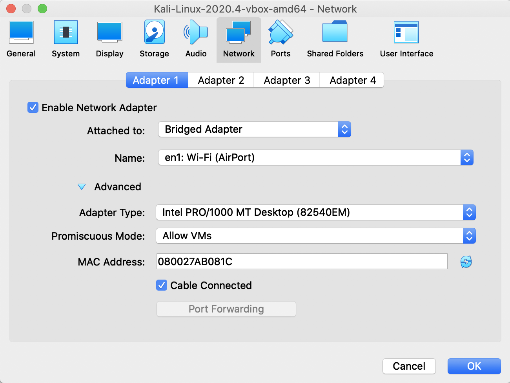

# Telnet

Aufzeichnen einer telnet Verbindung. Erkenntnis: Username und Passwort wird im Klartext übertragen.


# Konfiguration

- Metasploitable (bringt telnet server mit)

- Kali (telnet client und wireshark)

- Win10 (telnet client), wenn promiscuous mode funktoiniert

  

[Windwos 10 telnet aktivieren](../../Windows/windows.md#telnet)


# Kali Linux – Wireshark

- In den VirtualBox Netzwerkeinstellungen – **Promiscuous Mode**=Allow VMs:




- Wireshark über die Kommandozeile starten `sudo wireshark`.
- Display Filter: `ip.addr==10.0.0.123 and tcp.port==23 `
- `telnet 10.0.0.123`
  - MacOS: telnet muss auch auf Kali Linux gestartet werden. Sonst sieht man die Pakete nicht. Kein Promiscuous Mode?
- Passwort wird in einzelnen Buchstaben übertragen.
- Analyze>Follow>TCP Stream (oder rechte Maustaste auf Packet: Follow>TCP Stream)


# tcpdump

Telnet Verbindung von Kali auf Metasploitable, user:alice, pass: alice

```sh
tcpdump -tnAi eth0 dst host 192.168.178.76 and port 23
```

Aufzeichnung der Daten vom Client zum Server (`dst host`)

```
tcpdump: verbose output suppressed, use -v[v]... for full protocol decode
listening on eth0, link-type EN10MB (Ethernet), snapshot length 262144 bytes
IP 192.168.178.81.55930 > 192.168.178.76.23: Flags [S], seq 2324838233, win 64240, options [mss 1460,sackOK,TS val 1131257007 ecr 0,nop,wscale 7], length 0
E..<..@.@.G....Q...L.z....7Y...................
Cm..........
IP 192.168.178.81.55930 > 192.168.178.76.23: Flags [.], ack 4249176503, win 502, options [nop,nop,TS val 1131257013 ecr 48647], length 0
E..4..@.@.G....Q...L.z....7Z.EI............
Cm......
IP 192.168.178.81.55930 > 192.168.178.76.23: Flags [P.], seq 0:27, ack 1, win 502, options [nop,nop,TS val 1131257013 ecr 48647], length 27 [telnet DO SUPPRESS GO AHEAD, WILL TERMINAL TYPE, WILL NAWS, WILL TSPEED, WILL LFLOW, WILL LINEMODE, WILL NEW-ENVIRON, DO STATUS, WILL XDISPLOC]
E..O..@.@.G....Q...L.z....7Z.EI......0.....
Cm................. ..!.."..'.....#
IP 192.168.178.81.55930 > 192.168.178.76.23: Flags [.], ack 13, win 502, options [nop,nop,TS val 1131257032 ecr 48650], length 0
E..4..@.@.G....Q...L.z....7u.EI............
Cm.....

IP 192.168.178.81.55930 > 192.168.178.76.23: Flags [.], ack 52, win 502, options [nop,nop,TS val 1131257032 ecr 48650], length 0
E..4..@.@.G....Q...L.z....7u.EI............
Cm.....

IP 192.168.178.81.55930 > 192.168.178.76.23: Flags [P.], seq 27:110, ack 52, win 502, options [nop,nop,TS val 1131257033 ecr 48650], length 83 [telnet SB NAWS IS 0x95 0 0x35 SE, SB TSPEED IS 0x33 0x38 0x34 0x30 0x30 0x2c 0x33 0x38 0x34 0x30 0x30 SE, SB XDISPLOC IS 0x6b 0x61 0x6c 0x69 0x3a 0x30 0x2e 0x30 SE, SB NEW-ENVIRON IS 0 0x44 0x49 0x53 0x50 0x4c 0x41 0x59 0x1 0x6b 0x61 0x6c 0x69 0x3a 0x30 0x2e 0x30 SE, SB TERMINAL TYPE IS 0x78 0x74 0x65 0x72 0x6d 0x2d 0x32 0x35 0x36 0x63 0x6f 0x6c 0x6f 0x72 SE]
E.....@.@.G....Q...L.z....7u.EI......h.....
Cm.....
......5.... .38400,38400....#.kali:0.0....'..DISPLAY.kali:0.0......xterm-256color..
IP 192.168.178.81.55930 > 192.168.178.76.23: Flags [.], ack 55, win 502, options [nop,nop,TS val 1131257034 ecr 48650], length 0
E..4..@.@.G....Q...L.z....7..EI............
Cm.....

IP 192.168.178.81.55930 > 192.168.178.76.23: Flags [P.], seq 110:113, ack 55, win 502, options [nop,nop,TS val 1131257034 ecr 48650], length 3 [telnet WONT ECHO]
E..7..@.@.G....Q...L.z....7..EI............
Cm.....
...
IP 192.168.178.81.55930 > 192.168.178.76.23: Flags [.], ack 58, win 502, options [nop,nop,TS val 1131257036 ecr 48650], length 0
E..4..@.@.G....Q...L.z....7..EI............
Cm.....

IP 192.168.178.81.55930 > 192.168.178.76.23: Flags [P.], seq 113:116, ack 58, win 502, options [nop,nop,TS val 1131257036 ecr 48650], length 3 [telnet DO ECHO]
E..7..@.@.G....Q...L.z....7..EI............
Cm.....
...
IP 192.168.178.81.55930 > 192.168.178.76.23: Flags [.], ack 678, win 501, options [nop,nop,TS val 1131257036 ecr 48650], length 0
E..4..@.@.G....Q...L.z....7..EL\...........
Cm.....

IP 192.168.178.81.55930 > 192.168.178.76.23: Flags [P.], seq 116:117, ack 678, win 501, options [nop,nop,TS val 1131259601 ecr 48654], length 1
E..5..@.@.G....Q...L.z....7..EL\...........
Cm......a
IP 192.168.178.81.55930 > 192.168.178.76.23: Flags [.], ack 679, win 501, options [nop,nop,TS val 1131259601 ecr 48907], length 0
E..4..@.@.G....Q...L.z....7..EL]...........
Cm......
IP 192.168.178.81.55930 > 192.168.178.76.23: Flags [P.], seq 117:118, ack 679, win 501, options [nop,nop,TS val 1131259870 ecr 48907], length 1
E..5..@.@.G....Q...L.z....7..EL]...........
Cm......l
IP 192.168.178.81.55930 > 192.168.178.76.23: Flags [.], ack 680, win 501, options [nop,nop,TS val 1131259871 ecr 48934], length 0
E..4..@.@.G....Q...L.z....7..EL^...........
Cm.....&
IP 192.168.178.81.55930 > 192.168.178.76.23: Flags [P.], seq 118:119, ack 680, win 501, options [nop,nop,TS val 1131260085 ecr 48934], length 1
E..5..@.@.G....Q...L.z....7..EL^...........
Cm.....&i
IP 192.168.178.81.55930 > 192.168.178.76.23: Flags [.], ack 681, win 501, options [nop,nop,TS val 1131260085 ecr 48955], length 0
E..4..@.@.G....Q...L.z....7..EL_...........
Cm.....;
IP 192.168.178.81.55930 > 192.168.178.76.23: Flags [P.], seq 119:120, ack 681, win 501, options [nop,nop,TS val 1131260208 ecr 48955], length 1
E..5..@.@.G....Q...L.z....7..EL_...........
Cm.0...;c
IP 192.168.178.81.55930 > 192.168.178.76.23: Flags [.], ack 682, win 501, options [nop,nop,TS val 1131260209 ecr 48967], length 0
E..4..@.@.G....Q...L.z....7..EL`...........
Cm.1...G
IP 192.168.178.81.55930 > 192.168.178.76.23: Flags [P.], seq 120:121, ack 682, win 501, options [nop,nop,TS val 1131260355 ecr 48967], length 1
E..5..@.@.G....Q...L.z....7..EL`...........
Cm.....Ge
IP 192.168.178.81.55930 > 192.168.178.76.23: Flags [.], ack 683, win 501, options [nop,nop,TS val 1131260355 ecr 48982], length 0
E..4..@.@.G....Q...L.z....7..ELa...........
Cm.....V
IP 192.168.178.81.55930 > 192.168.178.76.23: Flags [P.], seq 121:123, ack 683, win 501, options [nop,nop,TS val 1131260546 ecr 48982], length 2
E..6..@.@.G....Q...L.z....7..ELa...........
Cm.....V.
IP 192.168.178.81.55930 > 192.168.178.76.23: Flags [.], ack 685, win 501, options [nop,nop,TS val 1131260547 ecr 49001], length 0
E..4..@.@.G....Q...L.z....7..ELc...........
Cm.....i
IP 192.168.178.81.55930 > 192.168.178.76.23: Flags [.], ack 695, win 501, options [nop,nop,TS val 1131260548 ecr 49001], length 0
E..4..@.@.G....Q...L.z....7..ELm...........
Cm.....i


IP 192.168.178.81.55930 > 192.168.178.76.23: Flags [P.], seq 123:124, ack 695, win 501, options [nop,nop,TS val 1131261300 ecr 49001], length 1
E..5..@.@.G....Q...L.z....7..ELm...........
Cm.t...ia
IP 192.168.178.81.55930 > 192.168.178.76.23: Flags [P.], seq 124:125, ack 695, win 501, options [nop,nop,TS val 1131261469 ecr 49080], length 1
E..5..@.@.G....Q...L.z....7..ELm...........
Cm......l
IP 192.168.178.81.55930 > 192.168.178.76.23: Flags [P.], seq 125:126, ack 695, win 501, options [nop,nop,TS val 1131261694 ecr 49093], length 1
E..5..@.@.G....Q...L.z....7..ELm...........
Cm......i
IP 192.168.178.81.55930 > 192.168.178.76.23: Flags [P.], seq 126:127, ack 695, win 501, options [nop,nop,TS val 1131261851 ecr 49116], length 1
E..5.   @.@.G....Q...L.z....7..ELm...........
Cm......c
IP 192.168.178.81.55930 > 192.168.178.76.23: Flags [P.], seq 127:128, ack 695, win 501, options [nop,nop,TS val 1131261930 ecr 49132], length 1
E..5
@.@.G....Q...L.z....7..ELm...........
Cm......e


IP 192.168.178.81.55930 > 192.168.178.76.23: Flags [P.], seq 128:130, ack 695, win 501, options [nop,nop,TS val 1131262155 ecr 49139], length 2
E..6..@.@.G....Q...L.z....7..ELm...........
Cm.......
IP 192.168.178.81.55930 > 192.168.178.76.23: Flags [.], ack 697, win 501, options [nop,nop,TS val 1131262162 ecr 49163], length 0
E..4..@.@.G....Q...L.z....7..ELo...........
Cm......
IP 192.168.178.81.55930 > 192.168.178.76.23: Flags [.], ack 1204, win 501, options [nop,nop,TS val 1131262163 ecr 49163], length 0
E..4..@.@.G....Q...L.z....7..ENj...........
Cm......
IP 192.168.178.81.55930 > 192.168.178.76.23: Flags [.], ack 1232, win 501, options [nop,nop,TS val 1131262231 ecr 49169], length 0
E..4..@.@.G....Q...L.z....7..EN............
Cm......
IP 192.168.178.81.55930 > 192.168.178.76.23: Flags [.], ack 1256, win 501, options [nop,nop,TS val 1131262232 ecr 49170], length 0
E..4..@.@.G....Q...L.z....7..EN............
Cm......

```


