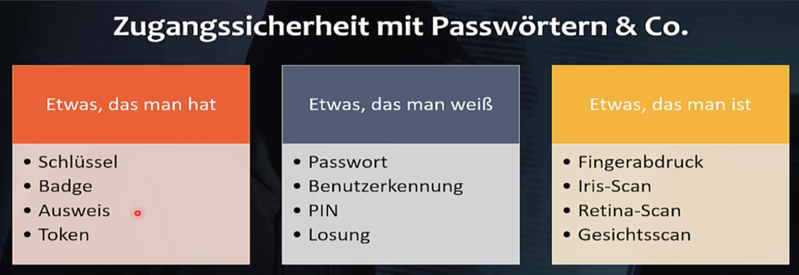
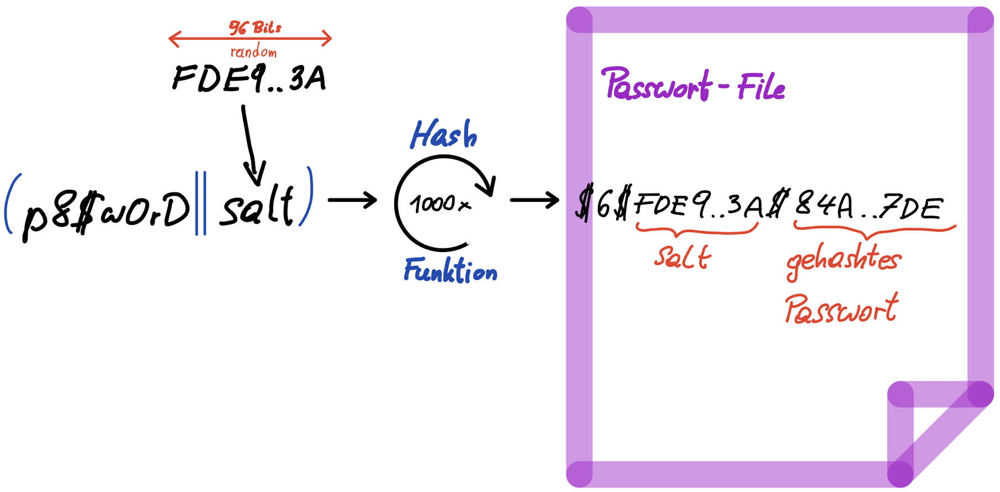

* TOC
{:toc}

# Allgemein

Ein Passwort ist eine geheime Zeichenfolge die zusätzlich zu einem Benutzernamen verwendet wird um die Identität einer Person zu bestätigen (engl. credentials). Benutzername/Passwort ist die **häufigste** Methode zur **Authentifizierung**.

Passwörter:

- sollen nicht aufgeschrieben werden
- sollen eine gewisse Komplexität aufweisen (Länge, Sonderzeichen, Zahlen, ...)
- sollen nicht erraten werden können (Geburtsdatum, Name der Kinder, ...)


Aus technischer Sicht:

- sollen nicht im Klartext gespeichert werden (Hashing)
- sollen nicht im Klartext im Netzwerk versendet werden (Verschlüsselung)


## Weitere Möglichkeiten




Zusätzliche Sicherheit: Zwei-Faktor-Authentifizierung


# Passwörter speichern

Es wird nicht dass Passwort gespeichert sondern dessen Hashwert. Eigenschaften:

- das Passwort kann daraus nicht wiederhergestellt werden.
- prüfen ob Passwort gültig.

Fällt dieser Hashwert in unbefugte Hände ist dieser erst einmal nutzlos. 

Beispiel – Linux Passwort File:

```
matejka:$6$Y.6vLGlD1cGsutIg$Hn2/2.hNyojM19F1AwNHPAzAHEk.3vPhsOqWOGyds5hieGvedb45DCxV5aqZ194w12zhaet1rhWJyCx/mzePk.:1000:1000:Franz MATEJKA,,,:/home/matejka:/bin/bash
```

Format:

```
Username:Password:UID:GID:Info:Home:Shell
```

**Passwort festlegen**: Legt ein Benutzer erstmalig sein Passwort fest wir dieses gehasht und der Hashwert im Passwort-File gespeichert. Der Klartext wird nicht länger als notwendig gespeichert.

**Passwort prüfen**: Benutzer gibt Name und Passwort ein. Der Hashwert des eingegebenen Passworts wird mit dem gespeicherten Hashwert verglichen – ist dieser gleich ist der Benutzer authentifiziert.


# Angriffe

Möglichkeit um in den Besitz von Passwörtern zu kommen 

- **Erraten** (*password guessing*) – selten erfolgreiche
- **Erfragen**, social engineering ("this is  technical support calling, please be kind and help me, this is very urgent, your computer was hacked ... please tell me your password")
- **Phishing** (gefälschte Login Seiten)
- **Keylogger** (Hardware, Malware, *side channel attack*)
- **Passwort** File stehlen (*password breach*) und Passwörter knacken (*password cracking*)


# Password Breach

Passwort Datei wird gestohlen. Kommt häufig vor und betrifft sehr viele Benutzerdaten

- [wikipedia - List of data breaches](https://en.wikipedia.org/wiki/List_of_data_breaches)
- [Data breach](https://en.wikipedia.org/wiki/Data_breach#2019)

- [;--have i been pwned?](https://haveibeenpwned.com)

> For  3.77M users the attacker got their email address and a hash of their password. For 3.55M of these users, the method to hash the password is bcrypt, and for the remaining 229K users the method was salted MD5. Since then we have updated the hash of all users to bcrypt. [2020, [Statement on Security Incident at Freepik Company](https://www.freepik.com/blog/statement-on-security-incident-at-freepik-company/)]

Damit kommt ein Hacker in den Besitz der Hashwerte – per PW cracking werden daraus die ursprünglichen Passwörter wiederhergestellt. 

Grundidee: alle möglichen Passwörter durchprobieren, d.h. Hashwert berechnen und mit dem gestohlenen Hashwert vergleichen. Stimmen die Hashwerte überein ist das gesuchte Passwort gefunden. 

Es gibt mehrere Möglichkeiten:

- brute force attack (alle Varianten durchprobieren ob der gesuchte Hash herauskommt)
- dictionary attack (häufige Wörter probieren)

- Namen, Geburtsdatum, etc. Kombinationen

Um diese Angriffe zu beschleunigen wird häufig die Rechenleistung von Grafikkarten genutzt.

# Verteidigung

Das PW cracking muss sehr zeitintensiv sein. Dies wird durch 3 Maßnahmen erreicht

- Password Complexity
  - Langes Passwort
  - Viele mögliche Zeichen (Groß, Klein, Ziffern, Sonderzeichen)
  - Keine erratbaren Bestandteile (Namen, Geburtsdatum, ...)
- Key stretching
- Salting

## Key stretching

Den Vorgang aus dem Text eines Passworts einen Hashwert zu erzeugen nennt sich **key derivation**. Wenn dabei die Hash Funktion viele Male (1000-100000x, Runden, rounds) hinereinander angewendet wird so bezeichnet man das als **key stretching**. Dadurch wird die Anfälligkeit (vulnerability) gegen einen brute force Angriff reduziert weil die Berechnung eines einzelnen Hashwerts viel aufwändiger wird.

Die Anzahl der Wiederholungen wird so gewählt, dass man die bestmögliche HW Ausstattung eines Angreifers annimmt und dafür die key derivation eine bestimmte Mindestzeit in Anspruch nehmen soll (z.B. 10 ms). Da sich die HW ständig verbessert steigert sich auch die Rundenzahl mit der Zeit.

## Salt

Wählen zwei unterschiedliche Nutzer das gleiche Passwort so ergibt sich auch der gleiche Hashwert. 

```
alice : mypass123 -> 3AF9
bob   : mypass123 -> 3AF9
```

Nachteile:

- Information für einen Angreifer
- Angriff per rainbow-tables möglich. Enorme beschleunigung des brute-force-attacks. Hashwerte werden vorberechnet (riesige Tabellen)

Lösung: 

Ein "salt" (kryptographisches Salz) ist eine zufällige Zahl die vor dem Hashing an das Passwort angefügt wird. Bei jedem Ändern des Passworts wird ein neues, zufälliges salt gewählt.

> *salt* should be about 16 or more bytes from a proper source, e.g. [`os.urandom()`](https://docs.python.org/3/library/os.html#os.urandom).

Das gehashte PW wird gemeinsam mit dem Salt gespeichert. Das Salt ist nicht sicherheitsrelevant - es geht nur darum den brute force attack zu verlangsamen.

Dieses Salt sorgt dafür, dass gleiche Passwörter sich nie auf den gleichen Hashwert abbilden.


## Salted key stretching

Aktuell Stand der Technik



Standard Algorithmen:

- [crypt](https://en.wikipedia.org/wiki/Crypt_(C)) (UNIX)
- [PBKDF2](https://en.wikipedia.org/wiki/PBKDF2)
- [scrypt (RFC7914)](https://tools.ietf.org/html/rfc7914.html) – neuerer Standard (2016), berücksichtigt die ständig steigende Rechenleistung die Anfreifern zur Verfügung steht.


# Technische Details – Linux

Passwörter werden **nicht im Klartext gespeichert** sondern gehasht und "salted" (gesalzen ;-).


Zusätzlich wichtig: Passwort File vor unauthorisiertem Zugriff schützen (Schreib/Lese Rechte!).

Unter Linux sind 2 Files beteiligt:

- `/etc/password` und
- `/etc/shadow`

```sh
# ls -l /etc/passwd /etc/shadow
-rw-r--r-- 1 root root   3042 Feb 23 05:38 /etc/passwd
-rw-r----- 1 root shadow 1577 Feb 23 05:38 /etc/shadow
```

Zeile in passwd:

```
kali:x:1000:1000:Kali,,,:/home/kali:/usr/bin/zsh
```

`:x:` bedeutet, dass der Passwort-Hash in der `shadow` Datei ist:

```
kali:$y$j9T$h.cekCfg097LWvTwVtk8T0$fcGogK/pi581lOUbxBwtEzH7l/zKL0atAeu9DV.BW86:18681:0:99999:7:::
```

- `$y$`: yescrypt
- `j9T`: Parameter für yescrypt
- `h.cekCfg097LWvTwVtk8T0`: Salt
- `pi581lOUbxBwtEzH7l/zKL0atAeu9DV.BW86`: PW Hash

yescrypt existiert erst seit 2015 [[*](https://www.password-hashing.net/submissions/specs/yescrypt-v2.pdf)]


Beispiel (SHA-512) – bis vor kurzem in Kali Linux verwendet (passwd mittels unshadow):

```
matejka:$6$Y.6vLGlD1cGsutIg$Hn2/2.hNyojM19F1AwNHPAzAHEk.3vPhsOqWOGyds5hieGvedb45DCxV5aqZ194w12zhaet1rhWJyCx/mzePk.:1000:1000:Franz MATEJKA,,,:/home/matejka:/bin/bash
```

- `$6$`: Verwendeter Hash Algorithmus (`$6$`=crypt mit SHA-512)
- `Y.6vLGlD1cGsutIg`: Salt, Radix-64
- `Hn2/2.hNyojM19F1AwNHPAzAHEk.3vPhsOqWOGyds5hieGvedb45DCxV5aqZ194w12zhaet1rhWJyCx/mzePk.`: Passwort-Hash, Radix-64

Radix-64 ≠ Base64

*Default 5000 rounds*
