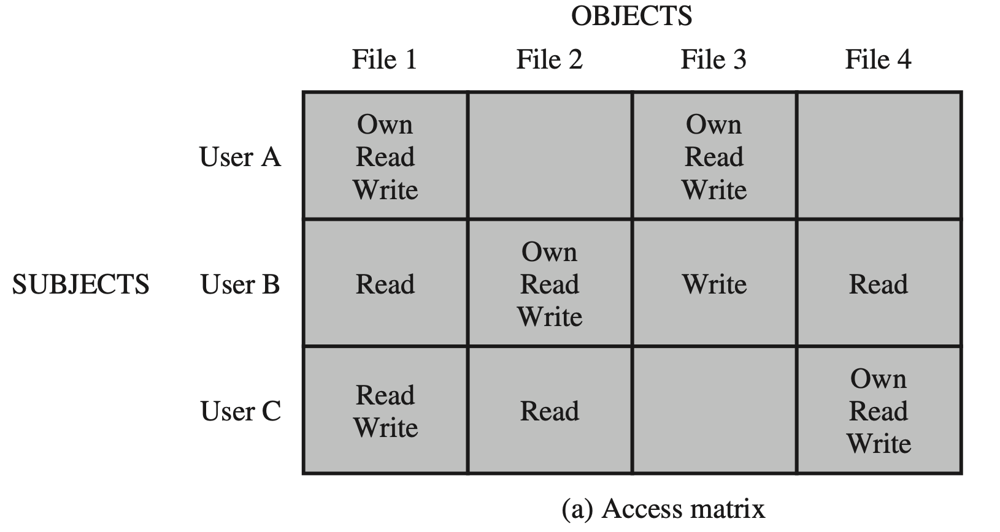
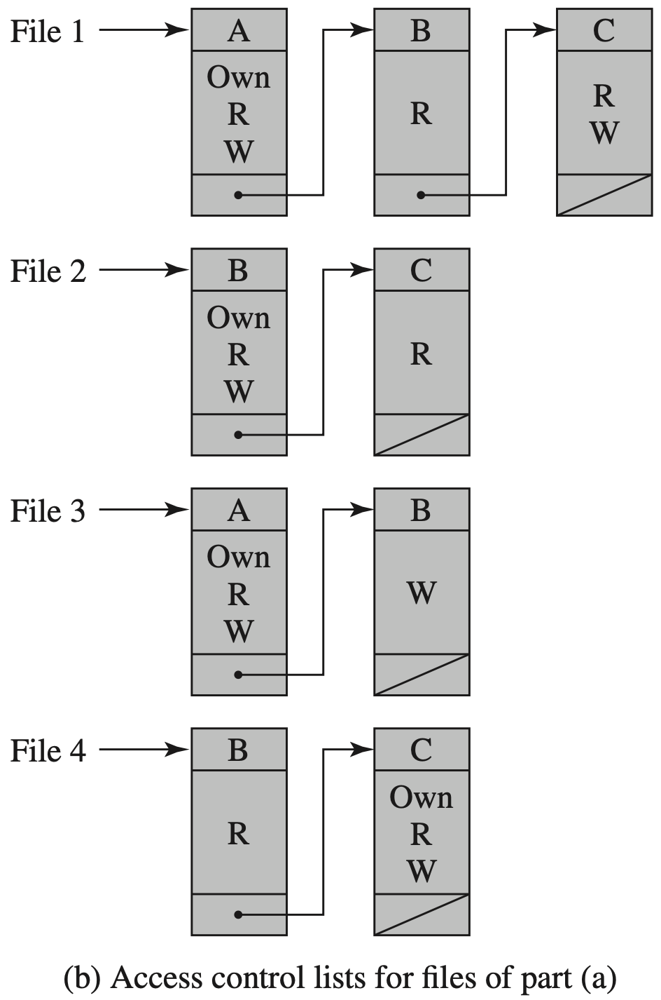
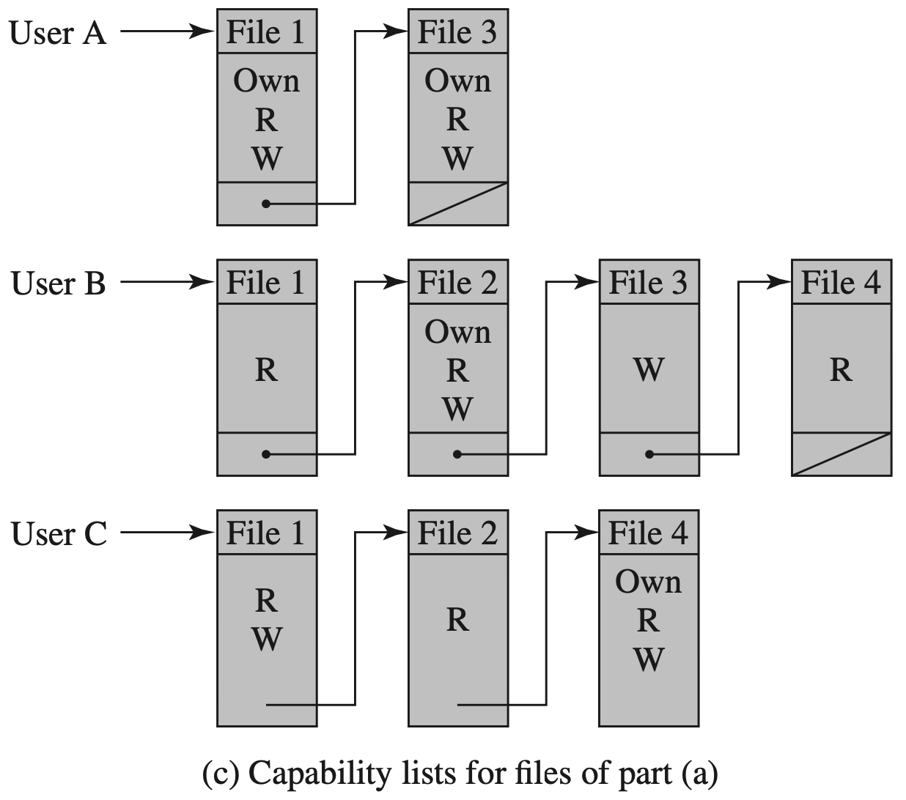

Zentrales Element der Computersicherheit.

**Ziel**: Verhindern, dass unauthorisierte User Zugriff auf Ressourcen haben bzw. verhindern dass legitimierte User auf unautorisierte weise auf Resourcen Zugriffen (z.B. überschreiben von Daten ist nicht erlaubt, lesen aber schon)

> Access control implements a security policy that specifies who or what (e.g., in the case of a process) may have access to each specific system resource and the type of access that is permitted in each instance.

**Ressourcen**:

- Dateien
- Netzwerkverbindungen
- Speicherbereiche
- Geräte

Unterscheidung:

- **Authentication** (Authentifizierung): Identität feststellen (Username/Passwort)

- **Authorisation** (Autorisierung): Die Zuerkennung von Rechten zu bestimmten Resourcen (z.B. Datei) und Nutzungsarten (z.B.: lesen/schreiben)

**Authentifizierung** bestimmt ob ein User überhaupt Zugang zum System hat. Durch die **Autorisierung** stehen diesem User dann bestimmte Resourcen offen oder es wird der Zugang verwehrt.

# Allgemeines

Jedes Betriebssystem hat eine eingebaute Form der Zugriffskontrolle, lässt sich häufig durch Konfiguration bzw. Installation von Komponenten erweitern. 

Grundideen:

- **Objekt**: Ressource auf die der Zugriff geregelt wird
- **Subjekt**: greift auf das Objekt zu, dies ist meist ein Prozess (der einem bestimmten User zugeordnet ist).
- **Zugriffsrechte** (access rights/privileges): Beschreibt zulässige Zugriffe eines Subjekts auf ein Objekt

Typischerweise gibt es 3 Klassen von Subjekten:

- Owner
- Group
- World

Zugriffsrechte:

- Read
- Write
- Execute
- Delete
- Create
- Search (z.B. directory ansehen mit `ls`)

# Discretionary Access Control

Die häufigste Form.

Zugriffsrechte können als Tabelle dargestellt werden:

Andere (speichersparende) Darstellung – **access control lists** (ACLs)

Ist eher die User-Sicht interessant ist die Darstellung als **capability ticket** geeignet:

Das Betriebssystem verwaltet diese Listen und sorgt dafür, dass diese nicht gefälscht bzw. umgangen werden können.

